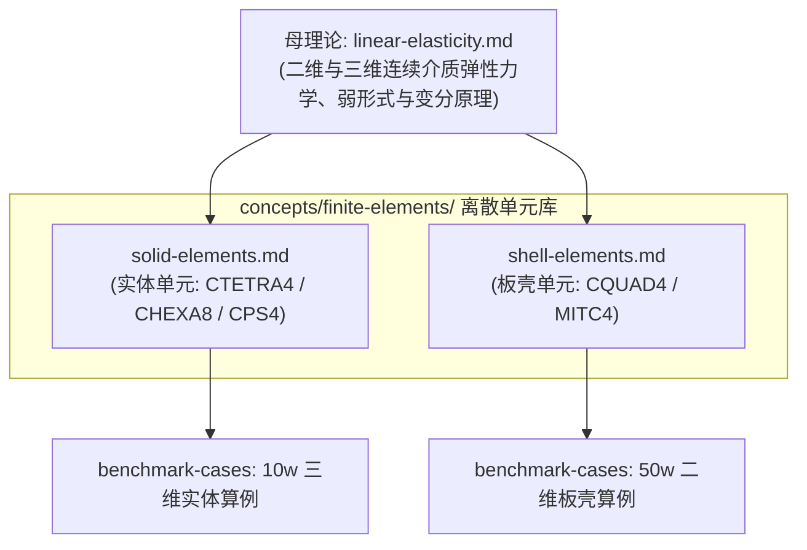

# 概念页总索引

> 跨多个来源提炼的稳定概念与数学基础。本目录**按方法体系与研究领域逻辑分节，全库扁平直达，子目录下不设二级 `_index.md`**：判据是「把某条研究线整个删掉，这一页是否仍然成立」——成立的是通用基础；针对特定体系的稳定概念分类归入对应子目录，并在本页集中索引。简单概念模板：[[../schema/templates/concept-note]]。

---

## 1. 连续介质力学与离散母理论

被多条技术线共同依赖的连续模型、外载荷与非线性离散代数，保持在 `concepts/` 顶层。

| 页面 / 概念 | 说明 |
|---|---|
| [[linear-elasticity\|Linear Elasticity / 位移型线弹性]] | 小变形静力各向同性线弹性（二维与三维）的强形式、弱形式与 Lagrange 有限元离散，全库弹性力学母理论 |
| [[external-loads\|External Loads / 外载荷与等效节点力]] | 体力、面牵引与集中力的所属对偶空间与载荷泛函有界性、纯 Neumann 相容性、集中力非适定性与特征尺度分布化、一致节点力与 $P_1$ 迹 $L^2$ 投影 |
| [[nonlinear-fem\|Nonlinear FEM / 几何与材料非线性]] | 放松小变形与线性本构假设后的残量方程与 Newton 求解；几何非线性（Green-Lagrange、几何刚度、共旋格式）与材料非线性（路径相关性、返回映射、内变量）的分野 |
| [[exact-substructural\|Exact Substructure FEM / 精确子结构分析]] | 相对 PIML 子结构的精确基准：非重叠子结构内部消元（Schur 补）与完整接口分析（full_trace），接口迹降阶粗单元（linear_corner），及其变分势能等价性、迹降阶的 Ritz 偏硬性与分片检验（Patch Test）|

---

## 2. 有限元单元算子体系

维护各类有限元离散单元在局部单元级的**形函数构造、应变算子、抗自锁技术与局部刚度矩阵计算闭环**。



| 页面 / 概念 | 说明 |
|---|---|
| [[finite-elements/solid-elements\|Solid Elements / 实体单元体系]] | `CTETRA4` / `CHEXA8` / `CPS4` 等 2D/3D 实体单元，每节点 $2\sim 3$ 平移自由度；常应变解析求积与标准高斯数值积分 |
| [[finite-elements/shell-elements\|Shell Elements / 板壳单元体系]] | `CQUAD4` / `CTRIA3` 等 2D 流形板壳单元，每节点 6 自由度；Reissner–Mindlin 运动学、非协调膜元、Drilling 稳定项与 MITC4 边中点剪切张量混合插值 |

---

## 3. 线性方程组求解器体系

大型稀疏方程组 $\mathbf A\mathbf x=\mathbf b$ 求解器体系：只负责分类树、收敛机制与信息需求，不含非线性 Newton 外层。

```text
求解线性方程组 A x = b
├── 直接法：LU / Cholesky 分解 —— MUMPS、CPardiso、PCLU          → direct-methods
└── 迭代法
    ├── 定常（经典）迭代：Jacobi、Gauss-Seidel、SOR、Richardson  → stationary-iterations
    ├── Krylov 子空间方法：CG、MINRES、GMRES、BiCGSTAB            → krylov-subspace-methods
    └── 多重网格：几何 / 代数 MG —— HYPRE BoomerAMG               → multigrid
```

| 判定线 | 一侧 | 另一侧 |
|---|---|---|
| 是否显式形成 $\mathbf A$ 的分解 | 直接法：形成 $\mathbf L\mathbf U$ 或 $\mathbf L\mathbf L^{\mathsf T}$，一次分解后回代 | 迭代法：只用 $\mathbf A$ 作用于向量的结果 |
| 每步作用的算子是否固定 | 定常迭代：$\mathbf G$ 与 $k$ 无关，收敛率被 $\rho(\mathbf G)$ 锁死 | Krylov：在不断长大的子空间里取最优解，有效算子随 $k$ 变化 |
| 是否跨尺度传递误差 | 单层方法：只在同一网格上迭代 | 多重网格：高频分量在细网格消去，低频分量交给粗网格 |

| 页面 / 概念 | 说明 |
|---|---|
| [[linear-solvers/linear-solvers-architecture\|Linear Solvers Architecture / 线性求解器体系架构]] | 线性代数求解器总览：三条本质判定线、四层代数协同架构、预条件枢纽与拓扑优化选型决策体系 |
| [[linear-solvers/direct-methods\|Direct Methods / 稀疏直接解法]] | LU / Cholesky 稀疏直接法：填充、排序、多右端复用、三维不可行的根源，以及 MUMPS / PARDISO / CPardiso 的并行模型、三阶段接口与 GPU 支持对照 |
| [[linear-solvers/stationary-iterations\|Stationary Iterations / 定常迭代法]] | 定常迭代 $\mathbf x_{k+1}=\mathbf G\mathbf x_k+\mathbf c$：分裂格式、谱半径判据与高频误差平滑性质 |
| [[linear-solvers/krylov-subspace-methods\|Krylov Subspace Methods / Krylov 子空间方法]] | Krylov 子空间投影法：CG / MINRES / GMRES 分族、收敛界、与定常迭代的区别、并行内积同步点 |
| [[linear-solvers/preconditioning\|Preconditioning / 预条件技术]] | 预条件的形式、目标与各类预条件子对矩阵信息的需求 |
| [[linear-solvers/multigrid\|Multigrid / 多重网格方法]] | 几何 / 代数多重网格：光滑—限制—粗校正—延拓骨架，作为独立求解器或最优预条件子 |

---

## 4. 矩阵无关求解（Matrix-Free）

算子数据保存到哪一层的实现谱系；统一采用 `FA/TA → LA → EA/EbE → PA/QA → UA/NONE` 五级口径。

```text
x (T-vector, true DOF)
  --P--> L (进程局部 DOF) --G--> E (单元 DOF) --B--> Q (积分点)
  --D--> Q
  --B^T--> E --G^T--> L --P^T--> y (T-vector)
```

| 页面 / 概念 | 说明 |
|---|---|
| [[matrix-free/assembly-levels\|Assembly Levels / 五级装配层次]] | Matrix-Free 五级装配层次、跨框架术语映射、预计算前缘、跨层级不变量和判定边界 |
| [[matrix-free/mf-ea-substructural\|Substructural EA Matrix-Free / 子结构载体 EA 算子]] | 子结构载体 EA Matrix-Free 算子：算子定义、与显式装配的代数恒等、自由子空间语义与 PIML 接入点 |
| [[matrix-free/method-lineage\|Matrix-Free Method Lineage / 团队方法谱系]] | 郭旭老师团队公开 Matrix-Free 相关成果的方法谱系；当前直接节点为 Ma2026（多尺度形函数按需重算/释放） |

---

## 5. 异构计算与 GPU/HPC

统一异构执行模式分类、并行层级坐标、端到端性能模型与异构并行技术。

| 页面 / 概念 | 说明 |
|---|---|
| [[gpu-hpc/distributed-operator-and-shared-dofs\|Distributed Operator / 分布式算子]] | MPI 单元分区、共享自由度、输入同步与输出归约、加权 Krylov 内积和全局解收集；第一原理基础 |
| [[gpu-hpc/parallel-levels\|Parallel Levels / 并行的三个层级]] | 进程（MPI）、线程（节点内）、设备内（SIMT）各自切什么、撞什么墙；与装配层级正交的第二坐标轴 |
| [[gpu-hpc/heterogeneous-execution-modes\|Heterogeneous Modes / 异构执行模式]] | 硬件拓扑、执行层级、编程模型与数据精度四维坐标体系，划分单 GPU、多 GPU 及异构协同策略 |
| [[gpu-hpc/performance-model\|Performance Model / 端到端性能模型]] | 五级计时模型（kernel、MatVec、solve、优化迭代、完整任务）、Roofline 分析与强弱扩展评测口径 |
| [[gpu-hpc/reference-libraries/fealpy-architecture\|FEALPy Architecture / 参考库架构]] | FEALPy 4.0 总体架构、张量化设计、底层数据结构与与 SOPTX 衔接接口 |
| [[gpu-hpc/reference-libraries/mfem-architecture\|MFEM Architecture / 参考库架构]] | MFEM 百亿亿次高阶有限元架构、四级装配实现、GPU 内核映射与对标分析 |

---

## 6. 机器学习与 PIML

通用机器学习在力学中的定位，以及 Problem-Independent Machine Learning (PIML，问题无关机器学习) 范式。

```text
rho^j -> K^j -> (N_exact^j, K_s,exact^j)
      -> (N_hat^j 或 K_s,hat^j)
      -> 全局接口系统 -> 细尺度恢复与下游验证
```

| 页面 / 概念 | 说明 |
|---|---|
| [[machine-learning\|Machine Learning / 机器学习分类与生命周期]] | 以模型族与架构、学习对象、训练信号与任务目标四个正交维度定位 ML 方法，并提供通用生命周期与 5 阶段执行骨架 |
| [[ml-roles-and-boundaries\|ML Roles & Boundaries / 计算力学 ML 6 大路线]] | 横向比较计算力学中 6 大机器学习路线（Lei2018、FE-CNN、PINN、PIML、本构学习、生成设计）的作用位置与计算角色 |
| [[pinn-paradigm\|PINN / 物理信息神经网络通用范式]] | 基于自动微分与物理残差 Loss 的无网格求解通用 5 步范式与计算力学 ML 入门映射 |
| [[piml/piml-paradigm\|PIML Paradigm / 问题无关机器学习分类与计算流程]] | 定义问题无关性与加速收益条件；按载体、学习对象、输出表示、训练与结构保持、子结构变体五个维度分类；通用 5 步计算流程；Huang2022 至 Guo2026 的文献谱系与逐篇归类 |
| [[piml/piml-substructural\|Substructural PIML / 基于 PIML 的子结构分析]] | 问题定义与学习映射、样本与精确局部问题、训练目标与物理约束、预测局部算子构造（含局部代理误差）、全局耦合与位移恢复 |
| [[piml/reference-libraries/fealpy-sciml-architecture\|FEALPy SciML Architecture / 参考库架构]] | FEALPy `fealpy.ml` 的自动微分残差算子、配点采样器、网格—网络绑定容器与可视化导出链 |

---

## 7. 结构拓扑优化理论

聚焦连续变密度法、显式组件法以及混合元拓扑优化的理论基础与闭环。

| 页面 / 概念 | 说明 |
|---|---|
| [[density-topopt/regularization-and-length-scale-control\|Regularization & Filter / 正则化与长度尺度控制]] | 变密度法的正则化映射链条（$\rho \to \tilde{\rho} \to \bar{\rho} \to E(\bar{\rho})$）：灵敏度过滤、密度过滤、Heaviside 投影、稳健三场表述与 PDE 过滤 |
| [[density-topopt/stress-constrained-topopt\|Stress-Constrained Topopt / 局部应力约束拓扑优化]] | 局部应力约束的奇异最优解与应力场奇异性、epsilon 松弛与多项式消失约束的数学原理和验收尺度 |
| [[density-topopt/substructural-density-topology-optimization\|Substructural Density Topopt / 子结构变密度拓扑优化闭环]] | 细网格密度保留、内部自由度 Schur 补消元、接口空间求解与伴随灵敏度过滤回传分析 |
| [[huzhang/huzhang-mixed-fem\|Hu–Zhang Mixed FEM / 胡张混合有限元]] | 应力提升为 H(div) 对称张量主未知量的混合元：Hellinger-Reissner 变分、鞍点系统、顶点应力连续性部分松弛、低次跳量稳定化与收敛阶结果 |
| [[mmc/mathematical-foundations\|MMC Foundations / 移动可变形组件数学基础]] | 从显式组件参数、拓扑描述函数（TDF）和多组件并集到 Ersatz 有限元、伴随灵敏度与 MMA 优化闭环 |


---

## 架构原则与维护边界

- **全库 0 二级 `_index.md` 铁律**：全库仅在 7 个一级目录设立 `_index.md`，任何二级子目录一律不建 `_index.md`，本页直接平铺导航所有概念页面；
- **分层依据**：判据是「把某条研究线整个删掉，这一页是否仍然成立」。顶层单页为跨线通用力学与 ML 基础，子目录收录具体方法体系与理论分支；
- **管理边界**：当前任务状态与实施阶段由 `research/` 维护，单篇论文事实由 `literature/` 维护，面向导师与合作者的阶段表达由 `entities/` 维护，已完成事件的历史材料由 `archive/` 维护；本目录专注于自洽且经得起检验的稳定概念。
