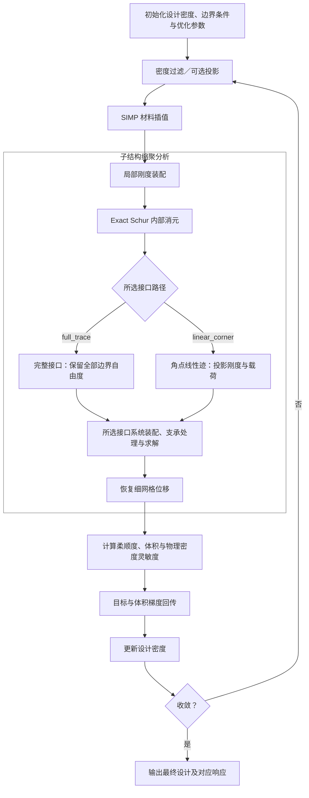

# 子结构缩聚在变密度拓扑优化中的数学闭环

> 子结构缩聚消去内部位移自由度，但保留细网格上的全部密度变量；恢复完整位移后，仍按单元计算柔顺度和灵敏度，再进行过滤回传与设计更新。

本文以 [[../../literature/topopt/piml/translations/Huang2023-PIML-substructure-zh|Huang et al. (2023)]] 的子结构分析与拓扑优化框架为基础，并列讨论 Exact Schur + `full_trace` 与 Exact Schur + `linear_corner`。两者共用密度映射、局部消元和优化更新，只在接口位移空间上不同。静力缩聚的详细推导见[[../substructural-condensation|子结构有限元与静力缩聚]]，过滤与投影的定义见[[regularization-and-length-scale-control|正则化与长度尺度控制]]。

## 1. 优化模型与设计变量

考虑固定网格、固定子结构划分下的二维或三维线弹性柔顺度最小化。外载与设计无关，支承为位置固定的齐次 Dirichlet 条件；局部内部刚度块可逆，约束后的接口系统对称正定。主线取内部载荷为零，支承作用于保留的完整边界自由度；角点路径还要求相邻子结构的线性迹兼容。

原始设计变量 $\mathbf x$、过滤密度 $\widetilde{\boldsymbol\rho}$ 和物理密度 $\overline{\boldsymbol\rho}$ 的关系为

$$
\widetilde{\boldsymbol\rho}=\mathbf F\mathbf x,
\qquad
\overline{\boldsymbol\rho}=\mathcal P(\widetilde{\boldsymbol\rho}),
$$

其中 $\mathbf F$ 为密度过滤矩阵，$\mathcal P$ 为可选的逐单元光滑投影；不使用投影时取恒等映射。设 $v_e$ 为细单元测度，$V_0=\sum_e v_e$，允许体积分数为 $v_\star$，则

$$
\begin{aligned}
\min_{\mathbf x}\quad &C(\mathbf x)=\mathbf f^{\mathsf T}\mathbf u,\\
\text{满足}\quad
&\mathbf K_T(\overline{\boldsymbol\rho})\mathbf Q=\mathbf F_T,\\
&V(\mathbf x)=\sum_e v_e\overline\rho_e\le v_\star V_0,\\
&x_{\min}\le x_e\le1.
\end{aligned}
$$

$\mathbf K_T$、$\mathbf F_T$ 和 $\mathbf Q$ 分别是所选接口空间上的刚度、载荷与位移坐标，$\mathbf u$ 是恢复后的细网格位移，具体见第 2 节。方程在施加支承后的独立坐标空间上理解。以下 $C$ 和 $\mathbf u$ 均指当前选定路径的结果，不预设两条路径同解。$x_{\min}$ 是设计变量下界，与材料刚度下界 $E_{\min}$ 不同。

每个细单元只属于一个子结构。记其单元集合为 $\mathcal E_j$，Boolean 矩阵 $\mathbf P_j$ 按局部单元顺序提取物理密度：

$$
\overline{\boldsymbol\rho}^{\,j}=\mathbf P_j\overline{\boldsymbol\rho},
\qquad
\sum_j\mathbf P_j^{\mathsf T}\mathbf P_j=\mathbf I.
$$

缩聚减少的是参与全局求解的位移未知量，不是设计变量；一个子结构内的非均匀密度不能用平均密度替代。

## 2. 密度相关的子结构分析

### 2.1 局部刚度与缩聚

固定泊松比，采用带正刚度下界的 SIMP 插值：

$$
\mathbf K_e(\overline\rho_e)
=\left[E_{\min}+(E_0-E_{\min})\overline\rho_e^{\,p}\right]\mathbf K_e^0,
\qquad
0<E_{\min}<E_0,\quad p>1,
$$

其中 $\mathbf K_e^0$ 是单位 Young 模量下的单元刚度。令 $\mathbf B_{e,j}$ 从子结构完整位移中提取单元位移，则

$$
\mathbf K^j
=\sum_{e\in\mathcal E_j}\mathbf B_{e,j}^{\mathsf T}\mathbf K_e\mathbf B_{e,j}
=\begin{bmatrix}
\mathbf K_{ii}^j&\mathbf K_{ib}^j\\
\mathbf K_{bi}^j&\mathbf K_{bb}^j
\end{bmatrix}.
$$

下标 $i$、$b$ 分别表示内部与完整边界自由度。沿用缩聚基础页的记号，

$$
\mathbf N_{\mathrm{int}}^j=-(\mathbf K_{ii}^j)^{-1}\mathbf K_{ib}^j,
\qquad
\mathbf H_j=\begin{bmatrix}\mathbf N_{\mathrm{int}}^j\\\mathbf I\end{bmatrix},
$$

$$
\mathbf K_s^j
=\mathbf K_{bb}^j-\mathbf K_{bi}^j(\mathbf K_{ii}^j)^{-1}\mathbf K_{ib}^j
=\mathbf H_j^{\mathsf T}\mathbf K^j\mathbf H_j.
$$

$\mathbf K^j$、$\mathbf H_j$ 和 $\mathbf K_s^j$ 均随当前物理密度更新。固定网格可复用几何数据和索引，但一般不能复用旧密度下的数值分解与缩聚矩阵。逆矩阵记号表示线性方程求解，实际使用分解与回代。

### 2.2 两种接口路径

以 $\mathbf T_j$ 表示局部接口迹基，$\mathbf q_j$ 为其坐标，统一写成

$$
\mathbf u_b^j=\mathbf T_j\mathbf q_j,
\qquad
\mathbf K_r^j=\mathbf T_j^{\mathsf T}\mathbf K_s^j\mathbf T_j,
\qquad
\mathbf f_r^j=\mathbf T_j^{\mathsf T}\mathbf f_b^j.
$$

$\mathbf T_j$ 固定且与密度无关。两条路径的具体取值为

| 路径 | 迹基 $\mathbf T_j$ | 局部刚度 $\mathbf K_r^j$ | 全局坐标 $\mathbf Q$ | 局部提取 $\mathbf G_j$ |
|---|---|---|---|---|
| 完整接口 `full_trace` | $\mathbf I$ | $\mathbf K_s^j$ | 完整接口位移 $\mathbf U_\Gamma$ | $\mathbf A_j$ |
| 角点线性迹 `linear_corner` | $\mathbf L_j$ | $\mathbf K_c^j=\mathbf L_j^{\mathsf T}\mathbf K_s^j\mathbf L_j$ | 全局角点位移 $\mathbf U_C$ | $\mathbf A_{c,j}$ |

完整接口路径保留全部边界自由度。角点线性迹路径则用 $\mathbf L_j$ 将角点位移插值到完整边界：二维规则四边形采用双线性迹，三维规则六面体采用三线性迹。这是接口空间近似，不是 PIML；两条路径的内部消元均为 Exact Schur。

$\mathbf G_j$ 是从所选全局坐标中提取局部坐标的 Boolean 矩阵，即 $\mathbf q_j=\mathbf G_j\mathbf Q$。它负责共享自由度编号，$\mathbf T_j$ 负责局部边界插值，两者不能混用。

### 2.3 统一装配与细网格恢复

两条路径均通过

$$
\mathbf K_T=\sum_j\mathbf G_j^{\mathsf T}\mathbf K_r^j\mathbf G_j,
\qquad
\mathbf F_T=\sum_j\mathbf G_j^{\mathsf T}\mathbf f_r^j,
\qquad
\mathbf K_T\mathbf Q=\mathbf F_T
$$

完成全局求解。$\mathbf f_b^j$ 是一致分配的物理外载，同一载荷只计一次；角点路径通过 $\mathbf T_j^{\mathsf T}\mathbf f_b^j$ 保持虚功一致，而不是直接把载荷移到最近角点。

支承也须在所选空间中满足。若 $\mathbf D_j$ 提取受约束的局部边界分量，则要求 $\mathbf D_j\mathbf T_j\mathbf G_j\mathbf Q=\mathbf0$，一般不等于固定几个角点编号。可用固定零空间基 $\mathbf Z$ 写成 $\mathbf Q=\mathbf Z\mathbf y$，实际求解 $\mathbf Z^{\mathsf T}\mathbf K_T\mathbf Z\mathbf y=\mathbf Z^{\mathsf T}\mathbf F_T$；以下省略这一约束投影。若支承落在已消元内部自由度上，应先在局部处理，或将其提升为保留自由度并相应调整迹基。

求解后按同一表达恢复

$$
\mathbf u^j=\mathbf H_j\mathbf T_j\mathbf G_j\mathbf Q,
\qquad
\mathbf u_e=\mathbf B_{e,j}\mathbf u^j,
$$

其中完整接口路径取 $\mathbf H_j\mathbf A_j\mathbf U_\Gamma$，角点路径取 $\mathbf H_j\mathbf L_j\mathbf A_{c,j}\mathbf U_C$。相邻子结构的公共接口位移应一致，恢复时不重复相加。

各路径自身的柔顺度均满足

$$
C=\mathbf f^{\mathsf T}\mathbf u
=\sum_j\sum_{e\in\mathcal E_j}\mathbf u_e^{\mathsf T}\mathbf K_e\mathbf u_e
=\mathbf F_T^{\mathsf T}\mathbf Q.
$$

柔顺度是应变能的两倍。内部自由度虽已消元，其单元能量和灵敏度仍需计入。

## 3. 两种路径的统一灵敏度

### 3.1 从各自的接口方程求导

内部载荷为零，且外载、$\mathbf T_j$、$\mathbf G_j$ 和支承空间固定时，$\mathbf F_T$ 与密度无关。在约束后的独立坐标中，对所选路径的状态方程求微分：

$$
\mathbf K_T\,\mathrm d\mathbf Q=-(\mathrm d\mathbf K_T)\mathbf Q,
\qquad
\mathrm dC=\mathbf F_T^{\mathsf T}\mathrm d\mathbf Q
=-\mathbf Q^{\mathsf T}(\mathrm d\mathbf K_T)\mathbf Q.
$$

这是各路径自身的柔顺度自伴随关系。角点路径恢复的位移一般不满足原细网格的全部平衡方程，不能直接把它代入 $\mathbf K\mathbf u=\mathbf f$ 来证明梯度。

虽然 $\mathbf H_j$ 随密度变化，但精确内部平衡给出

$$
\mathbf K^j\mathbf H_j
=\begin{bmatrix}\mathbf0\\\mathbf K_s^j\end{bmatrix},
\qquad
\mathrm d\mathbf H_j
=\begin{bmatrix}\mathrm d\mathbf N_{\mathrm{int}}^j\\\mathbf0\end{bmatrix}.
$$

因此，对 $\mathbf K_s^j=\mathbf H_j^{\mathsf T}\mathbf K^j\mathbf H_j$ 求导时，含 $\mathrm d\mathbf H_j$ 的两项均为零。再利用 $\mathrm d\mathbf T_j=\mathbf0$，得到

$$
\mathrm d\mathbf K_s^j=\mathbf H_j^{\mathsf T}(\mathrm d\mathbf K^j)\mathbf H_j,
\qquad
\mathrm d\mathbf K_r^j
=(\mathbf H_j\mathbf T_j)^{\mathsf T}(\mathrm d\mathbf K^j)(\mathbf H_j\mathbf T_j).
$$

代入全局柔顺度微分，

$$
\mathrm dC
=-\sum_j(\mathbf G_j\mathbf Q)^{\mathsf T}
(\mathrm d\mathbf K_r^j)(\mathbf G_j\mathbf Q)
=-\sum_j(\mathbf u^j)^{\mathsf T}(\mathrm d\mathbf K^j)\mathbf u^j.
$$

这说明两条路径都可先恢复细网格位移，再按单元求导，无需逐个构造 Schur 补导数。关键是精确内部消元和固定迹基，而非忽略恢复算子的密度依赖。

### 3.2 单元梯度与适用条件

SIMP 下的物理密度梯度统一为

$$
q_e:=\frac{\partial C}{\partial\overline\rho_e}
=-\mathbf u_e^{\mathsf T}
\frac{\partial\mathbf K_e}{\partial\overline\rho_e}\mathbf u_e
=-p(E_0-E_{\min})\overline\rho_e^{\,p-1}
\mathbf u_e^{\mathsf T}\mathbf K_e^0\mathbf u_e.
$$

两条路径使用相同的公式，但代入各自恢复的 $\mathbf u_e$，因此梯度通常不同。角点路径得到的是角点线性迹模型的一致梯度，不是完整接口模型的精确梯度。这里 $q_e$ 是标量梯度分量，与局部迹坐标 $\mathbf q_j$ 区分。

**内部载荷非零时**，两条路径都需使用缩聚载荷和仿射恢复：

$$
\mathbf f_r^j=\mathbf T_j^{\mathsf T}\widetilde{\mathbf f}_b^j,
\qquad
\mathbf u^j=
\begin{bmatrix}\mathbf w_i^j\\\mathbf0\end{bmatrix}
+\mathbf H_j\mathbf T_j\mathbf G_j\mathbf Q.
$$

$\widetilde{\mathbf f}_b^j$ 和 $\mathbf w_i^j$ 的定义见[[../substructural-condensation#2.2 内部恢复、非零内部载荷与列问题|缩聚基础页]]。此时

$$
C=\mathbf F_T^{\mathsf T}\mathbf Q+c_0,
\qquad
c_0=\sum_j(\mathbf f_i^j)^{\mathsf T}(\mathbf K_{ii}^j)^{-1}\mathbf f_i^j.
$$

即使原始外载固定，$\mathbf F_T$ 和 $c_0$ 也可能随密度变化，缩聚空间求导时不能漏掉它们的导数。固定迹空间下，使用各自的仿射恢复位移，单元梯度公式仍成立。设计相关迹基、近似内部恢复、设计相关载荷、非零强制位移和非自伴随目标需另行推导。

## 4. 过滤回传与 OC 更新

局部梯度按细单元编号回填，再经过与前向密度映射对应的链式法则：

$$
\mathbf q=\sum_j\mathbf P_j^{\mathsf T}\mathbf q^j,
\qquad
\mathbf D_{\mathcal P}=\operatorname{diag}\bigl(\mathcal P'(\widetilde\rho_e)\bigr),
$$

$$
\nabla_{\mathbf x}C=\mathbf F^{\mathsf T}\mathbf D_{\mathcal P}\mathbf q,
\qquad
\nabla_{\mathbf x}V=\mathbf F^{\mathsf T}\mathbf D_{\mathcal P}\mathbf v.
$$

这里 $\mathbf v=(v_e)$，投影参数在本次求导中固定。过滤邻域按细网格上的物理距离定义，不能在子结构边界截断；行归一化后的 $\mathbf F$ 通常不对称，回传必须使用转置。体积由物理密度计算，其梯度也需回传。灵敏度过滤是另一种搜索方向修正，不能与上述密度过滤导数混用。

记 $g_e=\partial C/\partial x_e$、$h_e=\partial V/\partial x_e$。在 $g_e\le0$、$h_e>0$ 的常见柔顺度情形，带移动限的 OC 更新为

$$
x_e^{k+1}(\lambda)
=\operatorname{clip}_{[\ell_e^k,b_e^k]}
\left[x_e^k\left(\frac{-g_e}{\lambda h_e}\right)^{\eta_{\mathrm{OC}}}\right],
$$

$$
\ell_e^k=\max(x_{\min},x_e^k-m),
\qquad
b_e^k=\min(1,x_e^k+m),
$$

其中 $m$ 为移动限，$\eta_{\mathrm{OC}}$ 常取 $1/2$。通过调整 $\lambda>0$ 满足体积约束，每次试探都计算实际物理体积

$$
V^{\mathrm{trial}}
=\mathbf v^{\mathsf T}\mathcal P\!\left(\mathbf F\mathbf x^{k+1}(\lambda)\right).
$$

固定梯度、非负过滤和单调投影下，试探体积随 $\lambda$ 单调不增；目标体积在本步可达范围内时可用二分法。零体积梯度、不可达体积及零设计变量需单独处理。OC 是更新策略，不是原非凸问题的精确解。

## 5. 共同优化循环与两条路径的差别

一次优化固定选择一条分析路径。图中的分支二选一，汇合表示共用后续步骤，不是将两种解相加。

每轮密度更新后重新进行局部缩聚、所选接口空间的装配求解与位移恢复；密度过滤和 OC 规则不因路径而变。最终柔顺度应与最终交付密度对应，不能将更新后的密度配上更新前的分析结果。

**完整接口路径**满足[[../substructural-condensation#2.6 “精确等价”的条件与边界|精确缩聚条件]]时，与同一细网格 FA 在固定密度下具有相同位移、柔顺度和灵敏度。初值及确定性更新规则相同时，精确算术下的迭代序列也相同；浮点实现按容差比较，不要求逐位一致。

**角点线性迹路径**是完整接口模型的 Ritz 子空间近似。在同一物理密度、同一外载、相容齐次支承及对称正定条件下，

$$
C_{\mathrm{full}}-C_L
=\|\mathbf u_{\mathrm{full}}-\mathbf u_L\|_{\mathbf K}^{\,2}\ge0.
$$

这里两种位移均已恢复到细网格，$\mathbf K$ 为原细网格刚度。角点模型通常偏硬，其梯度与优化轨迹不必等于 FA；这一同密度关系也不能直接比较两个不同最终设计的优劣。

数值核查应先在同一密度下比较两种分析结果，并分别用各自的目标做有限差分；再比较单步更新和优化历史。角点路径出现非零完整接口残差不一定是实现错误，应检查所选迹空间中的平衡及局部内部平衡。

## 参考文献

- [[../../literature/topopt/piml/translations/Huang2023-PIML-substructure-zh|Huang et al. (2023) 中文译文]]：子结构分析与拓扑优化的基本框架。`refs.bib` cite key：`huangProblemindependentMachineLearning2023`。
- [[../substructural-condensation|子结构有限元与静力缩聚]]、[[regularization-and-length-scale-control|正则化与长度尺度控制]]：缩聚与密度映射的符号和基础。
- Andreassen E, Clausen A, Schevenels M, et al. *Efficient topology optimization in MATLAB using 88 lines of code*. Structural and Multidisciplinary Optimization, 2011, 43: 1–16。[DTU 官方论文与代码入口](https://www.topopt.mek.dtu.dk/apps-and-software/efficient-topology-optimization-in-matlab)：SIMP、过滤和 OC 的参考，本库尚无独立文献页。
- [[../piml/piml-substructural|子结构 PIML]]：近似局部表示与结构保持。
- [[../matrix-free/mf-ea-substructural|子结构载体 EA Matrix-Free 算子]]：局部算子的全局作用方式。
- [[../../research/piml-matrix-free-gpu/project-plan|项目计划]]：研究任务与验证状态。
