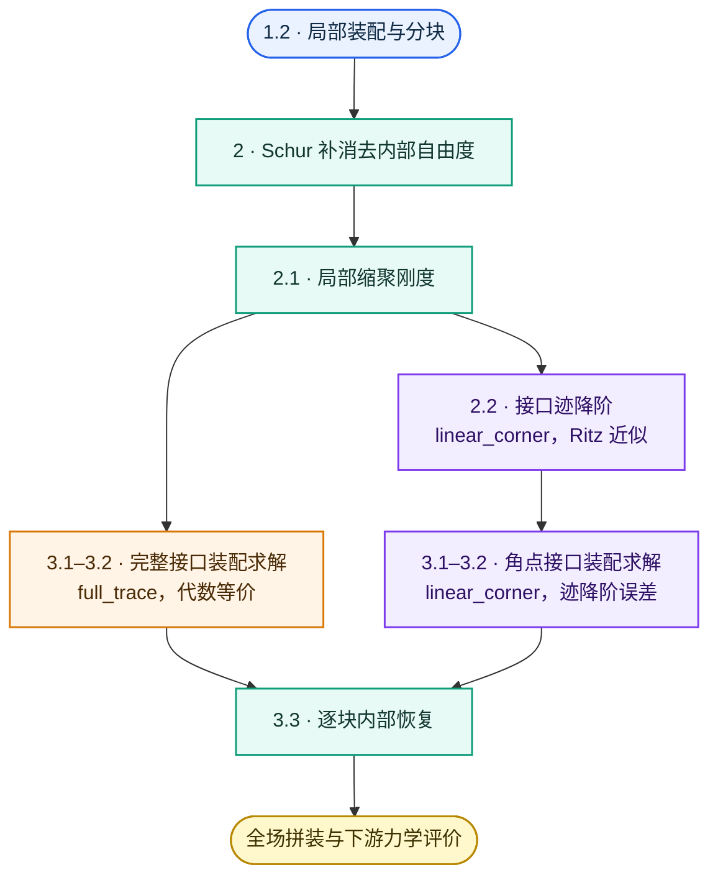

# 精确子结构分析

子结构有限元与静力缩聚（Static Condensation）通过局部分块高斯消元（Schur 补）消去各子结构的内部自由度，将大规模代数系统严格等价地凝聚到全域接口骨架（interface skeleton）$\Gamma=\bigcup_j\partial\Omega^j$ 上。在此基础上可进一步把接口位移限制在低维迹空间（interface trace space，如角点低阶多项式、特征模态或 POD 降阶基）内取势能极小。这一步不再代数等价：所得粗解是真解在该子空间中能量范数意义下的最佳逼近（即 $\min_{\mathbf v\in\mathcal V}\|\mathbf u-\mathbf v\|_{\mathbf K}$），模型偏硬，柔度给出下界。

本页限定于沿单元边界划分、接口协调的**非重叠**子结构与小应变线弹性静力问题；重叠型区域分解（overlapping domain decomposition）与非协调接口（non-conforming interface）不适用本页的消元与装配公式。

## 1. 问题定义与适用假设

### 1.1 子结构划分与边界集合

子结构是一组细网格单元，不是一个大单元；划分不改变细网格，也不断开相邻部分。

![[substructure-partition.svg]]

图中结构沿 $x,y,z$ 分为 $12\times4\times4=192$ 个子结构，每个子结构含 $4\times4\times4$ 个一阶六面体单元、$5^3=125$ 个节点。第三幅沿 $z$ 分层展开：顶、底两层各 25 个节点全部位于子结构边界，中间三层各有 16 个边界节点和 9 个内部节点，合计内部节点 27 个、边界节点 98 个，对应 81 个内部自由度和 294 个边界自由度。缩聚消去蓝色内部节点的位移，保留红色边界节点的位移。

按全局计，细网格共 $48\times16\times16$ 个单元、$49\times17\times17=14161$ 个节点。扣除 $192\times27=5184$ 个内部节点后，接口骨架 $\Gamma$ 上保留 8977 个节点，约为总数的 63%；角点接口只有 $13\times5\times5=325$ 个节点。三维小子结构的接口节点占多数，所以单独做完整接口缩聚不会显著减小规模。主要收益来自逐块并行、复用，以及后续的迹降阶（§2.2）。

设线弹性域 $\Omega\subset\mathbb R^d$（$d=2,3$）被划分为 $M$ 个子结构 $\Omega^j$。非重叠指子结构内部互不相交，闭包允许在公共接口相交：

$$
\overline\Omega=\bigcup_{j=1}^{M}\overline{\Omega^j},
\qquad
(\Omega^j)^\circ\cap(\Omega^k)^\circ=\varnothing
\quad(j\ne k).
$$

子结构边界之并称为接口骨架（interface skeleton），相邻子结构共享的部分称为内部接口（interior interface）：

$$
\Gamma=\bigcup_{j=1}^{M}\partial\Omega^j,
\qquad
\Gamma_{\mathrm{int}}=\bigcup_{j<k}\left(\partial\Omega^j\cap\partial\Omega^k\right).
$$

子结构边界节点包括面内节点、棱上节点和角点，既含 $\Gamma_{\mathrm{int}}$ 上的部分，也含落在外边界 $\partial\Omega$ 上的部分；完整接口缩聚保留 $\Gamma$ 上的全部位移自由度，§3.1 的 $\mathbf U_\Gamma$、$\mathbf K_\Gamma$、$\mathbf F_\Gamma$ 均以 $\Gamma$ 为下标。保留边界位移不等于固定边界，约束仍由原问题决定。公共边界节点由邻块共享，全局接口自由度不能按每块边界自由度乘块数计算。

外边界分为 Dirichlet 与 Neumann 部分：

$$
\partial\Omega=\overline{\Gamma_D}\cup\overline{\Gamma_N},
\qquad
\Gamma_D\cap\Gamma_N=\varnothing.
$$

$\Gamma_{\mathrm{int}}$ 上的接口力是相邻子结构之间未知的作用—反作用，全局装配时成对抵消；$\Gamma_N$ 上的面力是已知输入，按不相交分割 $\Gamma_N=\bigsqcup_j\left(\Gamma_N\cap\partial\Omega^j\right)$ 逐块积分，同一载荷只计入一次。

### 1.2 局部问题与适用假设

以下考虑小应变线弹性静力问题。子结构按 §1.1 非重叠划分，公共界面上的有限元迹逐自由度严格匹配，即节点重合、单元面一致。对第 $j$ 个子结构，设边界与内部自由度数分别为 $n_b^j$、$n_i^j$，自由度按“边界—内部”顺序排列，局部细网格刚度为

$$
\mathbf K^j=
\begin{bmatrix}
\mathbf K_{bb}^j & \mathbf K_{bi}^j\\
\mathbf K_{ib}^j & \mathbf K_{ii}^j
\end{bmatrix},
\qquad
\mathbf K^j\in\mathbb R^{(n_b^j+n_i^j)\times(n_b^j+n_i^j)},
\qquad
\mathbf K_{bi}^j=(\mathbf K_{ib}^j)^{\mathsf T}.
$$

自由漂浮子结构（floating substructure，即 $\partial\Omega^j\cap\Gamma_D=\varnothing$）的 $\mathbf K^j$ 通常因刚体模态而半正定，但这不妨碍 $\mathbf K_{ii}^j$ 可逆。要断言 $\mathbf K_{ii}^j$ 对称正定，至少需要：

- 线弹性材料张量在实体区域上一致正定；密度法中需有严格正的刚度下界；
- 子结构网格连通，且固定完整边界迹后不存在内部机构、孤立分量或零能模式；
- 内部/边界自由度划分正确，局部离散与约束没有秩缺失。

## 2. 基于静力缩聚构造局部缩聚刚度

对每个子结构消去内部自由度、只保留边界自由度，这种做法称为静力缩聚（static condensation）。非重叠划分下，不同子结构的内部自由度之间没有刚度耦合，消元可以逐块独立进行。消元后的局部缩聚刚度是内部块对应的 Schur 补。

### 2.1 局部静力缩聚及其变分形式

#### 2.1.1 局部平衡方程

取子结构 $\Omega^j$ 为隔离体。除原问题的体力与 $\Gamma_N$ 面力外，它还在内部接口 $\partial\Omega^j\cap\Gamma_{\mathrm{int}}$ 上受到相邻子结构的面力 $\mathbf t_{\mathrm{int}}^j$，这个面力是未知的。以 $\mathbf t_{\mathrm{int}}^j$ 作为 Neumann 数据写出 $\Omega^j$ 上的弱形式，用细网格离散，自由度按 “边界—内部” 顺序排列，得到局部平衡方程：

$$
\begin{bmatrix}
\mathbf K_{bb}^j & \mathbf K_{bi}^j\\
\mathbf K_{ib}^j & \mathbf K_{ii}^j
\end{bmatrix}
\begin{bmatrix}
\mathbf u_b^j\\
\mathbf u_i^j
\end{bmatrix}
=
\begin{bmatrix}
\mathbf f_b^j+\boldsymbol\lambda^j\\
\mathbf f_i^j
\end{bmatrix}.
$$

右端 $\mathbf f_i^j$ 为内部节点的体力等效载荷，$\mathbf f_b^j$ 为边界节点的体力与外边界面力等效载荷，$\boldsymbol\lambda^j$ 为未知接口面力的等效节点力，定义为

$$
\boldsymbol\lambda^j=\int_{\partial\Omega^j\cap\Gamma_{\mathrm{int}}}(\mathbf N_b^j)^{\mathsf T}\mathbf t_{\mathrm{int}}^j\,\mathrm ds,
$$

其中 $\mathbf N_b^j$ 为细网格边界节点形函数矩阵。接口力在全局装配时抵消，$\Gamma_D$ 上的给定位移在全局接口系统中施加。

#### 2.1.2 静力缩聚

内部自由度满足

$$
\mathbf K_{ib}^j\mathbf u_b^j+\mathbf K_{ii}^j\mathbf u_i^j
=\mathbf f_i^j.
$$

由 §1.2 的可逆性假设，给定边界位移 $\mathbf u_b^j$ 后，内部位移可写为

$$
\mathbf u_i^j
=
\mathbf w_i^j+\mathbf T_{\mathrm{full}}^j\mathbf u_b^j,
\qquad
\mathbf T_{\mathrm{full}}^j:=-(\mathbf K_{ii}^j)^{-1}\mathbf K_{ib}^j,
\qquad
\mathbf w_i^j:=(\mathbf K_{ii}^j)^{-1}\mathbf f_i^j .
$$

其中 $\mathbf T_{\mathrm{full}}^j$ 为内部位移恢复矩阵，$\mathbf w_i^j$ 为边界固定（$\mathbf u_b^j=\mathbf0$）时内部体力引起的位移。

将上述表达式代入边界平衡方程

$$
\mathbf K_{bb}^j\mathbf u_b^j+\mathbf K_{bi}^j\mathbf u_i^j
=\mathbf f_b^j+\boldsymbol\lambda^j,
$$

整理得

$$
\left(\mathbf K_{bb}^j+\mathbf K_{bi}^j\mathbf T_{\mathrm{full}}^j\right)\mathbf u_b^j
=\mathbf f_b^j-\mathbf K_{bi}^j\mathbf w_i^j+\boldsymbol\lambda^j.
$$

定义缩聚刚度与等效边界载荷：

$$
\mathbf K_s^j
:=
\mathbf K_{bb}^j+\mathbf K_{bi}^j\mathbf T_{\mathrm{full}}^j
=
\mathbf K_{bb}^j-\mathbf K_{bi}^j(\mathbf K_{ii}^j)^{-1}\mathbf K_{ib}^j,
$$

$$
\widetilde{\mathbf f}_b^j
:=
\mathbf f_b^j-\mathbf K_{bi}^j\mathbf w_i^j
=
\mathbf f_b^j+(\mathbf T_{\mathrm{full}}^j)^{\mathsf T}\mathbf f_i^j .
$$

等效载荷的最后一个等号利用了刚度矩阵的对称性；它将内部体力的作用折算到边界，无内部体力时退化为 $\widetilde{\mathbf f}_b^j=\mathbf f_b^j$。由此得到仅以边界位移为位移未知量的缩聚方程：

$$

\mathbf K_s^j\mathbf u_b^j
=\widetilde{\mathbf f}_b^j+\boldsymbol\lambda^j.
$$

缩聚方程还可通过子结构形函数矩阵表示。定义

$$
\mathbf N_{\mathrm{full}}^j
=\begin{bmatrix}\mathbf I\\\mathbf T_{\mathrm{full}}^j\end{bmatrix}.
$$

记局部外载荷向量为 $\mathbf f^j=[(\mathbf f_b^j)^{\mathsf T},(\mathbf f_i^j)^{\mathsf T}]^{\mathsf T}$，则前述缩聚刚度与等效边界载荷可写为

$$
\mathbf K_s^j
=(\mathbf N_{\mathrm{full}}^j)^{\mathsf T}\mathbf K^j\mathbf N_{\mathrm{full}}^j,
\qquad
\widetilde{\mathbf f}_b^j
=(\mathbf N_{\mathrm{full}}^j)^{\mathsf T}\mathbf f^j.
$$

因此，缩聚方程等价地写为

$$
(\mathbf N_{\mathrm{full}}^j)^{\mathsf T}\mathbf K^j\mathbf N_{\mathrm{full}}^j\mathbf u_b^j
=(\mathbf N_{\mathrm{full}}^j)^{\mathsf T}\mathbf f^j+\boldsymbol\lambda^j.
$$

### 2.2 接口迹降阶

静力缩聚保留完整边界位移；接口迹降阶则进一步限制边界位移的可表示范围。

迹（trace）指位移场到子结构边界的限制 $\gamma^j\mathbf u=\mathbf u|_{\partial\Omega^j}$，是 Sobolev 迹算子的离散对应，与矩阵的迹 $\operatorname{tr}(\cdot)$ 无关。设 $\mathbf q^j\in\mathbb R^{n_q^j}$ 为第 $j$ 个子结构的接口坐标，$\boldsymbol\Psi^j\in\mathbb R^{n_b^j\times n_q^j}$ 为局部迹基矩阵（trace basis matrix），$n_q^j\le n_b^j$ 为保留的接口坐标个数（`full_trace` 取 $n_q^j=n_b^j$，`linear_corner` 取 $n_q^j=n_c^j$），边界位移统一写成

$$
\mathbf u_b^j=\boldsymbol\Psi^j\mathbf q^j.
$$

$\operatorname{range}(\boldsymbol\Psi^j)$ 即该子结构的接口迹空间。

设迹基 $\boldsymbol\Psi^j$ 列满秩。为区分完整接口与降阶接口，记 $\mathbf K_{s,\mathrm{full}}^j:=\mathbf K_s^j$。将边界位移表达代入缩聚方程，并左乘 $(\boldsymbol\Psi^j)^{\mathsf T}$，得到

$$
\mathbf K_r^j\mathbf q^j
=\mathbf f_r^j+(\boldsymbol\Psi^j)^{\mathsf T}\boldsymbol\lambda^j,
$$

其中接口刚度、等效载荷与子结构形函数矩阵为

$$
\mathbf K_r^j
=(\boldsymbol\Psi^j)^{\mathsf T}\mathbf K_{s,\mathrm{full}}^j\boldsymbol\Psi^j
=(\mathbf N_r^j)^{\mathsf T}\mathbf K^j\mathbf N_r^j,
\qquad
\mathbf f_r^j=(\boldsymbol\Psi^j)^{\mathsf T}\widetilde{\mathbf f}_b^j,
\qquad
\mathbf N_r^j:=\mathbf N_{\mathrm{full}}^j\boldsymbol\Psi^j.
$$

当 $n_q^j<n_b^j$ 时，这一步是低维接口迹空间上的 Galerkin 投影，一般引入 Ritz 逼近误差。全局耦合还要求相邻子结构的迹表示在公共界面上协调。

#### 2.2.1 完整接口空间

取 $\boldsymbol\Psi^j=\mathbf I_{n_b^j}$、$\mathbf q^j=\mathbf u_b^j$，保留边界上面内、棱上和角点节点的全部细网格自由度，不作接口迹降阶。子结构形函数矩阵为

$$
\mathbf N_{\mathrm{full}}^j
=\begin{bmatrix}\mathbf I\\\mathbf T_{\mathrm{full}}^j\end{bmatrix}.
$$

对应的缩聚刚度与等效载荷为

$$
\mathbf K_{s,\mathrm{full}}^j
=(\mathbf N_{\mathrm{full}}^j)^{\mathsf T}\mathbf K^j\mathbf N_{\mathrm{full}}^j
=\mathbf K_s^j,
\qquad
\mathbf f_r^j=\widetilde{\mathbf f}_b^j
=(\mathbf N_{\mathrm{full}}^j)^{\mathsf T}\mathbf f^j.
$$

它与 §2.1 的静力缩聚结果相同，作为角点接口降阶的精确基准。

#### 2.2.2 角点接口空间

取 $\boldsymbol\Psi^j=\mathbf L^j$、$\mathbf q^j=\mathbf u_c^j$。设角点集合为 $\mathcal C^j$，角点位移 $\mathbf u_c^j\in\mathbb R^{n_c^j}$，其中 $n_c^j=d|\mathcal C^j|$。插值矩阵 $\mathbf L^j\in\mathbb R^{n_b^j\times n_c^j}$ 将角点位移映射到完整边界：

$$
\mathbf u_b^j=\mathbf L^j\mathbf u_c^j,
\qquad
(\mathbf L^j)_{k,c}=N_c(\boldsymbol\xi_k)\mathbf I_d.
$$

其中 $\boldsymbol\xi_k$ 为第 $k$ 个边界节点的参考坐标，$\mathbf I_d$ 为单位矩阵，$N_c$ 为角点 $c$ 对应的一阶 Lagrange 形函数：

| 子结构形状 | 一阶形函数 $N_c$ | $n_c^j$ |
| --- | --- | --- |
| 三角形 | 线性（P1），$N_c=\lambda_c$，$\lambda_c$ 为重心坐标 | 6 |
| 四面体 | 线性（P1），$N_c=\lambda_c$ | 12 |
| 四边形 | 双线性（Q1），$N_c=\frac14(1+\xi_c\xi)(1+\eta_c\eta)$ | 8 |
| 六面体 | 三线性（Q1），$N_c=\frac18(1+\xi_c\xi)(1+\eta_c\eta)(1+\zeta_c\zeta)$ | 24 |

四边形与六面体的参考域为 $[-1,1]^d$，角点坐标 $\boldsymbol\xi_c\in\{-1,1\}^d$。$\mathbf L^j$ 仅依赖几何与节点分布，可预先构造并复用，具有单位分解与一阶多项式完备性。

角点子结构形函数矩阵为

$$
\mathbf N_{\mathrm{corner}}^j
=\mathbf N_{\mathrm{full}}^j\mathbf L^j
=\begin{bmatrix}\mathbf L^j\\\mathbf T_{\mathrm{corner}}^j\end{bmatrix},
\qquad
\mathbf T_{\mathrm{corner}}^j:=\mathbf T_{\mathrm{full}}^j\mathbf L^j.
$$

无内部载荷时，$\mathbf u^j=\mathbf N_{\mathrm{corner}}^j\mathbf u_c^j$；有内部载荷时按 §3.3 加入内部位移特解。近似来自边界插值限制，内部响应仍满足局部平衡。

对应的缩聚刚度与等效载荷为

$$
\mathbf K_{s,\mathrm{corner}}^j
=(\mathbf N_{\mathrm{corner}}^j)^{\mathsf T}\mathbf K^j\mathbf N_{\mathrm{corner}}^j
=(\mathbf L^j)^{\mathsf T}\mathbf K_{s,\mathrm{full}}^j\mathbf L^j,
\qquad
\mathbf f_c^j=(\mathbf L^j)^{\mathsf T}\widetilde{\mathbf f}_b^j.
$$

## 3. 整体结构分析

各子结构的缩聚刚度与载荷按接口自由度的共享关系装配为全局方程组（§3.1），施加支承条件后求解接口未知量（§3.2），再逐块恢复内部位移（§3.3）。各节均分完整接口空间与角点接口空间两种情形。

### 3.1 全局接口方程装配

#### 3.1.1 完整接口空间

设原有限元系统的全局位移按接口与内部划分为 $\mathbf U = [\mathbf U_\Gamma^{\mathsf T},\ \mathbf U_I^{\mathsf T}]^{\mathsf T}$。其中：
- $\mathbf U_\Gamma \in \mathbb R^{N_\Gamma}$ 为全域接口骨架 $\Gamma$ 上的唯一物理自由度向量（消除了邻块共享节点的重复记账，对应连续位移场的接口迹 $\mathbf u|_\Gamma$）；
- $\mathbf U_I = [(\mathbf u_i^1)^{\mathsf T}, (\mathbf u_i^2)^{\mathsf T}, \dots, (\mathbf u_i^M)^{\mathsf T}]^{\mathsf T} \in \mathbb R^{N_I}$（$N_I = \sum_{j=1}^M n_i^j$）为所有子结构内部自由度的直接分块拼合（因非重叠划分，各块内部自由度互不相交，无共享重合）。

各子结构在公共界面上满足位移连续协调，局部边界位移由布尔提取矩阵 $\mathbf A_b^j \in \{0, 1\}^{n_b^j \times N_\Gamma}$（每行仅一个非零元 $1$）确定：

$$
\mathbf u_b^j=\mathbf A_b^j\mathbf U_\Gamma.
$$

定义多重度对角矩阵 $\mathbf D = \sum_{j=1}^M (\mathbf A_b^j)^{\mathsf T}\mathbf A_b^j = \operatorname{diag}(m_1, \dots, m_{N_\Gamma})$（$m_k$ 为共享第 $k$ 个接口自由度的子结构数），在协调位移下逆映射显式满足 $\mathbf U_\Gamma = \mathbf D^{-1}\sum_{j=1}^M (\mathbf A_b^j)^{\mathsf T}\mathbf u_b^j$。

转置矩阵 $(\mathbf A_b^j)^{\mathsf T}$ 即为有限元全局装配中的分散/累加算子（scatter/assembly operator）。由虚位移原理，邻块在内部接口处的接触力相互抵消（$\sum_j (\mathbf A_b^j)^{\mathsf T}\boldsymbol\lambda^j=\mathbf 0$），得到全局完整接口方程组：

$$
\boxed{
\mathbf K_\Gamma
=
\sum_{j=1}^{M}
(\mathbf A_b^j)^{\mathsf T}\mathbf K_{s,\mathrm{full}}^j\mathbf A_b^j
},
$$

$$
\boxed{
\mathbf F_\Gamma
=
\sum_{j=1}^{M}
(\mathbf A_b^j)^{\mathsf T}\widetilde{\mathbf f}_b^j
}.
$$

外载可以在全局层统一生成，也可以一致地分配到局部向量后装配，但同一物理载荷只能计入一次。

#### 3.1.2 角点接口空间

设 $\mathbf U_C$ 为去重后的全局粗接口向量，Boolean 矩阵 $\mathbf A_c^j$ 满足

$$
\mathbf u_c^j=\mathbf A_c^j\mathbf U_C.
$$

则全局宏观系统为

$$
\boxed{
\mathbf K_C
=
\sum_{j=1}^{M}
(\mathbf A_c^j)^{\mathsf T}
\mathbf K_{s,\mathrm{corner}}^j
\mathbf A_c^j
},
$$

$$
\boxed{
\mathbf F_C
=
\sum_{j=1}^{M}
(\mathbf A_c^j)^{\mathsf T}
\mathbf f_c^j
}.
$$

$\mathbf A_c^j$ 负责角点的共享与装配，$\mathbf L^j$ 负责同一子结构内从角点到完整边界的插值，二者作用空间不同。

接口网格协调保证相邻子结构的插值迹在公共界面上完全吻合，因此存在全局延拓矩阵 $\mathbf P$，满足兼容关系

$$
\mathbf A_b^j\mathbf P=\mathbf L^j\mathbf A_c^j,
\qquad
\mathcal V_L=\operatorname{range}(\mathbf P)\subset \mathbb R^{N_\Gamma}.
$$

### 3.2 全局接口方程求解

#### 3.2.1 完整接口空间

记 $D$ 为完整接口上施加给定位移的自由度集合，$F$ 为其补集，且 $(\mathbf U_\Gamma)_D=\mathbf d_D$。自由自由度满足

$$
(\mathbf K_\Gamma)_{FF}(\mathbf U_\Gamma)_F
=
(\mathbf F_\Gamma)_F-(\mathbf K_\Gamma)_{FD}\mathbf d_D.
$$

右端第二项是非零给定位移的贡献；齐次支承下该项为零。约束自由度上的平衡由支承反力补足，不能把未计反力的全向量方程当作所有行都必须满足的方程。支承充分消除刚体运动及其他零能模式时，约束后的系统才具有唯一解。

#### 3.2.2 角点接口空间

**角点迹空间中的支承约束。** 令 $\mathbf U_\Gamma=\mathbf P\mathbf U_C$。完整接口上的给定位移条件 $(\mathbf U_\Gamma)_D=\mathbf d_D$ 转化为

$$
\mathbf C_D\mathbf U_C=\mathbf d_D,\qquad
\mathbf C_D:=\mathbf P[D,:].
$$

其中 $\mathbf P[D,:]$ 表示取出受约束接口自由度对应的行。宏观载荷按虚功一致性取 $\mathbf F_C=\mathbf P^{\mathsf T}\mathbf F_\Gamma$。一般情况下，细网格支承应通过上述映射施加，不能未经核对就替换为固定若干角点。

约束可解要求 $\mathbf d_D\in\operatorname{range}(\mathbf C_D)$。若非零给定位移无法由角点迹表示，应扩大迹空间或明确采用边界近似；保留全部原约束时，乘子法也不能消除这种不相容。删除冗余约束前须核对右端一致性。以下仍用 $\mathbf C_D,\mathbf d_D$ 表示保留独立行后的约束。

在该约束下对宏观势能取驻值，可采用 Lagrange 乘子系统：

$$
\begin{pmatrix}
\mathbf K_C&\mathbf C_D^{\mathsf T}\\
\mathbf C_D&\mathbf0
\end{pmatrix}
\begin{pmatrix}\mathbf U_C\\\boldsymbol\lambda_D\end{pmatrix}
=
\begin{pmatrix}\mathbf F_C\\\mathbf d_D\end{pmatrix}.
$$

这里 $\boldsymbol\lambda_D$ 是支承约束乘子，与 §2.1 的块间接口力 $\boldsymbol\lambda^j$ 不同。按上述正号约定，宏观支承反力为 $\mathbf K_C\mathbf U_C-\mathbf F_C=-\mathbf C_D^{\mathsf T}\boldsymbol\lambda_D$。当 $\mathbf C_D$ 行满秩，且 $\mathbf K_C$ 在 $\ker(\mathbf C_D)$ 上正定时，该系统有唯一解。

乘子法只是求解方式之一；也可采用满足约束的变量消元或零空间方法。非零给定位移对应仿射可行空间，§4.3 的柔度下界等结论不能未经处理直接照搬。

### 3.3 子结构位移恢复

求得全局接口位移后，取各子结构的接口坐标 $\mathbf q^j$，按 §2.1 的恢复式逐块得到边界与内部位移。对 §2.2 的任意迹基 $\boldsymbol\Psi^j$：

$$
\mathbf u_b^j=\boldsymbol\Psi^j\mathbf q^j,
\qquad
\mathbf u_i^j=\mathbf w_i^j+\mathbf T_{\mathrm{full}}^j\boldsymbol\Psi^j\mathbf q^j .
$$

内部无载荷时 $\mathbf w_i^j=\mathbf0$，合并为 $\mathbf u^j=\mathbf N_{\mathrm{full}}^j\boldsymbol\Psi^j\mathbf q^j=\mathbf N_r^j\mathbf q^j$。两种接口空间的具体形式：

- `full_trace`（$\boldsymbol\Psi^j=\mathbf I$，$\mathbf q^j=\mathbf u_b^j=\mathbf A_b^j\mathbf U_\Gamma$）：$\mathbf u_i^j=\mathbf w_i^j+\mathbf T_{\mathrm{full}}^j\mathbf A_b^j\mathbf U_\Gamma$；
- `linear_corner`（$\boldsymbol\Psi^j=\mathbf L^j$，$\mathbf q^j=\mathbf u_c^j=\mathbf A_c^j\mathbf U_C$）：$\mathbf u_b^j=\mathbf L^j\mathbf A_c^j\mathbf U_C$，$\mathbf u_i^j=\mathbf w_i^j+\mathbf T_{\mathrm{corner}}^j\mathbf A_c^j\mathbf U_C$，其中 $\mathbf T_{\mathrm{corner}}^j=\mathbf T_{\mathrm{full}}^j\mathbf L^j$。

恢复式的内部一步对给定边界位移恒满足局部内部平衡，迹降阶的近似只来自 $\mathbf u_b^j=\boldsymbol\Psi^j\mathbf q^j$。$\mathbf T_{\mathrm{full}}^j$ 的各列共享同一次 $\mathbf K_{ii}^j$ 分解，恢复时通过局部线性方程组求解，不显式求逆。

## 4. 等价性与误差

本章给出缩聚结果相对原有限元系统的等价条件与误差：§4.1 为完整接口的代数等价，§4.2 为形函数内部自由度分量近似时缩聚刚度的误差，§4.3 为角点接口的 Ritz 投影误差。

### 4.1 完整接口的代数等价

精确完整接口静力缩聚本质上是针对**同一个已离散有限元系统**的分块高斯消元。在 §1.2 的非重叠划分与网格协调前提下，还须保留全部子结构接口有限元自由度（`full_trace`），并按 §2.1 同步缩聚与恢复内部载荷，消元结果才与原系统代数等价。

分块消元本身不产生任何额外的模型截断误差，也不改变原有限元离散解的精度。但只要进一步将接口位移限制在低维真子空间中（$\mathbf u_b^j=\boldsymbol\Psi^j\mathbf q^j$，例如 §2.2 的角点线性迹 $\boldsymbol\Psi^j=\mathbf L^j$ 或 POD 降阶基），代数等价性便立即失效，系统由精确解转入 Ritz 变分近似（§4.3）。

以上结论在代数层面成立，不依赖材料线弹性或对称性；前文的线弹性设定主要服务于应变能极小与刚度对称正定的物理力学解释。

### 4.2 近似形函数的二次余项

§2.1.2 的变分形式 $\mathbf K_{s,\mathrm{full}}^j = (\mathbf N_{\mathrm{full}}^j)^{\mathsf T}\mathbf K^j\mathbf N_{\mathrm{full}}^j$ 与 §2.2 的 $\mathbf K_r^j=(\mathbf N_r^j)^{\mathsf T}\mathbf K^j\mathbf N_r^j$ 赋予了缩聚刚度对形函数误差的**二阶鲁棒性**。设内部块的近似为 $\widehat{\mathbf T}_r^j\in\mathbb R^{n_i^j\times n_q^j}$，边界块取精确的 $\boldsymbol\Psi^j$，对应形函数矩阵为

$$
\widehat{\mathbf N}_r^j
=
\begin{bmatrix}\boldsymbol\Psi^j\ \widehat{\mathbf T}_r^j\end{bmatrix}
=
\mathbf N_r^j+\begin{bmatrix}\mathbf0\ \mathbf E_r^j\end{bmatrix},
\qquad
\mathbf E_r^j:=\widehat{\mathbf T}_r^j-\mathbf T_{\mathrm{full}}^j\boldsymbol\Psi^j .
$$

`full_trace`（$\boldsymbol\Psi^j=\mathbf I$）下 $\mathbf E_r^j=\widehat{\mathbf T}_{\mathrm{full}}^j-\mathbf T_{\mathrm{full}}^j$；`linear_corner`（$\boldsymbol\Psi^j=\mathbf L^j$）下 $\mathbf E_r^j=\widehat{\mathbf T}_{\mathrm{corner}}^j-\mathbf T_{\mathrm{full}}^j\mathbf L^j$。若角点分量由完整分量投影得到，$\widehat{\mathbf T}_{\mathrm{corner}}^j=\widehat{\mathbf T}_{\mathrm{full}}^j\mathbf L^j$，则 $\mathbf E_{\mathrm{corner}}^j=\mathbf E_{\mathrm{full}}^j\mathbf L^j$。

代入展开：

$$
\widehat{\mathbf K}_r^j
=
(\widehat{\mathbf N}_r^j)^{\mathsf T}\mathbf K^j\widehat{\mathbf N}_r^j
=
\mathbf K_r^j
+
\underbrace{(\mathbf E_r^j)^{\mathsf T}\left(\mathbf K_{ib}^j+\mathbf K_{ii}^j\mathbf T_{\mathrm{full}}^j\right)\boldsymbol\Psi^j + \text{对称项}}_{=\,\mathbf0\text{（内部平衡一阶相消）}}
+
(\mathbf E_r^j)^{\mathsf T}\mathbf K_{ii}^j\mathbf E_r^j .
$$

由 $\mathbf K_{ib}^j+\mathbf K_{ii}^j\mathbf T_{\mathrm{full}}^j=\mathbf0$ 得无一阶截断误差的**代数二次余项恒等式**：

$$
\boxed{
\widehat{\mathbf K}_r^j - \mathbf K_r^j = (\mathbf E_r^j)^{\mathsf T} \mathbf K_{ii}^j \mathbf E_r^j
}
$$

成立前提：

- 边界块严格等于 $\boldsymbol\Psi^j$；
- $\widehat{\mathbf K}_r^j$ 与 $\mathbf K_r^j$ 使用同一个当前材料场的 $\mathbf K^j$；
- 内部无载荷，$\mathbf f_i^j=\mathbf0$；
- $\mathbf K_{ii}^j\succ0$（§1.2）。

$\boldsymbol\Psi^j=\mathbf I$ 时退化为完整接口情形。该恒等式给出两条核心推论：

1. **单调刚化（半正定性）**：$\mathbf K_{ii}^j \succ 0 \implies \widehat{\mathbf K}_r^j \succeq \mathbf K_r^j$。任何近似形函数构造出的缩聚刚度只会高估（刚化），绝不低估，与最小势能原理完全自洽；
2. **纯二阶误差响应（误差平方衰减）**：$\|\widehat{\mathbf K}_r^j - \mathbf K_r^j\| \le \|\mathbf K_{ii}^j\| \cdot \|\mathbf E_r^j\|^2$（无量纲下满足 $\varepsilon_K \le C\varepsilon_T^2$）。形函数的逼近误差在刚度中被平方级压缩（例如 $10^{-2}$ 误差衰减至 $O(10^{-4})$）。

这是变分驻值问题中 Rayleigh-Ritz 能量双重收敛性（Quadratic Convergence）的代数体现（Zienkiewicz et al., 2013, Ch. 2；Quarteroni et al., 2015, Ch. 3）。缩聚刚度不经形函数矩阵、由其他途径直接近似时，不具备本结论。

### 4.3 角点接口的 Ritz 投影误差

角点接口将完整接口位移限制在 §3.1.2 的低维真子空间 $\mathcal V_L=\operatorname{range}(\mathbf P)$ 中。将 $\mathbf U_\Gamma=\mathbf P\mathbf U_C$ 代入全局有效接口势能 $\Pi_\Gamma(\mathbf U_\Gamma) = \frac12\mathbf U_\Gamma^{\mathsf T}\mathbf K_\Gamma\mathbf U_\Gamma - \mathbf F_\Gamma^{\mathsf T}\mathbf U_\Gamma$，粗系统实质上是真解在子空间 $\mathcal V_L$ 上的 **Rayleigh-Ritz 能量投影**，对应全局同余形式：

$$
\mathbf K_C = \mathbf P^{\mathsf T}\mathbf K_\Gamma\mathbf P,
\qquad
\mathbf F_C = \mathbf P^{\mathsf T}\mathbf F_\Gamma.
$$

对粗系统解 $\mathbf U_C$ 及对应的全域粗解 $\mathbf U_L = \mathbf P\mathbf U_C$，变分驻值条件直接导出 **Galerkin 正交性**：

$$
\left(\mathbf V,\ \mathbf U_\Gamma-\mathbf U_L\right)_{\mathbf K_\Gamma} = 0,
\qquad
\forall\,\mathbf V\in\mathcal V_L.
$$

其中 $(\mathbf x, \mathbf y)_{\mathbf K_\Gamma} = \mathbf x^{\mathsf T}\mathbf K_\Gamma\mathbf y$ 为能量内积。由正交性与勾股定理，即刻得到两条基本变分结论：

1. **能量范数最佳逼近**：粗解 $\mathbf U_L$ 是真解 $\mathbf U_\Gamma$ 向子空间 $\mathcal V_L$ 的正交投影，其能量距离达到唯一下确界：
   $$
   \|\mathbf U_\Gamma-\mathbf U_L\|_{\mathbf K_\Gamma} = \min_{\mathbf V\in\mathcal V_L} \|\mathbf U_\Gamma-\mathbf V\|_{\mathbf K_\Gamma};
   $$
2. **能量勾股分解与柔度下界**：由正交分解 $\|\mathbf U_\Gamma\|_{\mathbf K_\Gamma}^2 = \|\mathbf U_L\|_{\mathbf K_\Gamma}^2 + \|\mathbf U_\Gamma - \mathbf U_L\|_{\mathbf K_\Gamma}^2$，结合力控制下外力功与柔度的对应关系（$C = \|\mathbf U_\Gamma\|_{\mathbf K_\Gamma}^2$、$C_L = \|\mathbf U_L\|_{\mathbf K_\Gamma}^2$），导出**柔度差核心恒等式**：
   $$
   \boxed{
   C-C_L = \|\mathbf U_\Gamma-\mathbf U_L\|_{\mathbf K_\Gamma}^2 \ge 0
   }.
   $$

**力学与算法实操启示**：该变分恒等式对拓扑优化算法设计与 PIML 实现具有决定性的指导意义：

- **模型单调偏硬（柔度下界）**：$C_L \le C$ 严格成立，即任何低于全自由度的迹空间都会对结构引入人工运动学约束，计算出的柔度必然系统性低估真实柔度。若直接将 $C_L$ 作为优化目标函数，优化器看到的结构比实际偏硬；
- **纯二阶误差响应（平方超收敛）**：柔度的逼近误差等于位移误差在能量范数下的**二次方**（$\Delta C \sim O(\varepsilon_u^2)$）。这解释了为什么角点粗单元在局部应力集中处的位移逼近精度虽然有限，却依然能以极高精度逼近全尺度拓扑优化的宏观构型；
- **粗载荷一致投影法则（代码防踩坑）**：正交性与下界性质成立的**硬前提**是 $\mathbf F_C = \mathbf P^{\mathsf T}\mathbf F_\Gamma$（局部为 $\mathbf f_c^j = (\mathbf L^j)^{\mathsf T}\widetilde{\mathbf f}_b^j$）。粗外载必须由细网格真实载荷虚功等效转移而来，严禁在程序中主观向角点直接指派集中力，否则正交性失效、能量守恒崩溃；
- **误差口径解耦**：在评估神经网络代理模型（PIML）预测精度时，总误差严格分解为**物理迹降阶截断误差**（$C - C_L$，由模型选择决定）与**网络拟合误差**（偏离精确 $\mathbf K_{s,\mathrm{corner}}^j$）。不能将 Ritz 偏硬造成的物理下界偏差误归结为神经网络的预测失真；
- **刚体模态保持与分片检验（Patch Test）**：对未受外约束的自由漂浮子结构，其零能空间严格由 $d(d+1)/2$ 个刚体模态 $\mathbf R^j$（二维 3 个，三维 6 个）张成。因为角点插值算子 $\mathbf L^j$ 具备严格的一阶多项式完备性，线性刚体位移场在角点采样后插值无截断误差（$\operatorname{range}(\mathbf R_b^j) \subseteq \operatorname{range}(\mathbf L^j)$），宏观粗单元依然严格保持全部零应变刚体模态（$\mathbf K_{s,\mathrm{corner}}^j\mathbf u_c^j = \mathbf 0$），不引入人工刚体约束或伪剪切自锁，保证宏观有限元网格严格通过分片检验。

线性迹层在以下情形下可以给出精确接口结果：完整接口解恰好落在 $\mathcal V_L$ 中。一般非均质材料、局部高梯度、复杂载荷或角部附近的细尺度变形不会满足这一条件。可通过高阶多项式迹、谱/模态迹、POD 基或自适应富集扩大接口空间；这些都属于 `TraceBasis` 的替代，而不是改变内部自由度的 Schur 补消元。
