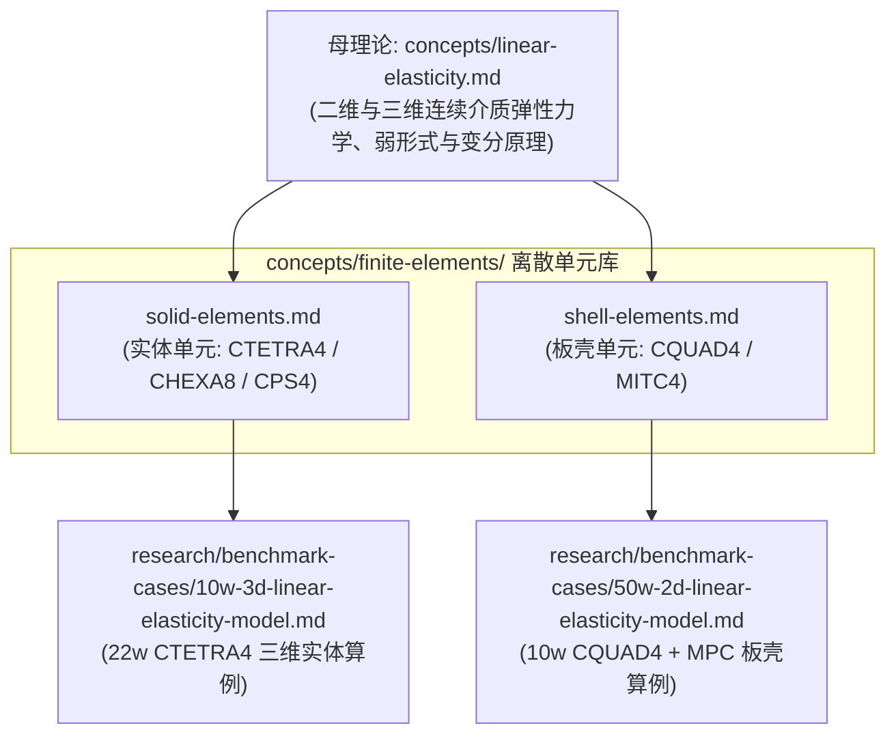

# 有限元单元算子体系总索引

> 本目录维护各类有限元离散单元（实体元 Solid、板壳元 Shell、梁杆元 Beam）在局部单元级的**形函数构造、应变算子、抗自锁技术与刚度矩阵计算闭环**。它作为具体离散算子库，向上对接连续介质弹性力学母理论（[[../linear-elasticity|linear-elasticity]]），向下服务于高性能并行装配与工程基准算例。

---

## 单元分类与索引表格

| 单元大类 | 代表性卡片 | 物理维度与自由度 | 核心力学理论与抗锁定技术 | 权威页面 |
|---|---|---|---|---|
| **实体单元 (Solid)** | `CTETRA4` / `CHEXA8` / `CPS4` | 2D/3D，每节点 $2\sim 3$ 平移自由度（无转动） | 连续介质弹性力学；常应变解析求积或标准高斯数值积分 | [[solid-elements]] |
| **板壳单元 (Shell)** | `CQUAD4` / `CTRIA3` | 2D 流形，每节点 6 自由度 ($u,v,w,\theta_x,\theta_y,\theta_z$) | Reissner–Mindlin 运动学、非协调膜元、Drilling 稳定项与 MITC4 边中点剪切张量混合插值 | [[shell-elements]] |

---

## 理论母页与工程算例映射

---

## 管理边界

- 连续介质的 Navier–Cauchy 偏微分方程、弱形式空间定义、Korn 不等式与材料相对密度参数化统一由母理论 [[../linear-elasticity]] 维护，本目录不重复推导；
- 全局装配、并行分区（MPI）与无矩阵（Matrix-Free）算子由 [[../gpu-hpc/distributed-operator-and-shared-dofs]] 与 [[../matrix-free/assembly-levels]] 维护；
- 本目录专注于单个单元在参考坐标与局部物理坐标下的形函数微分、截面厚度积分、抗自锁构造与 $\mathbf K_e$ 输出。
