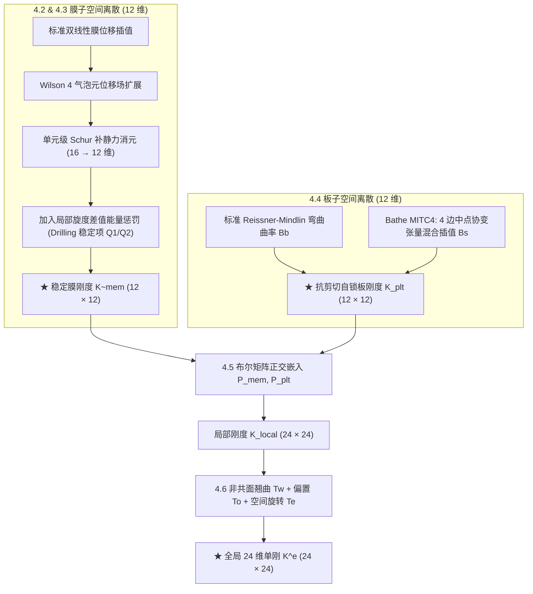

# 板壳有限元单元算子（含 CQUAD4）

> **一句话**：基于 Reissner–Mindlin 一阶剪切变形假设，建立“**强形式平衡微分方程 $\to$ 变分虚功弱形式 $\to$ 现代抗自锁/稳定化有限元离散**”的三层完整理论体系，融合 Wilson 气泡元消元、MITC4 剪切混合插值、Drilling 旋度差能量稳定与空间几何变换，闭环输出通用的 $6N_v\times 6N_v$ 板壳单元全局刚度矩阵 $\mathbf K_e$（四边形 `CQUAD4` 为 $24\times 24$，三角形 `CTRIA3` 为 $18\times 18$）。

---

## 1. 板壳单元谱系与代表类型

板壳单元通过中面降维运动学（Kirchhoff–Love 或 Reissner–Mindlin）与截面厚度积分描述薄壁结构，主要代表单元如下：

| 单元类型 | 几何拓扑 | 节点数 $N_v$ | 节点自由度体系 | 核心力学理论与抗自锁技术 | 工业定位与应用场景 |
|---|---|---|---|---|---|
| **`CQUAD4`** | 四边形 (Quad) | 4 | 6 DOF ($u,v,w,\theta_x,\theta_y,\theta_z$) | Reissner–Mindlin + **MITC4 剪切混合插值** + **非协调膜元** + **Drilling 稳定项** | 工业薄壁结构绝对主力（速度快、鲁棒性高） |
| **`CTRIA3`** | 三角形 (Tria) | 3 | 6 DOF ($u,v,w,\theta_x,\theta_y,\theta_z$) | **DKT**（离散 Kirchhoff）或 **MITC3/DKMT** + 膜元 Drilling 转角 | 复杂几何与网格过渡区域 |
| **`CQUAD8`** / `CQUADR` | 四边形 (Quad) | 8 | 6 DOF ($u,v,w,\theta_x,\theta_y,\theta_z$) | 二阶曲面等参元，高阶 ANS/MITC8 抗自锁插值 | 复杂双曲率壳体、厚板/中厚壳高精度应力分析 |
| **`CTRIA6`** / `CTRIAR` | 三角形 (Tria) | 6 | 6 DOF ($u,v,w,\theta_x,\theta_y,\theta_z$) | 二阶三角形曲面等参元 | 复杂曲面高精度自适应网格 |
| **`Solid-Shell`** | 六面体 (Hex) | 8 | 3 DOF ($u,v,w$，无转角) | 8 节点连续体退化实体壳，厚度方向 EAS/ANS 杂交应变 | 几何大变形、大旋转接触碰撞分析 |

---

### 1.1 实体单元 (Solid) vs 板壳单元 (Shell) 计算范式对比

理解板壳单元的最快方式，是与常用的连续介质实体单元（[[solid-elements|solid-elements]]，如 `CPS4` 或 `CHEXA8`）进行对比：

| 对比维度 | **常规连续介质实体单元（Solid）** | **板壳有限元单元（Shell）** |
|---|---|---|
| **物理假设** | 实体三维/二维连续介质（无厚度降维假设） | 中面一阶剪切变形假设（Reissner–Mindlin 厚度降维） |
| **节点自由度** | **纯平移**：每个节点仅包含 $2$ 或 $3$ 个平移自由度（无转角） | **平移 + 转角**：每个节点包含 $6$ 个自由度（$3$ 平移 + $3$ 转角） |
| **刚度构造方式** | **整体一气呵成**：$\mathbf K_e = \int_{\Omega_e} \mathbf B_e^{\mathsf T} \mathbf D \mathbf B_e\,\mathrm dx$ 一次积分 | **物理分块拼装**：拆分为 **膜（面内）** 与 **板（弯剪）** 分别构造后拼接 |
| **空间坐标系** | 若基于全局节点坐标插值，直接输出全局刚度（无需坐标旋转） | **局部二维计算 $\to$ 三维空间旋转装配**：必须通过 $\boldsymbol T_e$ 旋转到全局空间 |
| **抗自锁与稳定化** | 面内弯曲剪切自锁（非协调元 / EAS 消除） | **三大自锁**：非协调膜元 + MITC 剪切混合插值 + Drilling 转角稳定 |

---

### 1.2 几何本质：局部二维流形与三维空间装配

板壳有限元的核心工程魅力在于：**以极低的二维计算成本，求解复杂的三维薄壁结构响应**。

- **为什么在局部二维算？** 每一个微小的四边形或三角形单元自身就是一个局部微平面，在该平面的局部坐标系下推导拉伸、弯曲与剪切能量最为简捷；
- **为什么节点必须有 6 个自由度？** 宏观三维薄壁结构（如车身、机身、箱梁）由成千上万个空间朝向各异的小平面拼接而成。在三维空间任意折角连接处，一个单元的弯曲转矩会转化为相邻单元的扭转力矩。为了在空间全向无障碍传递所有力和力矩，每个节点必须统一配备 3 个空间平移 $(u, v, w)$ 与 3 个空间转角 $(\theta_x, \theta_y, \theta_z)$。

> 设任意板壳单元的节点数为 $N_v$，单元自由度向量总维数为 $N_{\mathrm{dof}} = 6 N_v$。下文沿**“强形式 $\to$ 弱形式 $\to$ 离散算子”**三层完整理论体系展开。

---

## 2. 第一理论部分：连续板壳力学强形式（Strong Form）

强形式描述了中面参考域 $\Omega_0 \subset \mathbb R^2$ 内微分体段的几何运动学、本构厚度积分以及平衡偏微分方程（PDEs）。

### 2.1 Reissner–Mindlin 运动学与广义应变

设壳中面参考域为 $\Omega_0 \subset \mathbb R^2$，厚度为 $t$。局部中面切坐标为 $(x, y)$，法向坐标为 $z \in [-t/2, t/2]$。

中面位移为 $(u_0, v_0, w_0)$，法线截面转角为 $(\theta_x, \theta_y)$。一阶剪切变形运动学位移场为：

$$
u(x, y, z) = u_0(x, y) + z\theta_y(x, y),
\qquad
v(x, y, z) = v_0(x, y) - z\theta_x(x, y),
\qquad
w(x, y, z) = w_0(x, y).
\tag{1}
$$

定义 8 分量广义应变向量 $\boldsymbol\eta = [\boldsymbol\varepsilon_m^{\mathsf T}, \boldsymbol\kappa^{\mathsf T}, \boldsymbol\gamma^{\mathsf T}]^{\mathsf T} \in \mathbb R^8$：

1. **中面膜应变**：
   $$
   \boldsymbol\varepsilon_m = \begin{bmatrix} \dfrac{\partial u_0}{\partial x} \\[2mm] \dfrac{\partial v_0}{\partial y} \\[2mm] \dfrac{\partial u_0}{\partial y} + \dfrac{\partial v_0}{\partial x} \end{bmatrix} \in \mathbb R^3;
   $$
2. **弯曲与扭转曲率**：
   $$
   \boldsymbol\kappa = \begin{bmatrix} \dfrac{\partial \theta_y}{\partial x} \\[2mm] -\dfrac{\partial \theta_x}{\partial y} \\[2mm] \dfrac{\partial \theta_y}{\partial y} - \dfrac{\partial \theta_x}{\partial x} \end{bmatrix} \in \mathbb R^3;
   $$
3. **横向剪切应变**：
   $$
   \boldsymbol\gamma = \begin{bmatrix} \theta_y + \dfrac{\partial w_0}{\partial x} \\[2mm] -\theta_x + \dfrac{\partial w_0}{\partial y} \end{bmatrix} \in \mathbb R^2.
   $$

---

### 2.2 截面本构厚度解析积分与合力/合力矩

对于弹性模量 $E$、泊松比 $\nu$ 的各向同性线弹性材料，平面应力矩阵为：

$$
\boldsymbol C_0 = \frac{E}{1-\nu^2} \begin{bmatrix} 1 & \nu & 0 \\ \nu & 1 & 0 \\ 0 & 0 & \dfrac{1-\nu}{2} \end{bmatrix} \in\mathbb R^{3\times3},
\qquad
G = \frac{E}{2(1+\nu)}.
\tag{2}
$$

沿厚度方向 $z \in [-t/2, t/2]$ 解析积分，定义截面内力合力、合力矩与截面刚度分块矩阵（中面对称截面膜弯解耦 $\boldsymbol B = \boldsymbol 0$）：

- **膜内力向量** $\boldsymbol N = [N_{xx}, N_{yy}, N_{xy}]^{\mathsf T} = \int_{-t/2}^{t/2} \boldsymbol\sigma_m\,\mathrm dz = \boldsymbol A \boldsymbol\varepsilon_m$；
- **弯矩/扭矩向量** $\boldsymbol M = [M_{xx}, M_{yy}, M_{xy}]^{\mathsf T} = \int_{-t/2}^{t/2} z\boldsymbol\sigma_m\,\mathrm dz = \boldsymbol D \boldsymbol\kappa$；
- **横向剪力向量** $\boldsymbol Q = [Q_x, Q_y]^{\mathsf T} = \int_{-t/2}^{t/2} \boldsymbol\tau_s\,\mathrm dz = \boldsymbol A_s \boldsymbol\gamma$；

其中截面刚度为：

$$
\boldsymbol A = \int_{-t/2}^{t/2}\boldsymbol C_0\,\mathrm dz = t\boldsymbol C_0 \in \mathbb R^{3\times 3},
\qquad
\boldsymbol D = \int_{-t/2}^{t/2} z^2\boldsymbol C_0\,\mathrm dz = \frac{t^3}{12}\boldsymbol C_0 \in \mathbb R^{3\times 3},
\qquad
\boldsymbol A_s = \frac{5}{6} G t \boldsymbol I_2 \in \mathbb R^{2\times 2}.
\tag{3}
$$

这里 $\kappa_s = 5/6$ 为 Reissner–Mindlin 经典横向剪切修正系数。

---

### 2.3 控制平衡偏微分方程（5 个偏微分方程）

在中面参考域 $\Omega_0$ 内，微分面元的微平衡方程给出结构强形式控制微分方程系统（包含 2 个面内平衡、1 个横向剪力平衡与 2 个力矩平衡）：

$$
\begin{aligned}
\text{面内力平衡：} \quad & \begin{cases}
\dfrac{\partial N_{xx}}{\partial x} + \dfrac{\partial N_{xy}}{\partial y} + f_x = 0 \\[2mm]
\dfrac{\partial N_{xy}}{\partial x} + \dfrac{\partial N_{yy}}{\partial y} + f_y = 0
\end{cases} \\[3mm]
\text{横向剪力平衡：} \quad & \dfrac{\partial Q_x}{\partial x} + \dfrac{\partial Q_y}{\partial y} + p = 0 \\[3mm]
\text{截面力矩平衡：} \quad & \begin{cases}
\dfrac{\partial M_{xx}}{\partial x} + \dfrac{\partial M_{xy}}{\partial y} - Q_x + m_x = 0 \\[2mm]
\dfrac{\partial M_{xy}}{\partial x} + \dfrac{\partial M_{yy}}{\partial y} - Q_y + m_y = 0
\end{cases}
\end{aligned}
\tag{4}
$$

其中 $f_x, f_y$ 为面内分布体力，$p$ 为横向分布面压，$m_x, m_y$ 为分布外力矩。

---

### 2.4 边界条件体系

在中面外边界 $\partial\Omega_0 = \Gamma_D \cup \Gamma_N$（$\Gamma_D \cap \Gamma_N = \emptyset$）上：

- **Dirichlet 本性边界条件（位移与转角约束）**：
  $$
  u_0 = \bar{u}_0, \quad v_0 = \bar{v}_0, \quad w_0 = \bar{w}_0, \quad \theta_x = \bar{\theta}_x, \quad \theta_y = \bar{\theta}_y \qquad \text{on } \Gamma_D;
  $$
- **Neumann 自然边界条件（面力与弯矩约束）**：
  $$
  \boldsymbol N \cdot \boldsymbol n = \bar{\boldsymbol t}_m, \quad \boldsymbol Q \cdot \boldsymbol n = \bar{q}_z, \quad \boldsymbol M \cdot \boldsymbol n = \bar{\boldsymbol m} \qquad \text{on } \Gamma_N.
  $$

---

## 3. 第二理论部分：变分弱形式（Weak Form / 虚功原理）

通过引入虚位移场并对强形式偏微分方程 $(4)$ 进行分部积分（散度定理），将强形式弱化为对光滑度仅要求一阶平方可积（$H^1$ 空间）的双线性虚功弱形式。

### 3.1 函数空间定义

- **广义试探位移空间**：
  $$
  \mathcal V = \left\{ \boldsymbol q = [u_0, v_0, w_0, \theta_x, \theta_y]^{\mathsf T} \in [H^1(\Omega_0)]^5 \;\middle|\; \boldsymbol q|_{\Gamma_D} = \bar{\boldsymbol q} \right\};
  $$
- **广义检验虚位移空间**：
  $$
  \mathcal V_0 = \left\{ \delta\boldsymbol q = [\delta u_0, \delta v_0, \delta w_0, \delta\theta_x, \delta\theta_y]^{\mathsf T} \in [H^1(\Omega_0)]^5 \;\middle|\; \delta\boldsymbol q|_{\Gamma_D} = \boldsymbol 0 \right\}.
  $$

---

### 3.2 虚功原理弱形式方程

板壳 Reissner–Mindlin 变分弱形式为：求 $\boldsymbol q \in \mathcal V$，使得对任意虚位移 $\delta\boldsymbol q \in \mathcal V_0$：

$$
\boxed{
a(\boldsymbol q, \delta\boldsymbol q) = \ell(\delta\boldsymbol q)
}
\tag{5}
$$

其中：
- **双线性内力虚功形式 $a(\boldsymbol q, \delta\boldsymbol q)$**：
  $$
  a(\boldsymbol q, \delta\boldsymbol q) = \int_{\Omega_0} \left(
  \underbrace{\boldsymbol\varepsilon_m(\delta\boldsymbol q)^{\mathsf T} \boldsymbol A \boldsymbol\varepsilon_m(\boldsymbol q)}_{\text{膜内应变能变分}}
  + \underbrace{\boldsymbol\kappa(\delta\boldsymbol q)^{\mathsf T} \boldsymbol D \boldsymbol\kappa(\boldsymbol q)}_{\text{截面弯曲应变能变分}}
  + \underbrace{\boldsymbol\gamma(\delta\boldsymbol q)^{\mathsf T} \boldsymbol A_s \boldsymbol\gamma(\boldsymbol q)}_{\text{横向剪切应变能变分}}
  \right) \mathrm dA;
  \tag{6}
  $$
- **线性外力虚功形式 $\ell(\delta\boldsymbol q)$**：
  $$
  \ell(\delta\boldsymbol q) = \int_{\Omega_0} \left( \boldsymbol f_m \cdot [\delta u_0, \delta v_0]^{\mathsf T} + p\,\delta w_0 + \boldsymbol m \cdot [\delta\theta_x, \delta\theta_y]^{\mathsf T} \right) \mathrm dA + \int_{\Gamma_N} \left( \bar{\boldsymbol t}_m \cdot [\delta u_0, \delta v_0]^{\mathsf T} + \bar{q}_z \delta w_0 + \bar{\boldsymbol m} \cdot [\delta\theta_x, \delta\theta_y]^{\mathsf T} \right) \mathrm ds.
  \tag{7}
  $$

对应总势能泛函为 $\Pi(\boldsymbol q) = \frac{1}{2} a(\boldsymbol q, \boldsymbol q) - \ell(\boldsymbol q)$，其一阶变分 $\delta\Pi(\boldsymbol q; \delta\boldsymbol q) = 0$ 严格等价于弱形式方程 $(5)$。

---

## 4. 第三理论部分：有限元离散与现代抗自锁单元技术（FE Discretization）

在连续介质力学强形式与弱形式层面，力学方程是严格良定的，并不存在所谓的“自锁”。**自锁现象纯粹是有限维低阶多项式离散空间引入的数值过约束病态**。

因此，现代板壳有限元的核心任务，是在有限维网格离散阶段通过**混合插值、非协调位移增强与变分能量惩罚**，彻底消除数值自锁与奇异。

---

### 4.1 低阶板壳单元的四大经典数值缺陷

若直接采用标准多项式对位移场求导离散，低阶单元会遭遇四大经典病态：

1. **面内弯曲寄生剪切（Membrane Shear Locking）**：一阶双线性形函数无法表达纯弯曲下的二次抛物线挠度曲线，计算中产生虚假剪应变，导致面内抗弯刚度被严重高估；
2. **薄板横向剪切自锁（Transverse Shear Locking）**：当板厚 $t \to 0$ 时，横向剪切能量按 $O(t^{-2})$ 发散，低阶多项式无法精确逼近 Kirchhoff 零剪切约束（$\boldsymbol\gamma = \boldsymbol 0$），导致横向位移被人工锁死；
3. **钻转动（Drilling DOF $\theta_z$）零能奇异**：经典中面理论中绕法向转角无应变能，共面网格装配后在 $\theta_z$ 自由度上刚度主对角线为 0，导致全局矩阵代数奇异；
4. **空间非共面翘曲误差（Spatial Warping Error）**：空间曲面划分出的 4 节点往往不严格共面，直接压到平面计算会破坏三维刚体模态不变性。

---

### 4.2 膜子空间离散与 Wilson 气泡元静力消元（抗面内弯曲自锁）

在四边形单元内部叠加 4 维内部气泡位移场 $\boldsymbol\alpha^e \in \mathbb R^4$（基函数 $\mu_1 = 1-\xi^2, \mu_2 = 1-\eta^2$），膜位移场扩展为 $\boldsymbol u_{\mathrm{mem}} = \sum_{a=1}^4 N_a \boldsymbol u_a + \sum_{k=1}^2 \mu_k \boldsymbol\alpha_k$。

扩展平衡方程为：

$$
\begin{bmatrix}
\boldsymbol K_{uu}^e & \boldsymbol K_{u\alpha}^e \\
(\boldsymbol K_{u\alpha}^e)^{\mathsf T} & \boldsymbol K_{\alpha\alpha}^e
\end{bmatrix}
\begin{bmatrix}
\boldsymbol u_{\mathrm{mem}}^e \\
\boldsymbol\alpha^e
\end{bmatrix}
=
\begin{bmatrix}
\boldsymbol f_{\mathrm{mem}}^e \\
\boldsymbol 0
\end{bmatrix}
\tag{8}
$$

其中：
- $\boldsymbol K_{uu}^e = \sum_{g=1}^4 w_g J_g \boldsymbol B_{m,g}^{\mathsf T} \boldsymbol A \boldsymbol B_{m,g} \in \mathbb R^{12\times 12}$ 为标准节点膜刚度；
- $\boldsymbol K_{u\alpha}^e = \sum_{g=1}^4 w_g J_g \boldsymbol B_{m,g}^{\mathsf T} \boldsymbol A \boldsymbol G_g \in \mathbb R^{12\times 4}$ 为节点与气泡模式耦合刚度；
- $\boldsymbol K_{\alpha\alpha}^e = \sum_{g=1}^4 w_g J_g \boldsymbol G_g^{\mathsf T} \boldsymbol A \boldsymbol G_g \in \mathbb R^{4\times 4}$ 为气泡自刚度矩阵。

在单元级通过 **Schur 补静力凝聚** 消除内部变量 $\boldsymbol\alpha^e$（$\boldsymbol\alpha^e = -(\boldsymbol K_{\alpha\alpha}^e)^{-1}(\boldsymbol K_{u\alpha}^e)^{\mathsf T}\boldsymbol u_{\mathrm{mem}}^e$）：

$$
\boxed{
\boldsymbol K_{\mathrm{mem}}^e = \boldsymbol K_{uu}^e - \boldsymbol K_{u\alpha}^e (\boldsymbol K_{\alpha\alpha}^e)^{-1} (\boldsymbol K_{u\alpha}^e)^{\mathsf T} \in \mathbb R^{12\times 12}
}
\tag{9}
$$

彻底消除了面内弯曲寄生剪切自锁，输出 12 维膜刚度。

---

### 4.3 钻转动（Drilling DOF $\theta_z$）变分能量稳定化

在变分原理中引入独立节点法向转角 $\theta_z$ 与中面位移连续旋度场 $\omega_z = \frac{1}{2}(\partial v_0/\partial x - \partial u_0/\partial y)$ 的差值能量惩罚项：

$$
U_{\mathrm{drill}}^e = \frac{1}{2} \gamma_{\mathrm{drill}} G t \int_{\Omega_0} \left( \theta_z - \frac{1}{2}\left(\frac{\partial v_0}{\partial x} - \frac{\partial u_0}{\partial y}\right) \right)^2 \mathrm dA.
\tag{10}
$$

在离散中采用**单元几何中心单点数值求积**，将旋度差值写成节点位移向量的线性组合 $\Delta\theta_z = \boldsymbol Q_1 \boldsymbol q_{\mathrm{mem}}^e$，并补充沙漏摆动正则化项 $\boldsymbol Q_2$，构造双秩一张量：

$$
\boxed{
\boldsymbol K_{\mathrm{drill}}^e = \delta G V_e \boldsymbol Q_1^{\mathsf T}\boldsymbol Q_1 + \lambda \boldsymbol Q_2^{\mathsf T}\boldsymbol Q_2 \in \mathbb R^{12\times 12}
}
\tag{11}
$$

其中 $V_e = A_e \cdot t$ 为单元体积，$\delta, \lambda$ 为无量纲稳定因子。最终膜子空间刚度为：

$$
\widetilde{\boldsymbol K}_{\mathrm{mem}}^e = \boldsymbol K_{\mathrm{mem}}^e + \boldsymbol K_{\mathrm{drill}}^e \in \mathbb R^{12\times 12}.
\tag{12}
$$

彻底消除了共面网格在 $\theta_z$ 自由度上的代数奇异。

---

### 4.4 板子空间离散与 Bathe MITC4 混合插值（抗薄板剪切自锁）

板子空间位移向量为 $\boldsymbol q_{\mathrm{plt}}^e = [w_1, \theta_{x1}, \theta_{y1}, \dots, w_4, \theta_{x4}, \theta_{y4}]^{\mathsf T} \in \mathbb R^{12}$。板刚度由弯曲与剪切应变能高斯数值积分构成：

$$
\boxed{
\boldsymbol K_{\mathrm{plt}}^e = \sum_{g=1}^{4} w_g J_g \left( \boldsymbol B_{b,g}^{\mathsf T} \boldsymbol D \boldsymbol B_{b,g} + \boldsymbol B_{s,g}^{\mathsf T} \boldsymbol A_s \boldsymbol B_{s,g} \right) \in \mathbb R^{12\times 12}
}
\tag{13}
$$

其中：
- $\boldsymbol B_{b,g} \in \mathbb R^{3\times 12}$ 为标准曲率—位移微分梯度矩阵；
- **$\boldsymbol B_{s,g} \in \mathbb R^{2\times 12}$（MITC4 假定自然张量矩阵）**：
  将剪切应变从位移直接求导中解耦，在单元 4 条边中点切向采样协变剪切分量，再通过双线性张量混合重构得到 $\boldsymbol B_{s,g}$，使单元在薄板极限（$t \to 0$）下自然满足 Kirchhoff 零剪切约束而不发生自锁。

---

### 4.5 局部 24 维分块正交布尔嵌入

定义膜与板子空间的布尔选择矩阵 $\boldsymbol P_{\mathrm{mem}}, \boldsymbol P_{\mathrm{plt}} \in \{0, 1\}^{12\times 24}$，在单元局部坐标系下拼装 24 维刚度：

$$
\boxed{
\boldsymbol K_{\mathrm{local}}^e = \boldsymbol P_{\mathrm{mem}}^{\mathsf T} \widetilde{\boldsymbol K}_{\mathrm{mem}}^e \boldsymbol P_{\mathrm{mem}} + \boldsymbol P_{\mathrm{plt}}^{\mathsf T} \boldsymbol K_{\mathrm{plt}}^e \boldsymbol P_{\mathrm{plt}} \in \mathbb R^{24\times 24}
}
\tag{14}
$$

---

### 4.6 空间几何修正与坐标变换闭环

局部刚度 $\boldsymbol K_{\mathrm{local}}^e$ 依次经过三层空间几何变换映射到全局三维 Cartesian 坐标系：

1. **非共面翘曲修正矩阵 $\boldsymbol T_w \in \mathbb R^{24\times 24}$**：
   在空间曲面上，四边形 4 节点往往不共面（翘曲量 $h_w \ne 0$）。$\boldsymbol T_w$ 将空间节点位移投影至最佳拟合平面的刚体空间，消除虚假翘曲应变能（平面单元 $\boldsymbol T_w = \boldsymbol I_{24}$）；
2. **中面偏置变换矩阵 $\boldsymbol T_o \in \mathbb R^{24\times 24}$**：
   若节点偏离中面（如 Nastran `ZOFFS` 偏置矢量 $\boldsymbol d_{\mathrm{off}}$），由刚体连杆运动学 $\boldsymbol u_{\mathrm{mid}} = \boldsymbol u_{\mathrm{node}} + \boldsymbol\theta \times \boldsymbol d_{\mathrm{off}}$ 构造对角分块偏置矩阵 $\boldsymbol T_o$（无偏置 $\boldsymbol T_o = \boldsymbol I_{24}$）；
3. **全局方向余弦正交旋转矩阵 $\boldsymbol T_e \in \mathbb R^{24\times 24}$**：
   由单元局部切平面方向余弦基底 $\boldsymbol R_e \in \mathbb R^{3\times 3}$ 构造块对角旋转矩阵 $\boldsymbol T_e = \operatorname{diag}(\boldsymbol R_e, \dots, \boldsymbol R_e)$。

#### 全局单元刚度矩阵综合闭环公式

$$
\boxed{
\mathbf K_e = \boldsymbol T_e \left[ \boldsymbol T_o^{\mathsf T} \left( \boldsymbol T_w^{\mathsf T} \boldsymbol K_{\mathrm{local}}^e \boldsymbol T_w \right) \boldsymbol T_o \right] \boldsymbol T_e^{\mathsf T} \in \mathbb R^{24\times 24}
}
\tag{15}
$$

该公式严格闭环输出参与全局装配的 24 维单元刚度矩阵。

---

## 5. 代表性工业与科研算例映射

| 代表单元 | 几何拓扑 | 典型 Benchmark 算例 | 核心特征与求解器考察重点 |
|---|---|---|---|
| **`CQUAD4`** | 四边形薄板壳 | [[../../research/benchmark-cases/50w-2d-linear-elasticity-model\|50w-2d-linear-elasticity-model]] | 9.8 万节点、9.7 万四边形单元、3 种截面厚度、2.1 万 RBE2/RBE3 约束消元闭环（59.3w → 45.5w DOF） |
| **`CTRIA3`** | 三角形薄板壳 | 复杂双曲率机翼/车身网格过渡 | DKT/MITC3 剪切抗自锁、非规则网格自适应装配 |
| **`CQUAD8`** | 二阶四边形曲面壳 | 航空航天厚壳与复合材料层合板 | 高阶 ANS/MITC8 剪切插值、高保真截面应力分析 |

---

## 相关页面

- [[_index]] — 有限元单元体系索引。
- [[../linear-elasticity]] — 二维与三维连续介质位移型线弹性母理论。
- [[solid-elements]] — 二维与三维连续介质实体单元算子。
- [[../../research/benchmark-cases/50w-2d-linear-elasticity-model]] — 大规模工业板壳基准算例（`50w-2d`）。
- [[../../research/benchmark-cases/10w-3d-linear-elasticity-model]] — 大规模三维实体基准算例（`10w-3d`）。
