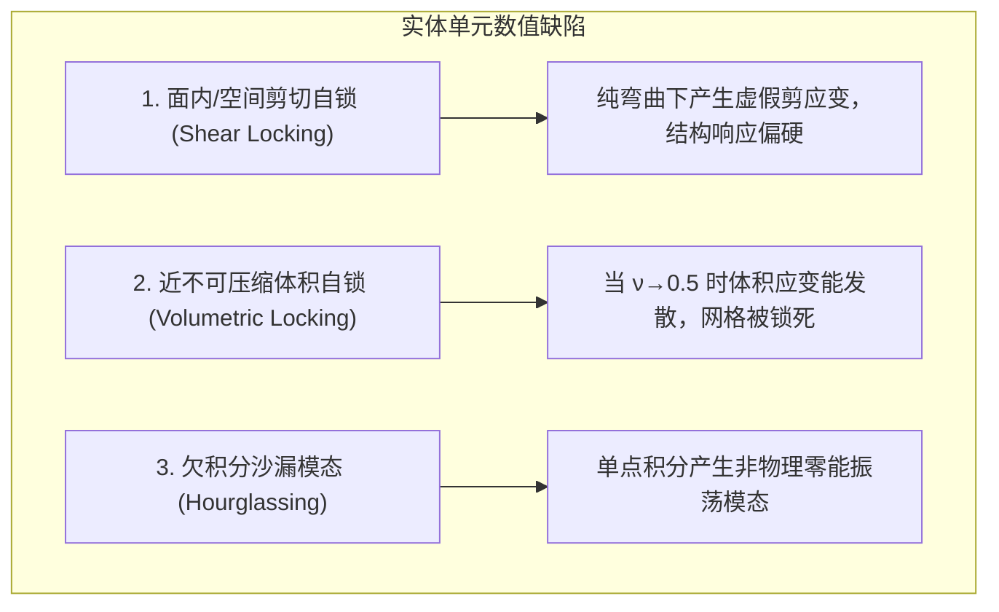

# 连续介质实体有限元单元算子

> **一句话**：基于二维与三维连续介质弹性力学（[[../linear-elasticity|linear-elasticity]]），通过全场位移多项式插值构造几何雅可比 $\boldsymbol J$ 与应变—位移矩阵 $\mathbf B_e$，融合**非协调增强应变**、**$\bar{\boldsymbol B}$ 假定体积应变**与**高斯数值/解析积分**，输出无转动自由度的标准实体刚度矩阵 $\mathbf K_e = \int_{\Omega_e} \mathbf B_e^{\mathsf T}\mathbf D\mathbf B_e\,\mathrm dx \in \mathbb R^{(d\cdot N_v)\times (d\cdot N_v)}$。

---

## 1. 实体单元谱系与代表类型

实体单元直接离散二维平面（平面应力 `CPS` / 平面应变 `CPE`）与三维连续体位移场 $\boldsymbol u: \Omega \subset \mathbb R^d \to \mathbb R^d$（$d=2, 3$），每个节点仅包含 $d$ 个平移自由度（无转动自由度），主要代表如下：

| 单元类型 | 空间维度 $d$ | 节点数 $N_v$ | 单元自由度 | 插值多项式 | 应变/应力状态 | 单元刚度积分方式 | 工业与科研典型定位 |
|---|---|---|---|---|---|---|---|
| **`CPS3` / `CPE3`** | 二维 ($d=2$) | 3 | $3\times 2 = 6$ | 线性 (Linear) | 常应变 (CST) | 解析：$A_e \mathbf B_e^{\mathsf T}\mathbf D\mathbf B_e$ | 二维网格自适应划分、快速几何过渡 |
| **`CPS4` / `CPE4`** | 二维 ($d=2$) | 4 | $4\times 2 = 8$ | 双线性 (Bilinear) | 线性应变 | $2\times 2$ 高斯数值积分 | 二维拓扑优化（如 MBB 梁）基准主力单元 |
| **`CPS8` / `CPE8`** | 二维 ($d=2$) | 8 | $8\times 2 = 16$ | 二阶 Serendipity | 二阶应变 | $3\times 3$ 高斯数值积分 | 二维高精度应力集中分析与断裂力学 |
| **`CTETRA4`** | 三维 ($d=3$) | 4 | $4\times 3 = 12$ | 线性 (Linear) | 常应变 (CST) | 解析：$V_e \mathbf B_e^{\mathsf T}\mathbf D\mathbf B_e$ | 三维复杂非规则 CAD 自动网格（如 [[../../research/benchmark-cases/10w-3d-linear-elasticity-model\|10w-3d]]） |
| **`CTETRA10`** | 三维 ($d=3$) | 10 | $10\times 3 = 30$ | 二阶 (Quadratic) | 线性应变 | 4 点高斯数值积分 | 克服常应变剪切自锁的高精度四面体分析 |
| **`CHEXA8`** | 三维 ($d=3$) | 8 | $8\times 3 = 24$ | 三线性 (Trilinear) | 线性应变 | $2\times 2\times 2$ 高斯数值积分 | 三维大规模规则/子结构拓扑优化基准 |
| **`CHEXA20`** | 三维 ($d=3$) | 20 | $20\times 3 = 60$ | 二阶 Serendipity | 二阶应变 | $3\times 3\times 3$ 高斯数值积分 | 航空航天结构高保真接触与应力分析 |
| **`CPENTA6`** | 三维 ($d=3$) | 6 | $6\times 3 = 18$ | 楔形/三棱柱 | 混合应变 | $2\times 3$ 高斯数值积分 | 实体网格与薄壁边界过渡 |

---

### 1.1 实体单元 (Solid) vs 板壳单元 (Shell) 计算范式对比

| 对比维度 | **常规连续介质实体单元（Solid）** | **板壳有限元单元（Shell，[[shell-elements\|shell-elements]]）** |
|---|---|---|
| **物理假设** | 实体三维/二维连续介质（无厚度降维假设） | 中面一阶剪切变形假设（Reissner–Mindlin 厚度降维） |
| **节点自由度** | **纯平移**：每个节点仅包含 $2$ 或 $3$ 个平移自由度（无转角） | **平移 + 转角**：每个节点包含 $6$ 个自由度（$3$ 平移 + $3$ 转角） |
| **刚度构造方式** | **整体一气呵成**：$\mathbf K_e = \int_{\Omega_e} \mathbf B_e^{\mathsf T} \mathbf D \mathbf B_e\,\mathrm dx$ 一次积分 | **物理分块拼装**：拆分为 **膜（面内）** 与 **板（弯剪）** 分别构造后拼接 |
| **空间坐标系** | 若基于全局节点坐标插值，直接输出全局刚度（无需坐标旋转） | **局部二维计算 $\to$ 三维空间旋转装配**：必须通过 $\boldsymbol T_e$ 旋转到全局空间 |
| **抗自锁与稳定化** | 面内弯曲剪切自锁、近不可压缩体积自锁（EAS / $\bar{\boldsymbol B}$ 消除） | **三大自锁**：非协调膜元 + MITC 剪切混合插值 + Drilling 转角稳定 |

---

### 1.2 自由度体系与几何特征

- **纯平移无转角**：实体单元直接离散物理空间的位移场，节点自由度为 $\boldsymbol u_a = [u_a, v_a]^{\mathsf T}$（2D）或 $\boldsymbol u_a = [u_a, v_a, w_a]^{\mathsf T}$（3D），单元总自由度维数为 $N_{\mathrm{dof}} = d \cdot N_v$；
- **全场直接坐标映射**：实体单元的高斯求积与应变计算直接基于全局 Cartesian 坐标系 $(X, Y, Z)$ 完成，**无需额外的三维空间方向余弦旋转变换**。

---

## 2. 连续力学基础与运动学

连续体区域为 $\Omega \subset \mathbb R^d$（$d=2, 3$），材料点位移场为 $\boldsymbol u(\boldsymbol x): \Omega \to \mathbb R^d$。

小变形假设下的 Cauchy 对称应变张量为

$$
\boldsymbol\varepsilon = \frac{1}{2}\left( \nabla\boldsymbol u + (\nabla\boldsymbol u)^{\mathsf T} \right) \in \mathbb S^d.
\tag{1}
$$

采用标准 Voigt 记号，应变张量表示为向量形式 $\widehat{\boldsymbol\varepsilon} \in \mathbb R^{n_{\varepsilon}}$（$d=2$ 时 $n_\varepsilon=3$；$d=3$ 时 $n_\varepsilon=6$）：

$$
\widehat{\boldsymbol\varepsilon}_{2\mathrm D} =
\begin{bmatrix}
\varepsilon_{xx} \\
\varepsilon_{yy} \\
\gamma_{xy}
\end{bmatrix}
=
\begin{bmatrix}
\partial u / \partial x \\
\partial v / \partial y \\
\partial u / \partial y + \partial v / \partial x
\end{bmatrix},
\qquad
\widehat{\boldsymbol\varepsilon}_{3\mathrm D} =
\begin{bmatrix}
\varepsilon_{xx} \\
\varepsilon_{yy} \\
\varepsilon_{zz} \\
\gamma_{yz} \\
\gamma_{zx} \\
\gamma_{xy}
\end{bmatrix}
=
\begin{bmatrix}
\partial u / \partial x \\
\partial v / \partial y \\
\partial w / \partial z \\
\partial v / \partial z + \partial w / \partial y \\
\partial u / \partial z + \partial w / \partial x \\
\partial u / \partial y + \partial v / \partial x
\end{bmatrix}.
\tag{2}
$$

---

## 3. 本构关系与应变能泛函

对于线弹性材料，应力—应变本构关系满足广义 Hooke 定律 $\widehat{\boldsymbol\sigma} = \mathbf D \widehat{\boldsymbol\varepsilon}$。

各向同性弹性矩阵 $\mathbf D$ 为：

$$
\mathbf D_{3\mathrm D} = \frac{E}{(1+\nu)(1-2\nu)}
\begin{bmatrix}
1-\nu & \nu & \nu & 0 & 0 & 0 \\
\nu & 1-\nu & \nu & 0 & 0 & 0 \\
\nu & \nu & 1-\nu & 0 & 0 & 0 \\
0 & 0 & 0 & \frac{1-2\nu}{2} & 0 & 0 \\
0 & 0 & 0 & 0 & \frac{1-2\nu}{2} & 0 \\
0 & 0 & 0 & 0 & 0 & \frac{1-2\nu}{2}
\end{bmatrix}
\in \mathbb R^{6\times 6}.
\tag{3}
$$

连续体的总势能泛函为

$$
\Pi(\boldsymbol u) = \frac{1}{2} \int_\Omega \widehat{\boldsymbol\varepsilon}(\boldsymbol u)^{\mathsf T} \mathbf D \widehat{\boldsymbol\varepsilon}(\boldsymbol u)\,\mathrm dx - \int_\Omega \boldsymbol b \cdot \boldsymbol u\,\mathrm dx - \int_{\Gamma_N} \bar{\boldsymbol t} \cdot \boldsymbol u\,\mathrm ds.
\tag{4}
$$

变分弱形式（虚功原理）为：寻找 $\boldsymbol u \in \mathcal V$ 使得对任意 $\boldsymbol v \in \mathcal V_0$，

$$
a(\boldsymbol u, \boldsymbol v) = \int_\Omega \widehat{\boldsymbol\varepsilon}(\boldsymbol v)^{\mathsf T} \mathbf D \widehat{\boldsymbol\varepsilon}(\boldsymbol u)\,\mathrm dx = \ell(\boldsymbol v).
\tag{5}
$$

---

## 4. 低阶实体等参元的经典数值缺陷

低阶实体单元（如 4 节点平面等参元 `CPS4`、4 节点四面体 `CTETRA4` 与 8 节点六面体 `CHEXA8`）若直接采用标准多项式全积分插值，会遭遇三大力学与代数顽疾：

1. **弯曲剪切自锁（Bending Shear Locking）**：线性与双/三线性多项式无法表达纯弯曲下的二次挠度曲线，伴随虚假剪应变产生，导致单元弯曲刚度被大幅高估；
2. **近不可压缩体积自锁（Volumetric Locking）**：当材料泊松比 $\nu \to 0.5$（橡胶或塑性流动极限）时，体积模量 $K = \frac{E}{3(1-2\nu)} \to \infty$。变分强制约束 $\operatorname{div}\boldsymbol u = 0$，低阶位移基底无法满足无散约束，导致整个网格位移被锁死为零；
3. **欠积分零能沙漏模态（Hourglass Modes）**：为了提升效率和减轻自锁，若采用减缩求积（如 `CHEXA8` 仅用 1 个中心积分点），会导致应变为零的非刚体伪变形（沙漏变形），引起全局刚度矩阵秩亏与奇异。

---

## 5. 实体单元通用抗自锁与稳定化方法体系

现代有限元求解器针对实体单元的自锁与沙漏问题，发展出了完备的方法体系：

### 5.1 增强假设应变与非协调模式（Incompatible Modes / EAS）

1. **Wilson 非协调元（Incompatible Bubble Modes）**：
   在单元位移中补充内部高阶气泡模式 $\boldsymbol\alpha^e$（如 $1-\xi^2, 1-\eta^2, 1-\zeta^2$），补充弯曲二次应变：
   $$
   \mathbf K_e = \mathbf K_{uu} - \mathbf K_{u\alpha} \mathbf K_{\alpha\alpha}^{-1} \mathbf K_{u\alpha}^{\mathsf T} \in \mathbb R^{(d\cdot N_v)\times (d\cdot N_v)}.
   \tag{6}
   $$
2. **Simo–Rifai EAS 增强应变法（Enhanced Assumed Strain）**：
   在应变场中直接叠加不相容的增强应变场 $\widetilde{\boldsymbol\varepsilon}$，通过双变分原理在单元级凝聚消除，彻底消去弯曲剪切自锁。

### 5.2 混合变分与 $\bar{\boldsymbol B}$ 假定体积应变法（Volumetric Locking Treatments）

1. **Hughes $\bar{\boldsymbol B}$ 假定体积应变法**：
   将应变矩阵分解为偏应变（剪切）与球应变（体积）：$\mathbf B = \mathbf B_{\mathrm{dev}} + \mathbf B_{\mathrm{vol}}$。将体积应变矩阵替换为单元平均体积矩阵 $\bar{\mathbf B}_{\mathrm{vol}} = \frac{1}{V_e}\int_{\Omega_e} \mathbf B_{\mathrm{vol}}\,\mathrm dx$：
   $$
   \bar{\mathbf B} = \mathbf B_{\mathrm{dev}} + \bar{\mathbf B}_{\mathrm{vol}}.
   \tag{7}
   $$
   使单元在 $\nu \to 0.5$ 极限下体积无自锁。
2. **胡–张（Hu–Zhang）应力–位移混合有限元**：
   引入严格对称的应力张量空间，基于 Hellinger–Reissner 混合变分原理，在不可压缩极限下天然满足 Ladyzhenskaya–Babuška–Brezzi (LBB) 稳定条件，直接输出高精度无自锁应力场。

### 5.3 沙漏控制与人工刚度稳定（Hourglass Stabilization）

在减缩积分（如单点积分六面体）中，引入 Flanagan–Belytschko 沙漏阻尼或弹性刚度惩罚矩阵 $\mathbf K_{\mathrm{hg}}$，消除非物理零能振荡模态：

$$
\mathbf K_e = \mathbf K_{\mathrm{reduced}} + \mathbf K_{\mathrm{hg}}.
\tag{8}
$$

---

## 6. 单元刚度矩阵与全局装配闭环

对于节点数为 $N_v$ 的实体单元，单元节点位移向量为 $\mathbf U_e = [\boldsymbol u_1^{\mathsf T}, \dots, \boldsymbol u_{N_v}^{\mathsf T}]^{\mathsf T} \in \mathbb R^{d\cdot N_v}$。

### 6.1 等参映射与应变—位移矩阵 $\mathbf B_e$

1. **等参几何插值与雅可比**：
   $$
   \boldsymbol x(\boldsymbol\xi) = \sum_{a=1}^{N_v} N_a(\boldsymbol\xi)\boldsymbol x_a,
   \qquad
   \boldsymbol J(\boldsymbol\xi) = \frac{\partial\boldsymbol x}{\partial\boldsymbol\xi},
   \qquad
   J(\boldsymbol\xi) = \det(\boldsymbol J).
   \tag{9}
   $$
2. **应变—位移矩阵**：
   $$
   \nabla_{\boldsymbol x} N_a = \boldsymbol J^{-\mathsf T} \nabla_{\boldsymbol\xi} N_a,
   \qquad
   \widehat{\boldsymbol\varepsilon}(\boldsymbol u_h) = \mathbf B_e(\boldsymbol\xi)\mathbf U_e.
   \tag{10}
   $$

---

### 6.2 单元刚度矩阵闭环输出

单元刚度矩阵定义为应变能双线性型：

$$
\boxed{
\mathbf K_e = \int_{\Omega_e} \mathbf B_e^{\mathsf T}\mathbf D\mathbf B_e\,\mathrm dx \approx \sum_{q=1}^{N_q} w_q J(\boldsymbol\xi_q) \mathbf B_e(\boldsymbol\xi_q)^{\mathsf T} \mathbf D \mathbf B_e(\boldsymbol\xi_q) \in \mathbb R^{(d\cdot N_v)\times (d\cdot N_v)}
}
\tag{11}
$$

- **解析常应变积分（CST / CTETRA4）**：对于线性三角形 `CPS3` 与四面体 `CTETRA4`，$\mathbf B_e$ 全场为常数，刚度为解析矩阵 $\mathbf K_e = V_e \mathbf B_e^{\mathsf T}\mathbf D\mathbf B_e$；
- **数值高斯积分（CPS4 / CHEXA8）**：双/三线性单元分别采用 $2\times 2$（4 点）或 $2\times 2\times 2$（8 点）标准 Gauss 求积。

---

### 6.3 全局装配闭环

实体单元的自由度直接基于全局直角坐标系定义（无需局部到全局的方向余弦旋转 $\boldsymbol T_e$）。利用全局布尔拓扑布尔矩阵 $\boldsymbol L_e \in \{0, 1\}^{(d\cdot N_v) \times N_{\mathrm{global}}}$ 直接散射累加：

$$
\mathbf K = \sum_{e=1}^{N_e} \boldsymbol L_e^{\mathsf T} \mathbf K_e \boldsymbol L_e,
\qquad
\boldsymbol f = \sum_{e=1}^{N_e} \boldsymbol L_e^{\mathsf T} \boldsymbol f^e.
\tag{12}
$$

---

## 7. 代表性工业与科研算例映射

| 代表单元 | 几何拓扑 | 典型 Benchmark 算例 | 核心特征与求解器考察重点 |
|---|---|---|---|
| **`CTETRA4`** | 三维 4 节点四面体 | [[../../research/benchmark-cases/10w-3d-linear-elasticity-model\|10w-3d-linear-elasticity-model]] | 22 万四面体单元、双材料异质连续体、解析常应变 CST 高速装配与 PCG 迭代求解 |
| **`CPS4`** | 二维 4 节点四边形 | 2D MBB 梁 / 悬臂梁拓扑优化 | 二维连续体基准、SIMP 材料插值、伴随敏度分析 |
| **`CHEXA8`** | 三维 8 节点六面体 | 3D 大规模拓扑优化与 PIML 细网格 | 5.2M 自由度结构、B-bar 抗体积自锁、GPU 张量化 Matrix-Free 算子评估 |

---

## 相关页面

- [[_index]] — 有限元单元体系总索引。
- [[../linear-elasticity]] — 二维与三维连续介质线弹性力学母理论。
- [[shell-elements]] — 二维流形板壳单元算子与抗自锁方法体系。
- [[../../research/benchmark-cases/10w-3d-linear-elasticity-model]] — 基于 `CTETRA4` 的三维连续体基准算例。
