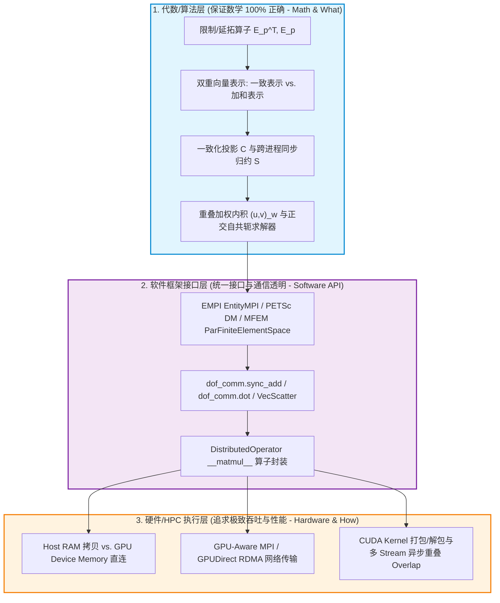
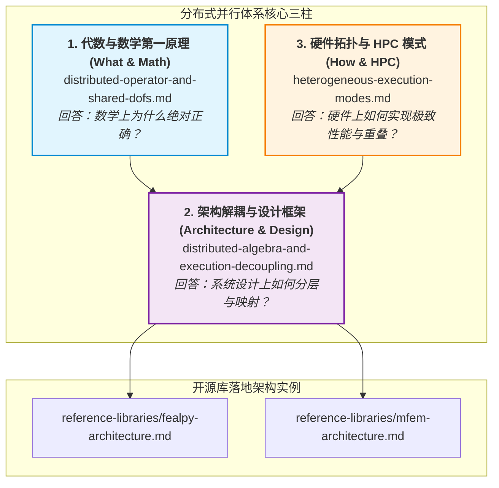

# 分布式计算系统的代数/算法层与硬件/执行层解耦框架

> **一句话**：系统必须解耦为 **代数/算法层 (Math & What)**、**软件框架接口层 (Software API)** 与 **硬件/执行层 (Hardware & How)** 三层；正确性由代数层保证，吞吐效率由硬件层优化，两者经统一接口解耦绑定。
> 
> **定位**：本页是分布式并行计算系统的**架构解耦总揽指南 (Architecture & Design)**（第 2 柱）。连接代数第一原理（[[distributed-operator-and-shared-dofs]]）与异构执行模式（[[heterogeneous-execution-modes]]）。

---

## 1. 三层设计模型

---

## 2. 代数/算法层 vs 硬件/执行层深度对比

| 维度 | 1. 代数/算法层面 (Math & What) | 2. 硬件/执行层面 (HPC & How) |
|---|---|---|
| **核心关切** | **数学严密性与理论正确性** | **计算效率与吞吐极限** |
| **回答的问题** | • 一致与加和表示如何转换？ • 界面自由度如何去重？ • 并行求解轨度为什么与串行 100% 同构？ | • 数据在 Host RAM 还是 GPU 显存？ • 通信走 PCIe、NVLink 还是 RDMA？ • 如何用 GPU 计算 Kernel 掩盖 MPI 通信 (Overlap)？ |
| **核心抽象** | 限制/延拓算子 $\mathbf{E}_p^\top, \mathbf{E}_p$、引用计数 $\boldsymbol{r}$、归约 $\mathcal{S}$、加权内积 $(\cdot,\cdot)_w$ | GPU-Aware MPI、GPUDirect RDMA、`MPI_Isend`/`Irecv` 句柄、CUDA Stream 流水线 |
| **硬件依赖性** | **完全无关**（单进程/CPU/GPU 数学公式 100% 相同）。 | **高度依赖**（不同拓扑与 MPI 实现方案截然不同）。 |
| **验证门禁** | $P$-Rank 与 1-Rank 结果在浮点精度内完全一致。 | 强/弱扩展性加速比、通信/计算掩盖重叠率 (Overlap Ratio)。 |

---

## 3. 强制解耦三大原则

1. **正确性属于“代数层”，性能属于“硬件层”**：代数层错误时（如 MatVec 遗漏归约 $\mathcal{S}$ 或内积未去重），硬件层再快数值结果也是错的；必须先通过无硬件模拟验证代数正确性。
2. **通信透明化与接口统一 (Communication Transparency)**：软件抽象层将跨进程消息同步隐藏于 `__matmul__` 内部，上层求解器仅调用 `op @ x` 与 `dot(u, v)`，完全不接触底层的 Send/Recv 句柄。
3. **异构计算可移植性 (Portability)**：代数层代码在不同 Backend (NumPy, PyTorch, JAX, CuPy) 及 Device (CPU, GPU) 间保持零修改，硬件层动态匹配传输通道。

---

## 4. 主流框架映射与核心三柱全景导航

- **代数推导** $\to$ [[distributed-operator-and-shared-dofs]]
- **硬件重叠** $\to$ [[heterogeneous-execution-modes]]
- **开源实现** $\to$ [[reference-libraries/fealpy-architecture]]、[[reference-libraries/mfem-architecture]]
