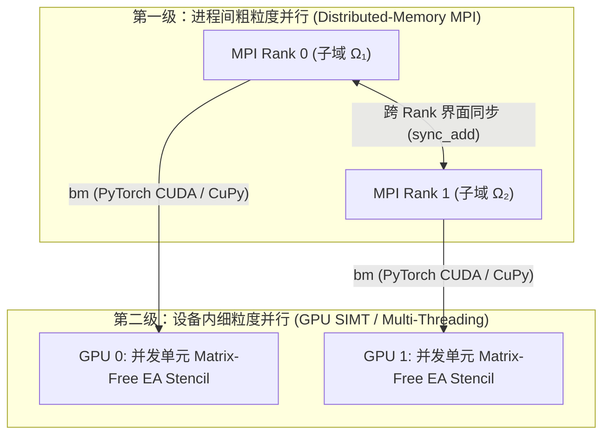
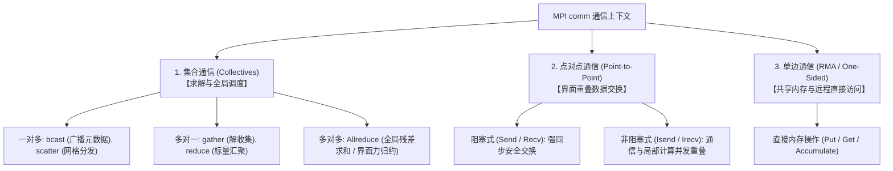
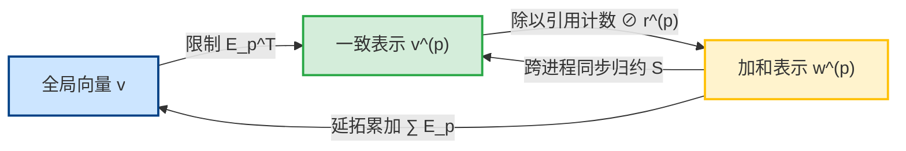
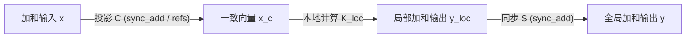

# 分布式无矩阵计算全景：区域分解、重叠副本代数与两级混合并行

> **一句话**：基于非重叠单元切分与对等重叠副本表示，通过一致/加和双重代数表示、局部无矩阵（EA/PA）算子作用、跨进程同步归约与重叠加权内积，建立外层 MPI 粗粒度通信与内层 GPU 细粒度高算力融合的两级高性能计算体系。
>
> **定位**：本页是分布式无矩阵有限元计算、区域分解代数与 GPU 混合并行的**统一全景主档（Topic-Centric Hub）**。向下覆盖 L1 代数原理与 L3 异构执行，作为通用理论事实源，为分布式有限元与无矩阵求解器提供第一原理支持。

---

## 1. 高性能并行策略与范式全景

在大规模有限元模拟中，单层级并行难以兼顾跨节点强扩展性与单卡高吞吐。现代高性能计算采用**两级混合并行（Two-Level Hybrid Parallelism）**范式：

### 1.1 并行策略分类对比

| 并行策略 | 界面自由度处理 | 通信模式 | 适用场景与特征 |
| :--- | :--- | :--- | :--- |
| **重叠副本策略 (Overlapping-Copy)** ⭐ | 界面自由度在所有相关 Rank 上**对等复制**，维护一致/加和双重代数表示 | 对称同步（`sync_add` / 引用加权） | **本项目与分布式有限元基线采用**。代码完全对称，单机/分布式完全复用同一套算子，天然适配 Matrix-Free。 |
| **主属独占策略 (Owner-Computes)** | 严格划分唯一 Owner，其余为只读 Ghost 副本 | 定向点对点收发 (Scatter/Gather) | 传统商业 FEM 软件；主从判断分支繁琐，边界条件处理不对称。 |
| **全局矩阵并行切分 (Parallel SpMV)** | 显式装配全局 CSR/CSC 矩阵并按行切分 | 稀疏矩阵乘点对点邻居通信 | 传统代数求解器 (PETSc/Hypre)；在 GPU 上严重受制于显存带宽（Memory-Bound）。 |

### 1.2 MPI 通信子体系与三种通信模式

#### 1.2.1 通信子 (Communicator) 分类与适用场景
在分布式内存体系中，通信子 `comm` 定义了进程通信的边界与上下文：

| 通信子类型 | 创建/获取方式 | 适用场景 |
| :--- | :--- | :--- |
| **全局通信子 (COMM_WORLD)** | `MPI.COMM_WORLD` | 本次计算启动的全部进程组（默认基准）。 |
| **单进程隔离通信子 (COMM_SELF)** | `MPI.COMM_SELF` | 仅包含当前进程本身，用于单卡/单核完全隔离的调试验证。 |
| **任务拆分子通信子** | `comm.Split(color, key)` | **多物理场/混合任务**：例如将进程划分为“流体求解组”、“固体求解组”或“异步 I/O 组”。 |
| **节点内共享内存通信子** | `comm.Split_type(MPI.COMM_TYPE_SHARED)` | **同机多卡/NUMA 加速**：同一物理节点内的进程直接通过 POSIX 共享内存通信，跳过网络协议栈。 |
| **空间拓扑感知通信子** | `comm.Create_dist_graph(...)` | **网格邻域通信优化**：告知底层通信库各子域的几何邻接关系，由硬件交换机优化路由。 |

#### 1.2.2 三种核心通信模式的代数与硬件映射
1. **集合通信 (Collective Communication)**：
   - 全组协同操作，硬件层面通常由二叉树/环形拓扑（Tree/Ring Allreduce）硬件级加速；
   - 在网格分发阶段用于参数广播 (`bcast`) 与子网格下发 (`scatter`)，在 Krylov 迭代阶段用于全局残差标量归约 (`Allreduce`)。
2. **点对点通信 (Point-to-Point Communication)**：
   - 进程间一对一数据交换，是界面自由度数据同步（`sync_add`）的底层通信通道；
   - **计算-通信重叠（Overlapping）**：通过异步非阻塞调用 `Isend` / `Irecv`，在网格交界面进行跨节点网络传输的同时，GPU/CPU 立即并发执行子域内部单元（Internal Elements）的有限元矩阵无关积，隐藏通信延迟。
3. **单边通信 (One-Sided Communication / RMA)**：
   - 通过 `MPI.Win` 远程内存窗口实现零拷贝直接内存访问，适合动态非平衡负载或分布式共享参数池。

---

## 2. 区域分解与非重叠网格切分契约

### 2.1 互斥与完备性原理
设全物理区域 $\Omega \subset \mathbb{R}^d$ 的一致网格剖分为单元集合 $\mathcal{T}_h = \{K_e\}_{e=1}^{N_e}$。将网格切分为 $P$ 个 MPI Rank 的子域网格：
$$\mathcal{T}_h = \bigcup_{p=0}^{P-1} \mathcal{T}_h^{(p)}$$

必须严格满足两条并行几何契约：
1. **互斥性 (Disjoint)**：$\mathcal{T}_h^{(p)} \cap \mathcal{T}_h^{(q)} = \varnothing \quad (\forall p \neq q)$；
2. **完备性 (Exhaustive)**：$\sum_{p=0}^{P-1} \mathbf{1}_{\mathcal{T}_h^{(p)}} = \mathbf{1}_{\mathcal{T}_h}$（每个单元有且仅有一个 Rank 拥有，无遗漏覆盖）。

### 2.2 几何坐标二分 (Coordinate Bisection)
在极简验证与基准测试中，采用质心坐标二分：
- 沿切分轴计算几何中点：$x_{\text{mid}} = \frac{1}{2} (x_{\min} + x_{\max})$；
- Rank 0 拥有质心 $x_c < x_{\text{mid}}$ 的单元；Rank 1 拥有质心 $x_c \ge x_{\text{mid}}$ 的单元。
-

---

## 3. 共享自由度与重叠副本代数

### 3.1 限制/延拓算子与引用计数 ($r_i$)
对全局 True-DOF 维数 $N$ 及进程 $p$ 的局部 DOF 维数 $N_p$：
- **限制算子** $\mathbf{E}_p^\top \in \{0, 1\}^{N_p \times N}$：从全局提取局部 DOF。
- **延拓算子** $\mathbf{E}_p \in \{0, 1\}^{N \times N_p}$：局部 DOF 零开拓至全局。满足 $\mathbf{E}_p^\top \mathbf{E}_p = \mathbf{I}_{N_p \times N_p}$。
- **全局引用计数向量** $\boldsymbol{r} \triangleq \sum_{p=0}^{P-1} \mathbf{E}_p \mathbf{1}^{(p)} \in \mathbb{Z}_{>0}^N$ 及 **引用对角阵** $\mathbf{D} \triangleq \operatorname{diag}(\boldsymbol{r}) = \sum_{p=0}^{P-1} \mathbf{E}_p \mathbf{E}_p^\top$。
- **局部引用计数** $\boldsymbol{r}^{(p)} \triangleq \mathbf{E}_p^\top \boldsymbol{r}$（独占 DOF $r_j^{(p)}=1$，界面共享 DOF $r_j^{(p)} \ge 2$），局部对角阵为 $\mathbf{D}_p \triangleq \operatorname{diag}(\boldsymbol{r}^{(p)}) = \mathbf{E}_p^\top \mathbf{D} \mathbf{E}_p$。

### 3.2 双重向量表示：一致表示 vs. 加和表示

| 表示类型 | 代数定义 | 物理与代数语义 |
|---|---|---|
| **一致表示 (Consistent, $\mathbf{u}_c$)** | $\boldsymbol{v}^{(p)} = \mathbf{E}_p^\top \boldsymbol{v}, \;\forall p$ | 界面共享副本数值完全一致（如位移解向量、应变计算输入） |
| **加和表示 (Additive, $\mathbf{f}_a$)** | $\sum_{p=0}^{P-1} \mathbf{E}_p \boldsymbol{w}^{(p)} = \boldsymbol{w}$ | 仅保存局部单元微分贡献（如外力载荷、未归约 MatVec 作用） |

> ⚠️ **重要注记**：$\oslash\boldsymbol r$ 是**表示转换**，不是加权平均。凡出现除以引用计数之处，都是把一致表示按副本数均分成加和表示，好让后续的跨 rank 求和不重复计数；它不表达任何「对多份副本取平均」的物理含义。

### 3.3 归约算子 $\mathcal{S}$、投影算子 $\mathcal{C}$ 与算子提升映射

- **跨进程同步归约算子 $\mathcal{S}$**：
  $$\bigl[\mathcal{S}(\{\boldsymbol{v}^{(q)}\})\bigr]_p \triangleq \mathbf{E}_p^\top \left( \sum_{q=0}^{P-1} \mathbf{E}_q \boldsymbol{v}^{(q)} \right)$$
- **一致化投影算子 $\mathcal{C}$**：
  $$\mathcal{C}(\cdot) \triangleq \mathcal{S}(\cdot) \oslash \boldsymbol{r} \implies \bigl[\mathcal{C}(\{\boldsymbol{v}^{(q)}\})\bigr]_p = \mathbf{E}_p^\top \left( \mathbf{D}^{-1} \sum_{q=0}^{P-1} \mathbf{E}_q \boldsymbol{v}^{(q)} \right)$$
- **全局分布式算子提升三步流水线**：
  $$\mathbf{y} = \mathcal{S} \circ K_{\mathrm{loc}} \circ \mathcal{C}(\mathbf{x})$$

> **定理 1 (MatVec 精确等价定理)**：对全局算子分解 $\mathbf{K} = \sum_{p=0}^{P-1} \mathbf{E}_p \mathbf{K}^{(p)} \mathbf{E}_p^\top$，对任意一致输入 $\boldsymbol{x}^{(p)} = \mathbf{E}_p^\top \boldsymbol{x}$，分布式算子在各进程的分量精确等于全局乘法的限制提取：
> $$\bigl[\mathcal{A}_{\mathrm{dist}}(\{\mathbf{E}_q^\top \boldsymbol{x}\})\bigr]_p = \mathbf{E}_p^\top \mathbf{K} \boldsymbol{x}$$
> 且输出向量组重新自动构成全局结果 $\mathbf{K}\boldsymbol{x}$ 的一致表示。

---

## 4. 无矩阵 (Matrix-Free) 装配分级与 GPU 算术强度

### 4.1 五级装配分类体系中的定位
依据 [[../matrix-free/assembly-levels]]，本项目实施聚焦于 **EA (Element-Assembly)** 与 **FA (Fully-Assembled)** 的同离散对照：

| 特性 | 全装配 (FA) | 单元装配 Matrix-Free (EA) |
| :--- | :--- | :--- |
| **存储对象** | 全局稀疏矩阵 $\mathbf{K}$ (CSR 格式) | 局部单元矩阵集合 $\{\mathbf{K}_e\}$ |
| **显存占用** | 大（随自由度剧烈膨胀） | 小（仅存各单元小稠密阵） |
| **每次 MatVec** | 稀疏矩阵向量乘 (SpMV) | Gather $\to$ 单元小矩阵乘 $\to$ Scatter-Add |
| **GPU 访存瓶颈** | 严重受制于显存带宽 (Memory-Bound) | 局部高算力密度，契约适配 GPU 并发 |
| **并行边界条件** | 难以在多 Rank 下做对称消元 | **天然适配对角投影** ($\boldsymbol{\Pi}_D, \boldsymbol{\Pi}_I$) |

---

## 5. 重叠加权内积与分布式 Krylov 求解器

定义一致向量上的**重叠加权内积**：
$$(\boldsymbol{u}, \boldsymbol{v})_w \triangleq \sum_{p=0}^{P-1} (\boldsymbol{u}^{(p)})^\top \mathbf{D}_p^{-1} \boldsymbol{v}^{(p)} = \sum_{p=0}^{P-1} \sum_{j=1}^{N_p} \frac{u_j^{(p)} v_j^{(p)}}{r_j^{(p)}}$$

### 5.1 Krylov 求解器数学等价性
> **定理 2 (消除重复计数定理)**：若 $\boldsymbol{u}^{(p)} = \mathbf{E}_p^\top \boldsymbol{u}, \boldsymbol{v}^{(p)} = \mathbf{E}_p^\top \boldsymbol{v}$，则 $(\boldsymbol{u}, \boldsymbol{v})_w = \boldsymbol{u}^\top \boldsymbol{v} = \langle \boldsymbol{u}, \boldsymbol{v} \rangle_{\mathbb{R}^N}$。
>
> **定理 3 (自共轭与 SPD 保持)**：若 $\mathbf{K} = \mathbf{K}^\top \succ 0$，则 $(\boldsymbol{u}, \mathcal{A}_{\mathrm{dist}} \boldsymbol{v})_w = \boldsymbol{u}^\top \mathbf{K} \boldsymbol{v} = (\mathcal{A}_{\mathrm{dist}} \boldsymbol{u}, \boldsymbol{v})_w$。

由此保障：分布式 PCG / GMRES 迭代序列与单 Rank 串行解在代数精度上完全同构，收敛阶与能量范数误差界保持不变。

---

## 6. 全局解收集算子 $\mathcal{G}$ 的代数恢复理论

在分布式求解完成后，将各子域的一致表示解向量组恢复为全局唯一解向量的过程由解收集算子 $\mathcal{G}$ 确定：

$$\boldsymbol{u}_{\mathrm{global}} = \mathcal{G}(\{\boldsymbol{u}^{(p)}\}) \triangleq \mathbf{D}^{-1} \sum_{p=0}^{P-1} \mathbf{E}_p \boldsymbol{u}^{(p)}$$

> **定理 4 (解收集的无失真恢复)**：若输入向量组 $\{\boldsymbol{u}^{(p)}\}$ 为全局真实解 $\boldsymbol{u}$ 的一致表示（即 $\boldsymbol{u}^{(p)} = \mathbf{E}_p^\top \boldsymbol{u}$），则：
> $$\mathcal{G}(\{\mathbf{E}_p^\top \boldsymbol{u}\}) = \mathbf{D}^{-1} \left( \sum_{p=0}^{P-1} \mathbf{E}_p \mathbf{E}_p^\top \right) \boldsymbol{u} = \mathbf{D}^{-1} \mathbf{D} \boldsymbol{u} = \boldsymbol{u}$$
> 即解收集过程在数学上是精确无失真的。

---

## 相关页面

- [[distributed-algebra-and-execution-decoupling]] — 三层解耦框架（Math / API / Hardware）。
- [[heterogeneous-execution-modes]] — GPU 异构并行与执行模式分类。
- [[../matrix-free/assembly-levels]] — FA/LA/EA/PA/UA 5 级 Matrix-Free 装配层次。
- [[performance-model]] — 端到端计时边界与 Roofline 性能模型。
