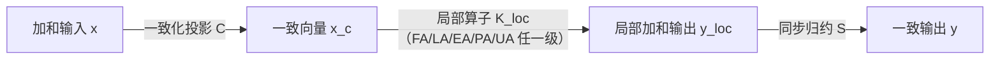

# 分布式有限元算子：网格分区、共享自由度与 MPI 同步

> **一句话**：基于对等重叠副本表示，分布式有限元算子通过一致表示输入、局部算子作用、跨进程同步归约与重叠加权内积，建立与串行全局算子同构且正交自共轭的分布式代数体系。
> 
> **定位**：本页是分布式算子、共享自由度与加权内积的**纯代数理论第一原理（What & Math）**。独立于具体软件 API 与硬件架构，对 FA/LA/EA/PA/UA **全部 5 级装配层次通用**（见 [[../matrix-free/assembly-levels]]）。
>
> ⚠️ **边界**：只覆盖**进程级（MPI）**并行的**代数正确性**。$\mathbf{K}_{\mathrm{loc}}$ 在本页是黑盒——线程级与设备内（SIMT）的写竞态、访存合并问题全在该黑盒内部，不在本页（见 [[parallel-levels]]）；本页亦不含任何性能、加速比或扩展性内容。

---

## 1. 实体共享、自由度映射与引用计数 ($r_i$)

### 1.1 区域分解的两条几何契约
设全域 $\Omega \subset \mathbb{R}^d$ 的一致网格剖分为单元集合 $\mathcal{T}_h = \{K_e\}_{e=1}^{N_e}$，切分为 $P$ 个 rank 的子域网格时，必须严格满足：

1. **互斥性 (Disjoint)**：$\mathcal{T}_h^{(p)} \cap \mathcal{T}_h^{(q)} = \varnothing \quad (\forall p \neq q)$；
2. **完备性 (Exhaustive)**：$\sum_{p=0}^{P-1} \mathbf{1}_{\mathcal{T}_h^{(p)}} = \mathbf{1}_{\mathcal{T}_h}$，即每个单元有且仅有一个 rank 拥有，无遗漏、无重复。

两条契约是后续全部结论的前提：破坏互斥性会使 $\mathbf{K} = \sum_p \mathbf{E}_p \mathbf{K}^{(p)} \mathbf{E}_p^\top$ 重复计数，破坏完备性会使其漏项。**分区只约束单元，不约束自由度**——界面自由度必然被多个 rank 共享，这正是引用计数 $r_i$ 的来由。

契约之外的分区质量（通信量最优）由 METIS/ParMETIS 一类图分割负责，与本页代数无关；最简验证与基准测试用几何坐标二分即可，它只保证两条契约成立、结果可逐点复现。

⚠️ 若局部表示是在**子结构**上缩聚得到的（PIML 路线），分区面还需与子结构面对齐，见 [[parallel-levels]] 进程层一节。

### 1.2 限制/延拓算子与引用计数
对全局 True-DOF 维数 $N$ 及进程 $p$ 的局部 DOF 维数 $N_p$：
- **限制算子** $\mathbf{E}_p^\top \in \{0, 1\}^{N_p \times N}$：从全局提取局部 DOF。
- **延拓算子** $\mathbf{E}_p \in \{0, 1\}^{N \times N_p}$：局部 DOF 零开拓至全局。满足 $\mathbf{E}_p^\top \mathbf{E}_p = \mathbf{I}_{N_p \times N_p}$。
- **全局引用计数向量** $\boldsymbol{r} \triangleq \sum_{p=0}^{P-1} \mathbf{E}_p \mathbf{1}^{(p)} \in \mathbb{Z}_{>0}^N$ 及 **引用对角阵** $\mathbf{D} \triangleq \operatorname{diag}(\boldsymbol{r}) = \sum_{p=0}^{P-1} \mathbf{E}_p \mathbf{E}_p^\top$。
- **局部引用计数** $\boldsymbol{r}^{(p)} \triangleq \mathbf{E}_p^\top \boldsymbol{r}$（独占 DOF $r_j^{(p)}=1$，界面共享 DOF $r_j^{(p)} \ge 2$），局部对角阵为 $\mathbf{D}_p \triangleq \operatorname{diag}(\boldsymbol{r}^{(p)}) = \mathbf{E}_p^\top \mathbf{D} \mathbf{E}_p$。

---

## 2. 双重向量表示与同步/投影算子

### 2.1 先决选择：三种界面自由度策略

同一套分区之下，界面自由度可以有三种表示策略；本页及本课题采用**重叠副本**，后续全部代数都建立在这个选择上。

| 策略 | 界面自由度处理 | 通信模式 | 特征 |
|---|---|---|---|
| **重叠副本 (Overlapping-Copy)** ⭐ | 界面自由度在所有相关 rank 上**对等复制**，维护一致/加和双重表示 | 对称同步（`sync_add` / 引用计数加权） | **本页采用**。代码完全对称，串行与分布式复用同一套算子，天然适配 Matrix-Free。 |
| **主属独占 (Owner-Computes)** | 严格指定唯一 owner，其余为只读 ghost | 定向点对点 scatter/gather | 传统商业 FEM 常用；主从分支繁琐，边界条件处理不对称。 |
| **全局矩阵切分 (Parallel SpMV)** | 显式装配全局 CSR 并按行切分 | 稀疏矩阵乘的邻居点对点 | 传统代数求解器（PETSc/Hypre）路线；与 Matrix-Free 互斥，且 SpMV 本身访存受限。 |

选重叠副本的代价是同一个界面自由度存在多份副本，因此**必须区分"数值一致"与"贡献可加"两种表示**，这正是下面双重表示与引用计数的由来。

### 2.2 一致表示与加和表示

| 表示类型 | 代数定义 | 物理与代数语义 |
|---|---|---|
| **一致表示 (Consistent)** | $\boldsymbol{v}^{(p)} = \mathbf{E}_p^\top \boldsymbol{v}, \;\forall p$ | 界面共享副本数值完全一致（如位移解向量） |
| **加和表示 (Additive)** | $\sum_{p=0}^{P-1} \mathbf{E}_p \boldsymbol{w}^{(p)} = \boldsymbol{w}$ | 仅保存局部单元微分贡献（如外力载荷、未归约 MatVec 作用） |

**$\oslash\boldsymbol r$ 是表示转换，不是加权平均。** 凡出现除以引用计数之处，都是把一致表示按副本数均分成加和表示，好让后续的跨 rank 求和不重复计数；它不表达任何「对多份副本取平均」的物理含义。把它误读成平均，会在推导归约顺序时得出错误结论。

### 2.3 归约算子 $\mathcal{S}$ 与投影算子 $\mathcal{C}$
- **跨进程同步归约算子 $\mathcal{S}$**：$\bigl[\mathcal{S}(\{\boldsymbol{v}^{(q)}\})\bigr]_p \triangleq \mathbf{E}_p^\top \left( \sum_{q=0}^{P-1} \mathbf{E}_q \boldsymbol{v}^{(q)} \right)$。
- **一致化投影算子 $\mathcal{C}$**：$\mathcal{C}(\cdot) \triangleq \mathcal{S}(\cdot) \oslash \boldsymbol{r} \implies \bigl[\mathcal{C}(\{\boldsymbol{v}^{(q)}\})\bigr]_p = \mathbf{E}_p^\top \left( \mathbf{D}^{-1} \sum_{q=0}^{P-1} \mathbf{E}_q \boldsymbol{v}^{(q)} \right)$。

两条基本性质：$\mathcal{C}$ 幂等（$\mathcal{C}^2 = \mathcal{C}$，一致表示是其不动点）；$\mathcal{S}$ 把任意加和表示映为对应的一致表示（若 $\sum_q \mathbf{E}_q \boldsymbol{w}^{(q)} = \boldsymbol{w}$ 则 $\mathcal{S}(\{\boldsymbol{w}^{(p)}\}) = \{\mathbf{E}_p^\top \boldsymbol{w}\}$）。下节定理 3 直接建立在这两条之上。

---

## 3. 分布式算子作用 (MatVec) 精确等价定理

对全局算子分解 $\mathbf{K} = \sum_{p=0}^{P-1} \mathbf{E}_p \mathbf{K}^{(p)} \mathbf{E}_p^\top$，定义重叠算子作用 $\mathcal{A}_{\mathrm{dist}}(\{\boldsymbol{x}^{(p)}\}) \triangleq \mathcal{S}\left( \left\{ \mathbf{K}^{(p)} \boldsymbol{x}^{(p)} \right\} \right)$。

> **定理 3 (MatVec 精确等价定理)**
> 对任意一致输入 $\boldsymbol{x}^{(p)} = \mathbf{E}_p^\top \boldsymbol{x}$，分布式算子在各进程的分量精确等于全局乘法的限制提取：
> $$ \bigl[\mathcal{A}_{\mathrm{dist}}(\{\mathbf{E}_q^\top \boldsymbol{x}\})\bigr]_p = \mathbf{E}_p^\top \mathbf{K} \boldsymbol{x}, \tag{1} $$
> 且输出向量组重新自动构成全局结果 $\mathbf{K}\boldsymbol{x}$ 的**一致表示**。

### 3.1 实现形态：算子提升三步流水线

定理 3 假定输入已是一致表示。工程实现中输入未必满足这一点，故完整的分布式算子作用是三步：

$$
\mathbf{y} = \mathcal{S} \circ \mathbf{K}_{\mathrm{loc}} \circ \mathcal{C}(\mathbf{x}).
$$

首尾两步是通信，中间一步是纯本地计算——**这条流水线是并行粒度划分的落点**：$\mathcal{C}$ 与 $\mathcal{S}$ 落在进程层，$\mathbf{K}_{\mathrm{loc}}$ 落在线程层与设备内层（见 [[parallel-levels]]）。若输入已保证一致，$\mathcal{C}$ 可省略，退化为定理 3 的形式。

---

## 4. 重叠加权内积与 Krylov 求解器收敛理论

定义一致向量上的**重叠加权内积**：

$$
(\boldsymbol{u}, \boldsymbol{v})_w \triangleq \sum_{p=0}^{P-1} (\boldsymbol{u}^{(p)})^\top \mathbf{D}_p^{-1} \boldsymbol{v}^{(p)} = \sum_{p=0}^{P-1} \sum_{j=1}^{N_p} \frac{u_j^{(p)} v_j^{(p)}}{r_j^{(p)}}.
\tag{2}
$$

### 4.1 核心定理与 Krylov 保障
> **定理 4 (消除重复计数定理)**：若 $\boldsymbol{u}^{(p)} = \mathbf{E}_p^\top \boldsymbol{u}, \boldsymbol{v}^{(p)} = \mathbf{E}_p^\top \boldsymbol{v}$，则 $(\boldsymbol{u}, \boldsymbol{v})_w = \boldsymbol{u}^\top \boldsymbol{v} = \langle \boldsymbol{u}, \boldsymbol{v} \rangle_{\mathbb{R}^N}$。
> 
> **定理 5 (自共轭与 SPD 性)**：若 $\mathbf{K} = \mathbf{K}^\top \succ 0$，则 $(\boldsymbol{u}, \mathcal{A}_{\mathrm{dist}} \boldsymbol{v})_w = \boldsymbol{u}^\top \mathbf{K} \boldsymbol{v} = (\mathcal{A}_{\mathrm{dist}} \boldsymbol{u}, \boldsymbol{v})_w$。

因此并行 CG / GMRES 的解序列精确满足 $\boldsymbol{x}_{k}^{(p)} = \mathbf{E}_p^\top \boldsymbol{x}_k$，串行的能量范数收敛上界（只依赖 $\kappa(\mathbf{K})$）原样成立——**分布式不引入任何额外收敛代价**。

---

## 5. 解收集算子 $\mathcal{G}$

解恢复算子定义为：$\boldsymbol{u}_{\mathrm{global}} = \mathcal{G}(\{\boldsymbol{u}^{(p)}\}) \triangleq \mathbf{D}^{-1} \sum_{p=0}^{P-1} \mathbf{E}_p \boldsymbol{u}^{(p)}$。一致输入时 $\mathcal{G}(\{\mathbf{E}_p^\top \boldsymbol{u}\}) = \boldsymbol{u}$ 无失真恢复。

---

## 相关页面

- [[heterogeneous-execution-modes]] — 硬件拓扑、执行层级与编程模型的分类规范。
- [[../matrix-free/assembly-levels]] — FA/LA/EA/PA/UA 5 级 Matrix-Free 装配层次。
- [[parallel-levels]] — 进程/线程/设备内三层并行的卡点划分（本页是其进程层的代数事实源）。
- [[../linear-elasticity]] — 位移型线弹性有限元离散基础。
