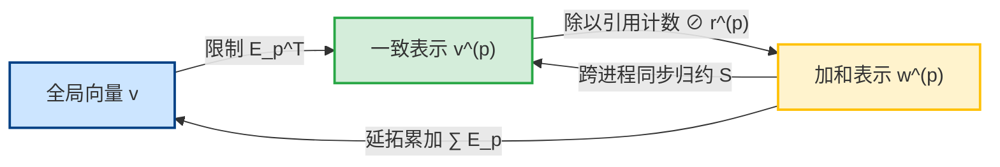

# 分布式有限元算子：网格分区、共享自由度与 MPI 同步

> **一句话**：基于对等重叠副本表示，分布式有限元算子通过一致表示输入、局部算子作用、跨进程同步归约与重叠加权内积，建立与串行全局算子同构且正交自共轭的分布式代数体系。
> 
> **定位**：本页是分布式算子、共享自由度与加权内积的**纯代数理论第一原理（What & Math）**。独立于具体软件 API 与硬件架构，对 FA/LA/EA/PA/UA **全部 5 级装配层次通用**（见 [[../matrix-free/assembly-levels]]）。

---

## 1. 实体共享、自由度映射与引用计数 ($r_i$)

### 1.1 单元非重叠划分与共享实体映射
全局网格 $\mathcal{T}_h = \bigcup_{p=0}^{P-1} \mathcal{T}_h^{(p)}$ 满足 $\mathcal{T}_h^{(p)} \cap \mathcal{T}_h^{(q)} = \varnothing \; (p \neq q)$。分区界面 $\Gamma$ 处 $d$-维实体（节点/边/面）跨进程共享，其映射通过共享对集合建立：

$$
\mathcal{P}_{p, q}^{(d)} = \left\{ (i^{(p)}, j^{(q)}) \in \mathcal{E}_d^{(p)} \times \mathcal{E}_d^{(q)} \;\middle|\; \text{局部实体 } i^{(p)} \text{ 与 } j^{(q)} \text{ 对应同一全局实体} \right\}.
\tag{1}
$$

### 1.2 限制/延拓算子与引用计数
对全局 True-DOF 维数 $N$ 及进程 $p$ 的局部 DOF 维数 $N_p$：
- **限制算子** $\mathbf{E}_p^\top \in \{0, 1\}^{N_p \times N}$：从全局提取局部 DOF。
- **延拓算子** $\mathbf{E}_p \in \{0, 1\}^{N \times N_p}$：局部 DOF 零开拓至全局。满足 $\mathbf{E}_p^\top \mathbf{E}_p = \mathbf{I}_{N_p \times N_p}$。
- **全局引用计数向量** $\boldsymbol{r} \triangleq \sum_{p=0}^{P-1} \mathbf{E}_p \mathbf{1}^{(p)} \in \mathbb{Z}_{>0}^N$ 及 **引用对角阵** $\mathbf{D} \triangleq \operatorname{diag}(\boldsymbol{r}) = \sum_{p=0}^{P-1} \mathbf{E}_p \mathbf{E}_p^\top$。
- **局部引用计数** $\boldsymbol{r}^{(p)} \triangleq \mathbf{E}_p^\top \boldsymbol{r}$（独占 DOF $r_j^{(p)}=1$，界面共享 DOF $r_j^{(p)} \ge 2$），局部对角阵为 $\mathbf{D}_p \triangleq \operatorname{diag}(\boldsymbol{r}^{(p)}) = \mathbf{E}_p^\top \mathbf{D} \mathbf{E}_p$。

---

## 2. 双重向量表示与同步/投影算子

| 表示类型 | 代数定义 | 物理与代数语义 |
|---|---|---|
| **一致表示 (Consistent)** | $\boldsymbol{v}^{(p)} = \mathbf{E}_p^\top \boldsymbol{v}, \;\forall p$ | 界面共享副本数值完全一致（如位移解向量） |
| **加和表示 (Additive)** | $\sum_{p=0}^{P-1} \mathbf{E}_p \boldsymbol{w}^{(p)} = \boldsymbol{w}$ | 仅保存局部单元微分贡献（如外力载荷、未归约 MatVec 作用） |

**$\oslash\boldsymbol r$ 是表示转换，不是加权平均。** 凡出现除以引用计数之处，都是把一致表示按副本数均分成加和表示，好让后续的跨 rank 求和不重复计数；它不表达任何「对多份副本取平均」的物理含义。把它误读成平均，会在推导归约顺序时得出错误结论。

### 2.1 归约算子 $\mathcal{S}$ 与投影算子 $\mathcal{C}$
- **跨进程同步归约算子 $\mathcal{S}$**：$\bigl[\mathcal{S}(\{\boldsymbol{v}^{(q)}\})\bigr]_p \triangleq \mathbf{E}_p^\top \left( \sum_{q=0}^{P-1} \mathbf{E}_q \boldsymbol{v}^{(q)} \right)$。
- **一致化投影算子 $\mathcal{C}$**：$\mathcal{C}(\cdot) \triangleq \mathcal{S}(\cdot) \oslash \boldsymbol{r} \implies \bigl[\mathcal{C}(\{\boldsymbol{v}^{(q)}\})\bigr]_p = \mathbf{E}_p^\top \left( \mathbf{D}^{-1} \sum_{q=0}^{P-1} \mathbf{E}_q \boldsymbol{v}^{(q)} \right)$。

### 2.2 核心定理
> **定理 1 (投影幂等性与不动点)**：$\mathcal{C}^2 = \mathcal{C}$；且对任意一致表示 $\mathcal{C}(\{\mathbf{E}_p^\top \boldsymbol{v}\}) = \{\mathbf{E}_p^\top \boldsymbol{v}\}$。
> 
> **定理 2 (加和向一致表示的映射)**：若 $\sum_q \mathbf{E}_q \boldsymbol{w}^{(q)} = \boldsymbol{w}$，则 $\mathcal{S}(\{\boldsymbol{w}^{(p)}\}) = \{\mathbf{E}_p^\top \boldsymbol{w}\}$。

---

## 3. 分布式算子作用 (MatVec) 精确等价定理

对全局算子分解 $\mathbf{K} = \sum_{p=0}^{P-1} \mathbf{E}_p \mathbf{K}^{(p)} \mathbf{E}_p^\top$，定义重叠算子作用 $\mathcal{A}_{\mathrm{dist}}(\{\boldsymbol{x}^{(p)}\}) \triangleq \mathcal{S}\left( \left\{ \mathbf{K}^{(p)} \boldsymbol{x}^{(p)} \right\} \right)$。

> **定理 3 (MatVec 精确等价定理)**
> 对任意一致输入 $\boldsymbol{x}^{(p)} = \mathbf{E}_p^\top \boldsymbol{x}$，分布式算子在各进程的分量精确等于全局乘法的限制提取：
> $$ \bigl[\mathcal{A}_{\mathrm{dist}}(\{\mathbf{E}_q^\top \boldsymbol{x}\})\bigr]_p = \mathbf{E}_p^\top \mathbf{K} \boldsymbol{x}, \tag{2} $$
> 且输出向量组重新自动构成全局结果 $\mathbf{K}\boldsymbol{x}$ 的**一致表示**。

---

## 4. 重叠加权内积与 Krylov 求解器收敛理论

定义一致向量上的**重叠加权内积**：

$$
(\boldsymbol{u}, \boldsymbol{v})_w \triangleq \sum_{p=0}^{P-1} (\boldsymbol{u}^{(p)})^\top \mathbf{D}_p^{-1} \boldsymbol{v}^{(p)} = \sum_{p=0}^{P-1} \sum_{j=1}^{N_p} \frac{u_j^{(p)} v_j^{(p)}}{r_j^{(p)}}.
\tag{3}
$$

### 4.1 核心定理与 Krylov 保障
> **定理 4 (消除重复计数定理)**：若 $\boldsymbol{u}^{(p)} = \mathbf{E}_p^\top \boldsymbol{u}, \boldsymbol{v}^{(p)} = \mathbf{E}_p^\top \boldsymbol{v}$，则 $(\boldsymbol{u}, \boldsymbol{v})_w = \boldsymbol{u}^\top \boldsymbol{v} = \langle \boldsymbol{u}, \boldsymbol{v} \rangle_{\mathbb{R}^N}$。
> 
> **定理 5 (自共轭与 SPD 性)**：若 $\mathbf{K} = \mathbf{K}^\top \succ 0$，则 $(\boldsymbol{u}, \mathcal{A}_{\mathrm{dist}} \boldsymbol{v})_w = \boldsymbol{u}^\top \mathbf{K} \boldsymbol{v} = (\mathcal{A}_{\mathrm{dist}} \boldsymbol{u}, \boldsymbol{v})_w$。

并行 CG / GMRES 解序列精确满足 $\boldsymbol{x}_{k}^{(p)} = \mathbf{E}_p^\top \boldsymbol{x}_k$，且能量范数下收敛上界严格保持：$\frac{\|\boldsymbol{x}_k - \boldsymbol{x}^*\|_\mathbf{K}}{\|\boldsymbol{x}_0 - \boldsymbol{x}^*\|_\mathbf{K}} \le 2 \left( \frac{\sqrt{\kappa(\mathbf{K})} - 1}{\sqrt{\kappa(\mathbf{K})} + 1} \right)^k$。

---

## 5. 解收集算子 $\mathcal{G}$

解恢复算子定义为：$\boldsymbol{u}_{\mathrm{global}} = \mathcal{G}(\{\boldsymbol{u}^{(p)}\}) \triangleq \mathbf{D}^{-1} \sum_{p=0}^{P-1} \mathbf{E}_p \boldsymbol{u}^{(p)}$。一致输入时 $\mathcal{G}(\{\mathbf{E}_p^\top \boldsymbol{u}\}) = \boldsymbol{u}$ 无失真恢复。

---

## 相关页面

- [[distributed-algebra-and-execution-decoupling]] — 系统代数层、接口层与硬件层解耦框架（第 2 柱）。
- [[heterogeneous-execution-modes]] — 硬件拓扑与异构执行模式（第 3 柱）。
- [[../matrix-free/assembly-levels]] — FA/LA/EA/PA/UA 5 级 Matrix-Free 装配层次。
- [[../linear-elasticity]] — 位移型线弹性有限元离散基础。
