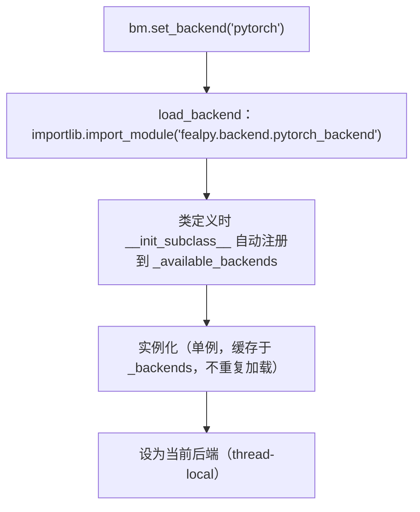

# FEALPy 架构：多后端抽象与 EMPI 轻量分布式层

> **一句话**：FEALPy 4.0 的异构执行由两层正交机制组成——`BackendManager` 运行时对象分派（`__getattr__` 重定向）让同一份用户代码在 numpy/pytorch/cupy/taichi 等后端下无改动执行，GPU 经 PyTorch/CuPy（高层库接口）与 Taichi（Python+JIT）路径；进程间以 EMPI 共享对机制实现轻量分布式通信（sync_add/gather_add/bcast），与 MFEM 的 Par\* 对象体系形成对照。

本页是 FEALPy 异构执行架构的完整入口：§1–§4 为单进程多后端机制与 GPU 执行路径，§5–§6 为 EMPI 分布式层与成熟度边界。与 MFEM 的整体架构对比见 [[fealpy-mfem-gpu-backend-comparison]]，六档分类见 [[../heterogeneous-execution-modes#4. 编程模型]]。

## 1. BackendManager：运行时对象分派


核心位于 `fealpy/backend/manager.py`。设计要点：

- **动态加载**：`set_backend(name)` 首次调用时 `importlib.import_module(f"fealpy.backend.{name}_backend")` 导入后端模块，实例化后存入注册表 `_backends`（单例，不重复加载）。
- **线程本地状态**：当前后端存入 `_THREAD_LOCAL`（`threading.local()`），多线程各自持有独立当前后端。
- **懒加载**：`get_current_backend()` 在未显式设置时按默认后端自动加载，避免不必要的后端导入。
- **属性重定向**：`__getattr__` / `__setattr__` 把对 manager 的一切属性访问转发给当前后端实例——这是整个架构的关键：用户代码只面对统一入口 `backend_manager`（惯例别名 `bm`），不感知当前后端是谁。

代码仓库中 1846 个 `.py` 文件中约 715 个（≈39%）使用 backend 抽象，覆盖 sparse、solver、mesh 等核心模块。

## 2. BackendProxy 协议与后端实现

`fealpy/backend/base.py` 定义 `BackendProxy` 基类与 `TensorLike` 协议（`dtype`/`device`/`shape`/`size`/逐算子接口），各后端实现该协议后注册进 `_available_backends`。

| 后端        | 实现文件                   | 类别（六档分类见 [[../heterogeneous-execution-modes#4. 编程模型]]） | 特点                                                                  |
| --------- | ---------------------- | --------------------------------------------------- | ------------------------------------------------------------------- |
| numpy     | `numpy_backend.py`     | 纯 CPU 参考                                            | 默认参考实现                                                              |
| pytorch   | `pytorch_backend.py`   | 高层库接口                                               | 跨 CUDA/ROCm/MPS；`tensor.device` 显式                                  |
| cupy      | `cupy_backend.py`      | 高层库接口                                               | 设计定位最贴近 CUDA 的 Python 映射；**当前为早期占位实现**（详见 §3、§4）                    |
| taichi    | `taichi_backend.py`    | Python + JIT                                        | 内含多个 `@ti.kernel`；`set_default_device` 接受 `ti.cuda`/`ti.cpu` 等 arch |
| jax       | `jax_backend.py`       | 高层库接口                                               | JIT/XLA 编译路径                                                        |
| mindspore | `mindspore_backend.py` | 高层库接口                                               | 华为昇腾等国产硬件路线                                                         |
| paddle    | `paddle_backend.py`    | 高层库接口                                               | 海光 DCU 等国产硬件路线                                                      |

各后端对 `TensorLike` 协议的逐算子实现细节与行为差异不在本页展开（API 级差异见 [[../../../archive/fealpy34-to-40-migration]]）。

**注册与加载链**：



## 3. GPU 执行路径

**路径全景**：FEALPy 的 GPU 执行归为两类编程模型（见 [[../heterogeneous-execution-modes#4. 编程模型|六档分类]]）——高层库接口（调用库写好的 kernel）与 Python+JIT（自己写 kernel 编译执行）：

| 编程模型档 | 后端 | 状态 |
|---|---|---|
| 高层库接口 | PyTorch | 可用，已实际验证（research guide §5.2 minimal_demo CPU/CUDA 逐位一致） |
| 高层库接口 | JAX | 机制存在（JIT/XLA 编译路径），未验证 |
| 高层库接口 | CuPy | 占位实现，不可用（见 §4） |
| 高层库接口 | MindSpore / Paddle | 国产硬件后备（昇腾 / 海光 DCU），算子与性能需重新验证 |
| Python + JIT | Taichi | 机制存在（内含 `@ti.kernel`），未验证 |

目前实际验证过的只有 PyTorch 一条；Taichi、JAX 与国产路线机制存在但未验证，CuPy 为占位实现。

各路径细节如下：

FEALPy 自身不写 GPU kernel（除 Taichi 后端），GPU 执行完全委托给所选后端框架：

1. **CuPy 路径**：`cupy_backend` 设计上直接映射 CUDA kernel、最接近原生；**但当前仅为早期占位实现，实际不可用**——共 287 行（numpy/pytorch 后端分别为 679/913 行），`set_default_device`、`simplex_hess_shape_function`、`tensor_measure` 直接抛 `NotImplementedError`（前者的错误消息仍残留 "NumPyBackend" 字样，为复制占位），仅覆盖少量几何工具函数，sparse/solver 等核心 `bm` 使用面未接入，官方测试未覆盖。
2. **PyTorch 路径**：`pytorch_backend` 走 `torch.Tensor` 的设备语义（`cuda` device），可跨 CUDA/ROCm/MPS 硬件。
3. **Taichi 路径**：`taichi_backend` 内含 `@ti.kernel` 即时编译内核，`ti.init(arch=...)` 选择设备（CUDA、Vulkan、Metal 等）。
4. **国产路线（备注）**：MindSpore/Paddle 后端面向昇腾、海光 DCU 等硬件，属可选的国产替代路径，算子与性能特征需重新验证。

后端选择与硬件拓扑正交：同一套 `bm.*` 调用在 `set_backend` 切换后执行不同实现；GPU 上的加速层级（kernel/MatVec/solve）按五级口径单独计时，不能把框架层 kernel 加速直接写成完整 solve 加速。

## 4. 覆盖范围

| 层 | 状态 | 证据 |
|---|---|---|
| sparse（稀疏张量/CSR） | 已后端化 | `fealpy/sparse/ops.py` 等使用 `backend_manager` |
| solver | 部分后端化 | `fealpy/solver/tpdv.py` 使用 `bm`；gmres/bicgstab/amg 等模块存在，覆盖度待逐项核实 |
| mesh | 部分使用 | 覆盖度待核实 |
| 测试 | numpy 为主 | `test/backend/test_backends.py` 目前仅参数化 `numpy`；jax/mindspore 有专属测试文件，cupy 无任何测试 |
| cupy 后端本体 | 占位实现 | `fealpy/backend/cupy_backend.py` 共 287 行，关键 API 抛 `NotImplementedError`，实际不可用 |

## 5. EMPI 轻量分布式层

### 5.1 设计哲学：轻量通信接口

EMPI 的定位与 MFEM Par\* 体系形成鲜明对照（对比见 [[mfem-architecture#5. Par* 对象体系与 MPI 并行机制]]）：

- **非完整网格数据结构**：不存储网格拓扑关系，只专注通信功能；
- **无归属区分**：不引入"真实实体/虚拟实体"概念，简化重叠区域数据结构；
- **通用性**：支持任意网格实体类型（单元/面/边/点）与任意函数空间自由度；
- **通信次数优化**：共享对机制实现双向一次性数据传递，减少多次通信。

### 5.2 共享对机制与进程映射

核心数据结构 `SharingPair` 记录共享实体在双方分区的局部编号：

```text
SharingPair(index_self, index_other)
  index_self:  共享实体在自身分区的局部编号
  index_other: 共享实体在对方分区的局部编号
```

`EntityMPI` 主对象持有 `_id`（分区标识）、`_process_map`（分区→进程映射，由 `MPI_Alltoall` 构建）、`_global_indices`、`_sharing_pairs` 列表。

### 5.3 三种通信操作

| 操作 | 语义 | 应用场景 |
|---|---|---|
| 同步 `sync_add` | 重叠实体上合并各分区数据（相加） | 力/热通量传递、`MatVec` 后的重叠自由度归约 |
| 聚集 `gather_add` | 各分区数据聚合到全局空间 | 全局残差、总体刚度矩阵组装 |
| 广播 `bcast` | 全局数据分发到各分区 | 边界条件设置、全局参数传递 |

同步操作与 [[../distributed-operator-and-shared-dofs]] 的三阶段 MatVec（输入同步 + 局部作用 + 输出归约）直接对应：`MatVec` 局部作用后经 `sync_add` 完成重叠自由度的输出归约。

### 5.4 分布式组装工作流

从 `xihe/examples/simple_box/run_parallel.py`（三维 Maxwell 简单盒算例）提炼的完整流程：

```text
root rank：构建全局网格与空间
  → cell_partition：按坐标生成 npx×npy 分区掩码（简单均匀划分）
  → distribute_mesh(mesh, masks, comm)     # 各 rank 得到本地子网格
  → distribute_space(space, dm, root=0)    # 各 rank 得到分布式空间与 dofcomm
  → 本地组装（BilinearForm/LinearForm）     # 与单进程相同 API
  → DistributedOperator 包装（MatVec 后 dofcomm.sync_add）  # 通信透明化的算子
  → gmres_mpi(op, rhs, empi=dofcomm)       # 并行 GMRES（xihe 提供）
  → dofcomm.gather_add(...)                # 聚合到全局解
  → 全局误差计算与 VTU 输出
```

`DistributedOperator` 把 `sync_add` 嵌入 `__matmul__`，用户层算子接口保持与单进程一致——这是「统一接口 + 通信透明」模式的轻量实现。

### 5.5 与 MFEM MPI 层的对比

| 维度 | FEALPy（轻量函数式） | MFEM（成熟对象体系，见 [[mfem-architecture]]） |
|---|---|---|
| 分布式对象 | `distribute_mesh`/`distribute_space` 函数 + `EntityMPI` | ParMesh/ParFiniteElementSpace 等 Par\* 类（继承+扩展） |
| 重叠实体处理 | 共享对（SharingPair），不区分归属 | 通信表 + 共享自由度标记 + 规约 |
| 通信原语 | `sync_add`/`gather_add`/`bcast`（MPI 透明包装） | MPI 原语直接使用（Allreduce/Send-Recv/非阻塞） |
| 分区方式 | 用户传入掩码（算例用坐标掩码） | METIS/ParMETIS 图划分 |
| 并行矩阵/求解器 | 无库级矩阵对象；GMRES 由用户层（xihe `gmres_mpi`）提供 | HypreParMatrix + Hypre 求解器（BoomerAMG/GMRES/CG）库级集成 |
| 设计目标 | 最小通信接口，嵌入已有单进程框架 | 完整分布式有限元对象体系 |

## 6. 成熟度边界

**分布式层为早期实现**：

- 函数式 API（`distribute_*` + NamedTuple 结果），尚无 Par\* 类层次；
- 分区依赖用户传入掩码，库内未内置 METIS/ParMETIS 类划分器；
- 并行求解器（`gmres_mpi`）在 xihe 仓库而非 FEALPy 本体；
- 未覆盖 GPU-aware MPI、多 GPU 设备绑定或异步通信（EMPI 讲义列为扩展方向）；
- 单进程 backend 抽象（§1–§4）与分布式层正交：`EntityMPI` 的张量操作经 `bm` 走当前后端。

**backend 层**：官方测试仅闭环 numpy，GPU 后端行为差异需要自己验证，不可假定与 numpy 一致（CuPy 占位实现见 §3/§4）。

## 7. 在我研究中的位置

- **soptx**（阶段 1 载体）：`soptx/tests/test_cantilever_3d_wsl.py` 参数化 NumPy/PyTorch/JAX backend 与 `cpu/cuda` device，直接嫁接 FEALPy 的抽象思路（[[../../../research/technical-lines/gpu-hpc-research-guide#五、阶段门禁与当前执行状态|research guide 阶段 1]]）。
- **xihe/matrix_free_3**：分布式算子原型运行在 FEALPy backend 之上。
- FEALPy backend 层测试覆盖不足（仅 numpy）意味着 GPU 后端行为差异需要自己验证，不可假定与 numpy 一致。

## 8. 来源与证据

- `\\wsl.localhost\Ubuntu-24.04\home\brighthe\workspace\fealpy_stable`：`fealpy/backend/manager.py`、`base.py`、各 `*_backend.py`、`fealpy/sparse/`、`fealpy/solver/`、`test/backend/test_backends.py`。
- `external_deps/cuda.py` 是 CUDA 环境安装器，不是求解器代码，不属于 backend 架构。
- `suanhaitech/xihe`（公司仓库）`kb/explanation/empi.md` — EMPI 讲义（同步/聚集/广播操作、共享对机制、`dist_from_masks` 工具）；`kb/design/empi.md` 为设计文档。
- `suanhaitech/xihe` `examples/simple_box/run_parallel.py` — 三维 Maxwell 并行算例（分布式组装工作流、`DistributedOperator` 模式）。
- `suanhaitech/fealpy`（develop）与本地 `fealpy_stable` 的 `fealpy/distributed/`：`distributed_mesh.py`（`distribute_mesh`）、`distributed_space.py`（`distribute_space`）、`entity_mpi.py`（`EntityMPI`、`dist_from_masks`、`mapped_masks`）。
- 公司仓库内容只提炼机制与引用路径，不复制代码。
- [[../../../archive/fealpy34-to-40-migration]] — API 行为差异与修复对照（已归档）。
- [[fealpy-mfem-gpu-backend-comparison]] — 与 MFEM 的实现层次对比。

## 相关页面

- [[../../../archive/fealpy34-to-40-migration]] — FEALPy 3.4→4.0 API 迁移笔记（已归档，角度正交）。
- [[../heterogeneous-execution-modes]] — 六档编程模型分类（本页是其「可移植后端」档的 Python 实例）。
- [[mfem-architecture]] — MFEM 整体架构（C++ 编译期展开 + Par\* 对象体系），本页的对照对象。
- [[fealpy-mfem-gpu-backend-comparison]] — 与 MFEM 的对比。
- [[../distributed-operator-and-shared-dofs]] — 分布式算子第一原理（sync_add 对应输出归约）。
- [[../heterogeneous-execution-modes#2. 硬件拓扑]] — 多节点并行在硬件拓扑分类中的位置。
