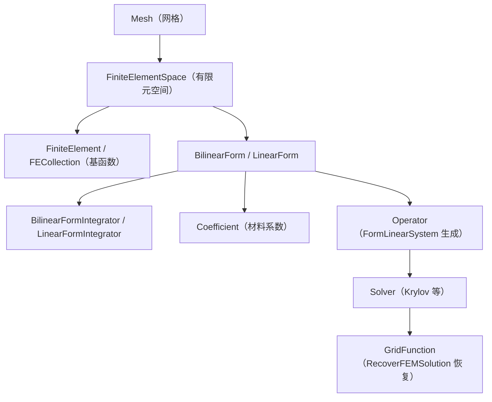
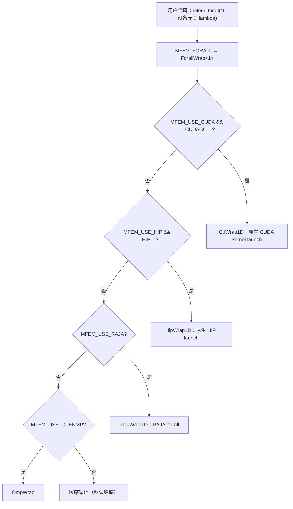
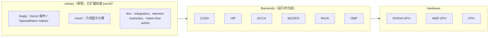

# MFEM 架构：多后端抽象与 Par* 并行体系

> **一句话**：MFEM 的异构执行是「编译期多后端抽象 + 运行时分派」的混合——`Device` 单例运行时选择后端组合（`Backend::Id` 优先级链），`forall` 宏编译期把同一份 `MFEM_HOST_DEVICE` lambda 展开为 CUDA/HIP/OpenMP/RAJA 等后端的实际调用；分布式并行以 Par\* 对象体系（「继承 + 扩展」升级）承载，构成「节点内 GPU 计算 × 节点间 MPI 通信」的混合架构。

本页是 MFEM 异构执行架构的完整入口：§1–§4 为整体架构与单进程多后端机制，§5 为 Par\* MPI 并行机制，§6–§7 为 GPU 执行路径与覆盖范围，§8–§9 为混合架构与可迁移启示。与 FEALPy 的整体架构对比见 [[fealpy-mfem-gpu-backend-comparison]]，六档分类见 [[../heterogeneous-execution-modes#4. 编程模型]]。

## 1. 整体架构与核心对象抽象链

MFEM 的"整体架构"是论文 §2（Poisson 模型问题）展示的核心对象抽象链（Anderson et al. 2021）：网格 → 有限元空间 → 双线性/线性形式 → 线性算子 → 求解器 → 网格函数。GPU 加速机制（§6–§7）挂接在这条链的向量层、integrator 层与 matrix-free 算子层。



并行侧：`ParMesh`/`ParFiniteElementSpace`/`ParBilinearForm` 等 `Par*` 类继承同名串行类并扩展 MPI 通信（§5）；GPU 侧是对这条链的向量层与算子层的设备化。

## 2. Backend::Id 枚举：15 个后端

`general/device.hpp` 的 `Backend::Id` 用位枚举定义全部后端，并区分 host 与 device：

| 类别 | 后端 | 启用条件 |
|---|---|---|
| host | `CPU`（默认，最低优先级）、`OMP` | `MFEM_USE_OPENMP` |
| device（原生） | `CUDA`、`HIP` | `MFEM_USE_CUDA` / `MFEM_USE_HIP` |
| device（RAJA 包装） | `RAJA_CPU`、`RAJA_OMP`、`RAJA_CUDA`、`RAJA_HIP` | `MFEM_USE_RAJA` + 对应编译器宏 |
| device（OCCA 包装） | `OCCA_CPU`、`OCCA_OMP`、`OCCA_CUDA` | `MFEM_USE_OCCA` |
| device（libCEED 委托） | `CEED_CPU`、`CEED_CUDA`、`CEED_HIP` | `MFEM_USE_CEED` + 对应后端 |
| 调试 | `DEBUG_DEVICE` | 编译期调试选项 |

位枚举允许 `DEVICE_MASK = CUDA_MASK | HIP_MASK | DEBUG_DEVICE` 等掩码操作，多个后端可同时启用。

## 3. Device 单例：运行时配置与内存管理

`Device` 是进程内单例（`Device::Get()`），核心是 `Configure(device_string)`：

- **配置字符串**：逗号分隔的后端名列表，如 `"cuda"`、`"raja-cuda,omp"`；`gpu` 为 `cuda`/`hip` 的别名。
- **优先级链**（同时配置多个时从高到低）：`ceed-cuda > occa-cuda > raja-cuda > cuda > ceed-hip > hip > debug > occa-omp > raja-omp > omp > ceed-cpu > occa-cpu > raja-cpu > cpu`；`cpu` 永远以最低优先级启用。
- **内存管理**：`MemoryType`/`MemoryClass`（`HOST`/`DEVICE`）成对管理 host 与 device 内存；`SetMemoryTypes(h_mt, d_mt)` 设置默认内存类型并保持二者互偶（dual），算子与向量层的设备搬移由该抽象统一追踪——搬移成本被显性化。

## 4. forall 宏：编译期后端展开链



`general/forall.hpp` 是 kernel 写法的核心。用户代码写成：

```cpp
mfem::forall(N, [=] MFEM_HOST_DEVICE (int i) { /* 算子体 */ });
```

> **lambda 是写法，kernel 是执行形态**：`[=] MFEM_HOST_DEVICE (int i){...}` 是 C++ 匿名函数（lambda），本身与 GPU 无关；kernel 是 CUDA 术语，指由 CPU 发射（launch）、在 GPU 上被大量线程并行执行的函数（每线程执行同一份代码，靠线程编号区分数据）。`MFEM_HOST_DEVICE` 让编译器把同一份 lambda 生成 host 与 device 两份代码，device 版即 kernel 的函数体；`forall` 的展开包装（CuWrap1D 等）替用户完成原生 CUDA 需手写的"算线程下标 + 配置线程块 + launch"。因此 MFEM 中用户不写 kernel（无 `__global__`、无 `<<<>>>`），只写 lambda——写法与 CPU 串行循环体几乎一致，这就是"单一源码（single source）"。

展开链路（编译期决定）：

1. `MFEM_FORALL(i, N, ...)` → `ForallWrap<1>(true, N, [=] MFEM_HOST_DEVICE (int i){...})`；
2. `ForallWrap` 按构建配置与编译器宏分派到包装函数：
   - `MFEM_USE_CUDA && __CUDACC__` → `CuWrap1D`（原生 CUDA kernel launch）；
   - `MFEM_USE_HIP && __HIP__` → `HipWrap1D`（原生 HIP）；
   - `MFEM_USE_RAJA && RAJA_ENABLE_CUDA && __CUDACC__` → `RajaCuWrap1D` → `RAJA::forall<RAJA::cuda_exec<MFEM_CUDA_BLOCKS, true>>`；
   - `MFEM_USE_OPENMP` → `OmpWrap`；
   - 默认 → 顺序循环。
3. 另有 `MFEM_FORALL_2D/3D`（指定 block 维度）与 `MFEM_FORALL_SWITCH`（小向量强制走 CPU，见 `vector.cpp`）。

`MFEM_GPU_FORALL` 是简化的 device-only 变体（无 host 路径），非 GPU 构建时为 no-op。

## 5. Par* 对象体系与 MPI 并行机制

### 5.1 继承 + 扩展模式

并行对象是单进程对象的并行版本，遵循「继承 + 扩展」：继承全部功能，新增分布式数据结构：

| 并行对象 | 单进程对应 | 新增能力 |
|---|---|---|
| `ParMesh` | `Mesh` | 通信表（face communication table）、共享边界信息 |
| `ParFiniteElementSpace` | `FiniteElementSpace` | 共享自由度映射、全局编号 |
| `ParBilinearForm`/`ParLinearForm` | `BilinearForm`/`LinearForm` | 分布式组装与进程间贡献规约 |
| `ParGridFunction` | `GridFunction` | 共享节点同步（sync flags） |
| `HypreParMatrix` | `SparseMatrix` | ParCSR 分布式存储、Hypre 求解器接口 |

该模式让用户代码在串行/并行环境共用同一套 API，是降低并行编程学习成本的架构手段（启示 H-2）。

### 5.2 领域分解与自由度组织

- **划分**：MFEM 使用 METIS/ParMETIS 图划分实现负载均衡，每个 MPI rank 管理一个或多个非重叠子域。
- **三类自由度**：
  - **本地自由度**：完全属于当前 rank，无通信需求；
  - **共享自由度**：位于进程边界、被多 rank 共享，组装后需规约；
  - **远程自由度**：由其他 rank 管理，组装时需发送贡献值。
- **编号规则**：先编本地、再编共享，使全局矩阵具有分块结构，利于并行求解。

三类自由度的归约语义与 [[../distributed-operator-and-shared-dofs]] 的 owned/ghost 表示对应：MFEM 的「本地+共享+远程」是同一数学结构的一种实现。

### 5.3 并行组装与通信

并行组装四阶段：**本地组装**（各 rank 独立遍历单元）→ **索引映射**（ParFiniteElementSpace 全局编号）→ **贡献规约**（共享自由度累加）→ **矩阵构建**（HypreParMatrix/ParCSR）。

通信模式：点对点 `MPI_Send/Recv`（相邻 rank）、非阻塞 `MPI_Isend/Irecv`（计算-通信重叠）、`MPI_Allreduce`（共享自由度累加）、`MPI_Scatter/Gather`（全局数据分布/收集）。通信边界由通信表管理，标记 rank 间数据依赖。

### 5.4 HypreParMatrix 与并行求解

- **矩阵格式**：ParCSR（分布式 CSR）同时承载设备端矩阵数据结构与分布式索引/通信表——它是连接「多后端抽象」与「MPI 通信」两套职责的桥接对象。
- **求解器**：与 Hypre 集成（BoomerAMG、GMRES、CG 等）；串行与并行求解器接口结构相似，便于切换。
- **数据流**：`ParBilinearForm` 组装 → `HypreParMatrix` → Hypre 迭代求解（内部 MPI 通信）→ `HypreParVector` → `ParGridFunction` 同步 → 后处理。

## 6. GPU 执行路径

**模块化设计图**（重画自论文 Figure 8：Library → Backends → Memory → Hardware）：



Memory 类在库侧管理 host/device 双指针（R/W），与 §3 的 MemoryType/MemoryClass 对应。论文要点：kernel 以单一源码（single source）为主，性能关键 kernel 增加按后端与有限元阶数的分派点；后端可在**运行时**选择——不同 MPI rank 可选用不同后端（CPU 或 GPU）。

与 FEALPy 的关键差异：MFEM 无"占位实现"问题——所有执行路径随构建选项启用即可用；换路径的代价是重新编译，换来编译期检查与内联优化。

## 7. 覆盖范围

官方口径（论文 §6.3，MFEM 4.0 引入加速器支持时的清单；最新源码覆盖可能更多，未逐项重核）：

| 目录 | 设备端执行状态 | 证据 |
|---|---|---|
| linalg | 大部分 `Vector` 操作与 `SparseMatrix` matvec；Krylov 求解器与时间步进因基于 Vector 原语**自动在设备端执行** | Anderson et al. 2021 §6.3 |
| mesh | 几何因子（geometric factors）计算已移植 | 同上 |
| fem | mass/diffusion/convection(DG)/gradient/divergence 及部分 H(curl) integrators；element restriction 与 quadrature interpolator 算子（G/B）；`BilinearForm`/`MixedBilinearForm`/`NonlinearForm` 的 matrix-free action（PA/QA 主战场，术语见 [[../../matrix-free/assembly-levels#框架术语映射]]） | 同上 |
| 未移植（边界） | 网格细化/粗化、多个 integrator、稀疏矩阵显式组装、误差估计、外部库集成 | 同上 |

## 8. 多后端 × MPI 混合架构

每 MPI rank 通常绑定一个 GPU 设备：节点内计算走多后端抽象层，节点间通信走 MPI。关键决策路径：

```text
GPU 可用？
  ├─ 否 → 纯 CPU + 标准 MPI
  └─ 是 → GPU-aware MPI？
        ├─ 是 → GPU 直接通信（零拷贝）
        └─ 否 → GPU→CPU→MPI→CPU→GPU 中转
        → Hypre 支持 GPU？
              ├─ 是 → 端到端 GPU 计算
              └─ 否 → 组装在 GPU、求解在 CPU 的混合路径
```

**设计边界**：GPU 显存容量（限制每进程子域规模）、GPU 间通信带宽（NVLink/PCIe）、GPU-aware MPI 支持度（决定通信路径）、Hypre GPU 支持度（决定求解路径）、内存模型匹配（设备端与分布式矩阵格式差异）。

**职责隔离原则**：设备相关操作（内存分配、kernel 启动）与分布式相关操作（进程间通信、全局索引）分离，由 HypreParMatrix 这类中间对象桥接。

## 9. 可迁移架构启示

从 MFEM 架构提炼的五项通用模式（来源：houzai 报告，基于 MFEM 社区工作坊演讲）：

- **H-1 层级化抽象**：网格层→空间层→形式层→求解层，关注点分离；
- **H-2 对象继承 + 扩展**：串行→并行升级不破坏用户 API；
- **H-3 懒惰求值**：按需触发 CPU-GPU 数据传输，减少通信开销；
- **H-4 统一接口 + 多后端分发**：同一算子接口按硬件自动选择执行路径；
- **H-5 自适应执行路径**：按 GPU 可用性/GPU-aware MPI/求解器 GPU 支持逐级选择执行路径。

迁移约束：GPU 后端一致性、MPI 实现兼容性（GPU-aware 支持）、第三方求解器 GPU 支持、显存与问题规模匹配、编译工具链版本。

## 10. 与 FEALPy 的层次对比

| 维度 | MFEM | FEALPy 4.0（见 [[fealpy-architecture]]） |
|---|---|---|
| 后端选择 | 运行时 `Configure()` + **编译期** `MFEM_USE_*` 决定展开 | 运行时 `set_backend()` |
| kernel 表达 | 用户自写 `MFEM_HOST_DEVICE` lambda | 交给后端框架（PyTorch/Taichi 等） |
| 展开机制 | 宏 + 模板包装函数，每次编译时固化 | `__getattr__` 对象分派，执行时查表 |
| 内存 | `MemoryType`/`MemoryClass` 显式管理 | 交给框架的 `tensor.device` |
| 多后端 | 15 个位枚举 + 优先级链 | 7 个插件后端 |
| 分布式层 | Par\* 类体系（继承+扩展）+ HypreParMatrix | `distribute_*` 函数 + EMPI 共享对（轻量） |

关键差异的完整展开（编译期 vs 运行期可移植、换后端代价对比）见 [[fealpy-mfem-gpu-backend-comparison#1. 后端抽象机制]]。

## 11. 在我研究中的位置

- **mfleo**（独立单 GPU PA/Matrix-Free 工程）以 MFEM 的 PA/UA 算子路径与装配层级为概念参照（[[../../matrix-free/assembly-levels#框架术语映射]]），性能报告以 MFEM PA 基线为对照。
- MFEM 的 `FULL/ELEMENT/PARTIAL/NONE` 装配层级是 [[../../matrix-free/assembly-levels]] 五级分类的术语来源之一；其 PA/QA 在设备端的执行路径是 Matrix-Free GPU 求解的设备端参照。
- MFEM 的 Par\* 体系与混合架构是本项目多 GPU/GPU-aware MPI 阶段（research guide 阶段 5）的对象模型参照。
- 本项目不直接依赖 MFEM 库；本页只记录可复用的机制知识。

## 12. 来源与证据

- Anderson et al. 2021, *MFEM: A Modular Finite Element Methods Library*, Computers & Mathematics with Applications 81:42–74（arXiv:1911.09220，DOI: 10.1016/j.camwa.2020.06.009）— 整体架构（§2 对象抽象链）与 GPU 官方口径（§6.3、Figure 8 模块化设计）；论文图按结构重画为 mermaid，不复制图片。
- `C:\workspace\mfem`（WSL）：`general/device.hpp`（`Backend::Id` 枚举、`Device::Configure` 优先级链、`MemoryType`/`MemoryClass`）、`general/forall.hpp`（`MFEM_FORALL`/`MFEM_GPU_FORALL` 宏与 CuWrap/HipWrap/RajaWrap/OmpWrap 展开）。
- [mfem.org](https://mfem.org) — 官方文档与最新特性（论文 2021 年后 Device 后端有演进，以官网为准）。
- `suanhaitech/houzai`（公司仓库）`docs/affairs/external_reports/2026_07_31_dalianligong_first_biweekly/attachments/mfem_multibackend_and_mpi.md` — 本人的《MFEM 多后端与 MPI 并行架构深度剖析与可迁移性分析》，基于 MFEM 社区工作坊公开演讲（John Camier 的 GPU kernel 优化、Par\* 并行机制等）；作为本页架构模式的主要来源。
- MFEM 社区工作坊演讲材料（LLNL 公开内容）。
- 公司仓库内容只提炼机制与引用路径，不复制代码。

## 相关页面

- [[../heterogeneous-execution-modes]] — 六档编程模型分类（本页是其「可移植后端」档的 C++ 实例）。
- [[fealpy-architecture]] — Python 侧对称文档。
- [[fealpy-mfem-gpu-backend-comparison]] — 两库对比。
- [[../../matrix-free/assembly-levels]] — MFEM 装配层级术语来源。
- [[../distributed-operator-and-shared-dofs]] — 分布式算子数学（owned/ghost、归约）。
- [[../heterogeneous-execution-modes#2. 硬件拓扑]] — 多节点 GPU-aware MPI 在硬件拓扑分类中的位置。
