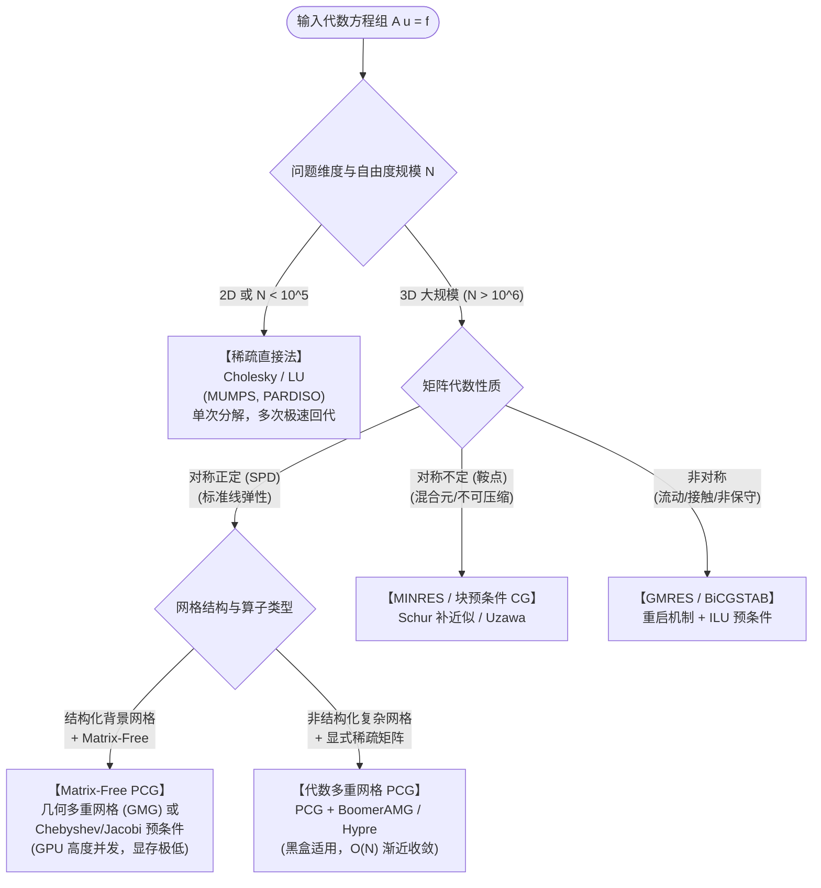

# 线性求解器体系架构

> 偏微分方程（PDE）经有限元离散后，核心计算负载最终转化为大型稀疏线性代数方程组 $\mathbf{A}\mathbf{u} = \mathbf{f}$ 的求解。线性求解器体系并非孤立算法的散乱集合，而是围绕**矩阵代数性质**、**问题维度与空间复杂度**、**代数容差与鲁棒性**三条本质判定线构建的分层协同网络。稀疏直接法提供单调确定的数值真理基线与粗网格求解器；定常迭代法提供局部高频误差消除能力（平滑器）；Krylov 子空间法通过最优正交投影实现超线性加速；多重网格法通过跨尺度层次投影实现渐近最优的 $O(N)$ 复杂度；而预条件技术则是连接各层、调控条件数谱分布的核心枢纽。

---

## 一、三条本质判定线

选择与设计线性求解器时，必须通过三条正交维度对物理问题与代数系统进行联合判定：

```
                ┌──────────────────────────────────────────────┐
                │             三条本质判定线                    │
                └──────────────────────┬───────────────────────┘
                                       │
         ┌─────────────────────────────┼─────────────────────────────┐
         ▼                             ▼                             ▼
   【判定线一：矩阵代数性质】       【判定线二：维度与规模复杂度】      【判定线三：鲁棒性与代数容差】
   - 对称正定（SPD，如线弹性）     - 2D 中小规模（直接法显著占优）    - 强鲁棒单调确定性（直接法）
   - 对称不定（鞍点/不可压缩）     - 3D 大规模（内存爆炸，必须迭代）  - 条件数/谱聚集敏感（Krylov）
   - 非对称（对流占优/非保守）     - GPU/Matrix-Free（无矩阵适配）    - 渐近最优平滑投影（多重网格）
```

### 1. 矩阵代数性质（Mathematical Properties）
- **对称正定（Symmetric Positive Definite, SPD）**：
  - 典型物理背景：位移型线弹性力学、自伴椭圆方程（泊松方程）；
  - 理论保证：能量内积 $\langle \mathbf{u}, \mathbf{v} \rangle_{\mathbf{A}} = \mathbf{u}^{\mathsf{T}}\mathbf{A}\mathbf{v}$ 定义范数，共轭梯度法（CG）保证在能量范数下误差严格单调极小化；Cholesky 分解无须选主元。
- **对称不定（Symmetric Indefinite / Saddle-Point）**：
  - 典型物理背景：混合有限元（如 Hu–Zhang 单元、Stokes 流体、不可压缩/近不可压缩弹性）；
  - 代数结构：具有分块鞍点形式 $\begin{bmatrix} \mathbf{A} & \mathbf{B}^{\mathsf{T}} \\ \mathbf{B} & -\mathbf{C} \end{bmatrix}$，存在正负特征值；
  - 求解约束：CG 会因零曲率或不定二次型崩溃；必须采用 MINRES 或特定对称不定块预条件（如 Schur 补近似、Uzawa 算法）。
- **非对称矩阵（Non-Symmetric）**：
  - 典型物理背景：Navier–Stokes 流动、对流扩散方程、非关联塑性力学；
  - 求解约束：内积对称性丧失，三项递推截断失效；必须采用全正交 GMRES（需重启以控制正交化内存）或双正交 BiCGSTAB。

### 2. 空间维度、规模与计算复杂度（Dimensions & Complexity）
- **二维与中小型三维（$N \le 10^5 \sim 10^6$）**：
  - 稀疏直接法具有不可动摇的工程优势。虽然二维带状/波前分解有填充（Fill-in），但嵌套剖分（Nested Dissection）可使二维 Cholesky 运算复杂度控制在 $O(N^{1.5})$、内存 $O(N \log N)$；
  - 一次分解后，伴随变量与多载荷工况的三角回代几乎瞬时完成。
- **三维大规模（$N \ge 10^6 \sim 10^8$）**：
  - 三维直接分解的因子填充呈断崖式恶化（运算复杂度 $O(N^2)$，显式存储因子达数千 GB 显存/内存）；
  - 内存墙直接逼停直接法，必须转向**迭代求解器体系**（Krylov + 预条件 / 多重网格）；
  - 在 GPU 或无矩阵（Matrix-Free）架构下，显存仅容纳向量与局部几何量，无法显式存储全局切刚度矩阵，迭代法成为唯一物理可行路线。

### 3. 代数容差与收敛鲁棒性（Tolerance & Robustness）
- **高精度需求（$\mathrm{tol} \le 10^{-10}$）**：
  - 直接法仅受浮点舍入误差影响；迭代法在此容差下受严重条件数放大效应影响，迭代步数剧烈发散；
- **优化与工程精度（$\mathrm{tol} \sim 10^{-4} - 10^{-6}$）**：
  - 拓扑优化每次外循环仅需要结构变形与敏度的中等精度评价，迭代法（特别是截断 Krylov 法）能以较小步数提前退出，性价比极高；
  - 需警惕：不可完全牺牲代数精度导致假收敛或破环对偶灵敏度一致性。

---

## 二、四层代数协同架构

整个求解器体系不是单选关系，而是垂直贯通的协同分层：

```
                ┌──────────────────────────────────────────────┐
                │          第四层：最粗层直接解 / 基线           │
                │     [[direct-methods|稀疏直接法]] (Cholesky / LU)     │
                └──────────────────────▲───────────────────────┘
                                       │ 粗网格直接逆 / 正确性对照
                ┌──────────────────────┴───────────────────────┐
                │          第三层：全局多尺度加速              │
                │     [[multigrid|多重网格法]] (GMG / AMG)           │
                │     (通过限制/延拓消除低频，实现 O(N) 渐近复杂度)      │
                └──────────────────────▲───────────────────────┘
                                       │ 作为多尺度预条件子
       ┌───────────────────────────────┴───────────────────────────────┐
       │                                                               │
┌──────┴───────────────────────┐                               ┌───────┴──────────────────────┐
│     第二层：子空间投影加速   │   ◄─── [[preconditioning|预条件技术]] ────►   │      第一层：局部误差平滑    │
│ [[krylov-subspace-methods|Krylov 子空间法]] │        (谱半径压缩、聚集特征值)       │ [[stationary-iterations|定常迭代法]] (平滑器)  │
│      (CG / GMRES / MINRES)   │                               │     (Jacobi / Gauss-Seidel)  │
└──────────────────────────────┘                               └──────────────────────────────┘
```

### 1. 第一层：定常迭代法（平滑器，Smoother）
- **核心定位**：[[stationary-iterations|定常迭代法]]（Jacobi、Gauss-Seidel、SOR、Chebyshev）以简单分裂 $\mathbf{A} = \mathbf{M} - \mathbf{N}$ 进行固定迭代；
- **真实价值**：**定常迭代法绝不用于独立求解大型问题**（对低频误差收敛极度停滞，步数 $O(N^2)$），但它在局部节点层面具有极强的**高频误差消除能力**；因此，它在整个架构中专职担任**多重网格的光滑器（Smoother）**，或以 Jacobi 形式作为最廉价的对角预条件。

### 2. 第二层：Krylov 子空间法（加速收敛引擎）
- **核心定位**：[[krylov-subspace-methods|Krylov 子空间法]]从初始残差生成的 Krylov 子空间 $\mathcal{K}_m(\mathbf{A}, \mathbf{r}_0) = \mathrm{span}\{\mathbf{r}_0, \mathbf{A}\mathbf{r}_0, \dots, \mathbf{A}^{m-1}\mathbf{r}_0\}$ 中寻找最佳逼近；
- **矩阵抽象契约**：Krylov 法**仅需要矩阵与向量的乘积（MatVec）**，不依赖矩阵元素的物理存储格式，是与 [[../matrix-free/assembly-levels|Matrix-Free]] 及 GPU 异构算子天然契合的求解框架；
- **收敛本质**：将收敛问题转化为多项式极值问题，若特征值高度聚拢，则即便自由度达千万级，亦可在极少步内收敛。

### 3. 第三层：多重网格法（渐近最优多尺度展开）
- **核心定位**：[[multigrid|多重网格法]]（几何多重网格 GMG 与代数多重网格 AMG）解决迭代法随网格加密步数膨胀（条件数 $\kappa = O(h^{-2})$）的根本顽疾；
- **机制互补**：在细网格上使用定常迭代平滑高频振荡；将无法消除的光滑低频残差通过限制算子 $\mathbf{I}_h^H$ 投影到粗网格上，由于低频在粗网格上转化为高频，粗网格平滑器可继续有效消除，直至最粗层；
- **复杂度契约**：唯一理论上能将线弹性 PDE 求解控制在 $O(N)$ 严格线性复杂度的代数算法体系。

### 4. 第四层：稀疏直接法（真理基线与最粗层封闭）
- **核心定位**：[[direct-methods|稀疏直接法]]（MUMPS、PARDISO、cuDSS）基于高斯消元与最小度/嵌套剖分重排序；
- **体系角色**：
  1. **对照基线**：新开发的 Matrix-Free 算子、PIML 局部神经网络算子必须在小规模下与直接解对齐，排除代数收敛伪影；
  2. **粗网格封闭**：多重网格粗化到底层（通常自由度数千阶）后，直接分解成本极低，由直接法直接求逆提供粗网格精确解。

### 5. 连接枢纽：预条件技术（Preconditioning）
- **核心定位**：[[preconditioning|预条件技术]]寻找一个近似可逆算子 $\mathbf{M} \approx \mathbf{A}$，使得预条件系统 $\mathbf{M}^{-1}\mathbf{A}$ 的条件数极小且特征值聚拢；
- **体系角色**：预条件既可以是代数层面的显式近似（对角 Jacobi、不完全分解 ILU/IC），也可以是更高层次的算法嵌套——**一个多重网格 V-cycle 本身即可作为 Krylov 法最高效的预条件算子**（PCG + GMG）。

---

## 三、工程选型决策流

在连续体结构分析与拓扑优化中，求解器选型遵循严格的逻辑决策链：



---

## 四、拓扑优化与高性能计算约束

在博士后核心课题面向的拓扑优化（TopOpt）与异构计算中，求解器选型有两项特殊的物理约束：

1. **变刚度迭代对预条件复用率的制约**：
   - 拓扑优化外循环中设计变量 $\rho$ 不断演化，单元杨氏模量 $E(\rho)$ 逐代改变，刚度矩阵 $\mathbf{A}(\boldsymbol{\rho})$ 每一轮均发生变化；
   - 依赖高成本矩阵重构的预条件子（如严格代数多重网格 AMG 的粗化与 Galerkin 算子装配、高阶 ILU）在每一步重新构建的耗时极大；
   - 实践中更偏好**装配开销极低、或几何骨架固定**的预条件方案（如固定几何背景的多重网格 GMG、无矩阵 Chebyshev-Jacobi 预条件）。

2. **GPU 硬件瓶颈与 MatVec 带宽适配**：
   - GPU 算力极高但受显存容量与内存带宽限制（Memory-Bound）；
   - 稀疏矩阵存储（CSR 格式）在 GPU 上的 SpMV 访存局部性差、间接寻址开销大；
   - 转向 [[../matrix-free/assembly-levels|Matrix-Free]] 后，利用求积点张量积在片上缓存完成无矩阵单刚评估，MatVec 达到硬件带宽极限，使 PCG 成为大规模三维拓扑优化在 GPU 上的首选基石。

---

## 参考依据

1. SAAD Y. Iterative Methods for Sparse Linear Systems[M]. 2nd ed. Philadelphia: SIAM, 2003
2. DAVIS T A. Direct Methods for Sparse Linear Systems[M]. Philadelphia: SIAM, 2006
3. BRIGGS W L, HENSON V E, MCCORMICK S F. A Multigrid Tutorial[M]. 2nd ed. Philadelphia: SIAM, 2000
4. WATHEN A J. Preconditioning[J]. *Acta Numerica*, 2015, 24: 329–376
5. [[../linear-elasticity]]
6. [[../matrix-free/assembly-levels]]
7. [[../gpu-hpc/performance-model]]
