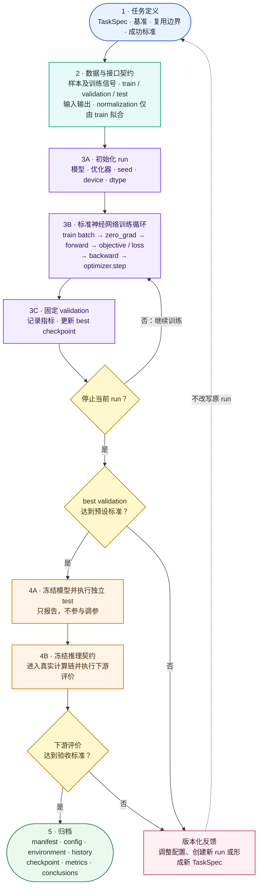

# 机器学习：模型架构、分类框架与通用生命周期

> **一句话**：机器学习不存在唯一且穷尽的分类；应至少从模型族与架构、学习对象、训练信号／物理融合方式和任务目标四个相互独立的维度定位一个方法，并遵循统一的生命周期与可重放验收契约。

---

## 1. 概念定义与四个正交维度

“SVR”“KNN”“MLP”“PINN”“DeepONet”和“Diffusion Model”并不处于同一分类层级：SVR/KNN 是经典监督回归模型，MLP 是神经网络架构，PINN 是把物理约束写入训练的范式，DeepONet 是面向函数到函数映射的模型族，Diffusion Model 则通常按生成任务与训练机制界定。把它们放入同一棵互斥的分类树会混淆“使用什么模型”“模型学习什么”和“如何训练”。

因此，描述一个机器学习方法时，应先分别说明下列四个维度，再说明具体应用问题。

| 维度 | 回答的问题 | 常见类别或实例 | 说明 |
|---|---|---|---|
| **模型族与架构** | 使用哪类预测机制；若使用神经网络，其计算图怎样组织信息与参数？ | 经典监督模型：线性回归、SVR、KNN、树模型；神经网络：MLP、CNN、Transformer、GNN 等 | 模型选择受样本规模、维度、数据拓扑和推理要求影响；同一模型或架构可服务不同学习对象与训练范式。 |
| **学习对象** | 模型近似的是一个函数、一个算子、表示还是分布？ | 函数学习、算子学习、表征／降维学习、生成建模 | 这是理解科学机器学习中模型角色的主维度，不能由网络名称直接判断。 |
| **训练信号与物理融合** | 参数由什么目标约束或更新？ | 监督学习、自监督学习、PINN residual 训练、能量／变分训练、混合训练 | PINN 是训练范式，不是一种固定神经网络架构；它可以使用 MLP，也可与数据监督或其他约束结合。 |
| **任务目标** | 输出服务于什么计算或决策？ | 求解／预测、分类、表示／降维、生成、控制与优化 | 一个模型可以同时服务多个目标；最终仍要以其进入真实计算链后的下游指标评价。 |

### 1.1 模型族与神经网络架构

机器学习模型并不等于神经网络。SVR、KNN 和树模型等经典方法与 MLP、CNN、Transformer 等神经网络可以解决相同的监督预测任务，但其归纳偏置、样本需求、训练过程和部署成本不同。使用神经网络时，网络架构进一步规定计算图、参数共享方式与信息交互范围；它仍不直接规定模型学习的是函数还是算子，也不直接规定训练是否包含物理约束。

```text
模型族与架构
├─ 经典监督模型
│  ├─ 线性与核方法：线性回归、SVR
│  ├─ 邻域方法：KNN
│  └─ 树模型：Decision Tree、Random Forest、Gradient Boosting
└─ 神经网络
   ├─ 前馈网络：MLP
   ├─ 卷积网络：CNN、ResNet、U-Net
   ├─ 序列／注意力网络：RNN、LSTM、GRU、Transformer
   ├─ 图网络：GNN、GCN、GAT
   └─ 神经算子网络：DeepONet、FNO
```

#### 科学计算与物理工程中的神经网络架构选型与归纳偏置 (Inductive Bias)

在力学与物理计算中，选择何种神经网络架构本质上是在选择对物理场的**空间/拓扑假设（归纳偏置）**：

| 神经网络架构 | 归纳偏置 / 空间拓扑假设 | 输入/输出数据格式 | 物理计算中的典型应用 |
|---|---|---|---|
| **MLP (多层感知机)** | 全局连续可微，点对点独立映射 | 坐标 $(N, d) \to$ 响应 $(N, d)$ | 经典 PINN 坐标拟合、材料本构关系拟合 |
| **CNN / U-Net (卷积网络)** | 局部平移不变性，欧氏空间栅格化 | 2D/3D 图像/张量网格 $(C, H, W, D)$ | 正则网格上的结构拓扑优化、密度场到应力场预测 |
| **GNN / MeshGraphNets (图网络)** | 图拓扑不变性，非欧氏空间拓扑 | 点/边图结构 $(\mathbf{V}, \mathbf{E}, \mathbf{U})$ | 非结构有限元网格/粒子法上的多场响应预测 |
| **Neural Operator (FNO / DeepONet)** | 无穷维函数空间映射，**分辨率无关** | 连续场/离散采样 $\to$ 连续场/离散采样 | 跨宏观边界条件与材料分布的 PDE 秒级代理求解 |
| **Transformer / ViT** | 全局自注意力，长程依赖建模 | 序列/ Token 块 $(B, S, D)$ | 大规模几何/物理多场耦合与通用科学大模型 |

#### MLP：统一数学定义

多层感知机 (MLP) 是由仿射映射和逐元素非线性复合而成的前馈网络。设输入 $\boldsymbol{x}\in\mathbb{R}^{d_0}$，隐藏层维度为 $d_1,\ldots,d_{L-1}$，输出维度为 $d_L$。令 $\boldsymbol{h}^{(0)}=\boldsymbol{x}$，则第 $l$ 个隐藏层和线性输出层分别为：

$$
\begin{aligned}
\boldsymbol{z}^{(l)} &= \mathbf{W}^{(l)}\boldsymbol{h}^{(l-1)} + \boldsymbol{b}^{(l)},
&& l=1,\ldots,L-1, \\
\boldsymbol{h}^{(l)} &= \sigma\left(\boldsymbol{z}^{(l)}\right),
&& l=1,\ldots,L-1, \\
\boldsymbol{y} &= \mathbf{W}^{(L)}\boldsymbol{h}^{(L-1)} + \boldsymbol{b}^{(L)}.
\end{aligned}
$$

其中 $\mathbf{W}^{(l)}\in\mathbb{R}^{d_l\times d_{l-1}}$ 与 $\boldsymbol{b}^{(l)}\in\mathbb{R}^{d_l}$ 是可训练参数，$\sigma$ 是隐藏层激活函数。输出层默认不加激活，使 $\boldsymbol{y}$ 可表达任意实值回归目标。激活函数决定可微性：坐标型 PINN 需要对空间坐标求导，通常采用 $\tanh$、SiLU 或 $\sin$ 等足够光滑的激活；PIML 局部代理不对输入坐标求 PDE 导数，可按回归稳定性选择激活。

MLP 不含卷积参数共享、图消息传递或注意力机制。它对输入分量采用全连接混合，但不显式编码网格邻接、平移不变性或跨分辨率函数空间结构；因而适合固定维度的坐标/特征向量回归，不应仅因使用 MLP 就宣称获得算子学习或网格拓扑归纳偏置。

具体实现的构造契约、张量 shape 和层序列见 `soptx:docs/ml/mlp.md`。

### 1.2 激活函数与可微性

激活函数是神经网络的通用组成，不限定于 MLP。它通常置于可学习线性、卷积或消息传递层之后，以引入非线性；若所有层均为线性映射，多层复合仍等价于单个线性映射。

`Tanh` 在 PyTorch 中对应 `nn.Tanh`，其逐元素数学定义和导数为：

$$
\tanh(z)=\frac{e^z-e^{-z}}{e^z+e^{-z}},
\qquad
\frac{\mathrm{d}}{\mathrm{d}z}\tanh(z)=1-\tanh^2(z).
$$

它的输出范围为 $(-1,1)$，以零为中心，且为 $C^\infty$ 光滑函数。若隐藏层写为 $\boldsymbol{h}=\tanh(\mathbf{W}\boldsymbol{x}+\boldsymbol{b})$，则 PINN 可通过自动微分继续对坐标 $\boldsymbol{x}$ 求一阶或高阶导数，从而构造 PDE 残差。其代价是当 $|z|$ 很大时导数趋近于零，可能出现梯度饱和；这属于训练和初始化策略需要处理的问题，而不改变其可微性。

SiLU（Sigmoid Linear Unit）在 PyTorch 中对应 `nn.SiLU`，定义为：

$$
\operatorname{SiLU}(z)=z\,\operatorname{sigmoid}(z)
=\frac{z}{1+e^{-z}},
\qquad
\frac{\mathrm{d}}{\mathrm{d}z}\operatorname{SiLU}(z)
=\operatorname{sigmoid}(z)+z\,\operatorname{sigmoid}(z)\bigl(1-\operatorname{sigmoid}(z)\bigr).
$$

SiLU 同样是光滑函数；它以输入值调制自身，而非像 ReLU 一样在零点产生不可导折角。“选择哪种激活函数”仍是可通过验证集比较的模型超参数。

### 1.3 结构保持输出参数化

网络的最后一层可以输出无约束向量，也可以先预测某个结构化对象的独立参数，再由确定性映射恢复具有目标性质的输出。这种做法将结构约束编码进输出参数化，而不是仅依赖损失函数惩罚。

对称正定矩阵的一种通用参数化称为 **Cholesky 参数化**。令网络输出向量 $\boldsymbol{p}\in\mathbb{R}^{r(r+1)/2}$，将其填入下三角矩阵 $\mathbf{L}$；对角项通过正值映射设置为 $L_{ii}=\phi(p_{ii})+\delta$，其中 $\phi$ 可取绝对值或 softplus，且 $\delta>0$。再定义

$$
\mathbf{A}=\mathbf{L}\mathbf{L}^{\mathsf{T}}.
$$

此时 $\mathbf{L}$ 非奇异。对任意非零向量 $\boldsymbol{v}$，有 $\boldsymbol{v}^{\mathsf{T}}\mathbf{A}\boldsymbol{v}=\lVert\mathbf{L}^{\mathsf{T}}\boldsymbol{v}\rVert_2^2>0$，故 $\mathbf{A}$ 对称正定。这里并非先给定 $\mathbf{A}$ 再对它执行 Cholesky 分解，而是直接学习其 Cholesky 因子 $\mathbf{L}$。协方差矩阵、刚度矩阵等具有正定要求的学习目标可采用这一模式。具体物理对象为何需要正定、是否施加额外正则化及其验收门禁，仍由相应应用页面维护；PIML 缩聚刚度的实例见 [[piml/piml-substructural]]。

---

## 2. 通用机器学习生命周期与 5 阶段执行骨架

一个完整机器学习项目不是“定义网络并调用 `optimizer.step()`”，而是由以下环节组成的可追溯闭环。该骨架与具体物理问题、训练信号和网络架构解耦。



### 2.1 训练前契约

训练前首先回答“要学习什么”，而不是先选择网络。任务定义应形成稳定的 `TaskSpec`：

| 项目 | 必须回答的问题 |
|---|---|
| **学习对象** | 模型预测的是类别、标量、场、矩阵、算子、概率分布还是控制量？ |
| **输入** | 推理时真实可获得的信息是什么？ |
| **输出** | 输出的 shape、dtype、单位、顺序和约束是什么？ |
| **训练信号** | 标签、物理 residual、能量、重构目标还是混合目标？ |
| **使用位置** | 模型替代、加速或辅助计算链中的哪一步？ |
| **复用边界** | 哪些几何、载荷、材料、参数范围或数据分布被固定？ |
| **基准** | 与什么真值、传统算法、简单模型或消融对比？ |
| **下游目标** | 局部误差最终会影响什么科学或工程量？ |
| **失败代价** | 错误预测可否检测、拒绝或回退？ |

#### 样本、训练信号与数据划分

样本更通用的表达结构为：$\text{sample} + \text{training signal} + \text{metadata}$。

| 训练范式 | sample | training signal |
|---|---|---|
| **监督学习** | 输入样本 | 真值标签 |
| **自监督学习** | 原始样本及其变换 | 由样本内部结构构造的目标 |
| **PINN** | 空间/时间/参数配点 | PDE、初边值条件 residual 或观测数据 |
| **能量训练** | 状态、边界或随机试探场 | 能量、势能或变分目标 |
| **PIML 局部表示学习** | 局部材料或几何描述 | 精确局部表示标签或 mechanics-based objective |

#### 数据划分与评价协议 (Train / Validation / Test 分离)

| 集合 | 可以用于什么 | 不能用于什么 |
|---|---|---|
| **train** | 参数更新、训练期统计量拟合 | 最终泛化结论 |
| **validation** | 超参数、early stopping、best checkpoint 选择 | 反复调参后的无偏最终评价 |
| **test** | 模型和决策冻结后的一次独立评价 | 模型选择和超参数调整 |

* **防泄漏**：同源切片、同一仿真的派生量或增强副本应按 group 划分，不能跨 split 泄漏。
* **无固定数据集时**：动态采样/physics-informed 训练仍需冻结 train sampler 分布与 seed，并固定 validation/test 配点集。

### 2.2 训练、验证与部署

每个输入输出张量至少明确：`shape`、`dtype`、`device`、`单位`、`通道顺序`、`坐标与方向`、`有效物理范围` 与 `结构约束`（对称、正定、守恒等）。

* **预处理规则**：归一化统计量**只能由 train 集拟合**，推理时必须使用 checkpoint 附带的同一变换。
* **训练控制三要素**：记录 `batch`（更新样本集）、`step`（梯度更新次数）与 `epoch`（训练集遍历或固定 step 块）。
* **标准训练循环**：
  ```text
  load config -> set seed/device/dtype -> build model/optimizer/scheduler
  for update in updates:
      zero_grad() -> forward() -> build objective -> backward() -> optimizer.step()
      if validation_due:
          eval_mode() -> compute validation metrics -> save best checkpoint
  save last checkpoint -> run test protocol -> run downstream evaluation -> archive
  ```

#### 验证与独立测试

* **Best vs. Last Checkpoint**：`best` checkpoint 由 validation 主指标决定，用于最终 test；`last` 用于中断恢复与诊断。
* **独立 Test 规则**：Test 必须在模型、预处理和超参完全冻结后**只执行一次**。若根据 test 结果修改超参，该 test 集即降级为开发集，必须重新准备独立的 test 集。

#### 推理、下游评价与归档

模型输出通常只是中间量。评价链应写为：

$$
\text{model error}
\longrightarrow
\text{downstream state error}
\longrightarrow
\text{objective / decision error}
\longrightarrow
\text{cost and risk}.
$$

例如在 PIML 中：`局部算子预测误差 -> 全局位移/柔顺度误差 -> 迭代收敛与优化设计误差`。当模型指标与下游指标不一致时，**必须以后者作为验收标准**。

#### 可重放归档规范与诊断表

一次正式 run 应在 `run/` 目录中生成机器可读的归档产物：
`config.yaml`（解析配置）、`environment.json`（环境与 git revision）、`manifest.json`（数据校验）、`history.csv`（训练曲线）、`checkpoint-best.*`、`metrics-test.json` 及 `run-summary.md`。

| 故障现象 | 优先检查顺序 |
|---|---|
| **loss 不下降** | 数据/采样、目标符号、shape、梯度、学习率 |
| **loss 下降但 validation 变差** | 数据泄漏、过拟合、分布差异、预处理状态未冻结 |
| **局部指标好但下游结果差** | 指标与任务错位、误差放大、物理/代数结构性质被破坏 |
| **重复运行差异大** | seed、初始化、动态采样、非确定性算子、环境漂移 |

### 2.3 监督学习目标与反向传播

设一个训练 batch 为

$$
\mathcal{B}=\{(\boldsymbol{x}_k,\boldsymbol{y}_k)\}_{k=1}^{B},
$$

其中 $\boldsymbol{x}_k$ 是输入, $\boldsymbol{y}_k\in\mathbb{R}^{d_y}$ 是监督标签, $B$ 是 batch 大小. 网络参数记为 $\boldsymbol{\theta}$, 前向传播给出预测

$$
\widehat{\boldsymbol{y}}_k=f_{\boldsymbol{\theta}}(\boldsymbol{x}_k).
$$

对于连续值回归, 常用的均方误差 (MSE) 目标为

$$
\mathcal{L}_{\mathcal{B}}(\boldsymbol{\theta})
=\frac{1}{B d_y}\sum_{k=1}^{B}
\left\|f_{\boldsymbol{\theta}}(\boldsymbol{x}_k)-\boldsymbol{y}_k\right\|_2^2.
$$

该目标同时对 batch 中的样本和每个输出分量取平均. 全批量训练取 $\mathcal{B}$ 为整个训练集; 小批量训练每次只取一个子集. 两者的损失定义相同, 差别仅在每次参数更新所使用的样本数.

#### 链式法则与反向传播

反向传播不是另一种目标函数, 而是高效计算参数梯度的链式法则实现. 对任一参数分量 $\theta_j$, 有

$$
\frac{\partial\mathcal{L}_{\mathcal{B}}}{\partial\theta_j}
=\sum_{k=1}^{B}
\sum_{r=1}^{d_y}
\frac{\partial\mathcal{L}_{\mathcal{B}}}
     {\partial\widehat{y}_{k,r}}
\frac{\partial\widehat{y}_{k,r}}
     {\partial\theta_j}.
$$

计算图从输入到预测执行前向传播, 再从损失沿相反方向累计上述局部导数, 即得到
$\nabla_{\boldsymbol{\theta}}\mathcal{L}_{\mathcal{B}}$. 自动微分框架保存必要的中间量并执行该过程, 无需用户手写每层导数.

典型框架代码与数学步骤的对应关系为:

```text
out = net(X)                 -> \widehat{Y} = f_\theta(X)
loss = MSE(out, Y)           -> \mathcal{L}_{\mathcal{B}}(\theta)
optimizer.zero_grad()        -> 清除上一次更新残留的梯度
loss.backward()              -> 计算并保存 \nabla_\theta\mathcal{L}_{\mathcal{B}}
optimizer.step()             -> 依据该梯度更新 \theta
```

其中 `epoch` 是一次完整训练集遍历. 若每个 epoch 仅包含一个完整 batch, 则一次 epoch 对应一次全批量梯度更新; 若训练集被拆为多个小批次, 一个 epoch 包含多次更新.

### 2.4 训练优化器

训练优化器是根据目标函数梯度更新可训练参数的算法，不属于网络架构、激活函数或损失函数。设当前小批次上的目标函数为 $\mathcal{L}_t(\boldsymbol{\theta})$，参数梯度为

$$
\boldsymbol{g}_t=\nabla_{\boldsymbol{\theta}}\mathcal{L}_t(\boldsymbol{\theta}_{t-1}).
$$

#### 梯度下降与 SGD

最基本的梯度下降按负梯度方向更新：

$$
\boldsymbol{\theta}_t=\boldsymbol{\theta}_{t-1}-\alpha\boldsymbol{g}_t,
$$

其中 $\alpha$ 是学习率。全批量梯度下降使用全部训练样本计算 $\boldsymbol{g}_t$；随机梯度下降（SGD）使用单个样本或小批次估计梯度，以较低单步成本换取随机性。

#### 动量与自适应学习率

动量方法对历史梯度做指数滑动平均，以平滑更新方向并加速沿稳定方向的收敛。RMSProp 等自适应方法进一步维护梯度平方的滑动平均，按参数的梯度尺度缩放更新步长。Adam 将两种机制组合，并对初始时刻的动量偏差进行修正。

#### Adam

Adam 同时维护梯度的一阶动量与逐分量二阶动量。令 $\boldsymbol{m}_0=\boldsymbol{v}_0=\boldsymbol{0}$，则

$$
\begin{aligned}
\boldsymbol{m}_t &= \beta_1\boldsymbol{m}_{t-1}+(1-\beta_1)\boldsymbol{g}_t, \\
\boldsymbol{v}_t &= \beta_2\boldsymbol{v}_{t-1}+(1-\beta_2)(\boldsymbol{g}_t\odot\boldsymbol{g}_t), \\
\widehat{\boldsymbol{m}}_t &= \frac{\boldsymbol{m}_t}{1-\beta_1^t}, \qquad
\widehat{\boldsymbol{v}}_t = \frac{\boldsymbol{v}_t}{1-\beta_2^t}, \\
\boldsymbol{\theta}_t &= \boldsymbol{\theta}_{t-1}
-\alpha\frac{\widehat{\boldsymbol{m}}_t}
{\sqrt{\widehat{\boldsymbol{v}}_t}+\epsilon}.
\end{aligned}
$$

其中 $\beta_1$、$\beta_2$ 控制两类动量的衰减，$\epsilon$ 防止除零，$\odot$ 表示逐元素乘法。Adam 不替代验证集选型，学习率、weight decay 和训练步数仍须由具体任务确定。

在常见深度学习框架中，`optimizer.zero_grad() → loss.backward() → optimizer.step()` 依次对应清除上次累积梯度、计算并保存 $\boldsymbol{g}_t$、执行优化器参数更新。`optimizer = Adam(..., lr=...)` 中的 `lr` 即为 $\alpha$。

---

## 3. 函数学习与算子学习判别边界

### 3.1 定义与数学表示

**函数学习（function learning）**近似有限维输入到有限维输出的映射：

$$
f_\theta: \mathbb{R}^{m}\longrightarrow\mathbb{R}^{n}.
$$

坐标型 PINN 将空间（以及可选的时间、参数）作为输入，输出该位置的解场值，属于函数学习。

**算子学习（operator learning）**近似无限维函数空间之间的映射：

$$
\mathcal{G}: a(\boldsymbol{x})\longmapsto u(\boldsymbol{x}),
$$

其中 $a$ 可为系数场、源项、初边值或几何描述，$u$ 为对应解场。DeepONet 和 Fourier Neural Operator（FNO）是典型神经算子模型族。算子学习的核心特征是**具有分辨率无关性与采样泛化能力**。

### 3.2 算子学习 vs. 场到矩阵代理 (Field-to-Matrix Surrogate)

实际训练必然使用有限采样或离散张量，但“输入输出以数组存储”本身不能判定模型属于算子学习。

例如，在拓扑优化子结构中：

$$
\rho^j \longmapsto \mathbf{K}_s^j
$$

以固定维度的离散局部密度描述为输入、固定维度的缩聚刚度矩阵为输出，更准确地称为 **field-to-matrix surrogate（场到矩阵代理）** 或局部力学表示学习；不能仅因输入来自密度场就自动称为算子学习。

与之相比，跨一族问题学习 $\rho(\boldsymbol{x}) \mapsto \boldsymbol{u}(\boldsymbol{x})$ 这样的场到场关系，才符合 Neural Operator 的经典定义。PIML 的计算角色与边界见 [[ml-roles-and-boundaries]]。

---

## 4. 基线、实例与代码索引

在神经网络之前，须建立非深度学习的简单回归基线。

### 4.1 支持向量回归 (SVR)

支持向量回归（SVR）在特征空间中求解带正则化的函数逼近：

$$
f(\boldsymbol x) = \boldsymbol w^{\mathsf T}\phi(\boldsymbol x) + b,
$$

其 $\varepsilon$-SVR 优化问题为：

$$
\min_{\boldsymbol w,b,\boldsymbol\xi,\boldsymbol\xi^*}
\frac{1}{2}\lVert\boldsymbol w\rVert^2 + C\sum_{i=1}^{n}\left(\xi_i+\xi_i^*\right),
\quad \text{s.t.} \begin{cases} y_i-f(\boldsymbol x_i) \le \varepsilon+\xi_i \\ f(\boldsymbol x_i)-y_i \le \varepsilon+\xi_i^* \end{cases}
$$

关键超参数包括正则化系数 $C$、容忍带宽 $\varepsilon$ 与核函数参数。SVR 拟合平滑非线性函数效果好，但需严格进行特征缩放。

### 4.2 K 最近邻回归 (KNN)

K 最近邻（KNN）根据查询点附近的 $k$ 个已知样本直接进行加权平均预测：

$$
\widehat y(\boldsymbol x) = \frac{\sum_{i\in\mathcal N_k(\boldsymbol x)}\omega_i y_i}{\sum_{i\in\mathcal N_k(\boldsymbol x)}\omega_i}.
$$

KNN 无需复杂的训练过程，但推理时需检索所有邻域，对维度灾难与特征尺度非常敏感。

### 4.3 基线选型对比

| 维度 | SVR | KNN |
|---|---|---|
| **预测机制** | 正则化函数逼近（借助核函数表示非线性） | 基于局部邻域的样本插值或平滑 |
| **关键超参数** | $C$、$\varepsilon$、核函数类型及参数 | 邻居数 $k$、距离度量、邻域权重 |
| **特征缩放** | 极度重要，直接影响间隔与核距离 | 极度重要，直接影响邻居选择 |
| **计算复杂度** | 训练耗费时间；预测依赖支持向量数量 | 训练无开销；预测耗费 $O(N)$ 搜索开销 |
| **物理保证** | 默认没有，需由特征表示、损失或后处理补充 | 默认没有，需由特征表示、后处理或下游补充 |

---

### 4.4 多维分类组合与实例化索引

#### 多维分类组合表

一个具体方法应同时在四个维度上定位：

| 方法示例 | 模型与架构 | 学习对象 | 训练范式 | 任务目标 |
|---|---|---|---|---|
| **坐标型 PINN** | 通常采用 MLP | 函数学习：坐标/参数 $\to$ 解场 | PDE、初边值残差 (Data-Free) | 求解单次边值问题 |
| **Neural Operator** | DeepONet、FNO | 算子学习：函数/场 $\to$ 函数/场 | 监督学习、物理约束或混合 | 预测一族参数化 PDE 解场 |
| **PIML 局部代理** | MLP、DeepONet 等 | 场到矩阵代理 / 局部力学表示 | 监督学习或 mechanics-based 训练 | 预测局部算子，服务全局分析 |

#### 代码实现与课题路线索引

通用生命周期在不同物理问题与课题主线上的具体代码实现与指南：

1. **小变形静力线弹性 PINN 算例**：
   * 代码实现与测试门禁：`soptx` 仓库 `soptx/examples/pinn_elasticity`（含数学规范 `math_spec.md`）
2. **Problem-Independent PIML 局部算子主线**：
   * 长期研究指南：[[../research/technical-lines/piml-research-guide|PIML 局部力学算子研究指南]]

---

## 相关页面

* [[pinn-paradigm|物理信息神经网络 (PINN)]] — 坐标型 PINN 的 5 步求解范式与 AD 求导链
* [[piml/_index|PIML 术语与主题入口]] — Problem-Independent 路线数学定义与角色边界
