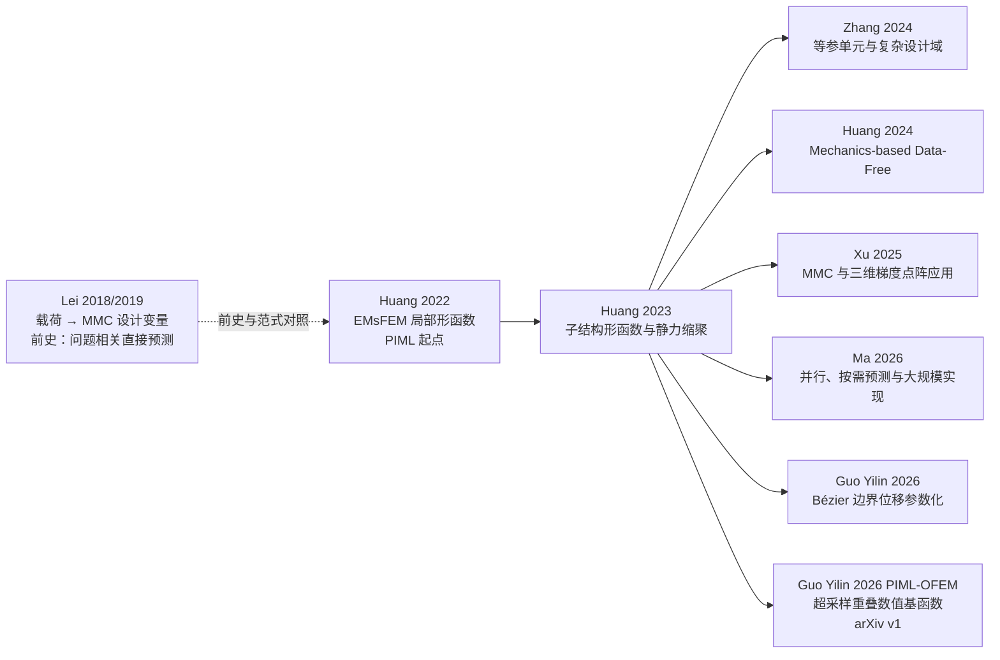

# PIML 方法谱系：局部表示、参数化扩展与规模化应用

> **术语边界**：本页及核心项目中的 PIML 均指 **Problem-Independent Machine Learning（问题无关机器学习）**；与 PINN 等外部方法背景的区别见 [[../ml-roles-and-boundaries]]。
>
> **一句话**：郭旭团队 Problem-Independent 路线的核心不是用机器学习直接预测最终拓扑，而是学习可复用的局部力学表示或局部响应映射；方法已从 EMsFEM／子结构形函数与缩聚刚度，扩展到连续表示、几何感知输入、参数化边界位移、超采样重叠基函数，以及并行和三维点阵应用。

---

## 1. 主线与“问题无关”定义

PIML（Problem-Independent Machine Learning，问题无关机器学习）中的“问题无关”不是指模型无条件跨物理、跨单元、跨本构泛化，而是指：

> 在同类 PDE、相同有限元离散与材料/本构设置下，局部材料分布唯一决定某种局部力学表示；该局部表示与宏观结构几何、边界条件和外载荷无关，因此可通过离线训练复用于不同宏观问题。

```text
局部材料分布及表示所需的局部几何／边界参数
  -> 可复用局部力学表示或响应映射
  -> 全局有限元或缩聚系统
  -> 结构响应与优化更新
```

---

## 2. 时间线与演进图谱



### 2.1 局部力学载体的演进与分类图谱

随着几何复杂性、边界约束和降维方式的不同，Problem-Independent PIML 路线演进出了 5 大类代表性的局部力学载体：

| 局部力学载体 | 代表文献 | 载体几何/拓扑形态 | 神经网络预测算子 | 精确真值 (Exact Baseline) 计算方式 |
|---|---|---|---|---|
| **1. 多尺度有限元 (EMsFEM) 粗单元** | **Huang 2022** | 规则网格块组成的粗单元 (Coarse Element) | EMsFEM 数值形函数 $\boldsymbol{N}^j$ | 求解带线性完备性边界约束的局部 PDE，构造粗刚度 $\mathbf{K}_c = \boldsymbol{N}^{\mathsf T}\mathbf{K}\boldsymbol{N}$ |
| **2. 经典静力缩聚子结构 (Substructure)** | **Huang 2023**<br/>**Ma 2026** | 区分内部自由度 ($i$) 与接口自由度 ($b$) 的子结构 | 缩聚刚度 (Schur 补) $\mathbf{K}_s^j$ 或 子结构形函数 $\boldsymbol{N}^j$ | 分块刚度矩阵 Schur 补求逆：$\mathbf{K}_s = \mathbf{K}_{bb} - \mathbf{K}_{bi}\mathbf{K}_{ii}^{-1}\mathbf{K}_{ib}$ |
| **3. 重叠有限元 (OFEM) 重叠网格块** | **Guo Yilin 2026 OFEM**<br/>(郭一麟 et al.) | 带有重叠区域 (Overlapping Region) 的局部子网格 | 超采样数值基函数 (Supersampled Basis) | 求解重叠网格局部方程，由角节点与重叠基组装粗系统 |
| **4. 等参几何子结构 (Isoparametric)** | **Zhang 2024** | 几何形状扭曲/非规则的等参子结构 | 几何感知数值形函数 $\boldsymbol{N}^j$ | **输入 [几何形状参数 + 局部材料]**，在坐标变换下计算精确基函数 |
| **5. 边界位移参数化子结构** | **Guo Yilin 2026 Bézier**<br/>(郭一麟 et al.) | 边界位移由低维多项式/Bézier 曲线控制的区域 | 边界参数 $\boldsymbol{a}_b \to$ 内部位移场 $\boldsymbol{u}_i$ 的 operator | 给定多项式边界位移，求解子结构内部位移响应 |

---

## 3. 单篇演进突破与局限快速索引

单篇论文的深度公式、完整算例与模型选型证据见各自在 `literature/topology-opt/notes/` 下的专一笔记：

| 时间 | 代表工作 | 核心贡献与理论突破 | 局限性与开放问题 | 单篇深度笔记 |
|---|---|---|---|---|
| **2018** | **Lei 2018/2019** | **前史对照**：MMC 几何参数化 + SVR/KNN，实现已知边界下的实时拓扑预测 | 强问题相关，改变载荷/设计域后必须重新生成样本训练 | [[../../literature/topology-opt/notes/Lei2018-machinelearningdriven\|Lei2018 笔记]] |
| **2022** | **Huang 2022** | **PIML 开山**：在 EMsFEM 框架中学习“局部密度 $\to$ 多尺度形函数 $\boldsymbol{N}^j$”，实现跨宏观 BVP 复用 | 依赖监督标签，输出维度随细分尺度增加，限制在规则粗网格 | [[../../literature/topology-opt/notes/Huang2022-problemindependentmachine\|Huang2022 笔记]] |
| **2023** | **Huang 2023** | **子结构缩聚**：扩展到经典子结构 Schur 补，比较形函数 $\boldsymbol{N}$ 与缩聚刚度 $\mathbf{K}_s$ 预测路线 | 直接预测 $\mathbf{K}_s$ 可能破坏与 $\boldsymbol{N}$ 的能量一致性，依赖监督标签 | [[../../literature/topology-opt/notes/Huang2023-PIML-substructure\|Huang2023 笔记]] |
| **2024** | **Huang 2024** | **Data-Free 连续表示**：用 DeepONet 学习连续形函数，基于总应变能做 Mechanics-based Data-free 训练 | 规则立方体子结构为主，非连通材料分布下优化稳定性有待提升 | [[../../literature/topology-opt/notes/Huang2024-PIML-datafree\|Huang2024 笔记]] |
| **2026** | **Ma 2026** | **并行与按需重算**：PIML 结合 MPI 并行、多重网格与按需预测/释放，服务十亿单元问题 | 粗网格缩聚系统仍需显式形成与求解，非完全全局无矩阵 | [[../../literature/topology-opt/notes/Ma2026-highperformanceparallel\|Ma2026 笔记]] |
| **2024** | **Zhang 2024** | **等参扩展**：输入 [几何形状 + 材料分布]，学习几何感知形函数，扩展至复杂设计域 | 摘要级 `draft` 证据，全文级精度与架构细节有待精读核验 | [[../../literature/topology-opt/notes/Zhang2024-isoparametric-PIML\|Zhang2024 笔记]] |
| **2025** | **Xu 2025** | **点阵应用**：PIML 结合 MMC 参数化与三维梯度点阵结构拓扑优化 | 摘要级 `draft` 证据，属于应用延伸 | [[../../literature/topology-opt/notes/Xu2025-PIML-lattice-MMC\|Xu2025 笔记]] |
| **2026** | **Guo Yilin 2026 Bézier**<br/>(郭一麟 et al.) | **边界参数化**：Bézier 曲线参数化边界位移，学习边界位移到内部位移响应映射 | 摘要级 `draft` 证据，对高阶复杂边界位移泛化能力有待验证 | [[../../literature/topology-opt/notes/Guo2026-highgeneralization-bezier\|Guo2026 Bézier 笔记]] |
| **2026** | **Guo Yilin 2026 OFEM**<br/>(郭一麟 et al.) | **重叠有限元**：以 U-Net 预测超采样数值基函数，保留角节点自由度 | arXiv v1 预印本，重叠区域计算与全局代数性质有待验证 | [[../../literature/topology-opt/notes/Guo2026-PIML-OFEM\|Guo2026 OFEM 笔记]] |

---

## 4. 概念与架构演化对比

| 维度 | Huang 2022 | Huang 2023 | Huang 2024 | Ma 2026 |
|---|---|---|---|---|
| **基础框架** | EMsFEM | 子结构静力缩聚 | 子结构 + DeepONet + Data-free | 子结构 PIML + 分布式并行 |
| **学习对象** | EMsFEM 形函数 $\boldsymbol{N}^j$ | 子结构形函数 $\boldsymbol{N}^j$ / 缩聚刚度 $\mathbf{K}_s^j$ | 坐标连续多尺度形函数算子 | 多尺度形函数 / 缩聚刚度相关对象 |
| **训练方式** | 监督式 | 监督式 + 力学约束/降维 | Mechanics-based Data-free | 继承已训练模型 + 并行计算 |
| **降维机制** | 粗/细多尺度有限元 | 内部自由度消元、边界缩聚 | 连续函数 + branch/trunk 分解 | 子结构降维 + 按需预测/释放 |
| **核心瓶颈** | 标签生成开销、输出维度 | 能量一致性、网格划分绑定 | Data-free 训练稳定性 | 存储/通信开销、粗网格求解 |

---

## 5. 与多分辨率拓扑优化 (MTOP) 的关系

PIML 路线与多分辨率拓扑优化（MTOP）有相似动机：二者都试图解除“高分辨率材料描述”与“全局位移自由度”之间的一一绑定。但二者数学机制完全不同：
- **MTOP**：通过设计变量网格、密度积分网格和位移分析网格三层解耦，在粗位移网格上嵌入高分辨率材料描述；
- **PIML 路线**：通过有限元静力缩聚/形函数预测消去内部自由度，把局部细尺度分析转化为边界自由度上的代数算子。

---

## 6. 仍未解决的开放问题

1. **物理代数一致性**：如何保证预测形函数 $\widehat{\mathbf{N}}$、缩聚刚度 $\widehat{\mathbf{K}}_s$ 和应变能量关系同时严格一致？
2. **硬结构保持参数化**：如何让网络输出天然满足对称性、半正定性、秩保持和刚体模态约束？
3. **Data-free 训练稳定性**：纯力学能量损失能否完全替代监督标签，在极端稀疏材料下是否引入新优化困难？
4. **复杂几何与非结构网格**：PIML 如何高效从规则子结构扩展到非结构网格和复杂几何？
5. **全局求解与 GPU 融合**：局部预测加速后，全局缩聚系统如何在不组装全局矩阵的前提下完成 GPU/Krylov 求解？

---

## 7. 相关页面

- [[piml-paradigm|PIML 局部算子通用 5 步范式]] — 专一维护 PIML 数据流图、代数映射卡片与选型
- [[../ml-roles-and-boundaries|计算力学 ML 6大路线全景图谱与方法边界]] — 鸟瞰计算力学中 6 大 ML 路线的作用位置
- [[mathematical-foundations|Problem-Independent 路线的数学基础]] — 局部—全局契约、精确缩聚标签与路线 A/B（Schur 补原理见 [[../substructural-condensation]]）
- [[../substructural-condensation|子结构有限元与静力缩聚]] — Huang2023 之后子结构路线所依托的经典缩聚原理
- [[../../research/technical-lines/piml-research-guide|PIML 局部力学算子技术线研究指南]] — 博士后 WP2 的模型选型原则与证据综合
