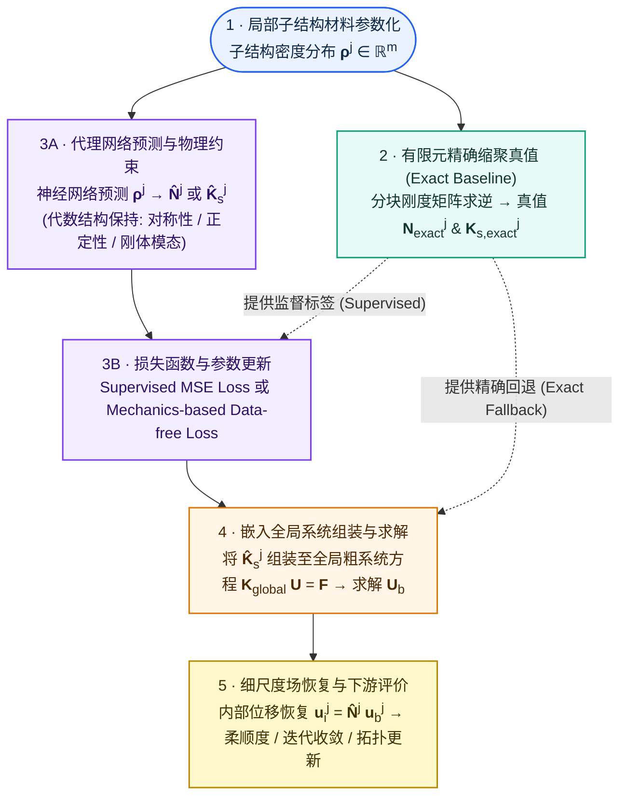

# 问题无关机器学习 (PIML) 通用范式

> 本页记录 Problem-Independent Machine Learning (PIML) 学习局部力学表示与算子代理的通用 5 步数学与计算范式、计算力学学者的 FEA 概念与代数映射、与 PINN 范式的侧向对比矩阵，以及预测局部算子的模型选型与 downstream 评价标准。

---

## 1. 概念定义与范式定位

* **Problem-Independent Machine Learning (PIML)**：课题主线（Huang–Ma 谱系路线）所指的 PIML 特指**学习可跨宏观边值问题（BVP）、宏观几何、整体边界条件和载荷复用的局部力学表示**。模型预测的目标不是特定问题的最终解场或设计，而是局部力学载体（子结构、EMsFEM 粗单元、OFEM 重叠网格等）的多尺度形函数 $\boldsymbol{N}^j$、缩聚/粗刚度 $\mathbf{K}_s^j$ 或其他接口算子。
* **与 PINN (Problem-Dependent) 的核心机制差异：局部力学载体的显式绑定**：
  * **PINN (无局部载体)**：输入为全局空间坐标 $\boldsymbol{x} \in \Omega$，直接在整个宏观计算域上逼近单次特定 BVP 的解场。改变边界或载荷后**必须重新训练**。
  * **PIML (显式绑定局部力学载体)**：输入为局部载体内部的细观材料/几何描述 $\boldsymbol{\rho}^j$（与宏观边界/载荷解耦），输出为该局部载体的接口力学算子。训练一次后，推理阶段可以像“积木”一样将局部算子拼装至任意宏观结构完成**秒级预测与全局求解**。

---

## 2. PIML 学习局部算子的通用 5 步数学与计算范式

无论具体物理子结构是一维、二维还是三维，PIML 代理均遵循以下通用的 5 步计算骨架与数据流转链条：

### 2.1 步骤 1：局部子结构材料参数化 (Local Input Parameterization)
假设宏观设计域分割为 $M$ 个子结构单元。对于第 $j$ 个子结构，其内部微观/细观材料分布以元胞密度向量或连续函数描述：
$$
\boldsymbol{\rho}^j = [\rho_1^j, \rho_2^j, \dots, \rho_m^j]^{\mathsf T} \in [0, 1]^m
$$
该输入向量仅与局部材料几何相关，完全独立于宏观全局边界条件和外载荷。

### 2.2 步骤 2：有限元精确缩聚真值构造 (Exact Substructure Condensation)
在经典有限元（FEA）中，子结构自由度划分为内部自由度（internal DOFs, 下标 $i$）与边界接口自由度（boundary DOFs, 下标 $b$）。局部刚度方程写为分块形式：
$$
\begin{bmatrix} 
\mathbf{K}_{ii}^j & \mathbf{K}_{ib}^j \\ 
\mathbf{K}_{bi}^j & \mathbf{K}_{bb}^j 
\end{bmatrix} 
\begin{bmatrix} 
\boldsymbol{u}_i^j \\ 
\boldsymbol{u}_b^j 
\end{bmatrix} 
= 
\begin{bmatrix} 
\boldsymbol{f}_i^j \\ 
\boldsymbol{f}_b^j 
\end{bmatrix}
$$
在无内部载荷（$\boldsymbol{f}_i^j = \boldsymbol{0}$）假设下，做静力缩聚（Schur Complement）：
1. **多尺度形函数真值 $\mathbf{N}_{\text{exact}}^j$**（描述边界位移对内部位移的映射）：
   $$
   \boldsymbol{u}_i^j = -(\mathbf{K}_{ii}^j)^{-1} \mathbf{K}_{ib}^j \boldsymbol{u}_b^j = \mathbf{N}_{\text{exact}}^j \boldsymbol{u}_b^j
   $$
2. **缩聚刚度矩阵真值 $\mathbf{K}_{s,\text{exact}}^j$**（描述接口自由度上的等效力学刚度）：
   $$
   \mathbf{K}_{s,\text{exact}}^j = \mathbf{K}_{bb}^j - \mathbf{K}_{bi}^j (\mathbf{K}_{ii}^j)^{-1} \mathbf{K}_{ib}^j
   $$

### 2.3 步骤 3：代理网络映射与结构保持硬约束 (Surrogate Predictor)
模型代理拟合局部输入到局部算子的映射。主流两条候选路线：
* **路线 A（预测形函数 $\boldsymbol{N}$）**：神经网络预测 $\widehat{\mathbf{N}}^j = f_\theta(\boldsymbol{\rho}^j)$，随后由能量一致关系构造缩聚刚度 $\widehat{\mathbf{K}}_s^j = (\widehat{\mathbf{N}}^j)^{\mathsf T} \mathbf{K}^j \widehat{\mathbf{N}}^j$。此路线能硬性保证位移恢复与能量一致性。
* **路线 B（直接预测缩聚刚度 $\mathbf{K}_s$）**：神经网络直接预测 $\widehat{\mathbf{K}}_s^j = g_\theta(\boldsymbol{\rho}^j)$。在线计算更快，但需要通过 Cholesky 因子化或参数化严格保持**对称正定性（SPD）与刚体模态（Zero Energy Modes）**。

### 2.4 步骤 4：嵌入全局系统组装与求解 (Global Assembly & Solve)
将所有预测的局部缩聚刚度矩阵 $\widehat{\mathbf{K}}_s^j$ 组装到宏观接口求解系统中：
$$
\mathbf{K}_{\text{global}} \boldsymbol{U}_b = \mathbf{F}_b, \quad \text{其中 } \mathbf{K}_{\text{global}} = \sum_{j=1}^M \mathbf{A}_j^{\mathsf T} \widehat{\mathbf{K}}_s^j \mathbf{A}_j
$$
解出宏观接口位移向量 $\boldsymbol{U}_b$。

### 2.5 步骤 5：细尺度场恢复与下游评价 (Fine-scale Recovery & Downstream Metric)
由宏观接口位移 $\boldsymbol{u}_b^j$，恢复任意子结构的内部细尺度位移与应力场：
$$
\boldsymbol{u}_i^j = \widehat{\mathbf{N}}^j \boldsymbol{u}_b^j
$$
下游评价不仅检查局部刚度 MSE，更以后续全局柔顺度误差 $C = \mathbf{F}^{\mathsf T} \boldsymbol{U}$、Krylov 迭代收敛行为与拓扑优化更新轨迹作为验收标准。当神经网络预测异常时，触发**精确回退 (Exact Fallback)**。

---

## 3. 计算力学学者的 PIML 概念与代数映射卡片

将经典有限元（FEM/子结构法）概念映射到 PIML 深度学习的对应组件：

| 经典计算力学 / FEM 概念 | PIML 深度学习对应组件 | 数学/工程含义 |
|---|---|---|
| 单元/子结构材料密度分布 | 输入张量 $\boldsymbol{\rho}^j \in [0, 1]^m$ | 描述局部细观几何/拓扑分布 |
| 边界自由度 $\boldsymbol{u}_b$ / 内部自由度 $\boldsymbol{u}_i$ | 接口张量维度划分 | 决定网络输出矩阵的 shape |
| Schur 补 (Schur Complement) | 缩聚刚度标签 $\mathbf{K}_{s,\text{exact}}^j$ | 有限元精确静力缩聚真值 |
| 内部位移插值基函数 | 多尺度形函数矩阵 $\mathbf{N}^j$ | 描述接口位移到内部细尺度位移的投影 |
| 整体粗网格刚度组装 | 预测算子作用 / Scatter-Add | 将预测局部刚度嵌入全局平衡方程 |
| 子结构静力回代恢复 | 解场恢复前向计算 $\boldsymbol{u}_i = \mathbf{N}\boldsymbol{u}_b$ | 获得细尺度位移与应力集中分布 |

---

## 4. 范式对比：PIML vs. PINN 侧向对比矩阵

| 维度 | PINN (Problem-Dependent) | PIML (Problem-Independent / Huang–Ma 路线) |
|---|---|---|
| **输入** | 空间坐标 $\boldsymbol{x} \in \mathbb{R}^d$ | 局部子结构材料/几何分布 $\boldsymbol{\rho}^j \in [0, 1]^m$ |
| **输出** | 空间某点物理响应 $\hat{\boldsymbol{u}}(\boldsymbol{x})$ | 局部多尺度形函数 $\boldsymbol{N}^j$ / 缩聚刚度矩阵 $\mathbf{K}_s^j$ |
| **训练数据** | 无数据 (Data-Free)，靠 Collocation 点残差 | 局部材料样本集 (Supervised 或 Mechanics-based Data-free) |
| **重训需求** | 载荷/边界条件改变后**必须重新训练** | **跨宏观 BVP 免重训**，秒级推理与全局求解 |
| **全局求解** | 无全局组装，网络即求解器 | 预测局部算子，组装至传统全局平衡方程 $K_{\text{global}} U = F$ |
| **代数结构保持** | 靠 Loss 软约束控制边界与方程 | 可通过硬参数化保持对称性、正定性与刚体模态 |
| **失败处理** | 训练不收敛则无法得到合理物理解 | 可检测分布外异常并**精准回退 (Exact Fallback)** 到有限元计算 |
| **课题角色** | 物理残差算子摸底与 Baseline | 博士后核心研究项目 WP2 主线攻关方向 |

---

## 5. 候选表示路线与算法选择

在 PIML 研发中，根据预测对象的代数形态与物理性质保持方式，存在两条**核心代数基石路线（路线 A 与路线 B）**以及若干**衍生与新型候选路线（路线 C ~ 路线 F）**。各路线需在代数结构保持、能量一致性与计算成本上做出 Pareto 取舍。

### 5.1 核心代数基石路线：路线 A vs 路线 B

| 候选路线 | 路线 A：预测形函数 $\boldsymbol{\rho}^j \to \widehat{\mathbf{N}}^j \to \widehat{\mathbf{K}}_s^j$ | 路线 B：直接预测刚度 $\boldsymbol{\rho}^j \to \widehat{\mathbf{K}}_s^j$ |
|---|---|---|
| **构造公式** | $\widehat{\mathbf{K}}_s^j = (\widehat{\mathbf{N}}^j)^{\mathsf T} \mathbf{K}^j \widehat{\mathbf{N}}^j$ | 直接由网络多层映射预测 $\widehat{\mathbf{K}}_s^j$ 矩阵元素 |
| **对称正定性 (SPD)** | **物理硬保持**（只要 $\mathbf{K}^j$ 正定且 $\widehat{\mathbf{N}}$ 满秩） | 需网络参数化约束（如 Cholesky 分解） |
| **能量一致性** | **物理硬保持**（形函数与刚度满足变分能量关系） | 预测刚度与恢复形函数可能存在能量不一致 |
| **计算开销** | 在线推理后需进行矩阵乘法 $\mathbf{N}^{\mathsf T}\mathbf{K}\mathbf{N}$ | **在线推理速度最快**，直接输出代数矩阵元素 |
| **下游恢复能力** | 预测出 $\widehat{\mathbf{N}}$ 后，**天然用于细尺度位移与应力恢复**（$\boldsymbol{u}_i = \widehat{\mathbf{N}}\boldsymbol{u}_b$） | 无法直接恢复细尺度响应，需额外配套恢复网络 |
| **适用场景** | 需要精确细尺度位移/应力恢复与严格能量保持 | 仅需快速全局粗求解，对推理延迟极度敏感 |

### 5.2 衍生与新型候选表示路线

除了全量预测形函数和全量刚度外，随着 PIML 的演进还衍生出了以下新型算子/参数映射范式：

* **路线 C：因子化 / 低秩分解表示（Factorized / Low-rank Representation）**
  * **机制**：不直接预测高维刚度矩阵 $\mathbf{K}_s$，而是预测其 Cholesky 分解因子 $\mathbf{L}$（使 $\widehat{\mathbf{K}}_s = \mathbf{L}\mathbf{L}^{\mathsf T}$，无条件物理硬保持 SPD），或基于 POD/PCA 预测低维主成分流形系数。
* **路线 D：边界控制参数到内部响应场映射（Boundary Operator Learning）**
  * **代表文献**：*Guo Yilin 2026 CMAME*（郭一麟 et al.）。
  * **机制**：学习低维多项式/Bézier 曲线参数化的边界位移 $\boldsymbol{a}_b$ 到内部响应场 $\boldsymbol{u}_i$ 的 operator 映射 $\boldsymbol{a}_b \to \boldsymbol{u}_i$。
* **路线 E：超采样重叠数值基函数（Supersampled Basis）**
  * **代表文献**：*Guo Yilin 2026 OFEM*（郭一麟 et al.）。
  * **机制**：在带有重叠区域的局部子网格上，用 U-Net 预测超采样数值基函数（Supersampled Basis），保留角节点自由度并装配粗系统。
* **路线 F：连续场 Neural Operator（DeepONet / FNO 算子）**
  * **代表文献**：*Huang 2024 Data-Free*（Huang et al.）。
  * **机制**：基于 DeepONet 等 Neural Operator 学习连续材料分布到连续形函数/应变能函数的通用算子映射。

关于 EMsFEM 粗单元、经典缩聚子结构、OFEM 重叠网格、等参单元及 Bézier 边界等 5 大局部力学载体的详细演进对比，见 [[method-lineage#21-局部力学载体的演进与分类图谱|PIML 5 大局部力学载体的演进与分类图谱]]。

详细的模型选型与统一比较契约见 [[../../research/technical-lines/piml-research-guide|PIML 局部力学算子研究指南]]。

---

## 6. 相关页面

* [[../pinn-paradigm|PINN 通用 5 步范式]] — 坐标型 PINN 解场逼近与 AD 求导链
* [[../ml-roles-and-boundaries|计算力学 ML 6大路线全景图谱与方法边界]] — 鸟瞰计算力学中 6 大 ML 路线的作用位置
* [[mathematical-foundations|Problem-Independent 路线的数学基础]] — 局部—全局契约、精确缩聚标签与路线 A/B（Schur 补原理见 [[../substructural-condensation]]）
* [[method-lineage|Huang–Ma PIML 方法演进谱系]] — 从 EMsFEM 到 Data-free 与并行 PIML
* [[../../research/technical-lines/piml-research-guide|PIML 局部力学算子技术线研究指南]] — 博士后 WP2 的模型选型与证据综合
* [[../../entities/soptx]] — 求解器与测试代码实现仓库（`soptx/examples/pinn_elasticity` 等）
