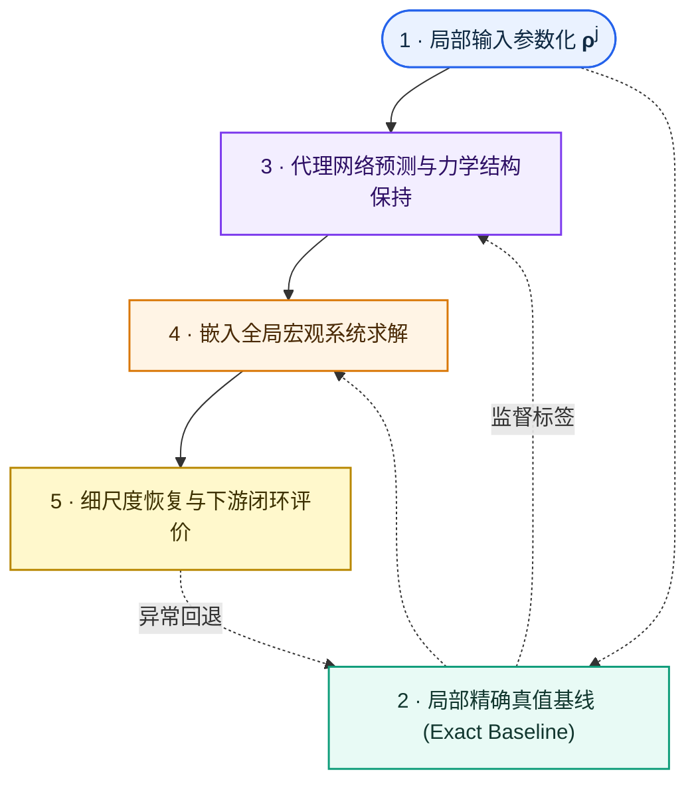
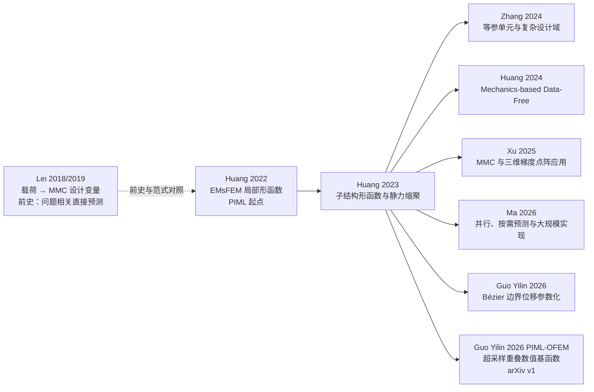

# 问题无关机器学习 (PIML)：分类与计算流程

> 本页的 PIML 指 Problem-Independent Machine Learning（问题无关机器学习），与 PINN 等外部方法的区别见 [[../ml-roles-and-boundaries]]。PIML 不预测宏观解场或最终拓扑，而是学习局部材料分布到可复用局部力学算子（多尺度形函数、缩聚刚度、数值基函数）的映射，训练一次后嵌入任意宏观问题的全局组装与求解。郭旭团队的工作从 EMsFEM 形函数出发，经子结构静力缩聚扩展到连续算子表示、几何感知输入、参数化边界位移、超采样重叠基函数，以及并行与三维点阵应用。适用范围目前限于小应变线弹性。

---

## 1. 问题无关的含义与成立条件

### 1.1 定义

“问题无关”不是指模型无条件跨物理、跨单元、跨本构泛化，而是指：在同类 PDE、相同有限元离散与材料本构设置下，局部材料分布唯一决定某种局部力学表示；该表示与宏观结构几何、边界条件和外载荷无关，可通过离线训练复用于不同宏观问题。

```text
局部材料分布及表示所需的局部几何／边界参数
  -> 可复用局部力学表示或响应映射
  -> 全局有限元或缩聚系统
  -> 结构响应与优化更新
```

### 1.2 与 PINN 的分界

判断模型是否属于 PIML，看输入是否与宏观边界和载荷解耦，而不是看输入是否含空间坐标。完整的侧向对比见 [[../pinn-paradigm|PINN 范式页]] §4。

| 维度 | PIML (Problem-Independent) | PINN (Problem-Dependent) |
|---|---|---|
| 输入 | 局部材料/几何 $\boldsymbol{\rho}^j$，连续表示可另含局部坐标 $\boldsymbol{x} \in \Omega^j$；不含宏观边界与载荷 | 宏观域坐标 $\boldsymbol{x} \in \Omega$，解场由该次 BVP 唯一确定 |
| 输出 | 局部算子 $\mathbf{N}^j$、$\mathbf{K}_s^j$ 或函数值算子 $\boldsymbol{\Phi}_k^j(\cdot)$ | 空间点上的物理响应 $\hat{\boldsymbol{u}}(\boldsymbol{x})$ |
| 复用 | 离线训练一次，在线跨结构复用 | 单题单训，载荷或约束改变后重新训练 |
| 与 FEM 的关系 | 组合：只替代 FEM 内部的局部昂贵子步，全局平衡与灵敏度链条保留 | 竞争：网络本身充当求解器 |
| 代数结构 | 可由硬参数化保持对称性、正定性与刚体模态 | 边界与方程靠损失软约束 |
| 失败处理 | 可检测分布外输入并回退到局部有限元计算 | 训练不收敛则无合理解 |

### 1.3 加速收益的两个条件

PIML 的加速来自用网络前向推理替代经典有限元中反复出现的局部方程组求解，在线阶段不再逐子结构做局部分块分解与回代。替代能否带来净收益，取决于被替代的局部计算是否同时满足两个条件：

1. 原局部求解昂贵：经典求值成本远超 $O(1)$，随局部自由度规模增长（局部方程组、局部非线性返回映射或昂贵的数值积分），且每次材料设计更新后必须重算。
2. 与全局 BVP 解耦：局部算子的输入只含局部材料/几何描述 $\boldsymbol{\rho}^j$，与宏观边界条件和载荷无关，同一模型才能跨子结构、跨工况复用。

#### 静力缩聚如何满足两个条件

非重叠子结构的静力缩聚是目前满足上述两个条件最成熟、验证最系统的载体，但不是唯一载体。

条件 1：多尺度形函数

$$
\mathbf{N}^j = -(\mathbf{K}_{ii}^j)^{-1} \mathbf{K}_{ib}^j
$$

的第 $k$ 列是内部离散调和延拓场，求值需一次局部 Cholesky 分解加 $n_b$ 次回代。单次耗时在亚毫秒量级，但拓扑优化中的在线重复次数为

$$
\underbrace{M}_{\text{子结构数}} \times \underbrace{N_{\text{iter}}}_{\text{优化迭代数}} \sim 10^3 \times 10^2 = 10^5 .
$$

以二维 $10 \times 10$ 单元子结构（$n_i = 162$，$n_b = 80$）计，单次约 $6 \times 10^6$ flops，在线累计约 $1.2 \times 10^{12}$ flops。这部分成本独立于接口求解，全局求解器的改进无法消除它。条件 1 的判据是“单次成本 $\times$ 复用次数”，不是“能否求解”。

条件 2：形函数定义只用到子结构自身的分块刚度 $\mathbf{K}_{ii}^j$、$\mathbf{K}_{ib}^j$，与宏观边界条件和外载荷无关（局部平衡方程见 [[../exact-substructural#2.1 局部静力缩聚及其变分形式|精确子结构分析 §2.1]]）。

EMsFEM 的粗基求解、OFEM 的超采样数值基、有限胞元法（FCM）中裁剪单元的数值积分，在各自机制下同样满足两个条件，三类载体见 §2.1。

#### 非线性问题下两个条件的走向相反

现有 Huang–Ma 谱系工作均限于小应变线弹性。线弹性下局部响应与宏观工况完全解耦，条件 2 严格成立，这是可以离线随机采样材料样本生成训练集的前提（如 [[../../literature/topopt/piml/translations/Huang2023-PIML-substructure-zh|Huang 2023]] 对归一化杨氏模量的随机生成）。

推广到非线性时两个条件的变化方向相反。条件 1 更容易满足：切线刚度在每个 Newton 步都需重算，可替代的局部计算量成倍增加。条件 2 成为瓶颈：超弹性使局部刚度依赖变形状态，弹塑性与损伤使局部响应绑定加载历史，局部与全局状态耦合，离线随机采样的前提失效。

几何非线性（共旋格式）的可行性与材料非线性的推演见 [[../../research/piml-matrix-free-gpu/piml-research-guide#3.5 向非线性推广的待验证问题|PIML 研究指南 §3.5]]。

#### 反例：传统全尺度有限元中 PIML 无收益

不做缩聚的全尺度有限元中，局部对象退化为单元刚度矩阵。SIMP 插值下它是闭式的：

$$
\mathbf{K}_e(\rho_e) = \big(E_{\min} + \rho_e^{\,p}(E_0 - E_{\min})\big)\, \mathbf{K}_0 ,
$$

即标量乘以与设计变量无关的常数矩阵 $\mathbf{K}_0$，全网格共用，只需计算一次。

| 收益条件 | 单元刚度 $\mathbf{K}_e(\rho_e)$ | 缩聚形函数 $\mathbf{N}^j$ |
|---|---|---|
| 与全局 BVP 解耦 | 是，只依赖 $\rho_e$ | 是，只依赖 $\boldsymbol{\rho}^j$ |
| 昂贵、无闭式 | 否，闭式、$O(1)$ 求值、精确 | 是，需局部分解，随 $\boldsymbol{\rho}^j$ 强非线性变化 |
| PIML 是否有收益 | 无，待学映射退化为一维解析函数 $\rho_e \mapsto E(\rho_e)$ | 有 |

PIML 不能直接用于全尺度有限元，原因是没有可学的对象：用网络逼近一个已有闭式、$O(1)$ 求值且精确的量，只会更慢更不准。例外是单元级子问题本身变得非平凡的场合，如有限胞元法中被域边界裁剪的单元、高阶曲边或 trimmed 等参单元、单元内含微结构。这些场合的共同点是几何进入模型输入，与不规则子结构划分所需的能力相同。

---

## 2. 分类维度

PIML 方法按五个相互独立的维度区分：局部力学载体、学习对象、输出表示、训练方式与结构保持、静力缩聚载体内的变体。本节只定义各维度及其取值，各篇文献的归属见 §4.3。

### 2.1 局部力学载体

载体按局部映射的精确真值由什么数学问题定义分为三类。

| 载体 | 几何/拓扑形态 | 局部映射的精确定义 | 数学地位 |
|---|---|---|---|
| EMsFEM 粗单元 | 由细单元加密而成的粗单元 | 在粗单元边界 $\partial\Omega^E$ 上施加线性边界条件，令各节点单位位移，逐个求解局部 PDE 得数值形函数 $\boldsymbol{N}$，粗刚度 $\mathbf{K}^E = \boldsymbol{N}^{\mathsf T}\mathbf{K}\boldsymbol{N}$ | 近似多尺度基，边界条件是人为施加的假设 |
| 静力缩聚子结构 | 区分内部自由度 $i$ 与边界自由度 $b$ 的子结构 | Schur 补 $\mathbf{K}_s^j = \mathbf{K}_{bb} - \mathbf{K}_{bi}\mathbf{K}_{ii}^{-1}\mathbf{K}_{ib}$；内部位移由 $\boldsymbol{N}^j = -\mathbf{K}_{ii}^{-1}\mathbf{K}_{ib}$ 精确恢复 | 精确模型降阶，内部自由度完全消元，无截断误差 |
| 超采样重叠子结构 | 目标子结构 $\Omega_{\mathrm{sub}}^j$ 外扩 $l$ 层细单元形成的超采样域 $\Omega_{\mathrm{os}}^j$ | 在 $\Omega_{\mathrm{os}}^j$ 外边界上令一个角点自由度为 1、其余角点为 0、四条边线性插值作 Dirichlet 条件，求解局部弹性 BVP，再把解限制回 $\Omega_{\mathrm{sub}}^j$ | 近似基，但目标子结构边界上无人为假设；相邻子结构界面位移不协调，由重叠有限元单位分解修复 |

边界变形线性假设下的缩聚刚度式恰好等价于采用线性边界条件的 EMsFEM（[[../../literature/topopt/piml/translations/Huang2024-PIML-datafree-zh|Huang2024 译文]] §2.2）。前两类因此不是独立的方法路线，而是同一降阶思想在“先施加边界假设再求解”与“先精确消元再施加边界假设”两种次序下的表述。超采样重叠子结构与两者的区别在于把边界假设移出了目标子结构。

### 2.2 学习对象

| 学习对象 | 网络映射 | 局部刚度的构造 | 细尺度恢复 |
|---|---|---|---|
| 形函数（路线 A） | $\boldsymbol{\rho}^j \to \widehat{\mathbf{N}}^j$ | $\widehat{\mathbf{K}}_s^j = (\widehat{\mathbf{N}}^j)^{\mathsf T} \mathbf{K}^j \widehat{\mathbf{N}}^j$ | $\boldsymbol{u}_i = \widehat{\mathbf{N}}\boldsymbol{u}_b$ 直接给出 |
| 缩聚刚度（路线 B） | $\boldsymbol{\rho}^j \to \widehat{\mathbf{K}}_s^j$ | 网络直接输出 | 需另配恢复网络 |
| Bézier 控制点形函数（路线 A 特例） | $\boldsymbol{\rho}^j \to \widetilde{\mathbf{N}}^j$，$\widetilde{\mathbf{N}}^j$ 把边界控制点位移 $\boldsymbol{a}_b$ 映到内部位移 | 同路线 A，按控制点自由度作变分构造 | $\boldsymbol{u}_i = \widetilde{\mathbf{N}}^j\boldsymbol{a}_b$ 直接给出 |
| 超采样数值基函数 | $\boldsymbol{\rho}^j \to$ 角点关联的数值基函数 | 基函数经重叠单位分解形成整体基后装配 | 直接给出 |

Bézier 一行不是独立的学习对象：网络输入只有 $\boldsymbol{\rho}^j$，输出为控制点到内部的线性形函数矩阵，控制点位移 $\boldsymbol{a}_b$ 不进入网络（[[../../literature/topopt/piml/translations/Guo2026-highgeneralization-bezier-zh|Guo 2026 Bézier]] §2.4、§3.1）。单列一行只为标出迹基由边界节点换成 Bézier 控制点；[[piml-substructural]] 按 `cubic_bezier` 迹基将其归入路线 A。

路线 A、B 的取舍：

| 性质 | 路线 A：预测形函数 | 路线 B：直接预测刚度 |
|---|---|---|
| 对称半正定 | 由变分构造保证（$\mathbf{K}^j$ 正定且 $\widehat{\mathbf{N}}$ 满秩） | 需参数化约束，如 Cholesky 因子 |
| 能量一致性 | 形函数与刚度满足变分能量关系 | 预测刚度与恢复形函数可能不一致 |
| 在线开销 | 推理后需计算 $\mathbf{N}^{\mathsf T}\mathbf{K}\mathbf{N}$ | 推理直接给出矩阵元素，最快 |
| 适用场景 | 需要细尺度位移/应力恢复与严格能量保持 | 只需全局粗求解，对推理延迟敏感 |

路线 A、B 在子结构载体下的约束实现与误差性质见 [[piml-substructural]] §2–§4。

### 2.3 输出表示

| 表示形式 | 典型对象 | 特征 |
|---|---|---|
| 有限维离散矩阵 | $\widehat{\mathbf{N}}^j \in \mathbb{R}^{n_i \times n_b}$、$\widehat{\mathbf{K}}_s^j$ | 输出维度受局部自由度编号锁定，换网格需重新映射；可直接代数装配进全局方程 |
| 坐标连续算子 | $\boldsymbol{\Phi}_k^j(\boldsymbol{x})$，$\boldsymbol{x}$ 作为网络输入 | 可在域内任意坐标求值，分辨率无关；输出一般不在有限元空间 $V_h$ 内，刚度须由应变能积分得到 |
| 网格场预测 | 细网格节点上的基函数值 | 以图像式场作输出（如 U-Net），与细网格分辨率绑定 |

连续算子的代表是 DeepONet。它由两支 MLP 组成，末端做内积给出场值：

$$
\boldsymbol{\Phi}_k^j(\boldsymbol{x}) \approx \sum_{q=1}^{Q} b_q(\boldsymbol{\rho}^j) \, t_q(\boldsymbol{x}) .
$$

branch net 输入子结构密度 $\boldsymbol{\rho}^j$ 在固定传感点上的采样值，输出 $Q$ 维系数；trunk net 输入子结构内的单个局部坐标 $\boldsymbol{x} \in \Omega^j$，输出 $Q$ 维基向量。对照有限元展开 $u_h(\boldsymbol{x}) = \sum_q c_q \boldsymbol{\phi}_q(\boldsymbol{x})$，trunk 对应基函数，branch 对应系数。区别在于 $\boldsymbol{\phi}_q$ 由网格事先给定，$t_q$ 由训练得到；$c_q$ 需解 $\mathbf{K}\mathbf{U} = \mathbf{F}$ 获得，$b_q$ 由 branch 从 $\boldsymbol{\rho}^j$ 直接映出。trunk 逐点求值是分辨率无关的来源，训练与推理的采样点可以不同；但 $t_q$ 是全局光滑函数而非分片多项式，张成空间与 $V_h$ 无包含关系，$\widehat{\mathbf{N}}^{\mathsf T} \mathbf{K} \widehat{\mathbf{N}}$ 式代数装配失效。

### 2.4 训练方式与结构保持

训练分两类。监督训练用局部有限元精确解作标签，以 MSE 为损失，标签生成需对每个样本做局部求解。Mechanics-based data-free 训练以局部总应变能或虚功原理残差为损失，不需预先生成标签（Huang 2024）。

结构保持指让网络输出由构造满足对称性、半正定性、秩与刚体零空间，而不是靠损失惩罚逼近。路线 A 的变分构造天然保持对称半正定，刚体零空间需另外参数化；路线 B 可预测 Cholesky 因子 $\mathbf{L}$，令 $\widehat{\mathbf{K}}_s = \mathbf{L}\mathbf{L}^{\mathsf T}$；也可预测 POD/PCA 低维流形系数。因子化与低秩表示在 §4.3 所列文献中尚无专门工作，属候选方案。子结构载体下的具体参数化见 [[piml-substructural]] §3.1、§4。

### 2.5 静力缩聚载体内的变体

静力缩聚载体内部沿以下方向继续分化：

| 变体轴 | 取值 |
|---|---|
| 边界降维 | 保留全部边界节点 / 线性变形假设 / Bézier 控制点插值 |
| 子结构几何 | 规则四边形/六面体 / 等参四边形 |
| 实现规模 | 串行 / MPI 并行按需预测与释放 |
| 宏观设计变量 | SIMP 密度 / MMC 几何参数 |

形函数的离散或连续表示已由 §2.3 覆盖，不再列为变体轴。

边界降维方式决定接口自由度数与全局缩聚矩阵的稀疏性，是与 Matrix-Free 路线的接口。保留全部边界节点被否定的理由是半带宽 $\beta$ 剧增、直接稀疏求解器复杂度按 $\mathcal{O}(N\beta^2)$ 缩放，这一理由只在显式装配下成立。

### 2.6 旧路线编号对照

本页此前按路线 A–F 平铺分类，各路线对应的维度如下。A、B 两个编号在 [[piml-substructural]] 中继续使用。

| 旧编号 | 原名称 | 对应维度与取值 |
|---|---|---|
| 路线 A | 预测形函数 | §2.2 学习对象：形函数 |
| 路线 B | 直接预测刚度 | §2.2 学习对象：缩聚刚度 |
| 路线 C | 因子化 / 低秩表示 | §2.4 结构保持：路线 B 的参数化方式 |
| 路线 D | 边界参数到内部响应场 | §2.2 学习对象：路线 A 在 Bézier 控制点迹基下的特例，兼 §2.5 边界降维 |
| 路线 E | 超采样重叠数值基函数 | §2.1 载体：超采样重叠子结构 |
| 路线 F | 连续场 Neural Operator | §2.3 输出表示：坐标连续算子 |

---

## 3. 通用 5 步计算流程

无论载体是静力缩聚子结构、EMsFEM 粗单元、超采样重叠子结构还是含微结构的裁剪单元，PIML 代理都遵循同一计算骨架：


```mermaid
flowchart TD
    S1(["1 · 局部输入参数化 <b>ρ</b><sup>j</sup>"])
    S2["2 · 局部精确真值基线 (Exact Baseline)"]
    S3["3 · 代理网络预测与力学结构保持"]
    S4["4 · 嵌入全局宏观系统求解"]
    S5["5 · 细尺度恢复与下游闭环评价"]

    S1 --> S3 --> S4 --> S5
    S1 -.-> S2
    S2 -. "监督标签" .-> S3
    S5 -. "异常回退" .-> S2
    S2 -.-> S4

    classDef input fill:#EAF2FF,stroke:#2563EB,color:#102A43,stroke-width:1.5px;
    classDef exact fill:#E8FAF5,stroke:#0F9D7A,color:#12372F,stroke-width:1.5px;
    classDef model fill:#F3EEFF,stroke:#7C3AED,color:#2E1065,stroke-width:1.5px;
    classDef global fill:#FFF4E5,stroke:#D97706,color:#4A2A06,stroke-width:1.5px;
    classDef downstream fill:#FFF8CC,stroke:#B88700,color:#3D3100,stroke-width:1.5px;

    class S1 input;
    class S2 exact;
    class S3 model;
    class S4 global;
    class S5 downstream;
```

### 3.1 步骤 1：局部输入参数化

宏观设计域 $\Omega$ 剖分为 $M$ 个局部载体。第 $j$ 个载体 $\Omega^j$ 内的材料分布或几何以参数向量描述：

$$
\boldsymbol{\rho}^j = [\rho_1^j, \rho_2^j, \dots, \rho_m^j]^{\mathsf T} \in [0, 1]^m .
$$

该向量只描述局部介质状态，与宏观载荷和边界条件无关（§1.3 条件 2）。等参载体另含粗节点坐标（Zhang 2024），Bézier 边界参数化的网络输入仍只有 $\boldsymbol{\rho}^j$，控制点位移只在预测形函数作用时出现（Guo Yilin 2026 Bézier）。

### 3.2 步骤 2：局部精确真值

消除局部自由度或构造多尺度基需要求解局部边值子问题（§1.3 条件 1）。三类载体的真值定义见 §2.1：静力缩聚给出 $\mathbf{N}_{\text{exact}}^j = -(\mathbf{K}_{ii}^j)^{-1}\mathbf{K}_{ib}^j$ 与 Schur 补 $\mathbf{K}_{s,\text{exact}}^j$（推导见 [[../exact-substructural]]），EMsFEM 给出粗基 $\boldsymbol{\Phi}_{\text{exact}}^j$ 与粗刚度 $\mathbf{K}_{H,\text{exact}}^j$，超采样重叠子结构给出限制回目标子结构的数值基函数。真值用作监督标签、离线验证基线和在线回退目标。

### 3.3 步骤 3：代理预测与结构保持

网络拟合 $\boldsymbol{\rho}^j$ 到局部算子的映射，学习对象、输出表示、训练方式与结构保持的选择见 §2.2–§2.4。

### 3.4 步骤 4：嵌入全局系统求解

各载体的局部刚度 $\widehat{\mathbf{K}}_H^j$ 装配进宏观粗尺度或接口平衡方程：

$$
\mathbf{K}_{\text{global}} \boldsymbol{U}_H = \mathbf{F}_H, \quad \mathbf{K}_{\text{global}} = \sum_{j=1}^M \mathbf{A}_j^{\mathsf T} \widehat{\mathbf{K}}_H^j \mathbf{A}_j .
$$

该步也可按 Matrix-Free 方式在 GPU 上执行局部算子作用（Gather $\to$ Local Action $\to$ Scatter-Add），不显式存储全局稀疏矩阵（见 [[../matrix-free/mf-ea-substructural]] 与 [[../gpu-hpc/performance-model|GPU/HPC 性能模型]]）。

### 3.5 步骤 5：细尺度恢复与下游评价

由全局解 $\boldsymbol{U}_H$ 恢复载体内部的细尺度位移与应力：

$$
\boldsymbol{u}_{\text{fine}}^j = \mathcal{R}^j(\boldsymbol{U}_H), \quad \text{子结构中为 } \boldsymbol{u}_i^j = \widehat{\mathbf{N}}^j \boldsymbol{u}_b^j .
$$

下游评价以全结构柔顺度误差、Krylov 迭代收敛行为和拓扑优化设计变量更新轨迹为验收标准，局部算子的 MSE 只是其中一项。在线检测到预测违反力学约束（如正定性失效）或残差超标时，对该载体回退到步骤 2 的精确计算。

### 3.6 通用 5 步与子结构专页章节的映射

载体限定为非重叠子结构时，5 步在 [[piml-substructural]] 中对应的章节如下：

| 通用步骤 | 子结构专页章节 | 子结构载体中的具体内容 |
|---|---|---|
| 步骤 1：局部输入参数化 | §1 局部问题、接口表示与网络输入 | 固定网格离散与线弹性假定，输入为子结构单元密度 $\boldsymbol{\rho}^j$，或另含查询坐标 $\mathbf{x}$ |
| 步骤 2：局部精确真值 | §1（迹基 $\mathbf{T}_j$ 与 Schur 补基线） | 区分完整接口迹与角点迹，建立精确延拓 $\mathbf{N}_{\text{int}}^j$ 与 Schur 补刚度 $\mathbf{K}_s^j$ |
| 步骤 3：代理预测与结构保持 | §2 两条路线的分野；§3 路线 A；§4 路线 B；§5 训练方式 | 权衡路线 A 与 B，选择离散矩阵或 DeepONet 连续场，变分二次余项 $\mathbf{E}_j^{\mathsf T}\mathbf{K}_{ii}\mathbf{E}_j$ 与刚体零空间 Cholesky 参数化 |
| 步骤 4：嵌入全局系统求解 | §6.1 全局接口平衡；§7 计算实现与性能 | 装配全局接口平衡方程，在 GPU 上组织 EA 型 Matrix-Free 算子作用与并行通信 |
| 步骤 5：细尺度恢复与下游评价 | §6.2 内部恢复与灵敏度传递；§6.3 误差层次与在线门禁 | 细尺度位移与应力恢复，分层区分接口降阶误差、代理误差与求解误差，在线异常检查与局部精确回退 |

### 3.7 FEM 概念与 PIML 组件对照

| 经典计算力学 / FEM 概念 | PIML 对应组件 | 含义 |
|---|---|---|
| 单元/子结构材料密度分布 | 输入张量 $\boldsymbol{\rho}^j \in [0, 1]^m$ | 局部细观几何与拓扑分布 |
| 边界自由度 $\boldsymbol{u}_b$ / 内部自由度 $\boldsymbol{u}_i$ | 接口张量维度划分 | 决定网络输出矩阵的形状 |
| Schur 补 | 缩聚刚度标签 $\mathbf{K}_{s,\text{exact}}^j$ | 静力缩聚精确真值 |
| 内部位移插值基函数 | 多尺度形函数矩阵 $\mathbf{N}^j$ | 接口位移到内部细尺度位移的映射 |
| 整体粗网格刚度组装 | 预测算子作用 / Scatter-Add | 预测局部刚度进入全局平衡方程 |
| 子结构静力回代 | 恢复前向计算 $\boldsymbol{u}_i = \mathbf{N}\boldsymbol{u}_b$ | 细尺度位移与应力分布 |

---

## 4. 文献谱系

### 4.1 时间线


```mermaid
flowchart LR
    A["Lei 2018/2019<br/>载荷 → MMC 设计变量<br/>前史：问题相关直接预测"]
    B["Huang 2022<br/>EMsFEM 局部形函数<br/>PIML 起点"]
    C["Huang 2023<br/>子结构形函数与静力缩聚"]
    D["Zhang 2024<br/>等参单元与复杂设计域"]
    E["Huang 2024<br/>Mechanics-based Data-Free"]
    F["Xu 2025<br/>MMC 与三维梯度点阵应用"]
    G["Ma 2026<br/>并行、按需预测与大规模实现"]
    H["Guo Yilin 2026<br/>Bézier 边界位移参数化"]
    I["Guo Yilin 2026 PIML-OFEM<br/>超采样重叠数值基函数<br/>arXiv v1"]

    A -. 前史与范式对照 .-> B
    B --> C
    C --> D
    C --> E
    C --> F
    C --> G
    C --> H
    C --> I
```

### 4.2 单篇贡献与局限

单篇的公式与算例见 `literature/topopt/<子类>/translations/` 下的中文译文；全文事实以 `sources/` 中的原始 PDF 为准，两者冲突时以 PDF 为准。

| 年份 | 工作 | 核心贡献 | 局限与开放问题 | 译文 |
|---|---|---|---|---|
| 2018 | Lei 2018/2019 | 前史对照：已知边界与载荷下直接预测最终设计，实现实时拓扑预测 | 强问题相关，载荷或设计域改变后须重新生成样本训练 | [[../../literature/topopt/mmc-mmv/translations/Lei2018-machinelearningdriven-zh\|Lei2018 译文]] |
| 2022 | Huang 2022 | PIML 起点：学习对象由最终设计改为局部力学构造，训练一次即可跨宏观 BVP 复用 | 依赖监督标签，输出维度随细分尺度增加，限于规则粗网格 | [[../../literature/topopt/piml/translations/Huang2022-problemindependentmachine-zh\|Huang2022 译文]] |
| 2023 | Huang 2023 | 载体由 EMsFEM 粗单元转到经典子结构静力缩聚，首次对比两种学习对象与两种边界降维方式 | 直接预测 $\mathbf{K}_s$ 可能破坏与 $\boldsymbol{N}$ 的能量一致性，依赖监督标签 | [[../../literature/topopt/piml/translations/Huang2023-PIML-substructure-zh\|Huang2023 译文]] |
| 2024 | Huang 2024 | 去掉监督标签，形函数由离散矩阵改为坐标连续表示 | 以规则立方体子结构为主，非连通材料分布下优化稳定性有待提升 | [[../../literature/topopt/piml/translations/Huang2024-PIML-datafree-zh\|Huang2024 译文]] |
| 2024 | Zhang 2024 | 子结构几何进入网络输入，由规则子结构推广到等参子结构以适配复杂设计域 | 基于线性边界假定与内角 $30^\circ \sim 150^\circ$ 筛选，三维扩展与保形边界受粗网格几何限制 | [[../../literature/topopt/piml/translations/Zhang2024-isoparametric-PIML-zh\|Zhang2024 译文]] |
| 2025 | Xu 2025 | 宏观设计变量由 SIMP 密度换成 MMC 几何参数，用于三维梯度点阵；B 样条 PCM 实现宏微观光滑过渡 | 受限于线性位移假定与规则包围盒体素化 | [[../../literature/topopt/piml/translations/Xu2025-PIML-lattice-MMC-zh\|Xu2025 译文]] |
| 2026 | Ma 2026 | 由方法验证推进到十亿单元规模的并行实现 | 粗网格缩聚系统仍需显式形成与求解，非完全全局无矩阵 | [[../../literature/topopt/piml/translations/Ma2026-highperformanceparallel-zh\|Ma2026 译文]] |
| 2026 | Guo Yilin 2026 Bézier（郭一麟等） | 以高阶边界插值替代线性边界假设 | 突破线性边界假设，保持刚体平移与转动不变性，支持小滤波半径高分辨率优化 | [[../../literature/topopt/piml/translations/Guo2026-highgeneralization-bezier-zh\|Guo2026 Bézier 译文]] |
| 2026 | Guo Yilin 2026 OFEM（郭一麟等） | 边界假设移出目标子结构，由重叠单位分解恢复全局协调 | 超采样消除目标子结构边界假设，重叠单位分解保证全局协调，支持小滤波半径高分辨率优化；arXiv v1 | [[../../literature/topopt/piml/translations/Guo2026-PIML-OFEM-zh\|Guo2026 OFEM 译文]] |

### 4.3 按分类维度归类

| 工作                    | 载体（§2.1）   | 学习对象（§2.2）             | 输出表示与网络（§2.3）        | 训练（§2.4）                  | 边界降维（§2.5）         | 其他扩展                        |
| --------------------- | ---------- | ---------------------- | -------------------- | ------------------------- | ------------------ | --------------------------- |
| Huang 2022            | EMsFEM 粗单元 | 形函数                    | 离散矩阵，全连接网络           | 监督                        | 线性边界条件             | 规则粗网格                       |
| Huang 2023            | 静力缩聚子结构    | 形函数与缩聚刚度对比             | 离散矩阵，15 隐藏层前馈网络      | 监督                        | 全部边界节点与线性变形假设对比    | 三维柔顺机构                      |
| Huang 2024            | 静力缩聚子结构    | 连续形函数                  | 坐标连续算子，DeepONet      | Mechanics-based data-free | 线性变形假设（其 §2.2）     | 规则立方体子结构                    |
| Zhang 2024            | 静力缩聚子结构    | 形函数                    | 离散矩阵，深度前馈网络，输入含粗节点坐标 | 监督                        | 线性边界假定             | 二维等参子结构                     |
| Xu 2025               | 静力缩聚子结构    | 形函数                    | 离散矩阵，15 隐藏层前馈网络      | 监督（待确认）                   | 线性位移假定             | 三维 MMC 点阵                   |
| Ma 2026               | 静力缩聚子结构    | 沿用已训练 PIML 模型（待确认具体对象） | 离散矩阵                 | 沿用已训练模型                   | 线性变形假设             | MPI 并行、并行多重网格、按需预测与释放、无矩阵实现 |
| Guo Yilin 2026 Bézier | 静力缩聚子结构    | 形函数（Bézier 控制点迹基）        | 坐标连续算子，DeepONet      | 待确认                       | 三次 Bézier 控制点      | 高阶边界插值                      |
| Guo Yilin 2026 OFEM   | 超采样重叠子结构   | 超采样数值基函数               | 网格场预测，U-Net          | 待确认                       | 仅保留角节点，边界假设移出目标子结构 | 重叠单位分解                      |

---

## 5. 开放问题

1. 物理代数一致性：如何使预测形函数 $\widehat{\mathbf{N}}$、缩聚刚度 $\widehat{\mathbf{K}}_s$ 与应变能关系同时严格一致？
2. 硬结构保持参数化：如何让网络输出天然满足对称性、半正定性、秩保持和刚体模态约束？
3. Data-free 训练稳定性：纯力学能量损失能否完全替代监督标签，在极端稀疏材料下是否引入新的优化困难？
4. 复杂几何与非结构网格：如何从规则子结构高效扩展到非结构网格和复杂几何？
5. 全局求解与 GPU 融合：局部预测加速后，全局缩聚系统如何在不组装全局矩阵的前提下完成 GPU/Krylov 求解？

## 参考依据

- [[../../literature/topopt/mmc-mmv/translations/Lei2018-machinelearningdriven-zh|Lei 2018]]：问题相关直接预测的前史对照。
- [[../../literature/topopt/piml/translations/Huang2022-problemindependentmachine-zh|Huang 2022]]：PIML 概念首提，EMsFEM 粗单元形函数学习。
- [[../../literature/topopt/piml/translations/Huang2023-PIML-substructure-zh|Huang 2023]]：非重叠子结构静力缩聚，形函数与缩聚刚度两条预测路线，边界降维方式比较。
- [[../../literature/topopt/piml/translations/Huang2024-PIML-datafree-zh|Huang 2024]]：DeepONet 连续形函数与 mechanics-based data-free 训练；§2.2 线性边界缩聚与 EMsFEM 的等价。
- [[../../literature/topopt/piml/translations/Zhang2024-isoparametric-PIML-zh|Zhang 2024]]：等参子结构与几何感知输入。
- [[../../literature/topopt/piml/translations/Xu2025-PIML-lattice-MMC-zh|Xu 2025]]：MMC 参数化与三维点阵应用。
- [[../../literature/topopt/piml/translations/Ma2026-highperformanceparallel-zh|Ma 2026]]：MPI 并行、并行多重网格与按需预测。
- [[../../literature/topopt/piml/translations/Guo2026-highgeneralization-bezier-zh|Guo Yilin 2026 Bézier]]：Bézier 边界位移参数化与 DeepONet 预测控制点到内部的数值形函数。
- [[../../literature/topopt/piml/translations/Guo2026-PIML-OFEM-zh|Guo Yilin 2026 OFEM]]：超采样重叠数值基函数与重叠单位分解。
- [[../exact-substructural|精确子结构分析]]：分块平衡、Schur 补与离散调和延拓的代数依据。
