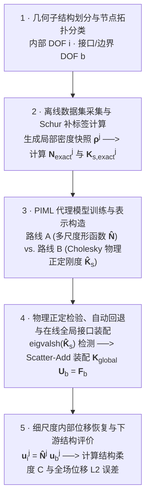
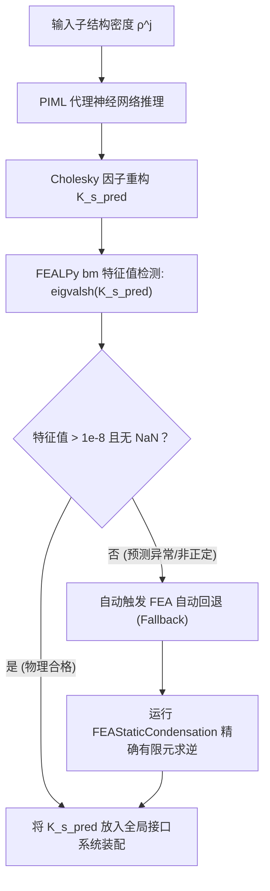

# 子结构静力缩聚 PIML 算子与物理正定范式

> **一句话**：本文档以标准的 5 步计算骨架与闭环流程，阐述 Problem-Independent Machine Learning (PIML) 在子结构有限元载体上的算子映射契约、路线 A (多尺度形函数 $\mathbf{N}$) 与路线 B (Cholesky 物理正定刚度 $\mathbf{K}_s$) 的比较，以及特征值检测与精确回退机制。

> **纯有限元力学基础参阅**：[[../substructural-condensation|子结构有限元与静力缩聚]]
> **通用 PIML 范式参阅**：[[piml-paradigm|PIML 通用 5 步范式]]
> **配套工程代码参照**：`soptx/examples/piml_substructure_elasticity/minimal_demo.py`

---

## 1. 5 步子结构 PIML 离线训练—在线复用计算骨架

PIML 与子结构静力缩聚的结合遵循以下通用的 5 步计算骨架与求解闭环：

---

## 2. 5 步计算闭环详细拆解

### 2.1 步骤 1：几何子结构划分与节点拓扑分类 (Partitioning & DOF Classification)
在子结构有限元框架中，全局计算域 $\Omega$ 被划分为 $M$ 个不重叠的子结构 $\Omega^j$。
对每个子结构，将节点自由度严格分类为内部自由度 $i$ (维度 $n_i$) 与接口/边界自由度 $b$ (维度 $n_b$)。

在给定的单元密度分布 $\boldsymbol{\rho}^j \in \mathbb{R}^{N_{elem}}$ 下，装配局部 $2 \times 2$ 分块未缩聚刚度矩阵：

$$
\mathbf{K}^j = \begin{bmatrix} \mathbf{K}_{ii}^j & \mathbf{K}_{ib}^j \\ \mathbf{K}_{bi}^j & \mathbf{K}_{bb}^j \end{bmatrix}
$$

### 2.2 步骤 2：离线数据集采集与 Schur 补标签计算 (Data Generation & Labels)
无内部载荷（$\mathbf{f}_i^j = \boldsymbol{0}$）时，利用高斯块消元（Schur 补）计算每个密度快照样本的精确局部力学表示标签：

* **精确多尺度形函数/约束模态** $\mathbf{N}_{\mathrm{exact}}^j \in \mathbb{R}^{n_i \times n_b}$：
  $$
  \mathbf{N}_{\mathrm{exact}}^j = -\left(\mathbf{K}_{ii}^j\right)^{-1}\mathbf{K}_{ib}^j
  $$
* **精确 Schur 补缩聚刚度矩阵** $\mathbf{K}_{s,\mathrm{exact}}^j \in \mathbb{R}^{n_b \times n_b}$：
  $$
  \mathbf{K}_{s,\mathrm{exact}}^j = \mathbf{K}_{bb}^j - \mathbf{K}_{bi}^j\left(\mathbf{K}_{ii}^j\right)^{-1}\mathbf{K}_{ib}^j
  $$

### 2.3 步骤 3：PIML 代理模型训练与表示路线选择 (Surrogate Training & Representations)
神经网络代理 $\mathcal{G}_\theta$ 建立从局部密度到缩聚力学算子的隐式回归映射 $\mathcal{G}_\theta : \boldsymbol{\rho}^j \longmapsto \widehat{\mathbf{N}}^j \text{ 或 } \widehat{\mathbf{K}}_s^j$。可选择两条不同的技术路线：

MLP 的通用前向数学、激活函数与结构保持输出参数化见 [[../machine-learning#MLP：统一数学定义]]、[[../machine-learning#激活函数与可微性]] 与 [[../machine-learning#结构保持输出参数化]]。本路线仅将其输入/输出专门化为 $\boldsymbol{\rho}^j \mapsto \widehat{\mathbf{N}}^j$ 或 $\boldsymbol{\rho}^j \mapsto \widehat{\mathbf{K}}_s^j$，并在下文定义缩聚、Cholesky 参数化与回退等局部力学约束。

#### 路线 A：预测多尺度形函数 $\mathbf{N}$ (Huang et al. 2023 路线)
* **网络预测**：输入密度 $\boldsymbol{\rho}^j$，预测内部节点关于接口节点的形函数 $\widehat{\mathbf{N}}^j = \mathcal{G}_\theta(\boldsymbol{\rho}^j)$。
* **物理二次重构**：由刚度二次型显式计算缩聚刚度：
  $$
  \widehat{\mathbf{K}}_s^j = \left(\widehat{\mathbf{N}}^j\right)^{\mathsf{T}} \mathbf{K}^j \widehat{\mathbf{N}}^j
  $$
* **优势**：由于局部未缩聚刚度 $\mathbf{K}^j$ 是半正定的，由二次型生成的 $\widehat{\mathbf{K}}_s^j$ **在数学上硬保证严格对称半正定**，绝无负特征值风险。

#### 路线 B：直接预测缩聚刚度 $\mathbf{K}_s$ (Cholesky 结构保持范式)
* **原理**：直接学习从局部密度到缩聚刚度矩阵元素的回归映射。普通 MLP 的无约束输出可产生非对称或含负特征值的矩阵，因此不直接将预测向量解释为完整 $\mathbf{K}_s$。
* **下三角参数化**：令接口自由度数为 $n_b$。网络输出 $n_{\mathrm{tril}}=n_b(n_b+1)/2$ 个独立条目，填入下三角矩阵 $\mathbf{L}\in\mathbb{R}^{n_b\times n_b}$；当前 SOPTX 实现用 $L_{kk}=|\hat z_{kk}|+10^{-4}$ 保证对角元素为正。
* **刚度重构与门禁**：先形成对称正定候选 $\mathbf{L}\mathbf{L}^{\mathsf{T}}$，再按当前实现施加微小平移：
  $$
  \widehat{\mathbf{K}}_s^j=\mathbf{L}\mathbf{L}^{\mathsf{T}}-10^{-6}\mathbf{I}.
  $$
  该平移意味着最终矩阵的正定性不能仅由 Cholesky 构造无条件推出。因此必须验证 $\lambda_{\min}(\widehat{\mathbf{K}}_s^j)>10^{-8}$；预测异常、NaN 或未通过门禁时回退至精确 FEA 缩聚。

### 2.4 步骤 4：物理正定检验、自动回退与在线全局接口装配 (Online Assembly & Solving)
为保障在线分析的可恢复性，在全局装配前执行特征值检测与自动回退：

通过 Scatter-Add 快速装配全局接口稀疏矩阵并求解接口位移 $\mathbf{U}_b$：

$$
\mathbf{K}_{\mathrm{interface}} = \sum_{j=1}^M \mathbf{L}_j^{\mathsf{T}} \widehat{\mathbf{K}}_s^j \mathbf{L}_j, \qquad \mathbf{K}_{\mathrm{interface}} \mathbf{U}_b = \mathbf{F}_b
$$

由于宏观载荷 $\mathbf{F}_b$ 和 Dirichlet 边界条件仅在步骤 4 引入，训练好的 PIML 代理模型完全具备**问题无关性 (Problem-Independent)**，可跨任意宏观 BVP 秒级推理复用。

### 2.5 步骤 5：细尺度内部位移恢复与下游结构评价 (Displacement Recovery & Evaluation)
由全局接口位移 $\mathbf{u}_b^j = \mathbf{L}_j \mathbf{U}_b$，通过多尺度形函数秒级恢复子结构内部细网格位移：

$$
\boldsymbol{u}_i^j = \widehat{\mathbf{N}}^j \boldsymbol{u}_b^j
$$

拼装全场位移向量 $\mathbf{U}_{\text{full}}$，进而评估结构总柔度 $C = \mathbf{F}^{\mathsf{T}}\mathbf{U}_{\text{full}}$ 及全场位移相对 $L_2$ 误差。

---

## 3. 关联页面与代码参照

- [[../substructural-condensation|子结构有限元与静力缩聚]] — 纯有限元 Schur 补消元推导与接口组装
- [[piml-paradigm|PIML 通用 5 步范式]] — Problem-Independent PIML 通用原理与流程图
- [[../../literature/topology-opt/translations/Huang2023-PIML-substructure-zh|Huang2023 论文中文精译]] — 论文第 2 节子结构 PIML 数学推导与第 4.1 节 MBB 梁算例
- **代码实现**：`soptx/src/soptx/fem/substructure/piml_surrogate.py`
- **验证 Demo**：`soptx/examples/piml_substructure_elasticity/minimal_demo.py`
