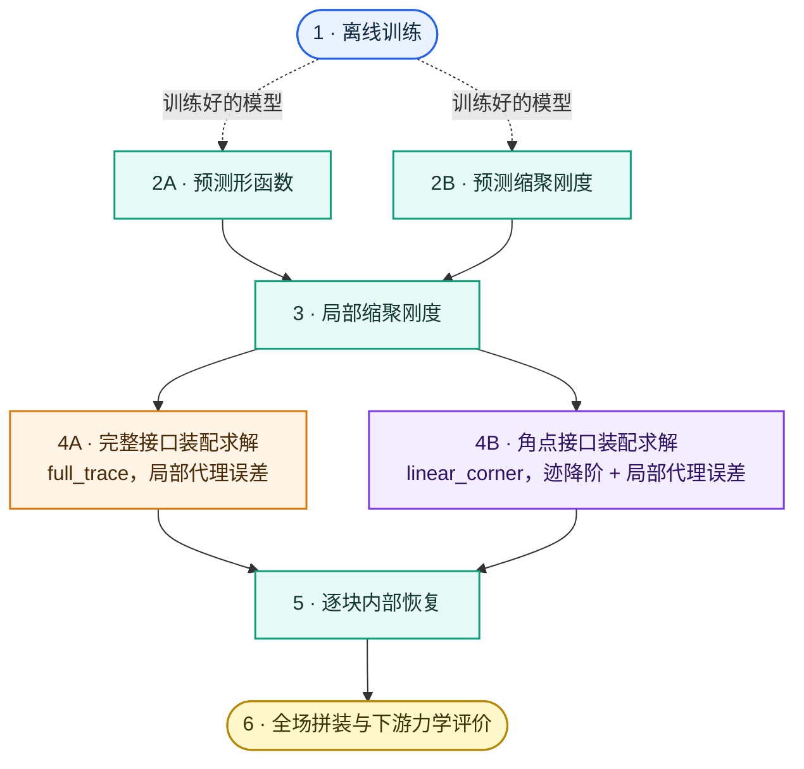

# 基于 PIML 的子结构分析

基于子结构的 PIML 用机器学习模型近似子结构局部材料分布到局部力学量的映射。该映射与宏观载荷和边界条件无关，模型可在几何、离散、材料参数域与接口表示相容的条件下离线训练、在线复用，以批量推理替代优化迭代中逐子结构的局部求解。学习对象可以是形函数，经变分构造得到缩聚刚度，并用同一形函数恢复内部位移；也可以直接是缩聚刚度，内部恢复需另行配置。在线阶段装配全局接口平衡方程求解接口位移，再恢复子结构内部响应。

```mermaid
%%{init: {"flowchart": {"wrappingWidth": 400}}}%%
flowchart TD
    A1(["1 · 离线训练"])
    A2["2A · 预测形函数"]
    A3["2B · 预测缩聚刚度"]
    M1["3 · 局部缩聚刚度"]
    B1["4A · 完整接口装配求解<br/>full_trace，局部代理误差"]
    B2["4B · 角点接口装配求解<br/>linear_corner，迹降阶 + 局部代理误差"]
    C1["5 · 逐块内部恢复"]
    C2(["6 · 全场拼装与下游力学评价"])

    A1 -. 训练好的模型 .-> A2
    A1 -. 训练好的模型 .-> A3
    A2 --> M1
    A3 --> M1
    M1 --> B1
    M1 --> B2
    B1 --> C1
    B2 --> C1
    C1 --> C2

    classDef input fill:#EAF2FF,stroke:#2563EB,color:#102A43,stroke-width:1.5px;
    classDef local fill:#E8FAF5,stroke:#0F9D7A,color:#12372F,stroke-width:1.5px;
    classDef exact fill:#FFF4E5,stroke:#D97706,color:#4A2A06,stroke-width:1.5px;
    classDef reduced fill:#F3EEFF,stroke:#7C3AED,color:#2E1065,stroke-width:1.5px;
    classDef downstream fill:#FFF8CC,stroke:#B88700,color:#3D3100,stroke-width:1.5px;

    class A1 input;
    class A2,A3,M1,C1 local;
    class B1 exact;
    class B2 reduced;
    class C2 downstream;
```

| 组合                        | 误差构成             | 局部刚度 / 全局每行非零元         | 在线局部计算                       | 主要瓶颈                           | 对应文献                                                |
| :------------------------ | :--------------- | :--------------------- | :--------------------------- | :----------------------------- | :-------------------------------------------------- |
| `linear_corner` + 精确   | 迹降阶              | 角点阶小稠密块 / 与粗网格相同       | 每步分解内部刚度块，逐角点自由度求解           | 局部分解与形函数存储                     | Hou 1999 Zhang 2010 Huang 2023（基线）            |
| `linear_corner` + PIML | 迹降阶 + 局部代理       | 同上                     | 批量推理；路线 A 加变分构造              | 形函数存储                          | Huang 2023/2024 Zhang 2024 Xu 2025 Ma 2026 |
| `cubic_bezier` + 精确    | 迹降阶（嵌套迹空间下可减小）       | 控制点阶稠密块 / 介于角点迹与完整接口之间 | 每步分解内部刚度块，逐控制点自由度求解          | 局部分解与形函数存储                     | Guo 2026 Bézier（基线）                                 |
| `cubic_bezier` + PIML  | 迹降阶 + 局部代理       | 同上                     | 批量推理；路线 A 加变分构造              | 输出维数随控制点数增长                    | Guo 2026 Bézier                                     |
| `oversampling` + 精确    | 超采样降阶；界面不协调需另行处理 | 角点阶小稠密块 / 待确认          | 每步在外扩域上逐角点自由度求解              | 外扩域求解规模；重叠单位分解协调               | Zhang 2010 Guo 2026 OFEM（基线）                     |
| `oversampling` + PIML  | 超采样降阶 + 局部代理     | 同上                     | 批量推理；Galerkin 投影             | 按子结构拓扑类型分别训练                   | Guo 2026 OFEM                                       |
| `full_trace` + 精确      | 无                | 接口阶大稠密块 / 与 $n_b$ 同阶   | 显式：逐接口自由度求解 隐式：每次作用一次局部求解 | Schur 补条件数；可用 BDDC/FETI-DP 类预条件 | Evgrafov 2008 Kočvara 2016                       |
| `full_trace` + PIML    | 局部代理             | 同上                     | 批量推理；路线 A 构造量随接口维数平方增长       | 输出维数与稠密块作用；预条件需另行配置          | Huang 2023（小规模）                                     |

表中成本与瓶颈为典型实现的定性比较，随块尺寸、存储策略与求解器配置变化。`cubic_bezier` 与 `oversampling` 仅作扩展方法对照，后文公式限定于非重叠、协调接口的 `full_trace` 与 `linear_corner`；超采样及重叠单位分解不能直接套用本页组装公式。只有角点迹空间包含于所选 Bézier 迹空间、采用同一细网格与相容约束时，才可据 Ritz 原理比较两者的逼近误差。

## 1. 问题定义与学习映射

### 1.1 局部问题与适用假设

局部问题与适用前提同 [[../exact-substructural#1.2 局部问题与适用假设|精确子结构分析 §1.2]]：小应变线弹性静力分析，子结构非重叠划分，公共界面上的有限元迹逐自由度匹配。对第 $j$ 个子结构，设边界与内部自由度数分别为 $n_b^j$、$n_i^j$，自由度按“边界—内部”顺序排列，细网格刚度矩阵为

$$
\mathbf K^j=\mathbf K^j(\boldsymbol\eta^j)= \begin{bmatrix} \mathbf K_{bb}^j & \mathbf K_{bi}^j\\ \mathbf K_{ib}^j & \mathbf K_{ii}^j \end{bmatrix},\qquad \mathbf K^j\in \mathbb R^{(n_b^j+n_i^j)\times(n_b^j+n_i^j)}.
\tag{1.1}
$$

其中 $\boldsymbol\eta^j$ 为子结构局部材料分布参数。$\mathbf K^j$ 对称半正定、$\mathbf K_{ii}^j$ 对称正定。

本页要求全部外载荷作用在子结构边界节点上，即内部载荷 $\mathbf f_i^j=\mathbf 0$。边界节点的范围同 [[../exact-substructural#1.1 子结构划分与边界集合|精确子结构分析 §1.1]]，既包括块间公共接口，也包括位于结构外边界上的部分。同一集中力是否落入内部取决于子结构划分，建模时应使加载点和位移约束都位于子结构边界节点上。

在此前提下，内部位移由边界位移经齐次延拓 $\mathbf u_i^j=\mathbf T^j\mathbf u_b^j$ 确定，$\mathbf T^j$ 与 $\mathbf K_s^j$ 只依赖材料分布而与载荷无关，离线训练后可用于任意满足该前提的载荷工况。若 $\mathbf f_i^j\neq\mathbf 0$，内部位移多出随载荷变化的特解 $(\mathbf K_{ii}^j)^{-1}\mathbf f_i^j$，缩聚载荷变为 $\mathbf f_b^j+(\mathbf T^j)^{\mathsf T}\mathbf f_i^j$，仅以材料分布为输入的模型给不出这两项；缩聚刚度的表达式不变。

### 1.2 学习映射

以子结构局部材料分布 $\boldsymbol\eta^j$ 为输入，PIML 预测子结构形函数的内部自由度分量或缩聚刚度矩阵：

$$
\boldsymbol\eta^j\mapsto\widehat{\mathbf T}^j,
\qquad
\boldsymbol\eta^j\mapsto\widehat{\mathbf K}_s^j.
\tag{1.2}
$$

输出矩阵的含义与维数取决于所选接口表示。两种接口空间及其精确训练标签在 §2.2 中定义，预测矩阵的构造见 §4。

## 2. 材料样本与训练标签生成

本章以单个子结构为对象，给定其材料分布与接口空间，计算子结构形函数和缩聚刚度，生成训练标签。

### 2.1 材料参数样本

每个样本是一组子结构内各细单元的材料参数。例如，以归一化杨氏模量为输入，一个包含 $n_e$ 个细单元的子结构，其第 $m$ 个样本为

$$
\boldsymbol\eta^{(m)}
=
\begin{bmatrix}
E_1^{(m)}/E_0 & \cdots & E_{n_e}^{(m)}/E_0
\end{bmatrix}^{\mathsf T},
\qquad m=1,\ldots,M,
\tag{2.1}
$$

其中 $E_0$ 为参考杨氏模量，$M$ 为样本总数。改变各细单元的材料参数，即得到不同的材料分布样本，并据此组装局部有限元刚度矩阵 $\mathbf K(\boldsymbol\eta^{(m)})$。材料取值须保证内部刚度块 $\mathbf K_{ii}$ 对称正定，使给定边界位移后的内部位移能够唯一确定。

### 2.2 子结构形函数与缩聚刚度标签的计算

对给定材料样本，先选择接口表示，再通过局部有限元求解计算子结构形函数与缩聚刚度，作为训练标签。以下省略子结构下标 $j$。

子结构边界位移统一写为

$$
\mathbf u_b=\boldsymbol\Psi\mathbf q,
\qquad
\boldsymbol\Psi\in\mathbb R^{n_b\times n_q}.
\tag{2.2}
$$

$\boldsymbol\Psi$ 为列满秩的迹基矩阵，$\mathbf q\in\mathbb R^{n_q}$ 为接口坐标；$\operatorname{range}(\boldsymbol\Psi)$ 为接口迹空间。本页考虑完整接口与角点接口两种表示。

#### 2.2.1 完整接口空间

`full_trace` 保留全部边界自由度，不作接口迹降阶：

$$
\boldsymbol\Psi=\mathbf I_{n_b},
\qquad
\mathbf q=\mathbf u_b\in\mathbb R^{n_b}.
\tag{2.3}
$$

**（1）学习子结构形函数的内部自由度分量**

对每个材料样本，计算标签

$$
\mathbf T_{\mathrm{full}}
=-(\mathbf K_{ii})^{-1}\mathbf K_{ib},
\qquad
\mathbf T_{\mathrm{full}}\in\mathbb R^{n_i\times n_b}.
\tag{2.4}
$$

其对应的子结构形函数矩阵与缩聚刚度满足

$$
\mathbf N_{\mathrm{full}}
=\begin{bmatrix}\mathbf I_{n_b}\\\mathbf T_{\mathrm{full}}\end{bmatrix},
\qquad
\mathbf K_{s,\mathrm{full}}
=(\mathbf N_{\mathrm{full}})^{\mathsf T}\mathbf K\mathbf N_{\mathrm{full}}.
\tag{2.5}
$$

这里 $\mathbf N$ 为子结构形函数矩阵。

**（2）直接学习缩聚刚度矩阵**

对每个材料样本，计算标签

$$
\mathbf K_{s,\mathrm{full}}
=\mathbf K_{bb}-\mathbf K_{bi}(\mathbf K_{ii})^{-1}\mathbf K_{ib},
\qquad
\mathbf K_{s,\mathrm{full}}\in\mathbb R^{n_b\times n_b}.
\tag{2.6}
$$

这里直接学习缩聚刚度矩阵，不预测子结构形函数。

#### 2.2.2 角点接口空间

`linear_corner` 只保留角点自由度：

$$
\boldsymbol\Psi=\mathbf L\in\mathbb R^{n_b\times n_c},
\qquad
\mathbf q=\mathbf u_c\in\mathbb R^{n_c},
\qquad
\mathbf u_b=\mathbf L\mathbf u_c.
\tag{2.7}
$$

设角点集合为 $\mathcal C$，则 $n_c=d|\mathcal C|$。本页沿用 [[../exact-substructural#2.2.2 角点接口空间|精确子结构分析 §2.2.2]] 的四边形／六面体粗参考单元与几何映射：$\mathbf L$ 由 $Q_1$ Lagrange 形函数在边界细节点的参考坐标上采样得到，二维为双线性、三维为三线性。采用相同 $Q_1$ 基的等参几何映射时，可精确再现物理坐标中的仿射位移，包括刚体运动。

该表示将边界位移限制在角点插值的迹空间中，一般引入接口迹降阶误差；跨子结构的粗迹协调与给定位移条件的相容性见 §5.2。

**（1）学习子结构形函数的内部自由度分量**

对每个材料样本，计算标签

$$
\mathbf T_{\mathrm{corner}}
=-(\mathbf K_{ii})^{-1}\mathbf K_{ib}\mathbf L
=\mathbf T_{\mathrm{full}}\mathbf L,
\qquad
\mathbf T_{\mathrm{corner}}\in\mathbb R^{n_i\times n_c}.
\tag{2.8}
$$

其对应的子结构形函数矩阵与缩聚刚度满足

$$
\mathbf N_{\mathrm{corner}}
=\begin{bmatrix}\mathbf L\\\mathbf T_{\mathrm{corner}}\end{bmatrix}
=\mathbf N_{\mathrm{full}}\mathbf L,
\qquad
\mathbf N_{\mathrm{corner}}\in\mathbb R^{(n_b+n_i)\times n_c},
\tag{2.9}
$$

$$
\mathbf K_{s,\mathrm{corner}}
=(\mathbf N_{\mathrm{corner}})^{\mathsf T}\mathbf K\mathbf N_{\mathrm{corner}}.
\tag{2.10}
$$

**（2）直接学习缩聚刚度矩阵**

对每个材料样本，计算标签

$$
\mathbf K_{s,\mathrm{corner}}
=(\mathbf L)^{\mathsf T}
\left[\mathbf K_{bb}-\mathbf K_{bi}(\mathbf K_{ii})^{-1}\mathbf K_{ib}\right]\mathbf L
=(\mathbf L)^{\mathsf T}\mathbf K_{s,\mathrm{full}}\mathbf L,
\qquad
\mathbf K_{s,\mathrm{corner}}\in\mathbb R^{n_c\times n_c}.
\tag{2.11}
$$

## 3. 训练目标与物理约束

### 3.1 网络输出与力学约束

预测的子结构形函数的内部自由度分量或缩聚刚度矩阵应满足相应的力学约束，以保持局部算子的基本物理性质。约束作用于最终用于结构分析的矩阵，不一定要求神经网络的原始输出直接满足。

**（1）子结构形函数的内部自由度分量：刚体运动再现**

保留固定边界块，并要求边界整体平移或转动时，内部随之作相同的刚体运动，不产生虚假应变。完整接口下满足

$$
\widehat{\mathbf T}_{\mathrm{full}}^j\mathbf R_b^j=\mathbf R_i^j;
\tag{3.1}
$$

角点空间下满足

$$
\mathbf L^j\mathbf R_c^j=\mathbf R_b^j,
\qquad
\widehat{\mathbf T}_{\mathrm{corner}}^j\mathbf R_c^j=\mathbf R_i^j.
\tag{3.2}
$$

其中 $\mathbf R_b^j$、$\mathbf R_i^j$、$\mathbf R_c^j$ 分别收集同一组刚体运动在边界、内部与角点上的位移。

**（2）缩聚刚度矩阵：对称性与能量性质**

以下考虑未施加支承、无额外零能机构且接口空间能表示全部刚体运动的子结构。记 $\mathbf q$ 为接口位移向量，$\mathbf R$ 的各列为接口上的刚体位移模态：完整接口取 $\mathbf R=\mathbf R_b^j$，角点接口取 $\mathbf R=\mathbf R_c^j$。预测缩聚刚度需满足三个约束：

1. **对称性**：矩阵中第 $(a,b)$ 项与第 $(b,a)$ 项相等，对应线弹性系统的互等性。

   $$
   \widehat{\mathbf K}_s^j=(\widehat{\mathbf K}_s^j)^{\mathsf T}.
   \tag{3.3}
   $$

2. **刚体运动不产生内力**：子结构整体平移或转动不发生变形，因此不应产生弹性内力，应变能也为零。

   $$
   \widehat{\mathbf K}_s^j\mathbf R=\mathbf0.
   \tag{3.4}
   $$

3. **非刚体变形具有正的应变能**：拉伸、剪切等变形应储存正的弹性能，不能出现负能量或额外的零能变形。

   $$
   \frac12\mathbf q^{\mathsf T}\widehat{\mathbf K}_s^j\mathbf q>0,
   \qquad \mathbf q\notin\operatorname{span}(\mathbf R).
   \tag{3.5}
   $$

三者合起来，要求预测刚度对称半正定，且零空间恰好由刚体运动组成：

$$
\widehat{\mathbf K}_s^j=(\widehat{\mathbf K}_s^j)^{\mathsf T},
\qquad
\widehat{\mathbf K}_s^j\succeq\mathbf0,
\qquad
\ker(\widehat{\mathbf K}_s^j)=\operatorname{span}(\mathbf R).
\tag{3.6}
$$

由于刚体运动必须具有零能量，未施加支承的局部缩聚刚度不能要求整体正定；正定性针对去除刚体运动后的变形子空间。

当细网格刚度 $\mathbf K^j$ 对称半正定时，由预测形函数矩阵进行能量投影可保证刚度对称半正定；刚体运动再现使相应刚体运动仍为零能模态。直接预测刚度时，这些性质需单独保证，仅补全对称条目和刚体约束不足以保证变形子空间上的正定性。

### 3.2 训练方式与目标

| 训练方式    | 学习对象          | 所需数据              | 训练目标                          |
| ------- | ------------- | ----------------- | ----------------------------- |
| 监督训练    | 子结构形函数的内部自由度分量或缩聚刚度矩阵 | 材料场及局部精确求解得到的矩阵标签 | 减小预测矩阵与标签之间的误差                |
| 无标签能量训练 | 子结构形函数的内部自由度分量        | 材料场及对应刚度，无需精确形函数标签 | 在边界位移固定、内部无载荷条件下，最小化预测位移场的应变能 |

#### 3.2.1 监督训练

固定接口空间与学习对象后，监督样本集写为 $\mathcal D=\{(\boldsymbol\eta^{(m)},\mathbf Y^{(m)})\}_{m=1}^M$，其中 $\mathbf Y^{(m)}$ 取对应的 $\mathbf T$ 或 $\mathbf K_s$。标签与预测必须采用同一自由度顺序、接口空间和材料归一化。

记 $\widehat{\mathbf Y}_\theta$ 为网络参数为 $\theta$ 时得到的预测矩阵。以预测矩阵与标签之间的均方误差为例，训练问题为

$$
\min_\theta\ \mathcal L_{\mathrm{sup}}(\theta),\qquad
\mathcal L_{\mathrm{sup}}(\theta)
=\frac{1}{M}\sum_{m=1}^M
\left\|\widehat{\mathbf Y}_\theta(\boldsymbol\eta^{(m)})-\mathbf Y^{(m)}\right\|_F^2.
\tag{3.7}
$$

$\|\cdot\|_F$ 为 Frobenius 范数。也可对独立分量定义损失，但其权重与重构后的矩阵误差未必相同；比较训练方案时须明确误差度量。

#### 3.2.2 无标签能量训练

对形函数路线，在边界块固定且内部无载荷时，可由最小势能原理构造离散目标。以下 trace 目标为本页推导，表示遍历全部单位接口坐标的应变能之和。Huang2024 的具体方案采用伪结构位移场的能量及变化的位移基，见 [[../../literature/topopt/piml/translations/Huang2024-PIML-datafree-zh#4.2 基于力学的损失函数|Huang2024 §4.2]] 与其 §4.3；本页公式不作为该文训练算法的逐式复现。

以下公式分别适用于 `full_trace` 和 `linear_corner`，省略接口类型下标，$\widehat{\mathbf N}$ 分别取 $\widehat{\mathbf N}_{\mathrm{full}}$ 或 $\widehat{\mathbf N}_{\mathrm{corner}}$：

$$
\mathcal L_{\mathrm{energy}}(\theta)
=\frac{1}{2M}\sum_{m=1}^M
\operatorname{tr}\!\left[
\widehat{\mathbf N}(\boldsymbol\eta^{(m)};\theta)^{\mathsf T}
\mathbf K(\boldsymbol\eta^{(m)})
\widehat{\mathbf N}(\boldsymbol\eta^{(m)};\theta)
\right].
\tag{3.8}
$$

式 (3.8) 中 $\operatorname{tr}$ 表示矩阵的迹，乘以 $1/2$ 后为各单位接口坐标对应的应变能之和；$\widehat{\mathbf N}$ 的构造见 §4。由于 $\mathbf K_{ii}$ 对称正定，对每个样本以子结构形函数的内部自由度分量为变量最小化该能量，唯一解为 §2 计算的形函数内部自由度分量；有限网络与有限训练不保证达到该解。边界块必须固定，不能随网络一同缩放以降低能量。

## 4. 基于网络预测构造局部缩聚刚度

精确构造先由内部平衡求得形函数，再由其能量投影得到缩聚刚度；本页 §2 据此生成训练标签。在线阶段，路线 A 用网络预测替代形函数内部块的局部精确求解，再保留能量投影构造；路线 B 直接预测并重构缩聚刚度。以下沿用内部无载荷假设，$\boldsymbol\theta$ 为训练后固定的网络参数，$\mathcal F$、$\mathcal G$ 分别包含形函数或刚度的网络预测与约束补全。

### 4.1 完整接口空间

**路线 A：形函数预测**

首先，根据局部材料分布预测并补全形函数的内部自由度分量：

$$
\widehat{\mathbf T}_{\mathrm{full}}^j
=\mathcal F_{\mathrm{full}}(\boldsymbol\eta^j;\boldsymbol\theta),
\qquad
\widehat{\mathbf T}_{\mathrm{full}}^j\in\mathbb R^{n_i^j\times n_b^j}.
\tag{4.1}
$$

其精确目标为式 (2.4) 中的 $\mathbf T_{\mathrm{full}}^j=-(\mathbf K_{ii}^j)^{-1}\mathbf K_{ib}^j$。然后，补入固定的单位边界块，构造形函数矩阵：

$$
\widehat{\mathbf N}_{\mathrm{full}}^j
=\begin{bmatrix}\mathbf I_{n_b^j}\\\widehat{\mathbf T}_{\mathrm{full}}^j\end{bmatrix},
\qquad
\widehat{\mathbf N}_{\mathrm{full}}^j\in\mathbb R^{(n_b^j+n_i^j)\times n_b^j}.
\tag{4.2}
$$

最后，利用当前材料场的 $\mathbf K^j(\boldsymbol\eta^j)$ 通过能量投影构造预测的局部缩聚刚度：

$$
\widehat{\mathbf K}_{s,\mathrm{full}}^j = (\widehat{\mathbf N}_{\mathrm{full}}^j)^{\mathsf T} \mathbf K^j\widehat{\mathbf N}_{\mathrm{full}}^j,  \qquad \widehat{\mathbf K}_{s,\mathrm{full}}^j \in\mathbb R^{n_b^j\times n_b^j}.
\tag{4.3}
$$

**路线 B：刚度直接预测**

直接预测完整接口空间中的局部缩聚刚度：

$$
\widehat{\mathbf K}_{s,\mathrm{full}}^j = \mathcal G_{\mathrm{full}}(\boldsymbol\eta^j;\boldsymbol\theta),\qquad
\widehat{\mathbf K}_{s,\mathrm{full}}^j\in\mathbb R^{n_b^j\times n_b^j}.
\tag{4.4}
$$

该路线不经过形函数矩阵的能量投影。重构后的矩阵须满足 §3.1 的对称性、刚体零空间与变形子空间正定性要求。

### 4.2 角点接口空间

**路线 A：形函数预测**

首先，网络根据局部材料分布预测并补全子结构形函数的内部自由度分量：

$$
\widehat{\mathbf T}_{\mathrm{corner}}^j
=\mathcal F_{\mathrm{corner}}(\boldsymbol\eta^j;\boldsymbol\theta),
\qquad
\widehat{\mathbf T}_{\mathrm{corner}}^j
\in\mathbb R^{n_i^j\times n_c^j}.
\tag{4.5}
$$

其精确目标为式 (2.8) 中的 $\mathbf T_{\mathrm{corner}}^j=\mathbf T_{\mathrm{full}}^j\mathbf L^j$。

然后，与已知边界插值矩阵 $\mathbf L^j$ 组成子结构形函数矩阵，按“边界—内部”顺序表示子结构位移：

$$
\begin{bmatrix}
\widehat{\mathbf u}_b^j\\
\widehat{\mathbf u}_i^j
\end{bmatrix}
=
\underbrace{
\begin{bmatrix}
\mathbf L^j\\
\widehat{\mathbf T}_{\mathrm{corner}}^j
\end{bmatrix}}_{\widehat{\mathbf N}_{\mathrm{corner}}^j}
\mathbf u_c^j.
\tag{4.6}
$$

最后，利用当前材料场对应的细网格刚度构造缩聚刚度：

$$
\begin{aligned}
\widehat{\mathbf K}_{s,\mathrm{corner}}^j
&=(\widehat{\mathbf N}_{\mathrm{corner}}^j)^{\mathsf T}
\mathbf K^j(\boldsymbol\eta^j)\widehat{\mathbf N}_{\mathrm{corner}}^j\\
&=(\mathbf L^j)^{\mathsf T}\mathbf K_{bb}^j\mathbf L^j
+(\mathbf L^j)^{\mathsf T}\mathbf K_{bi}^j
\widehat{\mathbf T}_{\mathrm{corner}}^j\\
&\quad+(\widehat{\mathbf T}_{\mathrm{corner}}^j)^{\mathsf T}
\mathbf K_{ib}^j\mathbf L^j
+(\widehat{\mathbf T}_{\mathrm{corner}}^j)^{\mathsf T}
\mathbf K_{ii}^j\widehat{\mathbf T}_{\mathrm{corner}}^j.
\end{aligned}
\tag{4.7}
$$

这里，$\widehat{\mathbf T}_{\mathrm{corner}}^j$ 来自网络，$\mathbf K^j$ 来自当前材料场的有限元装配，$\mathbf L^j$ 由接口空间确定。预测的形函数内部自由度分量一般不严格满足 $\mathbf K_{ii}^j\widehat{\mathbf T}_{\mathrm{corner}}^j=-\mathbf K_{ib}^j\mathbf L^j$，因此不能直接使用这一精确平衡关系简化式 (4.7) 的四项表达式。

角点接口下的子结构形函数的内部自由度分量有两种预测方式：

- **直接预测角点接口下的形函数内部自由度分量**：以局部材料分布为输入，得到 $\widehat{\mathbf T}_{\mathrm{corner}}^j$，无须先构造完整接口预测模型。
- **先预测完整接口下的形函数内部自由度分量，再投影到角点空间**：得到 $\widehat{\mathbf T}_{\mathrm{full}}^j$ 后，取 $\widehat{\mathbf T}_{\mathrm{corner}}^j=\widehat{\mathbf T}_{\mathrm{full}}^j\mathbf L^j$，无须另行训练角点模型。

第二种方式满足

$$
\widehat{\mathbf N}_{\mathrm{corner}}^j
=\widehat{\mathbf N}_{\mathrm{full}}^j\mathbf L^j,
\qquad
\widehat{\mathbf K}_{s,\mathrm{corner}}^j
=(\mathbf L^j)^{\mathsf T}\widehat{\mathbf K}_{s,\mathrm{full}}^j\mathbf L^j.
\tag{4.8}
$$

其中两种预测刚度均由同一个预测形函数矩阵 $\widehat{\mathbf N}_{\mathrm{full}}^j$ 及其角点投影按能量关系构造。式 (4.8) 的等价关系不要求先形成完整接口刚度；若只需要角点刚度，可先投影形函数矩阵，再计算能量投影。

**路线 B：刚度直接预测**

以局部材料分布为输入，直接预测并重构角点缩聚刚度：

$$
\widehat{\mathbf K}_{s,\mathrm{corner}}^j
=\mathcal G_{\mathrm{corner}}(\boldsymbol\eta^j;\boldsymbol\theta),
\qquad
\widehat{\mathbf K}_{s,\mathrm{corner}}^j\in\mathbb R^{n_c^j\times n_c^j}.
\tag{4.9}
$$

该路线不经过形函数矩阵的能量投影。重构后的矩阵须满足 §3.1 的对称性、刚体零空间与变形子空间正定性要求。

### 4.3 局部代理误差

在同一接口空间、相同边界插值下，记形函数内部自由度分量的预测误差为

$$
\mathbf E^j=\widehat{\mathbf T}^j-\mathbf T_{\mathrm{full}}^j\boldsymbol\Psi^j,
\tag{4.10}
$$

其中完整接口 $\boldsymbol\Psi^j=\mathbf I$，角点接口 $\boldsymbol\Psi^j=\mathbf L^j$；先预测完整分量再投影时 $\mathbf E_{\mathrm{corner}}^j=\mathbf E_{\mathrm{full}}^j\mathbf L^j$。式 (4.12) 的推导及成立前提（边界块严格为 $\boldsymbol\Psi^j$、同一 $\mathbf K^j$、内部无载荷、$\mathbf K_{ii}^j\succ0$）见[[../exact-substructural#4.2 近似形函数的二次余项|精确页 §4.2]]。

本节统一记同一接口空间中的精确刚度为

$$
\mathbf K_s^j
=(\boldsymbol\Psi^j)^{\mathsf T}
\mathbf K_{s,\mathrm{full}}^j\boldsymbol\Psi^j.
\tag{4.11}
$$

完整接口时它就是 $\mathbf K_{s,\mathrm{full}}^j$，角点接口时则为 $\mathbf K_{s,\mathrm{corner}}^j$；$\widehat{\mathbf K}_s^j$ 表示对应接口空间中由预测形函数能量投影得到的刚度。因此，本节比较的是同一接口空间中的局部代理误差，未包含接口迹降阶误差。

通过能量投影构造的缩聚刚度满足

$$
\widehat{\mathbf K}_s^j-\mathbf K_s^j
=(\mathbf E^j)^{\mathsf T}\mathbf K_{ii}^j\mathbf E^j
\succeq\mathbf 0.
\tag{4.12}
$$

因此，形函数内部自由度分量的误差使预测刚度相对同一接口空间的精确刚度偏大，即对相同接口位移给出不低于精确值的应变能。刚度直接预测不具有这一误差方向保证。

## 5. 整体结构分析

在相邻子结构的接口迹协调条件下，令 $N_Q$ 为所选接口表示下的全局接口自由度总数（含受约束自由度），$\widehat{\mathbf Q}\in\mathbb R^{N_Q}$ 为预测系统的全局接口位移向量。令 $\mathbf A_q^j\in\mathbb R^{n_q^j\times N_Q}$ 为从全局接口自由度到第 $j$ 个子结构接口自由度的限制矩阵（restriction matrix），满足

$$
\widehat{\mathbf q}^j=\mathbf A_q^j\widehat{\mathbf Q}.
$$

记 $\widehat{\mathbf K}_s^j\in\mathbb R^{n_q^j\times n_q^j}$ 为所选接口空间中的预测局部刚度，可由形函数能量投影构造或直接预测（§4）。在内部无载荷假设下，局部接口载荷为 $\mathbf f_r^j=(\boldsymbol\Psi^j)^{\mathsf T}\mathbf f_b^j\in\mathbb R^{n_q^j}$。通用的全局接口刚度矩阵 $\widehat{\mathbf K}_Q\in\mathbb R^{N_Q\times N_Q}$ 与载荷向量 $\mathbf F_Q\in\mathbb R^{N_Q}$ 为

$$
\widehat{\mathbf K}_Q=\sum_{j=1}^{M}(\mathbf A_q^j)^{\mathsf T}\widehat{\mathbf K}_s^j\mathbf A_q^j,
\qquad
\mathbf F_Q=\sum_{j=1}^{M}(\mathbf A_q^j)^{\mathsf T}\mathbf f_r^j.
$$

完整接口取 $\widehat{\mathbf Q}=\widehat{\mathbf U}_\Gamma$、$\mathbf A_q^j=\mathbf A_b^j$、$\boldsymbol\Psi^j=\mathbf I$，对应 $\widehat{\mathbf K}_Q=\widehat{\mathbf K}_\Gamma$、$\mathbf F_Q=\mathbf F_\Gamma$；角点接口取 $\widehat{\mathbf Q}=\widehat{\mathbf U}_C$、$\mathbf A_q^j=\mathbf A_c^j$、$\boldsymbol\Psi^j=\mathbf L^j$，对应 $\widehat{\mathbf K}_Q=\widehat{\mathbf K}_C$、$\mathbf F_Q=\mathbf F_C$。两种接口分别施加支承并求解（§5.1、§5.2），随后恢复子结构位移并拼装全场（§5.3）。

支承处理沿用 [[../exact-substructural#3.1 完整接口组装与求解|精确页 §3.1]] 与 [[../exact-substructural#3.2 角点接口组装与求解|§3.2]]，将精确刚度换为预测刚度。以下沿用 §1.1 的内部无载荷假设，局部刚度在施加全局支承前构造；各子结构外载荷一致分配，同一载荷只计入一次。

### 5.1 完整接口组装与求解

以全局接口位移 $\widehat{\mathbf U}_\Gamma\in\mathbb R^{N_\Gamma}$ 为待求未知量，限制矩阵 $\mathbf A_b^j$ 将全局完整接口自由度映射到第 $j$ 个子结构的边界自由度：

$$
\widehat{\mathbf u}_b^j=\mathbf A_b^j\widehat{\mathbf U}_\Gamma,\qquad
\mathbf A_b^j\in\mathbb R^{n_b^j\times N_\Gamma},
\tag{5.1}
$$

其中 $N_\Gamma$ 为全局完整接口自由度总数（含受约束自由度）。全局接口刚度矩阵 $\widehat{\mathbf K}_\Gamma\in\mathbb R^{N_\Gamma\times N_\Gamma}$ 与载荷向量 $\mathbf F_\Gamma\in\mathbb R^{N_\Gamma}$ 按下式组装，并形成全局接口方程：

$$
\widehat{\mathbf K}_\Gamma\widehat{\mathbf U}_\Gamma=\mathbf F_\Gamma+\widehat{\mathbf R}_D,\qquad
\widehat{\mathbf K}_\Gamma=\sum_j(\mathbf A_b^j)^{\mathsf T}
\widehat{\mathbf K}_{s,\mathrm{full}}^j\mathbf A_b^j,\qquad
\mathbf F_\Gamma=\sum_j(\mathbf A_b^j)^{\mathsf T}\mathbf f_b^j.
\tag{5.2}
$$

$\widehat{\mathbf R}_D\in\mathbb R^{N_\Gamma}$ 为预测系统的支承反力向量，仅在受约束自由度上可能非零。无论局部刚度来自形函数的能量投影还是刚度直接预测，全局组装形式均相同；路线 A 的方程是预测形函数空间中的变分平衡，不能据此断言恢复位移满足原细网格的每一行平衡。

令 $D$、$F$ 分别为给定位移与自由自由度集合，$(\widehat{\mathbf U}_\Gamma)_D=\mathbf d_D$，自由位移满足

$$
(\widehat{\mathbf K}_\Gamma)_{FF}(\widehat{\mathbf U}_\Gamma)_F
=(\mathbf F_\Gamma)_F-(\widehat{\mathbf K}_\Gamma)_{FD}\mathbf d_D.
\tag{5.3}
$$

若预测局部算子满足 §3.1 的能量与零空间要求，且支承消除全部全局零能模式，则自由子系统对称正定，有唯一解。支承反力由受约束行的残量计算：

$$
(\widehat{\mathbf R}_D)_D
=(\widehat{\mathbf K}_\Gamma\widehat{\mathbf U}_\Gamma-\mathbf F_\Gamma)_D.
\tag{5.4}
$$

### 5.2 角点接口组装与求解

相邻子结构须在共享界面采用一致的角点、几何参数化与插值迹；细网格节点和单元面匹配本身不足以保证粗迹协调。以下在该条件下组装角点系统。

以全局角点位移 $\widehat{\mathbf U}_C\in\mathbb R^{N_C}$ 为待求未知量，限制矩阵 $\mathbf A_c^j$ 将全局角点接口自由度映射到第 $j$ 个子结构的角点自由度：

$$
\widehat{\mathbf u}_c^j=\mathbf A_c^j\widehat{\mathbf U}_C,\qquad
\mathbf A_c^j\in\mathbb R^{n_c^j\times N_C},\qquad
\widehat{\mathbf u}_b^j=\mathbf L^j\mathbf A_c^j\widehat{\mathbf U}_C,
\tag{5.5}
$$

其中 $N_C$ 为全局角点接口自由度总数（含受约束自由度）。先将局部边界载荷投影到角点空间，$\mathbf f_c^j=(\mathbf L^j)^{\mathsf T}\mathbf f_b^j$，再组装全局角点接口刚度矩阵 $\widehat{\mathbf K}_C\in\mathbb R^{N_C\times N_C}$ 与载荷向量 $\mathbf F_C\in\mathbb R^{N_C}$：

$$
\widehat{\mathbf K}_C=\sum_j(\mathbf A_c^j)^{\mathsf T}
\widehat{\mathbf K}_{s,\mathrm{corner}}^j\mathbf A_c^j,\qquad
\mathbf F_C=\sum_j(\mathbf A_c^j)^{\mathsf T}
(\mathbf L^j)^{\mathsf T}\mathbf f_b^j.
\tag{5.6}
$$

插值矩阵 $\mathbf L^j$ 决定边界位移表示，限制矩阵 $\mathbf A_c^j$ 将全局角点位移限制到第 $j$ 个子结构，两者作用不同。

上述 $\mathbf f_b^j$ 为分配到各子结构的边界载荷，共享节点的外载荷不得重复计入。非零内部载荷需先进行一致的载荷缩聚，不能直接使用上述右端公式。

在上述粗迹协调条件下，存在全局迹映射 $\mathbf P\in\mathbb R^{N_\Gamma\times N_C}$，满足

$$
\widehat{\mathbf U}_\Gamma=\mathbf P\widehat{\mathbf U}_C,
\qquad
\mathbf A_b^j\mathbf P=\mathbf L^j\mathbf A_c^j.
\tag{5.7}
$$

由式 (5.7)，完整接口上的给定位移条件转化为

$$
\mathbf C_D\widehat{\mathbf U}_C=\mathbf d_D,
\qquad
\mathbf C_D:=\mathbf P[D,:].
\tag{5.8}
$$

须有 $\mathbf d_D\in\operatorname{range}(\mathbf C_D)$，并在核对右端一致性后保留独立约束行；若不相容，应扩大迹空间或明确采用何种边界近似，不能直接把细边界约束等同于固定角点。

可通过 Lagrange 乘子系统求解：

$$
\begin{pmatrix}
\widehat{\mathbf K}_C&\mathbf C_D^{\mathsf T}\\
\mathbf C_D&\mathbf0
\end{pmatrix}
\begin{pmatrix}\widehat{\mathbf U}_C\\\widehat{\boldsymbol\lambda}_D\end{pmatrix}
=
\begin{pmatrix}\mathbf F_C\\\mathbf d_D\end{pmatrix}.
\tag{5.9}
$$

$\widehat{\boldsymbol\lambda}_D$ 为支承约束乘子。当 $\mathbf C_D$ 行满秩且 $\widehat{\mathbf K}_C$ 在 $\ker(\mathbf C_D)$ 上正定时，式 (5.9) 有唯一解；也可采用变量消元或零空间方法。所得位移满足降阶空间中的平衡，一般不满足全部细接口自由行的平衡。

预测局部算子的物理约束见 §3.1、§4；系统的可解性仍须满足上述约束相容与正定性条件。

### 5.3 子结构位移恢复

求得全局接口位移后，可利用预测形函数矩阵或通过局部精确求解恢复子结构位移。以下沿用内部无载荷假设。

**路线 A：形函数预测**

使用构造局部刚度的同一个预测形函数矩阵恢复子结构位移。预测恢复一般不严格满足原细网格的内部平衡；两种接口空间分别为

$$
\begin{aligned}
\texttt{full\_trace}:\quad
\widehat{\mathbf u}^j
&=\widehat{\mathbf N}_{\mathrm{full}}^j\mathbf A_b^j\widehat{\mathbf U}_\Gamma,\\
\texttt{linear\_corner}:\quad
\widehat{\mathbf u}^j
&=\widehat{\mathbf N}_{\mathrm{corner}}^j\mathbf A_c^j\widehat{\mathbf U}_C.
\end{aligned}
\tag{5.10}
$$

**路线 B：刚度直接预测**

**（1）利用另行预测的形函数矩阵恢复**

直接预测缩聚刚度时，可另配形函数预测模型获得内部自由度分量，并补全为预测形函数矩阵；随后按式 (5.10) 的形式恢复位移。刚度模型用于全局接口求解，形函数模型用于内部恢复，两者分别预测，不保证满足 $\widehat{\mathbf K}_s^j=(\widehat{\mathbf N}^j)^{\mathsf T}\mathbf K^j\widehat{\mathbf N}^j$。

**（2）通过局部精确求解恢复**

以全局求解得到的局部边界位移为已知条件，求解子结构内部平衡方程。在内部无载荷时，恢复公式为

$$
\widehat{\mathbf u}^j=
\begin{bmatrix}
\mathbf I_{n_b^j}\\
-(\mathbf K_{ii}^j)^{-1}\mathbf K_{ib}^j
\end{bmatrix}
\widehat{\mathbf u}_b^j,
\qquad
\widehat{\mathbf u}_b^j=
\begin{cases}
\mathbf A_b^j\widehat{\mathbf U}_\Gamma,
&\texttt{full\_trace},\\
\mathbf L^j\mathbf A_c^j\widehat{\mathbf U}_C,
&\texttt{linear\_corner}.
\end{cases}
\tag{5.11}
$$

实际计算通过求解局部线性方程组实现，不显式求逆。该方式满足给定边界位移下的内部平衡，但增加局部求解成本；它不能消除预测缩聚刚度的误差，也不自动保证预测刚度与恢复位移的能量一致。

全场拼装时，各块内部位移直接拼接，共享边界位移由全局接口解确定，保持一致、不累加。
