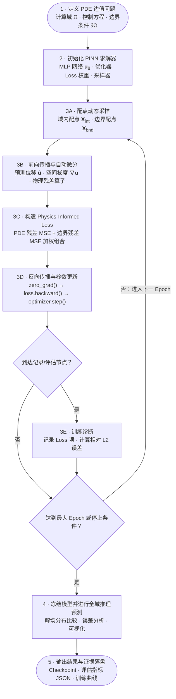

# 物理信息神经网络 (PINN)

> 本页记录 Physics-Informed Neural Network (PINN) 求解偏微分方程（PDE）的通用 5 步数学与计算范式、计算力学学者的 ML 入门概念映射，以及 PINN 范式与项目主线 Problem-Independent Machine Learning (PIML) 的异同对比。

## 1. 概念定义与范式消歧

* **Physics-Informed Machine Learning (Problem-Dependent)**：PINN 属于此类范式。它使用神经网络逼近单次边值问题（BVP）的解场，通过将 PDE 控制方程与边界条件残差直接构造为 Loss 函数，利用自动微分与梯度下降算法求解特定参数/边界下的物理场。
* **与项目主线 PIML 的区别**：项目主线 [[piml/_index|Problem-Independent Machine Learning (PIML)]] 学习的是**可跨宏观 BVP 复用的局部力学表示**（如局部材料 $\to$ 多尺度形函数/缩聚刚度）。PINN 是针对单个 BVP 的无网格优化求解器，不具备跨 BVP 的泛化预测能力。

---

## 2. PINN 求解 PDE 的通用 5 步数学与计算范式

无论求解何种偏微分方程（Poisson、线弹性、流体 Navier-Stokes 等），PINN 均遵循以下通用的 5 步计算骨架与训练闭环：



### 2.1 步骤 1：神经网络参数化表达 (MLP Forward)
使用多层感知机（MLP）作为解场 $\hat{\boldsymbol{u}}(\boldsymbol{x})$ 的连续逼近器。设输入空间坐标为 $\boldsymbol{x} \in \mathbb{R}^d$（输入层 $\boldsymbol{h}^{(0)} = \boldsymbol{x}$），网络通过 $L-1$ 个隐藏层逐层映射至输出解场预测 $\hat{\boldsymbol{u}} \in \mathbb{R}^{d_{\text{out}}}$：

$$
\begin{aligned}
\boldsymbol{h}^{(0)} &= \boldsymbol{x} \in \mathbb{R}^d, \\
\boldsymbol{z}^{(l)} &= \mathbf{W}^{(l)} \boldsymbol{h}^{(l-1)} + \boldsymbol{b}^{(l)}, \quad & (l = 1, 2, \dots, L-1) \\
\boldsymbol{h}^{(l)} &= \sigma\left(\boldsymbol{z}^{(l)}\right), \quad & (l = 1, 2, \dots, L-1) \\
\hat{\boldsymbol{u}} &= \mathbf{W}^{(L)} \boldsymbol{h}^{(L-1)} + \boldsymbol{b}^{(L)} & (\text{输出层线性输出})
\end{aligned}
$$

其中 $\mathbf{W}^{(l)}$ 为权重矩阵，$\boldsymbol{b}^{(l)}$ 为偏置向量，$\sigma(\cdot)$ 为逐元素非线性激活函数。网络可优化参数记为 $\boldsymbol{\theta} = \left\{ \mathbf{W}^{(l)}, \boldsymbol{b}^{(l)} \right\}_{l=1}^L$。

### 2.2 步骤 2：配点采样 (Collocation Sampling)
PINN 属于无网格 Data-Free 方法，训练配点在计算域中动态生成：
* 域内配点集 $\mathcal{X}_{\text{int}} = \{\boldsymbol{x}_i^{(int)}\}_{i=1}^{N_{\text{int}}} \subset \Omega$
* 边界配点集 $\mathcal{X}_{\text{bnd}} = \{\boldsymbol{x}_j^{(bnd)}\}_{j=1}^{N_{\text{bnd}}} \subset \partial\Omega$

### 2.3 步骤 3：自动微分求导链与激活函数的 $C^k$ 阶数约束
PINN 利用自动微分（Automatic Differentiation, AD）精确计算解场关于空间坐标的高阶偏导数，克服了传统数值求导（如有限差分法）的截断误差与网格依赖：
$$
\nabla \hat{\boldsymbol{u}} = \text{AD}\left(\hat{\boldsymbol{u}}(\boldsymbol{x}); \boldsymbol{x}\right)
$$
进而显式构造点值 PDE 控制残差 $\boldsymbol{R}_{\text{int}}(\boldsymbol{x}; \boldsymbol{\theta})$ 与边界残差 $\boldsymbol{R}_{\text{bnd}}(\boldsymbol{x}; \boldsymbol{\theta})$。

##### 主流自动微分 (AD) 后端接口对照
PINN 的物理残差求导机制独立于具体软件框架，不同计算框架的 AD 实现接口如下：

| AD 计算框架 | 一阶/高阶偏导接口 | 特点与在 SciML 中的应用场景 |
|---|---|---|
| **JAX** | `jax.grad` / `jax.vmap` / `jax.jvp` | 函数式变换、极佳的高阶微分表达能力，结合 XLA JIT 编译在物理计算中性能强悍 |
| **PyTorch** | `torch.autograd.grad(..., create_graph=True)` | 动态计算图，工程生态最完善（如 `soptx` 默认后端） |
| **TensorFlow** | `tf.GradientTape(persistent=True)` | 经典框架，早期 PINN 论文 (Raissi 2019) 原始实现 |
| **Julia** | `Enzyme.jl` / `Zygote.jl` | 科学计算 (Scientific ML) 生态原生高阶自动微分 |

> **激活函数的 $C^k$ 阶数约束**：
> 若 PDE 包含 $m$ 阶偏导数（如线弹性与 Poisson 方程中的二阶偏导 $m=2$），激活函数必须满足 $C^k$ 连续可微（$k \ge m$）。
> * $\text{ReLU}(x) = \max(0,x)$ 的二阶导数几乎处处为 0，若用于 2 阶 PDE 会导致物理残差求导失效！
> * PINN 必须选用高阶连续可微激活函数，如 $\tanh(x) \in C^\infty$、$\text{SiLU}(x)$ 或 $\sin(x)$。

### 2.4 步骤 4：Physics-Informed Loss 函数构造
将域内残差与边界残差的均方误差（MSE）加权组合：
$$
\mathcal{L}(\boldsymbol{\theta}) = w_{\text{int}} \cdot \underbrace{\frac{1}{N_{\text{int}}} \sum_{i=1}^{N_{\text{int}}} \left\| \boldsymbol{R}_{\text{int}}(\boldsymbol{x}_i^{(int)}; \boldsymbol{\theta}) \right\|_2^2}_{\mathcal{L}_{\text{int}}} + w_{\text{bnd}} \cdot \underbrace{\frac{1}{N_{\text{bnd}}} \sum_{j=1}^{N_{\text{bnd}}} \left\| \boldsymbol{R}_{\text{bnd}}(\boldsymbol{x}_j^{(bnd)}; \boldsymbol{\theta}) \right\|_2^2}_{\mathcal{L}_{\text{bnd}}}
$$

### 2.5 步骤 5：梯度下降优化循环 (Optimization Loop)
利用 Adam 或 L-BFGS 优化器，按标准三步曲反向传播并更新网络权重：
```text
optimizer.zero_grad() → loss.backward() → optimizer.step()
```

---

## 3. 计算力学学者的通用概念映射卡片

将经典有限元（FEM）概念映射到深度学习（PyTorch/PINN）的对应组件：

| 经典计算力学 / FEM 概念 | PyTorch / PINN 对应组件 | 通用原理 |
|---|---|---|
| 试探函数 / 网格形函数插值 | 多层感知机 (MLP Neural Network) | 用连续神经网络逼近未知解场 |
| 形函数求导 $\mathbf{B}$ 矩阵 | 自动微分 `torch.autograd.grad` | 链式法则求解场关于坐标的高阶偏导 |
| 控制方程残差 / 最小势能原理 | 损失函数 (Loss Function: MSE) | 将 PDE 与边界条件转化为标量优化目标 |
| 积分点 / 采样点 | 配点 (Collocation Points) | 域内与边界的无网格坐标采样 |
| 整体刚度矩阵求解 $K U = F$ | Adam / L-BFGS 梯度下降优化器 | 迭代更新网络参数 $\boldsymbol{\theta}$ |

---

## 4. 范式对比：PINN vs [[piml/piml-paradigm|Problem-Independent PIML]]

| 维度 | PINN (Problem-Dependent) | PIML (Problem-Independent / Huang–Ma 路线) |
|---|---|---|
| **输入** | 空间坐标 $\boldsymbol{x} \in \mathbb{R}^d$ | 局部材料分布 / 几何配置 $\rho(\boldsymbol{x})$ |
| **输出** | 空间某点响应 $\hat{\boldsymbol{u}}(\boldsymbol{x})$ | 局部多尺度形函数 $\boldsymbol{N}(x)$ / 缩聚刚度矩阵 $\mathbf{K}_e$ |
| **训练数据** | 无数据 (Data-Free)，靠 Collocation 点残差 | 局部材料样本集 (Supervised 或 Data-Free Mechanics) |
| **重训需求** | 载荷 / 边界条件改变后**必须重新训练** | 训练完成后，**跨宏观 BVP 免重训、秒级推理** |
| **项目角色** | 物理残差算子基线、ML 入门与对比 Baseline | 博士后核心研究项目 WP2 的主线攻关方向 |

---

## 5. 常见物理问题的实例化索引

通用 PINN 范式在不同物理问题上的具体算例与算法规范：

1. **线弹性方程 (Linear Elasticity)**：
   * 代码实现：[[../entities/soptx]] 算例 `soptx/examples/pinn_elasticity`
   * 物理算子规范：`soptx/examples/pinn_elasticity/math_spec.md`（包含各向同性 Hooke 本构与二阶应力散度残差）

---

## 6. 相关页面

* [[linear-elasticity|线弹性]] — 静力各向同性线弹性方程与变分形式
* [[machine-learning|机器学习]] — 经典回归、神经网络与函数/算子学习分类，含 SciML 归纳偏置
* [[piml/_index|PIML 术语与主题入口]] — Problem-Independent 路线说明
* [[piml/reference-libraries/fealpy-sciml-architecture|FEALPy SciML 与机器学习基础设施架构]] — PINN 求解链的框架侧实现基础
* [[gpu-hpc/reference-libraries/fealpy-architecture|FEALPy 多后端与张量引擎架构]] — 后端分派与 GPU 执行路径
