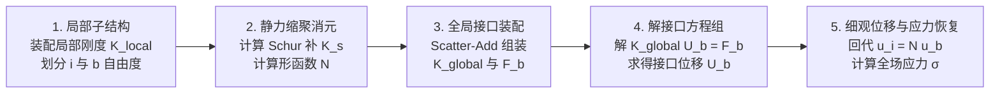

# 子结构有限元与静力缩聚 (Substructure FEM & Static Condensation)

> **一句话**：子结构有限元是将复杂物理结构划分为多个局部子域的整体建模框架，而静力缩聚（Schur 补）是消除子域内部节点自由度的代数消元工具；二者融合实现了将全尺度有限元求解降维至接口系统的 100% 精确数学等价分析。

经典有限元线弹性基础见 [[linear-elasticity]]。子结构缩聚如何作为 Problem-Independent PIML 的局部力学载体，由 [[piml/mathematical-foundations|PIML 数学基础]]维护；相关机器学习路线的角色边界见 [[ml-roles-and-boundaries]]。

---

## 1. 概念辨析：整体框架 vs. 代数工具

在计算力学中，“子结构有限元”与“静力缩聚”既不是完全等同的同一概念，也不是孤立的两个概念，而是**整体建模框架 vs. 核心代数工具**的关系：

```text
子结构有限元 (Substructure FEM)   ───> 整体物理/工程建模框架 (Domain Partitioning Framework)
      │
      └──> 在静力学条件下采用的核心代数工具 ───> 静力缩聚 (Static Condensation / Schur Complement)
```

- **子结构有限元 (Substructure FEM)**：指将一个大尺寸或复杂结构在几何上划分为 $M$ 个无重叠的局部子区域（子结构 $\Omega^j$），建立接口拓扑关系、全局组装与解场恢复的**整体建模与计算框架**。
- **静力缩聚 (Static Condensation)**：指基于高斯块消去法（Schur Complement Elimination）在子域内部求解消去内部自由度 $\boldsymbol{u}_i = \mathbf{N}\boldsymbol{u}_b$，导出接口刚度矩阵 $\mathbf{K}_s = \mathbf{K}_{bb} - \mathbf{K}_{bi}\mathbf{K}_{ii}^{-1}\mathbf{K}_{ib}$ 的**线性代数数学工具**。

---

## 2. 第一阶段：子结构有限元 (Substructure FEM) 建模框架

### 2.1 几何子域划分与节点拓扑分类
在子结构有限元框架中，全结构计算域 $\Omega$ 被拆解为 $M$ 个相互连接但不重叠的子结构 $\Omega^j$：

$$
\Omega = \bigcup_{j=1}^M \Omega^j, \quad \Omega^j \cap \Omega^k = \emptyset \quad (j \neq k)
$$

对每个子结构 $\Omega^j$，内部节点与接口节点建立严密的拓扑分类：
- **内部自由度 (Internal DOFs, 下标 $i$)**：完全位于 $\Omega^j$ 内部、仅与该子结构自身单元连接的节点自由度；
- **接口/边界自由度 (Interface DOFs, 下标 $b$)**：位于相邻子结构公共交界面上、共享给两个或多个子结构的节点自由度。

**当前实现约定（节点自由度划分与编号）**：对规则矩形/六面体子结构与 $Q4$/六面体细网格，采用节点级分类——节点坐标到子结构任一边界面距离在坐标容差 $\varepsilon$ 内者归为接口（边界）节点，其余为内部节点；节点 $n$ 的第 $k$ 个位移分量自由度为 $d n+k$（$k=0,\dots,d-1$）。内部/接口自由度数组按该规则展开并排序，$n_i$、$n_b$ 随之唯一确定，并与 $\mathbf N^j\in\mathbb R^{n_i\times n_b}$、$\mathbf K_s^j\in\mathbb R^{n_b\times n_b}$ 的维度一致。换用非规则子结构、非节点自由度或非规则编号时，必须重新显式定义划分与编号，否则局部标签、PIML 预测与全局映射三者无法保持同一契约。

### 2.2 子结构分块有限元方程
对于给定的子结构 $\Omega^j$，在小变形线弹性假设下，其未缩聚前的局部有限元刚度方程写为如下 $2 \times 2$ 分块形式：

$$
\begin{bmatrix}
\mathbf{K}_{ii}^j & \mathbf{K}_{ib}^j \\
\mathbf{K}_{bi}^j & \mathbf{K}_{bb}^j
\end{bmatrix}
\begin{bmatrix}
\boldsymbol{u}_i^j \\
\boldsymbol{u}_b^j
\end{bmatrix}
=
\begin{bmatrix}
\mathbf{f}_i^j \\
\mathbf{f}_b^j
\end{bmatrix}
$$

其中 $\mathbf{K}_{ii}^j \in \mathbb{R}^{n_i \times n_i}$ 为内部自由度刚度矩阵，$\mathbf{K}_{bb}^j \in \mathbb{R}^{n_b \times n_b}$ 为接口自由度刚度矩阵，$\mathbf{K}_{ib}^j = (\mathbf{K}_{bi}^j)^{\mathsf T}$ 为内部与接口的耦合刚度矩阵。

---

## 3. 第二阶段：静力缩聚 (Static Condensation) 代数工具

### 3.1 高斯块消去与 Schur 补导出
在无内部外载荷的静力学条件下（即 $\mathbf{f}_i^j = \boldsymbol{0}$），展开分块方程第一行：

$$
\mathbf{K}_{ii}^j \boldsymbol{u}_i^j + \mathbf{K}_{ib}^j \boldsymbol{u}_b^j = \boldsymbol{0}
$$

因为约束刚体位移后 $\mathbf{K}_{ii}^j$ 严格对称正定，对内部自由度做精确求逆消元：

$$
\boldsymbol{u}_i^j = - (\mathbf{K}_{ii}^j)^{-1} \mathbf{K}_{ib}^j \boldsymbol{u}_b^j = \mathbf{N}^j \boldsymbol{u}_b^j
$$

其中 $\mathbf{N}^j = - (\mathbf{K}_{ii}^j)^{-1} \mathbf{K}_{ib}^j \in \mathbb{R}^{n_i \times n_b}$ 即为**子结构多尺度形函数矩阵 (Substructure Shape Function Matrix)**。

将 $\boldsymbol{u}_i^j = \mathbf{N}^j \boldsymbol{u}_b^j$ 代入第二行方程：

$$
\mathbf{K}_s^j \boldsymbol{u}_b^j = \mathbf{f}_b^j
$$

导出的 $\mathbf{K}_s^j \in \mathbb{R}^{n_b \times n_b}$ 即为**Schur 补缩聚刚度矩阵 (Schur Complement Matrix)**：

$$
\mathbf{K}_s^j = \mathbf{K}_{bb}^j - \mathbf{K}_{bi}^j (\mathbf{K}_{ii}^j)^{-1} \mathbf{K}_{ib}^j = (\mathbf{N}^j)^{\mathsf T} \mathbf{K}^j \mathbf{N}^j
$$

### 3.2 刚体模态与能量一致物理硬保持
- **能量一致性**：$\mathbf{K}_s^j = (\mathbf{N}^j)^{\mathsf T} \mathbf{K}^j \mathbf{N}^j$ 揭示了变分二次型应变能的严格守恒；
- **对称正定性 (SPD)**：只要局部刚度正定，导出的 Schur 补 $\mathbf{K}_s^j$ 严格对称半正定（约束位移后正定）；
- **刚体位移零作用**：当接口施加刚体平移/旋转 $\boldsymbol{u}_{b,\text{rigid}}$ 时，内部随之发生严格刚体位移，且 $\mathbf{K}_s^j \boldsymbol{u}_{b,\text{rigid}} = \boldsymbol{0}$。

---

## 4. 第三阶段：两者的融合：静力学子结构缩聚分析全流程

在静力学线弹性分析中，子结构物理建模框架与静力缩聚代数工具完美融合为如下端到端计算流程：



> [!IMPORTANT]
> **关键答案总览**：
> - **得到 Schur 补 $\mathbf{K}_s^j$ 后的下一步**：将各子结构的 $\mathbf{K}_s^j$ 按全局接口节点编号进行 **Scatter-Add 累加装配**；
> - **最终求解的核心方程组**：**全局接口线性方程组 $\mathbf{K}_{\text{global}} \boldsymbol{U}_b = \mathbf{F}_b$**。

---

### 4.1 详细步骤与代数细节

#### 步骤 1：局部子结构刚度提取 (Local Stiffness Assembly)
针对每个几何子结构 $\Omega^j$ ($j = 1, \dots, M$)，按照 SIMP 材料插值与单元刚度矩阵装配局部未缩聚刚度 $\mathbf{K}^j \in \mathbb{R}^{(n_i + n_b) \times (n_i + n_b)}$，并按内部节点 ($i$) 和接口节点 ($b$) 划分分块：

$$
\mathbf{K}^j = \begin{bmatrix} \mathbf{K}_{ii}^j & \mathbf{K}_{ib}^j \\ \mathbf{K}_{bi}^j & \mathbf{K}_{bb}^j \end{bmatrix}
$$

#### 步骤 2：局部静力缩聚消元 (Schur Complement Elimination)
假设子结构内部无外载荷（$\mathbf{f}_i^j = \boldsymbol{0}$），通过高斯块消去法解内部方程，导出两组核心代数算子：
1. **多尺度形函数矩阵**：$\mathbf{N}^j = - (\mathbf{K}_{ii}^j)^{-1} \mathbf{K}_{ib}^j \in \mathbb{R}^{n_i \times n_b}$（用于后续内部位移恢复）；
2. **Schur 补缩聚刚度矩阵**：$\mathbf{K}_s^j = \mathbf{K}_{bb}^j - \mathbf{K}_{bi}^j (\mathbf{K}_{ii}^j)^{-1} \mathbf{K}_{ib}^j \in \mathbb{R}^{n_b \times n_b}$（用于后续全局装配）。

#### 步骤 3：全局接口系统 Scatter-Add 组装 (Global Interface Assembly)
定义各子结构接口自由度到全局接口自由度的布尔提取/映射矩阵 $\mathbf{L}_j \in \mathbb{R}^{n_b \times N_{\text{interface\_dofs}}}$。将各子结构的 Schur 补刚度矩阵 $\mathbf{K}_s^j$ 累加装配为全局粗系统刚度 $\mathbf{K}_{\text{global}}$：

$$
\mathbf{K}_{\text{global}} = \sum_{j=1}^M \mathbf{L}_j^{\mathsf T} \mathbf{K}_s^j \mathbf{L}_j \in \mathbb{R}^{N_{\text{interface\_dofs}} \times N_{\text{interface\_dofs}}}
$$

同理，将接口上的节点外载荷装配为全局接口载荷向量：

$$
\mathbf{F}_b = \sum_{j=1}^M \mathbf{L}_j^{\mathsf T} \mathbf{f}_b^j \in \mathbb{R}^{N_{\text{interface\_dofs}}}
$$

#### 步骤 4：求解全局接口方程组 (Global Interface Solving)
施加全结构的宏观位移约束（如固定端 $\boldsymbol{U}_b|_{\partial \Omega_D} = \boldsymbol{0}$），解规模大幅降维后的**全局接口方程组**：

$$
\mathbf{K}_{\text{global}} \boldsymbol{U}_b = \mathbf{F}_b \implies \boldsymbol{U}_b = \mathbf{K}_{\text{global}}^{-1} \mathbf{F}_b
$$

求得的 $\boldsymbol{U}_b$ 是**包含所有子结构交界面节点的宏观接口位移向量**。

#### 步骤 5：细观内部位移与柯西应力回代恢复 (Fine-Scale Displacement & Stress Recovery)
已知全局接口位移 $\boldsymbol{U}_b$ 后，截取第 $j$ 个子结构的局部接口位移 $\boldsymbol{u}_b^j = \mathbf{L}_j \boldsymbol{U}_b$，利用步骤 2 导出的形函数矩阵 $\mathbf{N}^j$ 进行极速矩阵乘法：

$$
\boldsymbol{u}_i^j = \mathbf{N}^j \boldsymbol{u}_b^j
$$

秒级恢复子结构内部全部细观节点的位移向量 $\boldsymbol{u}^j = [\boldsymbol{u}_i^j; \boldsymbol{u}_b^j]$。进一步利用本构矩阵 $\mathbf{D}$ 与应变-位移矩阵 $\mathbf{B}$ 恢复单元柯西应力：

$$
\boldsymbol{\sigma}^e = \mathbf{D}^e \mathbf{B}^e \boldsymbol{u}^{j, e}
$$

---

## 5. 来源与证据

本页维护经典子结构有限元与静力缩聚的通用数学原理。在基于子结构的 PIML 研发中，通用原理、学术文献精读与全文译本形成了如下 **三位一体的证据链**：

```text
        通用理论原理 (本页)
                 │
      ┌──────────┴──────────┐
      ▼                     ▼
 学术文献精读与实验证据    全文中文译本
  Huang2023 精读笔记      Huang2023 中文全译本
```

- **通用理论原理**：本页——子结构划分、Schur 补消元、接口求解与位移恢复。
- **单篇精读笔记**：[[../literature/topology-opt/notes/Huang2023-PIML-substructure|Huang2023 深度精读笔记]]（包含作者的网络架构选型、三维悬臂梁/MBB 梁实验数据与代码线索）
- **全文中文译本**：[[../literature/topology-opt/translations/Huang2023-PIML-substructure-zh|Huang2023 中文全译本]]（方便逐段核对原论文的英文推导与翻译细节）

## 相关页面

- [[_index]] — 概念页总索引。
- [[linear-elasticity]] — 子结构装配前的连续模型、变分形式与有限元离散。
- [[piml/mathematical-foundations]] — 子结构缩聚作为 Problem-Independent PIML 局部力学载体的映射、路线 A/B 与误差边界。
- [[piml/method-lineage]] — 子结构缩聚在 Huang–Ma 方法谱系中的位置。
- [[piml/_index]] — PIML 稳定知识、文献证据与当前研究的统一语义入口。


