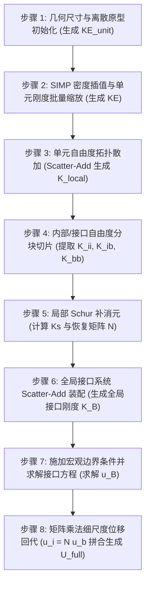

# 子结构有限元与静力缩聚理论体系

本文件作为 SOPTX 子结构分析与 PIML 代理模型的**数学与理论事实源（Source of Truth）**，系统阐述弹性力学弱形式离散、Schur 补静力缩聚推导、刚体模态空间分解、无体力假设理论边界及 8 步通用算法逻辑。

---

## 1. 弹性力学弱形式与子结构划分

考虑线弹性结构连续区域 $\Omega \subset \mathbb{R}^d$（$d=2, 3$），边界 $\partial \Omega = \Gamma_D \cup \Gamma_N$ 满足 $\Gamma_D \cap \Gamma_N = \emptyset$。

将计算域剖分为 $M$ 个互不重叠的非重叠子结构（Subdomains）：
$$\Omega = \bigcup_{j=1}^M \Omega^j, \quad \Omega^j \cap \Omega^k = \emptyset \quad (\forall j \ne k)$$

定义子结构之间的公共接口（Interface / Skeleton）集合：
$$\Gamma_{\mathcal{B}} = \bigcup_{j < k} (\partial \Omega^j \cap \partial \Omega^k) \cup (\partial \Omega \cap \Gamma_N)$$

在第 $j$ 个子结构 $\Omega^j$ 上，线弹性力学虚功方程（弱形式）表述为：寻找位移场 $\mathbf{u}^j \in \mathcal{V}^j$，使得对任意测试函数 $\mathbf{v}^j \in \mathcal{V}_0^j$ 均满足：
$$a^j(\mathbf{u}^j, \mathbf{v}^j) = l^j(\mathbf{v}^j) + \int_{\partial \Omega^j \cap \Gamma_{\mathcal{B}}} \mathbf{t}^j \cdot \mathbf{v}^j \, \mathrm{d}s$$

其中双线性形式 $a^j(\cdot, \cdot)$ 与线性外载形式 $l^j(\cdot)$ 分别定义为：
$$a^j(\mathbf{u}^j, \mathbf{v}^j) = \int_{\Omega^j} \boldsymbol{\varepsilon}(\mathbf{v}^j) : \mathbb{C}(\rho^j) : \boldsymbol{\varepsilon}(\mathbf{u}^j) \, \mathrm{d}\Omega$$
$$l^j(\mathbf{v}^j) = \int_{\Omega^j} \mathbf{b} \cdot \mathbf{v}^j \, \mathrm{d}\Omega + \int_{\partial \Omega^j \cap \Gamma_N} \mathbf{g}_N \cdot \mathbf{v}^j \, \mathrm{d}s$$

$\mathbf{t}^j = \boldsymbol{\sigma}^j \cdot \mathbf{n}^j$ 为接口上的相互作用面力（Tractions）。

---

## 2. Schur 补静力缩聚的严谨数学推导

引入有限元多项式基函数离散后，第 $j$ 个子结构的自由度被自然划分为两组互斥集合：
* **内部自由度（Interior DOFs，下标 $i$）**：几何位置完全位于 $\Omega^j$ 内部，不与其他任何子结构共享；
* **接口边界自由度（Boundary DOFs，下标 $b$）**：位于子结构外表面 $\partial \Omega^j$，与其他子结构或外边界相连。

离散后的局部子结构有限元代数方程呈 $2 \times 2$ 分块形式：
$$
\begin{bmatrix}
\mathbf{K}_{ii}^j & \mathbf{K}_{ib}^j \\
\mathbf{K}_{bi}^j & \mathbf{K}_{bb}^j
\end{bmatrix}
\begin{bmatrix}
\mathbf{u}_i^j \\ \mathbf{u}_b^j
\end{bmatrix}
=
\begin{bmatrix}
\mathbf{f}_i^j \\ \mathbf{f}_b^j + \boldsymbol{\lambda}^j
\end{bmatrix}
$$
其中 $\boldsymbol{\lambda}^j$ 为接口上的离散 Lagrange 相互作用反力。

### 2.1 内部自由度消元与多尺度形函数矩阵
由第一行方程，内部自由度满足局部平衡关系：
$$\mathbf{K}_{ii}^j \mathbf{u}_i^j + \mathbf{K}_{ib}^j \mathbf{u}_b^j = \mathbf{f}_i^j$$

由于内部自由度约束了所有边界位移（Dirichlet 条件），内部刚度矩阵 $\mathbf{K}_{ii}^j$ 是严格**对称正定（SPD）且可逆**的。两端左乘 $(\mathbf{K}_{ii}^j)^{-1}$ 得内部位移显式解：
$$\mathbf{u}_i^j = (\mathbf{K}_{ii}^j)^{-1} \mathbf{f}_i^j - (\mathbf{K}_{ii}^j)^{-1} \mathbf{K}_{ib}^j \mathbf{u}_b^j$$

定义**多尺度形函数矩阵（Multiscale Shape Functions）** $\mathbf{N}^j \in \mathbb{R}^{n_i \times n_b}$：
$$\mathbf{N}^j \triangleq - (\mathbf{K}_{ii}^j)^{-1} \mathbf{K}_{ib}^j$$

在无内部外载（$\mathbf{f}_i^j = \mathbf{0}$）下，内部位移与接口位移严格满足线性齐次映射：
$$\mathbf{u}_i^j = \mathbf{N}^j \mathbf{u}_b^j$$

### 2.2 Schur 补缩聚刚度矩阵
将 $\mathbf{u}_i^j$ 代入第二行分块平衡方程：
$$\mathbf{K}_{bi}^j \left( \mathbf{N}^j \mathbf{u}_b^j + (\mathbf{K}_{ii}^j)^{-1} \mathbf{f}_i^j \right) + \mathbf{K}_{bb}^j \mathbf{u}_b^j = \mathbf{f}_b^j + \boldsymbol{\lambda}^j$$

整理合并同类项，得到仅关于接口位移 $\mathbf{u}_b^j$ 的缩聚平衡方程：
$$\mathbf{K}_s^j \mathbf{u}_b^j = \tilde{\mathbf{f}}_b^j + \boldsymbol{\lambda}^j$$

其中 **Schur 补缩聚刚度矩阵（Condensed Stiffness Matrix）** $\mathbf{K}_s^j \in \mathbb{R}^{n_b \times n_b}$ 与 **等效缩聚载荷向量** $\tilde{\mathbf{f}}_b^j \in \mathbb{R}^{n_b}$ 定义为：
$$\mathbf{K}_s^j \triangleq \mathbf{K}_{bb}^j - \mathbf{K}_{bi}^j (\mathbf{K}_{ii}^j)^{-1} \mathbf{K}_{ib}^j = \mathbf{K}_{bb}^j + \mathbf{K}_{bi}^j \mathbf{N}^j$$
$$\tilde{\mathbf{f}}_b^j \triangleq \mathbf{f}_b^j - \mathbf{K}_{bi}^j (\mathbf{K}_{ii}^j)^{-1} \mathbf{f}_i^j = \mathbf{f}_b^j + (\mathbf{N}^j)^{\mathsf{T}} \mathbf{f}_i^j$$

### 2.3 能量二次型与变分等价性
定义扩展形函数算子 $\tilde{\mathbf{N}}^j = \begin{bmatrix} \mathbf{N}^j \\ \mathbf{I}_{n_b} \end{bmatrix}$，使得全场位移表达为 $\mathbf{u}^j = \tilde{\mathbf{N}}^j \mathbf{u}_b^j$。子结构的总应变能满足严格能量守恒：
$$\mathcal{E}^j = \frac{1}{2} (\mathbf{u}^j)^{\mathsf{T}} \mathbf{K}^j \mathbf{u}^j = \frac{1}{2} (\mathbf{u}_b^j)^{\mathsf{T}} \left( (\tilde{\mathbf{N}}^j)^{\mathsf{T}} \mathbf{K}^j \tilde{\mathbf{N}}^j \right) \mathbf{u}_b^j = \frac{1}{2} (\mathbf{u}_b^j)^{\mathsf{T}} \mathbf{K}_s^j \mathbf{u}_b^j$$

这证明了：**Schur 补刚度矩阵 $\mathbf{K}_s^j$ 恰为全局位移在由列向量 $\mathbf{N}^j$ 张成的 Ritz 能量极小化子空间上的变分投影**。

---

## 3. 刚体模态 $\mathbf{R}_{\text{rigid}}$ 与变形正交补 $\mathbf{R}_\perp$ 空间分解

### 3.1 自由漂浮子结构的秩亏（Rank Deficiency）本质
未施加宏观外边界位移约束的单个子结构 $\Omega^j$ 处于自由漂浮状态。由于弹性力学本构满足平移与转动伽利略不变性，子结构总刚度矩阵具有零空间（Null Space）：
$$\operatorname{null}(\mathbf{K}^j) = \operatorname{span}\{\mathbf{R}_{\text{rigid}}^j\}$$
刚体模态数 $n_{\text{rigid}} = \frac{d(d+1)}{2}$（2D 为 3 维：2 平动 + 1 转动；3D 为 6 维：3 平动 + 3 转动）。

**重要定理**：Schur 补缩聚算子精确保持刚体零空间不变，即：
$$\mathbf{K}_s^j \mathbf{R}_{b,\text{rigid}} = \mathbf{0}_{n_b \times n_{\text{rigid}}}$$
且位移恢复算子精确重构刚体模态：
$$\mathbf{N}^j \mathbf{R}_{b,\text{rigid}} = \mathbf{R}_{i,\text{rigid}}$$

### 3.2 空间正交补分解与物理对称正定性
利用标准正交 QR 分解，将接口自由度空间 $\mathbb{R}^{n_b}$ 正交分解为刚体运动子空间 $\mathcal{V}_{\text{rigid}}$ 与纯弹性变形子空间 $\mathcal{V}_{\text{deform}}$：
$$\mathbb{R}^{n_b} = \operatorname{range}(\mathbf{R}_{\text{rigid}}) \oplus \operatorname{range}(\mathbf{R}_\perp), \quad \mathbf{R}_{\text{rigid}}^{\mathsf{T}} \mathbf{R}_\perp = \mathbf{0}$$

将 $\mathbf{K}_s^j$ 限制在变形子空间上，所得限制刚度矩阵 $\mathbf{K}_{s,\perp}^j$ 具有**严格的对称正定性（SPD）**：
$$\mathbf{K}_{s,\perp}^j \triangleq \mathbf{R}_\perp^{\mathsf{T}} \mathbf{K}_s^j \mathbf{R}_\perp \succ 0$$

### 3.3 Cholesky 物理正定参数化（面向 PIML 代理模型）
利用上述构造性质，任何物理自洽的子结构缩聚刚度矩阵均可显式分解为：
$$\mathbf{K}_s^j = \mathbf{R}_\perp \mathbf{L}^j (\mathbf{L}^j)^{\mathsf{T}} \mathbf{R}_\perp^{\mathsf{T}}$$
其中 $\mathbf{L}^j \in \mathbb{R}^{(n_b - n_{\text{rigid}}) \times (n_b - n_{\text{rigid}})}$ 为下三角 Cholesky 因子。此分解从数学构造上消除了刚体伪刚度污染，保证了 PIML 代理刚度在刚体模态方向零能量响应、在变形模态方向绝对正定。

---

## 4. 无体力假设（$f_i = \mathbf{0}$）的理论等价性证明与适用边界

### 4.1 建模假设
在经典拓扑优化及 Huang 2023 中，均采用无内部载荷的标准建模假设：
$$\mathbf{f}_i^j \equiv \mathbf{0} \quad (\forall j=1,\dots,M)$$

### 4.2 数学等价性与误差无损证明
当外载荷仅由边界载荷（集中力、面力）构成时，荷载仅作用于全局接口自由度 $\Gamma_{\mathcal{B}}$ 上。
此时：
1. **缩聚荷载无损退化**：$\tilde{\mathbf{f}}_b^j = \mathbf{f}_b^j + (\mathbf{N}^j)^{\mathsf{T}} \mathbf{0} = \mathbf{f}_b^j$，无需进行载荷缩聚积分；
2. **细尺度恢复无损退化**：$\mathbf{u}_i^j = \mathbf{N}^j \mathbf{u}_b^j + (\mathbf{K}_{ii}^j)^{-1} \mathbf{0} = \mathbf{N}^j \mathbf{u}_b^j$，内部位移完全由接口位移线性表征；
3. **求解精度**：缩聚解 $\mathbf{U}_{\text{cond}}$ 与全尺度单网格 Lagrange 全装配解 $\mathbf{U}_{\text{full}}$ 在代数意义上**完全等价（浮点数机器精度 $10^{-12} \sim 10^{-13}$）**。

### 4.3 适用边界与扩展形式
* **适用问题**：MBB 梁、悬臂梁、L 型支架、微结构单胞均质化等外载作用于边界的经典力学问题；
* **非适用问题与广义扩展**：若物理问题包含显著体力场（如自重、离心力、热应变、电磁力等，此时 $\mathbf{f}_i \ne \mathbf{0}$），必须采用含载荷项的广义 Schur 补形式：
  $$\tilde{\mathbf{f}}_b^j = \mathbf{f}_b^j - \mathbf{K}_{bi}^j (\mathbf{K}_{ii}^j)^{-1} \mathbf{f}_i^j, \quad \mathbf{u}_i^j = \mathbf{N}^j \mathbf{u}_b^j + (\mathbf{K}_{ii}^j)^{-1} \mathbf{f}_i^j$$

---

## 5. 八步通用算法逻辑与伪代码

### 5.1 算法架构流程图



### 5.2 语言无关算法伪代码

```text
Algorithm: SubstructuralStaticCondensation
--------------------------------------------------------------------------------
Input:
  - 求解域尺寸 L, 宏观子结构划分 n_sub, 局部细网格划分 n_fine, 材料参数 (E, nu)
  - 单元密度分布场 rho (形状: [B, NC])
  - 宏观外载向量 F_global, Dirichlet 约束自由度 fixed_dofs
Output:
  - 全场位移向量 U_full

[阶段一: 局部子结构刚度提取]
1. KE_unit = IntegrateUnitElementStiffness(n_fine, E, nu)   // 步骤 1: 模板积分
2. for j = 1 to B in parallel:
3.    coef_j = (rho_min + (1 - rho_min) * (rho_j)^p)
4.    KE_j = coef_j * KE_unit                               // 步骤 2: SIMP 缩放
5.    K_local_j = ScatterAdd(KE_j, cell2dof)                // 步骤 3: 局部组装
6.    K_ii_j, K_ib_j, K_bb_j = Slice(K_local_j, i_dofs, b_dofs) // 步骤 4: 分块切片

[阶段二: 局部 Schur 补静力缩聚]
7. for j = 1 to B in parallel:
8.    invK_ii_K_ib = SolveLinear(K_ii_j, K_ib_j)            // 局部 Dirichlet 问题
9.    N_j = - invK_ii_K_ib                                  // 多尺度恢复矩阵
10.   Ks_j = K_bb_j - (K_ib_j)^T * invK_ii_K_ib             // 步骤 5: Schur 补刚度

[阶段三: 全局接口系统装配与求解]
11. K_global = ZeroSparseMatrix(n_interface, n_interface)
12. for j = 1 to B:
13.   L_j = GetInterfaceMapping(j)
14.   K_global += (L_j)^T * Ks_j * L_j                      // 步骤 6: 全局接口装配
15. F_interface = ProjectToInterface(F_global)
16. fixed_interface = ProjectToInterface(fixed_dofs)
17. u_interface = SolveConstrainedLinear(K_global, F_interface, fixed_interface) // 步骤 7: 接口求解

[阶段四: 细尺度位移恢复]
18. U_full = ZeroVector(total_global_dofs)
19. U_full[interface_dofs] = u_interface
20. for j = 1 to B in parallel:
21.   u_b_j = u_interface[L_j]
22.   u_i_j = N_j * u_b_j                                   // 步骤 8: 细尺度回代
23.   U_full[interior_dofs_j] = u_i_j

24. return U_full
--------------------------------------------------------------------------------
```
