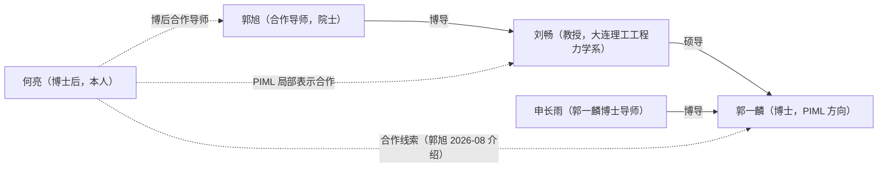

# 科研讨论对象人物关系

> 以何亮为参照的科研讨论对象（导师与合作者）之间的师门链与合作背景。师门链事实由本人 2026-08-06 提供，标注"待核验"；逐字沟通与关系状态以沟通仓库为准，本页只维护可长期复用的关系事实。

## 关系图

## 人物表

| 人物 | 身份 | 与本人的关系 | 实体主页 |
|---|---|---|---|
| 郭旭 | 中国科学院院士，MMC/MMV 显式拓扑优化与 PIML 主导者 | 合作导师（博士后阶段） | [[guo-xu/guo-xu\|郭旭]] |
| 刘畅 | 大连理工大学工程力学系教授，AI 赋能结构分析优化 | PIML 局部表示线合作（模型选型讨论） | [[liu-chang/liu-chang\|刘畅]] |
| 郭一麟 | 博士，PIML 方向（`xuProblemindependentMachineLearning2025` 作者之一） | 合作线索（2026-08 郭旭介绍，PIML × GPU 加速） | [[guo-yilin/guo-yilin\|郭一麟]] |

## 师门链

| 关系 | 已知事实 | 来源 / 状态 |
|---|---|---|
| 郭旭 → 刘畅 | 郭旭是刘畅的博士导师 | 本人 2026-08-06 提供，待核验 |
| 刘畅 → 郭一麟 | 刘畅是郭一麟的硕士导师 | 本人 2026-08-06 提供，待核验 |
| 申长雨 → 郭一麟 | 申长雨是郭一麟的博士导师 | 本人 2026-08-06 提供，待核验 |

师门链的意义：郭一麟经刘畅与郭旭同属一条学术传承链，这解释了郭旭老师介绍该合作线索的师门背景；与其交流时可按"师门内合作"的语境理解关系，但不把待核验的关系写进对外材料。

## 待确认项

- [ ] 三条师门链关系经本人/对方核验（核验后移除"待核验"标注）
- [ ] 郭旭与刘畅在核心项目中的实际分工边界（三条推进线总领 vs PIML 局部表示线模型选型）
- [ ] 申长雨的公开身份信息（如需建实体页 [[shen-changyu|申长雨（待建）]]）

## 关联文档

- [[_index|实体总索引]] — 实体与讨论对象入口。
- [[guo-xu/guo-xu|郭旭实体主页]]、[[liu-chang/liu-chang|刘畅实体主页]]、[[guo-yilin/guo-yilin|郭一麟实体主页]] — 各实体主页。
