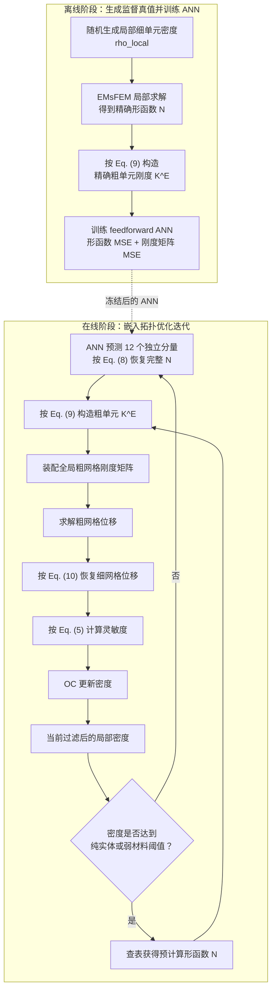

# Problem-independent machine learning (PIML)-based topology optimization—A universal approach

> **引用**：Huang, Mengcheng; Du, Zongliang; Liu, Chang; Zheng, Yonggang; Cui, Tianchen; Mei, Yue; Li, Xiao; Zhang, Xiaoyu; Guo, Xu. *Extreme Mechanics Letters*, 2022. [DOI](https://doi.org/10.1016/j.eml.2022.101887) | [Zotero Link](zotero://select/library/items/DLAYSQ5H)
> **完整中文译文**：[[../translations/Huang2022-problemindependentmachine-zh]]
> **Zotero/Better BibTeX key**：`huangProblemindependentMachineLearning2022`

## 一句话概括

在 EMsFEM 框架下，离线训练神经网络学习粗分辨率单元形函数与局部材料密度之间的映射；在同类 PDE、相同有限元离散与材料模型设定下，该模型可不依赖具体设计域、边界条件和外载荷，显著降低大规模拓扑优化中有限元分析的计算开销。

## 研究问题

拓扑优化的主要计算瓶颈是每轮迭代的有限元分析（FEA）。已有 ML 加速方法存在三个缺陷：
1. 训练数据依赖特定边界条件/载荷，**非真正问题无关**
2. 局部依赖假设的理论合理性存疑
3. 粗分辨率单元尺寸受限，加速比有限

本文目标：以统一方式解决上述三个问题。

## 方法

### 核心思路

将 EMsFEM（扩展多尺度有限元法）引入拓扑优化框架，并用离线训练的神经网络替代每步迭代中耗时的形函数在线构造。

### 方法流程与关键对象

### 物理先验与网络架构

* **PIML 的"问题无关性"来源**：所学习的 EMsFEM 形函数本质上是底层控制 PDE 对应 Green 函数的离散版本；在同类 PDE、相同单元类型和材料模型下，它与宏观边界条件、设计域、外载荷无关，仅由粗单元内部局部材料密度决定。
* **拓扑优化问题设置（SIMP + 密度过滤）**：
  $$
  \min_{\boldsymbol{\rho},\boldsymbol{U}}\ C = \boldsymbol{U}^T\boldsymbol{K}\boldsymbol{U},\quad \text{s.t.}\ \boldsymbol{K}\boldsymbol{U}=\boldsymbol{F},\ V/V_0 \leq f,\ 0\leq\rho_e\leq 1
  $$
  材料插值：$E_e(\rho_e)=E_{\min}+\rho_e^p(E_0-E_{\min})$，惩罚参数 $p=3$。
  密度过滤：$\tilde{\rho}_e = \frac{\sum_{i\in N_e}H_{ei}\rho_i}{\sum_{i\in N_e}H_{ei}}$，$H_{ei}=\max(0,r_{\min}-d(i,e))$
* **EMsFEM 框架**：两级网格（粗/细）。多尺度形函数 $N_{ixx}^l, N_{ixy}^l, N_{iyx}^l, N_{iyy}^l$ 将粗节点位移映射到细网格节点位移：
  $$
  \boldsymbol{K}^E = \sum_{f=1}^{m} (\boldsymbol{N}_f)^T \boldsymbol{k}^f \boldsymbol{N}_f
  $$
  满足分区单位分解条件。
* **ANN 构造与训练**：
  - **输入**：粗单元内 $m$ 个细单元的密度值（$m=25$ 或 $m=100$）
  - **输出**：由式 (8) 约束后的 12 个独立形函数分量在粗单元内部节点上的值；论文报告 $m=25$ 与 $m=100$ 时实际输出维数分别为 192 和 972
  - **训练样本输入**：随机生成局部密度，无需求解任何拓扑优化问题
  - **监督标签**：仍需通过局部 EMsFEM 计算精确形函数，并由此获得精确刚度矩阵
  - **损失函数**：预测形函数与精确形函数的 MSE + **由预测形函数计算得到的刚度矩阵与精确刚度矩阵的 MSE**；后者是用于提高下游刚度精度的软约束，不构成结构性质的硬保证
  - **网络结构**（$m=100$）：11 个隐层，激活函数采用 `tanh/elu`，宽度为 100→120→140→160→180→200→180→160→140→120→100
  - **优化器**：Adam，学习率 0.001

### 算法降维与加速来源

* **在线求解流程加速**：
  1. EMsFEM 将全局方程组维度从 $O(n)$ 降至 $O(n/L)$，求解复杂度从 $O(n^3)$ 降至 $O((n/L)^3)$。
  2. ANN 前向推断替代耗时的形函数在线构造。
  3. 引入密度阈值 $\bar{\rho}=0.95$，$\underline{\rho}=0.002$，纯实体/弱材料单元直接查表，跳过 ANN 推断。

预测形函数生成粗单元刚度后，论文继续组装全局粗网格刚度矩阵并求解粗网格位移；该流程降低了全局系统规模，但不是全局算子级 Matrix-Free。

## 实验 / 数值验证

### 算例规模与扩展性

* **MBB 梁（超大规模）**：正文将半设计域离散为 $2000\times1000$ 个粗单元、每粗单元含 $10\times10$ 个细单元，即半设计域 **2 亿个 fine-resolution elements**；摘要称为 2 亿 design variables。Table 4 显示后期代表迭代中的 ANN + EMsFEM 时间约为 108–120 秒，不能把“约 2 分钟”外推为所有迭代的统一耗时。
* **短悬臂梁与 L 型梁**：分别对不同尺度的细网格和粗/细比进行了验证。

### 精度与效率权衡

* 对比了不同粗/细比（如 $5\times5$ 和 $10\times10$）的刚度（柔顺度）精度与加速比。
* 刚度矩阵 MSE 作为软约束改善了论文算例中的下游刚度精度，但论文未给出对称性、正定性、刚体模态或能量关系的硬保证。

| 算例 | 细网格规模 | 粗/细比 | $C_{\text{ANN-EMs}}$ vs $C_{\text{EMs}}$ 相对误差 | 单步加速比 |
|------|-----------|---------|--------------------------------------------------|-----------|
| 短悬臂梁 | $3200\times1600$ | $5\times5$ | $3.00\times10^{-4}$ | ~4× |
| 短悬臂梁 | $3200\times1600$ | $10\times10$ | $8.72\times10^{-3}$ | ~4× |
| L 型梁 | $2000\times2000$ | $5\times5$ | $1.18\times10^{-3}$ | — |
| MBB 梁 | — | $5\times5$ | $5.21\times10^{-4}$ | ~3.3× |
| MBB 梁（超大规模） | 半设计域 **2 亿**细单元 | $10\times10$ | — | 后期代表迭代 ANN + EMsFEM 约 108–120 s；论文总结称 FEA 约降低两个数量级 |

## 证据边界与可复现性

### 模型选型证据卡

| 字段 | 论文事实 | 原文位置 | 证据边界 |
|---|---|---|---|
| 研究问题 | 在二维线弹性、体积约束柔顺度最小化的 SIMP 拓扑优化中，用 PIML 替代每轮 EMsFEM 形函数在线构造，以降低 FEA 成本。 | PDF p. 1 摘要；p. 2 §2；p. 5 Fig. 4 | 论文只验证二维平面应力算例；没有验证三维、非线性或多物理问题。 |
| 问题相关／问题无关边界 | 作者把 EMsFEM 形函数解释为控制 PDE 的离散 Green 函数，主张其只由当前粗单元内部材料分布决定，与宏观设计域、边界条件和外载荷无关；训练后用于同一 PDE 控制的不同拓扑优化问题。 | PDF pp. 1–2；p. 5 §4.2；p. 9 §7 | “问题无关”不等于跨 PDE、材料模型、单元类型或离散方式通用；实证范围是短悬臂梁、L 型梁和 MBB 梁。 |
| 学习对象 | 学习局部细单元密度到 EMsFEM 数值形函数节点值的映射 $\boldsymbol\rho_{\mathrm{local}}\mapsto\boldsymbol N$；网络不直接预测最终拓扑、全局位移或粗单元刚度。预测 $\boldsymbol N$ 随后通过式 (9) 构造 $\boldsymbol K^E$。 | PDF p. 3 Eq. (7)–(9)；p. 4 §4、Fig. 3 | $\boldsymbol K^E$ 是由预测形函数计算得到的下游量，不应把本文概括为直接学习 $\boldsymbol K^E$。 |
| 输入表示 | 一个粗单元内部 $m$ 个细单元的密度定长向量；分别训练 $m=5\times5=25$ 和 $m=10\times10=100$ 两个模型。 | PDF p. 4 Fig. 3、§4.2；p. 5 | 只覆盖规则四边形粗／细网格和固定分辨率；不是分辨率无关或非结构网格表示。 |
| 输出表示与维度 | 二维四节点粗单元共有 16 个形函数分量，利用式 (8) 只预测其中 12 个独立分量在粗单元内部节点上的值；论文报告 $m=25$ 与 $m=100$ 时网络输出维数分别为 192 和 972。 | PDF p. 3 Eq. (8)；p. 4 §4.1；p. 7 §6.2 | 输出维数随细网格尺度增长；论文未提供连续坐标查询或算子学习表示。 |
| 数据来源与监督真值 | 每个样本的局部密度在 $[0,1]$ 内随机生成，不从真实拓扑优化轨迹采集；真值输出为 EMsFEM 形函数，刚度软约束还需要精确粗单元刚度。 | PDF pp. 4–5 §4.2 | 样本输入生成不依赖全局拓扑优化，但监督标签仍需要局部 EMsFEM 计算，因此不是 data-free。 |
| 标签规模与成本 | 论文说明标签由局部 EMsFEM 真值产生，但未报告训练样本总量、train/validation/test 划分、标签生成时间或数据集存储规模。 | PDF pp. 4–5 §4.2；p. 9 Data availability | 无法从本文定量判断数据效率、标签成本或样本量与泛化能力的关系。 |
| 模型与网络架构 | 普通 feedforward ANN；$m=100$ 时 11 个隐层，宽度为 `[100,120,140,160,180,200,180,160,140,120,100]`，激活函数为给定 `tanh/elu` 序列；$m=25$ 使用相同激活序列和 `[50,60,70,80,90,100,90,80,70,60,50]`。 | PDF pp. 4–5 §4.1–§4.2 | 论文没有与 CNN、operator learning、经典回归或其他候选模型做同题比较，不能据此证明 ANN 最优。 |
| 训练信号与优化 | 损失由形函数输出 MSE 与预测形函数生成的刚度矩阵相对精确 EMsFEM 刚度矩阵的 MSE 两部分组成；TensorFlow 2 自动微分，Adam 学习率 0.001，其余参数使用默认值。 | PDF pp. 4–5 §4.2 | 论文未报告两项损失的权重、epoch、batch size、停止条件、训练时间、随机种子或重复训练统计。 |
| 物理约束方式 | 线性边界条件用于构造 EMsFEM 形函数；式 (8) 的分区单位／一致性关系用于由 12 个独立分量恢复其余分量，属于构造约束；刚度矩阵 MSE 是训练中的软约束。 | PDF p. 3 Eq. (8)；p. 4 Fig. 2；pp. 4–5 §4.1–§4.2 | 论文未分别报告对称性、正定／半正定性、刚体模态、能量一致性或结构检查失败率，不能写成硬保证。 |
| 下游求解接口 | 预测 $\boldsymbol N$ 后由式 (9) 构造粗单元 $\boldsymbol K^E$，装配全局粗网格刚度矩阵并求解粗网格位移，再按式 (10) 恢复细网格位移，按式 (5) 计算灵敏度并用 OC 更新密度。 | PDF p. 3 Eq. (9)；p. 4 Eq. (10)；p. 5 Fig. 4、§5 | 论文仍装配并求解全局粗网格矩阵，不是全局 Matrix-Free，也未报告 Krylov 或预条件行为。 |
| 局部评价指标 | 训练使用形函数 MSE 和粗单元刚度矩阵 MSE；正文用 $C_{\mathrm{ANN-EMs}}$ 与 $C_{\mathrm{EMs}}$ 的差异间接评价预测形函数进入结构分析后的效果。 | PDF pp. 4–5 §4.2；pp. 6–8 Table 1–3 | 论文未报告独立测试集上的形函数范数误差、刚度谱误差、最坏样本或分布外误差。 |
| 全局评价指标 | 比较优化拓扑、每步总时间 $t_{it}$、ANN-EMsFEM 柔顺度、精确 EMsFEM 柔顺度和细网格直接分析柔顺度；三个算例分别见 Table 1–3。 | PDF p. 6 Table 1；p. 7 Table 2；p. 8 Table 3 | 论文没有报告位移范数误差、真残差、灵敏度误差、优化历史差异或多随机训练统计。 |
| 部署与规模 | 全部算例在 Intel Xeon Gold 6256 3.60 GHz CPU、512 GB RAM 的个人工作站上运行；超大 MBB 的半设计域含 2 亿 fine-resolution elements。由 Table 4 可得第 1、10、22、383 次代表迭代的 ANN + EMsFEM 时间分别约为 1214.71、566.05、108.26 和 119.64 s。 | PDF p. 6 §6；p. 8 §6.3；p. 9 Table 4、Fig. 9 | 论文未报告 GPU 或 MPI 使用；并行只作为未来可采用方向。摘要的“2 亿 design variables”与正文“半设计域 2 亿 fine-resolution elements”应分别保留，不混为统一自由度口径。 |
| 作者给出的模型选择依据 | 作者用普通 feedforward ANN 作为初步实现并强调无需特殊架构也能得到有效结果；同时指出 $m=100$ 的 972 维输出比 $m=25$ 的 192 维输出更易发生误差累积，并将 CNN 等更先进架构列为后续方向。 | PDF p. 4 §4.1；p. 7 §6.2；p. 9 §7 | 这是可行性选择与后续判断，不是经过统一 benchmark 得出的模型优劣结论。 |
| 论文不能支持的结论 | 本文不能证明 ANN 是最佳模型，也不能证明刚度结构被严格保持、模型跨 PDE／离散通用、训练数据高效、全局 Matrix-Free 已实现，或 GPU/MPI 扩展性已经验证。 | 综合 PDF pp. 3–9 | 这些均应作为后续验证问题，不能由局部 MSE、三个算例或作者展望外推。 |

## 主要结论

- 作者主张 PIML 模型一次训练后，可无修改地用于同类 PDE、相同离散／材料模型下不同载荷和边界条件的拓扑优化问题
- 作者将形函数的**理论局部决定性**作为问题无关性的依据；本文实证范围限于三个二维线弹性算例
- 训练样本输入仅需随机密度场，不依赖任何预先求解的拓扑优化结果；但形函数和刚度矩阵监督标签仍需局部 EMsFEM 真值计算
- 论文总结称 FEA 时间可降低约两个数量级；摘要称 2 亿 design variables，正文算例口径为半设计域 2 亿 fine-resolution elements，均基于个人工作站验证

## 批判性评价

### 概念定位：在机器学习与 PIML 谱系中的位置

依据 [[../../../concepts/ml-roles-and-boundaries]] 和 [[../../../concepts/piml/method-lineage]]，本文的概念定位可以压缩为：

- **模型与学习对象**：普通 feedforward ANN 学习局部细单元密度到 EMsFEM 粗单元形函数的映射，任务对象是可进入全局粗网格分析的局部力学表示。
- **训练与物理角色**：随机局部密度作为输入，EMsFEM 真值提供监督；分区单位关系属于构造约束，刚度矩阵 MSE 属于软约束。
- **PIML 谱系位置**：本文是 Problem-Independent PIML 的起点，将学习对象从问题相关的最终设计转向可跨同类宏观边值问题复用的局部力学表示。

### 优点

- 在论文限定的同一 PDE、离散和材料模型内，可跨宏观设计域、边界条件与外载荷复用
- 样本生成不依赖全局拓扑优化问题，泛化样本构造成本较低
- 无缝嵌入标准 SIMP 流程，改动最小
- 刚度矩阵 MSE 为与下游 FEA 对齐的软约束，论文算例显示其能够改善刚度相关精度，但未建立结构性质的硬保证

### 局限

- EMsFEM 采用线性边界条件，可能引入误差（可用 oversampling 改进）
- 普通全连接网络，$m=100$ 时输出维度大（972），误差略高于 $m=25$
- 设计变量更新（OC）仍占 >85% 总时间，未解决优化器瓶颈

## 对我研究的启发

### 可复用思路

- **与 MMC 结合**：论文本身已指出，将 PIML 置于 MMC 框架可进一步降低设计变量数量 1~2 个数量级，同时消除 OC 更新瓶颈——这是明确的后续方向
- **双模量扩展**：EMsFEM 形函数学习目前仅针对线弹性 PDE；若底层本构为双模量非光滑材料，需结合 PVP 变分底座改造损失函数（见 [[Guo2014-bimodulus-variational]]）
- **Data-free 改进**：本文仍是监督学习框架，形函数 MSE 与刚度矩阵 MSE 都依赖局部 EMsFEM/FEA 真值标签；后续 data-free PIML 工作将监督标签替换为最小势能原理，可进一步消除标注依赖

## 相关文献与页面

- [[../../../concepts/piml/_index]] — PIML 稳定知识、当前研究与文献证据的统一语义入口。
- [[Guo2022-MMC-review]] — MMC/MMV 综述，PIML 与显式优化结合的宏观背景
- [[Huang2023-PIML-substructure]] — 本文的子结构扩展，引入力学先验约束
- [[Guo2023-PIML-data-free]] — data-free 版本，用最小势能原理替代监督学习
- [[Guo2025-PIML-parallel]] — 128 亿变量并行扩展

## 附注

### Zotero 标注与高亮

<%~ include("annots", it.annotations) %>
