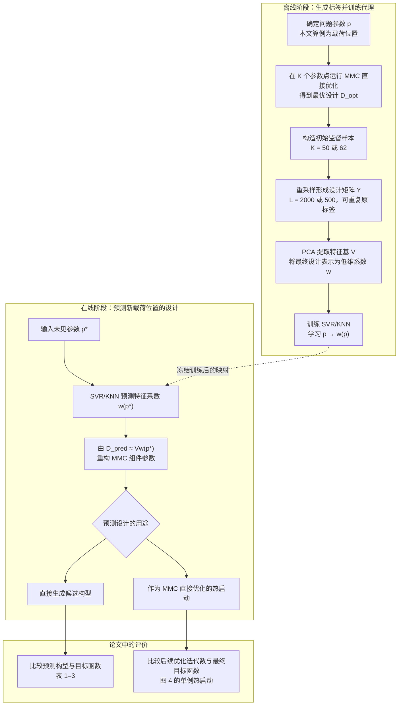

# Machine Learning-Driven Real-Time Topology Optimization Under Moving Morphable Component-Based Framework

> **引用**：Lei, Xin; Liu, Chang; Du, Zongliang; Zhang, Weisheng; Guo, Xu. *Journal of Applied Mechanics*, 86(1): 011004, 2019；在线发表于 2018-10-05。[DOI](https://doi.org/10.1115/1.4041319) | [Zotero Link](zotero://select/library/items/FFDWEI2C)
> **完整中文译文**：[[../translations/Lei2018-machinelearningdriven-zh]]
> **Zotero/Better BibTeX key**：`Lei2018-machinelearningdriven`

## 一句话概括

本文在固定设计域和边界条件下，用 PCA 与 SVR/KNN 学习载荷位置到 MMC 组件参数的低维映射，从而直接预测拓扑或提供优化热启动；“实时”属于定性主张，论文没有报告推断时间。

## 研究问题

传统拓扑优化需要反复进行有限元分析和灵敏度计算，难以直接满足快速响应需求。若让机器学习模型逐单元预测 SIMP 密度，输出维数还会随网格规模增长。本文研究的问题是：能否利用 MMC 的显式参数化，把高维材料分布改写为有限个组件几何变量，并直接学习问题参数到最终优化设计之间的映射。

## 方法

### 问题设置与关键假设

- **问题参数／回归输入**：原文第 3 节将问题参数一般定义为 $\boldsymbol p=(p_1,\ldots,p_{n_p})^{\mathrm T}$，理论上可描述载荷、边界条件和设计域几何等外部问题设置。本文第 4 节的数值算例只改变单位竖向集中载荷的作用位置：一维算例取 $\boldsymbol p=y_f$，二维算例取 $\boldsymbol p=(x_f,y_f)^{\mathrm T}$。这里的 $\boldsymbol p$ 是载荷位置参数，不是载荷向量 $\boldsymbol f$，也不是 MMC 设计变量。参见[[../translations/Lei2018-machinelearningdriven-zh#3 MMC 求解框架下的机器学习模型|原文第 3 节对应译文]]和[[../translations/Lei2018-machinelearningdriven-zh#4 数值算例|原文第 4 节对应译文]]。
- **设计表示**：每个二维 MMC 用中心位置、半长、三个端部/中部半宽和倾角共 7 个变量描述。算例固定使用 16 个组件，共 112 个设计变量。
- **监督标签**：在预先指定的载荷位置逐点运行 MMC 直接优化，以收敛设计变量作为标签。
- **回归对象**：SVR/KNN 学习从问题参数 $\boldsymbol p$ 到 PCA 系数 $\boldsymbol w(\boldsymbol p)$ 的映射，再通过特征基 $\boldsymbol V$ 重构 MMC 最终设计变量 $\boldsymbol D^{\mathrm{opt}}$；对应原文式 (3.1)–(3.4)。

### 方法流程与关键对象

离线阶段完成直接优化、重采样、特征提取以及 SVR/KNN 训练；在线阶段输入新的载荷位置，回归得到特征系数并恢复组件参数。预测构型既可以直接显示，也可以作为 MMC 直接优化的初始设计。

### 关键数学关系

方法的核心降维关系可写为

$$
\boldsymbol D^{\mathrm{opt}}(\boldsymbol p)
\approx
\boldsymbol V\boldsymbol w(\boldsymbol p)
=
\sum_{i=1}^{M}w_i(\boldsymbol p)\boldsymbol v_i.
$$

其中 $\boldsymbol V=(\boldsymbol v_1,\ldots,\boldsymbol v_M)$ 为从直接优化设计矩阵中提取的特征基，$M\ll112$；$\boldsymbol w(\boldsymbol p)$ 由 SVR 或 KNN 预测。完整定义及原文式 (3.1)–(3.4) 见 [[../translations/Lei2018-machinelearningdriven-zh#3 MMC 求解框架下的机器学习模型]]。

## 实验 / 数值验证

两个算例均采用尺寸 $2\times1$、离散为 $200\times100$ 网格的短悬臂梁和 16 个 MMC。

| 算例 / 数据 | 变化参数与规模 | 方法设置 | 指标 / 对比 | 主要结果 |
|---|---|---|---|---|
| 一维载荷位置 | $y_f\in[0,1]$；50 次直接优化，$y_f=0.01,0.03,\ldots,0.99$ | 重采样规模 $L=2000$；比较 $M=10,20,30$；SVR 与 KNN | 预测构型与目标函数；不同回归器和特征维数 | 较大的 $M$ 通常能保留更多直接优化构型特征 |
| 二维载荷位置 | $11\times6=66$ 个规则点中留出 4 个测试点，实际训练标签为 62 个 | 重采样规模 $L=500$；$M=20$；SVR | 4 个未参与训练的位置 | 预测构型保留多数显著结构特征，但目标函数并非处处与直接优化一致 |
| 单例热启动 | 二维算例中的一个载荷位置 | 以 SVR 预测设计作为 MMC 直接优化初值 | 迭代次数与最终目标函数 | 迭代次数由 298 降至 23；目标函数由直接优化的 74.61 变为热启动优化的 75.29 |

## 证据边界与可复现性

### 模型选型证据卡

| 字段 | 论文事实 | 原文位置 | 证据边界 |
|---|---|---|---|
| 研究问题 | 在 MMC 显式拓扑优化框架下，学习外部问题参数到最终优化设计的映射，以直接生成候选构型或为直接优化提供热启动。 | 原文 §1–§3 | 论文研究的是固定问题族中的最终设计代理，不是局部力学算子或迭代求解器代理。 |
| 问题相关／问题无关边界 | 论文一般地允许问题参数描述载荷、边界条件和设计域几何；实际算例固定设计域、边界条件、材料和 MMC 参数化，只改变单位竖向集中载荷的位置。 | 原文 §2–§3；§4、Fig. 3；§5 | 数值证据只能支持给定设置内的载荷位置变化，不能外推为跨设计域、边界条件、参数化或 PDE 的 Problem-Independent 模型。 |
| 学习对象 | 任务级对象是收敛后的 MMC 最终设计 $\boldsymbol D^{\mathrm{opt}}$；实际回归对象是其 PCA 系数 $\boldsymbol w(\boldsymbol p)$，再由特征基 $\boldsymbol V$ 重构设计。 | 原文 §2–§3；Eq. (3.1)–(3.4) | SVR/KNN 不直接预测单元密度、有限元位移、形函数或刚度矩阵。 |
| 输入表示 | 一般输入为低维问题参数 $\boldsymbol p$；一维算例取 $p=y_f$，二维算例取 $\boldsymbol p=(x_f,y_f)^{\mathrm T}$，均表示载荷位置。 | 原文 §2–§3；§4、Fig. 3 | $\boldsymbol p$ 不是载荷向量 $\boldsymbol f$；论文未验证高维场输入。 |
| 输出表示与维度 | 每个二维 MMC 由 7 个几何变量描述，算例固定 16 个组件，因此完整设计向量为 112 维；PCA 后用 $M=10,20,30$ 或 $M=20$ 个系数表示。 | 原文 §2；§3 Eq. (3.1)–(3.3)；§4、Table 1–3 | 输出维数与背景网格分辨率解耦，但依赖固定组件数量、排序和初始对应；论文未处理组件置换、重叠或退化造成的表示非唯一性。 |
| 数据来源与监督真值 | 监督标签来自预先指定载荷位置上的 MMC 直接优化收敛设计；一维和二维算例分别由 50 和 62 个独立直接优化结果构成。 | 原文 §3 Eq. (3.4)；§4、Table 1–3 | 标签是特定初始化和优化过程得到的局部优化结果，不代表给定载荷位置存在唯一全局最优设计。 |
| 标签规模与成本 | 一维算例的独立直接优化标签数为 50、重采样规模 $L=2000$；二维算例从 $11\times6=66$ 个规则点中留出 4 个测试点，独立训练标签数为 62、重采样规模 $L=500$。原文允许重采样后的参数向量重复。 | 原文 §3 Eq. (3.4)；§4、Table 3 | $L=2000/500$ 不是新增独立直接优化标签；论文未报告标签生成墙钟时间或数据集存储规模。 |
| 模型与网络架构 | 先按 Eq. (3.1)–(3.3) 提取 PCA 特征基，再用 SVR 或 KNN 学习 $\boldsymbol p\mapsto\boldsymbol w(\boldsymbol p)$；本文没有使用神经网络。 | 原文 §3；§4、Table 1–3 | 论文没有与统一调参后的神经网络或其他回归器做同题比较，不能据此证明 SVR/KNN 普遍更优。 |
| 训练信号与优化 | 使用问题参数与直接优化设计的监督样本离线拟合 PCA 表示和非线性回归；论文说明训练在离线阶段完成。 | 原文 §3 Eq. (3.1)–(3.4) | 论文未报告 SVR/KNN 超参数、超参数选择、交叉验证、统一损失统计、训练随机性或停止条件。 |
| 物理约束方式 | 体积约束、平衡方程和优化条件通过 MMC 直接优化标签进入训练；预测结果还可作为直接优化初值重新满足优化流程。 | 原文 §2 Eq. (1.1)–(1.4)；§4、Fig. 4 | 回归模型本身没有 physics-informed loss 或显式硬约束，不能保证直接预测设计满足体积约束、平衡条件或最优性。 |
| 下游求解接口 | PCA 系数经特征基恢复为 MMC 组件参数，可直接形成候选构型并计算目标函数，也可作为 MMC 直接优化的初始设计。 | 原文 §3 Eq. (3.1)；§4、Table 1–3、Fig. 4 | 论文不替代候选设计上的有限元评价；热启动后仍需完整直接优化。 |
| 局部评价指标 | Table 1–3 展示预测与直接优化构型及其目标函数，但未单独报告 PCA 系数误差、设计向量重构误差或统一测试误差统计。 | 原文 §4、Table 1–3 | 仅凭构型图和少量目标函数不能量化表示误差、回归误差或最坏样本。 |
| 全局评价指标 | 比较预测构型的目标函数；Fig. 4 的单例热启动将迭代数由 298 降至 23，最终目标函数由 74.61 变为 75.29。 | 原文 §4、Table 1–3、Fig. 4 | 热启动只有一个案例，且两条路径最终目标函数不同，不能外推为平均收敛加速或等价最优性。 |
| 部署与规模 | 算例采用 $200\times100$ 有限元网格、16 个 MMC 和低维载荷位置输入；作者以“实时”描述在线预测目标。 | 原文 §1；§4、Fig. 3 | 论文未报告训练时间、推断时间、直接优化墙钟时间、硬件、内存、GPU、MPI 或端到端加速比，因此“实时”缺少定量部署证据。 |
| 作者给出的模型选择依据 | 作者用 MMC 将逐单元高维表示压缩为少量有物理意义的几何变量，再用 PCA 进一步降低回归输出维度，并采用 SVR/KNN 处理非线性映射。 | 原文 §1；§3 | 这是表示优先的可行性方案；论文没有统一 benchmark 能够分离表示、标签规模、回归器和超参数各自的贡献。 |
| 论文不能支持的结论 | 本文不能证明 SVR/KNN 是普遍最佳模型、重采样等价于新增标签、预测设计天然满足全部约束、端到端实时性能已经量化，或该模型可直接用于 Problem-Independent 局部力学对象。 | 综合原文 §2–§5 | 这些结论应留给后续独立复现和统一比较，不能从有限载荷位置算例与单例热启动外推。 |

## 主要结论

- 在固定问题设置下，可以学习“载荷位置 $\rightarrow$ 特征系数 $\rightarrow$ MMC 组件参数”的映射。
- MMC 显式参数化与 PCA 降维共同避免了直接预测高维单元密度场。
- 预测设计可用于构型生成或优化热启动；现有证据不足以定量证明实时性能和更广泛化。

## 批判性评价

### 概念定位：在机器学习与 PIML 谱系中的位置

依据 [[../../concepts/machine-learning]] 和 [[../../concepts/piml/ml-roles-and-boundaries]]，本文的概念定位可以压缩为：

- **模型与学习对象**：PCA 负责最终设计表示的降维，SVR/KNN 回归特征系数；统计回归目标是 PCA 系数，任务级预测对象是 MMC 最终设计。
- **训练与物理角色**：训练使用 MMC 直接优化产生的监督标签；物理和优化约束通过标签生成及可选的后续优化进入，而不是通过 physics-informed loss 进入。
- **PIML 谱系位置**：本文是问题相关的最终设计代理，不属于 Problem-Independent PIML；它为 Huang 2022 转向可跨宏观边值问题复用的局部力学表示提供对照前史。完整演进关系见 [[../../concepts/piml/method-lineage]]。

### 优点

- 学习对象是固定维数、物理含义明确的 MMC 几何参数，而不是随网格增长的像素或单元密度场。
- 降维、回归和直接优化之间的离线—在线边界清楚；预测设计还能作为后续物理优化的初值。

### 局限

- 固定数量且有序的组件向量限制了组件出生、消失、重编号和复杂拓扑变化的表达。
- 当前结果只能支持特定设置下的可行性；训练、计时、泛化和热启动证据的具体缺口见“证据边界与可复现性”。

## 对我研究的启发

### 可复用思路

- 用显式几何参数替代逐单元密度作为学习输出，可作为 MMC/MMV 代理模型和降阶设计空间的基础。
- 将代理预测定位为热启动而非最终可信解，可以保留物理优化和约束校验环节。
- 评价代理模型时，应同时报告独立直接优化标签成本、预测误差、后续校正迭代和最终目标函数。

## 相关文献与页面

- [[../translations/Lei2018-machinelearningdriven-zh]] — 经逐节确认的完整中文译文、公式、图表和译者脚注。
- [[../../concepts/machine-learning]] — 模型族与架构、学习对象、训练信号和任务目标的多维分类框架。
- [[../../concepts/pca-pod]] — PCA/POD 特征基、低维系数、中心化边界和数值门禁。
- [[../../concepts/mmc/_index]] — MMC 稳定知识、当前研究与文献证据的统一语义入口。
- [[../../concepts/mmc/mathematical-foundations]] — MMC、TDF、Ersatz、灵敏度与优化闭环的通用数学基础。
- [[../../concepts/piml/_index]] — PIML 稳定知识、当前研究与文献证据的统一语义入口；本文作为问题相关最终设计代理的前史。
- [[../../concepts/piml/ml-roles-and-boundaries]] — 将本文定位为问题相关的最终设计代理，并与 PINN、Problem-Independent PIML 比较。
- [[../../concepts/piml/method-lineage]] — Lei 2018/2019 在“直接预测最终设计—学习可复用局部算子”谱系中的位置。
- [[../../../research/technical-lines/piml-research-guide#5.3 Lei 2018/2019 条件性复现]] — 本文作为问题相关对照路径的条件性复现目标和验收条件。
- [[Huang2022-problemindependentmachine]] — 从问题相关最终设计预测转向 EMsFEM 局部形函数预测。

## 附注

### Zotero 标注与高亮
<%~ include("annots", it.annotations) %>
