# A new topology optimization approach based on moving morphable components (MMC) and the ersatz material model

## 完整中文译文

> 原笔记：[[../Zhang2016-MMC-topology]]
> Zotero 条目： zotero://select/library/items/QLN8ZLGS
> PDF 附件： zotero://open-pdf/library/items/QLN8ZLGS
> 说明： 本页用于放置 Zhang et al. 2016 论文的完整中文译稿。

---

# 0 元数据

* 论文：Zhang, Weisheng, et al. 2016, *Structural and Multidisciplinary Optimization*
* DOI： 10.1007/s00158-015-1372-3
* Better BibTeX key: `zhangNewTopologyOptimization2016`
* Zotero item key: `QLN8ZLGS`

# 摘要

本文提出了一种基于所谓“移动可变形组件”（Moving Morphable Components, MMC）求解框架的改进拓扑优化方法。与已有方法（如 Guo et al., 2014）相比，该方法克服了先前的几项弱点：它不仅允许组件具有可变的厚度，而且显著提高了数值求解效率。这主要是通过适当构造组件的拓扑描述函数（Topological description functions, TDF），以及通过投影组件的拓扑描述函数来利用替代材料（ersatz material）模型来实现的。数值算例证明了所提方法的有效性。为了帮助读者理解该方法的基本特征，本文还提供了一个包含 188 行代码的 Matlab 实现。

# 1 引言

自从 Bendsoe 和 Kikuchi (1988) 的开创性工作以来，旨在给定区域内寻找合适的材料分布以获得最优结构性能的拓扑优化，已经受到了广泛的研究关注。在已有文献中，人们提出了许多拓扑优化方法，如 SIMP (固体各向同性材料惩罚) 方法、水平集 (level set) 方法以及渐进优化方法。这些方法已成功应用于解决涉及结构、声学或光学性能的各类拓扑设计问题。

大多数现有方法实际上是以**隐式 (implicit)** 的方式进行拓扑优化的。这意味着最优结构拓扑要么是从黑白像素图像中识别出来的（在 SIMP 方法中），要么是从定义在给定设计域中的拓扑描述函数 (TDF) 的水平集中识别出来的（在水平集方法中）。隐式方法存在以下潜在问题：首先，很难对结构特征尺寸（从制造角度来看非常重要）进行精确控制。这是因为隐式优化模型中没有嵌入显式的几何信息，必须开发特殊的技术才能实现完整的特征尺寸控制。同时，隐式框架下难以在优化模型和 CAD 建模系统之间建立直接联系。其次，隐式拓扑优化涉及的设计变量数量相对较大，分辨率越高变量越多。第三，在隐式方法中，分析模型和优化模型总是强耦合的，有时会导致严重的数值问题（例如棋盘格图案、虚假的局部振动/屈曲模式）。

为了以一种更加**显式 (explicit) 和几何化**的方式进行拓扑优化，Guo 等 (2014a) 建立了一种所谓基于移动可变形组件 (MMC) 的拓扑优化框架，该框架与现有框架截然不同。该方法的显著特点是，将一组可变形组件用作拓扑优化的构建块，通过优化这些组件的形状、长度、厚度、方向和布局（连通性）来寻找最优的结构拓扑。图 1 示意性地说明了该方法的基本思想。

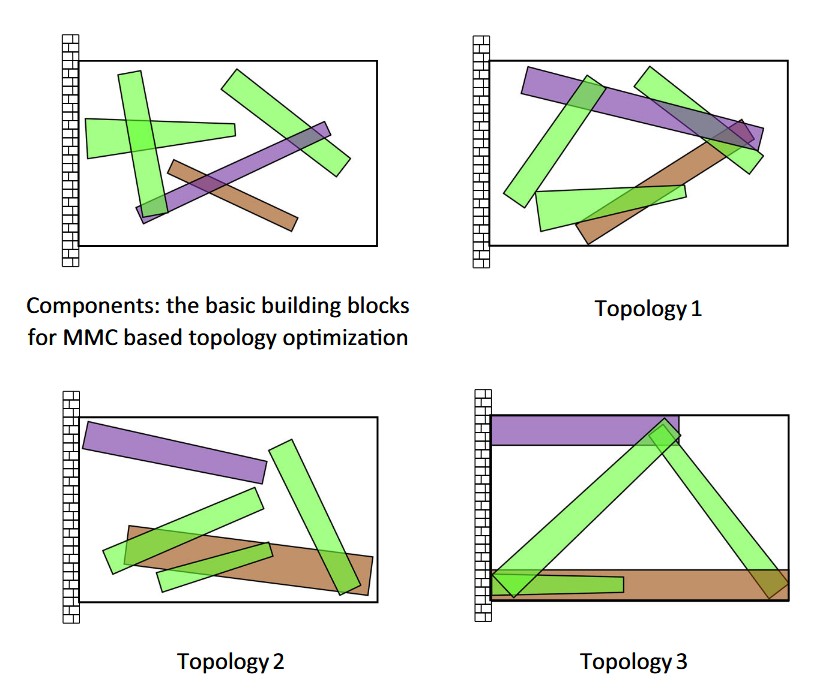
<center>图 1：基于 MMC 拓扑优化方法的基本思想</center>

最近，Norato 等 (2015) 也在 SIMP 框架中采用了相同的思想，用于由离散单元构成的连续体结构的拓扑优化，且引入了一种新型结构组件。在早期的 MMC 框架中 (Guo 等 2014a)，有限元分析采用了扩展有限元方法 (XFEM)。为此，必须根据与每个组件相关联的 TDF 节点值，对靠近结构边界的单元进行子网格剖分。尽管这种方法可以获得更准确的分析结果，但与基于替代材料 (ersatz material) 模型的处理方式相比，不可避免地会引入额外的计算开销。此外，早期的 MMC 框架仅使用了具有均匀厚度的组件作为优化的构建块，这从几何建模的角度来看并不令人满意。

本研究的另一个动机基于以下考虑：正如 Sigmund 和 Maute (2013) 所指出的，提出新拓扑优化方法时，向学术界提供清晰、编写良好的研究代码是必不可少的。提供代码有助于读者掌握该方法的基本特征、与其他方法对比甚至纠正其缺陷。Sigmund (2001) 首创发布了紧凑的 Matlab 拓扑优化代码，极大地推动了方法的发展。基于上述考虑，本文提出了一种改进的 MMC 拓扑优化方法。该方法克服了先前方法的几个弱点，不仅允许使用**可变厚度**的组件，而且通过构造拓扑描述函数 (TDF) 并将其投影到**替代材料 (ersatz material)** 模型上，极大地提高了数值求解效率。此外，为了帮助社区理解该方法的核心特性，本文还提供并发布了一个紧凑的 188 行 Matlab 代码。为简单起见，本文仅考虑二维问题。

# 2 方法

## 2.1 结构形状与拓扑描述
如 Guo 等 (2014a) 所示，在基于 MMC 的方法中，结构拓扑描述可以通过以下方式实现：
$$
\begin{aligned}
\phi_s(\boldsymbol{x}) > 0, & \quad \text{if } \boldsymbol{x} \in \Omega_s; \\
\phi_s(\boldsymbol{x}) = 0, & \quad \text{if } \boldsymbol{x} \in \partial\Omega_s; \\
\phi_s(\boldsymbol{x}) < 0, & \quad \text{if } \boldsymbol{x} \in D \backslash \Omega_s.
\end{aligned} \tag{1}
$$

在式 (1) 中，$D$ 表示给定的设计域，$\Omega_s \subset D$ 表示 $D$ 中由 $n$ 个固体材料组件所占据的子集。我们还有 $\phi_s(\boldsymbol{x}) = \max(\phi_1, \dots, \phi_n)$，其中 $\phi_i = \phi_i(\boldsymbol{x})$ ($i=1,\dots,n$) 表示第 $i$ 个组件占据区域（即 $\Omega_i$）的拓扑描述函数 (TDF)，即：
$$
\begin{aligned}
\phi_i(\boldsymbol{x}) > 0, & \quad \text{if } \boldsymbol{x} \in \Omega_i; \\
\phi_i(\boldsymbol{x}) = 0, & \quad \text{if } \boldsymbol{x} \in \partial\Omega_i; \\
\phi_i(\boldsymbol{x}) < 0, & \quad \text{if } \boldsymbol{x} \in D \backslash \Omega_i.
\end{aligned} \tag{2}
$$
显然，$\Omega_s = \cup_{i=1}^n \Omega_i$。有关上述几何表示的示意图，请读者参阅图 2。

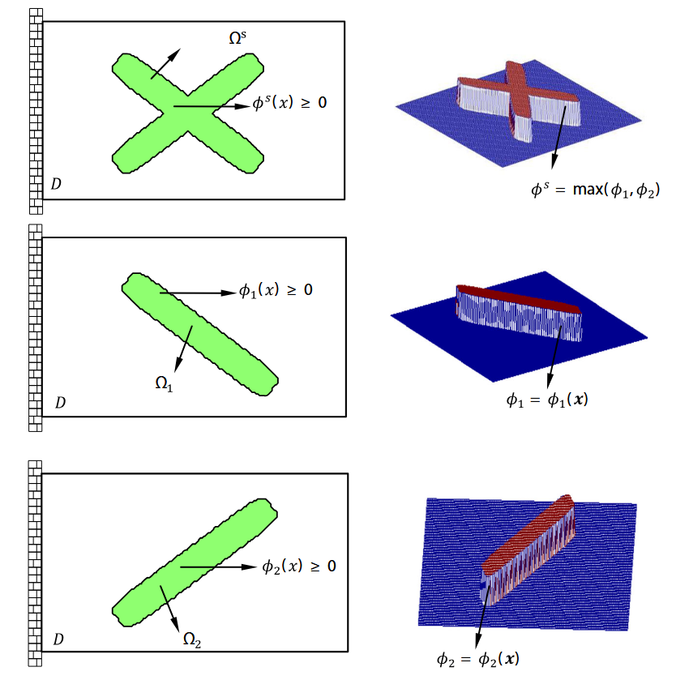
<center>图 2：通过各个组件的水平集函数表示结构拓扑</center>

在 Guo 等 (2014a) 的工作中，仅使用具有均匀厚度的组件作为优化的构建块。为了允许组件具有可变厚度的更一般情况，本文提出使用以下 TDF 来显式表示第 $i$ 个组件的几何形状：
$$
\phi_i(x, y) = \left( \frac{x'}{L_i} \right)^p + \left( \frac{y'}{f(x')} \right)^p - 1 \tag{3}
$$
其中，
$$
\begin{pmatrix} x' \\ y' \end{pmatrix} = \begin{pmatrix} \cos\theta_i & \sin\theta_i \\ -\sin\theta_i & \cos\theta_i \end{pmatrix} \begin{pmatrix} x - x_{0i} \\ y - y_{0i} \end{pmatrix} \tag{4}
$$
并且 $p$ 是一个相对较大的偶数（在本研究中我们取 $p=6$）。在式 (3) 和式 (4) 中，$(x_{0i}, y_{0i})$ 表示组件中心的坐标，$L_i$ 表示组件的半长，$\theta_i$（从水平轴逆时针测量）表示组件的倾斜角。这些参数显式地描述了组件的形状。与 Guo 等 (2014a) 采用的 TDF 相比，当前的 TDF 能够表示具有可变厚度的组件形状，其轮廓由 $f(x')$ 控制。这种处理方式将大幅增强 MMC 方法的几何建模能力。图 3 描绘了当 $f(x')$ 采用不同形式时相应组件的形状。

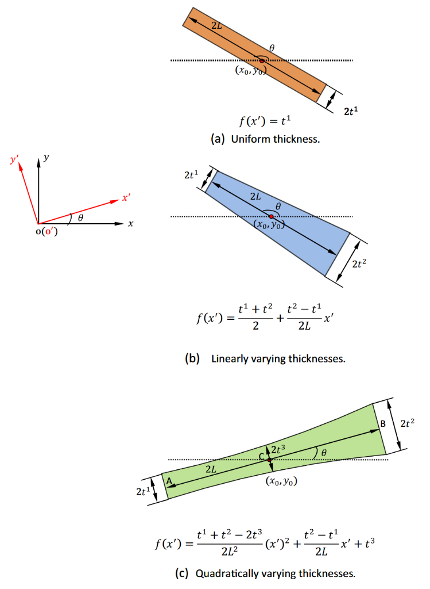
<center>图 3：结构组件的几何描述：(a) 均匀厚度；(b) 线性变化厚度；(c) 二次变化厚度。</center>

值得注意的是，尽管在基于 MMC 的方法中使用了 TDF 来表示组件的几何形状，但该方法与传统的水平集方法截然不同。区别在于，在所提出的 MMC 方法中，可以对组件的边界和几何特征（例如长度和厚度）进行**显式描述**。然而，这在传统的水平集方法中是无法实现的。这里的所谓显式边界描述，是指可以在 $x_b$ 和 $y_b$ 之间局部地建立一种唯一的显式关系，即 $y_b = y_b(x_b; \boldsymbol{D}_i)$，其中 $\boldsymbol{D}_i$ 表示与边界上点 $(x_b, y_b)$ 所在的第 $i$ 个组件相关联的设计变量向量。还需要指出的是，对于具有更复杂形状的组件，同样可以系统地构造包含显式几何信息的相应 TDF (Guo 等 2015)。

总之，在上述表示方案下，结构的布局（即形状和拓扑）可以完全由设计向量 $\boldsymbol{D} = (\boldsymbol{D}_1^\top, \dots, \boldsymbol{D}_i^\top, \dots, \boldsymbol{D}_n^\top)^\top$ 决定。其中 $\boldsymbol{D}_i = (x_{0i}, y_{0i}, L_i, \theta_i, \boldsymbol{d}_i^\top)^\top$，符号 $\boldsymbol{d}_i$ 表示与 $f(x')$ 相关的参数向量（例如图 3 中的 $t_{i1}$, $t_{i2}$ 和 $t_{i3}$）。

## 2.2 问题列式
如 Guo 等 (2014a) 所示，MMC 框架下的拓扑优化问题可以表述如下：
$$
\begin{aligned}
\text{Find} \quad & \boldsymbol{D} = (\boldsymbol{D}_1^\top, \dots, \boldsymbol{D}_i^\top, \dots, \boldsymbol{D}_n^\top)^\top \\
\text{Minimize} \quad & I = I(\boldsymbol{D}) \\
\text{s.t.} \quad & g_j(\boldsymbol{D}) \le 0, \quad j = 1, \dots, m; \\
& \boldsymbol{D} \subset U_D;
\end{aligned} \tag{5}
$$
其中，$\boldsymbol{D}_i$ 分别是与第 $i$ 个组件相关联的设计变量向量。$g_j$ 是约束函数，$U_D$ 是 $\boldsymbol{D}$ 所属的容许集。

如果考虑可用体积约束下的柔度最小化，相应的优化问题可以写为：
$$
\begin{aligned}
\text{Find} \quad & \boldsymbol{D} = (\boldsymbol{D}_1^\top, \dots, \boldsymbol{D}_i^\top, \dots, \boldsymbol{D}_n^\top)^\top, \quad \boldsymbol{u}(\boldsymbol{x}) \\
\text{Minimize} \quad & C = \sum_{i=1}^n \int_{\Omega_i \backslash (\cup_{1 \le j < i} (\Omega_i \cap \Omega_j))} \boldsymbol{f}_i \cdot \boldsymbol{u} dV + \int_{\Gamma_t} \boldsymbol{t} \cdot \boldsymbol{u} dS \\
\text{s.t.} \quad & \sum_{i=1}^n \int_{\Omega_i \backslash (\cup_{1 \le j < i} (\Omega_i \cap \Omega_j))} \boldsymbol{E}_i : \boldsymbol{\varepsilon}(\boldsymbol{u}) : \boldsymbol{\varepsilon}(\boldsymbol{v}) dV = \\
& \sum_{i=1}^n \int_{\Omega_i \backslash (\cup_{1 \le j < i} (\Omega_i \cap \Omega_j))} \boldsymbol{f}_i \cdot \boldsymbol{v} dV + \int_{\Gamma_t} \boldsymbol{t} \cdot \boldsymbol{v} dS, \quad \forall \boldsymbol{v} \in U_{ad}; \\
& V(\boldsymbol{D}) \le V; \\
& \boldsymbol{D} \subset U_D; \\
& \boldsymbol{u} = \bar{\boldsymbol{u}} \quad \text{on } \Gamma_u.
\end{aligned} \tag{6}
$$
在式 (6) 中，$\boldsymbol{f}_i$ 和 $\boldsymbol{t}$ 分别表示 $\Omega_i$ 内的体力密度和 Neumann 边界 $\Gamma_t$ 上的表面面力。$\bar{\boldsymbol{u}}$ 是 Dirichlet 边界 $\Gamma_u$ 上的规定位移。$\boldsymbol{\varepsilon}$ 表示二阶线性应变张量。$\boldsymbol{E}_i$ 是构成第 $i$ 个组件的材料的四阶各向同性弹性张量。符号 $V$ 表示可用固体材料体积的上限。为简单起见，在后续讨论中我们令 $\bar{\boldsymbol{u}} = \boldsymbol{0}$。

当仅考虑单相材料时，式 (6) 可以用 $\phi_s(\boldsymbol{x})$ 重写如下：
$$
\begin{aligned}
\text{Find} \quad & \boldsymbol{D} = (\boldsymbol{D}_1^\top, \dots, \boldsymbol{D}_i^\top, \dots, \boldsymbol{D}_n^\top)^\top, \quad \boldsymbol{u}(\boldsymbol{x}) \\
\text{Minimize} \quad & C = \int_D H(\phi_s(\boldsymbol{x}; \boldsymbol{D})) \boldsymbol{f} \cdot \boldsymbol{u} dV + \int_{\Gamma_t} \boldsymbol{t} \cdot \boldsymbol{u} dS \\
\text{s.t.} \quad & \int_D H(\phi_s(\boldsymbol{x}; \boldsymbol{D})) \boldsymbol{E} : \boldsymbol{\varepsilon}(\boldsymbol{u}) : \boldsymbol{\varepsilon}(\boldsymbol{v}) dV = \\
& \int_D H(\phi_s(\boldsymbol{x}; \boldsymbol{D})) \boldsymbol{f} \cdot \boldsymbol{v} dV + \int_{\Gamma_t} \boldsymbol{t} \cdot \boldsymbol{v} dS, \quad \forall \boldsymbol{v} \in U_{ad}; \\
& \int_D H(\phi_s(\boldsymbol{x}; \boldsymbol{D})) dV \le V; \\
& \boldsymbol{D} \subset U_D; \\
& \boldsymbol{u} = \bar{\boldsymbol{u}} \quad \text{on } \Gamma_u;
\end{aligned} \tag{7}
$$
其中 $H = H(x)$ 是 Heaviside 函数。
由于当 $x \le 0$ 时 $H(x) = 0$，否则 $H(x) = 1$，因此式 (7) 显然等价于（引入惩罚因子 $q$）：
$$
\begin{aligned}
\text{Find} \quad & \boldsymbol{D} = (\boldsymbol{D}_1^\top, \dots, \boldsymbol{D}_i^\top, \dots, \boldsymbol{D}_n^\top)^\top, \quad \boldsymbol{u}(\boldsymbol{x}) \\
\text{Minimize} \quad & C = \int_D H(\phi_s(\boldsymbol{x}; \boldsymbol{D})) \boldsymbol{f} \cdot \boldsymbol{u} dV + \int_{\Gamma_t} \boldsymbol{t} \cdot \boldsymbol{u} dS \\
\text{s.t.} \quad & \int_D (H(\phi_s(\boldsymbol{x}; \boldsymbol{D})))^q \boldsymbol{E} : \boldsymbol{\varepsilon}(\boldsymbol{u}) : \boldsymbol{\varepsilon}(\boldsymbol{v}) dV = \\
& \int_D H(\phi_s(\boldsymbol{x}; \boldsymbol{D})) \boldsymbol{f} \cdot \boldsymbol{v} dV + \int_{\Gamma_t} \boldsymbol{t} \cdot \boldsymbol{v} dS, \quad \forall \boldsymbol{v} \in U_{ad}; \\
& \int_D H(\phi_s(\boldsymbol{x}; \boldsymbol{D})) dV \le V; \\
& \boldsymbol{D} \subset U_D; \\
& \boldsymbol{u} = \bar{\boldsymbol{u}} \quad \text{on } \Gamma_u;
\end{aligned} \tag{8}
$$
其中 $q > 1$ 为整数。

## 2.3 基于 MMC 方法的显著特征
与现有的拓扑优化方法相比，前述基于 MMC 的方法具有以下显著特征：
首先，与传统方法通过图像像素或水平集函数的节点值隐式表示结构拓扑不同，基于 MMC 的方法使用一组几何参数来**显式**描述结构拓扑。这不仅显著减少了设计变量的数量（特别是对于三维问题！），而且从根本上消除了求解过程中与图像处理相关的问题（如确保黑白设计、灵敏度过滤、抑制边界扩散）。
其次，由于显式、精确的解析边界信息内嵌于基于 MMC 的求解方法中，因此 MMC 方法能够相对容易地处理涉及复杂边界层物理场（如湍流、电磁波反射）和边界条件的拓扑优化问题。
第三，基于 MMC 的方法有能力将尺寸、形状、拓扑和布局优化，甚至结构类型优化集成在一个统一的求解框架中。
此外，由于在基于 MMC 的方法中，分析模型和设计模型是完全解耦的，因此 MMC 方法的建模能力得到了显著增强（不同的组件可以使用不同的合适单元进行建模），这在传统方法中是难以轻易实现的。关于基于 MMC 方法的其他潜在优势，建议读者参阅 Guo 等 (2014a) 获取更多细节。

# 3 数值实现

## 3.1 有限元分析
与大多数拓扑优化方法一样，采用结构化四节点双线性单元对设计域进行均匀离散。正如 Guo 等 (2014a; Zhang 等 2015a) 所指出的，由于在 MMC 求解框架中可以准确且显式地描述组件边界，因此借助 X-FEM（扩展有限元方法）或贴体自适应网格技术可以实现高精度的有限元方法 (FEM) 分析。然而，在当前研究中，为了提高计算效率，采用了替代材料 (ersatz material) 模型进行有限元分析。使用替代材料模型时，如 Guo 等 (2005) 所示，一旦知道了某个单元四个节点上的 TDF 值，根据式 (8)，该单元的杨氏模量就可以插值为：
$$
E_e = \frac{E}{4} \sum_{i=1}^4 \left( H(\phi_i^e) \right)^q \tag{9}
$$
在式 (9) 中，$H = H(x)$ 是 Heaviside 函数，$\phi_i^e$ ($i=1,\dots,4$) 是整个结构的 TDF 函数（即 $\phi_s(\boldsymbol{x})$）在单元 $e$ 四个节点上的值。出于数值实现的目的，按照文献中的惯例，$H(x)$ 通常用其正则化版本 $H_\epsilon(x)$ 来代替。在当前研究中，$H_\epsilon(x)$ 的形式取为：
$$
H_\epsilon(x) = \begin{cases}
1, & \text{if } x > \epsilon; \\
\frac{3(1-\alpha)}{4} \left( \frac{x}{\epsilon} - \frac{x^3}{3\epsilon^3} \right) + \frac{1+\alpha}{2}, & \text{if } -\epsilon \le x \le \epsilon; \\
\alpha, & \text{otherwise};
\end{cases} \tag{10}
$$
其中，$\epsilon$ 是控制正则化幅度的参数，$\alpha$ 是一个较小的正数以确保全局刚度矩阵非奇异。此外，在本研究中，我们在式 (9) 中取 $q = 2$。

## 3.2 设计灵敏度
此处仅讨论柔度最小化问题的设计灵敏度分析。借助伴随灵敏度分析方法，可以很容易地扩展到考虑更一般的目标/约束函数的情况。
如果关注的目标函数是结构柔度，众所周知，其关于任意几何参数 $a$ 的灵敏度可以写为：
$$
\frac{\partial C}{\partial a} = - \boldsymbol{u}^\top \frac{\partial \boldsymbol{K}}{\partial a} \boldsymbol{u} = - \boldsymbol{u}^\top \left( \frac{E}{4} \sum_{e=1}^{NE} \sum_{i=1}^4 q \left( H(\phi_i^e) \right)^{q-1} \frac{\partial H(\phi_i^e)}{\partial a} \boldsymbol{k}_s \right) \boldsymbol{u} \tag{11}
$$
其中，$\boldsymbol{K}$ 是结构的全局刚度矩阵，$\boldsymbol{k}_s$ 是当 $\phi_i^e = 1$ ($i=1,\dots,4$) 且 $E = 1$ 时对应的单元刚度矩阵。在式 (11) 中，符号 $NE$ 表示背景网格结构中的单元总数。如 Guo 等 (2014a) 所示，由于 $\phi_s(\boldsymbol{x})$ 是关于 $a$ 的显式函数，因此可以很容易地计算 $\partial H(\phi_i^e) / \partial a$。但在本研究中，为了提高代码的通用性，我们使用 $\phi_i^e$ 的有限差分商（即 $\Delta H(\phi_i^e) / \Delta a$）来近似计算 $\partial H(\phi_i^e) / \partial a$。由于 $\phi_s(\boldsymbol{x})$ 是关于 $a$ 的显式函数，且有限差分操作仅在单元级进行，因此计算 $\Delta H(\phi_i^e) / \Delta a$ 非常快。大量数值算例表明，这种处理在考虑的问题中表现非常好。

此外，我们还有：
$$
\frac{\partial V}{\partial a} = \frac{1}{4} \sum_{e=1}^{NE} \sum_{i=1}^4 \frac{\partial H(\phi_i^e)}{\partial a} \tag{12}
$$
同样值得注意的是，在上述推导中，忽略了当用 $\phi_s(\boldsymbol{x}) = \max(\phi_1, \dots, \phi_n)$ 构造 $\phi_s$ 时由于 max 操作引起的不可微问题。大量的数值证据表明，这种处理对优化过程没有影响。

# 4 Matlab 代码实现
为了帮助读者理解本方法的基本特征，附录中记录了一份基于所提方法求解结构柔度最小化问题的 Matlab 代码。该代码对应于第 5 节中的短梁问题。这段代码的主要目的既不是展示 MMC 方法的方方面面，也不是给出一个精细的实现。它仅仅旨在帮助读者理解所提方法的核心特征。
实际上，该代码继承了著名的 Sigmund 99 行代码 (Sigmund 2001) 和 Andreassen 等 88 行代码 (Andreassen 等 2011) 的大部分程序架构、数据结构以及符号表示。有限元离散化、边界条件和载荷条件的设置与 Sigmund 的 99 行代码完全相同。该代码包含以下部分，下面将详细介绍。

## 4.1 主函数
Matlab 代码通过以下命令行调用：
`MMC188 (DW, DH, nelx, nely, x_int, y_int, ini_val, volfrac)`。
命令行中每个参数符号的含义可见表 1。值得注意的是，在当前代码中，对于所有测试算例，组件的初始构型都采用与图 4 相同的形式。符号 `x_int` 和 `y_int` 的含义也在同一张图中进行了示意说明。向量 `ini_val` 存储了描述组件初始构型的 $L, t_1, t_2, t_3$ 和 $\sin\theta$ 的值。读者也可以通过在代码中进行相应的修改，轻松尝试其他形式的初始设计。

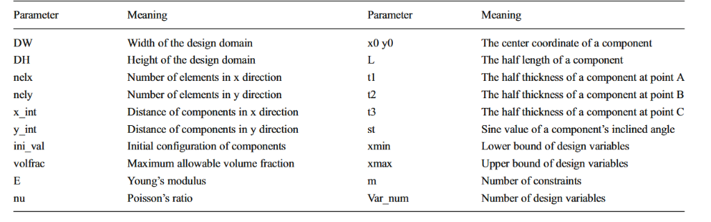
<center>表 1：代码中参数的含义</center>

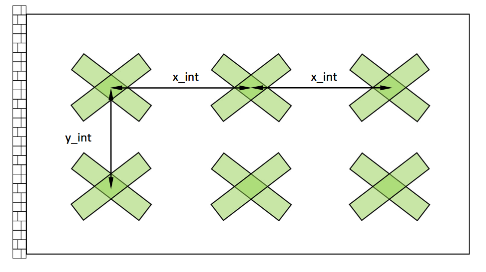
<center>图 4：组件的初始构型</center>

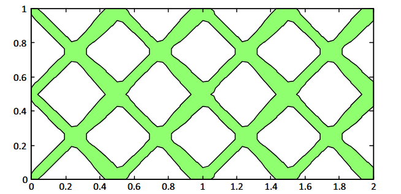
<center>图 5：短梁算例的初始设计（对应初始 TDF 场与材料分布）</center>

## 4.2 有限元分析 (FEA) 的数据初始化：第 3–12 行
这部分初始化了有限元分析所需的数据。

## 4.3 组件几何形状的数据初始化：第 13–26 行
这部分初始化了描述组件几何形状的数据。在当前代码中，对于所有测试算例，均使用二次函数来描述每个组件的宽度变化。$t_1, t_2$ 和 $t_3$ 的含义在图 3 中进行了示意说明。在第 26 行，设计变量（每个组件 7 个，即 $(x_{0i}, y_{0i}, L_i, t_{i1}, t_{i2}, t_{i3}, \sin\theta_i)^\top$）的所有初始值均已设置完毕。值得注意的是，在当前的实现中，出于数值稳定性的考虑，使用 $\sin\theta_i$ 而不是 $\theta_i$ 作为设计变量。

## 4.4 MMA 数据初始化：第 27–45 行
这部分初始化了 MMA 优化器的数据。需要注意的是，在当前代码中，每个组件的长度和宽度的下界被设置为一个极小但不为零的值。这不会阻止结构拓扑的变化，因为在基于 MMC 的框架中，拓扑变化主要可以通过组件的重叠 (overlapping) 和隐藏 (hiding) 机制来实现。当一个组件的长度或 $t_1, t_2, t_3$ 的最大值小于一个网格长度时，它也可以从设计域中消除。

## 4.5 边界与载荷条件设置：第 46–51 行
这部分设置了有限元分析的边界和载荷条件。读者可以针对不同问题进行相应的修改。

## 4.6 有限元分析的数据准备：第 52–60 行
这部分为 FEA 做准备。在第 60 行形成了局部单元刚度矩阵 `ks`。

## 4.7 优化主循环：第 61–149 行
*(1): 第 61–65 行：*设置正则化 Heaviside 函数的参数；
*(2): 第 71–79 行：*根据当前设计变量的值，设置每个网格节点处的 $\phi_s(\boldsymbol{x})$ 值；
*(3): 第 80–82 行：*绘制图形；
*(4): 第 84 行：*根据当前 $\phi_s(\boldsymbol{x})$ 的值，设置每个网格节点处的 $H(\boldsymbol{x}) = H(\phi_s(\boldsymbol{x}))$ 值；
*(5): 第 86–112 行：*通过有限差分法，计算 $H = H(\boldsymbol{x})$ 关于每个设计变量的有限差分商；
*(6): 第 113–120 行：*执行有限元分析；
*(7): 第 121–132 行：*分别根据式 (11) 和式 (12) 计算目标函数和约束函数关于设计变量的灵敏度。
*(8): 第 133–149 行：*调用 MMA 优化器进行优化。
所有算例的 MMA 参数设置如下（位于 `mmasub.m` 文件中）：
`epsimin=10^(-10); raa0=0.01; albefa=0.4; asyinit=0.1; asyincr=0.8; asydecr=0.6;`

## 4.8 三个子函数的说明
*(1). `function [tmpPhi]=tPhi (xy, LSgridx, LSgridy, p)`:*
为每个组件在每个网格节点上形成 $\phi_i = \phi_i(\boldsymbol{x})$。读者可以在此处进行相应修改，以允许具有不同形状的组件。
*(2). `function H=Heaviside (phi, alpha, nelx, nely, epsilon)`:*
计算每个网格节点上 $H_\epsilon$ 的值。读者可以调整 $\epsilon$（即 `epsilon`）的值，以测试该方法在不同问题中的性能。
*(3). `function [KE]=BasicKe (E, nu, a, b, h)`:*
形成局部单元刚度矩阵 `ks`。

# 5 数值算例 (Numerical examples)
在本节中，将展示几个基准数值算例以证明所提方法的有效性。

## 5.1 短梁问题
该问题的描述可在 Guo 等 (2014a) 中找到。初始设计如图 5 所示。针对此问题，我们设置 `ini_val=[0.38 0.04 0.06 0.04 0.7]`，并分别用 60×30、80×40 和 100×50 的有限元网格对设计域进行离散。通过以下调用来执行 Matlab 代码（对于不同的有限元网格设置，读者应修改函数中 `nelx` 和 `nely` 的值）：
`MMC188 (2, 1, 80, 40, 0.5, 0.5, ini_val, 0.4)`
表 2 给出了在不同网格下获得的目标函数的最佳值，以及优化后结构的轮廓图和组件图。可以观察到，如果初始设计中组件的数量固定，尽管在当前的基于 MMC 的方法中没有使用任何过滤 (filtering)，优化后结构的拓扑仍然与所采用的有限元网格无关（即无网格依赖性）。这在本质上是因为：当组件数量固定时，式 (7) 和 (8) 中的问题本质上是一个有限维空间中的优化问题。在这种情况下，由于有限维空间中的每一个有界闭集（例如式 (7) 和 (8) 中的 $U_D$）都是紧致的 (compact)，所考虑的问题必然是适定的 (well-posed)。同样值得注意的是，轮廓图中某些看起来不够光滑的边界仅仅是由于图形显示的缘故。实际上，组件的边界是非常光滑的，这在组件图中可以非常清晰地看到。此外，针对该问题，设计变量的数量仅为 16×7=112。这个值远小于传统方法中的设计变量数量，并且与有限元网格的分辨率无关。

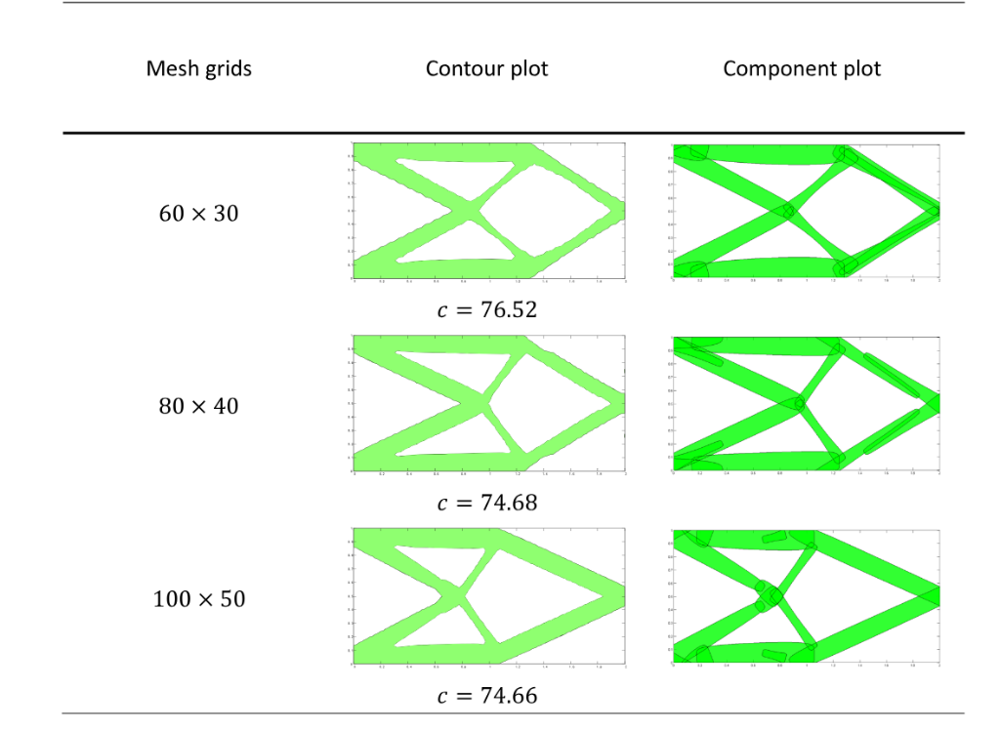
<center>表 2：短梁算例的最佳拓扑（包含轮廓图与组件图）</center>

## 5.2 MBB 梁问题
该问题的描述同样可在 Guo 等 (2014a) 中找到，并且由于该问题的对称性，仅考虑一半的设计域。初始设计如图 6 所示。针对此问题，我们设置 `ini_val=[0.38 0.04 0.06 0.04 0.7]`，并且边界和载荷条件（代码的第 47 和 50 行）应改为：
`fixeddofs=[1:2:2*(nely+1),2*(nely+1)*nelx+2];`
`loaddof=2*(nely+1);`
Matlab 代码通过以下调用来执行：
`MMC188 (3, 1, 120, 40, 0.5, 0.5, ini_val, 0.4)`
图 7 分别描绘了优化后结构的轮廓图（图 7a）和组件图（图 7b）。值得注意的是，通过所提方法获得的优化结构是纯黑白的，结构中完全没有灰色的过渡区域。

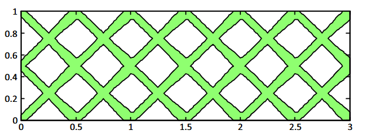
<center>图 6：MBB 算例的初始设计</center>

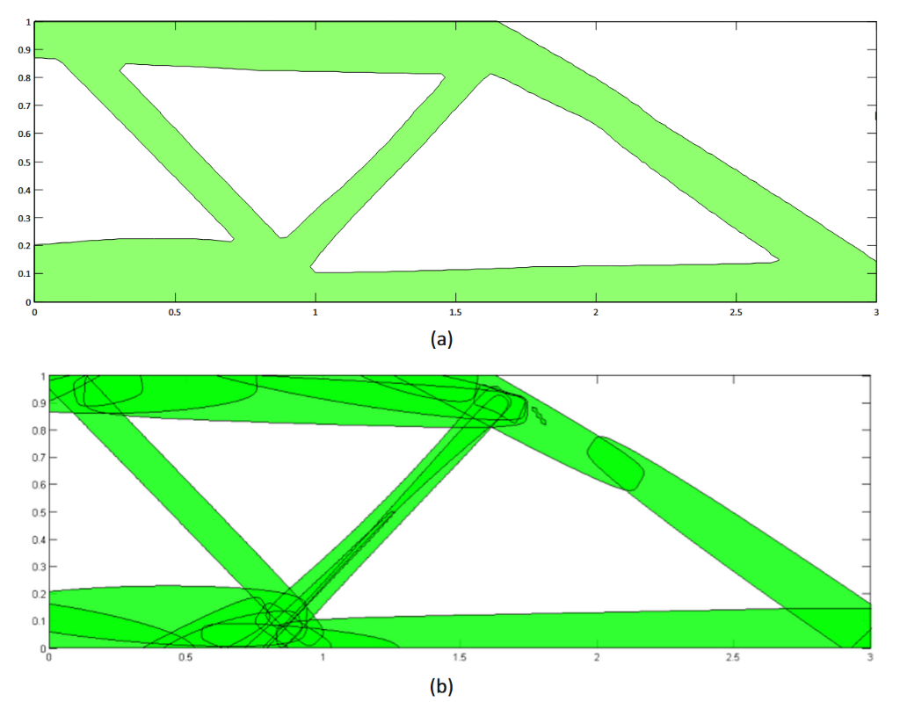
<center>图 7：MBB 算例的优化拓扑：(a) 轮廓图和 (b) 组件图</center>

## 5.3 桥梁算例
考虑的第三个算例是桥梁设计问题。载荷和边界条件如图 8 所示。在本例中，设计域采用 80×40 的有限元网格进行离散，并在域的顶部设置了一个宽为 0.1、长为 2 的矩形区域作为固定的固体区域。作为初始设计，4 个相交的组件分布在设计域中（如图 9 所示）。设计目标同样是最小化结构的平均柔度，体积约束为 $V \le \bar{V} = 0.3$。值得注意的是，对于本问题及下一个柔性机构问题，相应的代码均可从网站下载。优化后结构的轮廓图和组件图分别描绘在图 10 中。该问题的 Matlab 代码可以通过直接联系作者获得。

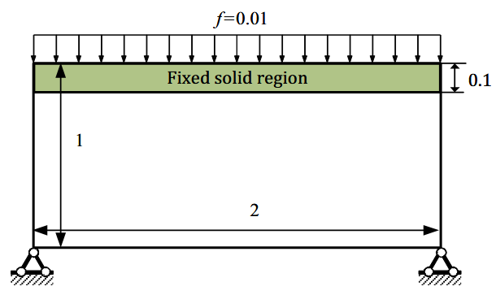
<center>图 8：桥梁算例模型</center>

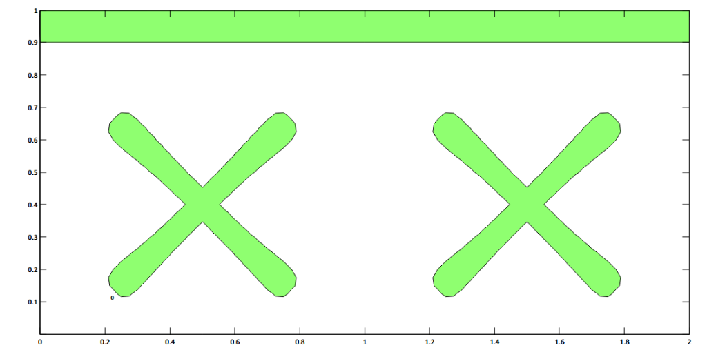
<center>图 9：桥梁算例的初始设计</center>

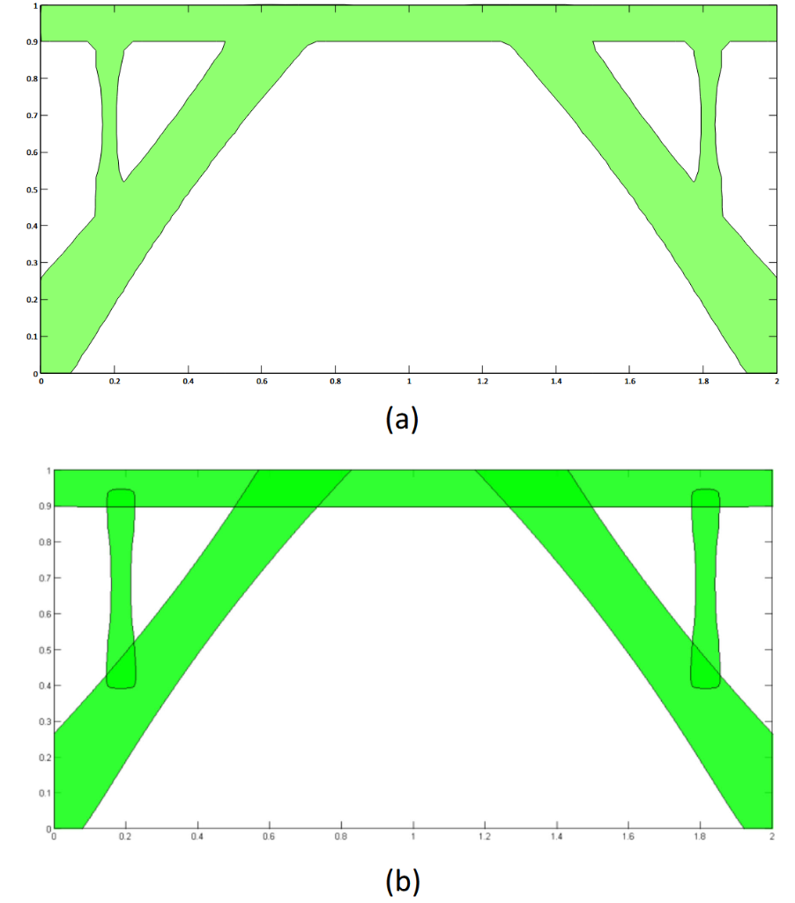
<center>图 10：桥梁算例的优化拓扑：(a) 轮廓图和 (b) 组件图</center>

## 5.4 柔性机构问题
考虑的最后一个例子是经典的柔性机构设计问题 (Sigmund 2001)，它显然是一个非自伴随 (non-self adjoint) 问题。相应的数据（如设计域、边界条件和几何数据）描绘在图 11 中。驱动力为 $F_{in}=1$，输入/输出点处弹簧的弹性常数分别为 $k_{in}= k_{out}=0.1$。由于所考虑的问题在本质上是对称的，因此仅对结构的一半进行优化，并用 80×40 的有限元网格进行离散。初始设计如图 12 所示。

对于此问题，我们设置 `ini_val=[0.38 0.04 0.06 0.04 0.7]`。该问题的 Matlab 代码可以通过对附录中给出的短梁问题的代码进行如下修改来获得：
*(1) 将原始代码中的第 47-51 行替换为以下内容：*
```matlab
fixeddofs=union([2*(nely+1) : 2*(nely+1):2*(nely+1)*(nelx+1)],[1:6]);
alldofs=1:2*(nely+1)*(nelx+1);
freedofs=setdiff(alldofs,fixeddofs);
InputForceID=[2*(nely+1)-1];
OutputForceID=[2*(nelx+1)*(nely+1)-1];
InputUnitForce=sparse(InputForceID,1,1,2*(nely+1)*(nelx+1),1);
OutputUnitForce=sparse(OutputForceID,1,-1,2*(nely+1)*(nelx+1),1);
```
*(2) 将原始代码中的第 114-122 行替换为以下内容：*
```matlab
denk=sum(H(EleNodesID).^2, 2) / 4;
den=sum(H(EleNodesID), 2) / 4;
A1=sum(den)*EW*EH;
U=zeros(2*(nely+1)*(nelx+1),2);
sK=KE(:)*denk(:)';
K=sparse(iK(:),jK(:),sK(:)); K=(K+K')/2;
K(InputForceID,InputForceID)=K(InputForceID,InputForceID)+0.1;
K(OutputForceID,OutputForceID)=K(OutputForceID,OutputForceID)+0.1;
U (freedofs,:)=K(freedofs,freedofs) \ [InputUnitForce(freedofs,:), OutputUnitForce(freedofs,:)];
U1=U(:,1);
U2=U(:,2);
U1(fixeddofs,:)=0;
U2(fixeddofs,:)=0;
%Energy of nodes
energy=-sum((U1(edofMat)*KE).*U2(edofMat),2);
```
*(3) 将原始代码中的第 133 行替换为以下语句：*
`Comp=-sum(energy.*denk(:));`

通过以下调用执行 Matlab 代码：
`MMC188(2, 1, 80, 40, 0.5, 0.5, ini_val, 0.3)`

该问题的优化结构如图 13 所示，分别给出了轮廓图和组件图。可以观察到，一些不必要的组件已被其他组件覆盖重叠。这实际上是 MMC 方法中实现拓扑变化的有效机制。同样值得注意的是，在最终的优化结构中**不存在类似单点铰链 (hinge-like) 的连接**，尽管在问题公式中并未采用任何特殊处理。这可以归功于本研究中使用的替代材料模型和刚度插值方案（即式 (9)）。

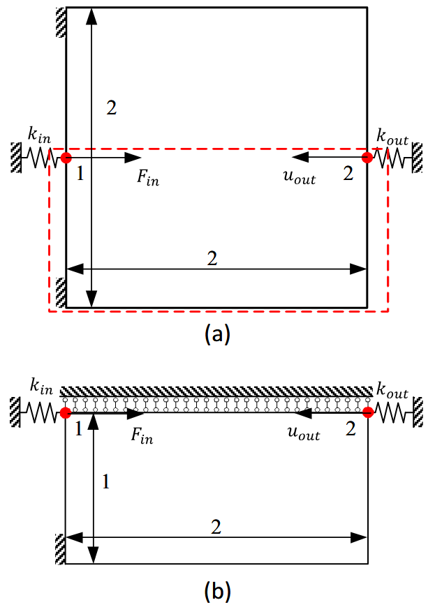
<center>图 11：柔性机构算例模型</center>

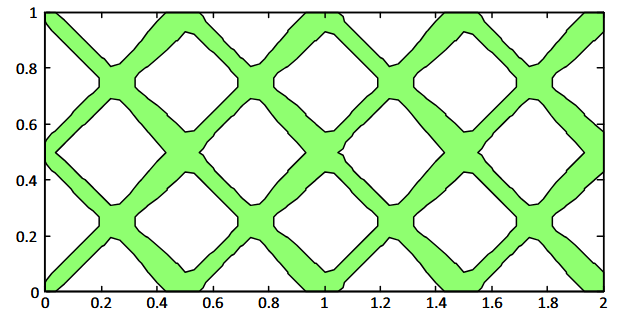
<center>图 12：柔性机构的初始设计</center>

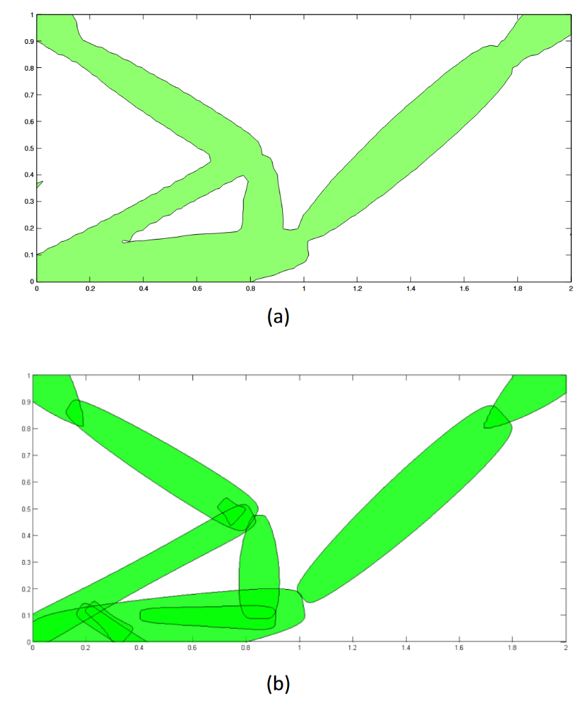
<center>图 13：柔性机构的优化拓扑：(a) 轮廓图和 (b) 组件图</center>

## 5.5 扩展至三维 (3D) 问题
所提供的代码也可以扩展用于求解 3D 拓扑优化问题。让我们考虑在 5.1 节中考察的短梁算例的三维版本。对于该算例，设计域的长度、宽度和高度分别为 10、5 和 1。对于 3D 问题，共有 9 个几何参数（即 $\boldsymbol{D}_i=(x_{0i},y_{0i},z_{0i},l_i,w_i,t_i,\sin\alpha_i,\sin\beta_i, \sin\gamma_i)^\top$）来描述具有恒定横截面积的组件几何形状。包含 18 个组件的初始设计如图 14 所示。从 40×20×4 的有限元网格中获得的最佳拓扑如图 15 所示。在 MMC 框架下，设计变量的数量为 9×18=162，而在传统框架中为 40×20×4=3200。此外，如果需要两倍的分辨率，传统框架中的设计变量数量将增加到 25,600，而在 MMC 框架下则依然保持 162 不变。读者可以直接联系作者以获取相应的 3D 代码。关于 3D 问题的理论层面的更多细节将在另一份独立的工作中报告。

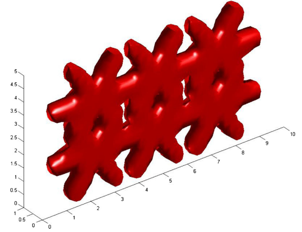
<center>图 14：3D 短梁算例的初始设计</center>

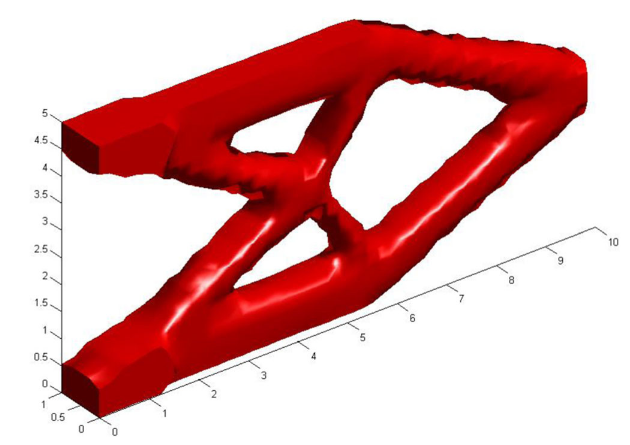
<center>图 15：3D 短梁算例的优化拓扑</center>

# 6 总结 (Concluding remarks)
在本文中，提出了一种基于所谓的移动可变形组件 (Moving Morphable Components, MMC) 求解框架 (Guo 等 2014a) 和替代材料模型 (ersatz material model) 的新拓扑优化方法。与现有的基于 MMC 的求解方法相比，所提方法不仅允许具有可变厚度的组件，而且显著提高了数值求解效率。

数值算例表明了所提方法的有效性和鲁棒性。所提方法可以在一个 188 行的 Matlab 代码中实现，并用于以少得多的设计变量来寻找优化的结构拓扑。为了帮助读者理解所提方法的基本特征，本文还提供并详细解析了该 Matlab 代码。我们也希望这段代码的发布能鼓励读者深入了解这种基于 MMC 的方法，并可能启发他们对该方法进行一些改进、扩展或修改。当然，该代码远未成熟，许多 MMC 方法在分析和优化方面的精细处理 (Zhang 等 2015a) 并没有反映在其中。那些实现了 MMC 方法多个新颖特征（例如，基于精确边界几何描述的 X-FEM 分析，基于精确边界/体积积分的灵敏度分析，以及多相材料和三维问题的处理）的代码将在我们未来的工作中发布。

## 致谢 (Acknowledgments)
非常感谢国家自然科学基金 (10925209, 91216201, 11402048)、中央高校基本科研业务费专项资金、长江学者奖励计划、教育部创新团队发展计划 (PCSIRT) 以及 111 计划 (B14013) 的资金资助。

## 附录：Matlab 代码（对应于短梁问题）
```matlab
function MMC188(DW,DH,nelx,nely,x_int, y_int,ini_val,volfrac)
% FEM data initialization
M=[nely+1, nelx+1];
EW=DW / nelx; % length of element
EH=DH / nely; % width of element
[x,y]=meshgrid(EW * [0 : nelx], EH * [0 : nely]);
LSgrid.x=x(:);
LSgrid.y=y(:); % coordinate of nodes
% Material properties
h=1; %thickness
E=1;
nu=0.3;
% Component geometry initialization
x0=x_int/2:x_int:DW; % x-coordinates of the centers of components
y0=y_int/2:y_int:DH; % y-coordinates of the centers of components
xn=length(x0); % number of component groups in x direction
yn=length(y0); % number of component groups in y direction
x0=kron(x0,ones(1,2*yn));
y0=repmat(kron(y0,ones(1,2)),1,xn);
N=length(x0); % total number of components in the design domain
L=repmat(ini_val(1),1,N); % vector of the half length of each component
t1=repmat(ini_val(2),1,N); % vector of the half width of component at point A
t2=repmat(ini_val(3),1,N); % vector of the half width of component at point B
t3=repmat(ini_val(4),1,N); % vector of the half width of component at point C
st=repmat([ini_val(5) -ini_val(5)],1, N/2); % vector of the sine value of the inclined angle of each component
variable=[x0;y0;L;t1;t2;t3;st];
%Parameter of MMA
xy00=variable(:);
xval=xy00;
xold1=xy00;
xold2=xy00;
%Limits of variable:[x0; y0; L; t1; t2; t3; st];
xmin=[0; 0; 0.01; 0.01; 0.01; 0.03; -1.0];
xmin=repmat(xmin,N,1);
xmax=[DW; DH; 2.0; 0.2; 0.2; 0.2; 1.0];
xmax=repmat(xmax,N,1);
low=xmin;
upp=xmax;
m=1; %number of constraint
Var_num=7; % number of design variables for each component
nn=Var_num*N;
c=1000*ones(m,1);
d=zeros(m,1);
a0=1;
a=zeros(m,1);
%Define loads and supports(Short beam)
fixeddofs=1:2*(nely+1);
alldofs=1:2*(nely+1)*(nelx+1);
freedofs=setdiff(alldofs,fixeddofs);
loaddof=2*(nely+1)*nelx+nely+2;
F = sparse(loaddof,1,-1,2*(nely + 1)*(nelx+1),1);
%Preparation FE analysis
nodenrs=reshape(1:(1+nelx)*(1+nely), 1+nely,1+nelx);
edofVec = reshape(2*nodenrs(1:end-1, 1:end-1)-1,nelx*nely,1);
edofMat=repmat(edofVec,1,8)+repmat([0 1 2*nely+[2 3 4 5] 2 3],nelx*nely,1);
iK=kron(edofMat,ones(8,1))';
jK=kron(edofMat,ones(1,8))';
EleNodesID=edofMat(:,2:2:8)./2;
iEner=EleNodesID';
[KE]=BasicKe(E,nu, EW, EH,h); % stiffness matrix k^s is formed
%Initialize iteration
p=6;
alpha= 1e-3; % parameter alpha in the Heaviside function
epsilon=4*min(EW,EH); % regularization parameter epsilon in the Heaviside function
Phi=cell(N,1);
Loop=1;
change=1;
maxiter=1000; % the maximum number of iterations
while change>0.001 && Loop<maxiter
    %Forming Phi^s
    for i=1:N
        Phi{i}=tPhi(xy00(Var_num*i-Var_num+1: Var_num*i),LSgrid.x,LSgrid.y,p);
    end
    %Union of components
    tempPhi_max=Phi{1};
    for i=2:N
        tempPhi_max=max(tempPhi_max,Phi{i});
    end
    Phi_max=reshape(tempPhi_max,nely+1, nelx+1);
    %Plot components
    contourf(reshape(x, M), reshape(y, M), Phi_max,[0,0]);
    axis equal;axis([0 DW 0 DH]);pause(1e-6);
    % Calculating the finite difference quotient of H
    H=Heaviside(Phi_max,alpha,nelx,nely, epsilon);
    diffH=cell(N,1);
    for j=1:N
        for ii=1:Var_num
            xy001=xy00;
            xy001(ii + (j-1)*Var_num) = xy00(ii + ( j - 1 ) * Var_num) + max(2*min(EW,EH), 0.005);
            tmpPhiD1=tPhi(xy001(Var_num*j-Var_num +1:Var_num*j),LSgrid.x,LSgrid.y,p);
            tempPhi_max1=tmpPhiD1;
            for ik=1:j-1
                tempPhi_max1 = max(tempPhi_max1,Phi{ik});
            end
            for ik=j+1:N
                tempPhi_max1 = max(tempPhi_max1,Phi{ik});
            end
            xy002=xy00;
            xy002(ii + (j-1)*Var_num) = xy00(ii + (j-1)*Var_num)-max(2*min(EW,EH),0.005);
            tmpPhiD2=tPhi(xy002(Var_num*j-Var_num +1:Var_num*j),LSgrid.x,LSgrid.y,p);
            tempPhi_max2=tmpPhiD2;
            for ik=1:j-1
                tempPhi_max2 = max(tempPhi_max2,Phi{ik});
            end
            for ik=j+1:N
                tempPhi_max2 = max(tempPhi_max2,Phi{ik});
            end
            HD1=Heaviside(tempPhi_max1,alpha,nelx, nely,epsilon);
            HD2=Heaviside(tempPhi_max2,alpha,nelx, nely,epsilon);
            diffH{j}(:,ii)=(HD1-HD2)/(2*(max(2*min (EW,EH),0.005)));
        end
    end
    %FEA
    denk=sum(H(EleNodesID).^2, 2) / 4;
    den=sum(H(EleNodesID), 2) / 4;
    A1=sum(den)*EW*EH;
    U=zeros(2*(nely+1)*(nelx+1),1);
    sK=KE(:)*denk(:)';
    K = sparse(iK(:),jK(:),sK(:)); K = (K + K')/2;
    U(freedofs,:)=K(freedofs,freedofs)\F(freedofs,:);
    %Energy of element
    energy=sum((U(edofMat)*KE).*U(edofMat),2);
    sEner=ones(4,1)*energy'/4;
    energy_nod=sparse(iEner(:),1,sEner(:));
    Comp=F'*U;
    % Sensitivities
    df0dx=zeros(Var_num*N,1);
    dfdx=zeros(Var_num*N,1);
    for k=1:N
        df0dx(Var_num*k-Var_num+1:Var_num*k, 1)=2*energy_nod'.*H*diffH{k};
        dfdx(Var_num*k-Var_num+1:Var_num*k,1)=sum(diffH{k})/4;
    end
    %MMA optimization
    f0val=Comp;
    df0dx=-df0dx/max(abs(df0dx));
    fval=A1/(DW*DH)-volfrac;
    dfdx=dfdx/max(abs(dfdx));
    [xmma,ymma,zmma,lam,xsi,eta,mu,zet,ss, low,upp]=...
    mmasub(m,nn,Loop,xval,xmin,xmax,xold1, xold2, ...
    f0val,df0dx,fval,dfdx,low,upp,a0,a,c, d);
    xold2=xold1;
    xold1=xval;
    change=max(abs(xval-xmma));
    xval=xmma;
    xy00=round(xval*1e4)/1e4;
    disp([' It.: ' sprintf('%4i\t',Loop) ' Obj.: ' sprintf('%6.3f\t',f0val) ' Vol.: ' ...
    sprintf('%6.4f\t',fval) 'ch.:' sprintf('%6.4f\t',change)]);
    Loop=Loop+1;
end
end

%Forming Phi_i for each component
function [tmpPhi] = tPhi(xy,LSgridx, LSgridy,p)
st=xy(7);
ct=sqrt(abs(1-st*st));
x1=ct*(LSgridx - xy(1))+st*(LSgridy - xy(2));
y1=-st*(LSgridx - xy(1))+ct*(LSgridy - xy(2));
bb = (xy(5) + xy(4)-2*xy(6))/2/xy(3)^2*x1.^2+(xy(5)-xy(4))/2*x1/xy(3)+xy(6);
tmpPhi=-((x1).^p/xy(3)^p+(y1).^p./bb.^p-1);
end

%Heaviside function
function H=Heaviside(phi,alpha,nelx, nely,epsilon)
num_all=[1:(nelx+1)*(nely+1)]';
num1=find(phi>epsilon);
H(num1)=1;
num2=find(phi<-epsilon);
H(num2)=alpha;
num3=setdiff(num_all,[num1;num2]);
H(num3) = 3*(1-alpha)/4*(phi(num3)/ epsilon-phi(num3).^3/(3*(epsilon)^3))+ (1+alpha)/2;
end

%Element stiffness matrix
function [KE]=BasicKe(E,nu, a, b,h)
k=[-1/6/a/b*(nu*a^2-2*b^2-a^2), 1/8*nu + 1/8, -1/12/a/b*(nu*a^2 + 4*b^2-a^2), 3/8*nu-1/8, ...
1/12/a/b*(nu*a^2-2*b^2-a^2),-1/8*nu-1/8, 1/6/a/b*(nu*a^2+b^2-a^2), -3/8*nu+1/8];
KE=E*h/(1-nu^2)*...
[k(1) k(2) k(3) k(4) k(5) k(6) k(7) k(8)
k(2) k(1) k(8) k(7) k(6) k(5) k(4) k(3)
k(3) k(8) k(1) k(6) k(7) k(4) k(5) k(2)
k(4) k(7) k(6) k(1) k(8) k(3) k(2) k(5)
k(5) k(6) k(7) k(8) k(1) k(2) k(3) k(4)
k(6) k(5) k(4) k(3) k(2) k(1) k(8) k(7)
k(7) k(4) k(5) k(2) k(3) k(8) k(1) k(6)
k(8) k(3) k(2) k(5) k(4) k(7) k(6) k(1)];
end

% ~ ~ ~ ~ A Moving Morphable Components (MMC) based topology optimization code
%~~~~ by Xu Guo Weisheng Zhang and Jie Yuan
% ~ ~ ~ ~ Department of Engineering Mechanics, State Key Laboratory of Structural Analysis
%~~~~ for Industrial Equipment, Dalian University of Technology
%~~~~ Please send your suggestions and comments to guoxu@dlut.edu.cn
```
