# Explicit three dimensional topology optimization via Moving Morphable Void (MMV) approach

## 完整中文译文

> 原笔记：[[../Zhang2017-MMV-3D]]
> Zotero 条目： zotero://select/library/items/M3GVBM67
> PDF 附件： zotero://open-pdf/library/items/M3GVBM67
> 说明： 本页用于放置 Zhang et al. 2017 论文的完整中文译稿。

---

# 0 元数据

* 论文：Zhang, Weisheng, et al. 2017, *Computer Methods in Applied Mechanics and Engineering*
* DOI： 10.1016/j.cma.2017.07.031
* Better BibTeX key: `zhangExplicitThreeDimensional2017`
* Zotero item key: `M3GVBM67`

# 摘要

三维 (3D) 拓扑优化问题通常在有限元分析 (FEA) 中涉及海量的自由度 (DOFs)，并且在数值优化中涉及海量的设计变量。这不可避免地会导致求解过程中产生巨大的计算开销。在本文中，基于移动可变形空洞 (Moving Morphable Voids, MMVs) 求解框架，提出了一种高效且显式的拓扑优化方法。该方法不仅能够减少设计变量的数量，还能同时减少 FEA 中的自由度数量。这一目标是通过引入一组几何参数（例如，B 样条曲面的控制点）来显式地描述结构边界，并在数值优化的每一步中从有限元模型里移除不必要的自由度来实现的。数值算例表明，所提方法确实能够以直接的方式克服 3D 拓扑优化问题所面临的计算瓶颈，并显著提升求解效率。

**关键词**：拓扑优化；移动可变形空洞 (MMV)；移动可变形组件 (MMC)；拓扑描述函数 (TDF)；显式边界演化。

# 1 引言

结构拓扑优化旨在以最优的方式在给定的设计域内分配一定数量的材料，以获得最优的结构性能。自 Prager 和 Rozvany [1]、Cheng 和 Olhoff [2]、Bendsøe 和 Kikuchi [3] 以及 Zhou 和 Rozvany [4] 的开创性工作以来，拓扑优化经历了快速的发展。如今，人们已经提出了许多强大的结构拓扑优化方法，其中一些已在诸多领域获得了成功的应用。关于拓扑优化最新进展的前沿综述，建议读者参阅 [5-8] 及其中引用的文献。

与二维 (2D) 拓扑优化相比，从计算的角度来看，三维 (3D) 拓扑优化更具挑战性，特别是当采用传统的求解方法（如变密度法 [9, 10] 和水平集方法 [11, 12]）时。这可以解释如下：例如，如果将一个 1 × 1 × 1 的立方体设计域（如图 1 所示）沿每个坐标轴方向离散为 100 个单元（注意，这实际上并非高分辨率），那么当采用上述方法时，有限元分析 (FEA) 中的自由度 (DOFs) 数量（即 $n_{nd}$）以及与数值优化相关的设计变量数量（即 $n_{v}$）都将达到**一百万**的量级！这不可避免地会导致庞大的计算需求，因为有限元分析和数值优化的计算复杂度将分别随 $n_{nd}$ 和 $n_{v}$ 的数量呈近乎三次方的增长 [13]。当需要获取更高分辨率的最优解时，这种计算挑战将变得更加严峻。

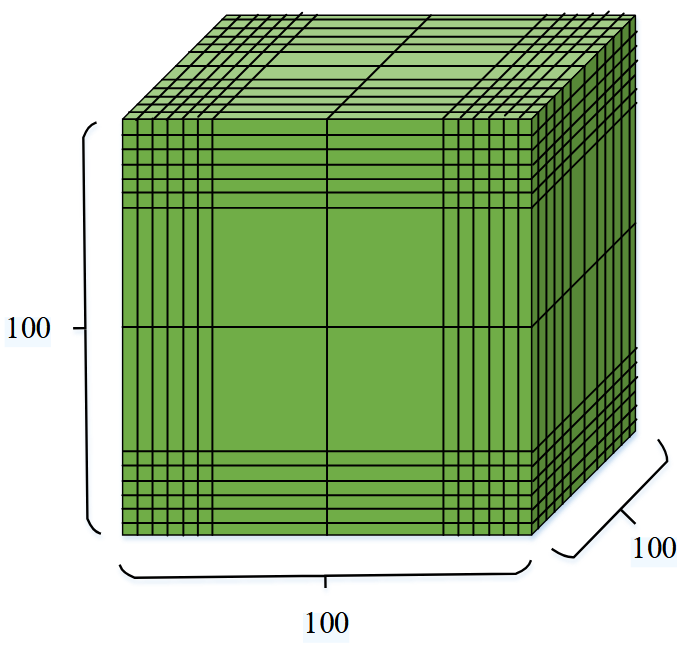

图 1：采用 100 × 100 × 100 FE 网格离散的 1 × 1 × 1 立方体设计域

近年来，人们对 3D 问题的拓扑优化 [14] 产生了越来越浓厚的兴趣，这类问题在实际工程应用中无处不在。例如，Diaz 和 Lipton [15] 使用矩公式研究了 3D 拓扑优化问题，以表征设计域中每个点处层状材料的最优正交各向异性。然后，通过双层方法寻找 3D 空间中的最优材料分布，其中全局材料密度场和局部矩变量以分层方式进行优化。Fernandes 等 [16] 提出了一种改进的均匀化方法来优化 3D 线性弹性结构的拓扑。该方法引入了对结构“周长”的约束，以确保问题列式的适定性。文献 [17] 中，Villanueva 和 Maute 结合水平集方法 (LSM) 和扩展有限元方法 (XFEM) 开发了一种新颖的 3D 拓扑优化方法。数值结果表明，即使使用相对粗糙的有限元网格，也能获得具有清晰边界的优化 3D 结构。Aage 和 Lazarov [18] 探讨了如何利用现代并行计算技术求解大规模 3D 拓扑优化问题。此外，文献 [19] 还提供了一个高效的 3D 拓扑优化 Matlab 代码。然而值得注意的是，在上述工作中，与 3D 拓扑优化相关的瓶颈问题，即**减少 FEA 中的 DOFs 数量**和**减少数值优化中的设计变量数量**，并未得到很好的解决。

最近，文献 [20] 基于所谓的**移动可变形组件 (Moving Morphable Component, MMC)** 方法提出了一种用于 3D 拓扑优化的新方法，其中一组移动可变形组件被用作拓扑优化的基本构建块，并通过优化组件的形状、方向和布局来获得最优的结构拓扑 [21]。该方法吸引人的特征在于能够大幅减少问题列式中涉及的设计变量数量，这对于缩短与数值优化过程相关的计算时间非常有帮助。然而，该工作并未解决 3D 拓扑优化的另一个挑战性问题，即 FEA 中庞大的自由度 (DOFs) 数量。

本文的目的是在最新发展的**移动可变形空洞 (Moving Morphable Voids, MMVs)** 求解框架下，提出一种 3D 拓扑优化方法，其中一组移动可变形空洞被用作拓扑优化的基本构建块 [22, 23]。在文献 [22] 和 [23] 中，作者仅考虑了 2D 问题，并且仅展示了 MMV 方法在减少数值优化计算量方面的潜力。正如在后续讨论中将清楚看到的那样，MMV 方法不仅可以减少拓扑优化问题涉及的设计变量数量，还能**减少 FEA 中的 DOFs 数量**，而这构成了 3D 问题求解效率的主要瓶颈。为了充分发掘 MMV 方法在提升拓扑优化问题求解效率方面的潜力，本文通过引入一些新颖的思想和技术，将 MMV 方法扩展到解决与 3D 拓扑优化相关的挑战性瓶颈问题。

本文的其余部分组织如下。在第 2 节中，首先简要介绍 MMV 方法的基本思想，即通过显式地改变结构边界来实现拓扑优化。第 3 节致力于解释如何通过一组几何参数来描述 3D 结构的形状，本节还将给出 MMV 求解框架下 3D 拓扑优化问题的数学列式。第 4 节详细讨论数值实现问题。在第 5 节中，通过三个算例证明了所提方法的有效性，并在本节中将所提方法的求解效率与传统方法进行了比较。最后，在第 6 节给出一些总结性评述。

# 2 移动可变形空洞 (MMV) 方法

正如文献 [23] 中所指出的，MMV 方法实际上是由 Guo 等人 [21] 首次提出的移动可变形组件 (MMC) 方法的“对偶”版本，借由该方法能够以显式且几何化的方式实现拓扑优化。与使用一组移动可变形组件作为拓扑优化基本构建块的 MMC 方法相反，在 MMV 方法中，是使用一组移动可变形空洞 (Moving Morphable Voids) 来优化结构的拓扑。在 MMV 方法中（如图 2 所示），结构的拓扑演化是通过一组表示结构边界的封闭参数化曲线（对于 2D 问题）或参数化曲面（对于 3D 问题）的变形、相交和合并来实现的。与传统的水平集 (Level Set) 方法不同，在 MMV 方法中，不需要引入定义在高维空间中的额外水平集函数来隐式地表示结构边界。MMV 方法中涉及的设计变量仅仅是参数化曲线/曲面的控制点坐标（或某些相关参数）。这极大地减少了优化问题中涉及的设计变量数量。关于该方法技术细节的更多讨论，建议读者参阅文献 [23]。

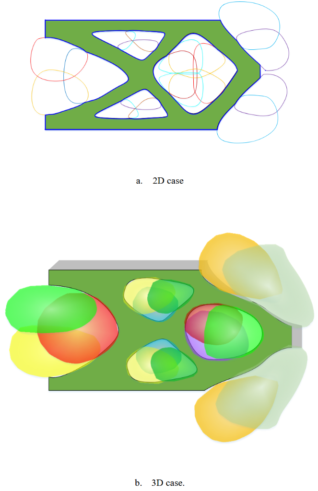

图 2：MMV 方法中结构的拓扑表示 (a) 2D 情形 (b) 3D 情形

正如在文献 [23] 中深入讨论的那样，MMV 方法的关键点之一是如何以显式且参数化的方式描述可变形空洞的几何形状。同时，所采用的几何描述方案在计算上也必须是易于处理的。在接下来的章节中，我们将讨论在基于 MMV 的求解框架内，如何通过一组参数来具体描述 3D 结构的几何特征。

# 3 MMV 方法中 3D 结构的几何描述

我们将寻求最优材料分布的 3D 设计域记为 $D$。那么优化后结构所占据的区域可以描述为 $\Omega_s = D \setminus \bigcup_{i=1}^{n_v} \Omega_i$，其中 $\Omega_i, i=1, \dots, n_v$ 是一组由封闭曲面 $S_i, i=1, \dots, n_v$ 包围的空洞区域（示意图见图 3）。使用这种几何描述，可以通过优化 $S_i$ 的位置、形状和布局来唯一地确定 3D 结构的最优拓扑。

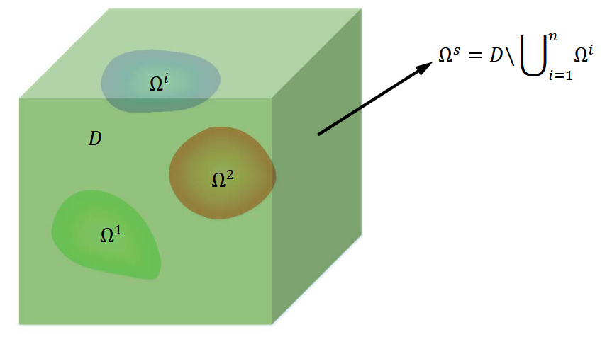

图 3：MMV 方法中使用一组封闭曲面表示 Ωs

**注 1**：正如文献 [23] 中所指出的，在拓扑优化中，为了在优化结果与 CAD/CAE 系统之间建立直接联系，非常需要对优化结构的边界进行全局、显式且平滑的描述。对于 2D 拓扑优化问题，这已经在文献 [23] 提出的方法中得以实现，该方法可以通过重新排列结构边界每一段的平滑骨架曲线的控制点来构建平滑的 B 样条描述。然而，对于 3D 问题，从各个独立的骨架曲面构建边界曲面的全局、显式且平滑的描述是一项更具挑战性的任务，因为在这种情况下，很难像 2D 情况那样为涉及的骨架曲面上的控制点建立顺序。在当前的研究中，我们将忽略结构边界的平滑性和全局显式描述问题，并打算在另一项独立的工作中专门解决这些具有挑战性的问题。

接下来，让我们考虑如何以一种适合高效进行拓扑优化的方式来描述平滑曲面的形状。实际上，如果使用自适应网格进行 FEA，任何能够给出边界曲面显式描述的方法都可以直接用于构建有限元网格。然而，如果像传统拓扑优化方法那样更倾向于使用固定网格进行 FEA，那么所谓的**拓扑描述函数 (Topology Description Function, TDF)** 就是在结构拓扑与结构有限元模型之间建立联系的合适工具 [24]。在计算机图形学领域，参数化 TDF 的构建已经得到了深入研究。其中一个挑战性的问题是开发不仅适用于星形区域，而且适用于非星形区域的 TDF 构建技术。这里的所谓“星形区域”是指可以找到一个内部中心点，从该点可以“无遮挡地看到”整个边界的区域（见图 4 示意图）。

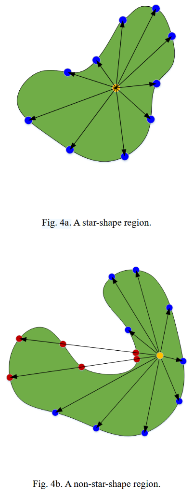

图 4：(a) 星形区域 (b) 非星形区域

在基于 MMC 的求解框架下，提出了一种统一的方法，可系统地用于构建星形和非星形区域的 TDF。在这种方法中，如图 5 所示，组件的骨架（2D 为中轴线，3D 为中轴面）以及从骨架到组件边界的距离函数起着核心作用。

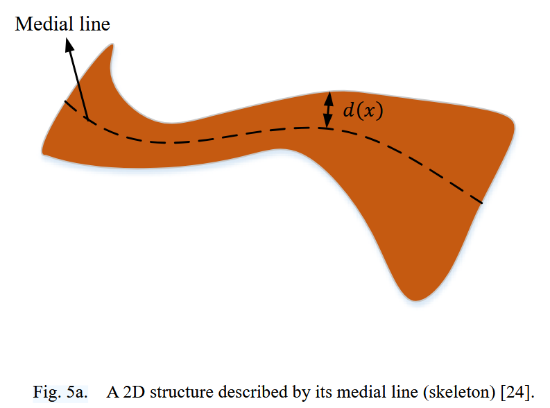
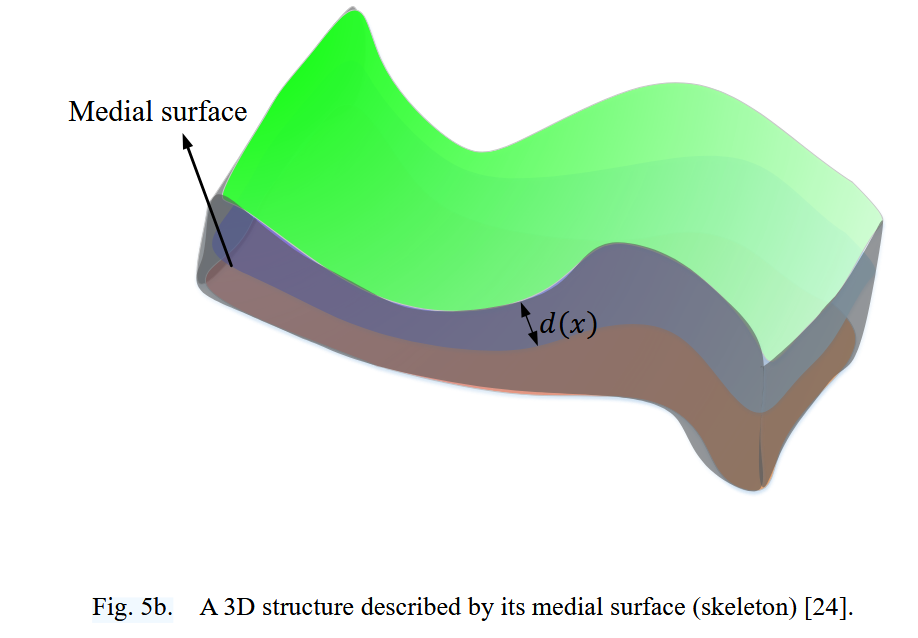

图 5：通过其弯曲的中轴线/面来描述组件的几何形状

由于 MMV 是 MMC 方法的对偶版本，因此相应的技术同样可用于构建星形和非星形空洞的 TDF。实际上，如果仅考虑星形区域的 TDF，则可以采用许多方法，它们大多是使用与星形区域边界相关的中心点和径向距离函数来构建的。

对于 3D 星形区域，沿着 2D 处理的思路，我们提出使用以下方法来构建其 TDF。设 $\Omega$ 是一个关于其中心点 $\boldsymbol{P}_0 = (x_0, y_0, z_0)$ 为星形的闭合区域，则 $\Omega$ 的 TDF 可以写为：
$$ \chi(x, y, z; x_0, y_0, z_0) = \sqrt{(x-x_0)^2 + (y-y_0)^2 + (z-z_0)^2} - r(\theta, \psi) \quad (1) $$
其中 $r = r(\theta, \psi)$ 是 $\partial \Omega$ 上的一点 $\boldsymbol{P}$（其相对于 $\boldsymbol{P}_0$ 的经度角和纬度角分别为 $\theta$ 和 $\psi$）到 $\boldsymbol{P}_0$ 的径向距离（见图 6）。

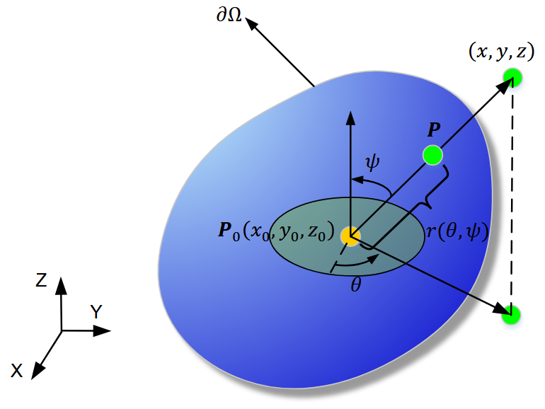

图 6：使用公式 (1) 表示的 3D 星形区域几何形状

相应地，星形空洞所占据的域可以通过 TDF 识别为 $\Omega = \{(x, y, z) | \chi(x, y, z; x_0, y_0, z_0) \le 0\}$。实际上有很多种方法可以构建 $r = r(\theta, \psi)$。例如，我们可以使用以下 **Hermite 插值方案**来插值 $r$：
$$ r(\theta, \psi) = r_1(\theta) r_2(\psi) \big(\psi(\pi - \psi)\big) + c_1 \psi^2 + c_2(\pi - \psi)^2 \quad (2) $$
其中 $r_1(\theta)$ 和 $r_2(\psi)$ 分别是沿经度和纬度方向的两个插值函数，通过一维 Hermite 基函数进行展开，以保证边界曲面的 $C^1$ 平滑连续性。

另外，$r(\theta, \psi)$ 也可以利用 B 样条基函数插值为（**NURBS 形式方案**）：
$$ r(\theta, \psi) = \sum_{i=0}^{n} \sum_{j=0}^{m} N_{i,p}\big(u(\theta)\big) N_{j,q}\big(v(\psi)\big) \boldsymbol{P}_{i,j} \quad (5) $$
其中 $N_{i,p}(u)$ 和 $N_{j,q}(v)$ 是 B 样条基函数，$\boldsymbol{P}_{i,j}$ 是控制点坐标。Hermite 插值方案的优点在于总设计变量数通常少于后者；而 NURBS 形式插值在实现边界曲面局部形状控制上则更加灵活。

综上所述，在上述几何描述下，所提出的基于 MMV 框架的 3D 拓扑优化问题的数学列式可以表示为：
寻找设计变量 $\boldsymbol{D}$ 和 位移场 $\boldsymbol{u}(\boldsymbol{x})$
使得 目标函数 $I(\boldsymbol{D})$ 最小化
满足：
* 有限元弹性平衡方程（弱形式）
* 固体材料体积上限约束 $\int_{D} H\big(\chi_s(\boldsymbol{x}; \boldsymbol{D})\big) \mathrm{d}V \le \bar{V}$
* 其他可能的约束函数

其中 $\boldsymbol{D}$ 是包含各个空洞边界曲面相关设计变量（如中心坐标、插值控制参数）的向量；$\chi_s$ 是整个结构的 TDF，它由各个空洞的 TDF 取极小值构成 $\chi_s = \min(\chi_1, \dots, \chi_{n_v})$。

# 4 数值求解相关问题

在本节中，我们将讨论所提方法在数值实现方面的相关问题。

## 4.1 有限元分析

在当前研究中，采用文献 [32] 中提出的固定网格有限元方法计算结构响应，而无需重新划分网格。该方法是基于拓扑优化中著名的**替代材料模型 (Ersatz Material Model)** [11, 12] 构建的。正如文献 [20, 32] 所指出，在这种方法中，第 $e$ 个有限单元的刚度矩阵计算如下：
$$ \mathbf{K}_e = \int_{\Omega_e} \mathbf{B}^\top \mathbf{D}^*_e \mathbf{B} \, \mathrm{d}V \quad (9) $$
其中 $\mathbf{B}$ 是应变矩阵，$\Omega_e$ 表示第 $e$ 个有限单元占据的区域。在式 (9) 中，$\mathbf{D}^*_e = \rho_e \mathbf{D}_0$，其中 $\mathbf{D}_0$ 和 $\rho_e$ 分别表示固体材料对应的弹性矩阵以及 $\Omega_e$ 中的固体材料体积分数。在当前工作中，单元的体积分数 $\rho_e$ 通过其 8 个节点上的 TDF 值进行插值：
$$ \rho_e = \frac{\sum_{i=1}^8 H_\epsilon \big((\chi_s)_e^i\big)}{8} \quad (10) $$
其中 $H_\epsilon(x)$ 是正则化的 Heaviside 函数，用于将 TDF 映射为 0 到 1 之间的密度值，且带有一个极小的正数 $\gamma$ 以保证结构的全局刚度矩阵非奇异。

**动态自由度 (DOF) 移除技术：**
在传统的基于材料密度的拓扑优化方法中，有限元分析通常在整个设计域上进行。这有两个原因：一是结构拓扑变化是通过设计域中材料的生成/删除来实现的；二是这类方法中优化模型和分析模型是强耦合的。在本文基于显式边界演化的方法中，可以通过在数值优化的每一步中**从有限元模型中移除不必要的 DOFs** 来显著减少与 FEA 相关的计算量。

这可以通过以下方式实现：
1. 首先以直接的方式组装对应于整个设计域 $D$ 的全局刚度矩阵 $\mathbf{K}$。
2. 然后遍历离散设计域的固定有限元网格的每个节点。如果共享特定节点（如节点 $i$）的所有相邻单元都由纯弱材料组成（即它们的 TDF 节点值都小于 0），则将该节点标记为 $T_i = -1$。
3. 最后，从 $\mathbf{K}$ 中删除与 $T$ 值为 $-1$ 的节点相关的所有 DOFs，形成降维后的新全局刚度矩阵 $\tilde{\mathbf{K}}$（示意图见图 7）。

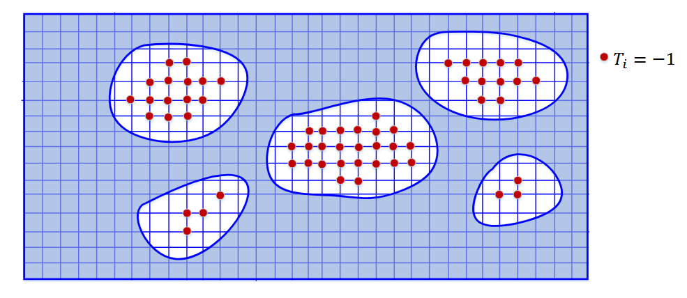

图 7：FE 分析中 DOF 移除技术的示意图 (MMV 方法)

这个修改后的降维矩阵 $\tilde{\mathbf{K}}$ 将用于后续的 FEA，求解出的位移矢量 $\tilde{\boldsymbol{u}}$（即 $\tilde{\boldsymbol{u}} = \tilde{\mathbf{K}}^{-1} \tilde{\boldsymbol{f}}$）将直接用于计算灵敏度。

由于在提出的 MMV 方法中，优化总是从包含合理传力路径的可行设计开始，并且如果设计变量的移动步长不大，在整个优化过程中固相区域中极有可能始终存在一条传力路径。因此，即便在拓扑演化时设计域中偶尔出现了孤立的小岛，上述处理方式依然适用。通过使用上述处理，有限元分析的时间可以大幅缩短（例如**缩短 10 倍**），特别是当允许的固体材料体积较小时。相比文献中为变密度法开发的 DOF 移除技术，本文描述的处理方法更加直截了当，并且可以在数值上更稳健地实现。同样值得注意的是，尽管上述自由度移除技术是针对基于 MMV 的方法开发的，但它实际上也适用于基于 MMC 的方法。两者的本质区别在于，在基于 MMC 的方法中，只有当所有组件已经连接并在设计域中形成传力路径时，才允许移除自由度（参考图 8）。

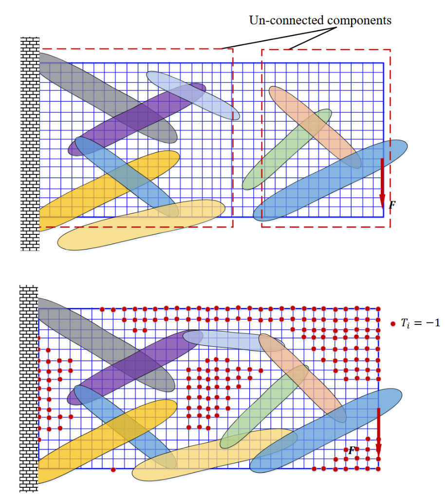

图 8：基于 MMC 的拓扑优化的示意图（在此情形下允许移除 DOF）

关于这方面相应的技术细节将在另外一项独立的工作中予以报道。

## 4.2 灵敏度分析

灵敏度分析可以以与文献 [32] 类似的方式执行。对于正在考虑的一般目标/约束泛函 $I$，通常 $I$ 相对于某个几何设计变量 $a$ 的灵敏度可以在离散的伴随法框架下表示为：
$$ \frac{\partial I}{\partial a} = \tilde{\boldsymbol{w}}^\top \frac{\partial \tilde{\mathbf{K}}}{\partial a} \tilde{\boldsymbol{u}} = \dots \quad (12) $$
其中 $\tilde{\boldsymbol{w}}$ 是伴随位移矢量，$\tilde{\boldsymbol{u}}$ 是主位移矢量。从数值实现的角度来看，上述处理下灵敏度计算的关键点是求导 $\partial \chi_s / \partial a$ 这个量。正如文献 [21, 32] 中所指出的，在所提出的显式几何方法中可以很容易地实现这一点，因为 TDF $\chi_s$ 本身就是设计变量 $a$ 的显式函数。此外，$\partial \chi_s / \partial a$ 也可以直接通过非常高效的有限差分商方法以近似求出，且精度足以满足优化需求。

# 5 数值算例

在本节中，提供了几个数值算例来证明所提方法在设计最优 3D 结构时的有效性。所考虑的目标泛函和约束泛函分别是结构的柔顺度 (Compliance) 和固体材料的可用体积。由于本节的主要目的是测试所建议方法的数值性能，除非另有说明，材料、载荷和几何数据均选取为无量纲形式。固体材料的杨氏模量和泊松比分别取为 $E_s = 1$ 和 $\nu_s = 0.3$。在所有考察的例子中，均采用均匀的 8 节点六面体单元进行有限元离散。优化问题通过著名的移动渐近线方法 (MMA) [34] 求解。所有计算均在 Dell-T5810 (3.7GHz，128GB 内存) 工作站上进行。

## 5.1 短悬臂梁算例

首先考察经典的短悬臂梁问题。所考虑问题的几何形状、边界条件和外部载荷如图 9 所示。

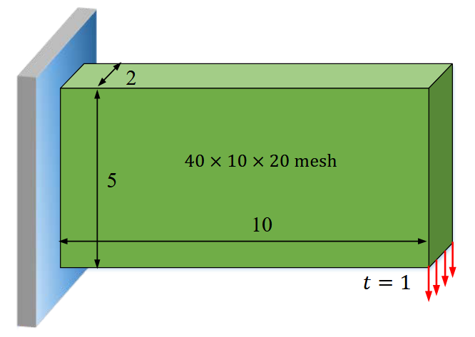

图 9：短悬臂梁问题的几何形状、边界条件和外部载荷

一个 10 × 2 × 5 的长方体设计域通过 40 × 10 × 20 的有限元网格进行离散。设计域的左侧固定，在设计域右侧底面上施加大小为 1 的分布垂直载荷。可用固体材料体积的上限设定为 $\bar{V} = 0.15 \times |D| = 15$。

算例采用了由 34 个空洞组成的两种初始设计，如图 10 所示，分别采用 Hermite 和 NURBS 插值方案来描述这些空洞。

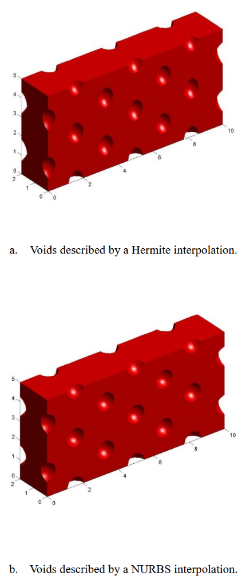

图 10：短悬臂梁问题的初始设计。(a) 由 Hermite 插值描述的空洞；(b) 由 NURBS 插值描述的空洞

最终的优化结构如图 11 所示，目标泛函的对应值分别为 $I = 127.10$ 和 $I = 128.15$，这两种插值方案的结果几乎相同。

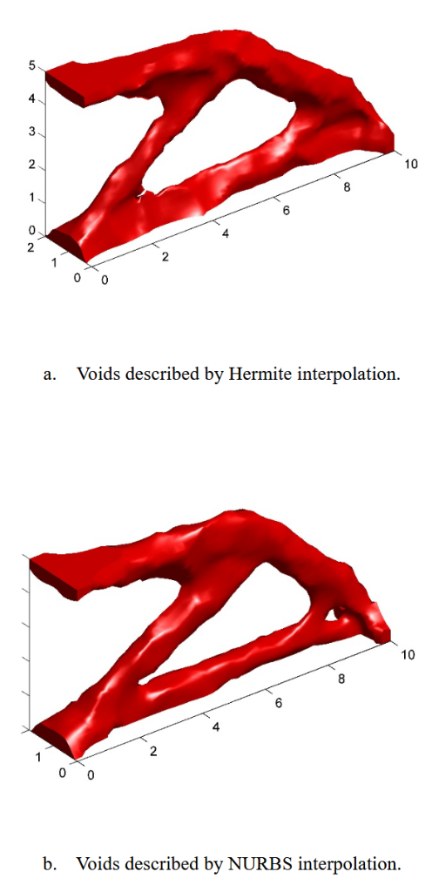

图 11：短悬臂梁问题的优化结构。(a) 由 Hermite 插值描述的空洞；(b) 由 NURBS 插值描述的空洞

从图 12 所示的优化过程的中间步骤可以观察到，最优的结构拓扑是通过空洞的变形 (morphing)、重叠 (overlapping) 和隐藏 (hiding) 逐渐实现的。

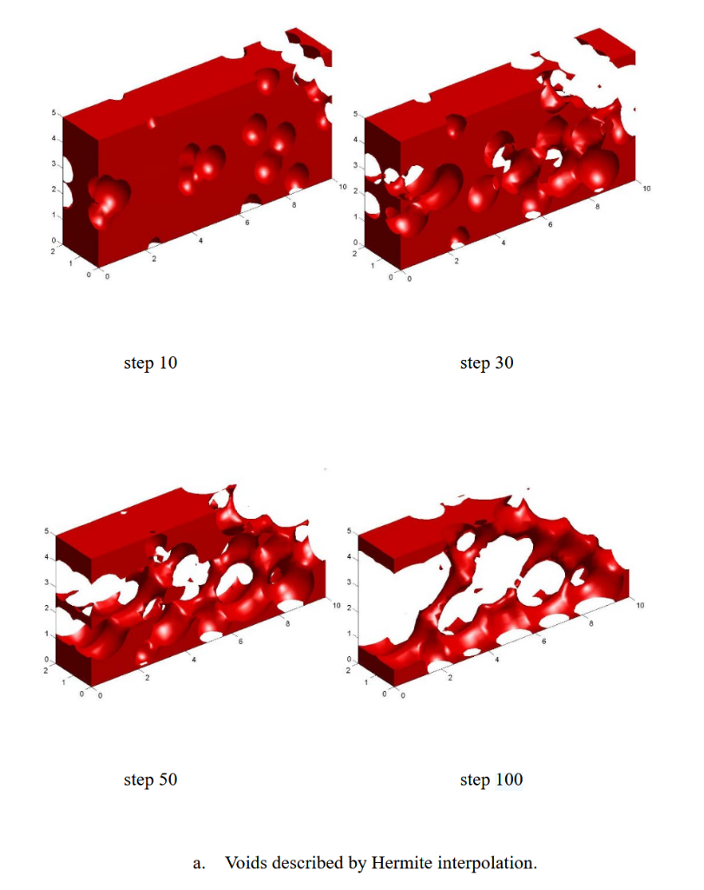
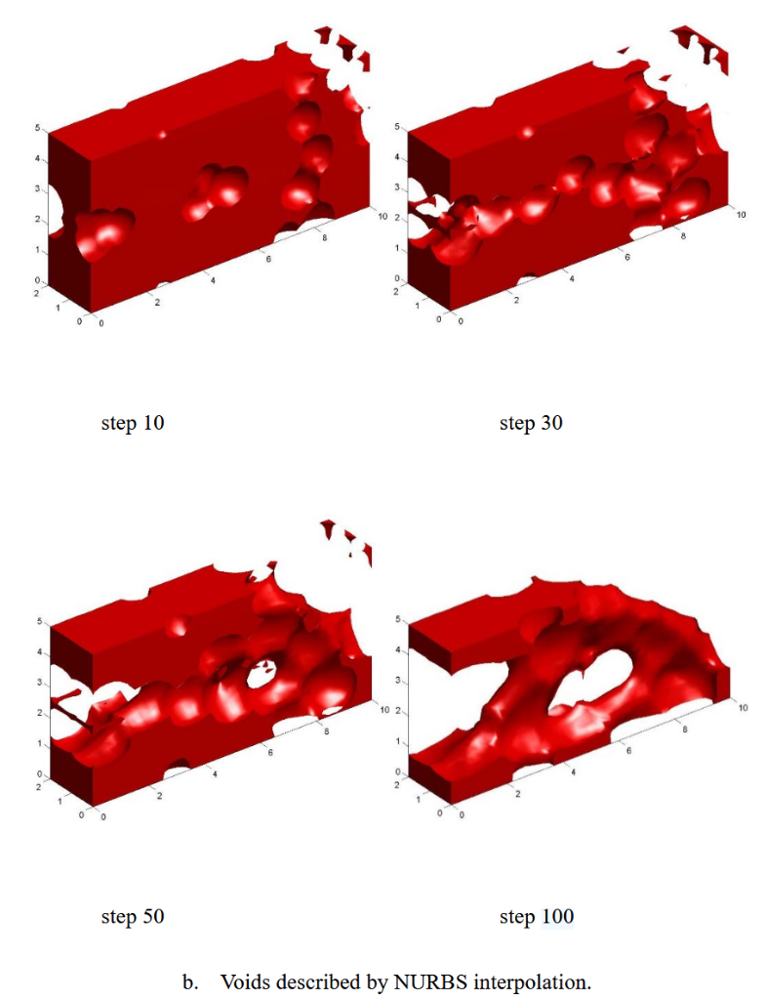

图 12：优化过程的中间步骤。(a) 由 Hermite 插值描述的空洞；(b) 由 NURBS 插值描述的空洞

与同样通过分布在设计域中的一组空洞来获得最优拓扑的水平集 (Level Set) 方法相比，MMV 方法的显著特点是：**结构边界的演化是由一组具有明确几何意义的参数显式驱动的**。

值得注意的是，在所提出的问题中，只有 1394 个（对于 Hermite 插值）和 2210 个（对于 NURBS 插值）设计变量，这完全独立于有限元网格的分辨率，且远少于传统方法中使用的数量（对于所采用的 FE 分辨率，大约为 40 × 10 × 20 = 8000 个）。当采用数学规划方法作为优化器时（例如本工作中所使用的 MMA），拥有相对较少的设计变量显然可以有效缩短优化阶段的计算时间。

此外，有限元分析 (FEA) 在每个迭代步中的 CPU 时间历史曲线如图 13 所示。

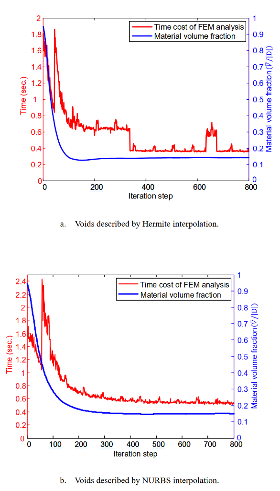

图 13：目标泛函和有限元分析计算成本的迭代历史曲线。(a) 由 Hermite 插值描述的空洞；(b) 由 NURBS 插值描述的空洞

值得注意的是，通过使用 4.1 小节中建议的自由度 (DOF) 移除技术，与 FEA 相关的计算量随着实际固体材料体积的减少而大幅降低。从图 13 可以观察到，在 200 个迭代步内，FEA 的 CPU 时间可以从大约 1.70 秒（对应于使用全部 DOF 的 FEA）降至 0.71 秒。因此，固体材料体积越小，单个迭代步中的 FEA 速度就越快。然而，使用传统方法（特别是基于单元的方法）很难获得这种计算优势。

此外，为了进行对比，该问题还在包含更多空洞的不同初始设计下利用 MMV 方法进行了求解。这一次，初始设计中总共包含 55 个空洞（如图 14 所示），并且每个空洞仍然通过 NURBS 插值方案进行描述。

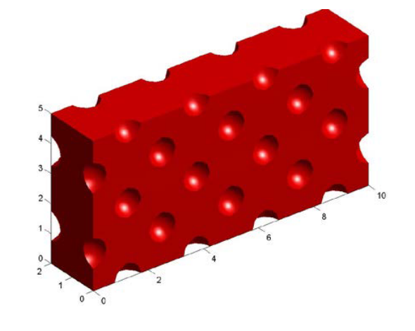

图 14：短悬臂梁问题包含 55 个空洞的初始设计

在这种情况下，设计变量的总数为 3575 个。优化后的结构如图 15 所示，相应的目标泛函值为 $I = 128.76$。

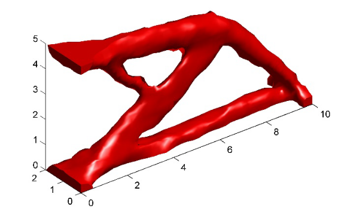

图 15：从 55 个初始空洞获得的短悬臂梁问题优化结构

由于固体材料的可用体积分数没有发生变化，因此这种情况下的 FEA 的 CPU 时间与上述情况（初始设计包含 34 个空洞）几乎相同。

## 5.2 L 形椅算例

在本例中，考虑一个 L 形椅问题。设计域、外部载荷和边界条件如图 16 所示。

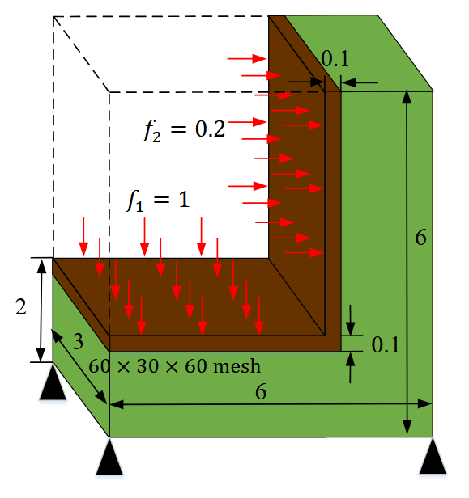

图 16：L 形椅算例的几何形状、边界条件和外部载荷

设计域左上角一个 4 × 3 × 4 的长方体区域被设定为非设计空洞域。在非设计固体域的表面（深色高亮显示）分别施加密度为 1 和 0.2 的两个分布载荷。设计域通过 60 × 30 × 60 的有限元网格进行离散，该问题的可用固体材料上限设定为 $\bar{V} = 0.1 \times |D| = 10.8$。

对于本例，仅使用 NURBS 插值来描述每个空洞的形状。如图 17 所示，初始设计中有 66 个空洞，总设计变量数为 66 × 65 = 4290 个。

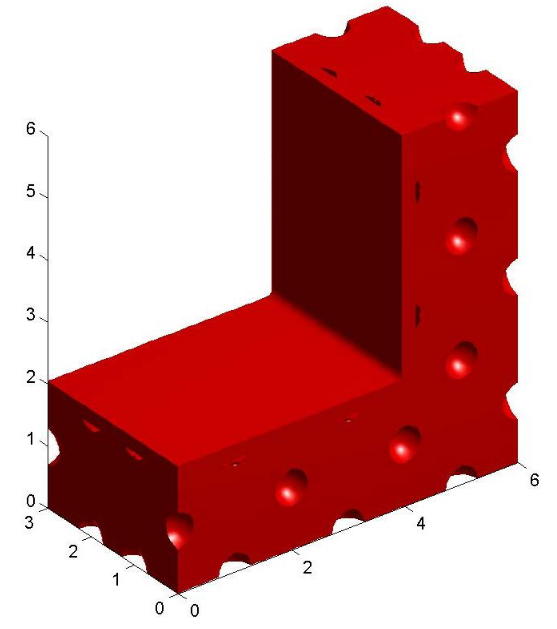

图 17：L 形椅问题包含 66 个空洞的初始设计

相应的优化结构如图 18 所示，目标泛函值为 3266.20。从图 18 可以看出，通过一组具有复杂形状的空洞构建了有效的传力路径。在非设计固体域的背面和底部，分别获得了两条弯曲和四条笔直的传力路径来支撑该结构。图 18 还绘制了构成优化结构无材料部分的特定空洞（以绿色表示）。在这部分中，该空洞由仅包含 31 个激活的插值点的单个 NURBS 曲面包围。这清楚地证明了所提出的几何表示方案描述复杂形状结构边界的能力。

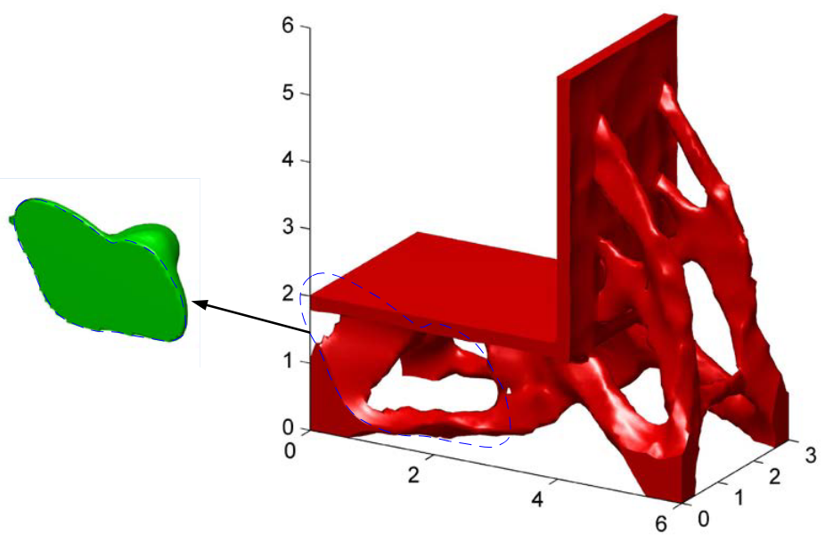

图 18：L 形椅问题的优化结构

FEA 的 CPU 时间历史曲线如图 19 所示。在优化的早期阶段（200 步之前），FEA 使用几乎全部自由度（约 346000 个）进行，对应的 CPU 时间约为 180.00 秒。然而，在 200 步之后，FEA 通常使用减少的自由度（约 87000 个）进行，对应的 CPU 时间减少至 11.10 秒，这仅仅是不使用自由度移除技术时的 1/16。可以合理预期，当使用更多单元进行有限元离散时，节省的 CPU 时间可以更高。

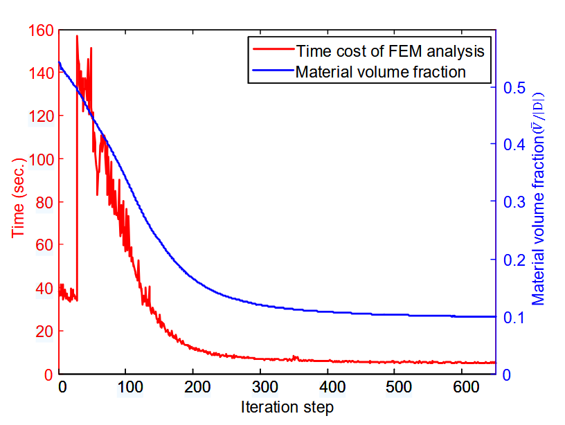

图 19：L 形椅问题中有限元分析计算成本和材料体积分数的迭代历史曲线

在优化过程中，结构柔顺度和体积的迭代历史曲线也展示在图 20 中。

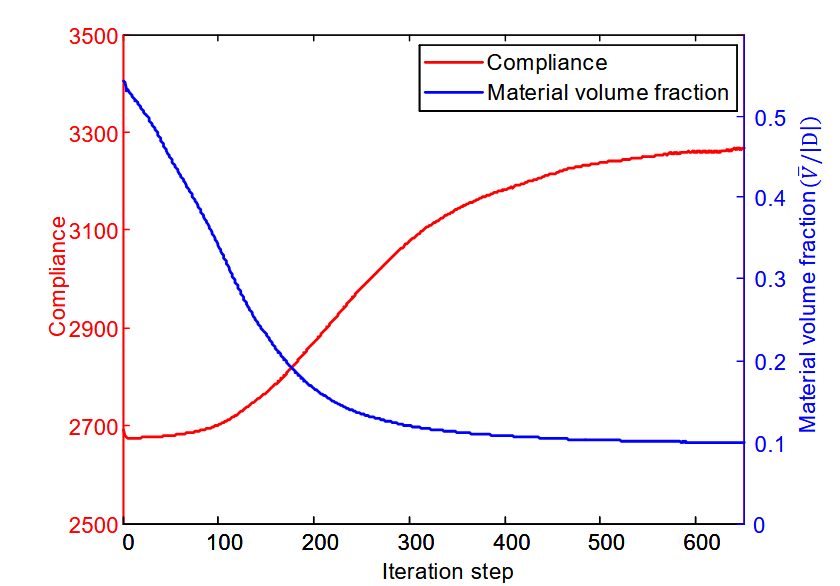

图 20：L 形椅问题中结构柔顺度和材料体积分数的迭代历史曲线

## 5.3 扭转梁算例

为了进一步展示所提方法处理 3D 拓扑变化的灵活性，本文还考察了图 21 所示的扭转梁算例。设计域的几何形状、边界条件和外部载荷均在图 21 中绘出。

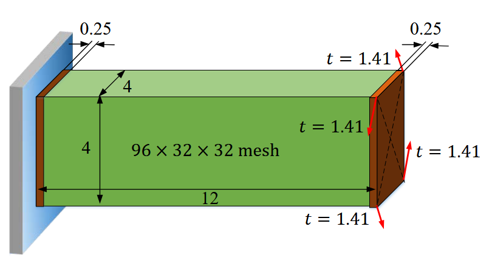

图 21：扭转梁算例的几何形状、边界条件和外部载荷

对于本例，这个 12 × 4 × 4 的长方体设计域由 96 × 32 × 32 的有限元网格离散。左侧和右侧（两者的尺寸均为 0.25 × 4 × 4）被定义为非设计固体域。在设计域右侧的四个顶点上分别施加了四个载荷。可用固体材料体积的约束条件取为 $V \le 0.15 \times |D| = 28.8$。

如图 22a 所示，问题的初始设计由 106 个空洞组成，每个空洞由一个具有 62 个插值点和 1 个中心点的 NURBS 曲面描述。

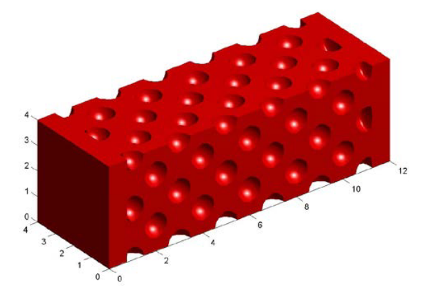

(a)

这意味着设计变量的总数为 (3 + 62) × 106 = 6890，这比相同 FE 网格下传统方法相关的设计变量数（即 96 × 32 × 32 = 98304）要少得多。图 22b 绘制了通过所提方法获得的相应优化结构。

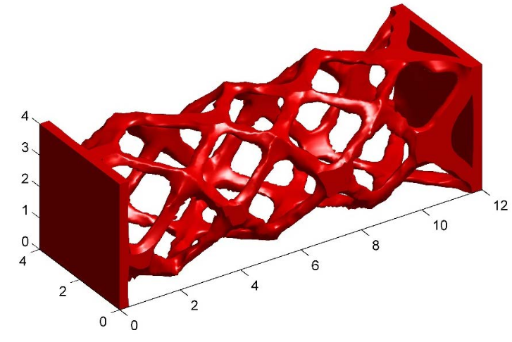

(b)

图 22：扭转梁算例。(a) 包含 106 个空洞的初始设计；(b) 通过基于 MMV 方法获得的优化结构

从该图可以观察到，优化结构实际上是由小厚度的固体杆件构成的类似圆柱壳的网络。通过将优化后的材料分布形式与初始形式进行对比，清晰地证明了所提几何表示方案的灵活性。同时，该问题也利用基于 MMC 的方法 [20] 从图 23a 所示的初始设计进行了求解。

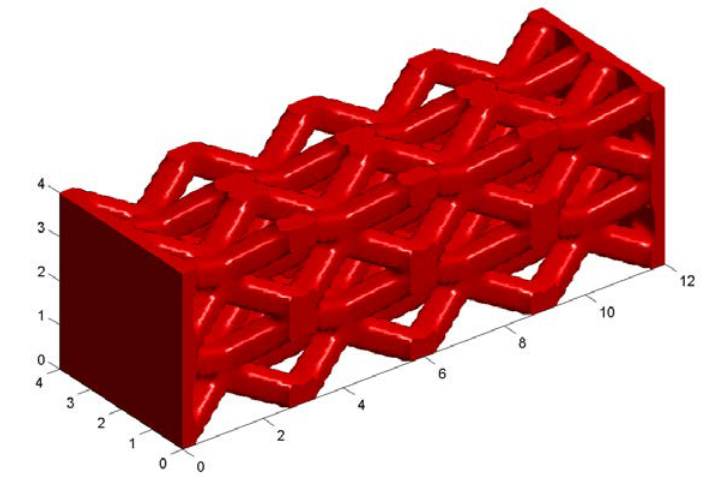

(a)

这个初始设计由 128 个组件组成，因此设计变量的总数仅为 128 × 9 = 1152 个。图 23b 绘制了使用 MMC 方法获得的优化结构。

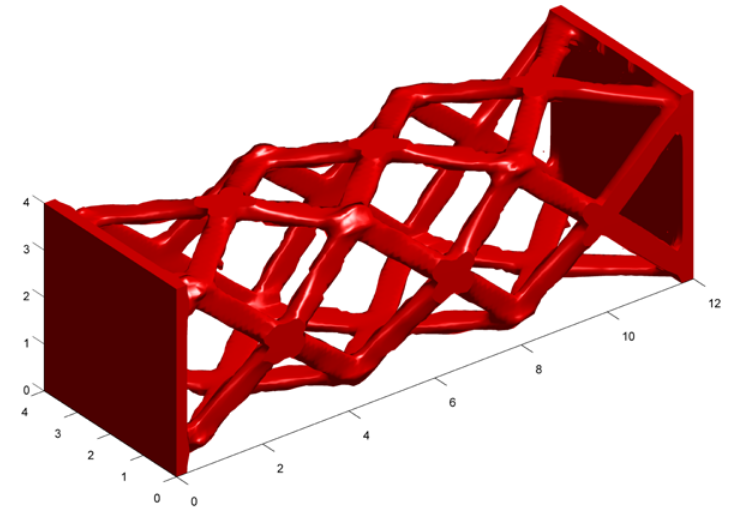

(b)

图 23：扭转梁算例。(a) 包含 128 个组件的初始设计；(b) 通过基于 MMC 方法获得的优化结构

图 22b 和图 23b 表明，由基于 MMV 和 MMC 的方法所获得的优化结构在本质上是相似的，从某种意义上说，两者均为类似圆柱壳的网格结构，并且其中一个结构可以被视为由另一个结构沿轴向发生刚体平移而产生。两个优化结构之间的主要区别在于，MMV 方法的结果中传力路径直接与载荷点相连，而在 MMC 方法的结果中，传力路径源自右侧非设计域的中点。这两个优化结构对应的结构柔顺度值分别为 2643.54（基于 MMV 的方法）和 2742.12（基于 MMC 的方法）。FEA 的 CPU 时间历史曲线同样展示在图 24 中。

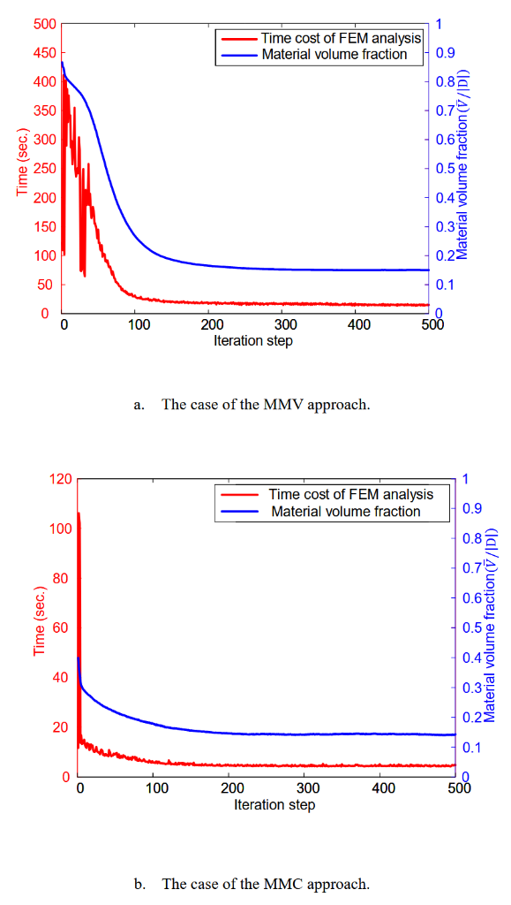

图 24：扭转梁算例在 (a) MMV 方法和 (b) MMC 方法下的计算时间成本和材料体积分数迭代历史曲线

该图再次证明了，在基于 MMV/MMC 的拓扑优化框架下，所提出的 DOF 移除技术对于提高 3D 拓扑优化问题的求解效率是非常有效的。随着优化迭代的进行，无论是 MMV 还是 MMC 方法，FEA 的求解时间都可以降低近两个数量级，这是因为参与 FEA 的自由度数已从优化初期的 $3 \times 10^5$ 减少到了 100 步（MMV 方法中）或 20 步（MMC 方法中）迭代之后的 $1 \times 10^5$。在 MMV 方法和 MMC 方法优化过程中获得的一些中间结果也分别展示在图 25 中。

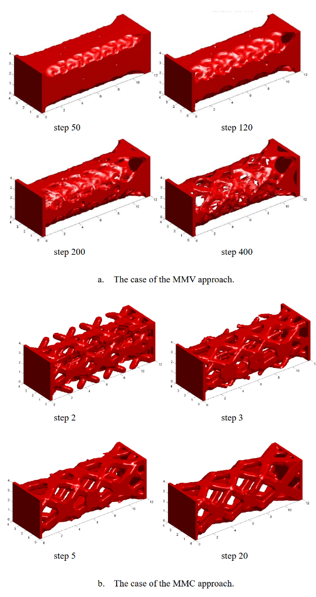

图 25：扭转梁算例的迭代优化中间过程。(a) MMV 方法；(b) MMC 方法

从这些图中可以看出，基于 MMC 的方法在构建有效的传力路径时效率更高（仅需约 10 个迭代步），而基于 MMV 的方法在收敛性上更稳定。最后同样值得注意的是，基于 MMV/MMC 方法获得的所有优化结构实际上都是纯粹黑白分明的，并且不包含传统方法（特别是针对 3D 问题）中不可避免存在的灰色单元。

值得注意的是，对不同方法的总求解时间进行直接比较是不合适的。这是因为总求解时间取决于总迭代次数，而总迭代次数在很大程度上是由数值实现的细节（例如滤波半径的大小、延拓法的参数、MMA 优化器中的参数等）决定的，最重要的一点是，我们无法保证我们以最有效的方式实现了用于比较的各种方法。在这种情况下，提供不同方法在某一个代表性迭代步中不同计算阶段对应的求解时间来展示我们方法的性能，似乎是合理的。在这个例子中可以发现，在第 2 步时，MMV 和 SIMP 方法（使用文献 [35] 中提供的开源代码）中 FEA 的求解时间（秒）分别为 109.42 和 116.86；MMV 和 SIMP 方法中 MMA 的求解时间分别为 0.06 和 47.61。在第 150 步时，MMV 和 SIMP 方法中 FEA 的求解时间分别为 20.36 和 106.95；MMV 和 SIMP 方法中 MMA 的求解时间分别为 0.06 和 46.04。

# 6 总结

本文在最先于文献 [22, 23] 初始化的移动可变形空洞 (MMV) 方法的基础上，开发了一种求解 3D 拓扑优化问题的新方法。该方法最吸引人的特点在于，它不仅能减少与优化问题相关的设计变量总数，而且还为通过有效的单元移除技术大幅削减自由度 (DOFs) 数量提供了可能性。由于在所提出的求解方法中，优化模型和分析模型是完全解耦的，因此后一项处理得以实现。数值算例表明，困扰 3D 拓扑优化问题的两大挑战，即庞大的设计变量和庞大的自由度，已通过所提方法得到很好的解决。此外，与 MMC 方法一样，优化结构形状和拓扑的分辨率完全独立于有限元分析的网格分辨率。另一个有趣的研究课题是利用边界元法 (BEM) 进行结构响应分析。在这个方面，传统的 BEM 和最近发展的等几何 BEM 方法 [36] 都可用于减少结构分析的自由度。同样值得注意的是，当前方法仅在单核计算环境中实现。可以合理预期，如果将所提方法部署到并行计算环境中，将能获得更高得多的求解效率。目前正沿着这个方向开展深入的研究工作。

# 附录

在 Hermite 几何描述方案下，式 (12) 中 $\chi$ 对每个设计变量的导数表达式可以计算如下：

$$
\frac{\partial \chi}{\partial x_0} = \frac{x - x_0}{\sqrt{(x - x_0)^2 + (y - y_0)^2 + (z - z_0)^2}} , \tag{A1a}
$$

$$
\frac{\partial \chi}{\partial y_0} = \frac{y - y_0}{\sqrt{(x - x_0)^2 + (y - y_0)^2 + (z - z_0)^2}} , \tag{A1b}
$$

$$
\frac{\partial \chi}{\partial z_0} = \frac{z - z_0}{\sqrt{(x - x_0)^2 + (y - y_0)^2 + (z - z_0)^2}} , \tag{A1c}
$$

$$
\frac{\partial \chi}{\partial r_i^\theta} = \frac{\partial r(\theta, \psi)}{\partial r_i^\theta} = \frac{\partial r_1(\theta)}{\partial r_i^\theta} r_2(\psi)[\psi(\pi - \psi)] + \frac{r_m^\psi}{n} \psi^2 + \frac{r_0^\psi}{n} (\pi - \psi)^2, \tag{A1d}
$$

$$
\frac{\partial \chi}{\partial f_i^\theta} = \frac{\partial r(\theta, \psi)}{\partial f_i^\theta} = \frac{\partial r_1(\theta)}{\partial f_i^\theta} r_2(\psi)[\psi(\pi - \psi)], \tag{A1e}
$$

$$
\frac{\partial \chi}{\partial r_j^\psi} = \frac{\partial r(\theta, \psi)}{\partial r_j^\psi} = \begin{cases} 
r_1(\theta) \frac{\partial r_2(\psi)}{\partial r_j^\psi} [\psi(\pi - \psi)] + \frac{\psi^2}{n} \sum_{i=1}^n r_i^\theta, & \text{if } j = 0, \\
r_1(\theta) \frac{\partial r_2(\psi)}{\partial r_j^\psi} [\psi(\pi - \psi)] + \frac{(\pi - \psi)^2}{n} \sum_{i=1}^n r_i^\theta, & \text{if } j = m, \\
r_1(\theta) \frac{\partial r_2(\psi)}{\partial r_j^\psi} [\psi(\pi - \psi)], & \text{otherwise}, 
\end{cases} \tag{A1f}
$$

$$
\frac{\partial \chi}{\partial f_j^\psi} = \frac{\partial r(\theta, \psi)}{\partial f_j^\psi} = r_1(\theta) \frac{\partial r_2(\psi)}{\partial f_j^\psi} [\psi(\pi - \psi)], \tag{A1g}
$$

其中，

$$
\frac{\partial r_1(\theta)}{\partial r_i^\theta} = \begin{cases} 
H_2^{(0)}(\xi), & \text{if } \theta_{i-1} \le \theta < \theta_i, \ i = 1, \dots, n, \\
H_1^{(0)}(\xi), & \text{if } \theta_i \le \theta < \theta_{i+1}, \ i = 0, \dots, n-1, \\
0, & \text{otherwise}, 
\end{cases} \tag{A2a}
$$

$$
\frac{\partial r_1(\theta)}{\partial f_i^\theta} = \begin{cases} 
H_2^{(1)}(\xi), & \text{if } \theta_{i-1} \le \theta < \theta_i, \ i = 1, \dots, n, \\
H_1^{(1)}(\xi), & \text{if } \theta_i \le \theta < \theta_{i+1}, \ i = 0, \dots, n-1, \\
0, & \text{otherwise}, 
\end{cases} \tag{A2b}
$$

$$
\frac{\partial r_2(\psi)}{\partial r_j^\psi} = \begin{cases} 
H_2^{(0)}(\eta), & \text{if } \psi_{j-1} \le \psi < \psi_j, \ j = 1, \dots, m, \\
H_1^{(0)}(\eta), & \text{if } \psi_j \le \psi < \psi_{j+1}, \ j = 0, \dots, m-1, \\
0, & \text{otherwise}, 
\end{cases} \tag{A2c}
$$

$$
\frac{\partial r_2(\psi)}{\partial f_j^\psi} = \begin{cases} 
H_2^{(1)}(\eta), & \text{if } \psi_{j-1} \le \psi < \psi_j, \ j = 1, \dots, m, \\
H_1^{(1)}(\eta), & \text{if } \psi_j \le \psi < \psi_{j+1}, \ j = 0, \dots, m-1, \\
0, & \text{otherwise}.
\end{cases} \tag{A2d}
$$

在 NURBS 几何描述方案下，相应的表达式分别为：

$$
\frac{\partial \chi}{\partial x_0} = \frac{x - x_0}{\sqrt{(x - x_0)^2 + (y - y_0)^2 + (z - z_0)^2}} , \tag{A3a}
$$

$$
\frac{\partial \chi}{\partial y_0} = \frac{y - y_0}{\sqrt{(x - x_0)^2 + (y - y_0)^2 + (z - z_0)^2}} , \tag{A3b}
$$

$$
\frac{\partial \chi}{\partial z_0} = \frac{z - z_0}{\sqrt{(x - x_0)^2 + (y - y_0)^2 + (z - z_0)^2}} , \tag{A3c}
$$

$$
\frac{\partial \chi}{\partial r_{i,j}} = \frac{\partial r(\theta, \psi)}{\partial r_{i,j}}, \ i = 0, \dots, n, \ j = 0, \dots, m, \tag{A3d}
$$

$$
\frac{\partial r(\theta, \psi)}{\partial r_{i,j}} = \frac{1}{r(\theta, \psi)} \left( S_x(\theta, \psi) \frac{\partial S_x(\theta, \psi)}{\partial r_{i,j}} + S_y(\theta, \psi) \frac{\partial S_y(\theta, \psi)}{\partial r_{i,j}} + S_z(\theta, \psi) \frac{\partial S_z(\theta, \psi)}{\partial r_{i,j}} \right), \ i = 0, \dots, n, \ j = 0, \dots, m, \tag{A3e}
$$

以及

$$
\frac{\partial S_x(u, v)}{\partial r_{k,l}} = \sum_{i=0}^n \sum_{j=0}^m N_{i,p}(u) N_{j,q}(v) \frac{\partial P_{i,j}^x}{\partial r_{k,l}}, \ k = 0, \dots, n, \ l = 0, \dots, m, \tag{A4a}
$$

$$
\frac{\partial S_y(u, v)}{\partial r_{k,l}} = \sum_{i=0}^n \sum_{j=0}^m N_{i,p}(u) N_{j,q}(v) \frac{\partial P_{i,j}^y}{\partial r_{k,l}}, \ k = 0, \dots, n, \ l = 0, \dots, m, \tag{A4b}
$$

$$
\frac{\partial S_z(u, v)}{\partial r_{k,l}} = \sum_{i=0}^n \sum_{j=0}^m N_{i,p}(u) N_{j,q}(v) \frac{\partial P_{i,j}^z}{\partial r_{k,l}}, \ k = 0, \dots, n, \ l = 0, \dots, m. \tag{A4c}
$$

