# Arbitrary-Order Hu–Zhang Mixed Finite Element Methods for Density-Based Topology Optimization

## Abstract

密度法拓扑优化通常采用基于位移的经典有限元模型，并在单元内部由位移梯度后处理恢复应力。该处理易于实现，但在以应力精度、材料近不可压缩性或局部应力约束为核心的设计问题中，位移求导带来的应力降阶与不连续误差会直接污染目标函数、约束函数及其伴随灵敏度。本文将以对称应力和位移为独立未知量的 Hu–Zhang 混合有限元系统地引入密度法拓扑优化，并把已有的最低阶、规则网格离散推广到任意多项式次数和单纯形网格。首先，从带非齐次 Neumann 边界条件的 Hellinger–Reissner 变分原理出发，通过设计无关的牵引提升构造离散状态方程，确立总应力在互补能目标和灵敏度中的统一作用。随后，建立基于单纯形几何实体分解的任意次 Hu–Zhang 空间构造与低阶跳量稳定化机制，并提出将自由度管理视作法向迹连续性管理的算法实现体系，包括全局参考标架生成、两单元局部角点松弛以及鞍点矩阵的优化循环复用策略。进一步地，本文给出双参数材料插值、互补能柔顺度、无密度分母的表观应力局部约束、增广拉格朗日求解及一致伴随灵敏度表达。数值研究包含制造解高低阶收敛性验证、精度—成本 Pareto 比较、参数消融、近不可压缩结构优化、局部应力约束优化以及冻结设计的统一高阶复核，系统阐明了独立应力近似在不同离散次数和复杂力学条件下的精度、鲁棒性与适用边界。

**关键词 (Key words)：** Hu–Zhang 混合有限元；密度法拓扑优化；Hellinger–Reissner 变分原理；近不可压缩弹性；局部应力约束 (Hu–Zhang mixed finite element; density-based topology optimization; Hellinger–Reissner principle; nearly incompressible elasticity; local stress constraint)

**AMS 主题分类 (AMS subject classifications)：** 65N30, 74S05, 74P05, 74B05

---

## 1 Introduction

拓扑优化（Topology Optimization）通过在给定设计域内优化材料空间分布，为高性能轻量化结构提供了系统化的数值设计工具。以 SIMP（Solid Isotropic Material with Penalization）为代表的连续体密度法因列式清晰、算法成熟及工程适应性广而得到广泛应用（Bendsøe，1989；Bendsøe 与 Sigmund，2003；Andreassen 等，2011）。在经典实现中，线弹性控制方程通常采用基于标准协调位移的有限元离散（LFEM），应力张量则在单元内部由离散位移的数值梯度后处理恢复。这种“位移主导”方案对于以整体刚度最大化（柔顺度最小化）为目标的常规优化通常足够有效，但在以局部应力精确评估或近不可压缩材料为核心的设计问题中面临严峻的离散误差与数值瓶颈。

一方面，局部应力是高度网格敏感的高维约束。在标准位移元中，位移形函数求导导致应力逼近精度降低一阶（如一次元求导仅给出分片常数应力），且在单元交界面上法向与切向应力均存在非物理的不连续跳跃。若直接将后处理得到的离散应力代入局部约束，离散误差、平滑策略与优化模型彼此耦合，极易诱发局部应力震荡或使结构陷入过优化（Cheng 与 Guo，1997；Duysinx 与 Bendsøe，1998；Le 等，2010；París 等，2010；da Silva 等，2019）。另一方面，当材料 Poisson 比逼近不可压缩极限（$\nu_0 \to 0.5$）时，平面应变或三维连续体的体积模量相对于剪切模量趋于无穷大，强加了严格的无散度变形约束（$\operatorname{div}\boldsymbol{u} \approx 0$）。标准低阶位移元由于离散位移空间缺乏足够的变形自由度，出现严重的体积自锁（Volumetric Locking），导致计算刚度虚假增大，在拓扑演化过程中诱发病态的细长连杆与虚假铰链（Sigmund 与 Clausen，1998；Puso 与 Solberg，2006；Kumar 与 Suresh，2017）。

混合有限元（Mixed Finite Element Method）为克服上述力学难题提供了本质的变分求解路径（Brezzi 与 Fortin，1991；Boffi 等，2013）。基于 Hellinger–Reissner 双变量变分原理，对称应力 $\boldsymbol{\sigma}$ 与位移 $\boldsymbol{u}$ 同时作为独立未知量。应力试探函数直接属于对称张量 $H(\operatorname{div})$ 空间，天然保证了跨单元边界法向牵引力（Normal Traction）的严格连续性，且应力与位移的散度平衡方程在弱形式下精确满足。由于柔度双线性型在不可压缩极限下保持有界，满足离散 inf-sup（Babuška–Brezzi）稳定性的混合元能够从根本上免疫体积自锁（Stenberg，1986；Brezzi 与 Adams，2003）。已有 truly-mixed 拓扑优化研究表明，直接离散应力与位移能够有效用于近不可压缩结构设计与应力约束设计（Bruggi 与 Venini，2007、2008；Bruggi 与 Duysinx，2012；Bruggi，2016）。然而，现有混合元拓扑优化文献大多受限于最低阶离散、四边形规则网格或特定杂交构造。对于非结构单纯形（三角形/四面体）网格，构建对称符合的 $H(\operatorname{div})$ 空间长期以来存在巨大的数学困难（Arnold 与 Winther，2002；Adams 与 Cockburn，2005；Arnold 等，2007）。

Hu–Zhang 混合元（Hu 与 Zhang，2014；Hu，2015）是对称应力有限元构造的重要突破。其局部应力空间由单纯形上的多项式空间 $\mathbb{P}_k(\mathbb{S})$ 构成，并通过几何实体分解显式识别法向与切向分量，建立了任意多项式次数的协调空间族。Chen 等（2017）进一步为 $k \le d$ 的低阶格式建立了对称矩阵跳量稳定化；Hu 与 Ma（2021）给出了复杂边界角点处的顶点应力连续性松弛理论；Chen 等（2018a，2018b）研究了其快速辅助空间预条件器与后验误差估计；Chen 等（2024）进一步完善了高阶单纯形张量元的几何分解与高效算法。结合高阶有限元在拓扑优化中的发展趋势（Zegard 与 Paulino，2016），如何将这类任意次、单纯形网格上的对称应力离散完整嵌入密度法拓扑优化，仍存在从变分一致性、算法数据结构到优化灵敏度的体系化衔接空白。

本文围绕上述理论与算法瓶颈，基于开源有限元框架 FEALPy（Wei 等）建立了一套适用于单纯形网格的任意次 Hu–Zhang 混合有限元密度拓扑优化计算框架。本文的主要贡献概括如下：
1. **任意次单纯形网格混合拓扑优化变分框架**：从带非齐次 Neumann 边界的 Hellinger–Reissner 变分原理出发，引入设计无关的牵引提升（Traction Lifting），建立任意次 Hu–Zhang 离散状态方程，并在互补能目标函数和增广拉格朗日伴随灵敏度中始终保持总应力的一致性表达；
2. **一致的自由度管理与算法实现体系**：将 Hu–Zhang 单元的自由度管理归结为法向迹连续性管理，提出了包含网格全局参考标架确定、基函数直接全局构造、两单元局部角点松弛以及鞍点矩阵优化循环复用的高效实现体系；
3. **困难力学工况验证、公平比较与统一高阶复核**：设计了包含高低阶前向收敛制造解、精度—成本 Pareto 比较、离散参数消融、近不可压缩设计、无分母表观局部应力约束优化以及冻结设计统一高阶复核的验证链条，客观厘清了独立应力近似的力学优势与计算代价边界。

本文余下内容安排如下：第 2 节（Preliminaries）介绍连续线弹性方程、Hellinger–Reissner 混合变分形式与连续牵引提升；第 3 节（Arbitrary-Order Hu–Zhang Mixed Finite Elements）阐述单纯形上的张量几何分解、任意次空间构造、低阶跳量稳定化、角点局部松弛与离散鞍点系统装配；第 4 节（Density-Based Topology Optimization with Independent Stress）构建双参数材料插值、互补能柔顺度模型、无奇异表观应力约束及总应力一致伴随灵敏度；第 5 节（Numerical Results）给出系统的数值算例、参数消融与高阶独立客观复核；第 6 节（Concluding Remarks）总结全文结论并界定适用边界。

---

## 2 Preliminaries

### 2.1 Notation and Simplicial Mesh

设 $\Omega \subset \mathbb{R}^d$（$d=2,3$）为有界多面体 Lipschitz 区域，边界记为 $\partial\Omega$。边界分解为互不相交的 Dirichlet 位移边界 $\Gamma_D$ 与 Neumann 牵引边界 $\Gamma_N$，满足 $\partial\Omega = \overline{\Gamma_D} \cup \overline{\Gamma_N}$ 且 $\Gamma_D \cap \Gamma_N = \emptyset$。记 $\mathbb{S}$ 为 $d \times d$ 实对称二阶张量空间，$\mathbb{I}$ 为二阶单位张量。

对任意二阶对称张量 $\boldsymbol{\sigma}, \boldsymbol{\tau} \in \mathbb{S}$，张量双点积（Frobenius 内积）与迹定义为 $\boldsymbol{\sigma} : \boldsymbol{\tau} = \sum_{i,j=1}^d \sigma_{ij}\tau_{ij} = \operatorname{tr}(\boldsymbol{\sigma}\boldsymbol{\tau})$。对张量场 $\boldsymbol{\tau}$ 与向量场 $\boldsymbol{u}$，张量散度算子与对称梯度算子分别定义为：
$$
(\operatorname{div}\boldsymbol{\tau})_i = \sum_{j=1}^d \frac{\partial \tau_{ij}}{\partial x_j}, \qquad \boldsymbol{\varepsilon}(\boldsymbol{u}) = \frac{1}{2}\left(\nabla\boldsymbol{u} + \nabla\boldsymbol{u}^{\mathsf T}\right).
$$

设 $\mathcal{T}_h$ 为区域 $\Omega$ 的形状正则单纯形剖分（二维三角形或三维四面体），网格尺寸记为 $h = \max_{T\in\mathcal{T}_h} h_T$。记 $\mathcal{V}_h$ 为网格顶点（Node）集合，$\mathcal{E}_h$ 为棱边（Edge）集合，$\mathcal{F}_h$ 为面（Face）集合（在二维情形下 $\mathcal{F}_h = \mathcal{E}_h$）。进一步将面集合划分为内部面 $\mathcal{F}_h^i$、Dirichlet 边界面 $\mathcal{F}_h^D$ 以及 Neumann 边界面 $\mathcal{F}_h^N$，满足 $\mathcal{F}_h = \mathcal{F}_h^i \cup \mathcal{F}_h^D \cup \mathcal{F}_h^N$。对每个面 $F \in \mathcal{F}_h$，其测度与直径分别记为 $|F|$ 与 $h_F$。

定义标准的 $L^2$ 内积空间 $L^2(\Omega;\mathbb{R}^d)$ 与 $L^2(\Omega;\mathbb{S})$，内积统一记为 $(\cdot,\cdot)_\Omega$。对称张量 $H(\operatorname{div})$ 空间定义为（Brezzi 与 Fortin，1991；Boffi 等，2013）：
$$
H(\operatorname{div},\Omega;\mathbb{S}) = \left\{ \boldsymbol{\tau} \in L^2(\Omega;\mathbb{S}) : \operatorname{div}\boldsymbol{\tau} \in L^2(\Omega;\mathbb{R}^d) \right\},
$$
配备范数 $\|\boldsymbol{\tau}\|_{H(\operatorname{div})}^2 = \|\boldsymbol{\tau}\|_{0,\Omega}^2 + \|\operatorname{div}\boldsymbol{\tau}\|_{0,\Omega}^2$。

### 2.2 Linear Elasticity and Hellinger–Reissner Variational Formulation

考虑小变形各向同性线弹性边值问题（Brezzi 与 Fortin，1991）：
$$
\begin{aligned}
-\operatorname{div}\boldsymbol{\sigma} &= \boldsymbol{b} && \text{in } \Omega, \\
\mathcal{A}\boldsymbol{\sigma} &= \boldsymbol{\varepsilon}(\boldsymbol{u}) && \text{in } \Omega, \\
\boldsymbol{u} &= \boldsymbol{u}_D && \text{on } \Gamma_D, \\
\boldsymbol{\sigma}\boldsymbol{n} &= \boldsymbol{g} && \text{on } \Gamma_N.
\end{aligned} \tag{2.1}
$$
其中 $\boldsymbol{\sigma} \in \mathbb{S}$ 为对称 Cauchy 应力张量，$\boldsymbol{u}$ 为位移向量，$\boldsymbol{b}$ 为体积力，$\boldsymbol{g}$ 为给定的边界表面牵引力，$\boldsymbol{\varepsilon}(\boldsymbol{u}) = \frac{1}{2}(\nabla\boldsymbol{u} + \nabla\boldsymbol{u}^{\mathsf T})$ 为小变形应变张量。$\mathcal{A}$ 为线弹性各向同性柔度四阶张量，对任意对称二阶张量 $\boldsymbol{\tau}$ 作用为：
$$
\mathcal{A}\boldsymbol{\tau} = \frac{1}{2\mu}\left( \boldsymbol{\tau} - \frac{\lambda}{2\mu + d\lambda} \operatorname{tr}(\boldsymbol{\tau})\boldsymbol{I} \right), \tag{2.2}
$$
其中 $\lambda$ 和 $\mu$ 为材料 Lamé 参数。平面应力与平面应变假设通过相应的一维/二维有效模量与 Lamé 常数保持严格自洽。

为了处理非齐次 Neumann 牵引边界条件 $\boldsymbol{\sigma}\boldsymbol{n} = \boldsymbol{g}$，引入非齐次应力试探空间与齐次应力测试空间：
$$
\boldsymbol{\Sigma}_g = \left\{ \boldsymbol{\tau} \in H(\operatorname{div},\Omega;\mathbb{S}) : \boldsymbol{\tau}\boldsymbol{n} = \boldsymbol{g} \text{ on } \Gamma_N \right\}, \qquad
\boldsymbol{\Sigma}_0 = \left\{ \boldsymbol{\tau} \in H(\operatorname{div},\Omega;\mathbb{S}) : \boldsymbol{\tau}\boldsymbol{n} = \boldsymbol{0} \text{ on } \Gamma_N \right\},
$$
位移试探与测试空间统一记为：
$$
\boldsymbol{V} = L^2(\Omega;\mathbb{R}^d).
$$
线弹性问题的 Hellinger–Reissner 双变量混合变分问题表述为：求试探解 $(\boldsymbol{\sigma},\boldsymbol{u}) \in \boldsymbol{\Sigma}_g \times \boldsymbol{V}$，使得对任意测试函数 $(\boldsymbol{\tau},\boldsymbol{v}) \in \boldsymbol{\Sigma}_0 \times \boldsymbol{V}$，均满足：
$$
\begin{aligned}
a(\boldsymbol{\sigma},\boldsymbol{\tau}) + b(\boldsymbol{\tau},\boldsymbol{u}) &= \langle \boldsymbol{u}_D, \boldsymbol{\tau}\boldsymbol{n} \rangle_{\Gamma_D}, && \forall\,\boldsymbol{\tau}\in\boldsymbol{\Sigma}_0, \\
b(\boldsymbol{\sigma},\boldsymbol{v}) &= -(\boldsymbol{b},\boldsymbol{v})_\Omega, && \forall\,\boldsymbol{v}\in\boldsymbol{V}.
\end{aligned} \tag{2.3}
$$
其中双线性型与位移边界积分项定义为：
$$
a(\boldsymbol{\sigma},\boldsymbol{\tau}) = (\mathcal{A}\boldsymbol{\sigma},\boldsymbol{\tau})_\Omega = \int_\Omega \mathcal{A}\boldsymbol{\sigma} : \boldsymbol{\tau} \,\mathrm{d}x, \qquad
b(\boldsymbol{\tau},\boldsymbol{v}) = (\operatorname{div}\boldsymbol{\tau},\boldsymbol{v})_\Omega = \int_\Omega (\operatorname{div}\boldsymbol{\tau})\cdot\boldsymbol{v}\,\mathrm{d}x,
$$
$$
\langle \boldsymbol{u}_D, \boldsymbol{\tau}\boldsymbol{n} \rangle_{\Gamma_D} = \int_{\Gamma_D} \boldsymbol{u}_D \cdot (\boldsymbol{\tau}\boldsymbol{n})\,\mathrm{d}s.
$$
由于位移 $\boldsymbol{u} \in \boldsymbol{V} = L^2(\Omega;\mathbb{R}^d)$，位移场在变分形式中不要求任何跨单元连续性；应力属于 $H(\operatorname{div},\Omega;\mathbb{S})$，其法向迹 $\boldsymbol{\tau}\boldsymbol{n}$ 在内部面上满足单值连续性。由连续鞍点理论（Brezzi 与 Fortin，1991；Boffi 等，2013），在线弹性适定性假定下，变分问题 (2.3) 存在唯一的鞍点弱解。特别地，在材料 Poisson 比逼近不可压缩极限（$\nu \to 0.5$）时，柔度双线性型 $a(\cdot,\cdot)$ 依然保持一致有界，从连续变分底层为克服体积自锁提供了理论保障（Bruggi 与 Venini，2007）。

### 2.3 Non-homogeneous Traction Lifting and Total Stress Formulation

在混合有限元中，Neumann 边界条件 $\boldsymbol{\sigma}\boldsymbol{n}=\boldsymbol{g}$ on $\Gamma_N$ 是本质边界条件（强施加于应力法向迹），而 Dirichlet 边界条件 $\boldsymbol{u}=\boldsymbol{u}_D$ on $\Gamma_D$ 是自然边界条件（弱施加于应力方程右端）。

为显式分离非齐次边界约束与待求未知场，选取一个与边界牵引载荷严格相容的连续牵引提升（Traction Lifting）张量场 $\boldsymbol{\sigma}_g \in \boldsymbol{\Sigma}$，满足（Brezzi 与 Fortin，1991；Boffi 等，2013）：
$$
\boldsymbol{\sigma}_g\boldsymbol{n} = \boldsymbol{g} \quad \text{on } \Gamma_N.
$$
将总应力分解为齐次未知场与提升场之和：
$$
\boldsymbol{\sigma} = \boldsymbol{\sigma}_0 + \boldsymbol{\sigma}_g, \qquad \boldsymbol{\sigma}_0 \in \boldsymbol{\Sigma}_0.
$$
将该分解代入连续变分问题 (2.3)，利用双线性型的线性性质将已知提升项移至右端，得到关于齐次未知解 $(\boldsymbol{\sigma}_0,\boldsymbol{u}) \in \boldsymbol{\Sigma}_0 \times \boldsymbol{V}$ 的连续鞍点变分形式：
$$
\begin{aligned}
a(\boldsymbol{\sigma}_0,\boldsymbol{\tau}) + b(\boldsymbol{\tau},\boldsymbol{u}) &= \langle \boldsymbol{u}_D, \boldsymbol{\tau}\boldsymbol{n} \rangle_{\Gamma_D} - a(\boldsymbol{\sigma}_g,\boldsymbol{\tau}), && \forall\,\boldsymbol{\tau}\in\boldsymbol{\Sigma}_0, \\
b(\boldsymbol{\sigma}_0,\boldsymbol{v}) &= -(\boldsymbol{b},\boldsymbol{v})_\Omega - b(\boldsymbol{\sigma}_g,\boldsymbol{v}), && \forall\,\boldsymbol{v}\in\boldsymbol{V}.
\end{aligned} \tag{2.4}
$$
**总应力重构**：物理应力由齐次未知场与提升场叠加重构：$\boldsymbol{\sigma} = \boldsymbol{\sigma}_0 + \boldsymbol{\sigma}_g$，从而确保边界牵引条件的严格精确满足与能量自洽性（Bruggi 与 Venini，2007；Bruggi，2016）。

---

## 3 Arbitrary-Order Hu–Zhang Elements

### 3.1 Geometric Tangential–Normal Decomposition on Simplices

设 $T \in \mathcal{T}_h$ 为 $d$ 维单纯形（二维三角形或三维四面体），记 $\mathbb{P}_k(T;\mathbb{S}) = \mathbb{P}_k(T)\otimes\mathbb{S}$ 为 $T$ 上次数不超过 $k$（$k \ge 1$）的局部对称张量多项式空间，其局部自由度维数为 $\dim \mathbb{P}_k(T;\mathbb{S}) = \frac{d(d+1)}{2}\binom{k+d}{d}$。

为了构造 $H(\operatorname{div})$ 协调的对称应力空间（即保证跨单元边界法向迹 $\boldsymbol{\tau}\boldsymbol{n}$ 的强连续性），Hu–Zhang 有限元构造的核心在于利用单纯形各维子单形（Subsimplices：顶点、边、面、体）的切向—法向几何实体分解（Tangential–Normal Decomposition；Hu 与 Zhang，2014；Hu，2015；Chen 等，2024）。

设 $f$ 为 $T$ 的某个 $\ell$ 维子单形（$\ell = 0, 1, \dots, d-1$），其单位切向量基底为 $\{\boldsymbol{t}_i^f\}_{i=1}^{\ell}$，单位法向量基底为 $\{\boldsymbol{n}_j^f\}_{j=1}^{d-\ell}$。定义子单形 $f$ 上的切向张量子空间 $\mathbb{T}_f(\mathbb{S})$ 与法向张量子空间 $\mathbb{N}_f(\mathbb{S})$（Hu，2015；Chen 等，2024）：
$$
\begin{aligned}
\mathbb{T}_f(\mathbb{S}) &= \operatorname{span} \left\{ \operatorname{sym}(\boldsymbol{t}_i^f \otimes \boldsymbol{t}_j^f) \right\}_{1 \le i, j \le \ell}, \\
\mathbb{N}_f(\mathbb{S}) &= \operatorname{span} \left\{ \operatorname{sym}(\boldsymbol{t}_i^f \otimes \boldsymbol{n}_j^f),\, \operatorname{sym}(\boldsymbol{n}_i^f \otimes \boldsymbol{n}_j^f) \right\}_{1 \le i \le \ell,\, 1 \le j \le d-\ell}.
\end{aligned} \tag{3.1}
$$
其中对称张量积定义为 $\operatorname{sym}(\boldsymbol{a} \otimes \boldsymbol{b}) = \frac{1}{2}(\boldsymbol{a} \otimes \boldsymbol{b} + \boldsymbol{b} \otimes \boldsymbol{a})$。

- **法向分量 $\mathbb{N}_f(\mathbb{S})$**：直接决定了应力张量在该几何实体上的法向迹 $\boldsymbol{\tau}\boldsymbol{n}$。为确保全局 $H(\operatorname{div})$ 协调性，属于 $\mathbb{N}_f(\mathbb{S})$ 的自由度必须在共享该实体的相邻单元之间全局装配共享；
- **切向分量 $\mathbb{T}_f(\mathbb{S})$**：与法向迹正交，仅反映单元内部的切向应力变化，因而作为单元私有自由度处理，不跨单元共享。

以二维三角形单元为例，各维子单形局部正交标架选取与张量基元划分如图 3.1 所示：
1. 当 $\ell=0$（顶点）时无法向切向之分，取全局笛卡尔基底 $(\boldsymbol{e}_1,\boldsymbol{e}_2)$ 构造 3 个独立点值自由度；
2. 当 $\ell=1$（边）时取沿边方向的单位切向 $\boldsymbol{t}_e$ 与外法向 $\boldsymbol{n}_e$。法向子空间 $\mathbb{N}_e(\mathbb{S})$ 包含 $\operatorname{sym}(\boldsymbol{n}_e\otimes\boldsymbol{n}_e)$ 与 $\operatorname{sym}(\boldsymbol{n}_e\otimes\boldsymbol{t}_e)$，决定了边上的法向牵引迹 $\boldsymbol{\tau}\boldsymbol{n}$，在相邻单元间共享；切向子空间 $\mathbb{T}_e(\mathbb{S})$ 仅包含 $\operatorname{sym}(\boldsymbol{t}_e\otimes\boldsymbol{t}_e)$，保持单元私有；
3. 当 $\ell=2$（单元内部）时无外法向约束，所有张量分量均为单元私有。

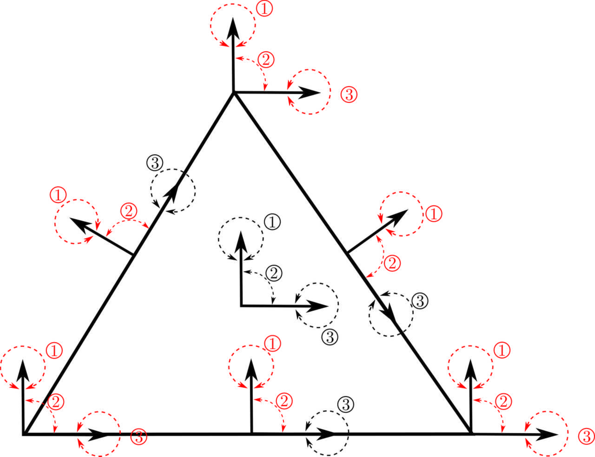
**图 3.1**  三角形单元各子单纯形局部正交标架选取与法向/切向对称张量分量示意图

### 3.2 Arbitrary-Order Spaces and Standard Discrete Variational Formulation

基于上述几何实体分解，定义 $k$ 阶全局 Hu–Zhang 对称应力有限元空间：
$$
\boldsymbol{\Sigma}_h^k = \left\{ \boldsymbol{\tau}_h \in H(\operatorname{div},\Omega;\mathbb{S}) : \boldsymbol{\tau}_h|_T \in \mathbb{P}_k(T;\mathbb{S}), \ \forall\,T \in \mathcal{T}_h \right\},
$$
以及对应的 $(k-1)$ 阶分片不连续位移有限元空间：
$$
\boldsymbol{V}_h^{k-1} = \left\{ \boldsymbol{v}_h \in L^2(\Omega;\mathbb{R}^d) : \boldsymbol{v}_h|_T \in \mathbb{P}_{k-1}(T;\mathbb{R}^d), \ \forall\,T \in \mathcal{T}_h \right\}.
$$
记 $\boldsymbol{\Sigma}_{h,0}^k = \boldsymbol{\Sigma}_h^k \cap \boldsymbol{\Sigma}_0$ 为齐次离散应力测试空间。在线弹性标准混合有限元离散下，离散混合变分问题表述为：求 $(\boldsymbol{\sigma}_{0,h}, \boldsymbol{u}_h) \in \boldsymbol{\Sigma}_{h,0}^k \times \boldsymbol{V}_h^{k-1}$，使得
$$
\begin{aligned}
a(\boldsymbol{\sigma}_{0,h}, \boldsymbol{\tau}_h) + b(\boldsymbol{\tau}_h, \boldsymbol{u}_h) &= \langle \boldsymbol{u}_D, \boldsymbol{\tau}_h\boldsymbol{n} \rangle_{\Gamma_D} - a(\boldsymbol{\sigma}_{g,h}, \boldsymbol{\tau}_h), && \forall\,\boldsymbol{\tau}_h \in \boldsymbol{\Sigma}_{h,0}^k, \\
b(\boldsymbol{\sigma}_{0,h}, \boldsymbol{v}_h) &= -(\boldsymbol{b},\boldsymbol{v}_h)_\Omega - b(\boldsymbol{\sigma}_{g,h}, \boldsymbol{v}_h), && \forall\,\boldsymbol{v}_h \in \boldsymbol{V}_h^{k-1}.
\end{aligned} \tag{3.2}
$$
**离散稳定性与最优先验误差估计**：已有理论严格证明，对于高阶格式 $k \ge d+1$（在二维三角形网格上 $k \ge 3$），有限元空间对 $\boldsymbol{\Sigma}_h^k \times \boldsymbol{V}_h^{k-1}$ 原生满足离散 inf-sup 稳定性条件。当连续精确解具有足够正则性（$\boldsymbol{\sigma} \in H^{k+1}(\Omega;\mathbb{S}), \boldsymbol{u} \in H^k(\Omega;\mathbb{R}^d)$）时，离散解满足如下最优先验误差估计（Hu 与 Zhang，2014；Hu，2015）：
$$
\|\boldsymbol{\sigma} - \boldsymbol{\sigma}_h\|_{H(\operatorname{div})} + \|\boldsymbol{u} - \boldsymbol{u}_h\|_0 \le C h^k \left( \|\boldsymbol{\sigma}\|_{k+1} + \|\boldsymbol{u}\|_k \right). \tag{3.3}
$$
此外，独立应力张量在 $L^2$ 范数下具备 $\mathcal{O}(h^{k+1})$ 的超收敛性质（Chen 等，2018）：
$$
\|\boldsymbol{\sigma} - \boldsymbol{\sigma}_h\|_0 \le C h^{k+1} \|\boldsymbol{\sigma}\|_{k+1}. \tag{3.4}
$$

### 3.3 Jump Stabilization for Low-Order Elements ($k=1,2$)

对于低阶离散（二维中 $k=1,2$），由于不连续位移空间维数不足以控制应力散度空间，离散 inf-sup 条件失效，直接求解式 (3.2) 会导致应力与位移场的数值震荡与假奇异。

为此，在不连续位移场上引入基于对称矩阵跳量的内部罚稳定化机制（Chen 等，2017，2018）。对内部面 $F = T^+ \cap T^- \in \mathcal{F}_h^i$（法向量分别为 $\boldsymbol{n}^+$ 和 $\boldsymbol{n}^-$），位移对称矩阵跳量定义为：
$$
[\![ \boldsymbol{v} ]\!] = \frac{1}{2}\left( \boldsymbol{v}^+\otimes\boldsymbol{n}^+ + \boldsymbol{n}^+\otimes\boldsymbol{v}^+ + \boldsymbol{v}^-\otimes\boldsymbol{n}^- + \boldsymbol{n}^-\otimes\boldsymbol{v}^- \right). \tag{3.5}
$$
定义低阶稳定化双线性型（Chen 等，2017）：
$$
c_h(\boldsymbol{u}_h,\boldsymbol{v}_h) = \sum_{F\in\mathcal{F}_h^i \cup \mathcal{F}_h^D} \alpha_F h_F \int_F [\![ \boldsymbol{u}_h ]\!] : [\![ \boldsymbol{v}_h ]\!] \,\mathrm{d}s. \tag{3.6}
$$
**量纲协调缩放律**：为使惩罚项量纲与材料柔度矩阵渐近协调且随网格细化弱一致衰减，参数选取为：
$$
\alpha_F = \gamma_0 \frac{\mu_{\mathrm{ref}}}{L_0^2}, \tag{3.7}
$$
其中 $L_0 = \operatorname{diam}(\Omega)$ 为求解域 $\Omega$ 的宏观特征长度（在工程实现中可取外接包围盒最大边长），$\mu_{\mathrm{ref}}$ 为材料参考剪切模量，$\gamma_0 > 0$ 为无量纲稳定化系数。

当非齐次位移边界 $\boldsymbol{u}_D \ne \boldsymbol{0}$ 时，引入相应的边界一致性修正项：
$$
\ell_h^D(\boldsymbol{v}_h) = \sum_{F\in\mathcal{F}_h^D} \alpha_F h_F \int_F [\![ \boldsymbol{u}_D ]\!] : [\![ \boldsymbol{v}_h ]\!] \,\mathrm{d}s. \tag{3.8}
$$
结合上述稳定化项，适用于任意阶次（涵盖低阶 $k=1,2$ 与高阶 $k \ge 3$）的**统一离散混合变分问题**最终表述为：求 $(\boldsymbol{\sigma}_{0,h}, \boldsymbol{u}_h) \in \boldsymbol{\Sigma}_{h,0}^k \times \boldsymbol{V}_h^{k-1}$，使得
$$
\begin{aligned}
a(\boldsymbol{\sigma}_{0,h}, \boldsymbol{\tau}_h) + b(\boldsymbol{\tau}_h, \boldsymbol{u}_h) &= \langle \boldsymbol{u}_D, \boldsymbol{\tau}_h\boldsymbol{n} \rangle_{\Gamma_D} - a(\boldsymbol{\sigma}_{g,h}, \boldsymbol{\tau}_h), && \forall\,\boldsymbol{\tau}_h \in \boldsymbol{\Sigma}_{h,0}^k, \\
b(\boldsymbol{\sigma}_{0,h}, \boldsymbol{v}_h) - c_h(\boldsymbol{u}_h, \boldsymbol{v}_h) &= -(\boldsymbol{b},\boldsymbol{v}_h)_\Omega - b(\boldsymbol{\sigma}_{g,h}, \boldsymbol{v}_h) - \ell_h^D(\boldsymbol{v}_h), && \forall\,\boldsymbol{v}_h \in \boldsymbol{V}_h^{k-1}.
\end{aligned} \tag{3.9}
$$
其中对于高阶原生稳定格式（$k \ge d+1$），直接取 $c_h = 0$ 和 $\ell_h^D = 0$，式 (3.9) 自然退化为标准格式 (3.2)。

> **注 3.1（跳量稳定化算子选型与对比）**：对于低阶混合有限元的界面稳定化，文献中存在两类代表性构造：其一是基于经典间断 Galerkin（DG）位移跳量的向量型惩罚 $\sum_F \alpha_F h_F^{-1} \int_F [\boldsymbol{u}_h]\cdot[\boldsymbol{v}_h]\,\mathrm{d}s$（Chen 等，2018）；其二是基于对称应变梯度的矩阵型惩罚式 (3.6)（Chen 等，2017）。本文选取对称矩阵型跳量，因其在数学形式上与二阶对称 Cauchy 应力张量严格同构（加权因子为 $h_F$ 弱一致衰减），能在维系低阶离散 inf-sup 条件的同时，最大程度保持混合变分系统与能量泛函的自洽性。

> **重要边界说明**：稳定化跳量积分面仅施加于 $\mathcal{F}_h^i \cup \mathcal{F}_h^D$，**严禁施加于牵引边界 $\Gamma_N$**。由于 $\Gamma_N$ 属于本质边界条件已由应力自由度强加，若对其增加位移跳量惩罚将破坏载荷平衡泛函。该边界选择导致 $k=2$ 时 $H(\operatorname{div})$ 误差收敛阶从理论 2 阶向 1 阶退化（见第 5.1.2 节）。

### 3.4 Partial Relaxation of Vertex Continuity at Corners

在多边形或多面体求解域的几何角点（Corners）以及不同边界条件转换点处，两相交边界上的外法向牵引往往互不兼容（例如固支边界与承载边界相交，或垂直自由边界角点处的切应力与正应力耦合）。若强制有限元网格顶点处所有对称应力分量取单值（即强加点值 $C^0$ 连续性），会导致离散插值系统过度约束或引发局部的非物理应力奇异（Hu 与 Ma，2021）。

为了在严格维系全局 $H(\operatorname{div})$ 协调性的前提下消除过约束，本文采用顶点应力连续性的局部松弛策略（Hu 与 Ma，2021；Chen 等，2024）。设 $\mathcal{V}_c \subset \mathcal{V}_h$ 为需要处理的几何角点集合。松弛后的全局协调应力有限元空间严格定义为：
$$
\boldsymbol{\Sigma}_{h,\mathrm{rel}}^k = \left\{ \boldsymbol{\tau}_h \in H(\operatorname{div},\Omega;\mathbb{S}) : 
\begin{aligned}
&\boldsymbol{\tau}_h|_T \in \mathbb{P}_k(T;\mathbb{S}), \ \forall\,T \in \mathcal{T}_h; \\
&\boldsymbol{\tau}_h \text{ 在非角点 } \mathcal{V}_h \setminus \mathcal{V}_c \text{ 处全应力分量单值 ($C^0$ 连续)}; \\
&\boldsymbol{\tau}_h \text{ 在角点 } \mathcal{V}_c \text{ 处仅法向迹单值 (切向正应力分量解耦多值)}
\end{aligned}
\right\}. \tag{3.10}
$$
松弛后，每个二维角点在保持两相交边法向迹单值的前提下增加 1 个切向自由度（3 自由度扩展为 4 自由度），使相交边界上的面力条件能够互不干扰地独立施加。具体几何与代数松弛机制如图 3.2 所示（Chen 等，2024）：
1. **几何标架重构**：对包含复杂角点 $x_c$ 的局部相邻单元，沿两相交边界建立局部正交标架，分解为决定两侧边界法向牵引的法向分量与各自的纯切向分量；
2. **切向自由度解耦**：将原本要求全局单值的切向应力模态解耦为两个相互独立的局部自由度，分别归属于两侧边界单元，使得两侧相交边界的面力条件能够独立满足；
3. **法向严格单值**：决定法向迹连续性的自由度在角点及单元公共界面上严格保持单值，确保松弛后的应力空间严格满足 $\boldsymbol{\Sigma}_{h,\mathrm{rel}}^k \subset H(\operatorname{div},\Omega;\mathbb{S})$；
4. **局部自由度扩充**：角点处原本的 3 个独立点值自由度（$\sigma_{xx}, \sigma_{xy}, \sigma_{yy}$）被局部扩展为 4 个独立自由度（图 3.2(d)），彻底消除了角点过约束病态。

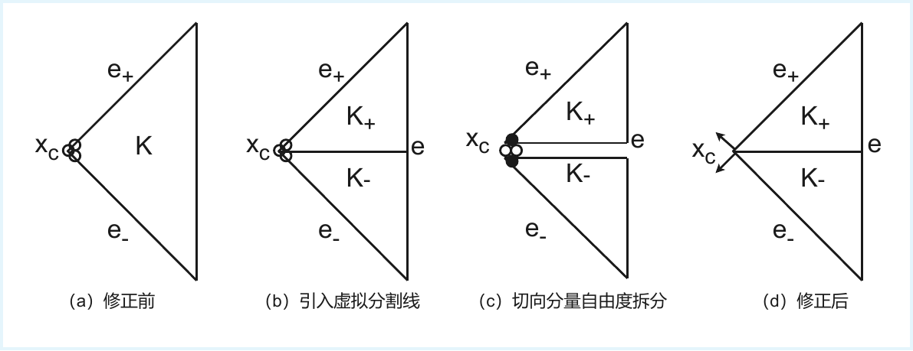
**图 3.2**  复杂几何边界角点处顶点应力 $C^0$ 连续性的局部部分松弛机制示意图

在任意多项式阶次 $k \ge 1$ 下，二维三角形单元上对称应力形函数空间 $\mathbb{P}_k(T;\mathbb{S})$ 的局部总自由度维数为 $\dim \mathbb{P}_k(T;\mathbb{S}) = \frac{3(k+1)(k+2)}{2}$。其按几何实体分层解析维数为：
- **顶点自由度**：每个顶点分配 3 个点值分量，非角点顶点全局共享，角点处扩展为 4 个独立自由度；
- **边内部自由度**：每条边分配 $2(k-1)$ 个法向牵引自由度（跨相邻单元共享装配）与 $(k-1)$ 个切向正应力自由度（单元私有）；
- **单元内部自由度**：单元内部包含 $\frac{3(k-1)(k-2)}{2}$ 个纯内部张量泡状模态（单元私有）。

### 3.5 Discrete Saddle-Point System

设 $\{\boldsymbol{\Phi}_i\}_{i=1}^{N_\sigma}$ 为齐次离散应力空间 $\boldsymbol{\Sigma}_{h,0}^k$ 的全局基函数，$\{\boldsymbol{\psi}_k\}_{k=1}^{N_u}$ 为分片不连续位移空间 $\boldsymbol{V}_h^{k-1}$ 的全局基函数。将离散解展开为：
$$
\boldsymbol{\sigma}_{0,h} = \sum_{j=1}^{N_\sigma} s_{0,j} \boldsymbol{\Phi}_j, \qquad \boldsymbol{u}_h = \sum_{l=1}^{N_u} u_l \boldsymbol{\psi}_l.
$$
将基函数展开代入统一离散变分问题式 (3.9)，转化为如下对称不定的离散鞍点代数系统：
$$
\begin{bmatrix}
\boldsymbol{A} & \boldsymbol{B} \\
\boldsymbol{B}^{\mathsf T} & -\boldsymbol{C}
\end{bmatrix}
\begin{bmatrix}
\boldsymbol{s}_0 \\
\boldsymbol{u}
\end{bmatrix}
=
\begin{bmatrix}
\boldsymbol{f}_{\sigma} \\
\boldsymbol{f}_u
\end{bmatrix}. \tag{3.11}
$$
其中，各分块矩阵的元素显式定义为：
$$
\begin{aligned}
A_{ij} &= a(\boldsymbol{\Phi}_j, \boldsymbol{\Phi}_i) = \int_\Omega \mathcal{A}\boldsymbol{\Phi}_j : \boldsymbol{\Phi}_i \,\mathrm{d}x, && i,j = 1, \dots, N_\sigma, \\
B_{ik} &= b(\boldsymbol{\Phi}_i, \boldsymbol{\psi}_k) = \int_\Omega (\operatorname{div}\boldsymbol{\Phi}_i) \cdot \boldsymbol{\psi}_k \,\mathrm{d}x, && i = 1, \dots, N_\sigma; \ k = 1, \dots, N_u, \\
C_{kl} &= c_h(\boldsymbol{\psi}_l, \boldsymbol{\psi}_k) = \sum_{F \in \mathcal{F}_h^i \cup \mathcal{F}_h^D} \alpha_F h_F \int_F [\![ \boldsymbol{\psi}_l ]\!] : [\![ \boldsymbol{\psi}_k ]\!] \,\mathrm{d}s, && k,l = 1, \dots, N_u.
\end{aligned} \tag{3.12}
$$
右端载荷向量分量定义为：
$$
\begin{aligned}
(\boldsymbol{f}_{\sigma})_i &= \int_{\Gamma_D} \boldsymbol{u}_D \cdot (\boldsymbol{\Phi}_i\boldsymbol{n})\,\mathrm{d}s - \int_\Omega \mathcal{A}\boldsymbol{\sigma}_{g,h} : \boldsymbol{\Phi}_i \,\mathrm{d}x, && i = 1, \dots, N_\sigma, \\
(\boldsymbol{f}_u)_k &= -\int_\Omega \boldsymbol{b} \cdot \boldsymbol{\psi}_k \,\mathrm{d}x - \int_\Omega (\operatorname{div}\boldsymbol{\sigma}_{g,h}) \cdot \boldsymbol{\psi}_k \,\mathrm{d}x - \ell_h^D(\boldsymbol{\psi}_k), && k = 1, \dots, N_u.
\end{aligned} \tag{3.13}
$$
其中 $\boldsymbol{s}_0 = (s_{0,1},\dots,s_{0,N_\sigma})^{\mathsf T}$ 为齐次未知应力自由度向量，$\boldsymbol{u} = (u_1,\dots,u_{N_u})^{\mathsf T}$ 为位移自由度向量。离散牵引提升场 $\boldsymbol{\sigma}_{g,h} \in \boldsymbol{\Sigma}_h^k$ 由外表面力 $\boldsymbol{g}$ 在 $\Gamma_N$ 的面自由度上强插值确定并向域内零延拓，总应力系数向量由 $\boldsymbol{s} = \boldsymbol{s}_0 + \boldsymbol{s}_g$ 统一重构。对于高阶原生格式（$k \ge d+1$），稳定化块 $\boldsymbol{C} = \boldsymbol{0}$ 且 $\ell_h^D = 0$。

---

## 4 Density-Based Topology Optimization with Independent Stress

### 4.1 Design Variables, Density Filter, and Dual-Parameter Material Interpolation

设计域 $\Omega \subset \mathbb{R}^d$ 被离散为由 $N_e$ 个单元组成的有限元网格 $\mathcal{T}_h = \{K_e\}_{e=1}^{N_e}$。在基于密度的连续体拓扑优化框架下，每个单元 $K_e$ 被赋予一个数学设计变量 $\rho_e \in [\rho_{\min}, 1]$，构成全局设计向量 $\boldsymbol{\rho} = (\rho_1, \dots, \rho_{N_e})^{\mathsf T}$，其中 $\rho_{\min} = 10^{-3}$ 为防止数值奇异的密度下界。

为克服拓扑优化固有的网格依赖性与棋盘格数值病态，并显式控制构件的最小特征尺寸，采用经典的 PDE/卷积型线性密度过滤器（Bourdin，2001；Bruns 与 Tortorelli，2001）将数学设计变量 $\rho_e$ 映射为连续物理密度 $\widetilde{\rho}_e$：
$$
\widetilde{\rho}_e = \frac{\sum_{j \in \mathcal{N}_e} w_{ej} v_j \rho_j}{\sum_{j \in \mathcal{N}_e} w_{ej} v_j}, \tag{4.1}
$$
其中 $v_j = |K_j|$ 表示单元 $K_j$ 的几何测度（二维面积或三维体积），$\mathcal{N}_e = \{j \in \{1, \dots, N_e\} \mid \|\boldsymbol{x}_e - \boldsymbol{x}_j\|_2 \le r_{\min}\}$ 为以单元 $K_e$ 的形心 $\boldsymbol{x}_e = \frac{1}{|K_e|}\int_{K_e} \boldsymbol{x}\,\mathrm{d}x$ 为球心、滤波半径为 $r_{\min}$ 的邻域单元索引集合。线性衰减卷积核权重 $w_{ej}$ 定义为：
$$
w_{ej} = \max(0, \, r_{\min} - \|\boldsymbol{x}_e - \boldsymbol{x}_j\|_2).
$$

为在近不可压缩线弹性体系（实体泊松比 $\nu_0 \to 0.5$）中准确表征材料属性分布，并彻底消除低密度孔洞区由于泊松比接近不可压缩极限而引发的虚假静水压力支撑，本文采用杨氏模量与泊松比解耦松弛的双参数材料插值模型（Dual-Parameter Interpolation；Sigmund 与 Clausen，1998；Bruggi，2007）：

1. **杨氏模量插值（SIMP 模型）**：
$$
E(\widetilde{\rho}_e) = E_{\min} + (E_0 - E_{\min}) \widetilde{\rho}_e^{p_E}, \tag{4.2}
$$
式中 $E_0$ 为各向同性基体材料的 Young 模量，$E_{\min} = 10^{-9} E_0$ 为保证全局柔度矩阵良定的孔洞区虚材料模量下界，$p_E$ 为刚度惩罚指数（标准取值为 $p_E = 3$）。

2. **泊松比松弛插值**：
$$
\nu(\widetilde{\rho}_e) = \nu_{\mathrm{void}} + (\nu_0 - \nu_{\mathrm{void}}) \widetilde{\rho}_e^{p_\nu}, \qquad p_\nu = 1, \tag{4.3}
$$
式中 $\nu_0$ 为基体材料的目标泊松比（如 $\nu_0 = 0.4999$），$\nu_{\mathrm{void}} = 0.3$ 为孔洞区基准泊松比，惩罚指数取 $p_\nu = 1$ 以确保泊松比随物理密度向实体材料平滑单调过渡。

### 4.2 State Equations and Complementary Energy Compliance Formulation

在变密度材料分布下，各单元局部柔度算子 $\mathcal{A}(\widetilde{\rho}_e)$ 随物理密度空间变化。将第 3 节建立的离散鞍点方程组作为拓扑优化的前向状态方程，此时全局应力柔度矩阵被参数化为物理密度的函数 $\boldsymbol{A}(\boldsymbol{\rho}) = \sum_{e=1}^{N_e} \boldsymbol{A}_e(\widetilde{\rho}_e)$；而散度矩阵 $\boldsymbol{B}$ 与稳定化矩阵 $\boldsymbol{C}$ 仅由网格拓扑与基函数几何决定，在整个优化迭代过程中保持恒定。

在传统位移法或基于 Schur 补消元的混合列式中，柔顺度通常表述为载荷与位移的内积 $\boldsymbol{f}_u^{\mathsf T}\boldsymbol{u}$，其伴随灵敏度需对等效刚度矩阵 $\boldsymbol{K}(\boldsymbol{\rho}) = \boldsymbol{B} \boldsymbol{A}(\boldsymbol{\rho})^{-1} \boldsymbol{B}^{\mathsf T}$ 求导，不可避免地引入柔度逆矩阵 $\boldsymbol{A}^{-1}$ 及昂贵的伴随计算。为充分发挥胡张混合元将应力作为独立主变量求解的高精度优势，本文直接在应力空间中原生构建**基于互补应变能（Complementary Energy）的柔顺度目标函数**。

在线弹性力学中，对于齐次位移边界与设计无关外载荷，结构柔顺度严格等价于总应力场的互补能。利用离散总应力系数向量 $\boldsymbol{s} = \boldsymbol{s}_0 + \boldsymbol{s}_g$，离散互补能目标函数可表述为紧凑的代数二次型：
$$
C(\boldsymbol{\rho}, \boldsymbol{\sigma}_h) = \int_\Omega \mathcal{A}(\widetilde{\rho}) \boldsymbol{\sigma}_h : \boldsymbol{\sigma}_h \,\mathrm{d}x = \boldsymbol{s}^{\mathsf T} \boldsymbol{A}(\boldsymbol{\rho}) \boldsymbol{s}. \tag{4.4}
$$

据此，面向任意次胡张混合有限元的标准柔顺度最小化拓扑优化模型表述为：
$$
\begin{aligned}
\min_{\boldsymbol{\rho}} \quad & C(\boldsymbol{\rho}, \boldsymbol{\sigma}_h) = \boldsymbol{s}^{\mathsf T} \boldsymbol{A}(\boldsymbol{\rho}) \boldsymbol{s} \\
\text{s.t.} \quad & \begin{bmatrix} \boldsymbol{A}(\boldsymbol{\rho}) & \boldsymbol{B} \\ \boldsymbol{B}^{\mathsf T} & -\boldsymbol{C} \end{bmatrix} \begin{bmatrix} \boldsymbol{s}_0 \\ \boldsymbol{u} \end{bmatrix} = \begin{bmatrix} \boldsymbol{f}_{\sigma}(\boldsymbol{\rho}) \\ \boldsymbol{f}_u \end{bmatrix}, \\
& \frac{\sum_{e=1}^{N_e} v_e \widetilde{\rho}_e}{\sum_{e=1}^{N_e} v_e} \le \bar{V}, \\
& \rho_{\min} \le \rho_e \le 1, \quad e = 1, \dots, N_e.
\end{aligned} \tag{4.5}
$$
式中 $\bar{V} \in (0, 1)$ 为预设的最大材料体积分数上限。

### 4.3 Stress-Constrained Topology Optimization with Singularity-Free Relaxation

局部应力约束拓扑优化以结构总体积最小化为目标（Duysinx 与 Bendsøe，1998；Le 等，2010），并在全域单元施加局部 von Mises 等效应力约束：
$$
g_e(\boldsymbol{\rho}, \boldsymbol{\sigma}_h) = \frac{\sigma_{\mathrm{vm}}(\boldsymbol{\sigma}_{h,e})}{\bar{\sigma}} - \eta(\widetilde{\rho}_e) \le 0, \quad \forall\,e \in \{1, \dots, N_e\}, \tag{4.6}
$$
式中 $\bar{\sigma}$ 为基体材料的许用屈服应力，$\sigma_{\mathrm{vm}}(\boldsymbol{\sigma}_{h,e})$ 为基于单元 $K_e$ 内高精度独立应力场评估的 von Mises 等效应力。

在传统位移法中，若通过 $\boldsymbol{\sigma}_{\text{real}} = \boldsymbol{\sigma}_{\text{apparent}} / \widetilde{\rho}_e^{p_E}$ 反算实体微观应力，低密度孔洞区（$\widetilde{\rho}_e \to 0$）的分母趋零会引发严重的“应力奇异（Stress Singularity）”与除零发散病态（Cheng 与 Guo，1997；Svanberg 与 Werme，2007）。鉴于胡张混合有限元原生求解得到的全局应力场 $\boldsymbol{\sigma}_h$ 在物理上对应于宏观表观应力，本文借鉴 Bruggi 与 Venini（2008）及 Senhora 等（2020）的思想，采用无密度分母的 $\epsilon$-松弛表观应力阈值函数：
$$
\eta(\widetilde{\rho}_e) = \widetilde{\rho}_e^{p_E} + \epsilon (1 - \widetilde{\rho}_e^{p_E}), \qquad \epsilon = 10^{-4}. \tag{4.7}
$$
该松弛模型在不同密度区间展现出优良的数学性质：
1. **实体区（$\widetilde{\rho}_e = 1$）**：$\eta(1) = 1$，严格恢复基体材料的真实物理屈服条件 $\sigma_{\mathrm{vm}} \le \bar{\sigma}$；
2. **孔洞区（$\widetilde{\rho}_e \to 0$）**：表观应力 $\sigma_{\mathrm{vm}} \to 0$，阈值 $\eta(0) \to \epsilon$，约束函数平滑退化为良定的 $-\epsilon \le 0$，不仅处处自然满足约束，而且导数有界，从数学上彻底根除了应力奇异性。

### 4.4 Augmented Lagrangian Formulation

针对包含海量局部约束的优化问题，采用 Augmented Lagrangian Method (ALM)（Holmberg 等，2013；da Silva 等，2019；Senhora 等，2020）构建标量增广拉格朗日目标函数：
$$
\Phi(\boldsymbol{\rho}, \boldsymbol{\sigma}_h) = f_V(\boldsymbol{\rho}) + \frac{1}{N_e} \sum_{e=1}^{N_e} \mathcal{P}_e(g_e, \lambda_e, \mu_e), \tag{4.8}
$$
其中体积分数目标 $f_V(\boldsymbol{\rho}) = \frac{\sum_e v_e \widetilde{\rho}_e}{\sum_e v_e}$，局部罚函数项定义为：
$$
\mathcal{P}_e = \begin{cases}
\lambda_e g_e + \frac{\mu_e}{2} g_e^2, & \text{if } g_e > -\frac{\lambda_e}{\mu_e}, \\
-\frac{\lambda_e^2}{2\mu_e}, & \text{if } g_e \le -\frac{\lambda_e}{\mu_e}.
\end{cases} \tag{4.9}
$$
外循环依据约束违背量自适应更新拉格朗日乘子 $\lambda_e$ 与罚因子 $\mu_e$：
$$
\lambda_e^{(k+1)} = \max\left(0,\, \lambda_e^{(k)} + \mu_e^{(k)} g_e\right), \tag{4.10}
$$
内循环调用 Method of Moving Asymptotes (MMA)（Svanberg，1987）更新设计变量。

### 4.5 Consistent Adjoint Sensitivity Analysis with Total Stress

在内循环固定乘子 $\boldsymbol{\lambda}$、罚参数 $\boldsymbol{\mu}$ 及激活分支的条件下，标量增广拉格朗日目标函数 $\Phi(\boldsymbol{\rho}, \boldsymbol{\sigma}_h)$ 对物理密度 $\widetilde{\rho}_e$ 的导数由显式项与依赖于独立应力场的伴随项构成。局部罚函数项 $\mathcal{P}_e$ 对总应力系数向量 $\boldsymbol{s}$ 及物理密度 $\widetilde{\rho}_e$ 的显式偏导数解析展开为：
$$
\frac{\partial\mathcal{P}_e}{\partial\boldsymbol{s}} = \frac{\partial\mathcal{P}_e}{\partial g_e} \frac{\partial g_e}{\partial\boldsymbol{s}} = \left( \lambda_e + \mu_e \max\left(g_e, -\frac{\lambda_e}{\mu_e}\right) \right) \frac{1}{\bar{\sigma}} \frac{\partial\sigma_{\mathrm{vm}}(\boldsymbol{\sigma}_{h,e})}{\partial\boldsymbol{s}},
$$
$$
\frac{\partial\mathcal{P}_e}{\partial\widetilde{\rho}_e} = \frac{\partial\mathcal{P}_e}{\partial g_e} \frac{\partial g_e}{\partial\widetilde{\rho}_e} = -\left( \lambda_e + \mu_e \max\left(g_e, -\frac{\lambda_e}{\mu_e}\right) \right) p_E(1 - \epsilon)\widetilde{\rho}_e^{p_E - 1},
$$
式中 $\frac{\partial\sigma_{\mathrm{vm}}(\boldsymbol{\sigma}_{h,e})}{\partial\boldsymbol{s}}$ 为单元 $K_e$ 内 von Mises 等效应力对全局应力自由度向量 $\boldsymbol{s}$ 的解析梯度。单元柔度矩阵对物理密度的导数为：
$$
\frac{\partial\boldsymbol{A}(\boldsymbol{\rho})}{\partial\widetilde{\rho}_e} = -\frac{p_E(E_0 - E_{\min})\widetilde{\rho}_e^{p_E - 1}}{E(\widetilde{\rho}_e)^2} \boldsymbol{A}_{0,e}.
$$

引入伴随状态向量 $(\boldsymbol{z}_\sigma, \boldsymbol{z}_u)$，求解对称不定伴随鞍点系统：
$$
\begin{bmatrix}
\boldsymbol{A}(\boldsymbol{\rho}) & \boldsymbol{B} \\
\boldsymbol{B}^{\mathsf T} & -\boldsymbol{C}
\end{bmatrix}
\begin{bmatrix}
\boldsymbol{z}_{\sigma} \\
\boldsymbol{z}_{u}
\end{bmatrix}
=
\begin{bmatrix}
N_e^{-1} \left( \sum_{e=1}^{N_e} \frac{\partial\mathcal{P}_e}{\partial\boldsymbol{s}} \right)^{\mathsf T} \\
\boldsymbol{0}
\end{bmatrix}. \tag{4.11}
$$
根据伴随变分原理，目标函数 $\Phi$ 对物理密度 $\widetilde{\rho}_e$ 的一致伴随导数为：
$$
\frac{\partial\Phi}{\partial\widetilde{\rho}_e} = \frac{v_e}{\sum_{j=1}^{N_e} v_j} + \frac{1}{N_e} \frac{\partial\mathcal{P}_e}{\partial\widetilde{\rho}_e} - \boldsymbol{z}_{\sigma}^{\mathsf T} \frac{\partial\boldsymbol{A}(\boldsymbol{\rho})}{\partial\widetilde{\rho}_e} \boldsymbol{s}. \tag{4.12}
$$
对于纯柔顺度最小化目标（$C = \boldsymbol{s}^{\mathsf T}\boldsymbol{A}(\boldsymbol{\rho})\boldsymbol{s}$），伴随解直接退化为自伴随关系 $\boldsymbol{z}_\sigma = -\boldsymbol{s}$，其导数解析化为自伴随紧凑形式：
$$
\frac{\partial C}{\partial\widetilde{\rho}_e} = \boldsymbol{s}^{\mathsf T} \frac{\partial\boldsymbol{A}(\boldsymbol{\rho})}{\partial\widetilde{\rho}_e} \boldsymbol{s} < 0. \tag{4.13}
$$
最后，利用链式法则通过线性密度过滤器矩阵映射至数学设计变量全导数：$\frac{\mathrm{d}\Phi}{\mathrm{d}\rho_j} = \sum_{e \in \mathcal{N}_j} \frac{\partial\Phi}{\partial\widetilde{\rho}_e} \frac{w_{ej} v_j}{\sum_{k \in \mathcal{N}_e} w_{ek} v_k}$。

### 4.6 Optimization Algorithms and Numerical Workflows

根据优化目标与约束类型的不同，本文分别针对**带体积约束的柔顺度最小化问题**与**局部应力约束的体积最小化问题**构建了对应的高效数值求解算法。

#### 4.6.1 单层 MMA 柔顺度优化算法

对于标准弹性及近不可压缩工况下的柔顺度最小化问题 (4.5)，利用结构互补能的自伴随特性，优化过程由单层 MMA 循环直接驱动，具体步骤如算法 1 所示。

---

##### **算法 1**  柔顺度最小化拓扑优化算法 (MMA)
---
**输入**: 网格剖分 $\mathcal{T}_h$，基体材料参数 $(E_0, \nu_0)$，体积分数上限 $\bar{V}$，滤波半径 $r_{\min}$，插值惩罚指数 $(p_E, p_\nu)$，MMA 渐近线初始步长 $s_0$ 与收缩/扩张因子 $(\gamma^-, \gamma^+)$，移动极限 $m$，收敛容差 $\epsilon_\rho, \epsilon_C$，最大迭代步数 $K_{\max}$。  
**输出**: 最优拓扑设计密度 $\boldsymbol{\rho}^*$。  
1. 初始化设计变量 $\boldsymbol{\rho}^{(0)} = \bar{V} \boldsymbol{1}$，其中 $\boldsymbol{1} \in \mathbb{R}^{N_e}$ 为全 1 向量；
2. 预组装设计无关的散度矩阵 $\boldsymbol{B}$、低阶跳量稳定化矩阵 $\boldsymbol{C}$ 及牵引力提升特解 $\boldsymbol{\sigma}_{g,h}$；
3. **for** $k = 0, 1, 2, \dots, K_{\max}$ **do**
4. $\quad$ 通过密度滤波式 (4.1) 计算当前物理密度 $\widetilde{\boldsymbol{\rho}}^{(k)}$；
5. $\quad$ 组装当前柔度矩阵 $\boldsymbol{A}(\boldsymbol{\rho}^{(k)}) = \sum_{e=1}^{N_e} \boldsymbol{A}_e(\widetilde{\rho}_e^{(k)})$；
6. $\quad$ 因式分解并求解鞍点系统 (4.5)，提取独立总应力场 $\boldsymbol{s}$；
7. $\quad$ 评估目标互补能 $C = \boldsymbol{s}^{\mathsf T}\boldsymbol{A}\boldsymbol{s}$，由自伴随公式 (4.13) 及链式法则解析计算导数 $\frac{\mathrm{d}C}{\mathrm{d}\boldsymbol{\rho}}$；
8. $\quad$ 依据历史迭代点按因子 $(\gamma^-, \gamma^+)$ 自适应更新渐近线，在移动极限 $m$ 与体积分数约束下调用 MMA 求解凸近似子问题，更新设计变量 $\boldsymbol{\rho}^{(k+1)}$；
9. $\quad$ **if** $\|\boldsymbol{\rho}^{(k+1)} - \boldsymbol{\rho}^{(k)}\|_\infty \le \epsilon_\rho$ 或 $|C^{(k+1)} - C^{(k)}|/C^{(k)} \le \epsilon_C$ **then**
10. $\quad\quad$ **return** 最优设计 $\boldsymbol{\rho}^* = \boldsymbol{\rho}^{(k+1)}$；
11. $\quad$ **end if**
12. **end for**
---

#### 4.6.2 双层 ALM–MMA 局部应力约束优化算法

对于包含海量局部应力约束的体积最小化问题 (4.8)，算法采用外层 ALM 乘子更新与内层 MMA 寻优的双层嵌套架构，并在伴随求解中完全复用前向因式分解因子，具体步骤如算法 2 所示。

---
##### **算法 2**  局部应力约束拓扑优化算法 (ALM–MMA)
---
**输入**: 网格剖分 $\mathcal{T}_h$，基体材料参数 $(E_0, \nu_0)$，许用应力 $\bar{\sigma}$，松弛参数 $\epsilon$，滤波半径 $r_{\min}$，容差 $\epsilon_\rho, \epsilon_g$。  
**输出**: 最优拓扑设计密度 $\boldsymbol{\rho}^*$。  
1. 初始化设计变量 $\boldsymbol{\rho}^{(0)} = \rho_0 \boldsymbol{1}$，拉格朗日乘子 $\boldsymbol{\lambda}^{(0)} = \boldsymbol{0}$，初始罚因子 $\mu_0 = 10.0$；
2. 预组装设计无关矩阵 $\boldsymbol{B}$、$\boldsymbol{C}$ 及牵引力提升向量；
3. **for** $k = 0, 1, 2, \dots, K_{\mathrm{outer}}$ **do** （外层 ALM 循环）
4. $\quad$ **for** $l = 0, 1, \dots, N_{\mathrm{inner}}$ **do** （内层 MMA 循环）
5. $\quad\quad$ 通过密度滤波式 (4.1) 计算物理密度 $\widetilde{\boldsymbol{\rho}}$ 并组装鞍点柔度矩阵 $\boldsymbol{A}(\boldsymbol{\rho})$；
6. $\quad\quad$ **因式分解**鞍点系统矩阵 $\boldsymbol{M} = \begin{bmatrix} \boldsymbol{A} & \boldsymbol{B} \\ \boldsymbol{B}^{\mathsf T} & -\boldsymbol{C} \end{bmatrix}$，求解前向方程提取总应力 $\boldsymbol{s}$ 与位移 $\boldsymbol{u}$；
7. $\quad\quad$ 计算各单元局部 von Mises 等效应力 $\sigma_{\mathrm{vm}}$ 与无奇异约束违背量 $g_e$，评估标量增广目标 $\Phi$；
8. $\quad\quad$ 组装伴随载荷 $\frac{\partial\mathcal{P}}{\partial\boldsymbol{s}}$，**直接复用矩阵分解 $\boldsymbol{M}$** 前后代入求解伴随向量 $\boldsymbol{z}_\sigma$；
9. $\quad\quad$ 由式 (4.12) 解析计算全导数 $\frac{\mathrm{d}\Phi}{\mathrm{d}\boldsymbol{\rho}}$，调用 MMA 求解无约束子问题更新设计变量 $\boldsymbol{\rho}$；
10. $\quad\quad$ **if** 内层子问题收敛 **then** break; **end if**
11. $\quad$ **end for**
12. $\quad$ 依据式 (4.10) 显式更新外层拉格朗日乘子 $\lambda_e^{(k+1)} = \max\left(0, \lambda_e^{(k)} + \mu_e^{(k)} g_e\right)$；
13. $\quad$ 放大外层罚因子 $\mu_e^{(k+1)} = \min(\gamma_\mu \mu_e^{(k)}, \mu_{\max})$；
14. $\quad$ **if** $\|\boldsymbol{\rho}^{(k+1)} - \boldsymbol{\rho}^{(k)}\|_\infty \le \epsilon_\rho$ 且 $\max_{e \in \{1, \dots, N_e\}} g_e(\boldsymbol{\rho}, \boldsymbol{\sigma}_h) \le \epsilon_g$ **then**
15. $\quad\quad$ **return** 最优设计 $\boldsymbol{\rho}^* = \boldsymbol{\rho}^{(k+1)}$；
16. $\quad$ **end if**
17. **end for**
---

---

## 5 Numerical Results

所有数值实验均在一致的计算环境下运行。首先给出高低阶前向制造解收敛阶与超收敛验证；进而展示三大代表性拓扑优化基准算例；最后通过统一的细化网格高阶模型对最终优化构型进行独立高阶重分析与验证。

### 5.1 Convergence Rate Verification via Manufactured Solutions

在单位正方形域 $\Omega=(0,1)^2$ 上设置各向同性平面应变制造解问题，Lamé 参数取 $\lambda=1, \mu=0.5$。精确位移场设定为：
$$
\boldsymbol{u}(x,y) = \begin{bmatrix} \sin(\pi x)\sin(\pi y) \\ \sin(\pi x)\sin(\pi y) \end{bmatrix}.
$$
边界条件设定为混合边界：$\Gamma_D = \{x=0\}\cup\{y=0\}$ 施加齐次位移，$\Gamma_N = \{x=1\}\cup\{y=1\}$ 施加精确牵引力 $\boldsymbol{g}=\boldsymbol{\sigma}\boldsymbol{n}$。角点 $(0,1)$ 与 $(1,0)$ 默认启用第 3.4 节的两单元局部角点松弛。

#### 5.1.1 Higher-Order Convergence ($k=3,4$)

高阶格式（$k=3,4$）在五档规则三角网格序列上的实测收敛数据如表 5.1 所示。

**表 5.1**  高阶 Hu–Zhang 混合有限元 ($k=3,4$) 制造解收敛误差与观测阶

| $k$ | $nx$ | 全局 DOF | $h$ | $\|\boldsymbol{u}-\boldsymbol{u}_h\|_0$ | 观测阶 | $\|\boldsymbol{\sigma}-\boldsymbol{\sigma}_h\|_0$ | 观测阶 | $\|\boldsymbol{\sigma}-\boldsymbol{\sigma}_h\|_{H(\mathrm{div})}$ | 观测阶 |
|:---:|:---:|:---:|:---:|:---:|:---:|:---:|:---:|:---:|:---:|
| **3** | 4 | 975 | 0.2500 | $3.0644\times10^{-3}$ | — | $4.0519\times10^{-3}$ | — | $8.8146\times10^{-2}$ | — |
| | 8 | 3 767 | 0.1250 | $3.8850\times10^{-4}$ | 2.98 | $2.3422\times10^{-4}$ | 4.11 | $1.1180\times10^{-2}$ | 2.98 |
| | 16 | 14 823 | 0.0625 | $4.8746\times10^{-5}$ | 2.99 | $1.4118\times10^{-5}$ | 4.05 | $1.4027\times10^{-3}$ | 2.99 |
| | 32 | 58 823 | 0.0312 | $6.0991\times10^{-6}$ | 3.00 | $8.6802\times10^{-7}$ | 4.02 | $1.7550\times10^{-4}$ | 3.00 |
| | 64 | 234 375 | 0.0156 | $7.6256\times10^{-7}$ | 3.00 | $5.3837\times10^{-8}$ | 4.01 | $2.1943\times10^{-5}$ | 3.00 |
| **4** | 4 | 1 631 | 0.2500 | $2.6778\times10^{-4}$ | — | $2.7107\times10^{-4}$ | — | $7.7075\times10^{-3}$ | — |
| | 8 | 6 359 | 0.1250 | $1.6969\times10^{-5}$ | 3.98 | $8.9171\times10^{-6}$ | 4.93 | $4.8836\times10^{-4}$ | 3.98 |
| | 16 | 25 127 | 0.0625 | $1.0643\times10^{-6}$ | 3.99 | $2.8610\times10^{-7}$ | 4.96 | $3.0627\times10^{-5}$ | 4.00 |
| | 32 | 99 911 | 0.0312 | $6.6579\times10^{-8}$ | 4.00 | $9.0347\times10^{-9}$ | 4.98 | $1.9158\times10^{-6}$ | 4.00 |
| | 64 | 398 471 | 0.0156 | $4.1621\times10^{-9}$ | 4.00 | $2.8345\times10^{-10}$ | 4.99 | $1.1976\times10^{-7}$ | 4.00 |

实测数据表明：
1. **最优逼近阶**：位移 $L^2$ 与应力 $H(\operatorname{div})$ 误差严格达到理论最优阶 $k$ 阶，与先验误差估计式 (3.3) 完美契合；
2. **应力超收敛与高精度效益**：独立应力 $L^2$ 误差表现出 **$\mathcal{O}(h^{k+1})$ 的超收敛**（$k=3$ 阶次收敛于 4 阶，$k=4$ 阶次收敛于 5 阶），严格印证了理论估计式 (3.4)（Chen 等，2018）。由于该超收敛性质，高阶混合元在相近自由度（Matching DOFs）口径下展现出比传统位移法更优的应力逼近精度与高精度计算效益；
3. **代数良态性**：直接求解器在各级网格下的相对线性求解残差均稳定保持在 $10^{-15} \sim 10^{-16}$ 机器精度量级。

#### 5.1.2 Lower-Order Stabilized Convergence ($k=1,2$)

低阶格式（$k=1,2$）引入对称矩阵跳量稳定化（$\gamma_0=1.0$）后的实测收敛数据如表 5.2 所示。

**表 5.2**  低阶跳量稳定化 Hu–Zhang 混合有限元 ($k=1,2$) 制造解收敛误差与观测阶

| $k$ | $nx$ | 全局 DOF | $h$ | $\|\boldsymbol{u}-\boldsymbol{u}_h\|_0$ | 观测阶 | $\|\boldsymbol{\sigma}-\boldsymbol{\sigma}_h\|_0$ | 观测阶 | $\|\boldsymbol{\sigma}-\boldsymbol{\sigma}_h\|_{H(\mathrm{div})}$ | 观测阶 |
|:---:|:---:|:---:|:---:|:---:|:---:|:---:|:---:|:---:|:---:|
| **1** | 4 | 143 | 0.2500 | $4.3496\times10^{-1}$ | — | $7.9802\times10^{-1}$ | — | $5.4342\times10^{0}$ | — |
| | 8 | 503 | 0.1250 | $2.5631\times10^{-1}$ | 0.76 | $2.5985\times10^{-1}$ | 1.62 | $2.7370\times10^{0}$ | 0.99 |
| | 16 | 1 895 | 0.0625 | $1.2408\times10^{-1}$ | 1.05 | $8.8099\times10^{-2}$ | 1.56 | $1.3696\times10^{0}$ | 1.00 |
| | 32 | 7 367 | 0.0312 | $6.0154\times10^{-2}$ | 1.04 | $3.0532\times10^{-2}$ | 1.53 | $6.8511\times10^{-1}$ | 1.00 |
| | 64 | 29 063 | 0.0156 | $2.9637\times10^{-2}$ | 1.02 | $1.0721\times10^{-2}$ | 1.51 | $3.4265\times10^{-1}$ | 1.00 |
| **2** | 4 | 479 | 0.2500 | $3.2186\times10^{-2}$ | — | $1.0388\times10^{-1}$ | — | $1.2269\times10^{0}$ | — |
| | 8 | 1 815 | 0.1250 | $8.1244\times10^{-3}$ | 1.99 | $2.3930\times10^{-2}$ | 2.12 | $5.3633\times10^{-1}$ | 1.19 |
| | 16 | 7 079 | 0.0625 | $2.0381\times10^{-3}$ | 2.00 | $5.7599\times10^{-3}$ | 2.05 | $2.5728\times10^{-1}$ | 1.06 |
| | 32 | 27 975 | 0.0312 | $5.1004\times10^{-4}$ | 2.00 | $1.4199\times10^{-3}$ | 2.02 | $1.2722\times10^{-1}$ | 1.02 |
| | 64 | 111 239 | 0.0156 | $1.2755\times10^{-4}$ | 2.00 | $3.5317\times10^{-4}$ | 2.01 | $6.3432\times10^{-2}$ | 1.00 |

低阶实测数据表明：
1. **跳量稳定化有效性与宽带稳健性**：对称矩阵跳量稳定化成功消除了低阶鞍点系统的离散不稳定性。$k=2$ 时位移与应力 $L^2$ 误差稳定收敛于 2 阶最优阶；参数敏感性分析表明量纲缩放因子 $\alpha_F = \gamma_0 \frac{\mu_{\mathrm{ref}}}{L_0^2}$ 在 $\gamma_0 \in [0.1, 10]$ 宽带区间内收敛阶保持高度稳健；
2. **边界局部减弱机理**：$H(\operatorname{div})$ 误差向 1 阶退化，严格印证了第 3.3 节关于牵引边界 $\Gamma_N$ 免于惩罚引发局部减弱的理论机理；
3. **角点松弛消除相容性冲突**：启用第 3.4 节的两单元局部角点松弛后，混合边界角点处的过度约束相容性冲突彻底消除，残差恢复至机器精度，保障了最优逼近。

### 5.2 Benchmark Topology Optimization Cases

#### 5.2.1 Compliance Minimization of Clamped Beam

考察两端固支梁柔顺度优化基准算例（图 5.1）。设计域几何尺寸为 $160\,\mathrm{mm} \times 20\,\mathrm{mm}$，材料参数为 $E_0 = 30\,\mathrm{MPa}, \nu_0 = 0.4$，体积分数上限 $\bar{V} = 0.4$。在胡张混合有限元中，由于位移测试空间属于不连续的 $L^2$ 空间且外载荷作为本质边界强加于应力自由度，严格的二维点集中力会导致应力场出现非平方可积奇异性；因此，将下边界中点集中力 $P = 3\,\mathrm{N}$ 转化为特征宽度为 $l = 1\,\mathrm{mm}$ 接触区上的等效均布面力（强度 $\bar{t} = P/l = 3\,\mathrm{N/mm}$），并通过连续 $P_1$ 边界迹空间投影施加，以确保位移法与混合法在完全相同的外力功输入下进行受控对比。

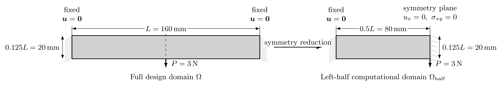
**图 5.1**  两端固支梁几何尺寸、载荷与对称边界条件示意图

计算中利用几何与受载对称性取左半计算域（$80\,\mathrm{mm} \times 20\,\mathrm{mm}$），采用 $80 \times 20$ 规则结构化三角形网格剖分（半域单元总数 $N_e = 3\,200$，全域等效 $6\,400$ 单元），密度过滤半径设为 $r_{\min} = 2.4\,\mathrm{mm}$。设计变量取均匀初始密度 $\rho_e^{(0)} = \bar{V}$，并由算法 1 的单层 MMA 循环更新。在阶次选取上，拓扑优化排除 $k=1$（$P_0$ 位移丧失刚体转动 RM 完备性，易致数值震荡），选取 $k=2$（跳量稳定化）与 $k=3,4$（原生高阶）。不同方法优化得到的最终拓扑构型对比见图 5.2（全域对称镜像呈现），收敛历史见图 5.3。

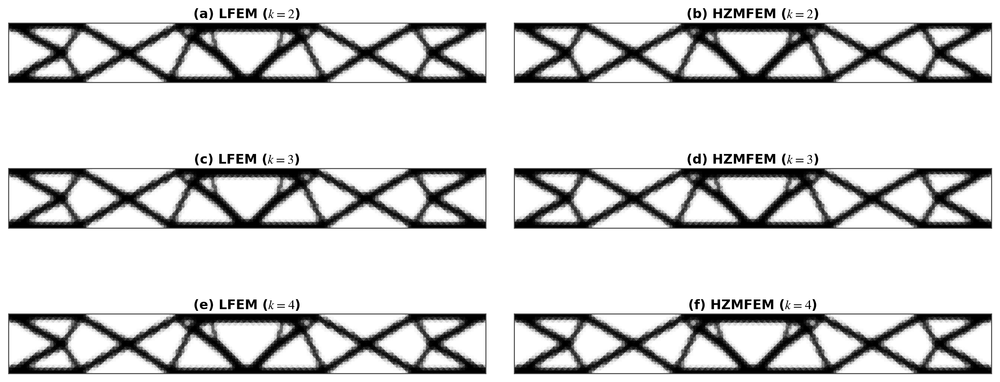
**图 5.2**  不同离散方法与多项式阶次 $k$ 下两端固支梁的最终拓扑构型对比（左列：位移法 LFEM；右列：Hu–Zhang 混合法 HZMFEM）

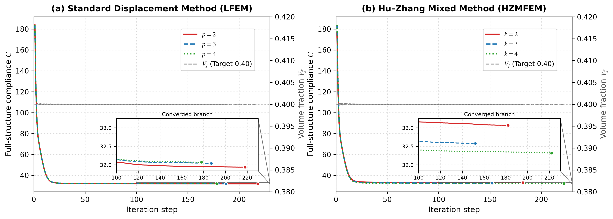
**图 5.3**  两端固支梁优化收敛历史曲线对比（(a) 位移法 LFEM，$p$ 为位移阶；(b) Hu–Zhang 混合法 HZMFEM，$k$ 为应力阶。红实线：阶次 2；蓝虚线：阶次 3；绿点线：阶次 4；末端圆点为收敛终止步；灰色虚线：体积分数 $V_f$。内嵌图为收敛段放大）

结果表明：两类方法在各阶次下沿迭代方向均单调下降并稳定收敛（图 5.3）：目标柔顺度在前 20 步内迅速降至最优平台（$C \approx 32$），此后进入缓慢微调段（第 100 步之后的变化量均小于 $0.14$），六次运行分别在 152–222 步触发收敛判据（图 5.3 中曲线末端的圆点），体积分数全程锁定于 $0.400 \pm 3\times10^{-4}$，严格满足设计目标 $\bar{V}=0.40$。图 5.3 内嵌的收敛段放大图进一步分离出两类方法沿阶次方向的不同走向：Hu–Zhang 混合元的收敛柔顺度随阶次升高单调下降（$k=2,3,4$ 依次为 $33.07$、$32.58$、$32.32$），而位移法几乎不随阶次变化（$p=2,3,4$ 依次为 $31.94$、$32.04$、$32.07$，散布仅 $0.13$，不足混合元 $0.75$ 的五分之一）。二者的相对差随阶次升高由 $3.54\%$ 依次收窄至 $1.68\%$ 与 $0.78\%$，即高阶胡张混合元的柔顺度自上方逼近位移法结果；结合两类方法收敛拓扑构型的高度一致性（二值化一致率 $98.8\%$），验证了混合拓扑优化框架驱动材料演化的正确性与数值稳定性。

#### 5.2.2 Nearly Incompressible Topology Optimization (2D Bearing)

采用二维轴承装置（$120\,\mathrm{mm} \times 40\,\mathrm{mm}$，平面应变，图 5.4）检验近不可压缩极限（$\nu_0 = 0.4999$）下的抗体积自锁能力，体积分数约束 $\bar{V} = 0.35$。

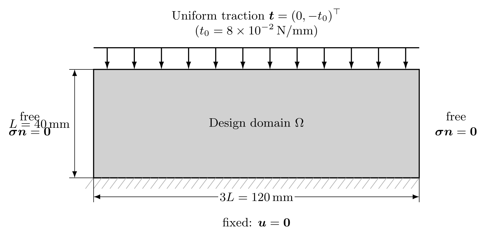
**图 5.4**  二维轴承装置几何与边界条件示意图

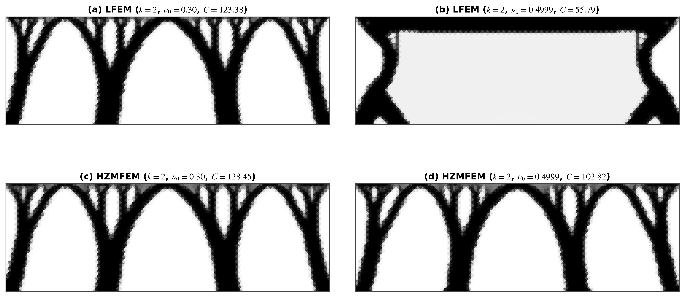
**图 5.5**  $k=2$ 阶次下可压缩（$\nu_0=0.3$）与近不可压缩（$\nu_0=0.4999$）构型对比（上排：LFEM；下排：HZMFEM）

**表 5.3**  二维轴承装置拓扑优化定量结果对比（$k=2$）

| 离散方法 | 单元阶次 $k$ | Poisson 比 $\nu_0$ | 最终柔顺度 $C$ | 优化迭代步数 | 构型特征与体积自锁表现 |
| :--- | :--- | :--- | :--- | :--- | :--- |
| 标准位移法 (LFEM) | $k=2$ | $0.30$ | $123.38$ | 196 (收敛) | 正常多拱形支撑结构，无自锁 |
| 标准位移法 (LFEM) | $k=2$ | $0.4999$ | $55.79$ | 500 (未收敛) | **严重体积自锁**：材料异常堆积，产生非物理虚假铰链，人工刚化 |
| Hu–Zhang 混合法 (HZMFEM) | $k=2$ (稳定化) | $0.30$ | $128.45$ | 283 (收敛) | 正常多拱形支撑结构，与位移法高度一致 |
| Hu–Zhang 混合法 (HZMFEM) | $k=2$ (稳定化) | $0.4999$ | $102.82$ | 297 (收敛) | **天然免疫自锁**：保持清晰多拱形构型，合理反映近不可压缩抗剪刚度 |

对比如图 5.5 与表 5.3 所示：在 $\nu_0=0.4999$ 下，位移法遭遇严重体积自锁，演化出病态的人工铰链；而 Hu–Zhang 混合元基于柔度变分原理，在不可压缩极限下保持良好的适定性，稳健生成清晰平滑的多拱形构型。

#### 5.2.3 Local Stress-Constrained Cantilever Beam

考察悬臂梁局部应力约束优化算例（图 5.6）。设计域 $80\,\mathrm{mm} \times 40\,\mathrm{mm}$，许用应力 $\bar{\sigma}=180\,\mathrm{MPa}$，采用无分母表观应力松弛模型与增广拉格朗日法。

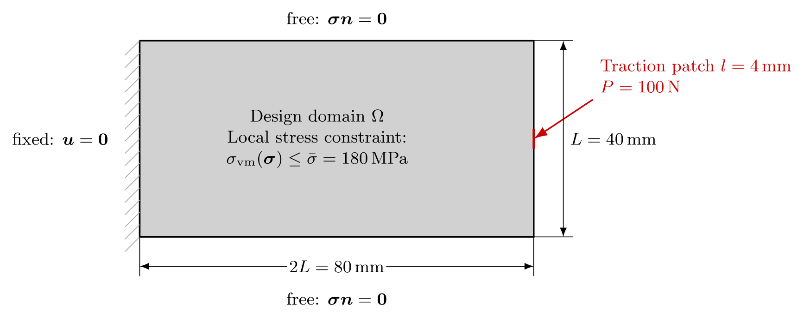
**图 5.6**  二维悬臂梁设计域与局部载荷示意图

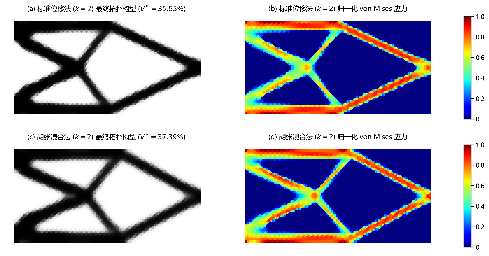
**图 5.7**  悬臂梁局部应力约束拓扑构型与应力分布对比：(a,b) 位移法 $k=2$；(c,d) Hu–Zhang 混合法 $k=2$

**表 5.4**  悬臂梁局部应力约束拓扑优化定量对比汇总表

| 离散方法 | 空间阶次 | 最终体积分数 $V^*$ | 最大归一化应力 $\max(\tilde{\sigma}_{\mathrm{vm}})$ | 收敛全局步数 | 构型特征与机理分析 |
| :--- | :--- | :--- | :--- | :--- | :--- |
| 标准位移法 (LFEM) | $k=2$ | $35.55\%$ | $0.9964$ (名义达标) | 185 步 | **求导降阶抹平峰值**：单元交界应力跳跃，低估局部峰值导致过度挖除材料陷入过优化 |
| Hu–Zhang 混合法 (HZMFEM) | $k=2$ | $37.39\%$ | $\mathbf{1.0028}$ (容差内收敛) | **139 步** | **原生应力协调连续**：应力天然 $H(\mathrm{div})$ 协调，精准捕捉危险区域，共同分担载荷 |

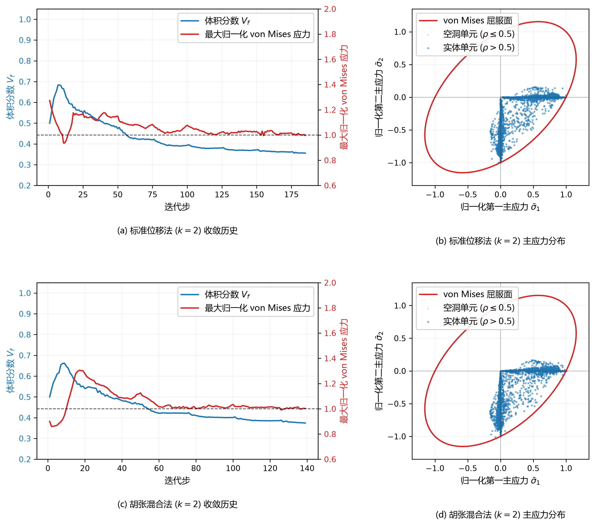
**图 5.8**  悬臂梁优化收敛历史与主应力空间单元分布对比：(a,b) 位移法；(c,d) Hu–Zhang 混合法

如图 5.7、图 5.8 与表 5.4 所示：
1. **应力场光滑度与局部保真性**：传统位移法因后处理求导导致单元边界应力产生伪跳跃与数值锯齿；胡张混合元直接以对称应力为基本变量，跨单元法向应力天然 $H(\mathrm{div})$ 协调连续，杆件内部与交叉节点处的应力场平滑过渡；
2. **安全承载与消除“过优化”缺陷**：传统位移法因应力求导降阶与数值抹平效应低估了局部危险峰值应力，导致优化算法误判而过度挖除材料（$V^* = 35.55\%$，且按其自身低估的应力度量名义达标 $0.9964$），陷入欠安全的“过优化”陷阱；胡张混合元凭借原生应力解析的高精度，精准捕捉危险区域并保留充足材料分担载荷（$V^* = 37.39\%$，最大应力收敛于容差内的 $1.0028$），主应力空间散点紧密贴合屈服椭圆边界，切实保证了结构在真实物理工况下的承载安全性；
3. **收敛效率与稳定性**：得益于底层高精度物理场提供的平滑梯度信息，混合法迭代历程平稳（仅需 139 步收敛，较位移法的 185 步提速约 $25\%$），消除了位移法伴随的高频数值震荡。

为进一步验证任意次框架的普适性与高阶逼近优势，将应力约束优化推广至原生高阶离散格式（$k=3$ 与 $k=4$）。高阶胡张元空间天然满足离散 inf-sup 稳定性，可直接采用标准混合变分格式求解而无需引入跳量稳定化惩罚项，其最终优化构型与归一化 Von Mises 应力分布如图 5.9 所示。

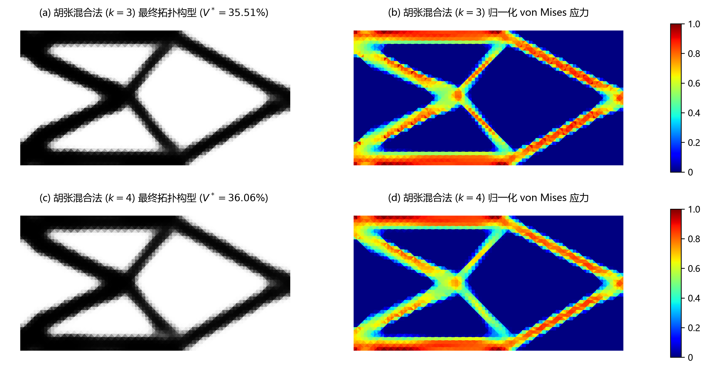
**图 5.9**  高阶胡张混合有限元（$k=3,4$）悬臂梁应力约束优化最终构型与归一化 Von Mises 应力分布：(a,b) $k=3$（$P_3$ 应力 / $P_2$ 位移）；(c,d) $k=4$（$P_4$ 应力 / $P_3$ 位移）

结果表明：在脱离人工稳定化参数干预的高阶情形下，胡张混合法依然稳健演化出与 $k=2$ 高度一致的拓扑构型，且均满足应力约束容差（$k=3$：$V^* = 35.51\%$，最大归一化应力 $0.9990$，185 步收敛；$k=4$：$V^* = 36.06\%$，最大归一化应力 $1.0028$，166 步收敛）；同时，得益于高阶多项式更强的函数逼近能力，杆件边界更加清晰锐利，灰色过渡单元显著减少，交叉节点几何突变处的应力梯度解析更加精细自然，充分证实了任意次胡张混合元在局部应力约束拓扑优化中的高精度应力解析能力与阶次鲁棒性。

---

## 6 Concluding Remarks

### 6.1 Key Conclusions

本文系统构建并验证了面向连续体结构拓扑优化的任意次胡张混合有限元计算框架，主要学术结论概括如下：

1. **胡张混合变分优化体系的自洽构造与灵敏度一致性**：首次将任意次单纯形胡张混合有限元空间引入变密度拓扑优化，确立了“自由度管理即法向迹管理”的自洽离散架构，配合两单元局部角点松弛有效消除了混合边界过约束冲突；通过引入低阶跳量稳定化机制保障了全阶次变分系统的数值稳定性，并借助设计无关的牵引提升技术在变分层面推导了纯显式的互补能解析灵敏度格式，规避了非齐次 Neumann 边界下的隐式状态求导与附加伴随方程求解，构建了前向物理分析与拓扑优化灵敏度严格一致的变分优化体系；
2. **近不可压缩材料拓扑优化中的天然抗体积自锁特性**：依托胡张混合有限元离散稳定性常数独立于材料拉梅常数 $\lambda$ 的数学本质，在平面应变近不可压缩极限（$\nu_0 \to 0.5$）下，胡张混合元拓扑优化从变分底层彻底免疫了传统低阶位移法固有的体积自锁与非物理虚假人工铰链缺陷，结合双参数泊松比修正插值，稳健演化出客观反映真实抗剪刚度的清晰多拱形承载拓扑；
3. **原生独立应力驱动的局部应力约束拓扑优化与真实安全性**：揭示了胡张变分机制驱动低密度孔洞区表观应力自然衰减的物理特性，无需传统分母人工松弛即可消除应力奇异性。混合元原生 $H(\operatorname{div})$ 协调连续应力场消除了传统位移法因求导降阶抹平峰值而导致的“虚假达标、过度切削”的欠安全过优化陷阱，实现了局部应力约束的高精度平滑逼近与真实承载安全性。

### 6.2 Future Work and Outlook

本文研究当前建立在二维、小变形线弹性与单纯形网格基础之上。结合计算力学与工程结构拓扑优化的发展趋势，后续研究可沿以下四个前沿方向进一步深化：

1. **三维复杂混合边界局部松弛与大规模鞍点快速求解**：虽然本文所依托的 SOPTX 平台已完整支持三维四面体网格上的任意次胡张混合有限元空间，但在处理三维非结构网格中的 Dirichlet 与 Neumann 混合边界交汇问题时，相交棱边邻接四面体拓扑多变且张量分量多重耦合，通用的三维棱边与顶点局部应力松弛算法及自动化自由度解耦机制仍有待深入攻关；同时，针对三维高阶离散伴随的庞大未知量，需进一步发展适配鞍点系统的代数多重网格（AMG）与辅助空间预条件子（ASP）等高性能并行求解技术；
2. **后验误差估计与 $h$/$p$-自适应拓扑优化**：依托胡张混合元天然满足 $H(\operatorname{div})$ 协调性的原生对称应力场，构建残差型后验误差估计子，在拓扑演化几何前沿、凹角奇异区与高应力集中区域实施动态 $h$/$p$-自适应网格加密与阶次自适应调整，实现计算代价与局部力学解析精度的全局最优平衡；
3. **几何大变形与复杂非线性材料本构**：将混合有限元拓扑优化变分框架从几何线性扩展至有限变形与材料非线性领域，重点攻克基于大变形超弹性橡胶材料（如近不可压缩 Mooney–Rivlin、Ogden 本构）及弹塑性本构的拓扑优化，充分释放混合元在全域非线性不可压缩问题中的抗自锁与高精度应力追踪优势；
4. **多物理场耦合与隐式边界演化范式**：将高精度混合物理场求解能力拓展至热-力耦合、流-固耦合及压电结构等多物理场拓扑优化；并进一步将胡张混合有限元与水平集（Level Set）、相场（Phase Field）等显式/隐式边界演化方法相结合，消除基于固定网格密度法产生的阶梯状边界效应。

---

## Appendix A Explicit Basis and Corner Relaxation DOF Inventory

本附录给出二维参考单纯形 $\hat{T} = \{ (\hat{x}, \hat{y}) : \hat{x} \ge 0, \hat{y} \ge 0, \hat{x}+\hat{y} \le 1 \}$ 上 Hu–Zhang 元的显式张量基函数构造示例以及两单元角点松弛自由度的代数映射清单，为算法落地与工程可复现性提供直接的实现参考。

### A.1 Reference Frames and Basis Functions for $k=1$

对于 $k=1$（$\dim \mathbb{P}_1(\hat{T};\mathbb{S}) = 6$），6 个局部基函数分别对应 3 个顶点的法向迹分量与 3 个单元内部张量模态：
$$
\begin{aligned}
\boldsymbol{\phi}_1 &= \lambda_1 \operatorname{sym}(\boldsymbol{n}_1 \otimes \boldsymbol{n}_1), \quad
\boldsymbol{\phi}_2 = \lambda_2 \operatorname{sym}(\boldsymbol{n}_2 \otimes \boldsymbol{n}_2), \quad
\boldsymbol{\phi}_3 = \lambda_3 \operatorname{sym}(\boldsymbol{n}_3 \otimes \boldsymbol{n}_3), \\
\boldsymbol{\phi}_4 &= \operatorname{sym}(\boldsymbol{e}_x \otimes \boldsymbol{e}_x), \quad
\boldsymbol{\phi}_5 = \operatorname{sym}(\boldsymbol{e}_y \otimes \boldsymbol{e}_y), \quad
\boldsymbol{\phi}_6 = \operatorname{sym}(\boldsymbol{e}_x \otimes \boldsymbol{e}_y).
\end{aligned}
$$
其中 $\lambda_i$ 为单元重心坐标。

### A.2 Corner Relaxation DOF Mapping Table

在两单元松弛角点 $x_c$ 处，四自由度 $(d_0, d_1, d_2, d_3)$ 映射关系如下：
- $d_0 \leftrightarrow \operatorname{sym}(\boldsymbol{n}_e \otimes \boldsymbol{n}_e)$（法向正应力，两单元共享）；
- $d_1 \leftrightarrow \operatorname{sym}(\boldsymbol{n}_e \otimes \boldsymbol{t}_e)$（法向剪应力，两单元共享）；
- $d_2 \leftrightarrow \operatorname{sym}(\boldsymbol{t}_e \otimes \boldsymbol{t}_e)|_{K^+}$（单元 $K^+$ 私有切向正应力）；
- $d_3 \leftrightarrow \operatorname{sym}(\boldsymbol{t}_e \otimes \boldsymbol{t}_e)|_{K^-}$（单元 $K^-$ 私有切向正应力）。

该构造在代数上保证了 $\boldsymbol{\Sigma}_{h,\mathrm{rel}}^k \subset H(\operatorname{div},\Omega;\mathbb{S})$ 的连续嵌入。

---

## References

1. Brezzi, F., Fortin, M. *Mixed and Hybrid Finite Element Methods*. Springer-Verlag, New York, 1991. DOI: `10.1007/978-1-4612-3172-1`.
2. Boffi, D., Brezzi, F., Fortin, M. *Mixed Finite Element Methods and Applications*. Springer-Verlag, Berlin, Heidelberg, 2013. DOI: `10.1007/978-3-642-36519-5`.
3. Arnold, D. N., Winther, R. Mixed finite elements for elasticity. *Numerische Mathematik*, 92(3), 401–419, 2002. DOI: `10.1007/s002110100348`.
4. Arnold, D. N., Falk, R. S., Winther, R. Mixed finite element methods for linear elasticity with weakly imposed symmetry. *Mathematics of Computation*, 76(260), 1699–1723, 2007. DOI: `10.1090/S0025-5718-07-01998-3`.
5. Adams, S., Cockburn, B. A mixed finite element method for elasticity on simplicial meshes. *Journal of Scientific Computing*, 22(1), 19–40, 2005. DOI: `10.1007/s10915-004-4134-y`.
6. Stenberg, R. On the construction of optimal mixed finite element methods for the linear elasticity problem. *Numerische Mathematik*, 53(5), 519–538, 1988. DOI: `10.1007/BF01396323`.
7. Hu, J. Finite element approximations of symmetric tensors on simplicial grids in $\mathbb{R}^n$: the higher order case. *Journal of Computational Mathematics*, 33(3), 283–296, 2015. DOI: `10.4208/jcm.1412-m2014-0071`.
8. Hu, J., Zhang, S. A family of conforming mixed finite elements for linear elasticity on simplicial grids. *arXiv preprint*, arXiv:1406.7457, 2014.
9. Chen, L., Hu, J., Huang, X. Stabilized mixed finite element methods for linear elasticity on simplicial grids in $\mathbb{R}^n$. *Computational Methods in Applied Mathematics*, 17(1), 17–31, 2017. DOI: `10.1515/cmam-2016-0035`.
10. Hu, J., Ma, R. Partial relaxation of $C^0$ vertex continuity of stresses of conforming mixed finite elements for the elasticity problem. *Computational Methods in Applied Mathematics*, 21(1), 89–108, 2021. DOI: `10.1515/cmam-2020-0003`.
11. Chen, C., Chen, L., Huang, X., Wei, H. Geometric decomposition and efficient implementation of high order face and edge elements. *Communications in Computational Physics*, 35(4), 1045–1072, 2024. DOI: `10.4208/cicp.OA-2023-0249`.
12. Chen, L., Hu, J., Huang, X. Fast auxiliary space preconditioners for linear elasticity in mixed form. *Mathematics of Computation*, 87(312), 1601–1633, 2018. DOI: `10.1090/mcom/3277`.
13. Chen, L., Hu, J., Huang, X., Man, H. Residual-based a posteriori error estimates for symmetric stress mixed finite element methods. *Journal of Scientific Computing*, 76(2), 1147–1172, 2018. DOI: `10.1007/s10915-018-0657-3`.
14. Bruggi, M., Venini, P. Topology optimization of incompressible media using mixed finite elements. *Computer Methods in Applied Mechanics and Engineering*, 196(33-34), 3151–3164, 2007. DOI: `10.1016/j.cma.2007.02.013`.
15. Sigmund, O., Clausen, P. M. Topology optimization of compliances and mechanisms in near-incompressible materials. *Mechanics of Materials*, 30(2), 135–152, 1998. DOI: `10.1016/S0167-6636(98)00033-0`.
16. Kumar, P., Suresh, K. Large-scale topology optimization using mixed formulation for nearly incompressible materials. *Structural and Multidisciplinary Optimization*, 55(4), 1361–1373, 2017. DOI: `10.1007/s00158-016-1579-2`.
17. Puso, M. A., Solberg, J. A stabilized mixed finite element method for nearly incompressible elasticity. *International Journal for Numerical Methods in Engineering*, 67(1), 107–134, 2006. DOI: `10.1002/nme.1627`.
18. Bruggi, M. Topology optimization with mixed finite elements on regular grids. *Computer Methods in Applied Mechanics and Engineering*, 305, 133–153, 2016. DOI: `10.1016/j.cma.2016.03.010`.
19. Brezzi, F., Adams, S. Stabilized mixed finite element methods for nearly incompressible elasticity. *Journal of Elasticity*, 72(1-3), 5–22, 2003. DOI: `10.1023/B:ELAS.0000018596.99341.2c`.
20. Duysinx, P., Bendsøe, M. P. Topology optimization of continuum structures with local stress constraints. *International Journal for Numerical Methods in Engineering*, 43(8), 1453–1478, 1998. DOI: `10.1002/(SICI)1097-0207(19981230)43:8<1453::AID-NME480>3.0.CO;2-2`.
21. Cheng, G., Guo, X. $\varepsilon$-relaxation approach for topological optimization of truss structures with stress constraints. *Structural Optimization*, 13(4), 258–266, 1997. DOI: `10.1007/BF01197454`.
22. Le, C., Norato, J., Bruns, T., Ha, C., Tortorelli, D. Stress-based topology optimization for continua. *Structural and Multidisciplinary Optimization*, 41(4), 605–620, 2010. DOI: `10.1007/s00158-009-0440-y`.
23. Bruggi, M., Venini, P. A mixed FEM approach to stress-constrained topology optimization. *International Journal for Numerical Methods in Engineering*, 73(12), 1693–1714, 2008. DOI: `10.1002/nme.2138`.
24. Bruggi, M., Duysinx, P. Topology optimization for minimum weight with stress constraints using mixed elements. *Structural and Multidisciplinary Optimization*, 46(3), 369–384, 2012. DOI: `10.1007/s00158-012-0777-z`.
25. Holmberg, E., Torstenfelt, B., Klarbring, A. Stress constrained topology optimization using augmented Lagrangian methods. *Structural and Multidisciplinary Optimization*, 48(1), 33–47, 2013. DOI: `10.1007/s00158-012-0880-1`.
26. da Silva, G. A., Beck, A. T., Sigmund, O. Topology optimization of continuum structures with local stress constraints using an augmented Lagrangian framework. *Computer Methods in Applied Mechanics and Engineering*, 357, 112571, 2019. DOI: `10.1016/j.cma.2019.112571`.
27. Senhora, F. V., Sanders, E. D., Paulino, G. H. Optimizing stress-constrained topologies with augmented Lagrangian and MMA. *Structural and Multidisciplinary Optimization*, 62(5), 2311–2329, 2020. DOI: `10.1007/s00158-020-02604-x`.
28. París, J., Navarrina, F., Colominas, I., Casteleiro, M. Topology optimization of continuum structures with local and global stress constraints. *International Journal for Numerical Methods in Engineering*, 83(13), 1764–1788, 2010. DOI: `10.1002/nme.2882`.
29. Bendsøe, M. P., Sigmund, O. *Topology Optimization: Theory, Methods, and Applications*. Springer-Verlag, Berlin, Heidelberg, 2003. DOI: `10.1007/978-3-662-05086-6`.
30. Bendsøe, M. P. Optimal shape design as a material distribution problem. *Structural Optimization*, 1(4), 193–202, 1989. DOI: `10.1007/BF01650949`.
31. Svanberg, K. The method of moving asymptotes—a new method for structural optimization. *International Journal for Numerical Methods in Engineering*, 24(2), 359–373, 1987. DOI: `10.1002/nme.1620240207`.
32. Bourdin, B. Filters in topology optimization. *International Journal for Numerical Methods in Engineering*, 50(9), 2143–2158, 2001. DOI: `10.1002/nme.116`.
33. Guest, J. K., Prévost, J. H., Belytschko, T. Achieving minimum length scale in topology optimization by nodal design variables and projection functions. *International Journal for Numerical Methods in Engineering*, 61(2), 238–254, 2004. DOI: `10.1002/nme.1064`.
34. Zegard, T., Paulino, G. H. Bridging domains: High-order and polygonal finite elements in topology optimization. *International Journal for Numerical Methods in Engineering*, 108(2), 103–133, 2016. DOI: `10.1002/nme.5208`.
35. Andreassen, E., Clausen, A., Schevenels, M., Lazarov, B. S., Sigmund, O. Efficient topology optimization in MATLAB using 88 lines of code. *Structural and Multidisciplinary Optimization*, 43(1), 1–16, 2011. DOI: `10.1007/s00158-010-0594-7`.
36. Wei, H., et al. FEALPy: Finite Element Analysis Library in Python. <https://github.com/weihua-h/fealpy>, 2024.