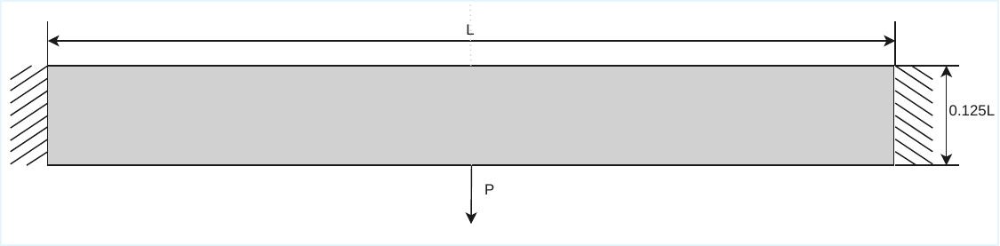
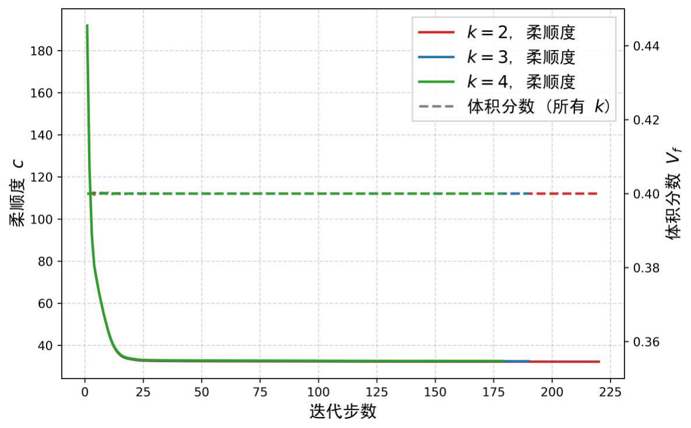
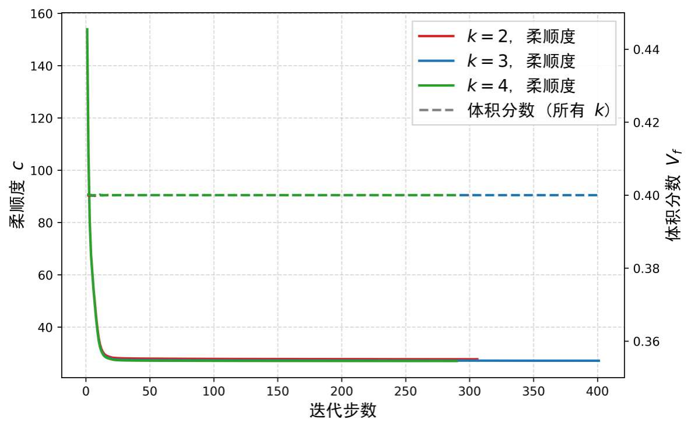

# 任意次 Hu–Zhang 混合有限元拓扑优化

## 摘要

密度法拓扑优化通常采用以位移为唯一未知量的有限元模型，并在单元层面由位移梯度恢复应力。该处理易于实现，但在以应力精度、材料近不可压缩性或局部应力约束为核心的设计问题中，位移离散的应力恢复误差可能直接进入目标函数、约束函数及其灵敏度。本文将以对称应力和位移为独立未知量的 Hu–Zhang 混合有限元系统地引入密度法拓扑优化，并把已有的最低阶、规则网格离散推广到任意多项式次数和单纯形网格。首先，从带非齐次 Neumann 边界条件的 Hellinger–Reissner 变分原理出发，通过牵引提升构造可计算的离散状态方程，明确总应力在目标函数和设计灵敏度中的作用。随后，基于单纯形上的几何分解构造任意次 Hu–Zhang 应力空间，并分别讨论低阶离散的跳量稳定化及复杂边界角点处的局部自由度松弛。进一步地，本文给出互补能柔顺度、密度相关材料参数插值、无密度分母的表观应力约束、增广拉格朗日求解及伴随灵敏度的一致表达。数值研究包括制造解收敛、精度—成本比较、低阶稳定化与角点松弛消融、近不可压缩结构优化、局部应力约束优化以及冻结设计的统一高阶复核，用以考察独立应力近似在不同离散次数和力学条件下的精度、可靠性与计算成本。

**关键词：** Hu–Zhang 混合有限元；密度法拓扑优化；Hellinger–Reissner 变分原理；近不可压缩弹性；局部应力约束

## 1 引言

拓扑优化通过在给定设计域内分配材料，为结构性能与材料用量之间的权衡提供系统化设计手段。以 SIMP 为代表的密度法因模型清晰、算法成熟和工程适应性强而得到广泛应用（Bendsøe 与 Sigmund，2003）。在经典实现中，线弹性状态方程通常采用基于位移的有限元离散，应力则由离散位移的梯度在单元内部恢复。这一方案对于柔顺度最小化等以整体响应为主的模型通常足够有效，但当优化问题显式依赖局部应力，或材料参数趋近不可压缩极限时，分析误差会更直接地影响设计决策。

局部应力约束拓扑优化至少面临三个相互关联的困难（Duysinx 与 Bendsøe，1998；Le 等，2010）。第一，局部应力是随网格和几何细节变化的高维约束，尖角、载荷施加点和边界条件转换点还可能产生几何应力奇异性。第二，密度趋近于零时，真实应力或松弛应力的不同定义可能引入数值奇异表达，使约束及其灵敏度难以稳定计算。第三，如果应力完全由位移场后处理得到，那么离散误差、恢复策略和优化模型会彼此耦合，难以区分某一设计差异究竟来自结构模型还是来自应力恢复误差。

混合有限元为上述问题提供了另一种分析路径。Hellinger–Reissner 原理将对称应力和位移同时作为未知量，应力近似直接属于对称张量的 $H(\mathrm{div})$ 空间。因而，离散应力的法向牵引在内部单元面上单值，并且平衡方程能够在与位移空间一致的离散意义下直接满足。这里需要强调，$H(\mathrm{div})$ 协调性只保证法向牵引的连续性，并不意味着完整应力张量跨单元连续。与位移元相比，混合方法增加了未知量和鞍点系统求解成本，但也为独立控制应力逼近、平衡残差以及材料不可压缩极限下的稳定性提供了结构化工具。

Hu–Zhang 元是对称应力混合有限元的重要构造之一。其局部应力空间由单纯形上的对称张量多项式组成，并借助几何分解识别与各维子单形相关的法向和切向分量。Hu（2015）给出了高阶单纯形构造及其稳定性与误差分析，Chen 等（2017）进一步研究了低阶稳定化，Hu 与 Ma（2021）则讨论了顶点应力连续性的部分松弛。该离散族既能维持应力的 $H(\mathrm{div})$ 协调性，又允许建立任意多项式次数的离散。然而，把这类任意次、单纯形网格上的对称应力离散完整嵌入密度法拓扑优化，仍需要解决若干模型和实现层面的衔接问题。

现有 truly-mixed 拓扑优化研究已表明，直接离散应力和位移能够用于近不可压缩材料设计、应力约束设计和规则网格上的柔顺度优化（Bruggi 与 Venini，2007、2008；Bruggi，2016）。不过，许多已有实现集中于最低阶离散、规则网格或特定单元构造。由此产生的关键问题不是简单地“换用一个更高阶单元”，而是如何形成一套从连续变分原理到优化灵敏度都一致的任意次方法：非齐次牵引如何进入状态方程；低阶空间如何稳定化；复杂角点如何在不破坏 $H(\mathrm{div})$ 协调性的前提下处理不相容边界数据；密度相关的柔顺度和局部应力约束如何对总应力求导；不同分析方法产生的最终设计又应如何公平复核。

本文围绕这一问题建立任意次 Hu–Zhang 混合有限元密度拓扑优化框架。近不可压缩材料和局部应力约束在本文中不是两个与离散方法并列的独立主题，而是检验独立应力离散价值的两类代表性应用。本文的主要工作概括如下。

1. 从带非齐次牵引边界的 Hellinger–Reissner 变分问题出发，引入设计无关的牵引提升，给出任意次 Hu–Zhang 离散状态方程，并在互补能和灵敏度中始终使用总应力。

2. 将单纯形上的任意次 Hu–Zhang 应力空间用于密度法拓扑优化，统一说明高阶稳定离散、低阶跳量稳定化以及复杂边界角点处的部分顶点自由度松弛。

3. 建立适用于独立应力变量的互补能柔顺度、近不可压缩材料插值和表观应力局部约束，并推导固定增广拉格朗日乘子、惩罚参数和激活集条件下的伴随灵敏度。

4. 设计包含制造解、精度—成本比较、离散消融、近不可压缩优化、局部应力约束优化和冻结设计复核的统一验证方案，以区分分析精度、优化路径与最终设计性能。

本文余下内容安排如下。第 2 节介绍连续混合变分问题、任意次 Hu–Zhang 空间、低阶稳定化和角点松弛；第 3 节给出密度拓扑优化模型及其伴随灵敏度；第 4 节给出数值验证与算例；第 5 节总结主要结论与适用边界。

## 2 任意次 Hu–Zhang 混合有限元

### 2.1 线弹性问题及 Hellinger–Reissner 变分形式

设 $\Omega\subset\mathbb{R}^d$（$d=2,3$）为有界多面体区域，其边界分解为互不相交的 Dirichlet 边界 $\Gamma_D$ 和 Neumann 边界 $\Gamma_N$，且 $\overline{\Gamma_D\cup\Gamma_N}=\partial\Omega$。线弹性问题写为

$$
\begin{aligned}
-\operatorname{div}\boldsymbol{\sigma} &= \boldsymbol{b}
&& \text{in }\Omega,\\
\mathcal{A}_{\rho}\boldsymbol{\sigma}
&= \boldsymbol{\varepsilon}(\boldsymbol{u})
&& \text{in }\Omega,\\
\boldsymbol{u} &= \boldsymbol{u}_D
&& \text{on }\Gamma_D,\\
\boldsymbol{\sigma}\boldsymbol{n} &= \boldsymbol{g}
&& \text{on }\Gamma_N.
\end{aligned}
$$

其中，$\boldsymbol{\sigma}$ 为对称 Cauchy 应力，$\boldsymbol{u}$ 为位移，$\boldsymbol{b}$ 为体力，$\boldsymbol{g}$ 为给定边界牵引，$\boldsymbol{n}$ 为外法向，且

$$
\boldsymbol{\varepsilon}(\boldsymbol{u})
=\frac{1}{2}\left(\nabla\boldsymbol{u}
+\nabla\boldsymbol{u}^{\mathsf T}\right).
$$

$\mathcal{A}_{\rho}$ 表示可能依赖过滤后密度场的柔度张量。对于各向同性材料，在 $d$ 维情形可写为

$$
\mathcal{A}_{\rho}\boldsymbol{\tau}
=
\frac{1}{2\mu(\rho)}
\left(
\boldsymbol{\tau}
-
\frac{\lambda(\rho)}
{2\mu(\rho)+d\lambda(\rho)}
\operatorname{tr}(\boldsymbol{\tau})\boldsymbol{I}
\right),
$$

其中 $\lambda(\rho)$ 和 $\mu(\rho)$ 为 Lamé 参数。平面应力和平面应变情形使用各自一致的二维本构关系，不能在同一组算例中混用。

记 $\mathbb{S}$ 为 $d\times d$ 对称矩阵空间，并定义

$$
\begin{aligned}
\boldsymbol{\Sigma}
&=H(\operatorname{div},\Omega;\mathbb{S}),\\
\boldsymbol{\Sigma}_0
&=\left\{
\boldsymbol{\tau}\in\boldsymbol{\Sigma}:
\boldsymbol{\tau}\boldsymbol{n}=\boldsymbol{0}
\text{ on }\Gamma_N
\right\},\\
\boldsymbol{\Sigma}_g
&=\left\{
\boldsymbol{\tau}\in\boldsymbol{\Sigma}:
\boldsymbol{\tau}\boldsymbol{n}=\boldsymbol{g}
\text{ on }\Gamma_N
\right\},\\
\boldsymbol{V}
&=L^2(\Omega;\mathbb{R}^d).
\end{aligned}
$$

Hellinger–Reissner 混合变分问题为：求 $(\boldsymbol{\sigma},\boldsymbol{u}) \in\boldsymbol{\Sigma}_g\times\boldsymbol{V}$，使得

$$
\begin{aligned}
a_\rho(\boldsymbol{\sigma},\boldsymbol{\tau})
+b(\boldsymbol{\tau},\boldsymbol{u})
&=
\langle\boldsymbol{u}_D,\boldsymbol{\tau}\boldsymbol{n}\rangle_{\Gamma_D},
&&\forall\boldsymbol{\tau}\in\boldsymbol{\Sigma}_0,\\
b(\boldsymbol{\sigma},\boldsymbol{v})
&=
-(\boldsymbol{b},\boldsymbol{v})_\Omega,
&&\forall\boldsymbol{v}\in\boldsymbol{V},
\end{aligned}
$$

其中

$$
a_\rho(\boldsymbol{\sigma},\boldsymbol{\tau})
=
(\mathcal{A}_{\rho}\boldsymbol{\sigma},
\boldsymbol{\tau})_\Omega,
\qquad
b(\boldsymbol{\tau},\boldsymbol{v})
=
(\operatorname{div}\boldsymbol{\tau},
\boldsymbol{v})_\Omega.
$$

位移在该变分形式中仅属于 $L^2$，因而不要求跨单元连续；应力则属于 $H(\operatorname{div})$，其法向牵引在内部面上单值。连续问题及其离散问题的良定性依赖核空间上的椭圆性和适当的 inf-sup 条件。

### 2.2 非齐次牵引提升

拓扑优化算例通常通过 Neumann 边界施加载荷。若直接把非齐次牵引自由度消元而不区分齐次未知应力与给定提升，应力相关目标及其导数容易漏项。为此，取一个满足

$$
\boldsymbol{\sigma}_g\boldsymbol{n}
=\boldsymbol{g}
\quad\text{on }\Gamma_N
$$

的设计无关提升，并令

$$
\boldsymbol{\sigma}
=\boldsymbol{\sigma}_0+\boldsymbol{\sigma}_g,
\qquad
\boldsymbol{\sigma}_0\in\boldsymbol{\Sigma}_0.
$$

代入混合变分问题后得到

$$
\begin{aligned}
a_\rho(\boldsymbol{\sigma}_0,\boldsymbol{\tau})
+b(\boldsymbol{\tau},\boldsymbol{u})
&=
\langle\boldsymbol{u}_D,\boldsymbol{\tau}\boldsymbol{n}\rangle_{\Gamma_D}
-a_\rho(\boldsymbol{\sigma}_g,\boldsymbol{\tau}),
\\
b(\boldsymbol{\sigma}_0,\boldsymbol{v})
&=
-(\boldsymbol{b},\boldsymbol{v})_\Omega
-b(\boldsymbol{\sigma}_g,\boldsymbol{v}).
\end{aligned}
$$

因此，即使外部载荷本身不随设计变量变化，第一行右端通常仍通过 $\mathcal{A}_{\rho}$ 依赖密度。后续推导可以采用两种等价方式：对含密度相关右端的约化系统求导，或始终把目标与导数写成总应力 $\boldsymbol{\sigma}_0+\boldsymbol{\sigma}_g$ 的形式。本文采用后一种表达，以减少遗漏提升交叉项的风险。

### 2.3 单纯形上的任意次 Hu–Zhang 空间

令 $\mathcal{T}_h$ 为 $\Omega$ 的形状正则单纯形剖分。对任意单元 $T\in\mathcal{T}_h$ 和多项式次数 $k\ge 1$，局部对称应力多项式空间为

$$
\mathbb{P}_k(T;\mathbb{S}).
$$

Hu–Zhang 空间的关键不在于局部多项式空间本身，而在于如何依据单纯形的几何实体分解应力自由度，并在装配时只共享保证法向迹连续所需的自由度。设 $f$ 为 $T$ 的某个 $\ell$ 维子单形，$\{\boldsymbol{t}_i^f\}$ 和 $\{\boldsymbol{n}_j^f\}$ 分别张成其切空间与法空间。与 $f$ 相关的对称矩阵分量可以分为

$$
\mathbb{T}_f(\mathbb{S})
=
\operatorname{span}
\left\{
\operatorname{sym}
(\boldsymbol{t}_i^f\otimes\boldsymbol{t}_j^f)
\right\},
$$

和

$$
\mathbb{N}_f(\mathbb{S})
=
\operatorname{span}
\left\{
\operatorname{sym}
(\boldsymbol{t}_i^f\otimes\boldsymbol{n}_j^f),
\operatorname{sym}
(\boldsymbol{n}_i^f\otimes\boldsymbol{n}_j^f)
\right\}.
$$

其中 $\operatorname{sym}(\boldsymbol{a}\otimes\boldsymbol{b}) = (\boldsymbol{a}\otimes\boldsymbol{b} + \boldsymbol{b}\otimes\boldsymbol{a})/2$。 $\mathbb{N}_f(\mathbb{S})$ 中的分量与法向迹相关，在相邻单元之间按全局实体共享； $\mathbb{T}_f(\mathbb{S})$ 中的分量可作为单元内部或局部自由度处理。由此得到全局应力空间

$$
\boldsymbol{\Sigma}_h^k
\subset H(\operatorname{div},\Omega;\mathbb{S}),
$$

并与分片不连续位移空间

$$
\boldsymbol{V}_h^{k-1}
=
\left\{
\boldsymbol{v}_h\in L^2(\Omega;\mathbb{R}^d):
\boldsymbol{v}_h|_T\in
\mathbb{P}_{k-1}(T;\mathbb{R}^d),
\ \forall T\in\mathcal{T}_h
\right\}
$$

配对。

这种构造有三个直接后果。其一，应力是对称张量未知量，不需要通过拉格朗日乘子弱施加对称性；其二，离散应力的法向牵引在内部面上连续；其三，应力次数 $k$ 与位移次数 $k-1$ 可形成任意次离散族。需要注意，任意次“可定义”并不等同于任意低阶组合都天然稳定。在二维情形，未经稳定化的经典配对通常从 $k\ge 3$ 起具有理论稳定性；$k=1,2$ 需要附加稳定化或空间富集。

### 2.4 离散状态方程

取满足齐次 Neumann 条件的离散应力空间 $\boldsymbol{\Sigma}_{h,0}^k$，并构造离散牵引提升 $\boldsymbol{\sigma}_{g,h}$。离散问题为：求 $(\boldsymbol{\sigma}_{0,h},\boldsymbol{u}_h) \in\boldsymbol{\Sigma}_{h,0}^k\times \boldsymbol{V}_h^{k-1}$，使得

$$
\begin{aligned}
a_\rho(\boldsymbol{\sigma}_{0,h},\boldsymbol{\tau}_h)
+b(\boldsymbol{\tau}_h,\boldsymbol{u}_h)
&=
\langle\boldsymbol{u}_D,\boldsymbol{\tau}_h\boldsymbol{n}\rangle_{\Gamma_D}
-a_\rho(\boldsymbol{\sigma}_{g,h},\boldsymbol{\tau}_h),
\\
b(\boldsymbol{\sigma}_{0,h},\boldsymbol{v}_h)
-c_h(\boldsymbol{u}_h,\boldsymbol{v}_h)
&=
-(\boldsymbol{b},\boldsymbol{v}_h)_\Omega
-b(\boldsymbol{\sigma}_{g,h},\boldsymbol{v}_h)
-\ell_h^D(\boldsymbol{v}_h).
\end{aligned}
$$

这里 $c_h$ 是只在低阶方法中启用的稳定化双线性型， $\ell_h^D$ 是非齐次 Dirichlet 边界对应的一致性修正。高阶稳定配对取 $c_h=0$ 和 $\ell_h^D=0$。

选取基函数后，离散系统写成

$$
\begin{bmatrix}
\boldsymbol{A}_{\rho} & \boldsymbol{B}\\
\boldsymbol{B}^{\mathsf T} & -\boldsymbol{C}
\end{bmatrix}
\begin{bmatrix}
\boldsymbol{s}_0\\
\boldsymbol{u}
\end{bmatrix}
=
\begin{bmatrix}
\boldsymbol{f}_{\sigma}(\rho)\\
\boldsymbol{f}_u
\end{bmatrix}.
$$

其中 $\boldsymbol{s}_0$ 是齐次部分的应力系数， $\boldsymbol{s}=\boldsymbol{s}_0+\boldsymbol{s}_g$ 是总应力系数， $\boldsymbol{C}$ 为稳定化矩阵。该系统是对称不定鞍点系统。本文的重点是离散模型与优化灵敏度的一致性；预条件器和大规模线性求解器性能作为复现信息报告，但不把某一特定直接或迭代求解器视为方法贡献。

### 2.5 低阶跳量稳定化

对于 $k=1,2$，位移空间不足以与未富集的应力空间形成稳定配对。本文采用作用于不连续位移的对称矩阵跳量稳定化。对内部面 $F=T^+\cap T^-$，令外法向分别为 $\boldsymbol{n}^+$ 和 $\boldsymbol{n}^-$，定义

$$
\llbracket\boldsymbol{v}\rrbracket
=
\frac{1}{2}
\left(
\boldsymbol{v}^+\otimes\boldsymbol{n}^+
+\boldsymbol{n}^+\otimes\boldsymbol{v}^+
+\boldsymbol{v}^-\otimes\boldsymbol{n}^-
+\boldsymbol{n}^-\otimes\boldsymbol{v}^-
\right).
$$

在 Dirichlet 边界面上使用相应的单侧定义。稳定化项取为

$$
c_h(\boldsymbol{u}_h,\boldsymbol{v}_h)
=
\sum_{F\in\mathcal{F}_h^i\cup\mathcal{F}_h^D}
\gamma_F h_F
\int_F
\llbracket\boldsymbol{u}_h\rrbracket:
\llbracket\boldsymbol{v}_h\rrbracket\,\mathrm{d}s,
$$

其中 $\mathcal{F}_h^i$ 和 $\mathcal{F}_h^D$ 分别表示内部面和 Dirichlet 边界面，Neumann 边界面不参与该项。为使量纲与材料刚度一致，可以采用

$$
\gamma_F
=\gamma_0\frac{\mu_{\mathrm{ref}}}{L_0^2},
$$

其中 $L_0$ 为参考长度，$\mu_{\mathrm{ref}}$ 为参考剪切模量，$\gamma_0$ 为无量纲参数。该缩放是一种工程实现选择，数值部分通过网格与材料参数消融考察其参数敏感性；相关结论限于本文使用的离散与参数范围。

当 $\boldsymbol{u}_D\ne\boldsymbol{0}$ 时，Dirichlet 边界稳定化必须加入一致性线性项

$$
\ell_h^D(\boldsymbol{v}_h)
=
\sum_{F\in\mathcal{F}_h^D}
\gamma_F h_F
\int_F
\llbracket\boldsymbol{u}_D\rrbracket:
\llbracket\boldsymbol{v}_h\rrbracket\,\mathrm{d}s.
$$

本文以对称矩阵跳量为主要稳定化形式，其他向量跳量或不同尺度形式作为补充对照。低阶方法的数值结论限于本文采用的稳定化形式、网格与参数范围，不外推为一般稳定性定理。

### 2.6 复杂边界角点处的部分顶点松弛

在多边形区域的角点或边界条件转换点，不同边界边上的法向方向可能导致完整顶点应力自由度约束不相容。例如，两条相交边分别给定不同的牵引条件时，若把顶点处所有应力分量都强制为全局单值，可能过度约束离散空间。完全复制顶点应力自由度虽然能解除约束，却可能破坏相邻面法向迹的一致性。

本文采用部分顶点松弛：仅复制与局部切向分量相关、且不影响目标面法向迹的顶点自由度；与法向牵引相关的自由度仍在相邻单元之间共享。设角点 $a$ 的相邻单元集合为 $\omega_a$，则松弛空间可概念性地写成

$$
\boldsymbol{\Sigma}_{h,\mathrm{rel}}^k
=
\boldsymbol{\Sigma}_h^k
\oplus
\operatorname{span}
\left\{
\text{角点 }a\text{ 处允许局部复制的切向应力模式}
\right\}.
$$

该构造保持内部面上离散法向牵引的单值性，同时避免非相容边界数据造成额外代数约束。数值部分分别在规则边界和复杂角点算例中比较松弛前后的边界残差、误差与收敛行为。具体自由度识别和局部—全局编号方式在补充材料中给出。

## 3 密度法拓扑优化模型

### 3.1 设计变量、过滤与材料插值

将设计域划分为 $N_e$ 个设计单元，原始设计变量记为 $\boldsymbol{\rho}=(\rho_1,\ldots,\rho_{N_e})^{\mathsf T}$，并满足

$$
\rho_{\min}\le \rho_e\le 1.
$$

为抑制棋盘格并控制最小长度尺度，采用密度过滤得到物理密度

$$
\widetilde{\rho}_e
=
\frac{\displaystyle\sum_{j\in\mathcal{N}_e}
w_{ej}v_j\rho_j}
{\displaystyle\sum_{j\in\mathcal{N}_e}w_{ej}v_j},
\qquad
w_{ej}=\max(0,r_{\min}-d_{ej}),
$$

其中 $d_{ej}$ 是单元中心距离，$v_j$ 是设计单元体积， $r_{\min}$ 是过滤半径。若分析网格与设计网格不一致，则需明确给出物理密度到分析积分点的映射，并在灵敏度中使用其转置映射。

实体材料的弹性模量和 Poisson 比分别记为 $E_0$ 和 $\nu_0$。弹性模量采用带正下界的 SIMP 插值

$$
E(\widetilde{\rho}_e)
=
E_{\min}
+(E_0-E_{\min})m_E(\widetilde{\rho}_e),
\qquad
m_E(\widetilde{\rho}_e)
=\widetilde{\rho}_e^{p_E}.
$$

近不可压缩算例同时对 Poisson 比插值：

$$
\nu(\widetilde{\rho}_e)
=
\nu_{\mathrm{void}}
+(\nu_0-\nu_{\mathrm{void}})
m_\nu(\widetilde{\rho}_e),
\qquad
m_\nu(\widetilde{\rho}_e)
=\widetilde{\rho}_e^{p_\nu}.
$$

其中 $E_{\min}>0$ 用于避免空域本构矩阵奇异， $\nu_{\mathrm{void}}$ 取远离不可压缩极限的值，例如 $0.3$。这种双参数插值使低密度区域不会同时保持近不可压缩性质。所谓“近不可压缩下无锁定”必须限定在离散 inf-sup 性质、低阶稳定化、上述材料插值以及线性求解精度均满足要求的条件下。

### 3.2 互补能柔顺度模型

对于齐次位移边界和设计无关载荷，结构柔顺度可由总应力的互补能表示为

$$
C(\boldsymbol{\rho},\boldsymbol{\sigma}_h)
=
a_\rho(\boldsymbol{\sigma}_h,\boldsymbol{\sigma}_h)
=
\int_\Omega
\mathcal{A}_{\rho}\boldsymbol{\sigma}_h:
\boldsymbol{\sigma}_h\,\mathrm{d}x.
$$

基本柔顺度优化模型为

$$
\begin{aligned}
\min_{\boldsymbol{\rho},\boldsymbol{\sigma}_h,\boldsymbol{u}_h}
\quad&
C(\boldsymbol{\rho},\boldsymbol{\sigma}_h),\\
\text{s.t.}\quad&
\text{离散混合状态方程},\\
&
\frac{\sum_{e=1}^{N_e}v_e\widetilde{\rho}_e}
{\sum_{e=1}^{N_e}v_e}
\le \bar V,\\
&
\rho_{\min}\le\rho_e\le 1.
\end{aligned}
$$

这里 $\bar V$ 是允许的材料体积分数。若存在非齐次位移边界、设计相关载荷或其他外部功项，则柔顺度与互补能的等价关系必须重新检查；本文的优化算例限定为齐次位移边界和固定载荷。

在固定牵引提升 $\boldsymbol{s}_g$ 下，总应力系数为 $\boldsymbol{s}=\boldsymbol{s}_0+\boldsymbol{s}_g$。利用状态方程消去状态变量导数，可得到物理密度方向上的约化导数

$$
\frac{\partial C}{\partial\widetilde{\rho}_e}
=
\boldsymbol{s}^{\mathsf T}
\frac{\partial\boldsymbol{A}_{\rho}}
{\partial\widetilde{\rho}_e}
\boldsymbol{s}.
$$

由于材料加密通常使柔度矩阵 $\boldsymbol{A}_{\rho}$ 减小，该表达自然给出负的柔顺度导数。若只用齐次未知部分 $\boldsymbol{s}_0$ 代替总应力，将遗漏提升的交叉项与二次项。对原始设计变量的导数通过过滤链式法则计算：

$$
\frac{\mathrm{d}C}{\mathrm{d}\rho_j}
=
\sum_{e=1}^{N_e}
\frac{\partial C}{\partial\widetilde{\rho}_e}
\frac{\partial\widetilde{\rho}_e}{\partial\rho_j}.
$$

### 3.3 近不可压缩材料拓扑优化

当 $\nu_0\to 0.5$ 时，体积模量相对于剪切模量迅速增大。标准低阶位移元可能出现体积锁定，即离散位移空间不能充分表达近似无散变形，导致结构响应表现出非物理的过度刚化。在拓扑优化中，这种分析偏差不仅影响某一次状态求解，还可能持续改变灵敏度和材料演化路径。

混合应力—位移离散从柔度关系出发，不直接以位移散度约束构造刚度矩阵。理论上，满足一致 inf-sup 条件的混合离散能够在不可压缩参数极限下维持稳定误差界。不过，本文不把这一性质无条件概括为“完全消除锁定”。低阶稳定化、密度插值、网格质量、边界条件以及线性系统求解误差都可能影响实际结果。

近不可压缩实验采用

$$
\nu_0\in\{0.3,\ 0.49,\ 0.499,\ 0.4999\},
$$

并在全部参数点比较位移法与 Hu–Zhang $k=2$，在 $\nu_0=0.4999$ 增加 Hu–Zhang $k=3$ 作为高阶端点比较。本文不讨论严格不可压缩极限 $\nu_0=0.5$。

### 3.4 表观应力局部约束

设第 $e$ 个设计单元的独立离散应力为 $\boldsymbol{\sigma}_{h,e}$，其 von Mises 等效应力记为 $\sigma_{\mathrm{vm}}(\boldsymbol{\sigma}_{h,e})$，允许应力为 $\bar\sigma$。本文采用表观应力局部约束

$$
g_e(\boldsymbol{\rho},\boldsymbol{\sigma}_h)
=
\frac{\sigma_{\mathrm{vm}}(\boldsymbol{\sigma}_{h,e})}
{\bar\sigma}
-\eta(\widetilde{\rho}_e)
\le 0,
$$

其中

$$
\eta(\widetilde{\rho}_e)
=
m_E(\widetilde{\rho}_e)
+\epsilon\left[1-m_E(\widetilde{\rho}_e)\right],
\qquad
\epsilon>0.
$$

在实体区，$\eta(1)=1$，约束退化为常规归一化应力限制；在低密度区， $\eta$ 平滑趋近 $\epsilon$，从而避免在约束定义中显式除以密度或其幂次。该形式所避免的是“密度分母型”的奇异表达，并不能消除由尖角、集中载荷、边界条件突变或趋于零的几何尺度引起的真实应力奇异性。本文取

$$
\epsilon=10^{-4}.
$$

应力约束在统一积分点集合上计算单元最大或代表性 von Mises 应力；节点外推或额外平滑仅用于后处理，不参与优化约束。

### 3.5 增广拉格朗日模型

局部应力约束数量随设计单元数增长。为避免把所有约束直接交给外层优化器，本文采用可分离增广拉格朗日罚函数。以体积分数为目标，定义

$$
\Phi(\boldsymbol{\rho},\boldsymbol{\sigma}_h)
=
f_V(\boldsymbol{\rho})
+\frac{1}{N_e}
\sum_{e=1}^{N_e}
\left[
\lambda_e h_e
+\frac{\mu_e}{2}h_e^2
\right],
$$

其中

$$
f_V(\boldsymbol{\rho})
=
\frac{\sum_e v_e\widetilde{\rho}_e}
{\sum_e v_e},
\qquad
h_e
=
\max\left(g_e,-\frac{\lambda_e}{\mu_e}\right).
$$

$\lambda_e\ge0$ 和 $\mu_e>0$ 分别为乘子和惩罚参数。在每个外层增广拉格朗日循环内，固定 $\boldsymbol{\lambda}$ 和 $\boldsymbol{\mu}$，使用带移动限的梯度优化方法更新设计；外层循环再依据约束残差更新

$$
\lambda_e^{\,\mathrm{new}}
=
\max\left(0,\lambda_e+\mu_e g_e\right),
$$

并在约束改善不足时增加 $\mu_e$。惩罚参数上限、增长因子、外层更新频率和停止准则都应在复现配置中显式记录。

### 3.6 伴随灵敏度

在一次内层设计更新中，固定增广拉格朗日乘子、惩罚参数和激活分支。记

$$
\mathcal{P}
=
\sum_{e=1}^{N_e}
\left[
\lambda_e h_e
+\frac{\mu_e}{2}h_e^2
\right].
$$

对状态向量的显式导数仅通过应力进入。伴随变量 $(\boldsymbol{z}_\sigma,\boldsymbol{z}_u)$ 满足

$$
\begin{bmatrix}
\boldsymbol{A}_{\rho} & \boldsymbol{B}\\
\boldsymbol{B}^{\mathsf T} & -\boldsymbol{C}
\end{bmatrix}
\begin{bmatrix}
\boldsymbol{z}_{\sigma}\\
\boldsymbol{z}_{u}
\end{bmatrix}
=
\begin{bmatrix}
N_e^{-1}
\left(\partial\mathcal{P}/\partial\boldsymbol{s}\right)^{\mathsf T}\\
\boldsymbol{0}
\end{bmatrix}.
$$

若稳定化矩阵 $\boldsymbol{C}$ 不依赖密度，则物理密度导数为

$$
\frac{\partial\Phi}{\partial\widetilde{\rho}_e}
=
\frac{\partial f_V}{\partial\widetilde{\rho}_e}
+\frac{1}{N_e}
\frac{\partial\mathcal{P}}
{\partial\widetilde{\rho}_e}
-
\boldsymbol{z}_{\sigma}^{\mathsf T}
\frac{\partial\boldsymbol{A}_{\rho}}
{\partial\widetilde{\rho}_e}
\boldsymbol{s}.
$$

这里最后一项使用总应力 $\boldsymbol{s}$。若 $\boldsymbol{C}$、载荷提升或边界修正依赖密度，还必须加入相应导数项。

在约束处于应力控制分支，即 $h_e=g_e$ 时，有

$$
\frac{\partial g_e}{\partial\widetilde{\rho}_e}
=
-(1-\epsilon)m_E'(\widetilde{\rho}_e),
$$

以及

$$
\frac{\partial g_e}{\partial\boldsymbol{s}}
=
\frac{1}{\bar\sigma}
\frac{\partial\sigma_{\mathrm{vm}}}
{\partial\boldsymbol{s}}.
$$

当 $h_e=-\lambda_e/\mu_e$ 时，该局部罚项对状态和密度的导数为零。由于 $\max$ 函数在分支切换处不可微，有限差分验证避开恰好位于切换点的设计，并在固定乘子、惩罚参数和激活集的条件下进行。

## 4 数值验证与算例

所有数值实验采用一致的网格、材料、载荷和求解器设置。制造解算例报告网格类型、网格尺寸、各变量自由度数、误差、线性求解器迭代次数、运行时间和峰值内存；拓扑优化算例同时报告优化历史、密度场、应力场、约束指标和停止原因。

位移法与 Hu–Zhang 方法进行两类比较。第一类固定几何网格和名义多项式次数，用于说明同一离散尺度下的行为差异；第二类按相近总自由度或相近计算成本配对，用于避免把更多未知量带来的精度提升误写为离散形式本身的无成本优势。除优化过程中各方法自身的分析外，所有最终设计均由统一的高阶 Hu–Zhang 加密模型复核。

### 4.1 前向收敛验证

为验证任意次 Hu–Zhang 混合有限元的数值精度与收敛性质，在单位正方形 $\Omega=(0,1)^2$ 上考虑均匀各向同性材料的平面应变问题，取 Lamé 参数 $\lambda=1$ 和 $\mu=0.5$。精确位移为

$$
\boldsymbol{u}(x,y)
=
\begin{bmatrix}
\sin(\pi x)\sin(\pi y)\\
\sin(\pi x)\sin(\pi y)
\end{bmatrix}.
$$

精确应力由平面应变本构关系解析导出，体力取为 $\boldsymbol{b}=-\operatorname{div}\boldsymbol{\sigma}$。边界分解固定为

$$
\Gamma_D
=\{x=0\}\cup\{y=0\},
\qquad
\Gamma_N
=\{x=1\}\cup\{y=1\}.
$$

在 $\Gamma_D$ 上施加齐次位移条件，在 $\Gamma_N$ 上施加由精确应力法向迹得到的非齐次牵引 $\boldsymbol{g}=\boldsymbol{\sigma}\boldsymbol{n}$，以同时检验混合边界处理、牵引提升和总应力计算。混合边界角点默认启用第 2.6 节的部分顶点松弛。

所有分析网格均为二维三角形单纯形网格。计算的三类代表性误差指标为：

$$
\|\boldsymbol{u}-\boldsymbol{u}_h\|_{0},
\quad
\|\boldsymbol{\sigma}-\boldsymbol{\sigma}_h\|_{0},
\quad
\|\boldsymbol{\sigma}-\boldsymbol{\sigma}_h\|_{H(\operatorname{div})},
$$

其中 $\|\boldsymbol{\sigma}-\boldsymbol{\sigma}_h\|_{H(\operatorname{div})} = \left( \|\boldsymbol{\sigma}-\boldsymbol{\sigma}_h\|_{0}^2 + \|\operatorname{div}(\boldsymbol{\sigma}-\boldsymbol{\sigma}_h)\|_{0}^2 \right)^{1/2}$ 已完整包含应力及其散度的逼近精度。内部面法向牵引相对跳量定义为

$$
J_n
=
\frac{
\left(
\sum_{F\in\mathcal{F}_h^i}
h_F
\|
\boldsymbol{\sigma}_h^+\boldsymbol{n}^+
+\boldsymbol{\sigma}_h^-\boldsymbol{n}^-
\|_{0,F}^2
\right)^{1/2}}
{\|\boldsymbol{\sigma}_h\|_{0,\Omega}},
$$

该指标用于检验离散应力法向迹在内部面上的单值性；同时报告离散状态方程的相对平衡残差 $r_{\mathrm{res}} = \|\boldsymbol{K}\boldsymbol{x}-\boldsymbol{f}\|_2 / \max(\|\boldsymbol{f}\|_2, \epsilon)$。实测数值收敛结果分高阶与低阶分述如下。

#### 4.1.1 高阶离散前向收敛 ($k=3,4$)

高阶 Hu–Zhang 混合元空间在 $k \ge d+1 = 3$ 时原生满足离散 inf-sup 条件，采用无稳定化的标准 Hellinger–Reissner 鞍点混合格式。在五档规则三角网格序列（$nx = 4, 8, 16, 32, 64$）上的误差与收敛阶实测数据如表 4.1 所示。

**表 4.1**  高阶 Hu–Zhang 混合有限元 ($k=3,4$) 在规则三角网格上的制造解收敛误差、观测收敛阶与相对平衡残差

| $k$ | $nx$ | 全局 DOF | $h$ | $\|\boldsymbol{u}-\boldsymbol{u}_h\|_0$ | 观测阶 | $\|\boldsymbol{\sigma}-\boldsymbol{\sigma}_h\|_0$ | 观测阶 | $\|\boldsymbol{\sigma}-\boldsymbol{\sigma}_h\|_{H(\mathrm{div})}$ | 观测阶 | 相对平衡残差 $r_{\mathrm{res}}$ |
|:---:|:---:|:---:|:---:|:---:|:---:|:---:|:---:|:---:|:---:|:---:|
| **3** | 4 | 975 | 0.2500 | $4.3337\times10^{-3}$ | — | $5.7302\times10^{-3}$ | — | $1.2466\times10^{-1}$ | — | $2.0\times10^{-16}$ |
| | 8 | 3 767 | 0.1250 | $5.4942\times10^{-4}$ | 2.98 | $3.3124\times10^{-4}$ | 4.11 | $1.5811\times10^{-2}$ | 2.98 | $2.1\times10^{-16}$ |
| | 16 | 14 823 | 0.0625 | $6.8937\times10^{-5}$ | 2.99 | $1.9966\times10^{-5}$ | 4.05 | $1.9837\times10^{-3}$ | 2.99 | $3.0\times10^{-16}$ |
| | 32 | 58 823 | 0.0312 | $8.6254\times10^{-6}$ | 3.00 | $1.2276\times10^{-6}$ | 4.02 | $2.4819\times10^{-4}$ | 3.00 | $4.1\times10^{-16}$ |
| | 64 | 234 375 | 0.0156 | $1.0784\times10^{-6}$ | 3.00 | $7.6137\times10^{-8}$ | 4.01 | $3.1031\times10^{-5}$ | 3.00 | $9.7\times10^{-15}$ |
| **4** | 4 | 1 631 | 0.2500 | $3.7870\times10^{-4}$ | — | $3.8336\times10^{-4}$ | — | $1.0900\times10^{-2}$ | — | $2.4\times10^{-16}$ |
| | 8 | 6 359 | 0.1250 | $2.3998\times10^{-5}$ | 3.98 | $1.2611\times10^{-5}$ | 4.93 | $6.9065\times10^{-4}$ | 3.98 | $3.7\times10^{-16}$ |
| | 16 | 25 127 | 0.0625 | $1.5052\times10^{-6}$ | 3.99 | $4.0460\times10^{-7}$ | 4.96 | $4.3313\times10^{-5}$ | 3.99 | $4.2\times10^{-16}$ |
| | 32 | 99 911 | 0.0312 | $9.4157\times10^{-8}$ | 4.00 | $1.2777\times10^{-8}$ | 4.98 | $2.7094\times10^{-6}$ | 4.00 | $2.5\times10^{-15}$ |
| | 64 | 398 471 | 0.0156 | $5.8861\times10^{-9}$ | 4.00 | $4.0088\times10^{-10}$ | 4.99 | $1.6937\times10^{-7}$ | 4.00 | $9.9\times10^{-15}$ |

高阶数值结果表明：

1. **最优逼近阶**：位移 $L^2$ 误差与组合 $H(\operatorname{div})$ 误差严格达到理论最优阶 $k$ 阶（位移空间为次数 $k-1$ 的不连续 Lagrange 元）；
2. **独立应力超收敛**：独立应力 $L^2$ 误差表现出 **$\mathcal{O}(h^{k+1})$ 的超收敛**（$k=3$ 收敛阶稳定在 4.01，$k=4$ 稳定在 4.99）。该现象符合 Chen–Hu–Huang (2018) 的理论估计。与传统拉格朗日位移元（形函数求导导致应力精度降至 $\mathcal{O}(h^{k-1})$）相比，Hu–Zhang 混合元在相同多项式次数下能够提供精度显著更高的应力场逼近；
3. **代数精确度**：离散鞍点系统的相对平衡残差均处于 $10^{-15} \sim 10^{-16}$ 的机器浮点精度量级，验证了鞍点系统直接求解器与牵引提升（lifting）右端项装配的精确性。

#### 4.1.2 低阶稳定化离散前向收敛 ($k=1,2$)

低阶 Hu–Zhang 混合元空间在 $k \le d = 2$ 时不满足离散 inf-sup 条件，必须启用第 2.5 节的矩阵型跳量稳定化（采用论文式物理量纲缩放系数 $\alpha = \frac{\mu}{L_0^2} h_F$）。在五档规则三角网格序列上的实测收敛数据如表 4.2 所示。

**表 4.2**  低阶跳量稳定化 Hu–Zhang 混合有限元 ($k=1,2$) 在规则三角网格上的制造解收敛误差、观测收敛阶与相对平衡残差

| $k$ | $nx$ | 全局 DOF | $h$ | $\|\boldsymbol{u}-\boldsymbol{u}_h\|_0$ | 观测阶 | $\|\boldsymbol{\sigma}-\boldsymbol{\sigma}_h\|_0$ | 观测阶 | $\|\boldsymbol{\sigma}-\boldsymbol{\sigma}_h\|_{H(\mathrm{div})}$ | 观测阶 | 相对平衡残差 $r_{\mathrm{res}}$ |
|:---:|:---:|:---:|:---:|:---:|:---:|:---:|:---:|:---:|:---:|:---:|
| **1** | 4 | 143 | 0.2500 | $6.1513\times10^{-1}$ | — | $1.1286\times10^{0}$ | — | $7.6851\times10^{0}$ | — | $2.1\times10^{-16}$ |
| | 8 | 503 | 0.1250 | $3.6247\times10^{-1}$ | 0.76 | $3.6748\times10^{-1}$ | 1.62 | $3.8707\times10^{0}$ | 0.99 | $1.6\times10^{-16}$ |
| | 16 | 1 895 | 0.0625 | $1.7547\times10^{-1}$ | 1.05 | $1.2459\times10^{-1}$ | 1.56 | $1.9369\times10^{0}$ | 1.00 | $2.1\times10^{-16}$ |
| | 32 | 7 367 | 0.0312 | $8.5071\times10^{-2}$ | 1.04 | $4.3179\times10^{-2}$ | 1.53 | $9.6889\times10^{-1}$ | 1.00 | $1.9\times10^{-16}$ |
| | 64 | 29 063 | 0.0156 | $4.1913\times10^{-2}$ | 1.02 | $1.5162\times10^{-2}$ | 1.51 | $4.8458\times10^{-1}$ | 1.00 | $2.9\times10^{-16}$ |
| **2** | 4 | 479 | 0.2500 | $4.5518\times10^{-2}$ | — | $1.4691\times10^{-1}$ | — | $1.7350\times10^{0}$ | — | $1.9\times10^{-16}$ |
| | 8 | 1 815 | 0.1250 | $1.1490\times10^{-2}$ | 1.99 | $3.3842\times10^{-2}$ | 2.12 | $7.5849\times10^{-1}$ | 1.19 | $2.4\times10^{-16}$ |
| | 16 | 7 079 | 0.0625 | $2.8823\times10^{-3}$ | 2.00 | $8.1458\times10^{-3}$ | 2.05 | $3.6384\times10^{-1}$ | 1.06 | $2.0\times10^{-16}$ |
| | 32 | 27 975 | 0.0312 | $7.2131\times10^{-4}$ | 2.00 | $2.0081\times10^{-3}$ | 2.02 | $1.7992\times10^{-1}$ | 1.02 | $9.9\times10^{-16}$ |
| | 64 | 111 239 | 0.0156 | $1.8038\times10^{-4}$ | 2.00 | $4.9946\times10^{-4}$ | 2.01 | $8.9706\times10^{-2}$ | 1.00 | $5.3\times10^{-16}$ |

低阶数值结果表明：

1. **稳定化恢复效果**：低阶跳量稳定化成功恢复了细网格收敛，消除了低阶鞍点系统的数值震荡与自锁。$k=1$ 时位移与 $H(\operatorname{div})$ 误差均稳定收敛于 1 阶，$k=2$ 时位移与应力 $L^2$ 误差稳定收敛于 2 阶。
2. **$H(\operatorname{div})$ 降阶物理机制**：$k=2$ 时的 $H(\operatorname{div})$ 误差收敛阶从理论 2 阶向 1 阶发生退化。该降阶归因于混合边界条件语义：由于牵引边界 $\Gamma_N$ 是本质边界条件且已由应力自由度强加，跳量惩罚项不施加于 $\Gamma_N$（式 (7)），局部稳定化的减弱叠加非多项式牵引在 $\Gamma_N$ 上的投影误差主导了散度逼近精度。

### 4.2 拓扑优化数值算例

#### 4.2.1 柔顺度优化与分析精度影响

作为基础柔顺度最小化算例，本节考察经典的中点受载两端固支梁结构，如图 4.1 所示。设计域 $\Omega$ 为长宽比 $8:1$ 的矩形薄板，几何尺寸设定为 $L \times 0.125L$，其中特征长度取 $L=160\,\mathrm{mm}$（即 $160\,\mathrm{mm} \times 20\,\mathrm{mm}$）。设计域左、右两侧垂直边界施加完全固支约束（位移 $\boldsymbol{u} = \boldsymbol{0}$），在下边界中点 $(0.5L, 0)$ 处施加竖直向下的集中载荷 $P = 3\,\mathrm{N}$。在数值实现中，依据第 2.2 节的牵引提升策略，将其转化为特征长度 $l = 1\,\mathrm{mm}$ 上的等效局部均布牵引力；其余边界均为自由应力边界（$\boldsymbol{\sigma}\boldsymbol{n} = \mathbf{0}$）。考虑到几何构型与物理响应的对称性，计算中取左半部分设计域（$80\,\mathrm{mm} \times 20\,\mathrm{mm}$）进行离散求解，并在对称面处施加相应的位移与应力约束。实体材料参数取为 Young 模量 $E_0 = 30\,\mathrm{MPa}$，Poisson 比 $\nu_0 = 0.4$。优化目标为在体积分数约束 $\bar V = 0.4$ 下最小化结构柔顺度，密度过滤半径固定为 $r_{\min} = 2.4\,\mathrm{mm}$。

**图 4.1**  两端固支梁设计域、载荷与边界条件示意图

在离散阶次选择上，本算例对比测试了 $k=2, 3, 4$ 阶离散格式。需特别说明的是，拓扑优化中未采用 $k=1$（即 $P_1$ 应力 / $P_0$ 位移）的最低阶配置：尽管该配置在引入跳量稳定化后可实现静力前向求解，但其 $P_0$ 位移空间无法完备包含刚体位移（Rigid Body Motion, RM）空间，即丧失了表征单元局部微小旋转的能力，导致低密度区局部应变能评估严重失真，极易引发非物理拓扑震荡。因此，选取低阶跳量稳定化 $k=2$（其 $P_1$ 位移已完备包含 RM 空间）作为验证低阶格式有效性的下限，而选取 $k=3, 4$ 用于考察高阶原生格式的数值性能。求解域统一采用 $80 \times 20$ 的结构化三角形网格剖分。

不同离散方法及阶次下的最终拓扑构型对比见图 4.2，优化过程的收敛历史曲线见图 4.3。数值实验结果表明：

1. **拓扑构型高度一致**：标准位移有限元（LFEM）与 Hu–Zhang 混合有限元（HZMFEM）在相同多项式阶次 $k=2,3,4$ 下收敛得到的最终拓扑构型（图 4.2）展现出极高的物理吻合度，均清晰、准确地捕捉到了两端固支梁经典的交叉承载杆件（Cross-braced truss）构型，验证了混合元框架驱动材料演化的正确性；
2. **人工数值刚度的缓解与柔顺度评估**：在定量指标方面，标准位移法在 $k=2,3,4$ 阶次下的最终柔顺度均收敛于 $C \approx 32$ 附近，而 Hu–Zhang 混合元稳定收敛于 $C \approx 27$ 附近（柔顺度降低约 $15.6\%$）。该数值差异源于离散空间的数学属性：传统位移法因位移场 $C^0$ 连续性要求引入了人工数值刚度，导致对结构柔顺度的评估偏高；相比之下，Hu–Zhang 混合元基于 $H(\operatorname{div})$ 协调的对称张量空间进行离散，缓解了局部的连续性过约束，从而能够更准确地逼近真实的互补应力能；
3. **优化过程平滑单调**：两类方法的目标函数收敛曲线（图 4.3）均展现出优异的平滑性与单调递减性，且体积分数严格稳定于 $\bar V = 0.40$ 的约束边界上。自由度规模更大的 Hu–Zhang 混合元所换取的高精度原生应力场，为后续求解局部应力约束问题奠定了可靠的分析基础。

**图 4.2**  不同离散方法与多项式阶次 $k$ 下两端固支梁的最终拓扑构型对比（左列：标准位移法 $k=2,3,4$；右列：Hu–Zhang 混合法 $k=2,3,4$）

**图 4.3**  两端固支梁优化过程的目标函数（柔顺度）与体积分数收敛历史曲线对比（(a) 标准位移法；(b) Hu–Zhang 混合法）

#### 4.2.2 近不可压缩拓扑优化

近不可压缩优化采用二维轴承算例。该算例使用长宽比 $3:1$ 的矩形域，底边约束，顶边施加均布压力，目标体积分数为 $0.35$。

在两档网格上，对 $\nu_0=\{0.3,0.49,0.499,0.4999\}$ 分别运行位移法与 Hu–Zhang $k=2$，并在 $\nu_0=0.4999$ 增加 Hu–Zhang $k=3$。除最终拓扑外，比较固定密度场上的位移范数、体积应变指标、柔顺度、条件数或求解器迭代数，以区分材料参数效应和优化路径效应。

定义可选的体积应变指标 $I_{\mathrm{vol}} = \frac{\|\operatorname{div}\boldsymbol{u}_h\|_{0,\Omega_s}}{\|\boldsymbol{\varepsilon}(\boldsymbol{u}_h)\|_{0,\Omega_s}}$，其中 $\Omega_s$ 是实体区域。

#### 4.2.3 局部应力约束拓扑优化

采用长宽比 $2:1$ 的二维悬臂梁。左边界固定，右边界中点附近的有限区间施加竖向载荷。实体材料参数为 $E_0=70\,000\ \mathrm{MPa}$、$\nu_0=0.25$，允许 von Mises 应力为 $\bar\sigma=180\ \mathrm{MPa}$。算例使用两档设计网格，过滤半径按物理长度而非单元数定义。

两档网格均比较位移法与 Hu–Zhang $k=2$，并在细网格增加 Hu–Zhang $k=3$。本文取 $\epsilon=10^{-4}$，不同时扫描网格、次数和松弛参数。优化停止条件为设计变化与局部应力约束同时达到容差；仅设计变化收敛而局部应力约束未满足时，判为未收敛。

#### 4.2.4 冻结设计的统一高阶复核

为了避免用各方法自身的应力场进行自洽比较，将所有最终密度场冻结，并映射到同一套加密分析网格。复核模型采用经制造解验证的高阶 Hu–Zhang 离散，次数和网格继续加密，直到连续两级加密后的柔顺度与最大归一化应力变化均小于 $1\%$。

对每个冻结设计报告复核柔顺度 $C_{\mathrm{ref}}$、最大归一化应力 $\max_{\Omega_s} \frac{\sigma_{\mathrm{vm}}}{\bar\sigma}$、最终体积分数 $f_{V,\mathrm{ref}}$ 以及复核网格加密误差。

## 5 结论

本文构建了一套面向密度法拓扑优化的任意次 Hu–Zhang 混合有限元框架。该框架从带非齐次牵引的 Hellinger–Reissner 变分问题出发，以对称应力和位移为独立未知量，在单纯形网格上形成 $H(\mathrm{div})$ 协调的应力近似。通过显式牵引提升，状态方程、互补能目标和设计灵敏度统一使用总应力，从而避免在非齐次 Neumann 边界下遗漏密度相关项。对于低阶离散，本文引入位移跳量稳定化；对于复杂边界角点，则通过仅松弛切向相关自由度来解除不相容约束，同时保留法向牵引连续性。

在优化模型层面，本文给出了弹性模量与 Poisson 比的密度插值、互补能柔顺度、无密度分母的表观应力局部约束，以及基于增广拉格朗日和伴随方程的灵敏度表达。这里的表观应力松弛不消除几何应力奇异性；近不可压缩条件下的稳定性也依赖离散 inf-sup 性质、低阶稳定化、材料插值和求解精度。

本文当前范围限于二维线弹性、小变形、密度法和单纯形网格。三维拓扑优化、非线性材料、几何非线性以及其他几何参数化方法不在本文讨论范围内。未来工作可进一步研究可扩展鞍点预条件器、自适应网格与应力约束误差控制，以及三维任意次 Hu–Zhang 离散在大规模优化中的成本。

## 参考文献

1. Brezzi, F., Fortin, M. *Mixed and Hybrid Finite Element Methods*. Springer, 1991.

2. Hu, J. Finite element approximations of symmetric tensors on simplicial grids in $\mathbb{R}^n$: the higher order case. *Journal of Computational Mathematics*, 2015. DOI: `10.4208/jcm.1412-m2014-0071`.

3. Chen, L., Hu, J., Huang, X. Stabilized mixed finite element methods for linear elasticity on simplicial grids in $\mathbb{R}^n$. *Computational Methods in Applied Mathematics*, 17(1), 17–31, 2017. DOI: `10.1515/cmam-2016-0035`.

4. Hu, J., Ma, R. Partial relaxation of $C^0$ vertex continuity of stresses of conforming mixed finite elements for the elasticity problem. *Computational Methods in Applied Mathematics*, 21(1), 89–108, 2021. DOI: `10.1515/cmam-2020-0003`.

5. Chen, C., Chen, L., Huang, X., Wei, H. Geometric decomposition and efficient implementation of high order face and edge elements. *Communications in Computational Physics*, 35, 1045–1072, 2024. DOI: `10.4208/cicp.OA-2023-0249`.

6. Bruggi, M., Venini, P. A mixed FEM approach to stress-constrained topology optimization. *International Journal for Numerical Methods in Engineering*, 73(12), 1693–1714, 2008. DOI: `10.1002/nme.2138`.

7. Bruggi, M., Venini, P. Topology optimization of incompressible media using mixed finite elements. *Computer Methods in Applied Mechanics and Engineering*, 196(33), 3151–3164, 2007. DOI: `10.1016/j.cma.2007.02.013`.

8. Bruggi, M. Topology optimization with mixed finite elements on regular grids. *Computer Methods in Applied Mechanics and Engineering*, 305, 133–153, 2016. DOI: `10.1016/j.cma.2016.03.010`.

9. Bendsøe, M. P., Sigmund, O. *Topology Optimization: Theory, Methods, and Applications*. Springer, 2003.

10. Svanberg, K. The method of moving asymptotes—a new method for structural optimization. *International Journal for Numerical Methods in Engineering*, 1987.

11. Duysinx, P., Bendsøe, M. P. Topology optimization of continuum structures with local stress constraints. *International Journal for Numerical Methods in Engineering*, 1998.

12. Le, C., Norato, J., Bruns, T., Ha, C., Tortorelli, D. Stress-based topology optimization for continua. *Structural and Multidisciplinary Optimization*, 2010.
