# High-Order Hu–Zhang Mixed Finite Element Methods for Density-Based Topology Optimization

## Abstract

密度法拓扑优化中，位移有限元由位移梯度恢复应力，通常不保证跨单元牵引连续性，且低阶位移元在近不可压缩条件下易出现体积自锁。针对这些问题，本文建立适用于单纯形网格的高阶 Hu–Zhang 混合有限元密度法拓扑优化框架。该框架以对称应力和位移为独立未知量。结合低阶跳跃稳定化与局部角点松弛，本文构建柔顺度最小化及局部应力约束下的体积最小化两类优化模型，并推导计入牵引提升所引入右端项设计依赖的一致伴随灵敏度。所提出的拓扑优化框架基于 FEALPy 实现。二维数值算例验证了高阶原生格式与低阶稳定化格式的收敛性，以及同一优化流程对所考察离散阶次的适用性。常规柔顺度优化中，混合法与位移法得到相近的构型与柔顺度。轴承算例在全域为实体材料时的网格收敛结果表明，Hu–Zhang 元在可压缩与近不可压缩条件下呈现相近的柔顺度收敛趋势，未出现线性位移元的明显精度退化。在近不可压缩拓扑优化中，Hu–Zhang 元有效减轻了体积自锁对优化结果的影响，所得设计的构型与统一再分析柔顺度均与二次位移元所得设计接近。局部应力约束直接基于应力主变量求值，无需应力恢复，且离散应力保持跨单元法向牵引连续性。

**Keywords:** Hu–Zhang mixed finite elements; high-order approximation; density-based topology optimization; nearly incompressible elasticity; local stress constraints

**AMS 主题分类 (AMS subject classifications)：** 65N30, 74S05, 74P05, 74B05

---

## 1 Introduction

拓扑优化（Topology Optimization）通过在给定设计域内优化材料空间分布，为高性能轻量化结构提供了系统化的数值设计工具。连续体材料分布方法自 Bendsøe [7] 提出以来，特别是以 SIMP（Solid Isotropic Material with Penalization）为代表的密度拓扑优化方法，因列式清晰、算法成熟及工程适应性广而得到广泛应用 [8]。在经典实现中，线弹性控制方程通常采用基于标准协调位移的 Lagrange 有限元离散（Lagrange finite element method, LFEM），应力张量则在单元内部由离散位移的数值梯度后处理恢复。这种“位移主导”方案对于以整体刚度最大化（柔顺度最小化）为目标的常规优化通常足够有效，但在以局部应力精确评估或近不可压缩材料为核心的设计问题中面临严峻的离散误差与数值瓶颈。

在局部应力约束问题中，约束逐单元施加，数量与网格规模同阶，且其取值完全由离散应力场的精度决定。在标准位移元中，位移形函数求导导致应力逼近精度降低一阶（如一次元求导仅给出分片常数应力），且在单元交界面上法向与切向应力均存在非物理的不连续跳跃。若直接将后处理得到的离散应力代入局部约束，离散误差、平滑策略与优化模型彼此耦合，可能诱发局部应力震荡或过优化 [22, 30, 31, 33]。而在近不可压缩材料体系中，当材料泊松比逼近不可压缩极限（$\nu_0 \to 0.5$）时，平面应变或三维连续体的体积模量相对于剪切模量趋于无穷大，强加了严格的无散度变形约束（$\operatorname{div}\boldsymbol{u} \approx 0$）。标准低阶位移元由于离散位移空间缺乏足够的变形自由度而出现体积自锁（Volumetric Locking） [6]，造成虚假的刚度增大，并可能扭曲拓扑优化中的结构响应与构型演化 [11]。

混合有限元（Mixed Finite Element Method）为克服上述力学难题提供了本质的变分求解路径 [9]。基于 Hellinger–Reissner 双变量变分原理，对称应力 $\boldsymbol{\sigma}$ 与位移 $\boldsymbol{u}$ 同时作为独立未知量。应力试探函数直接属于对称张量 $H(\operatorname{div})$ 空间，天然保证了跨单元边界法向牵引力（Normal Traction）的严格连续性，且应力与位移的散度平衡方程在弱形式下精确满足。在满足参数一致稳定性条件时，混合离散可避免近不可压缩条件下的体积自锁 [9]。Bruggi 与 Venini [12, 13] 以及 Bruggi [11] 的 truly-mixed 拓扑优化研究表明，直接离散应力与位移能够有效用于近不可压缩结构设计与应力约束设计。然而，现有混合元拓扑优化文献大多受限于最低阶离散、四边形规则网格或特定杂交构造。对于非结构单纯形（三角形/四面体）网格，构建严格对称协调的 $H(\operatorname{div})$ 空间长期以来存在巨大的数学困难，或不得不引入额外乘子放宽为弱对称格式 [5, 1, 4]。

Hu 与 Zhang [28] 以及 Hu [26] 提出的 Hu–Zhang 混合有限元是对称应力有限元构造的里程碑式突破。该方法直接在单纯形上构建全多项式空间 $\mathbb{P}_k(\mathbb{S})$，通过几何实体分解将法向迹与切向分量显式解耦，使跨单元法向牵引仅由界面自由度决定，建立了适用于 $k\ge d+1$ 的高阶强对称协调空间族。在此基础上，围绕其实用化计算的一系列关键理论逐步成型：Chen 等 [16] 针对原生格式阶次要求高（$k \ge d+1$）的局限，为 $k \le d$ 的低阶格式建立了对称矩阵跳量稳定化机制；Hu 与 Ma [27] 针对牵引边界在角点处不相容的情形，提出了应力顶点连续性的局部松弛方法；Chen 等 [17, 18] 进一步研究了其快速辅助空间预条件子与后验误差估计；随后，Chen 等 [15] 发展了高阶单纯形面元与棱元的几何分解及高效实现算法。将高阶 Hu–Zhang 混合有限元纳入密度法拓扑优化，需要统一的变分表述与计算框架。该框架需计入非齐次牵引提升引入的离散右端项设计依赖，并容纳边界角点处应力连续性的局部松弛。此外，还需针对以独立应力变量表述的目标函数与约束推导一致伴随灵敏度。

本文围绕上述理论与算法瓶颈，基于开源有限元框架 FEALPy [37] 与模块化拓扑优化框架 SOPTX [24] 建立了一套适用于单纯形网格的高阶 Hu–Zhang 混合有限元密度拓扑优化计算框架。本文的主要贡献概括如下：
1. **单纯形网格上混合拓扑优化的变分表述与一致伴随分析**：从带非齐次 Neumann 边界的 Hellinger–Reissner 变分原理出发，通过外在牵引力提升场处理本质力边界条件，系统揭示了提升项引入的载荷端设计依赖，并基于重构总应力推导了余能目标与增广拉格朗日局部应力约束的一致伴随灵敏度分析格式；
2. **面向拓扑优化迭代的一致自由度管理与离散实现**：将高阶对称张量自由度归结为法向迹连续性的统一管理，结合公共边统一标架约定、边界角点的应力顶点连续性局部松弛与低阶跳量稳定化，使 $k\le d$ 的稳定化格式与 $k\ge d+1$ 的原生格式在同一优化流程下运行；在固定网格与固定稳定化尺度下，散度块与稳定化块与设计无关，材料分布仅通过柔度块与提升右端进入离散鞍点系统；
3. **跨阶次数值评估与力学适用边界界定**：构建了涵盖高低阶制造解收敛性、位移与混合法跨阶次能量一致性、近不可压缩抗体积自锁以及无分母奇异的局部应力约束优化的系统算例，客观界定了独立对称应力近似相对经典位移法在构型演化与应力精度上的适用边界。

本文余下内容安排如下：第 2 节（Preliminaries）介绍连续线弹性方程、Hellinger–Reissner 混合变分形式与连续层面的牵引力提升场；第 3 节（High-Order Hu–Zhang Mixed Finite Elements）阐述单纯形上的张量几何分解、应力–位移有限元空间构造、低阶跳量稳定化、角点局部松弛与离散鞍点系统装配；第 4 节（Density-Based Topology Optimization with Independent Stress）构建双参数材料插值、余能柔顺度模型、无奇异表观应力约束及总应力一致伴随灵敏度；第 5 节（Numerical Results）给出制造解收敛率验证与三类拓扑优化基准算例；第 6 节（Concluding Remarks）总结全文结论并说明研究范围。

---

## 2 Preliminaries

### 2.1 Notation and Simplicial Mesh

设 $\Omega \subset \mathbb{R}^d$（$d=2,3$）为有界多边形或多面体区域，边界记为 $\partial\Omega$。Dirichlet 位移边界 $\Gamma_D$ 与 Neumann 牵引边界 $\Gamma_N$ 为 $\partial\Omega$ 上互不相交的相对开集，满足 $\partial\Omega = \overline{\Gamma_D} \cup \overline{\Gamma_N}$。记 $\mathbb{S}$ 为 $d \times d$ 实对称二阶张量空间，$\boldsymbol{I}$ 为二阶单位张量。

对任意二阶对称张量 $\boldsymbol{\sigma}, \boldsymbol{\tau} \in \mathbb{S}$，张量双点积定义为 $\boldsymbol{\sigma} : \boldsymbol{\tau} = \sum_{i,j=1}^d \sigma_{ij}\tau_{ij} = \operatorname{tr}(\boldsymbol{\sigma}\boldsymbol{\tau})$，迹定义为 $\operatorname{tr}(\boldsymbol{\tau})=\sum_{i=1}^d\tau_{ii}$。约定向量场的梯度分量为 $(\nabla\boldsymbol{u})_{ij}=\partial u_i/\partial x_j$。对张量场 $\boldsymbol{\tau}$ 与向量场 $\boldsymbol{u}$，张量散度算子与对称梯度算子分别定义为：
$$
(\operatorname{div}\boldsymbol{\tau})_i = \sum_{j=1}^d \frac{\partial \tau_{ij}}{\partial x_j}, \qquad \boldsymbol{\varepsilon}(\boldsymbol{u}) = \frac{1}{2}\left(\nabla\boldsymbol{u} + (\nabla\boldsymbol{u})^{\mathsf T}\right).
$$

设 $\mathcal T_h$ 为 $\Omega$ 上与边界划分匹配的形状正则协调单纯形网格，记 $h_T=\operatorname{diam}(T)$，$h=\max_{T\in\mathcal T_h}h_T$。以 $\mathcal V_h$、$\mathcal E_h$ 和 $\mathcal F_h$ 分别表示顶点、边和面集合，其中二维时 $\mathcal F_h=\mathcal E_h$。面集合由内部面 $\mathcal F_h^i$、位移边界面 $\mathcal F_h^D$ 和牵引边界面 $\mathcal F_h^N$ 组成。对每个面 $F\in\mathcal F_h$，记 $h_F=\operatorname{diam}(F)$，$|F|$ 为其 $(d-1)$ 维测度。

记向量与对称张量的 $L^2$ 空间分别为 $L^2(\Omega;\mathbb{R}^d)$ 与 $L^2(\Omega;\mathbb{S})$，内积统一记为 $(\cdot,\cdot)_\Omega$。对称张量 $H(\operatorname{div})$ 空间定义为：
$$
H(\operatorname{div},\Omega;\mathbb{S}) = \left\{ \boldsymbol{\tau} \in L^2(\Omega;\mathbb{S}) : \operatorname{div}\boldsymbol{\tau} \in L^2(\Omega;\mathbb{R}^d) \right\},
$$
配备范数 $\|\boldsymbol{\tau}\|_{H(\operatorname{div})}^2 = \|\boldsymbol{\tau}\|_{0,\Omega}^2 + \|\operatorname{div}\boldsymbol{\tau}\|_{0,\Omega}^2$。

### 2.2 Linear Elasticity and Hellinger–Reissner Variational Formulation

考虑小变形各向同性线弹性边值问题：
$$
\begin{aligned}
-\operatorname{div}\boldsymbol{\sigma} &= \boldsymbol{b} && \text{in } \Omega, \\
\mathcal{A}\boldsymbol{\sigma} &= \boldsymbol{\varepsilon}(\boldsymbol{u}) && \text{in } \Omega, \\
\boldsymbol{u} &= \boldsymbol{u}_D && \text{on } \Gamma_D, \\
\boldsymbol{\sigma}\boldsymbol{n} &= \boldsymbol{g} && \text{on } \Gamma_N,
\end{aligned} \tag{2.1}
$$
其中 $\boldsymbol{\sigma} \in \mathbb{S}$ 为对称 Cauchy 应力张量，$\boldsymbol{u}$ 为位移向量，$\boldsymbol{b}$ 为体积力，$\boldsymbol{g}$ 为给定的边界表面牵引力，$\boldsymbol{\varepsilon}(\boldsymbol{u})$ 为小变形应变张量。$\mathcal{A}$ 为线弹性各向同性柔度四阶张量，对任意对称二阶张量 $\boldsymbol{\tau}$ 作用为：
$$
\mathcal{A}\boldsymbol{\tau} = \frac{1}{2\mu}\left( \boldsymbol{\tau} - \frac{\lambda}{2\mu + d\lambda} \operatorname{tr}(\boldsymbol{\tau})\boldsymbol{I} \right), \tag{2.2}
$$
其中 $\lambda$ 和 $\mu$ 为 Lamé 参数。设 $E$ 和 $\nu$ 分别为材料的杨氏模量与泊松比。二维情形下，$\mu=E/[2(1+\nu)]$；平面应变时取 $\lambda=E\nu/[(1+\nu)(1-2\nu)]$，平面应力时取二维有效参数 $\lambda=E\nu/(1-\nu^2)$。

为了处理非齐次 Neumann 牵引边界条件 $\boldsymbol{\sigma}\boldsymbol{n} = \boldsymbol{g}$，引入非齐次应力试探集与齐次应力测试空间：
$$
\boldsymbol{\Sigma}_g = \left\{ \boldsymbol{\tau} \in H(\operatorname{div},\Omega;\mathbb{S}) : \boldsymbol{\tau}\boldsymbol{n} = \boldsymbol{g} \text{ on } \Gamma_N \right\}, \qquad
\boldsymbol{\Sigma}_0 = \left\{ \boldsymbol{\tau} \in H(\operatorname{div},\Omega;\mathbb{S}) : \boldsymbol{\tau}\boldsymbol{n} = \boldsymbol{0} \text{ on } \Gamma_N \right\},
$$
其中 $\boldsymbol{\Sigma}_0$ 是 $H(\operatorname{div},\Omega;\mathbb{S})$ 的闭子空间。假设 $\boldsymbol{\Sigma}_g\ne\varnothing$，则其为 $\boldsymbol{\Sigma}_0$ 的仿射平移；当牵引数据非零时，它不构成线性空间。位移试探与测试空间统一记为：
$$
\boldsymbol{V} = L^2(\Omega;\mathbb{R}^d).
$$
线弹性问题的 Hellinger–Reissner 双变量混合变分问题表述为：求试探解 $(\boldsymbol{\sigma},\boldsymbol{u}) \in \boldsymbol{\Sigma}_g \times \boldsymbol{V}$，使得对任意测试函数 $(\boldsymbol{\tau},\boldsymbol{v}) \in \boldsymbol{\Sigma}_0 \times \boldsymbol{V}$，均满足：
$$
\begin{aligned}
a(\boldsymbol{\sigma},\boldsymbol{\tau}) + b(\boldsymbol{\tau},\boldsymbol{u}) &= \langle \boldsymbol{u}_D, \boldsymbol{\tau}\boldsymbol{n} \rangle_{\Gamma_D}, && \forall\,\boldsymbol{\tau}\in\boldsymbol{\Sigma}_0, \\
b(\boldsymbol{\sigma},\boldsymbol{v}) &= -(\boldsymbol{b},\boldsymbol{v})_\Omega, && \forall\,\boldsymbol{v}\in\boldsymbol{V},
\end{aligned} \tag{2.3}
$$
其中双线性型定义为：
$$
a(\boldsymbol{\sigma},\boldsymbol{\tau}) = (\mathcal{A}\boldsymbol{\sigma},\boldsymbol{\tau})_\Omega = \int_\Omega \mathcal{A}\boldsymbol{\sigma} : \boldsymbol{\tau} \,\mathrm{d}x, \qquad
b(\boldsymbol{\tau},\boldsymbol{v}) = (\operatorname{div}\boldsymbol{\tau},\boldsymbol{v})_\Omega = \int_\Omega (\operatorname{div}\boldsymbol{\tau})\cdot\boldsymbol{v}\,\mathrm{d}x,
$$
边界项 $\langle\boldsymbol{u}_D,\boldsymbol{\tau}\boldsymbol{n}\rangle_{\Gamma_D}$ 表示相应迹空间之间的对偶配对；当函数具有足够正则性时，可写为以下边界积分：
$$
\langle \boldsymbol{u}_D, \boldsymbol{\tau}\boldsymbol{n} \rangle_{\Gamma_D} = \int_{\Gamma_D} \boldsymbol{u}_D \cdot (\boldsymbol{\tau}\boldsymbol{n})\,\mathrm{d}s.
$$
由于位移 $\boldsymbol{u} \in \boldsymbol{V} = L^2(\Omega;\mathbb{R}^d)$，位移场在变分形式中不要求任何跨单元连续性；应力属于 $H(\operatorname{div},\Omega;\mathbb{S})$，在迹意义下满足跨单元法向牵引连续性。在边界约束排除刚体运动、边界数据满足相容性与正则性要求，且双线性型满足连续性、核空间强制性及连续 inf-sup 条件时，变分问题 (2.3) 存在唯一弱解 [9]。对于三维或平面应变问题，在近不可压缩极限（$\lambda\to\infty$、$\mu$ 固定）下，柔度双线性型 $a(\cdot,\cdot)$ 保持有界，但在静水应力方向上，其相对于 $L^2$ 范数的强制性常数随 $\lambda\to\infty$ 趋于零。混合离散的抗体积自锁性质需要在适当的边界或平均迹约束下，通过关于 $\lambda$ 一致的核空间估计与离散 inf-sup 条件建立。

### 2.3 Non-homogeneous Traction Lifting and Total Stress Formulation

在 Hellinger–Reissner 混合变分形式中，牵引条件 $\boldsymbol{\sigma}\boldsymbol n=\boldsymbol g$ 是约束应力法向迹的本质边界条件，而位移条件通过边界泛函 $\langle\boldsymbol u_D,\boldsymbol{\tau}\boldsymbol n\rangle_{\Gamma_D}$ 自然施加。为处理非齐次牵引条件，采用常规的边界数据提升（lifting）技术 [21]。假设 $\boldsymbol{\Sigma}_g\ne\varnothing$，选取一个满足给定牵引边界条件的应力场 $\boldsymbol{\sigma}_g\in\boldsymbol{\Sigma}_g$，作为边界数据 $\boldsymbol g$ 的提升。该场不必满足内部平衡方程或本构关系。于是
$$
\boldsymbol{\Sigma}_g=\boldsymbol{\sigma}_g+\boldsymbol{\Sigma}_0,
\qquad
\boldsymbol{\sigma}=\boldsymbol{\sigma}_0+\boldsymbol{\sigma}_g,
\qquad
\boldsymbol{\sigma}_0\in\boldsymbol{\Sigma}_0.
$$

将上述分解代入式 (2.3)，得到等价的混合变分问题：求 $(\boldsymbol{\sigma}_0,\boldsymbol u)\in\boldsymbol{\Sigma}_0\times\boldsymbol V$，使得
$$
\begin{aligned}
a(\boldsymbol{\sigma}_0,\boldsymbol{\tau})
+b(\boldsymbol{\tau},\boldsymbol u)
&=
\langle\boldsymbol u_D,\boldsymbol{\tau}\boldsymbol n\rangle_{\Gamma_D}
-a(\boldsymbol{\sigma}_g,\boldsymbol{\tau}),
&&\forall\,\boldsymbol{\tau}\in\boldsymbol{\Sigma}_0,\\
b(\boldsymbol{\sigma}_0,\boldsymbol v)
&=
-(\boldsymbol b,\boldsymbol v)_\Omega
-b(\boldsymbol{\sigma}_g,\boldsymbol v),
&&\forall\,\boldsymbol v\in\boldsymbol V.
\end{aligned}
\tag{2.4}
$$
求解后，总应力由 $\boldsymbol{\sigma}=\boldsymbol{\sigma}_0+\boldsymbol{\sigma}_g$ 重构。提升的选取并不唯一：若将 $\boldsymbol{\sigma}_g$ 替换为 $\boldsymbol{\sigma}_g+\boldsymbol{\tau}_0$，其中 $\boldsymbol{\tau}_0\in\boldsymbol{\Sigma}_0$，则齐次修正相应变为 $\boldsymbol{\sigma}_0-\boldsymbol{\tau}_0$，重构的总应力保持不变。

在离散层面，选取属于离散法向迹空间的牵引数据 $\boldsymbol g_h$，并在第 3 节所用的离散应力空间 $\boldsymbol{\Sigma}_h^k$ 中构造满足 $\boldsymbol{\sigma}_{g,h}\boldsymbol n=\boldsymbol g_h$ 的离散提升 $\boldsymbol{\sigma}_{g,h}$。重构的离散总应力精确满足该离散牵引条件，而 $\boldsymbol g-\boldsymbol g_h$ 构成边界数据逼近误差。本文采用的离散提升构造见第 3.5 节。

记 $\rho$ 为材料密度设计变量。本文考虑固定设计域、固定网格及设计无关的外载荷和给定位移，并固定选取与 $\rho$ 无关的提升 $\boldsymbol{\sigma}_g$，因此 $\partial\boldsymbol{\sigma}_g/\partial\rho=0$。当柔度算子随设计变量变化时，记相应双线性型为 $a_\rho(\cdot,\cdot)$。式 (2.4) 的右端仍通过 $-a_\rho(\boldsymbol{\sigma}_g,\boldsymbol{\tau})$ 依赖设计变量，而总应力形式 (2.3) 的载荷泛函与设计无关。两种形式等价，但总应力形式需保留仿射约束 $\boldsymbol{\sigma}\in\boldsymbol{\Sigma}_g$。后文基于总应力评估目标函数和应力约束，并在灵敏度推导中计入提升形式右端的设计依赖。

---

## 3 High-Order Hu–Zhang Mixed Finite Elements

### 3.1 Geometric Tangential–Normal Decomposition on Simplices

设 $T \in \mathcal{T}_h$ 为 $d$ 维单纯形（二维三角形或三维四面体），记 $\mathbb{P}_k(T;\mathbb{S}) = \mathbb{P}_k(T)\otimes\mathbb{S}$ 为 $T$ 上次数不超过 $k$（$k \ge 1$）的局部对称张量多项式空间，其维数为 $\dim \mathbb{P}_k(T;\mathbb{S}) = \frac{d(d+1)}{2}\binom{k+d}{d}$。

Hu 与 Zhang [28] 最早在二维三角形网格上给出了对称 $H(\operatorname{div})$ 协调混合有限元的构造，Hu [26] 将其推广到任意维单纯形网格上的高阶情形。为组织应力基函数及其自由度，本文采用按子单形划分切向与法向张量分量的几何描述。相关的几何分解、局部标架与自由度管理思路可参见 Chen 等 [15] 关于高阶面元和棱元的研究；下文利用该切–法标架，将针对向量场的几何分解方法推广到对称张量空间。

设 $f$ 为 $T$ 的某个 $\ell$ 维子单形（$\ell = 0, 1, \dots, d$），其切空间的正交基底为 $\{\boldsymbol{t}_i^f\}_{i=1}^{\ell}$，法空间的正交基底为 $\{\boldsymbol{n}_j^f\}_{j=1}^{d-\ell}$。基于上述标架，本文将对称张量空间分解为切向子空间 $\mathbb{T}_f(\mathbb{S})$ 与法向子空间 $\mathbb{N}_f(\mathbb{S})$：
$$
\begin{aligned}
\mathbb{T}_f(\mathbb{S}) &= \operatorname{span} \left\{ \operatorname{sym}(\boldsymbol{t}_i^f \otimes \boldsymbol{t}_j^f) \right\}_{1 \le i \le j \le \ell}, \\
\mathbb{N}_f(\mathbb{S}) &= \operatorname{span} \left\{ \operatorname{sym}(\boldsymbol{t}_i^f \otimes \boldsymbol{n}_j^f) \right\}_{1 \le i \le \ell,\, 1 \le j \le d-\ell}
\oplus \operatorname{span} \left\{ \operatorname{sym}(\boldsymbol{n}_i^f \otimes \boldsymbol{n}_j^f) \right\}_{1 \le i \le j \le d-\ell},
\end{aligned} \tag{3.1}
$$
其中对称张量积定义为 $\operatorname{sym}(\boldsymbol{a} \otimes \boldsymbol{b}) = \frac{1}{2}(\boldsymbol{a} \otimes \boldsymbol{b} + \boldsymbol{b} \otimes \boldsymbol{a})$。关于 2.1 节定义的张量双点积，对称张量空间 $\mathbb{S}$ 具有如下正交直和分解：
$$
\mathbb{S}=\mathbb{T}_f(\mathbb{S})\oplus\mathbb{N}_f(\mathbb{S}).
$$
空指标集的张成空间约定为 $\{0\}$。当 $\ell=d$ 时，$f=T$，其法空间为 $\{0\}$，故 $\mathbb{T}_T(\mathbb{S})=\mathbb{S}$、$\mathbb{N}_T(\mathbb{S})=\{0\}$。

$H(\operatorname{div})$ 协调性要求应力的法向迹在相邻单元的公共面上连续。在本文采用的、未作角点松弛的几何实体构造中，与 $\mathbb{N}_f(\mathbb{S})$ 对应的自由度在共享子单形 $f$ 的单元之间采用统一标架并全局共享；这是实现法向迹连续性的一种构造方式，并非所有协调应力元必须采用的共享规则。角点处的局部调整见第 3.4 节。

对任意 $\boldsymbol{\tau}\in\mathbb{T}_f(\mathbb{S})$ 以及 $f$ 的任意法向量 $\boldsymbol n$，均有 $\boldsymbol{\tau}\boldsymbol n=0$。因此，切向张量分量本身可以在边界上非零，但不贡献这些方向上的牵引。对单元 $T$ 包含 $f$ 的边界面 $F$，其单位外法向 $\boldsymbol n_F$ 属于 $f$ 的法空间，故该分量在 $F$ 上的法向迹为零；在不包含 $f$ 的边界面上，与 $f$ 内部节点对应的标量基函数为零。因此这类分量的法向迹在整个 $\partial T$ 上为零，对应的基函数是 $T$ 上的 $H(\operatorname{div})$ 泡函数，其自由度不在共享 $f$ 的单元之间共享，而由各单元分别编号。

以二维三角形单元为例，各维子单形局部正交标架选取与张量基元划分如图 3.1 所示：
1. 当 $\ell=0$（顶点）时，$\mathbb{T}_f(\mathbb{S})=\{0\}$ 且 $\mathbb{N}_f(\mathbb{S})=\mathbb{S}$，任取正交标架构造 3 个独立点值自由度；边界顶点的标架取为与所在边界边对齐，以便直接施加牵引条件（角点见第 3.4 节）；
2. 当 $\ell=1$（边）时，取沿边方向的单位切向 $\boldsymbol{t}_e$ 与统一选定的单位法向 $\boldsymbol{n}_e$。法向子空间 $\mathbb{N}_e(\mathbb{S})$ 包含 $\operatorname{sym}(\boldsymbol{t}_e\otimes\boldsymbol{n}_e)$ 与 $\operatorname{sym}(\boldsymbol{n}_e\otimes\boldsymbol{n}_e)$，决定该边内部节点处的法向牵引迹分量 $\boldsymbol{\tau}\boldsymbol{n}_e$，在相邻单元间共享；切向子空间 $\mathbb{T}_e(\mathbb{S})$ 仅包含 $\operatorname{sym}(\boldsymbol{t}_e\otimes\boldsymbol{t}_e)$，保持单元私有；
3. 当 $\ell=2$（单元内部）时，$\mathbb{T}_T(\mathbb{S})=\mathbb{S}$ 且 $\mathbb{N}_T(\mathbb{S})=\{0\}$，所有内部自由度均为单元私有。

公共边的切向与法向对相邻单元采用同一方向约定：$\boldsymbol t_e$ 或 $\boldsymbol n_e$ 任一反向时，$\operatorname{sym}(\boldsymbol t_e\otimes\boldsymbol n_e)$ 对应的系数变号，而 $\operatorname{sym}(\boldsymbol n_e\otimes\boldsymbol n_e)$ 对应的系数不变，因此共享自由度须在统一标架下定义。计算单元外法向牵引时，根据单元外法向与所选边法向的关系引入正负号。图 3.1 中箭头表示所选局部标架，边法向不要求均指向图示单元外部；红色标记对应共享分量，黑色标记对应单元私有分量。

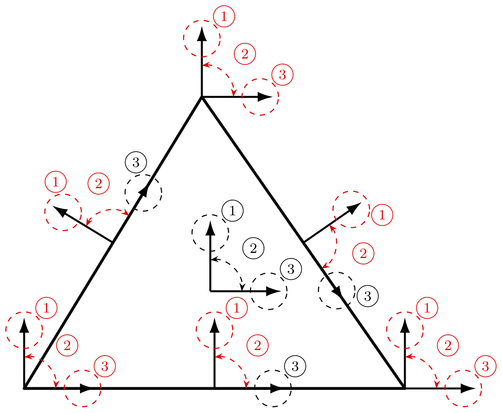

**图 3.1  三角形单元各子单形的局部正交标架与对称张量分量。箭头为所选局部标架 $(\boldsymbol a,\boldsymbol b)$；①、②、③ 分别对应 $\boldsymbol a\otimes\boldsymbol a$、$\operatorname{sym}(\boldsymbol a\otimes\boldsymbol b)$、$\boldsymbol b\otimes\boldsymbol b$，在边上即 $\boldsymbol n_e\otimes\boldsymbol n_e$、$\operatorname{sym}(\boldsymbol t_e\otimes\boldsymbol n_e)$、$\boldsymbol t_e\otimes\boldsymbol t_e$；红色为相邻单元共享分量，黑色为单元私有分量。**

### 3.2 Finite Element Spaces and Standard Discrete Variational Formulation

记连续分片对称张量多项式空间与单元应力泡函数空间分别为
$$
\widetilde{\boldsymbol{\Sigma}}_h^k
=\left\{\boldsymbol{\tau}_h\in H^1(\Omega;\mathbb{S}):\boldsymbol{\tau}_h|_T\in\mathbb P_k(T;\mathbb{S}),\ \forall T\in\mathcal T_h\right\},
$$
$$
\begin{aligned}
\boldsymbol B_k(T)
&=\left\{\boldsymbol{\tau}\in\mathbb P_k(T;\mathbb{S}):\boldsymbol{\tau}\boldsymbol n_T=\boldsymbol0\text{ on }\partial T\right\},\\
\boldsymbol B_h^k
&=\left\{\boldsymbol{\tau}_h\in H(\operatorname{div},\Omega;\mathbb{S}):\boldsymbol{\tau}_h|_T\in\boldsymbol B_k(T),\ \forall T\in\mathcal T_h\right\},
\end{aligned}
$$
其中 $\boldsymbol n_T$ 为单元外法向。未作角点松弛的 $k$ 阶 Hu–Zhang 应力空间定义为 [26, 16]
$$
\boldsymbol{\Sigma}_h^k=\widetilde{\boldsymbol{\Sigma}}_h^k+\boldsymbol B_h^k.
$$
泡函数的单元边界法向迹为零，因此上述空间保持跨单元牵引连续性，并保留第 3.1 节规定的实体自由度共享关系；特别地，顶点处全应力分量单值。第 3.4 节针对二维角点对这一约束作局部松弛。

对应的 $(k-1)$ 阶分片不连续位移有限元空间为：
$$
\boldsymbol{V}_h^{k-1} = \left\{ \boldsymbol{v}_h \in L^2(\Omega;\mathbb{R}^d) : \boldsymbol{v}_h|_T \in \mathbb{P}_{k-1}(T;\mathbb{R}^d), \ \forall\,T \in \mathcal{T}_h \right\}.
$$
记 $\boldsymbol{\Sigma}_{h,0}^k = \boldsymbol{\Sigma}_h^k \cap \boldsymbol{\Sigma}_0$ 为齐次离散应力测试空间。基于该空间对的离散格式以下统称 Hu–Zhang 混合有限元方法（Hu–Zhang mixed finite element method, HZMFEM）。在线弹性标准混合有限元离散下，离散混合变分问题表述为：求 $(\boldsymbol{\sigma}_{0,h}, \boldsymbol{u}_h) \in \boldsymbol{\Sigma}_{h,0}^k \times \boldsymbol{V}_h^{k-1}$，使得
$$
\begin{aligned}
a(\boldsymbol{\sigma}_{0,h}, \boldsymbol{\tau}_h) + b(\boldsymbol{\tau}_h, \boldsymbol{u}_h) &= \langle \boldsymbol{u}_D, \boldsymbol{\tau}_h\boldsymbol{n} \rangle_{\Gamma_D} - a(\boldsymbol{\sigma}_{g,h}, \boldsymbol{\tau}_h), && \forall\,\boldsymbol{\tau}_h \in \boldsymbol{\Sigma}_{h,0}^k, \\
b(\boldsymbol{\sigma}_{0,h}, \boldsymbol{v}_h) &= -(\boldsymbol{b},\boldsymbol{v}_h)_\Omega - b(\boldsymbol{\sigma}_{g,h}, \boldsymbol{v}_h), && \forall\,\boldsymbol{v}_h \in \boldsymbol{V}_h^{k-1}.
\end{aligned} \tag{3.2}
$$
离散总应力记为 $\boldsymbol{\sigma}_h=\boldsymbol{\sigma}_{0,h}+\boldsymbol{\sigma}_{g,h}$。

根据 Hu [26] 对全边界齐次位移条件下标准问题的分析，对于高阶格式 $k \ge d+1$（在二维三角形网格上 $k \ge 3$），在相应空间构造与理论假设下，Hu–Zhang 空间对满足离散 inf-sup 条件。当连续精确解具有足够正则性（$\boldsymbol{\sigma} \in H^{k+1}(\Omega;\mathbb{S}), \boldsymbol{u} \in H^k(\Omega;\mathbb{R}^d)$）时，相应标准问题的离散解具有如下最优阶先验误差估计：
$$
\|\boldsymbol{\sigma} - \boldsymbol{\sigma}_h\|_{H(\operatorname{div})} + \|\boldsymbol{u} - \boldsymbol{u}_h\|_0 \le C h^k \left( \|\boldsymbol{\sigma}\|_{k+1} + \|\boldsymbol{u}\|_k \right). \tag{3.3}
$$
此外，应力在 $L^2$ 范数下具有 $\mathcal{O}(h^{k+1})$ 的最优阶收敛性：
$$
\|\boldsymbol{\sigma} - \boldsymbol{\sigma}_h\|_0 \le C h^{k+1} \|\boldsymbol{\sigma}\|_{k+1}. \tag{3.4}
$$

### 3.3 Jump Stabilization for Low-Order Elements

对于低阶离散 $1\le k\le d$（二维中 $k=1,2$），标准高阶空间对的离散 inf-sup 稳定性结论不再直接适用，需要对离散格式作稳定化处理。为此，在不连续位移场上引入对称矩阵跳量稳定化机制 [16]。对内部面 $F = T^+ \cap T^- \in \mathcal{F}_h^i$（法向量分别为 $\boldsymbol{n}^+$ 和 $\boldsymbol{n}^-$），位移对称矩阵跳量定义为：
$$
[\![ \boldsymbol{v} ]\!] = \frac{1}{2}\left( \boldsymbol{v}^+\otimes\boldsymbol{n}^+ + \boldsymbol{n}^+\otimes\boldsymbol{v}^+ + \boldsymbol{v}^-\otimes\boldsymbol{n}^- + \boldsymbol{n}^-\otimes\boldsymbol{v}^- \right). \tag{3.5}
$$
Chen 等 [16] 采用的矩阵型跳量稳定化项形式为：
$$
c_{\mathrm{mat},h}(\boldsymbol{u}_h,\boldsymbol{v}_h)
=\sum_{F\in\mathcal{F}_h}h_F\int_F[\![\boldsymbol{u}_h]\!]:[\![\boldsymbol{v}_h]\!]\,\mathrm ds. \tag{3.6}
$$
式 (3.6) 对全部面求和，对应原文的全边界位移条件。对于本文的混合边界条件，实际参与惩罚的面取为 $\mathcal{F}_h^i\cup\mathcal{F}_h^D$；在 $\Gamma_D$ 上定义单侧跳量 $[\![\boldsymbol v]\!]=\operatorname{sym}(\boldsymbol v\otimes\boldsymbol n)$，并对位移偏差 $\boldsymbol u_h-\boldsymbol u_D$ 施加惩罚。

在采用有量纲变量时，本文进一步对矩阵型跳量项作量纲匹配。未缩放的跳量项相对于混合变分方程中的双线性型 $b(\cdot,\cdot)$，多出长度平方的量纲而缺少应力量纲，因此采用剪切模量 $\mu$ 与固定的宏观特征长度 $L_0$ 构造缩放系数 $\alpha=\mu/L_0^2$，得到
$$
\alpha=\frac{\mu}{L_0^2},\qquad
c_h(\boldsymbol{u}_h,\boldsymbol{v}_h)
=\sum_{F\in\mathcal{F}_h^i\cup\mathcal{F}_h^D}\alpha h_F\int_F[\![\boldsymbol{u}_h]\!]:[\![\boldsymbol{v}_h]\!]\,\mathrm ds, \tag{3.7}
$$
其中 $\mu$ 取实体材料的剪切模量，在拓扑优化中固定为 $E_0/[2(1+\nu_0)]$，不随密度插值更新；$L_0$ 取固定网格外接包围盒的最大边长，即 $L_0=\max_{1\le i\le d}(x_i^{\max}-x_i^{\min})$。因此，$\alpha$ 与设计变量无关，在固定网格和固定边界划分下，稳定化矩阵不产生额外的设计导数项。

非齐次位移边界对应的已知补偿项采用相同缩放：
$$
\ell_h^D(\boldsymbol{v}_h)=\sum_{F\in\mathcal{F}_h^D}\alpha h_F\int_F[\![\boldsymbol{u}_D]\!]:[\![\boldsymbol{v}_h]\!]\,\mathrm ds. \tag{3.8}
$$

结合上述稳定化项，统一离散混合变分问题表述为：求 $(\boldsymbol{\sigma}_{0,h}, \boldsymbol{u}_h) \in \boldsymbol{\Sigma}_{h,0}^k \times \boldsymbol{V}_h^{k-1}$，使得
$$
\begin{aligned}
a(\boldsymbol{\sigma}_{0,h}, \boldsymbol{\tau}_h) + b(\boldsymbol{\tau}_h, \boldsymbol{u}_h) &= \langle \boldsymbol{u}_D, \boldsymbol{\tau}_h\boldsymbol{n} \rangle_{\Gamma_D} - a(\boldsymbol{\sigma}_{g,h}, \boldsymbol{\tau}_h), && \forall\,\boldsymbol{\tau}_h \in \boldsymbol{\Sigma}_{h,0}^k, \\
b(\boldsymbol{\sigma}_{0,h}, \boldsymbol{v}_h) - c_h(\boldsymbol{u}_h, \boldsymbol{v}_h) &= -(\boldsymbol{b},\boldsymbol{v}_h)_\Omega - b(\boldsymbol{\sigma}_{g,h}, \boldsymbol{v}_h) - \ell_h^D(\boldsymbol{v}_h), && \forall\,\boldsymbol{v}_h \in \boldsymbol{V}_h^{k-1},
\end{aligned} \tag{3.9}
$$
其中，低阶区间 $1\le k\le d$ 启用上述稳定化；高阶区间 $k\ge d+1$ 则取 $c_h=0$ 与 $\ell_h^D=0$，式 (3.9) 自然退化为标准混合格式 (3.2)。在二维情形下，二者分别对应 $k=1,2$ 与 $k\ge3$。此外，稳定化项仅施加于内部面和位移边界，牵引边界条件通过应力法向迹自然施加，因此不在 $\Gamma_N$ 上引入位移跳量惩罚。

关于低阶稳定化格式的理论误差估计，Chen 等 [16] 针对全位移边界条件下的原始格式（$1\le k\le d$）建立了离散 inf-sup 稳定性；当连续解满足正则性条件 $\boldsymbol{\sigma} \in H^{k+1}(\Omega;\mathbb{S})$ 与 $\boldsymbol{u} \in H^k(\Omega;\mathbb{R}^d)$ 时，离散解满足先验误差估计
$$
\|\boldsymbol{\sigma} - \boldsymbol{\sigma}_h\|_{H(\operatorname{div},A)} + \|\boldsymbol{u} - \boldsymbol{u}_h\|_{0,c} \le C h^k \left( \|\boldsymbol{\sigma}\|_{k+1} + \|\boldsymbol{u}\|_k \right), \tag{3.10}
$$
其中，应力侧采用柔度加权范数 $\|\boldsymbol{\tau}\|_{H(\operatorname{div},A)}^2 = a(\boldsymbol{\tau},\boldsymbol{\tau}) + \|\operatorname{div}\boldsymbol{\tau}\|_0^2$，位移侧采用网格依赖范数 $\|\boldsymbol{v}\|_{0,c}^2 = \|\boldsymbol{v}\|_0^2 + c_{\mathrm{mat},h}(\boldsymbol{v},\boldsymbol{v})$。在零平均迹条件 $\int_\Omega\operatorname{tr}\boldsymbol{\tau}\,\mathrm dx=0$ 下，该加权范数与标准 $H(\operatorname{div})$ 范数关于 Lamé 参数 $\lambda$ 一致等价。该分析给出的应力 $L^2$ 误差估计为 $\mathcal{O}(h^k)$，比高阶格式的最优估计低一阶。

### 3.4 Partial Relaxation of Vertex Continuity at Corners

在二维多边形区域的角点 $x_c$，设两条牵引边界分别为 $e_+$ 与 $e_-$，单位外法向量为 $\boldsymbol{n}_+$ 与 $\boldsymbol{n}_-$，给定牵引分别为 $\boldsymbol{g}_+$ 与 $\boldsymbol{g}_-$。若角点处应力由同一个对称张量表示，则必须满足兼容性条件 $\boldsymbol{n}_- \cdot \boldsymbol{g}_+(x_c) = \boldsymbol{n}_+ \cdot \boldsymbol{g}_-(x_c)$。当给定边界数据不满足这一兼容条件时，顶点应力的全分量单值约束会妨碍两侧牵引数据的精确施加 [27]。

为处理这一离散约束冲突，本文采用顶点应力连续性的部分松弛方法 [27]。以下限定于二维两单元角点构造：角点邻域由两个三角形 $T^+$ 与 $T^-$ 组成，二者的公共边 $e$ 连接角点与区域内部；若角点原先仅属于单个三角形，可先将其细分为两个三角形。在保持公共边法向迹连续的同时，解耦两侧单元相对于 $e$ 的纯切向应力分量。设 $\mathcal{V}_c$ 为采用该松弛处理的角点集合，相应的部分松弛应力有限元空间表述为：
$$
\begin{aligned}
\boldsymbol{\Sigma}_{h,\mathrm{rel}}^k=\bigl\{
&\boldsymbol{\tau}_h\in H(\operatorname{div},\Omega;\mathbb{S}):
\ \boldsymbol{\tau}_h|_T\in\mathbb{P}_k(T;\mathbb{S}),
\quad\forall T\in\mathcal{T}_h,\\
&\boldsymbol{\tau}_h\text{ 在 }\mathcal{V}_h\setminus\mathcal{V}_c\text{ 的每个顶点处取值单一}
\bigr\}.
\end{aligned} \tag{3.11}
$$
对于上述两单元构造，公共边标架下的两个牵引分量保持共享，纯切向应力分量则分侧独立，从而使该角点的全局独立自由度数由 3 增加至 4。具体实施过程如图 3.2 所示：
1. **公共边标架**：为公共边 $e$ 选取统一的正交单位切向量 $\boldsymbol{t}_e$ 和法向量 $\boldsymbol{n}_e$；
2. **切向分量拆分**：将对应 $\boldsymbol{t}_e\otimes\boldsymbol{t}_e$ 的顶点自由度拆分为分别归属于 $T^+$ 与 $T^-$ 的两个独立自由度；
3. **法向迹保持**：对应 $\boldsymbol{n}_e\otimes\boldsymbol{n}_e$ 与 $\operatorname{sym}(\boldsymbol{t}_e\otimes\boldsymbol{n}_e)$ 的分量保持共享，其余公共边法向迹自由度按原有规则装配；
4. **边界条件施加**：经角点局部 $4\times4$ 基底变换，将上述四个自由度变换为两条边界边 $e_+$、$e_-$ 上各两个牵引分量（对应 Hu 与 Ma [27] 的角点基函数），从而可逐边直接施加牵引条件；$e_+$ 与 $e_-$ 不平行时该变换可逆。这里增加的是角点邻域的全局独立自由度数，不改变每个三角形的局部多项式空间。

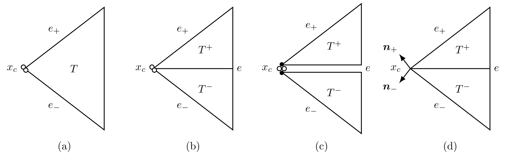

**图 3.2  二维角点处顶点应力连续性的部分松弛：(a) 单单元构造；(b) 划分为共边 $e$ 的两个三角形；(c) 独立的切向自由度（实心点）与共享的法向迹自由度（空心圈）；(d) 局部基底变换后的边界牵引表示。箭头表示单位外法向 $\boldsymbol{n}_\pm$。(c) 中的间隙仅为示意。**

对任意多项式次数 $k\ge1$，二维三角形上的局部对称应力空间维数为
$$
\dim \mathbb{P}_k(T;\mathbb{S})=\frac{3(k+1)(k+2)}{2}.
$$
自由度按几何实体分为以下几类：
- **顶点自由度**：每个单元在每个顶点仍分配 3 个局部分量；未松弛顶点的分量全局共享，上述两单元松弛角点合计有 4 个全局独立自由度；
- **边内部自由度**：每条边分配 $2(k-1)$ 个法向牵引自由度（跨相邻单元共享装配）与 $(k-1)$ 个切向正应力自由度（单元私有）；
- **单元内部自由度**：每个单元包含 $\frac{3(k-1)(k-2)}{2}$ 个内部应力自由度，均为单元私有。

在二维情形下，后续离散变分问题与代数矩阵装配均采用上述松弛后的应力空间。为简化记号，全文仍将其简记为 $\boldsymbol{\Sigma}_h^k$，相应满足齐次牵引边界条件的离散应力空间记为 $\boldsymbol{\Sigma}_{h,0}^k = \boldsymbol{\Sigma}_h^k \cap \boldsymbol{\Sigma}_0$。

### 3.5 Discrete Saddle-Point System

设 $\{\boldsymbol{\Phi}_i\}_{i=1}^{N_\sigma}$ 为齐次离散应力空间 $\boldsymbol{\Sigma}_{h,0}^k$ 的全局基函数，$\{\boldsymbol{\psi}_p\}_{p=1}^{N_u}$ 为分片不连续位移空间 $\boldsymbol{V}_h^{k-1}$ 的全局基函数。将离散解展开为：
$$
\boldsymbol{\sigma}_{0,h} = \sum_{j=1}^{N_\sigma} s_{0,j} \boldsymbol{\Phi}_j, \qquad \boldsymbol{u}_h = \sum_{q=1}^{N_u} u_q \boldsymbol{\psi}_q.
$$
将基函数展开代入统一离散变分问题式 (3.9)，转化为如下对称不定的离散鞍点代数系统：
$$
\begin{bmatrix}
\boldsymbol{A} & \boldsymbol{B} \\
\boldsymbol{B}^{\mathsf T} & -\boldsymbol{C}
\end{bmatrix}
\begin{bmatrix}
\boldsymbol{s}_0 \\
\boldsymbol{u}
\end{bmatrix}
=
\begin{bmatrix}
\boldsymbol{f}_{\sigma} \\
\boldsymbol{f}_u
\end{bmatrix}, \tag{3.12}
$$
其中，各分块矩阵的元素显式定义为：
$$
\begin{aligned}
A_{ij} &= a(\boldsymbol{\Phi}_j, \boldsymbol{\Phi}_i) = \int_\Omega \mathcal{A}\boldsymbol{\Phi}_j : \boldsymbol{\Phi}_i \,\mathrm{d}x, && i,j = 1, \dots, N_\sigma, \\
B_{ip} &= b(\boldsymbol{\Phi}_i, \boldsymbol{\psi}_p) = \int_\Omega (\operatorname{div}\boldsymbol{\Phi}_i) \cdot \boldsymbol{\psi}_p \,\mathrm{d}x, && i = 1, \dots, N_\sigma; \ p = 1, \dots, N_u, \\
C_{pq} &= c_h(\boldsymbol{\psi}_q, \boldsymbol{\psi}_p) = \sum_{F \in \mathcal{F}_h^i \cup \mathcal{F}_h^D} \alpha h_F \int_F [\![ \boldsymbol{\psi}_q ]\!] : [\![ \boldsymbol{\psi}_p ]\!] \,\mathrm{d}s, && p,q = 1, \dots, N_u.
\end{aligned} \tag{3.13}
$$
右端载荷向量分量定义为：
$$
\begin{aligned}
(\boldsymbol{f}_{\sigma})_i &= \int_{\Gamma_D} \boldsymbol{u}_D \cdot (\boldsymbol{\Phi}_i\boldsymbol{n})\,\mathrm{d}s - \int_\Omega \mathcal{A}\boldsymbol{\sigma}_{g,h} : \boldsymbol{\Phi}_i \,\mathrm{d}x, && i = 1, \dots, N_\sigma, \\
(\boldsymbol{f}_u)_p &= -\int_\Omega \boldsymbol{b} \cdot \boldsymbol{\psi}_p \,\mathrm{d}x - \int_\Omega (\operatorname{div}\boldsymbol{\sigma}_{g,h}) \cdot \boldsymbol{\psi}_p \,\mathrm{d}x - \ell_h^D(\boldsymbol{\psi}_p), && p = 1, \dots, N_u,
\end{aligned} \tag{3.14}
$$
其中 $\boldsymbol{s}_0 = (s_{0,1},\dots,s_{0,N_\sigma})^{\mathsf T}$ 为齐次未知应力自由度向量，$\boldsymbol{u} = (u_1,\dots,u_{N_u})^{\mathsf T}$ 为位移自由度向量。边界顶点与边界边的自由度均按与边界对齐的局部标架定义（角点按第 3.4 节处理），因此 $\Gamma_N$ 上的应力法向迹由一组确定的自由度表示。取 $\boldsymbol{g}_h$ 为 $\boldsymbol{g}$ 在各牵引边界边 $k+1$ 个等距 Lagrange 节点处的插值，将上述自由度赋为 $\boldsymbol{g}_h$ 的相应分量、其余自由度置零，即得满足 $\boldsymbol{\sigma}_{g,h}\boldsymbol{n}=\boldsymbol{g}_h$ 的离散提升 $\boldsymbol{\sigma}_{g,h}\in\boldsymbol{\Sigma}_h^k$。相应地，由第 3.1 节与第 3.4 节所确定的全离散空间 $\boldsymbol{\Sigma}_h^k$ 的全局基函数中，剔除这些位于 $\Gamma_N$ 上的受约束自由度后，剩余自由度对应的基函数便直接构成了齐次子空间 $\boldsymbol{\Sigma}_{h,0}^k$ 的基函数组 $\{\boldsymbol{\Phi}_i\}_{i=1}^{N_\sigma}$。

---

## 4 Density-Based Topology Optimization with Independent Stress

### 4.1 Design Variables, Density Filter, Projection, and Dual-Parameter Material Interpolation

设计域 $\Omega \subset \mathbb{R}^d$ 被离散为由 $N_e$ 个单元组成的有限元网格 $\mathcal{T}_h = \{K_e\}_{e=1}^{N_e}$。在基于密度的连续体拓扑优化框架下，每个单元 $K_e$ 被赋予一个数学设计变量 $\rho_e \in [0, 1]$，构成全局设计向量 $\boldsymbol{\rho} = (\rho_1, \dots, \rho_{N_e})^{\mathsf T}$。

为减轻拓扑优化中的网格依赖性与棋盘格现象，并引入空间平滑尺度，采用线性密度过滤器 [10, 14] 将数学设计变量 $\rho_e$ 映射为过滤后的单元密度 $\widetilde{\rho}_e$：
$$
\widetilde{\rho}_e = \frac{\sum_{j \in \mathcal{N}_e} w_{ej} v_j \rho_j}{\sum_{j \in \mathcal{N}_e} w_{ej} v_j}, \tag{4.1}
$$
其中 $v_j = |K_j|$ 表示单元 $K_j$ 的几何测度（二维面积或三维体积），$\mathcal{N}_e = \{j \in \{1, \dots, N_e\} \mid \|\boldsymbol{x}_e - \boldsymbol{x}_j\|_2 \le r_{\min}\}$ 为以单元 $K_e$ 的形心 $\boldsymbol{x}_e = \frac{1}{|K_e|}\int_{K_e} \boldsymbol{x}\,\mathrm{d}x$ 为球心、滤波半径为 $r_{\min}$ 的邻域单元索引集合。线性衰减卷积核权重 $w_{ej}$ 定义为：
$$
w_{ej} = \max(0, \, r_{\min} - \|\boldsymbol{x}_e - \boldsymbol{x}_j\|_2).
$$

为减少过滤产生的中间密度并锐化材料边界，本文采用光滑 Heaviside 投影 [36]，形成设计密度、过滤密度与物理密度的三场表述：
$$
\boldsymbol{\rho}\xrightarrow{\text{密度过滤}}\widetilde{\boldsymbol{\rho}}\xrightarrow{\text{光滑投影}}\overline{\boldsymbol{\rho}},
\qquad
\overline{\rho}_e=P_{\beta,\eta_{\mathrm p}}(\widetilde{\rho}_e)
=\frac{\tanh(\beta\eta_{\mathrm p})+\tanh\!\left[\beta(\widetilde{\rho}_e-\eta_{\mathrm p})\right]}
{\tanh(\beta\eta_{\mathrm p})+\tanh\!\left[\beta(1-\eta_{\mathrm p})\right]}, \tag{4.2}
$$
其中 $\eta_{\mathrm p}\in(0,1)$ 为投影阈值，$\beta>0$ 控制投影的陡峭程度；$\eta_{\mathrm p}$ 与后文应力阈值函数 $\eta(\cdot)$ 含义不同。启用投影时，可通过逐阶段增大 $\beta$ 锐化边界；未启用投影时，取恒等映射 $\overline{\rho}_e=\widetilde{\rho}_e$。后续材料插值、状态方程、体积评估及局部应力约束均以物理密度 $\overline{\rho}_e$ 为准。

若固定泊松比而仅插值杨氏模量，则中低密度单元在 $\nu_0\to0.5$ 时仍保持近不可压缩，表现为抗剪极弱而抗体积变形极强的类流体介质，可传递静水压力并被优化过程利用。为使中低密度相表现为可压缩弱材料，本文对杨氏模量与泊松比分别进行密度相关插值（参见 [12]）：

1. **杨氏模量插值（SIMP 模型）**：
$$
E(\overline{\rho}_e) = E_{\min} + (E_0 - E_{\min}) \overline{\rho}_e^{p_E}, \tag{4.3}
$$
式中 $E_0$ 为各向同性实体材料的 Young 模量，$E_{\min}>0$ 为材料模量下界，用于避免零模量导致柔度算子无定义，其具体取值在各算例中给出。$p_E$ 为刚度惩罚指数，柔顺度算例取 $p_E=3$，应力约束算例取 $p_E=3.5$。

2. **泊松比松弛插值**：
$$
\nu(\overline{\rho}_e) = \nu_{\mathrm{void}} + (\nu_0 - \nu_{\mathrm{void}}) \overline{\rho}_e^{p_\nu}, \tag{4.4}
$$
式中 $\nu_0$ 为实体材料的目标泊松比（如 $\nu_0 = 0.4999$），$\nu_{\mathrm{void}}$ 为孔洞区基准泊松比。本文取 $\nu_{\mathrm{void}} = 0.3$、松弛指数 $p_\nu = 1$，使泊松比随物理密度由孔洞区基准值线性过渡至实体材料值，并使中低密度相远离不可压缩极限，不再形成上述类流体承载机制。式 (4.4) 在第 5.2.2 节 $\nu_0=0.4999$ 的近不可压缩优化组及其固定设计再分析中启用；可压缩算例的泊松比固定为 $\nu_0$，此时只有杨氏模量按式 (4.3) 随密度变化。

单元柔度算子 $\mathcal A(\overline\rho_e)$ 由插值后的材料参数 $E(\overline\rho_e)$ 与 $\nu(\overline\rho_e)$ 确定。

### 4.2 State Equations and Complementary Energy Compliance Formulation

考虑齐次位移边界与设计无关外载荷作用下的最小柔顺度问题。混合有限元可将应力与位移同时作为状态变量，并通过鞍点系统的柔度块 $\boldsymbol A$ 引入材料分布 [12]。在 Hu–Zhang 离散框架中，总应力由状态方程直接求得，因此本文采用以应力表达的余能型目标，使目标评估与混合有限元的主变量保持一致。

在线弹性连续问题中，在弱形式中取检验函数为解本身并利用本构关系，可知外载柔顺度等于应变能的两倍，也等于应变余能的两倍。因此，最小化柔顺度与最小化应变余能具有相同的极小点。为与位移法的外载功保持同一尺度，定义不含 $1/2$ 因子的离散目标
$$
C(\boldsymbol\rho,\boldsymbol\sigma_h)
=\int_\Omega\mathcal A(\overline{\boldsymbol\rho})\boldsymbol\sigma_h:\boldsymbol\sigma_h\,\mathrm dx
=\sum_{e=1}^{N_e}\boldsymbol s_e^{\mathsf T}\boldsymbol A_e(\overline\rho_e)\boldsymbol s_e, \tag{4.5}
$$
其中 $\overline{\boldsymbol\rho}=\overline{\boldsymbol\rho}(\boldsymbol\rho)$ 为第 4.1 节过滤与投影后的物理密度，$\boldsymbol s_e$ 为总应力 $\boldsymbol\sigma_h|_{K_e}$ 在单元局部应力基下的系数向量，包含牵引提升的贡献；$\boldsymbol A_e$ 为相应的局部柔度矩阵，其 $(a,b)$ 元素为 $\int_{K_e}\mathcal A(\overline\rho_e)\boldsymbol\phi_{e,b}:\boldsymbol\phi_{e,a}\,\mathrm dx$，其中 $\{\boldsymbol\phi_{e,a}\}_{a=1}^{n_e}$ 为 $\mathbb P_k(K_e;\mathbb S)$ 的基。式 (4.5) 为离散应变余能的两倍，可直接按单元积分并求和。

状态约束采用第 3.5 节的齐次应力未知量表述，总应力按 $\boldsymbol\sigma_h=\boldsymbol\sigma_{0,h}+\boldsymbol\sigma_{g,h}$ 重构。本节目标函数与后续应力约束均采用该总应力 $\boldsymbol\sigma_h$。在固定网格与第 3.3 节固定稳定化尺度下，$\boldsymbol A(\overline{\boldsymbol\rho})$ 通过 $E(\overline\rho_e)$ 和 $\nu(\overline\rho_e)$ 依赖设计变量，而 $\boldsymbol B$ 与 $\boldsymbol C$ 保持不变。由此，基于余能的最小柔顺度模型写为
$$
\begin{aligned}
\min_{\boldsymbol\rho}\quad &C(\boldsymbol\rho,\boldsymbol\sigma_h)
=\sum_{e=1}^{N_e}\boldsymbol s_e^{\mathsf T}\boldsymbol A_e(\overline\rho_e)\boldsymbol s_e\\
\text{s.t.}\quad &
\begin{bmatrix}\boldsymbol A(\overline{\boldsymbol\rho})&\boldsymbol B\\\boldsymbol B^{\mathsf T}&-\boldsymbol C\end{bmatrix}
\begin{bmatrix}\boldsymbol s_0\\\boldsymbol u\end{bmatrix}
=\begin{bmatrix}\boldsymbol f_\sigma(\overline{\boldsymbol\rho})\\\boldsymbol f_u\end{bmatrix},\\
&\frac{\sum_{e=1}^{N_e}v_e\overline\rho_e}{\sum_{e=1}^{N_e}v_e}\le\bar V,\\
&0\le\rho_e\le1,\quad e=1,\dots,N_e,
\end{aligned}\tag{4.6}
$$
其中 $v_e=|K_e|$ 为单元体积，$\bar V\in(0,1)$ 为材料体积分数上限。右端由式 (3.14) 给出，齐次位移下其中的 $\boldsymbol u_D$ 项与 $\ell_h^D$ 为零。记 $\boldsymbol s_g$ 为 $\boldsymbol\sigma_{g,h}$ 在 $\boldsymbol\Sigma_h^k$ 全局基下的系数向量，将 $\boldsymbol s_0$ 在 $\Gamma_N$ 上的受约束自由度处补零，则总应力的全局系数向量为 $\boldsymbol s=\boldsymbol s_0+\boldsymbol s_g$，$\boldsymbol s_e$ 为其属于单元 $K_e$ 的子向量。提升 $\boldsymbol\sigma_{g,h}$ 与设计无关，但 $\boldsymbol f_\sigma$ 中的分量 $-\int_\Omega\mathcal A(\overline{\boldsymbol\rho})\boldsymbol\sigma_{g,h}:\boldsymbol\Phi_i\,\mathrm dx$ 仍依赖材料分布，灵敏度分析须计入该依赖。

该模型直接利用总应力与局部柔度矩阵评估柔顺度，无需构造位移形式的 Schur 补 $\boldsymbol B^{\mathsf T}\boldsymbol A(\overline{\boldsymbol\rho})^{-1}\boldsymbol B+\boldsymbol C$ 及其设计导数。在齐次位移边界与设计无关荷载条件下，若不含稳定化项，可利用混合变分关系消去目标灵敏度中的应力隐式导数项。低阶稳定化格式仍采用式 (4.5) 的目标函数，但上述简化不再适用。因此，其灵敏度采用第 4.5 节的一般伴随公式计算。

### 4.3 Stress-Constrained Topology Optimization with a Relaxed Stress Threshold

本文考虑局部应力约束下的结构总体积最小化问题 [22, 13]，并在全域单元施加局部 von Mises 等效应力约束：
$$
g_e(\boldsymbol{\rho}, \boldsymbol{\sigma}_h) = \frac{\sigma_{\mathrm{vm}}(\boldsymbol{\sigma}_{h,e})}{\bar{\sigma}} - \eta(\overline{\rho}_e) \le 0, \quad e = 1, \dots, N_e, \tag{4.7}
$$
其中 $\bar{\sigma}$ 为实体材料的许用应力，$\boldsymbol\sigma_{h,e}$ 为单元形心处的表观应力。为比较两类有限元离散，本文统一采用表观应力与 $\epsilon$ 松弛约束：LFEM 由位移梯度与插值本构恢复表观应力 $\mathcal A(\overline\rho_e)^{-1}\boldsymbol\varepsilon(\boldsymbol u_h)$，HZMFEM 则评价重构的总应力 $\boldsymbol\sigma_h=\boldsymbol\sigma_{0,h}+\boldsymbol\sigma_{g,h}$。两者采用相同的体积目标、阈值函数与评价位置，差异仅在于应力的来源。在平面应力条件下（$\sigma_{zz}=\sigma_{xz}=\sigma_{yz}=0$），等效应力取
$$
\sigma_{\mathrm{vm}}(\boldsymbol\sigma_{h,e})=\sqrt{\sigma_{xx}^2-\sigma_{xx}\sigma_{yy}+\sigma_{yy}^2+3\sigma_{xy}^2},
$$
其中 $\sigma_{xx},\sigma_{yy},\sigma_{xy}$ 为 $\boldsymbol\sigma_{h,e}$ 的分量；平面应变与三维情形按相应的 von Mises 表达式计算，其余推导不变。

若直接对实体材料应力施加许用应力条件，单元密度趋于零时约束不随之失效，可行域含退化的低维分支，形成梯度方法难以到达的奇异最优解 [35, 29, 20]。参考 $\epsilon$ 松弛及混合有限元中密度相关应力限值的处理 [19, 22, 13]，本文采用以下带正下限的阈值：
$$
\eta(\overline{\rho}_e) = m_E(\overline{\rho}_e) + \epsilon\bigl(1 - m_E(\overline{\rho}_e)\bigr),
\qquad m_E(\overline{\rho}_e) = \frac{E(\overline{\rho}_e)}{E_0}, \tag{4.8}
$$
其中 $m_E$ 为相对刚度，$E(\overline\rho_e)$ 由式 (4.3) 给出，$\epsilon\in(0,1)$ 为松弛参数。记表观应力场为 $\boldsymbol\sigma_h^{\mathrm{app}}$，其单元形心值 $\boldsymbol\sigma_e^{\mathrm{app}}:=\boldsymbol\sigma_{h,e}$，并定义实体材料应力 $\boldsymbol\sigma_e^{\mathrm{solid}}:=\boldsymbol\sigma_e^{\mathrm{app}}/m_E(\overline\rho_e)$。泊松比固定时 $\mathcal A(\overline\rho_e)^{-1}=m_E(\overline\rho_e)\,\mathcal A(1)^{-1}$，$\boldsymbol\sigma_e^{\mathrm{solid}}$ 即同一应变下实体材料的应力，位移法中为 $\mathcal A(1)^{-1}\boldsymbol\varepsilon(\boldsymbol u_h)$。由 $\sigma_{\mathrm{vm}}$ 的一次齐次性，$\sigma_{\mathrm{vm}}(\boldsymbol\sigma_e^{\mathrm{app}})=m_E\,\sigma_{\mathrm{vm}}(\boldsymbol\sigma_e^{\mathrm{solid}})$，故对 $m_E>0$，式 (4.7) 等价于 $\sigma_{\mathrm{vm}}(\boldsymbol\sigma_e^{\mathrm{solid}})/\bar\sigma\le1+\epsilon(1/m_E-1)$，即放宽低刚度区域的实体应力上限。因此式 (4.7) 是 $\epsilon$ 松弛的等价改写：不显式除以密度避免了 $m_E$ 趋于零时的数值病态，松弛作用仍来自 $\epsilon>0$。

阈值满足 $\eta(1)=1$，保留实体材料的许用应力条件。在 $\overline\rho_e=0$ 时，阈值仍为正，即 $\eta(0)=\epsilon+(1-\epsilon)E_{\min}/E_0$。此时，表观应力按较小的残余刚度比缩放，满足 $\boldsymbol{\sigma}_e^{\mathrm{app}}=(E_{\min}/E_0)\boldsymbol{\sigma}_e^{\mathrm{solid}}$。因此，当相应的表观 von Mises 应力低于松弛限值 $\eta(0)\bar{\sigma}$ 时，该约束不再活跃。本文取固定松弛参数 $\epsilon=10^{-3}$，不进行 $\epsilon$ 延拓。
	
据此，Hu–Zhang 离散下的局部应力约束体积最小化问题为
$$
\begin{aligned}
\min_{\boldsymbol\rho}\quad &
f_V(\boldsymbol\rho)=\frac{\sum_{e=1}^{N_e}v_e\overline\rho_e}{\sum_{e=1}^{N_e}v_e}\\
\mathrm{s.t.}\quad &
\begin{bmatrix}\boldsymbol A(\overline{\boldsymbol\rho})&\boldsymbol B\\
\boldsymbol B^{\mathsf T}&-\boldsymbol C\end{bmatrix}
\begin{bmatrix}\boldsymbol s_0\\\boldsymbol u\end{bmatrix}
=\begin{bmatrix}\boldsymbol f_\sigma(\overline{\boldsymbol\rho})\\\boldsymbol f_u\end{bmatrix},\\
&g_e(\boldsymbol\rho,\boldsymbol\sigma_h)
=\frac{\sigma_{\mathrm{vm}}(\boldsymbol\sigma_{h,e})}{\bar\sigma}
-\eta(\overline\rho_e)\le0,\quad e=1,\dots,N_e,\\
&0\le\rho_e\le1,\quad e=1,\dots,N_e,
\end{aligned}\tag{4.9}
$$
其中物理密度由第 4.1 节确定，状态方程与总应力重构沿用第 4.2 节。由于设计域体积固定，最小化体积分数 $f_V$ 等价于最小化结构总体积。LFEM 对照将状态方程替换为 $\boldsymbol K(\overline{\boldsymbol\rho})\boldsymbol u=\boldsymbol f$，并按插值本构恢复表观应力，其余与式 (4.9) 相同。

### 4.4 Augmented Lagrangian Formulation

式 (4.9) 在每个单元施加一个局部应力约束，约束数量随网格规模增长，直接处理大量约束会增加优化子问题的求解负担。为此，本文沿用 Senhora 等 [33] 针对局部应力约束的增广拉格朗日方法（Augmented Lagrangian Method，ALM），将各局部约束通过增广项纳入目标函数，并按约束数归一化，构建标量增广拉格朗日目标函数：
$$
\mathcal L(\boldsymbol{\rho}, \boldsymbol{\sigma}_h) = f_V(\boldsymbol{\rho}) + \frac{1}{N_e} \sum_{e=1}^{N_e} \mathcal{P}_e(g_e, \lambda_e, \mu_e), \tag{4.10}
$$
其中 $f_V$ 为式 (4.9) 的体积分数目标。由于每个单元对应一个局部约束，约束数为 $N_e$，因子 $1/N_e$ 用于减轻约束数量增加导致的增广项与目标项量级失衡。对式 (4.7) 定义的局部约束，采用如下增广项形式 [23]。记 $h_e=\max(g_e,-\lambda_e/\mu_e)$，局部增广项 $\mathcal P_e=\lambda_e h_e+\frac{\mu_e}{2}h_e^2$ 可等价写为：
$$
\mathcal{P}_e = \begin{cases}
\lambda_e g_e + \frac{\mu_e}{2} g_e^2, & \text{if } g_e > -\frac{\lambda_e}{\mu_e}, \\
-\frac{\lambda_e^2}{2\mu_e}, & \text{if } g_e \le -\frac{\lambda_e}{\mu_e},
\end{cases} \tag{4.11}
$$
其中 $\lambda_e\ge0$ 为拉格朗日乘子，$\mu_e>0$ 为罚因子。在第 $k$ 次外层迭代中，固定乘子 $\boldsymbol\lambda^{(k)}$ 与罚因子 $\boldsymbol\mu^{(k)}$，求解仅含设计变量上下界的增广子问题：
$$
\begin{aligned}
\min_{\boldsymbol\rho}\quad &
\mathcal L^{(k)}(\boldsymbol\rho)
=f_V(\boldsymbol\rho)+\frac{1}{N_e}\sum_{e=1}^{N_e}
\mathcal P_e\!\left(g_e(\boldsymbol\rho,\boldsymbol\sigma_h(\boldsymbol\rho)),\lambda_e^{(k)},\mu_e^{(k)}\right),\\
\mathrm{s.t.}\quad &0\le\rho_e\le1,\qquad e=1,\dots,N_e,
\end{aligned}\tag{4.12}
$$
其中 $\boldsymbol\sigma_h(\boldsymbol\rho)$ 由式 (4.9) 中的状态方程求解并重构得到。该子问题已消去状态变量，仅显式保留设计变量上下界。近似求解该子问题后，以子问题近似解处的约束值 $g_e$ 更新外层乘子，并投影到区间 $[0,\lambda_{\max}]$：
$$
\lambda_e^{(k+1)} = \min\left(\lambda_{\max},\,\max\left(0,\, \lambda_e^{(k)} + \mu_e^{(k)} g_e\right)\right), \tag{4.13}
$$
其中 $\lambda_{\max}$ 为乘子上界，沿用 Andreani 等 [2] 的安全化增广拉格朗日格式。若某单元的约束在迭代中始终不能满足，其乘子在 $\lambda_{\max}$ 处停止增长，最终设计在该单元可能不可行，因此需对最终设计逐单元复核约束满足情况。内层采用移动渐近线法（Method of Moving Asymptotes，MMA） [34] 近似求解子问题 (4.12)，罚因子更新规则、约束复核与完整求解流程见第 4.6 节。

### 4.5 Consistent Adjoint Sensitivity Analysis

本节推导目标函数关于物理密度的灵敏度，并计入右端 $\boldsymbol f_\sigma(\overline{\boldsymbol\rho})$ 对设计的依赖。推导在固定网格、乘子与罚因子、投影参数及稳定化尺度，且牵引提升与设计无关的条件下进行，并假定状态矩阵非奇异、目标函数可微；$\partial/\partial\overline\rho_e$ 与 $\mathrm d/\mathrm d\overline\rho_e$ 分别表示固定状态变量的偏导数与计入状态响应的全导数。

对于增广拉格朗日目标 $J=\mathcal L$ 或余能目标 $J=C$，引入伴随变量 $(\boldsymbol z_\sigma,\boldsymbol z_u)$，求解如下伴随方程：
$$
\begin{bmatrix}\boldsymbol A(\overline{\boldsymbol\rho})&\boldsymbol B\\\boldsymbol B^{\mathsf T}&-\boldsymbol C\end{bmatrix}
\begin{bmatrix}\boldsymbol z_\sigma\\\boldsymbol z_u\end{bmatrix}
=\begin{bmatrix}\nabla_{\boldsymbol s_0}J\\\boldsymbol0\end{bmatrix}.
\tag{4.14}
$$
由于状态矩阵对称，伴随方程与状态方程共用同一系数矩阵。记伴随应力 $\boldsymbol\zeta_h=\sum_i(z_\sigma)_i\boldsymbol\Phi_i$。根据式 (4.3)–(4.4) 的材料插值，由链式法则得：
$$
\mathcal A'_e:=\frac{\partial\mathcal A}{\partial\overline\rho_e}
=\frac{\partial\mathcal A}{\partial E}\frac{\mathrm dE}{\mathrm d\overline\rho_e}
+\frac{\partial\mathcal A}{\partial\nu}\frac{\mathrm d\nu}{\mathrm d\overline\rho_e}.
$$
泊松比固定时第二项为零。

对于增广拉格朗日目标 $\mathcal L$，记 $\omega_e=\partial\mathcal P_e/\partial g_e=\max(0,\lambda_e+\mu_e g_e)$，伴随载荷与关于物理密度的全导数分别为
$$
(\nabla_{\boldsymbol s_0}\mathcal L)_i
=\frac{1}{N_e\bar\sigma}\sum_{m=1}^{N_e}\omega_m
\frac{\partial\sigma_{\mathrm{vm}}(\boldsymbol\sigma_{h,m})}{\partial s_{0,i}},
$$
$$
\frac{\mathrm d\mathcal L}{\mathrm d\overline\rho_e}
=\frac{v_e}{\sum_mv_m}-\frac{\omega_e}{N_e}\eta'(\overline\rho_e)
-\int_{K_e}\mathcal A'_e\boldsymbol\sigma_h:\boldsymbol\zeta_h\,\mathrm dx,
\qquad \eta'(\overline\rho_e)=(1-\epsilon)m_E'(\overline\rho_e),
\tag{4.15}
$$
其中积分项已合并状态矩阵与右端 $\boldsymbol f_\sigma(\overline{\boldsymbol\rho})$ 对设计的导数，故以重构的总应力 $\boldsymbol\sigma_h$ 表示；等效应力及其导数均按式 (4.7) 的定义在单元形心处计算，上述梯度公式在目标函数可微处成立。

对于余能目标 $C$，由式 (4.5) 求导得伴随载荷 $(\nabla_{\boldsymbol s_0}C)_i=2\int_\Omega\mathcal A(\overline{\boldsymbol\rho})\boldsymbol\sigma_h:\boldsymbol\Phi_i\,\mathrm dx$，由式 (4.14) 得到对应的 $\boldsymbol\zeta_h$ 后，
$$
\frac{\mathrm dC}{\mathrm d\overline\rho_e}
=\int_{K_e}\mathcal A'_e\boldsymbol\sigma_h:
(\boldsymbol\sigma_h-\boldsymbol\zeta_h)\,\mathrm dx.
\tag{4.16}
$$
在无稳定化、齐次位移及设计无关载荷条件下，伴随方程有显式解 $\boldsymbol z_\sigma=\boldsymbol 0$、$\boldsymbol z_u=-2\boldsymbol u$，即 $\boldsymbol\zeta_h=\boldsymbol 0$，无需单独求解伴随问题，式 (4.16) 简化为：
$$
\frac{\mathrm dC}{\mathrm d\overline\rho_e}
=\boldsymbol s_e^{\mathsf T}\frac{\partial\boldsymbol A_e}{\partial\overline\rho_e}\boldsymbol s_e,
\qquad c_h=0,
\tag{4.17}
$$
其中 $\boldsymbol s_e$ 与 $\boldsymbol A_e$ 见式 (4.5)；低阶稳定化格式（$1\le k\le d$，$c_h\ne0$）采用式 (4.16)。

LFEM 对照采用位移状态方程 $\boldsymbol K(\overline{\boldsymbol\rho})\boldsymbol u=\boldsymbol f$。对增广目标 $\mathcal L(\boldsymbol\rho,\boldsymbol u)$，在设计无关载荷下求解伴随方程 $\boldsymbol K(\overline{\boldsymbol\rho})\boldsymbol z=\nabla_{\boldsymbol u}\mathcal L$（刚度矩阵对称，与状态方程共用同一矩阵），得到
$$
\frac{\mathrm d\mathcal L}{\mathrm d\overline\rho_e}
=\left.\frac{\partial\mathcal L}{\partial\overline\rho_e}\right|_{\boldsymbol u}
-\boldsymbol z^{\mathsf T}\frac{\partial\boldsymbol K}{\partial\overline\rho_e}\boldsymbol u,
\tag{4.18}
$$
其中固定状态的偏导数由三部分组成：体积目标的 $v_e/\sum_m v_m$、松弛阈值的 $-\omega_e\eta'(\overline\rho_e)/N_e$，以及表观应力 $\mathcal A(\overline\rho_e)^{-1}\boldsymbol\varepsilon(\boldsymbol u_h)$ 通过插值本构对密度的显式依赖；最后一项在式 (4.15) 中不出现，因为 HZMFEM 的应力为状态变量。对柔顺度目标，LFEM 按外载功取 $C=\boldsymbol f^{\mathsf T}\boldsymbol u$，伴随解为 $\boldsymbol z=\boldsymbol u$ [8]，梯度为
$$
\frac{\mathrm dC}{\mathrm d\overline\rho_e}
=-\boldsymbol u^{\mathsf T}\frac{\partial\boldsymbol K}{\partial\overline\rho_e}\boldsymbol u.
\tag{4.19}
$$

最后，对 $J\in\{\mathcal L,C\}$，按式 (4.2) 的投影与式 (4.1) 的过滤将梯度回传至设计变量：
$$
\frac{\mathrm dJ}{\mathrm d\rho_j}
=\sum_{e:\,j\in\mathcal N_e}\frac{\mathrm dJ}{\mathrm d\overline\rho_e}
P'_{\beta,\eta_{\mathrm p}}(\widetilde\rho_e)
\frac{w_{ej}v_j}{\sum_{m\in\mathcal N_e}w_{em}v_m},
\tag{4.20}
$$
其中投影导数为
$$
P'_{\beta,\eta_{\mathrm p}}(\widetilde\rho_e)
=\frac{\beta\left\{1-\tanh^2\!\left[\beta(\widetilde\rho_e-\eta_{\mathrm p})\right]\right\}}
{\tanh(\beta\eta_{\mathrm p})+\tanh\!\left[\beta(1-\eta_{\mathrm p})\right]}.
$$
体积分数 $f_V$ 采用同一回传规则，其中 $\mathrm df_V/\mathrm d\overline\rho_e=v_e/\sum_m v_m$；未启用投影（恒等映射）时取 $P'_{\beta,\eta_{\mathrm p}}=1$。

### 4.6 Optimization Algorithms and Numerical Workflows

对式 (4.6)，采用 MMA 或最优性准则法（Optimality Criteria，OC） [8] 求解；对式 (4.9)，采用第 4.4 节所述的外层 ALM 与内层 MMA 相结合的方法，记为 ALM–MMA。

#### 4.6.1 Single-Loop Algorithm for Compliance Minimization

算法 1 给出求解式 (4.6) 的单层流程，其中仅施加密度过滤，状态方程由 HZMFEM 或 LFEM 求解。

**算法 1：基于 MMA 或 OC 的单层优化流程**

**输入：** 初始设计 $\boldsymbol\rho^{(0)}$；过滤参数；优化器类型（MMA 或 OC）及其参数；体积分数上限 $\bar V$；移动极限 $m$；停止参数 $\varepsilon_\rho$、$N_{\max}$。

**输出：** 最终设计变量 $\boldsymbol\rho^*$ 及其物理密度 $\overline{\boldsymbol\rho}$、柔顺度 $C$ 与体积分数 $f_V$。

1. 令 $n=0$、$\Delta_\rho^{(0)}=\infty$；采用 MMA 时初始化其渐近线与设计历史。
2. 对 $\boldsymbol\rho^{(0)}$ 过滤；求解状态方程；计算 $C^{(0)}$ 与 $f_V^{(0)}$。
3. **while** 未满足停止条件且 $n<N_{\max}$ **do**
4. 计算 $\mathrm dC/\mathrm d\rho_e$ 与 $\mathrm df_V/\mathrm d\rho_e$。
5. 在体积约束、设计变量界限与移动极限下由 MMA 或 OC 更新得到 $\boldsymbol\rho^{(n+1)}$。
6. 过滤；求解状态方程；计算 $C^{(n+1)}$ 与 $f_V^{(n+1)}$。
7. 计算 $\Delta_\rho^{(n+1)}=\|\boldsymbol\rho^{(n+1)}-\boldsymbol\rho^{(n)}\|_\infty$。
8. 令 $n\leftarrow n+1$；当 $\Delta_\rho^{(n)}\le\varepsilon_\rho$ 且 $f_V^{(n)}\le\bar V$ 时满足停止条件。
9. **end while**
10. 返回 $\boldsymbol\rho^*=\boldsymbol\rho^{(n)}$ 及其对应结果。

在算法 1 的第 5 步中，MMA 利用移动渐近线构造并求解目标函数与体积约束的近似子问题。若采用 OC，则使用 Andreassen 等 [3] 提出的阻尼乘法更新，并通过二分法确定满足体积约束的乘子。两种更新均受设计变量上下界与移动极限 $m$ 限制。体积按过滤后的物理密度计算。移动极限 $m$ 与 OC 阻尼指数 $\xi$ 的取值在各算例中给出。

#### 4.6.2 Nested Two-Loop Algorithm for Stress-Constrained Volume Minimization

算法 2 给出求解式 (4.9) 的双层流程，其中施加密度过滤与投影，状态方程由 HZMFEM 或 LFEM 求解；$\boldsymbol\rho^{k,j}$ 表示第 $k$ 个外层步中经 $j$ 次内层更新后的设计。

**算法 2：基于 ALM–MMA 的双层优化流程**

**输入：** 初始设计 $\boldsymbol\rho^{0,0}$；过滤、投影（含延拓计划）与 MMA 参数；ALM 参数 $\mu_0$、$\gamma_\mu$、$\mu_{\max}$、$\lambda_{\max}$；判据集合 $\mathcal E_{\mathrm{acc}}$；停止参数 $\delta_\rho$、$\delta_g$、$N_{\mathrm{hold}}$、$N_{\mathrm{out}}^{\max}$、$N_{\mathrm{in}}^{\max}$。

**输出：** 最终设计 $\boldsymbol\rho^*$ 及其物理密度 $\overline{\boldsymbol\rho}$、应力场 $\boldsymbol\sigma_h$、体积分数 $f_V$ 与最大局部约束值 $g_{\max}$、$g_{\max,\mathrm{all}}$。

1. 令 $k=0$、$q=0$、$\lambda_e^{(0)}=0$、$\mu_e^{(0)}=\mu_0$；初始化投影参数 $\beta$ 以及 MMA 的渐近线与设计历史。
2. 对 $\boldsymbol\rho^{0,0}$ 过滤并投影；求解状态方程；计算 $f_V$ 与 $g_e$。
3. **while** $q<N_{\mathrm{hold}}$ 且 $k<N_{\mathrm{out}}^{\max}$ **do**
4. 保存 $\boldsymbol\rho^{k,0}$；固定 $\boldsymbol\lambda^{(k)}$、$\boldsymbol\mu^{(k)}$、$\beta$；计算 $\mathcal L^{(k)}$；令 $j=0$。
5. **while** $j<N_{\mathrm{in}}^{\max}$ **do**
6. 求解伴随方程；经过滤与投影的链式法则计算 $\mathrm d\mathcal L^{(k)}/\mathrm d\rho_e$。
7. 在设计变量界限与移动极限内由 MMA 更新得到 $\boldsymbol\rho^{k,j+1}$。
8. 过滤并投影；求解状态方程；计算 $f_V$、$g_e$、$\mathcal L^{(k)}$；令 $j\leftarrow j+1$。
9. **end while**
10. 令 $\boldsymbol\rho^{k+1,0}=\boldsymbol\rho^{k,j}$；计算 $g_{\max}^{k+1}$ 与 $\Delta_{\rho,\mathrm{out}}^{k+1}$。
11. 若投影延拓已完成、本外层步投影参数未变，且 $g_{\max}^{k+1}\le\delta_g$、$\Delta_{\rho,\mathrm{out}}^{k+1}<\delta_\rho$，则 $q\leftarrow q+1$；否则 $q=0$。
12. 若 $q=N_{\mathrm{hold}}$ 或 $k+1=N_{\mathrm{out}}^{\max}$，则 $k\leftarrow k+1$ 并退出；否则按式 (4.13) 更新并截断 $\lambda_e^{(k+1)}$，$\mu_e^{(k+1)}=\min(\gamma_\mu\mu_e^{(k)},\mu_{\max})$，$k\leftarrow k+1$。
13. 按计划更新投影参数；若改变，则重算物理密度、状态与约束，并重置 MMA 历史与 $q$。
14. **end while**
15. 返回 $\boldsymbol\rho^*=\boldsymbol\rho^{k,0}$；重新求解状态方程；报告 $f_V$、$g_{\max}$ 与 $g_{\max,\mathrm{all}}$。

外层 ALM 按式 (4.13) 更新乘子，罚因子按第 12 步以因子 $\gamma_\mu$ 增长并截断于 $\mu_{\max}$；各单元罚因子初值相同且同步更新，故 $\mu_e^{(k)}$ 对所有 $e$ 取同一值；投影参数改变时乘子与罚因子不重置。内层采用 MMA 近似求解增广子问题，固定执行 $N_{\mathrm{in}}^{\max}$ 步。第 10 步的判据集合上的最大局部约束值与外层步首末的平均设计变化量定义为
$$
g_{\max}^{k+1}=\max_{e\in\mathcal E_{\mathrm{acc}}}g_e,
\qquad
\Delta_{\rho,\mathrm{out}}^{k+1}=\frac{1}{N_e}\sum_{e=1}^{N_e}\bigl|\rho_e^{k+1,0}-\rho_e^{k,0}\bigr|,
$$
后者沿用 Giraldo-Londoño 与 Paulino [23] 的形式；$g_{\max}$ 为带符号的最大局部约束值，第 15 步的 $g_{\max,\mathrm{all}}=\max_{1\le e\le N_e}g_e$ 取遍全部单元，当 $g_{\max,\mathrm{all}}<0$ 时所有局部约束均严格满足。

---

## 5 Numerical Results

本节首先通过制造解检验不同阶次离散格式的收敛性，随后通过三类拓扑优化算例考察所提方法在柔顺度最小化、近不可压缩材料设计及局部应力约束问题中的表现。所有算例基于开源有限元库 FEALPy 与拓扑优化平台 SOPTX 实现。

### 5.1 Convergence Rate Verification via Manufactured Solutions

在单位正方形域 $\Omega=(0,1)^2$ 上构造各向同性平面应变制造解问题，Lamé 参数取 $\lambda=1$、$\mu=0.5$。精确位移场取为
$$
\boldsymbol{u}(x,y) = \begin{bmatrix} \sin(\pi x)\sin(\pi y) \\ \sin(\pi x)\sin(\pi y) \end{bmatrix},
$$
精确应力由 $\boldsymbol\sigma=\mathcal A^{-1}\boldsymbol\varepsilon(\boldsymbol u)$ 给出，体积力取 $\boldsymbol b=-\operatorname{div}\boldsymbol\sigma$。采用混合边界条件：精确位移在 $\Gamma_D=\{x=0\}\cup\{y=0\}$ 上为零，故施加齐次位移条件；在 $\Gamma_N=\{x=1\}\cup\{y=1\}$ 上施加精确牵引 $\boldsymbol g=\boldsymbol\sigma\boldsymbol n$。网格取两个坐标方向各等分 $n_x$ 段、对角线棋盘格交替的均匀直角三角形剖分，使每个区域角点恰属于两个三角形；四个角点均启用第 3.4 节的两单元角点松弛，与后续拓扑优化算例保持同一离散设置。取 $n_x=4,8,16,32,64$ 共五级，最大单元直径 $h=\sqrt2/n_x$。表中总自由度为应力与位移自由度之和，观测收敛阶按相邻两级误差之比 $\log_2(e_h/e_{h/2})$ 计算。

#### 5.1.1 Higher-Order Convergence

高阶格式（$k=3,4$）不加稳定化，其误差与观测收敛阶如表 5.1 所示。

<b>
表 5.1  高阶 Hu–Zhang 混合有限元（阶次 3、4）制造解收敛误差与观测阶
</b>

| $k$ | $n_x$ | 总自由度 | $\|\boldsymbol{u}-\boldsymbol{u}_h\|_0$ | 观测阶 | $\|\boldsymbol{\sigma}-\boldsymbol{\sigma}_h\|_0$ | 观测阶 | $\|\boldsymbol{\sigma}-\boldsymbol{\sigma}_h\|_{H(\mathrm{div})}$ | 观测阶 |
|:---:|:---:|:---:|:---:|:---:|:---:|:---:|:---:|:---:|
| **3** | 4 | 975 | $3.0644\times10^{-3}$ | — | $4.0519\times10^{-3}$ | — | $8.8146\times10^{-2}$ | — |
| | 8 | 3 767 | $3.8850\times10^{-4}$ | 2.98 | $2.3422\times10^{-4}$ | 4.11 | $1.1180\times10^{-2}$ | 2.98 |
| | 16 | 14 823 | $4.8746\times10^{-5}$ | 2.99 | $1.4118\times10^{-5}$ | 4.05 | $1.4027\times10^{-3}$ | 2.99 |
| | 32 | 58 823 | $6.0991\times10^{-6}$ | 3.00 | $8.6802\times10^{-7}$ | 4.02 | $1.7550\times10^{-4}$ | 3.00 |
| | 64 | 234 375 | $7.6256\times10^{-7}$ | 3.00 | $5.3837\times10^{-8}$ | 4.01 | $2.1943\times10^{-5}$ | 3.00 |
| **4** | 4 | 1 631 | $2.6778\times10^{-4}$ | — | $2.7107\times10^{-4}$ | — | $7.7075\times10^{-3}$ | — |
| | 8 | 6 359 | $1.6969\times10^{-5}$ | 3.98 | $8.9171\times10^{-6}$ | 4.93 | $4.8836\times10^{-4}$ | 3.98 |
| | 16 | 25 127 | $1.0643\times10^{-6}$ | 3.99 | $2.8610\times10^{-7}$ | 4.96 | $3.0627\times10^{-5}$ | 4.00 |
| | 32 | 99 911 | $6.6579\times10^{-8}$ | 4.00 | $9.0347\times10^{-9}$ | 4.98 | $1.9158\times10^{-6}$ | 4.00 |
| | 64 | 398 471 | $4.1621\times10^{-9}$ | 4.00 | $2.8345\times10^{-10}$ | 4.99 | $1.1976\times10^{-7}$ | 4.00 |

表 5.1 显示，对 $k=3$ 与 $k=4$，位移 $L^2$ 误差与应力 $H(\operatorname{div})$ 误差的观测收敛阶均趋于 $k$，应力 $L^2$ 误差的观测阶趋于 $k+1$，与式 (3.3)–(3.4) 的最优阶估计一致。该估计针对全位移边界的标准问题，本算例表明在混合边界与角点松弛下最优阶仍得以保持。

#### 5.1.2 Lower-Order Stabilized Convergence

低阶格式（$k=1,2$）采用式 (3.7) 的矩阵跳量稳定化，系数取 $\alpha=\mu/L_0^2=0.5$（$L_0=1$），其误差与观测收敛阶如表 5.2 所示。

<b>
表 5.2  低阶跳量稳定化 Hu–Zhang 混合有限元（阶次 1、2）制造解收敛误差与观测阶
</b>

|  $k$  | $n_x$ | 总自由度  | $\|\boldsymbol{u}-\boldsymbol{u}_h\|_0$ | 观测阶  | $\|\boldsymbol{\sigma}-\boldsymbol{\sigma}_h\|_0$ | 观测阶  | $\|\boldsymbol{\sigma}-\boldsymbol{\sigma}_h\|_{H(\mathrm{div})}$ | 观测阶  |
| :---: | :---: | :-----: | :-------------------------------------: | :--: | :-----------------------------------------------: | :--: | :---------------------------------------------------------------: | :--: |
| **1** |   4   |   143   |          $4.3496\times10^{-1}$          |  —   |               $7.9802\times10^{-1}$               |  —   |                       $5.4342\times10^{0}$                        |  —   |
|       |   8   |   503   |          $2.5631\times10^{-1}$          | 0.76 |               $2.5985\times10^{-1}$               | 1.62 |                       $2.7370\times10^{0}$                        | 0.99 |
|       |  16   |  1 895  |          $1.2408\times10^{-1}$          | 1.05 |               $8.8099\times10^{-2}$               | 1.56 |                       $1.3696\times10^{0}$                        | 1.00 |
|       |  32   |  7 367  |          $6.0154\times10^{-2}$          | 1.04 |               $3.0532\times10^{-2}$               | 1.53 |                       $6.8511\times10^{-1}$                       | 1.00 |
|       |  64   | 29 063  |          $2.9637\times10^{-2}$          | 1.02 |               $1.0721\times10^{-2}$               | 1.51 |                       $3.4265\times10^{-1}$                       | 1.00 |
| **2** |   4   |   479   |          $2.7735\times10^{-2}$          |  —   |               $5.4679\times10^{-2}$               |  —   |                       $7.9819\times10^{-1}$                       |  —   |
|       |   8   |  1 815  |          $7.0044\times10^{-3}$          | 1.99 |               $7.4165\times10^{-3}$               | 2.88 |                       $2.0267\times10^{-1}$                       | 1.98 |
|       |  16   |  7 079  |          $1.7574\times10^{-3}$          | 1.99 |               $9.6884\times10^{-4}$               | 2.94 |                       $5.0875\times10^{-2}$                       | 1.99 |
|       |  32   | 27 975  |          $4.3978\times10^{-4}$          | 2.00 |               $1.2343\times10^{-4}$               | 2.97 |                       $1.2733\times10^{-2}$                       | 2.00 |
|       |  64   | 111 239 |          $1.0997\times10^{-4}$          | 2.00 |               $1.5545\times10^{-5}$               | 2.99 |                       $3.1843\times10^{-3}$                       | 2.00 |

从表 5.2 可以观察到，对 $k=1$ 与 $k=2$，位移 $L^2$ 误差与应力 $H(\operatorname{div})$ 误差的观测收敛阶均趋于 $k$，数值上达到式 (3.10) 保证的最优阶 $\mathcal O(h^k)$。表中采用标准范数：固定 $\lambda$ 下应力侧的加权范数与标准 $H(\operatorname{div})$ 范数等价，位移侧有 $\|\boldsymbol u-\boldsymbol u_h\|_0\le\|\boldsymbol u-\boldsymbol u_h\|_{0,c}$，故式 (3.10) 的阶数直接适用。应力 $L^2$ 误差的观测阶在 $k=1$ 时约为 1.5，在 $k=2$ 时约为 3，均满足式 (3.10) 所含的 $\mathcal O(h^k)$ 估计；其中 $k=2$ 达到插值最优阶 $k+1$，$k=1$ 高于理论阶但仍属次优阶，与式 (3.10) 的应力 $L^2$ 估计本身次优 [16] 相符。该分析针对全位移边界问题；本算例含牵引边界，跳量惩罚仅施加于内部面与位移边界，非齐次牵引数据经离散提升施加，观测结果表明其阶数结论在此设置下仍然成立。上述结果为后续拓扑优化中的响应分析与基于独立应力的目标和约束计算提供了数值依据。

### 5.2 Benchmark Topology Optimization Cases

各算例中，LFEM 与 HZMFEM 采用相同的密度映射及材料插值，泊松比插值的启用范围见第 4.1 节。HZMFEM 各算例均启用第 3.4 节的两单元角点松弛，作用于矩形设计域的四个角点。HZMFEM $k=2$ 统一采用第 3.3 节的固定系数跳量稳定化，优化与再分析中均不随密度更新稳定化系数。LFEM 采用 $p$ 次连续 Lagrange 位移近似，求解 $\boldsymbol K(\overline{\boldsymbol\rho})\boldsymbol u=\boldsymbol f$，柔顺度按外载功 $\boldsymbol f^{\mathsf T}\boldsymbol u$ 评估；局部应力约束按第 4.3 节定义的表观应力计算。HZMFEM 的柔顺度按式 (4.5) 的余能评估，它与外载功是同一连续量的两种离散近似，对同一设计给出的离散值一般并不相等（第 4.2 节）。第 5.2.1 与 5.2.2 节采用第 4.6.1 节的单层流程，分别以 MMA 与 OC 更新设计，第 5.2.3 节采用第 4.6.2 节的 ALM–MMA 流程。

#### 5.2.1 Compliance Minimization of Clamped Beam

考察两端固支梁柔顺度优化基准算例（图 5.1）。设计域几何尺寸为 $160\,\mathrm{mm} \times 20\,\mathrm{mm}$，平面应力，材料参数为 $E_0 = 30\,\mathrm{MPa}, \nu_0 = 0.4$，体积分数上限 $\bar{V} = 0.4$。HZMFEM 将牵引条件作为应力法向迹的本质条件施加（第 2.3 节），无法直接施加集中力。故将下边界中点集中力 $P = 3\,\mathrm{N}$ 转化为特征宽度为 $l = 1\,\mathrm{mm}$ 接触区上的等效均布面力（强度 $\bar{t} = P/l = 3\,\mathrm{N/mm}$），并通过连续 $\mathbb P_1$ 边界迹空间投影施加。两类离散方法由此采用一致的载荷分布和同一离散牵引数据。

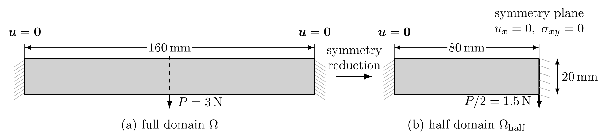

<b>
图 5.1  两端固支梁几何尺寸、载荷与对称边界条件示意图：(a) 完整设计域；(b) 左半计算域
</b>

计算中利用几何与受载对称性取左半计算域（$80\,\mathrm{mm} \times 20\,\mathrm{mm}$），对称面 $x=80\,\mathrm{mm}$ 上施加 $u_x=0$ 与 $\sigma_{xy}=0$。LFEM 对水平位移自由度强施加 $u_x=0$。HZMFEM 中 $u_x=0$ 为自然条件，$\sigma_{xy}=0$ 通过将该边上应力法向迹的切向分量置零强施加，法向分量保持自由。半域承担的载荷合力为 $P/2=1.5\,\mathrm N$，下文柔顺度按完整结构报告，即取半域计算值的两倍。

采用与第 5.1 节相同的对角线棋盘格交替的 $80 \times 20$ 规则直角三角形剖分（半域单元总数 $N_e = 3\,200$，全域等效 $6\,400$ 单元），密度过滤半径 $r_{\min} = 2.4\,\mathrm{mm}$。两类离散方法均采用第 4.6.1 节的 MMA 更新，初始密度取均匀值 $\rho_e^{(0)} = \bar{V}$，移动极限 $m=0.2$，设计变化容差 $\varepsilon_\rho=10^{-2}$，设计变量范围 $0\leq\rho_e\leq1$，空洞材料模量 $E_{\min}=10^{-9}\,\mathrm{MPa}$，惩罚指数 $p_E=3$。LFEM 取 $p=2,3,4$，HZMFEM 取 $k=2,3,4$，其中 $k=2$ 采用跳量稳定化，$k=3,4$ 采用原生高阶格式。不同方法优化得到的最终拓扑构型对比见图 5.2（全域对称镜像呈现），收敛历史见图 5.3。

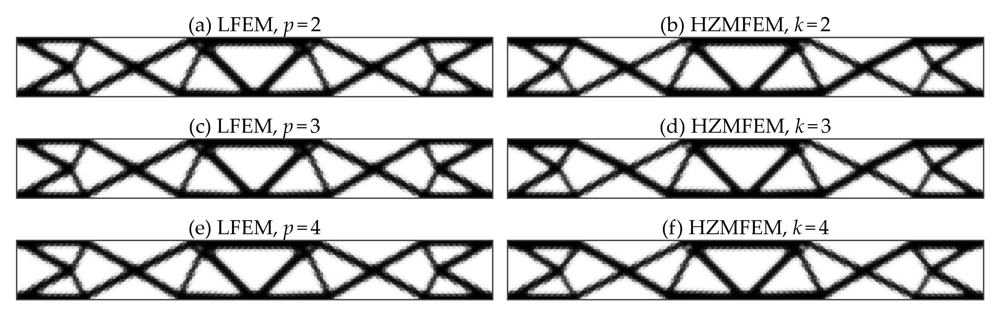

<b>
图 5.2  采用 MMA 的两端固支梁最终拓扑构型对比（左列：LFEM，$p$ 为位移阶次；右列：HZMFEM，$k$ 为应力阶次）
</b>

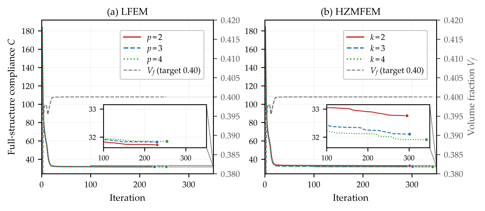

<b>
图 5.3  两端固支梁 MMA 优化历史曲线对比（彩色曲线：完整结构柔顺度；灰色曲线：体积分数；末端圆点：各次运行的末步柔顺度，即表 5.3 的优化所得柔顺度；内嵌图：后期迭代放大）
</b>

图 5.2 表明，两类方法均形成以交叉斜杆为主要承载路径的拓扑构型，局部杆件的连接与厚度存在差异。LFEM 的 $p=2,3,4$ 三组计算分别在 230、230、254 步达到设计变化容差，HZMFEM 的 $k=2,3,4$ 三组计算分别在 287、301、342 步达到该容差，最终体积分数均接近 $0.4$ 且满足体积约束（图 5.3）。各组按自身离散评估的最终全梁柔顺度（即优化所得柔顺度）列于表 5.3 第三列（单位 $\mathrm{N\cdot mm}$，下同）：LFEM 随 $p=2,3,4$ 依次为 $31.73$、$31.83$、$31.85$，HZMFEM 随 $k=2,3,4$ 依次为 $32.76$、$32.11$、$31.91$。

这些优化所得柔顺度之间的差异不能直接理解为最终设计的差异。位移法按外载功、混合法按式 (4.5) 的余能评估柔顺度，二者对同一设计给出的离散值本就不同；同时各组独立求解各自的优化问题，最终设计也不完全相同。为分离这两种因素，固定六组的最终物理密度，统一用 LFEM $p=3,4$ 与 HZMFEM $k=3,4$ 各求解一次状态方程并按相应泛函评估柔顺度，结果列于表 5.3 后四列。

<b>
表 5.3  两端固支梁六组最终设计的优化所得柔顺度与统一再分析柔顺度（完整结构，单位 N·mm；$p$ 为 LFEM 位移阶次，$k$ 为 HZMFEM 应力阶次）
</b>

| 优化设计 | 迭代步数 | 优化所得柔顺度 | 再分析 $p=3$ | 再分析 $p=4$ | 再分析 $k=3$ | 再分析 $k=4$ |
|:---:|:---:|:---:|:---:|:---:|:---:|:---:|
| LFEM $p=2$ | 230 | 31.73 | 31.83 | 31.85 | 32.38 | 32.13 |
| LFEM $p=3$ | 230 | 31.83 | 31.83 | 31.85 | 32.38 | 32.13 |
| LFEM $p=4$ | 254 | 31.85 | 31.83 | 31.85 | 32.38 | 32.13 |
| HZMFEM $k=2$ | 287 | 32.76 | 31.60 | 31.63 | 32.13 | 31.88 |
| HZMFEM $k=3$ | 301 | 32.11 | 31.57 | 31.59 | 32.11 | 31.86 |
| HZMFEM $k=4$ | 342 | 31.91 | 31.61 | 31.64 | 32.17 | 31.91 |

同一再分析列内，三个 LFEM 设计的柔顺度相差不超过 $0.01\%$，三个 HZMFEM 设计相差不超过 $0.20\%$，六个设计的最大相对差约为 $0.82\%$（LFEM 两列）与 $0.86\%$（HZMFEM 两列），远小于六组优化所得柔顺度之间的 $3.26\%$。另一方面，对每一个固定设计，LFEM 柔顺度随 $p$ 上升、HZMFEM 柔顺度随 $k$ 下降，同阶次两类泛函的相对差由 3 阶的 $1.66\%$–$1.78\%$ 缩至 4 阶的 $0.82\%$–$0.89\%$，两种离散近似相向逼近。可见优化所得柔顺度之间的差异主要来自目标泛函与离散的差异，而非最终设计的差异。这与 Bruggi [11] 在规则网格上以真混合元与位移元求解能量类拓扑优化问题时得到相近最优设计的观测一致。该算例表明，HZMFEM 在经典柔顺度最小化问题中能够获得与 LFEM 相近的承载构型与最终柔顺度，为所提出拓扑优化流程的正确性提供数值支持。

#### 5.2.2 Nearly Incompressible Topology Optimization (2D Bearing)

采用二维轴承装置（$120\,\mathrm{mm} \times 40\,\mathrm{mm}$，平面应变，图 5.4）检验近不可压缩极限下的抗体积自锁能力。底边完全固支（$u_x=u_y=0$），顶边施加竖直向下的均布牵引 $t_0 = 8\times10^{-2}\,\mathrm{N/mm}$，左右边界自由。材料参数取 $E_0 = 1\,\mathrm{MPa}$，可压缩基准组 $\nu_0=0.3$，近不可压缩组 $\nu_0=0.4999$；空洞模量 $E_{\min}=10^{-9}\,\mathrm{MPa}$，$p_E=3$。可压缩组固定泊松比；近不可压缩组按式 (4.4) 插值，取 $\nu_{\mathrm{void}}=0.3$、$p_\nu=1$。

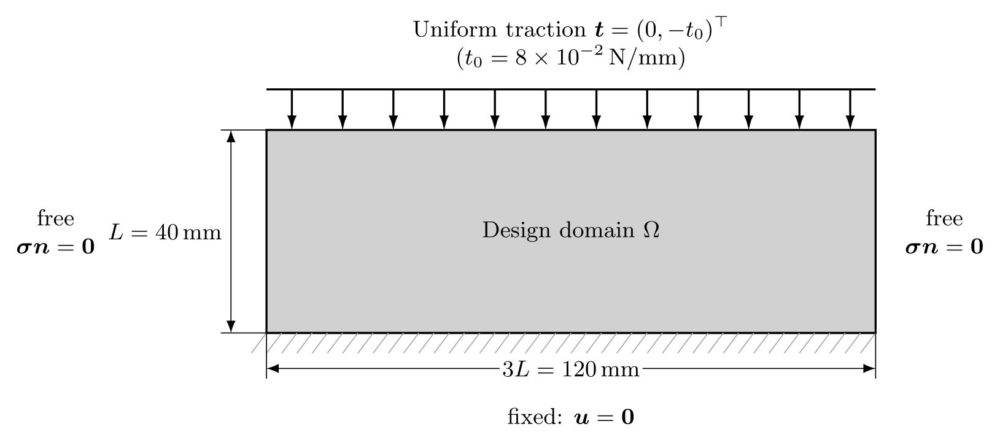

<b>
图 5.4  二维轴承装置几何与边界条件示意图
</b>

网格取 $120\times 40$ 规则结构化三角形网格（共 $9\,600$ 单元），对角线按左右半域镜像布置，与问题的左右对称性一致。体积分数上限 $\bar V=0.35$，密度过滤半径 $r_{\min}=2.0\,\mathrm{mm}$，均匀初始密度 $\rho_e^{(0)}=\bar V$。两组材料各以 LFEM $p=1,2$ 与 HZMFEM $k=2$（后者启用第 3.3 节的跳量稳定化）求解，共六次优化，均采用第 4.6.1 节的 OC 更新（移动极限 $m=0.2$，阻尼指数 $\xi=0.5$，设计变化容差 $\varepsilon_\rho=10^{-2}$）并达到停止准则。

优化前先在全域实体（$\rho_e\equiv1$）上考察体积自锁。泊松比取 $0.3$ 与 $0.4999$，网格由 $30\times10$ 逐级加密至 $240\times80$；LFEM $p=1,2$ 与 HZMFEM $k=2$ 计算四级，无需稳定化的 HZMFEM $k=4$ 计算前三级。各泊松比的参考值取 HZMFEM $k=4$ 前三级结果的 Richardson 外推极限 [32]，见图 5.5；其他序列各自外推所得极限与该参考值相差不超过 $0.06\%$，因此低于此量级的偏差（可压缩组 LFEM $p=2$ 最细两级）不作定量解释。在 $120\times40$ 网格上，泊松比增大后 LFEM $p=1$ 的柔顺度偏差绝对值由约 $0.04\%$ 增至 $16.82\%$，表现出明显自锁；HZMFEM $k=2,4$ 则分别由 $0.66\%$、$0.30\%$ 增至 $0.96\%$、$0.42\%$，两组泊松比下偏差均随加密单调减小且量级相近，未出现线性位移元的精度退化。LFEM $p=2$ 在近不可压缩组的偏差约为 $0.13\%$，仍小于两种混合离散。

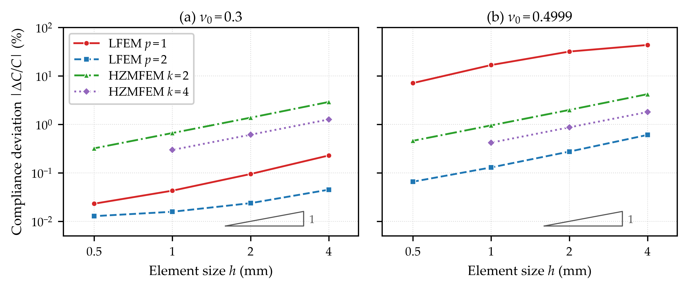

<b>
图 5.5  全域实体（$\rho_e\equiv1$）的柔顺度相对外推参考值的偏差绝对值：(a) $\nu_0=0.3$；(b) $\nu_0=0.4999$
</b>

六次优化的最终拓扑构型见图 5.6，均形成以三拱形为主的承载路径。可压缩组中，三种离散所得构型整体相近；近不可压缩组中，LFEM $p=1$ 所得拱形轮廓更接近折线，拱顶较尖，局部杆件较粗，而 LFEM $p=2$ 与 HZMFEM $k=2$ 仍保持较平滑的拱形轮廓，两者构型接近。结合图 5.5 中线性位移元的明显精度退化，这些差异表明体积自锁已影响其优化结果。近不可压缩组中，LFEM $p=1$ 因体积自锁而表现出虚假的过高刚度，导致计算柔顺度偏低（表 5.4 优化所得柔顺度列），不能据此认为其所得设计更优。

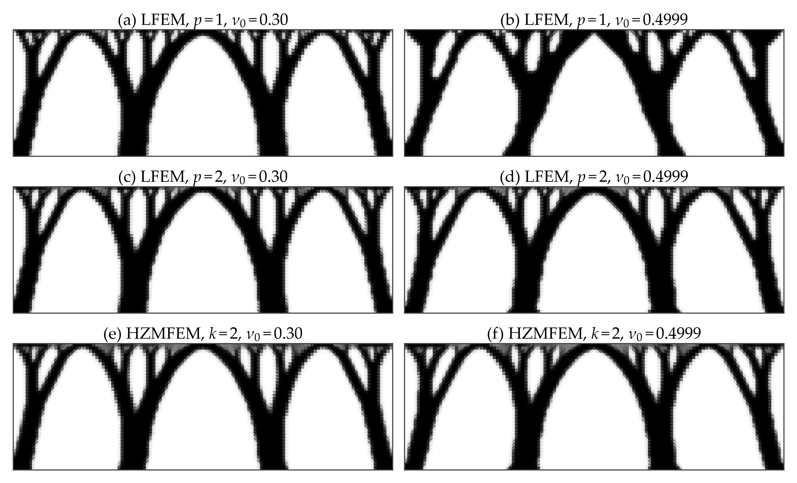

**图 5.6  二维轴承装置最终拓扑构型对比（左列：泊松比 0.30；右列：泊松比 0.4999；自上而下：LFEM $p=1$、LFEM $p=2$、HZMFEM $k=2$）**

为比较六个最终设计，固定各组物理密度，分别采用 LFEM $p=1,2$ 与 HZMFEM $k=2,4$ 在 $120\times40$ 网格上进行再分析，表 5.4 列出 HZMFEM $k=4$ 的柔顺度及其他离散相对该值的偏差。在统一的 HZMFEM $k=4$ 再分析下，可压缩组三个设计的柔顺度最大相差约 $1.2\%$；近不可压缩组中，LFEM $p=1$ 所得设计的柔顺度比 HZMFEM $k=2$ 高约 $24.0\%$，而 LFEM $p=2$ 与 HZMFEM $k=2$ 仅相差约 $0.5\%$。对于同一固定设计，近不可压缩组 LFEM $p=1$ 的柔顺度较参考值低约 $17\%$–$38\%$，进一步说明体积自锁导致其刚度高估。结合图 5.5 与图 5.6，Hu–Zhang 元有效减轻了线性位移元自锁对优化结果的影响，所得设计与二次位移元表现接近。

<b>
表 5.4  二维轴承装置六组最终设计的优化迭代步数、优化所得柔顺度、HZMFEM $k=4$ 再分析柔顺度（单位 N·mm）及各离散再分析值相对后者的偏差
</b>

| 泊松比 $\nu_0$ | 优化设计 | 迭代步数 | 优化所得柔顺度 | HZMFEM $k=4$ 再分析柔顺度 | LFEM $p=1$ | LFEM $p=2$ | HZMFEM $k=2$ |
| :---: | :--- | :---: | :---: | :---: | :---: | :---: | :---: |
| $0.30$ | LFEM $p=1$ | 281 | $119.33$ | $125.83$ | $-5.2\%$ | $-1.9\%$ | $+4.9\%$ |
| $0.30$ | LFEM $p=2$ | 351 | $122.73$ | $124.64$ | $-4.0\%$ | $-1.5\%$ | $+4.0\%$ |
| $0.30$ | HZMFEM $k=2$ | 464 | $127.68$ | $124.30$ | $-3.5\%$ | $-1.2\%$ | $+2.7\%$ |
| $0.4999$ | LFEM $p=1$ | 372 | $76.43$ | $123.49$ | $-38.1\%$ | $-2.6\%$ | $+4.9\%$ |
| $0.4999$ | LFEM $p=2$ | 245 | $98.06$ | $100.01$ | $-17.8\%$ | $-1.9\%$ | $+4.0\%$ |
| $0.4999$ | HZMFEM $k=2$ | 343 | $102.37$ | $99.56$ | $-16.8\%$ | $-1.6\%$ | $+2.8\%$ |

#### 5.2.3 Local Stress-Constrained Cantilever Beam

考察悬臂梁局部应力约束优化算例（图 5.7）。设计域 $80\,\mathrm{mm}\times40\,\mathrm{mm}$，平面应力，左边界固支；右边界中点的竖直合力 $P=400\,\mathrm{N}$ 按接触宽度 $l=6\,\mathrm{mm}$ 化为均布牵引 $\bar t=P/l$，接触区端点与网格节点对齐。位移法按边界积分、混合法按应力法向迹施加同一载荷，接触区端点邻域按下述被动实体区处理。实体材料为铝合金，$E_0=70\,000\,\mathrm{MPa}$，$\nu_0=0.25$，许用应力 $\bar\sigma=180\,\mathrm{MPa}$；空材料模量 $E_{\min}=10^{-9}E_0$。由于载荷与设计无关且位移边界条件齐次，应力不依赖弹性模量的量级；计算时取 $E_0^{\mathrm{calc}}=1\,\mathrm{MPa}$，$E_{\min}$ 与本节后文低阶稳定化格式（$k=2$）的稳定化系数同比缩放，载荷与 $\bar\sigma$ 保持物理值。惩罚指数 $p_E=3.5$，采用 $80\times40$ 棋盘式交替对角线三角形网格（共 $6\,400$ 单元），密度过滤半径 $r_{\min}=6.0\,\mathrm{mm}$，初始密度 $\rho_e^{(0)}=0.5$。

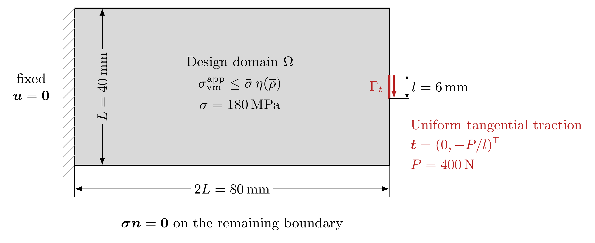

<b>
图 5.7  二维悬臂梁设计域、局部载荷与边界条件示意图
</b>

两类方法采用相同的网格、载荷与优化参数。LFEM 取 $p=3$，HZMFEM 取 $k=3$，后者为无需跳量稳定化的原生高阶格式。密度过滤后采用 tanh 投影，$\eta_{\mathrm p}=0.5$，$\beta$ 从 $1$ 起每 5 个外层步增加 $1$ 至 $10$。局部应力约束采用第 4.3 节的模型，取 $\epsilon=10^{-3}$，全过程固定。以接触区两端点为中心、半径 $r_{\mathrm{pad}}=1.5\,\mathrm{mm}$ 的邻域划定被动实体区 $\Omega_{\mathrm{pad}}$（两类离散均为 16 个单元，占设计域面积 $0.25\%$）。该区不施加局部应力约束，即不计入增广拉格朗日函数的应力约束项，与 Bruggi 与 Venini [13] 对集中载荷周围单元的处理相同。其物理密度在过滤与投影后置为 1，对应的密度映射导数置零，即不参与优化，与 Holmberg 等 [25] 排除载荷附近单元的做法相同。该区体积计入总体积分数。判据集合取 $\mathcal E_{\mathrm{acc}}=\{e\notin\Omega_{\mathrm{pad}}:\overline\rho_e\geq0.5\}$，$\overline\rho_e<0.5$ 的单元仍施加松弛应力约束，但不纳入停止判断。采用第 4.6.2 节的 ALM–MMA 流程，取 $\mu_0=50$、$\gamma_\mu=1.1$、$\mu_{\max}=10^4$、$\lambda_{\max}=3000$，移动极限 $m=0.15$，渐近线最小间距 $10^{-4}$，$N_{\mathrm{out}}^{\max}=200$、$N_{\mathrm{in}}^{\max}=5$。停止判据取 $\delta_\rho=0.002$、$\delta_g=0.005$、$N_{\mathrm{hold}}=3$。

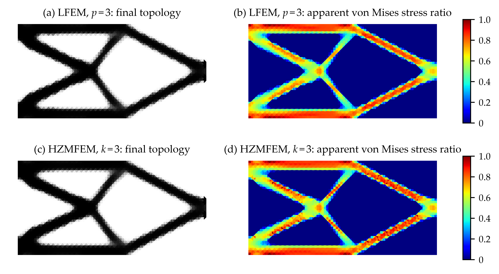

<b>
图 5.8  三次离散下悬臂梁的最终构型与表观 von Mises 应力比分布（LFEM：$p=3$；HZMFEM：$k=3$）
</b>

图 5.8 显示，两类离散得到相近的桁架状拓扑，主要承载路径由上下缘杆件与内部交叉斜杆构成，高应力区域沿该路径分布，构型与应力分布形态在两类离散间接近。

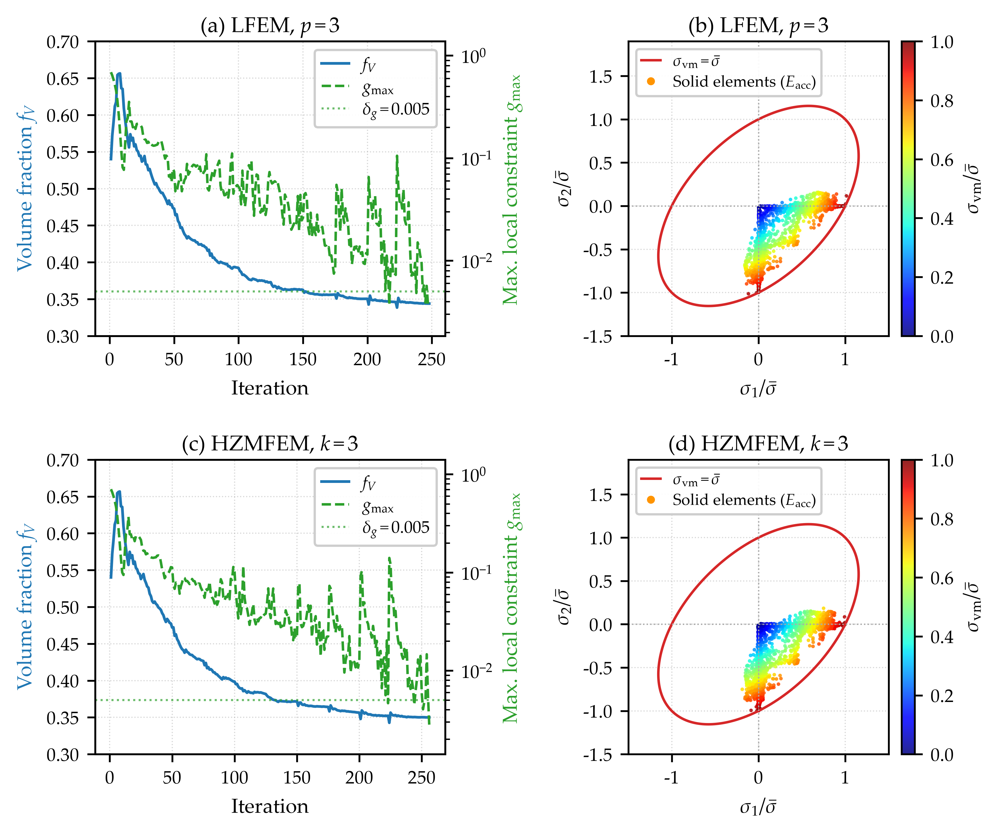

<b>
图 5.9  三次离散下悬臂梁优化收敛历史与主应力空间内的单元应力分布（(a,b) LFEM $p=3$；(c,d) HZMFEM $k=3$），其中 $g_{\max}$ 与应力点均在判据集合 $\mathcal E_{\mathrm{acc}}$ 上取值
</b>

图 5.9(a)(c) 给出体积分数与判据集合 $\mathcal E_{\mathrm{acc}}$ 上最大局部约束值的迭代历史，约束按各自离散评价。LFEM 与 HZMFEM 分别经过 248 与 256 次 MMA 更新后达到算法 2 的停止准则；最终 $f_V$ 分别为 $34.39\%$ 与 $35.01\%$，$g_{\max}$ 分别为 $3.92\times10^{-3}$ 与 $2.82\times10^{-3}$，均低于 $\delta_g=0.005$。图 5.9(b)(d) 给出 $\mathcal E_{\mathrm{acc}}$ 内单元形心处表观主应力与许用应力之比 $\sigma_i/\bar\sigma$（$\sigma_1\geq\sigma_2$），散点按表观 von Mises 应力比着色。应力点几乎全部落在 $\sigma_1\geq0\geq\sigma_2$ 象限：一部分沿两坐标轴聚集，对应单轴拉、压状态，与桁架状构型中杆件的轴向承载相符；其余分布于两轴之间并靠近屈服椭圆，对应拉压双轴的剪切主导状态。

在与图 5.8 相同的设置下，另以稳定化格式 $k=2$ 和原生格式 $k=4$ 求解同一问题，结果见图 5.10。连同 $k=3$，三个阶次的 MMA 更新次数依次为 250、256 与 258，最终 $f_V$ 依次为 $34.70\%$、$35.01\%$ 与 $35.30\%$，判据集合 $\mathcal E_{\mathrm{acc}}$ 上的 $g_{\max}$ 依次为 $1.96\times10^{-3}$、$2.82\times10^{-3}$ 与 $4.92\times10^{-3}$，均低于 $\delta_g$，并满足同一设计变化判据。三个阶次得到相近的主要承载构型，说明该优化流程适用于所考察的低阶稳定化与高阶原生离散。

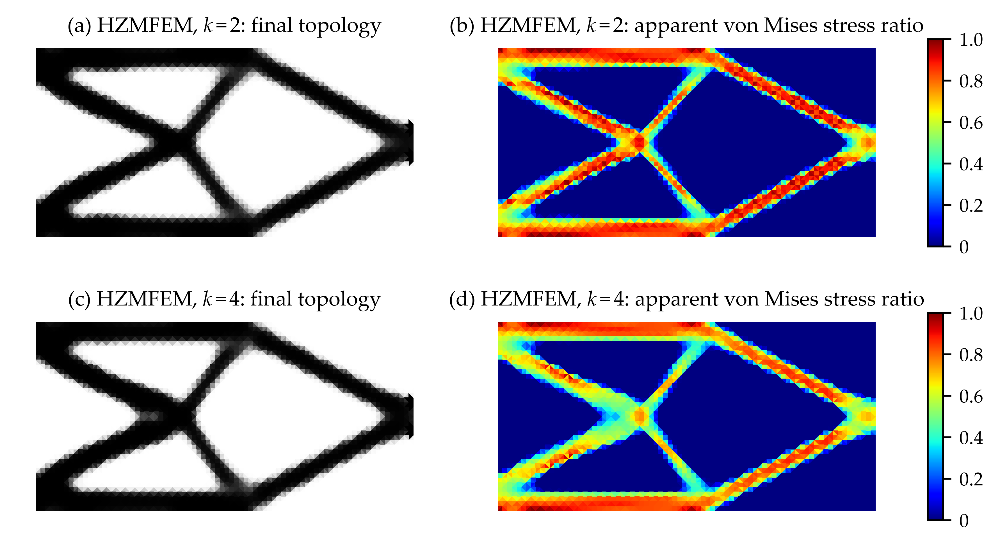

<b>
图 5.10  Hu–Zhang 混合离散下悬臂梁的最终构型与表观 von Mises 应力比分布（(a,b) $k=2$；(c,d) $k=4$）
</b>

为进一步考察两类离散的应力场特征，比较其跨单元法向牵引连续性：HZMFEM 的 $g_e$ 直接取自主未知量 $\boldsymbol{\sigma}_h\in H(\operatorname{div},\Omega;\mathbb S)$，法向牵引跨单元单值；LFEM 的应力由位移梯度逐单元恢复，内部面上的牵引不连续。为量化这一差别，将 LFEM $p=2,3,4$ 与 HZMFEM $k=2,3,4$ 的六个最终构型（$p=2,4$ 另行求得，设置与停止判据同图 5.8）各自在优化所用离散下重解状态方程，定义内部面 $F$ 上的归一化牵引跳量均方根 $A_F$，并取单元各内部面的最大值作为单元指标 $A_e$

$$
A_F=\frac{1}{\bar\sigma}\Big(\frac{1}{|F|}\int_F\big\|[\![\boldsymbol{\sigma}^{\mathrm{app}}_h\boldsymbol{n}]\!]\big\|^2\,\mathrm{d}s\Big)^{1/2},\qquad A_e=\max_{F\subset\partial T_e\cap\Omega}A_F, \tag{5.1}
$$

统计限于实体带（$\overline\rho_e>0.9$ 且不属于 $\Omega_{\mathrm{pad}}$）。图 5.11 中，HZMFEM 三个阶次的 $A_e$ 均在舍入量级（最大 $2.2\times10^{-16}$）；LFEM $p=2,3,4$ 的 $A_e$ 中位数依次为 $2.4\times10^{-2}$、$1.6\times10^{-2}$ 与 $1.1\times10^{-2}$，第 95 百分位数依次为 $0.13$、$0.086$ 与 $0.072$，随阶次提高而减小但仍明显非零，较大的跳量集中于杆件边缘。该结果体现了两类离散在跨单元界面平衡上的差别：Hu–Zhang 应力场保持法向牵引连续，而由位移梯度逐单元恢复的应力一般不满足这一连续性。图中的 $\delta_g$ 与 $4\delta_g$ 仅作为数值尺度参照，并非牵引跳量的验收阈值。

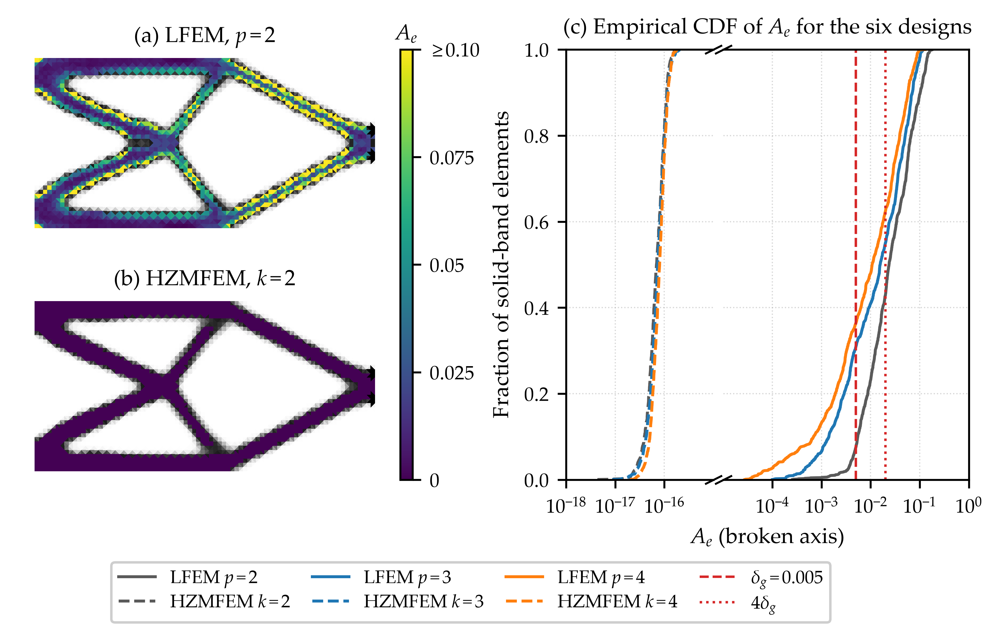

<b>
图 5.11  最终构型实体带上的逐单元牵引跳量 $A_e$：(a) LFEM $p=2$ 与 (b) HZMFEM $k=2$ 的空间分布（共用色标，超出上界者截断）；(c) 六个构型的经验累积分布，横轴断开，左段为 HZMFEM $k=2$–$4$（虚线），右段为 LFEM $p=2$–$4$（实线），竖线为 $\delta_g$ 与 $4\delta_g$
</b>

---

## 6 Concluding Remarks

### 6.1 Key Conclusions

本文建立了面向密度法拓扑优化的高阶 Hu–Zhang 混合有限元框架，主要结论如下：

1. **高阶 Hu–Zhang 元拓扑优化框架**：在带非齐次牵引边界的 Hellinger–Reissner 变分框架下，本质牵引条件经与设计无关的提升场施加，提升项使离散右端依赖材料分布，余能目标与局部应力约束的一致伴随灵敏度计入该依赖。通过法向迹自由度管理、局部角点松弛与低阶跳量稳定化，$k\le d$ 的稳定化格式与 $k\ge d+1$ 的原生格式在同一优化流程下运行。制造解算例的观测收敛阶与理论估计一致；两端固支梁算例中，两类离散得到相近的承载构型，统一再分析后的柔顺度接近。
2. **近不可压缩条件下的拓扑优化**：Hu–Zhang 元的柔度双线性型在 $\lambda\to\infty$ 时保持有界；本文未建立关于 $\lambda$ 一致的离散稳定性估计，抗体积自锁性质由数值结果检验。轴承算例中，Hu–Zhang 元在两组泊松比下的全实体柔顺度收敛趋势相近，未出现线性位移元的明显精度退化；统一再分析表明，近不可压缩组中 Hu–Zhang 元所得设计的柔顺度低于线性位移元，与二次位移元接近。
3. **独立应力驱动的局部应力约束拓扑优化**：Hu–Zhang 应力场属于 $H(\operatorname{div},\Omega;\mathbb S)$，跨单元法向牵引在迹意义下单值，局部 von Mises 应力约束直接基于该应力主变量构造，结合密度相关松弛阈值与 ALM–MMA 求解体积最小化问题，无需由位移梯度恢复应力。悬臂梁算例中，HZMFEM $k=3$ 与 LFEM $p=3$ 得到相近的构型与应力分布，HZMFEM $k=2,3,4$ 均达到停止准则，约束按各自离散在判据集合上评价；三个阶次的 Hu–Zhang 应力场逐单元牵引跳量均在舍入量级，而由位移梯度恢复的应力跳量明显非零。

### 6.2 Future Work and Outlook

本文的数值研究限于二维小变形线弹性问题，后续工作将围绕以下三个方面展开：

1. **三维扩展与并行求解。** 将局部角点松弛与边界条件处理方法扩展至三维 Hu–Zhang 离散，研究边界交汇棱边与顶点处的应力自由度组织，使给定牵引条件与跨单元法向迹连续性保持相容。针对高阶离散的未知量增长及材料刚度对比带来的求解困难，研究混合鞍点系统的块预条件与并行求解，并利用相邻优化步之间的求解信息复用降低计算成本。
2. **误差驱动的网格与阶次自适应。** 研究面向柔顺度及局部应力约束的后验误差估计，根据相应精度需求实施局部网格加密和阶次调整，将计算资源集中于应力集中区域及材料过渡区域。同时，研究网格变化时设计变量的转移以及过滤、投影的协调处理，保持设计长度尺度的一致性。
3. **有限变形与非线性材料。** 面向近不可压缩超弹性结构，建立与有限变形运动学相容的应力–位移混合离散、材料插值及一致伴随灵敏度。针对低密度区域的大变形与网格畸变，研究材料正则化和非线性求解策略，提高优化过程的稳定性，并通过不同载荷水平和材料参数下的算例评估应力精度、约束满足程度与计算代价。

---

## References

1. S. Adams and B. Cockburn. A mixed finite element method for elasticity in three dimensions. *Journal of Scientific Computing*, 25:515–521, 2005.
2. R. Andreani, E. G. Birgin, J. M. Martínez, and M. L. Schuverdt. On augmented Lagrangian methods with general lower-level constraints. *SIAM Journal on Optimization*, 18(4):1286–1309, 2008.
3. E. Andreassen, A. Clausen, M. Schevenels, B. S. Lazarov, and O. Sigmund. Efficient topology optimization in MATLAB using 88 lines of code. *Structural and Multidisciplinary Optimization*, 43(1):1–16, 2011.
4. D. N. Arnold, R. S. Falk, and R. Winther. Mixed finite element methods for linear elasticity with weakly imposed symmetry. *Mathematics of Computation*, 76(260):1699–1723, 2007.
5. D. N. Arnold and R. Winther. Mixed finite elements for elasticity. *Numerische Mathematik*, 92(3):401–419, 2002.
6. I. Babuška and M. Suri. Locking effects in the finite element approximation of elasticity problems. *Numerische Mathematik*, 62(1):439–463, 1992.
7. M. P. Bendsøe. Optimal shape design as a material distribution problem. *Structural Optimization*, 1(4):193–202, 1989.
8. M. P. Bendsøe and O. Sigmund. *Topology Optimization: Theory, Methods, and Applications*. Springer, 2004.
9. D. Boffi, F. Brezzi, and M. Fortin. *Mixed Finite Element Methods and Applications*, volume 44 of *Springer Series in Computational Mathematics*. Springer, 2013.
10. B. Bourdin. Filters in topology optimization. *International Journal for Numerical Methods in Engineering*, 50(9):2143–2158, 2001.
11. M. Bruggi. Topology optimization with mixed finite elements on regular grids. *Computer Methods in Applied Mechanics and Engineering*, 305:133–153, 2016.
12. M. Bruggi and P. Venini. Topology optimization of incompressible media using mixed finite elements. *Computer Methods in Applied Mechanics and Engineering*, 196(33–34):3151–3164, 2007.
13. M. Bruggi and P. Venini. A mixed FEM approach to stress-constrained topology optimization. *International Journal for Numerical Methods in Engineering*, 73(12):1693–1714, 2008.
14. T. E. Bruns and D. A. Tortorelli. Topology optimization of non-linear elastic structures and compliant mechanisms. *Computer Methods in Applied Mechanics and Engineering*, 190(26–27):3443–3459, 2001.
15. C. Chen, L. Chen, X. Huang, and H. Wei. Geometric decomposition and efficient implementation of high order face and edge elements. *Communications in Computational Physics*, 35(4):1045–1072, 2024.
16. L. Chen, J. Hu, and X. Huang. Stabilized mixed finite element methods for linear elasticity on simplicial grids in $\mathbb{R}^n$. *Computational Methods in Applied Mathematics*, 17(1):17–31, 2017.
17. L. Chen, J. Hu, and X. Huang. Fast auxiliary space preconditioners for linear elasticity in mixed form. *Mathematics of Computation*, 87(312):1601–1633, 2018.
18. L. Chen, J. Hu, X. Huang, and H. Man. Residual-based a posteriori error estimates for symmetric conforming mixed finite elements for linear elasticity problems. *Science China Mathematics*, 61(6):973–992, 2018.
19. G. Cheng and X. Guo. $\epsilon$-relaxed approach in structural topology optimization. *Structural Optimization*, 13(4):258–266, 1997.
20. G. Cheng and Z. Jiang. Study on topology optimization with stress constraints. *Engineering Optimization*, 20(2):129–148, 1992.
21. R. Codina, I. Castañar, and J. Baiges. Finite element approximation of stabilized mixed models in finite strain hyperelasticity involving displacements and stresses and/or pressure—an overview of alternatives. *International Journal for Numerical Methods in Engineering*, 125(18):e7540, 2024.
22. P. Duysinx and M. P. Bendsøe. Topology optimization of continuum structures with local stress constraints. *International Journal for Numerical Methods in Engineering*, 43(8):1453–1478, 1998.
23. O. Giraldo-Londoño and G. H. Paulino. PolyStress: a Matlab implementation for local stress-constrained topology optimization using the augmented Lagrangian method. *Structural and Multidisciplinary Optimization*, 63(4):2065–2097, 2021.
24. L. He, H. Wei, and T. Tian. SOPTX: A modular and extensible framework for topology optimization with multi-backend support. *Communications in Computational Physics*, 40(2):525–572, 2026.
25. E. Holmberg, B. Torstenfelt, and A. Klarbring. Stress constrained topology optimization. *Structural and Multidisciplinary Optimization*, 48(1):33–47, 2013.
26. J. Hu. Finite element approximations of symmetric tensors on simplicial grids in $\mathbb{R}^n$: the higher order case. *Journal of Computational Mathematics*, 33(3):283–296, 2015.
27. J. Hu and R. Ma. Partial relaxation of $C^0$ vertex continuity of stresses of conforming mixed finite elements for the elasticity problem. *Computational Methods in Applied Mathematics*, 21(1):89–108, 2021.
28. J. Hu and S. Zhang. A family of conforming mixed finite elements for linear elasticity on triangular grids. *arXiv preprint arXiv:1406.7457*, 2014.
29. U. Kirsch. On singular topologies in optimum structural design. *Structural Optimization*, 2(3):133–142, 1990.
30. C. Le, J. Norato, T. Bruns, C. Ha, and D. Tortorelli. Stress-based topology optimization for continua. *Structural and Multidisciplinary Optimization*, 41(4):605–620, 2010.
31. J. París, F. Navarrina, I. Colominas, and M. Casteleiro. Topology optimization of continuum structures with local and global stress constraints. *Structural and Multidisciplinary Optimization*, 39(4):419–437, 2009.
32. P. J. Roache. Perspective: a method for uniform reporting of grid refinement studies. *Journal of Fluids Engineering*, 116(3):405–413, 1994.
33. F. V. Senhora, O. Giraldo-Londoño, I. F. M. Menezes, and G. H. Paulino. Topology optimization with local stress constraints: a stress aggregation-free approach. *Structural and Multidisciplinary Optimization*, 62(4):1639–1668, 2020.
34. K. Svanberg. The method of moving asymptotes—a new method for structural optimization. *International Journal for Numerical Methods in Engineering*, 24(2):359–373, 1987.
35. G. Sved and Z. Ginos. Structural optimization under multiple loading. *International Journal of Mechanical Sciences*, 10(10):803–805, 1968.
36. F. Wang, B. S. Lazarov, and O. Sigmund. On projection methods, convergence and robust formulations in topology optimization. *Structural and Multidisciplinary Optimization*, 43(6):767–784, 2011.
37. Y. Zheng, H. Wei, Y. Huang, C. Chen, T. Tian, H. Liu, W. Wang, and L. He. FEALPy: A cross-platform intelligent numerical simulation engine. *Communications in Computational Physics*, 40(5):1676–1704, 2026.
