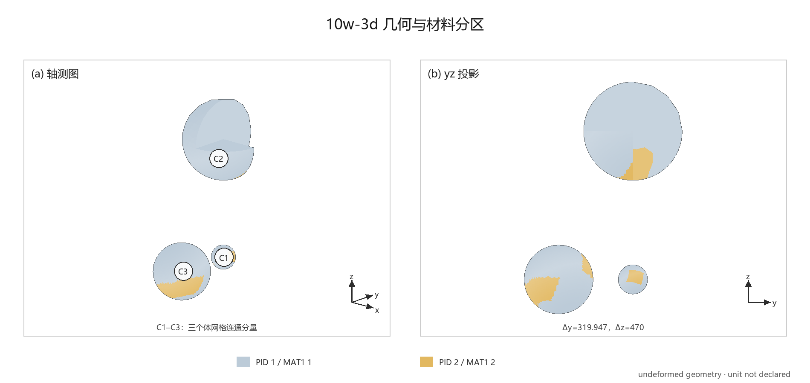
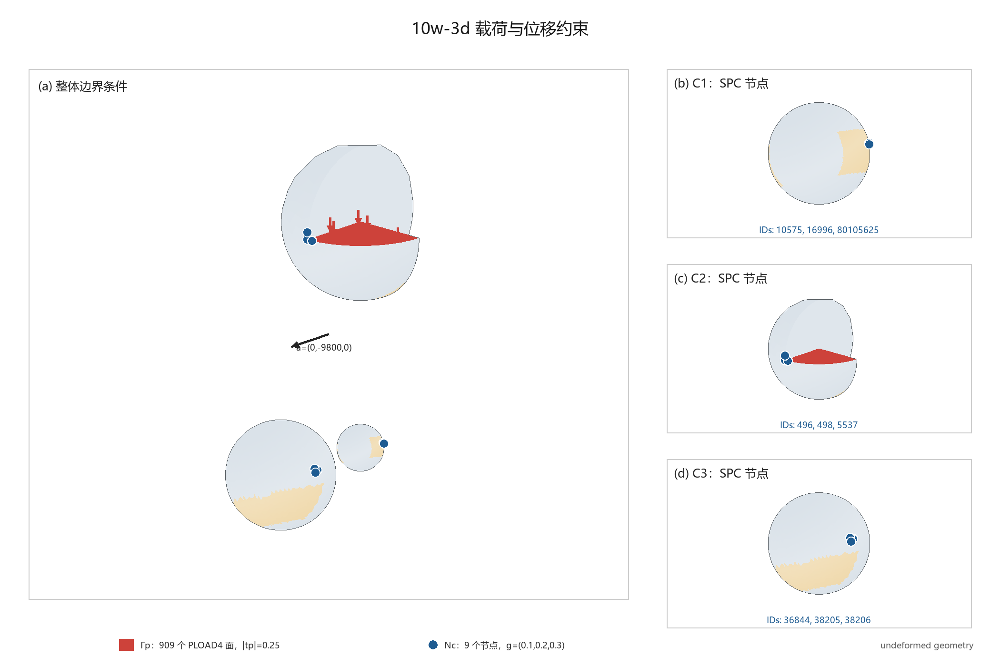
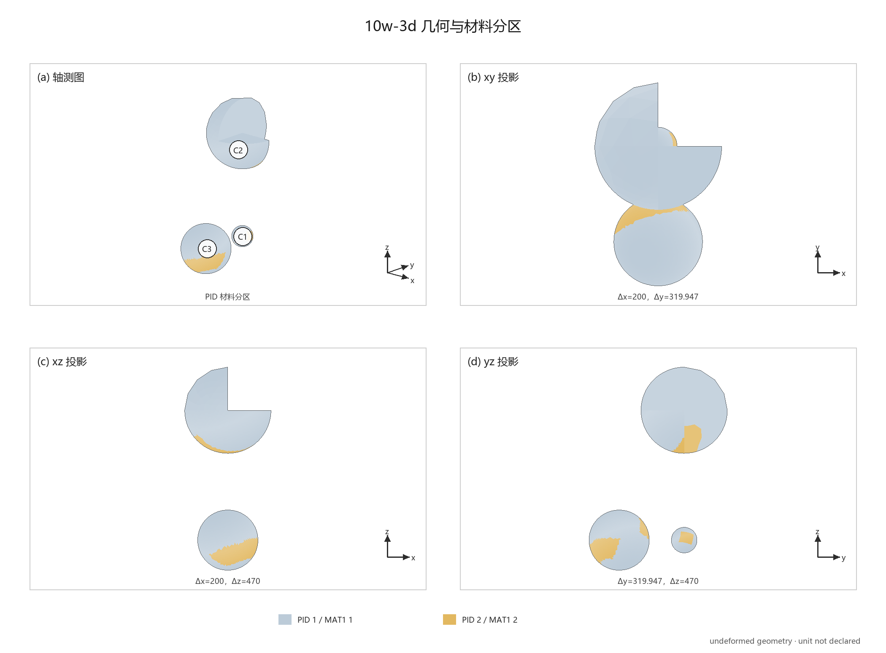

# `10w-3d.bdf` 三维线弹性模型

## 算例定位

这是一个三维、多连通体、两材料、非规则四面体网格模型。它适合考察 Hu–Zhang 元在复杂三维工程网格上的前向求解能力，但目前不是拓扑优化算例，也不能直接加入现有二维论文算例组。

**候选用途：** 三维 Hu–Zhang 扩展后的复杂工程模型验证，或优化构型的独立应力复核。

## 模型定义

**图 1**　未变形几何的轴测图和 $yz$ 投影。`C1`、`C2`、`C3` 为三个体网格连通分量，灰、黄色分别为 PID 1 和 PID 2。

**图 2**　红色为 909 个 `PLOAD4` 面，其并集即压力边界 $\Gamma_p$；蓝点为 9 个 `SPC 2` 节点，即位移点约束集 $\mathcal N_c$（数学性质见「边界条件的数学结构」）。右侧分别放大三个连通体上的节点组。[SVG](figures/10w-3d-boundary-conditions.svg) · [绘图脚本](scripts/render_10w_3d_model.py)

| 项目 | 数据 |
|---|---|
| 分析类型 | `SOL 101` 三维线性静力 |
| 网格 | 43,209 个 `GRID`，221,599 个 `CTETRA4` |
| 几何 | 3 个互不连通的体 |
| 材料 | PID 1：175,339 个单元；PID 2：46,260 个单元 |
| 载荷 | 重力和 909 个压力面 |
| 位移约束 | 9 个节点、27 个非零约束自由度 |

| PID / MID | $E$ | $\nu$ | $\rho$ |
|---|---:|---:|---:|
| 1 / 1 | $2\times10^5$ | $0.3$ | $7.8\times10^{-9}$ |
| 2 / 2 | $8\times10^4$ | $0.3$ | $2.7\times10^{-9}$ |

BDF 没有声明单位制，上表只保留原始数值。

### 区域划分

令 $D^{(m)}$ 表示图中的 `C1`、`C2`、`C3`，其中 $m=1,2,3$。整体区域按几何连通性分解为

$$
\Omega=\bigcup_{m=1}^{3}D^{(m)},
\qquad
D^{(m)}\cap D^{(n)}=\varnothing
\quad(m\ne n).
$$

每个连通体再按 PID 分为两个材料子区：

$$
D^{(m)}=D_1^{(m)}\cup D_2^{(m)},
\qquad
\Omega_i=\bigcup_{m=1}^{3}D_i^{(m)},
\quad i=1,2.
$$

连通体 $m$ 内的材料界面为

$$
\Gamma_{12}^{(m)}
=\partial D_1^{(m)}\cap\partial D_2^{(m)},
\qquad
\Gamma_{12}=\bigcup_{m=1}^{3}\Gamma_{12}^{(m)}.
$$

设 $\Gamma_p^{(m)}$ 为 $D^{(m)}$ 上的压力边界，$\Gamma_0^{(m)}=\partial D^{(m)}\setminus\Gamma_p^{(m)}$。本例中

$$
\Gamma_p^{(1)}=\Gamma_p^{(3)}=\varnothing,
\qquad
\Gamma_p=\Gamma_p^{(2)}.
$$

### 强形式与约束

对 $m=1,2,3$ 和 $i=1,2$，模型写为

$$
\left\{
\begin{aligned}
-\nabla\cdot\boldsymbol\sigma_i^{(m)}(\boldsymbol u^{(m)})
&=\rho_i\boldsymbol a
&&\text{in }D_i^{(m)},\\
\boldsymbol\sigma_i^{(m)}(\boldsymbol u^{(m)})
&=2\mu_i\boldsymbol\varepsilon(\boldsymbol u^{(m)})
+\lambda_i\operatorname{tr}\!\left(\boldsymbol\varepsilon(\boldsymbol u^{(m)})\right)\boldsymbol I
&&\text{in }D_i^{(m)},\\
\boldsymbol u_1^{(m)}&=\boldsymbol u_2^{(m)}
&&\text{on }\Gamma_{12}^{(m)},\\
\boldsymbol\sigma_1^{(m)}\boldsymbol n_1
+\boldsymbol\sigma_2^{(m)}\boldsymbol n_2
&=\boldsymbol0
&&\text{on }\Gamma_{12}^{(m)},\\
\boldsymbol\sigma^{(m)}\boldsymbol n&=\boldsymbol t_p
&&\text{on }\Gamma_p^{(m)},\\
\boldsymbol\sigma^{(m)}\boldsymbol n&=\boldsymbol0
&&\text{on }\Gamma_0^{(m)}.
\end{aligned}
\right.
$$

其中

$$
\boldsymbol\varepsilon(\boldsymbol u)
=\frac12\left(\nabla\boldsymbol u+\nabla\boldsymbol u^{\mathsf T}\right),
\quad
\lambda_i=\frac{E_i\nu_i}{(1+\nu_i)(1-2\nu_i)},
\quad
\mu_i=\frac{E_i}{2(1+\nu_i)}.
$$

载荷和离散位移约束为

$$
\boldsymbol a=(0,-9800,0)^{\mathsf T},
\qquad
\boldsymbol t_p=s_p(0.25)\boldsymbol n,
\qquad
\boldsymbol u_h^{(m)}(\boldsymbol x_j)=(0.1,0.2,0.3)^{\mathsf T},
\quad j\in\mathcal N_c^{(m)}.
$$

其中 $|\mathcal N_c^{(m)}|=3$，$\mathcal N_c=\bigcup_{m=1}^3\mathcal N_c^{(m)}$；$s_p\in\{-1,1\}$ 仍需按 BDF 压力符号约定确认。

### 边界条件的数学结构

**`PLOAD4` 面：Neumann 自然边界条件。** 压强载荷定义为沿面法向的面力 $\boldsymbol t_p=s_p\,p\,\boldsymbol n$（Nastran 约定实体单元面正压强指向单元内部，即沿外法向取负，这是 $s_p$ 待确认的来源）。位移法弱形式中它不进刚度矩阵，只作为线性泛函进入右端：

$$
\ell(\boldsymbol v)\;\supset\;\int_{\Gamma_p}\boldsymbol t_p\cdot\boldsymbol v\,\mathrm{d}A .
$$

离散化为一致节点载荷 $\boldsymbol f_a=\int_F p\,N_a\,s_p\boldsymbol n\,\mathrm{d}A$；对 `CTETRA4` 的平面三角形受载面（$\boldsymbol n$、$p$ 均为常量），退化为面上总力 $pA$ 沿法向均分给三个角点，即每点 $s_p\,\dfrac{pA}{3}\,\boldsymbol n$。法向由单元面几何自动确定，载荷"跟随网格"而非用户显式给向量。

**`SPC` 节点：仅离散层面良定的本质点约束。** 代数上把自由度剖分为自由集 $f$ 与约束集 $s$，消元后求解

$$
K_{ff}\,\boldsymbol u_f=\boldsymbol f_f-K_{fs}\,\boldsymbol u_s ,
$$

27 个非零给定值以 $-K_{fs}\boldsymbol u_s$ 变成等效载荷；约束反力（`SPCFORCE`）事后由 $\boldsymbol q_s=K_{sf}\boldsymbol u_f+K_{ss}\boldsymbol u_s-\boldsymbol f_s$ 恢复。其结构职能是消去刚体模态：三个连通体在纯 `GRAV`+`PLOAD4` 载荷下各有 6 维刚体核（共 18 维），每个体上完全固定 3 个不共线节点恰好消去该体全部刚体模态，使 $K_{ff}$ 对称正定。因此这 9 个点是"防漂移锚点"，不是物理支承边界；且三个分量在所有节点取相同值 $(0.1,0.2,0.3)$，等于给每个连通体预置同一个刚体平移。

连续层面点约束不是合法的 Dirichlet 条件：三维时 $H^1\not\hookrightarrow C^0$，点值不是 $H^1(\Omega)^3$ 上的连续泛函（单点集容量为零）。两个后果：其一，无法从点约束唯一反推正测度的连续边界 $\Gamma_D$（见「BDF 复原记录」）；其二，锚点反力是集中力，三维弹性集中力解在约束点附近 $\boldsymbol u\sim 1/r$、$\boldsymbol\sigma\sim 1/r^2$ 奇异，$h\to0$ 时无良定连续极限。故本模型只在固定网格上是良定问题，收敛性研究不能取约束点邻域的量作指标。

**对 Hu–Zhang 混合离散的含义。** 混合格式中角色对调：$\boldsymbol u_h\in L^2$（无点值可言），$\boldsymbol\sigma_h\in H(\mathrm{div})$。压力面从自然条件变为应力空间的本质边界条件（或经 Lagrange 乘子/Nitsche 弱施加）；位移点约束既非自然条件也无现成本质施加方式，需要显式设计。见 [[../../concepts/huzhang/huzhang-mixed-fem]]。

## 与胡张元论文的关系

| 评价项 | 判断 |
|---|---|
| 非规则几何 | 是 |
| 三维四面体网格 | 是 |
| 多材料 | 是 |
| 复杂载荷与非零位移 | 是 |
| 近不可压缩性 | 否，$\nu_1=\nu_2=0.3$ |
| 局部应力约束 | 未定义 |
| 拓扑优化设计域 | 未定义 |
| 可直接加入当前论文 | 否；当前数值范围为二维拓扑优化 |
| 合适用途 | 后续三维前向验证或高阶独立复核 |

这个模型增加的是工程几何、三维规模和异质材料复杂性，而不是论文当前重点考察的近不可压缩性或局部应力约束。

## 改造成论文算例

1. 判断 `C1`、`C2`、`C3` 应作为一个组合工况还是三个独立算例；它们之间没有网格连接。
2. 明确设计域、非设计域，以及两个 PID 在优化中的角色。
3. 选择柔顺度、局部应力或其他目标与约束，并给出体积分数等参数。
4. 将三维 `CTETRA4` 位移模型转换为三维 Hu–Zhang 混合离散。
5. 重新建模边界条件：压力面改为应力空间的本质条件；9 个 SPC 锚点无连续极限（见「边界条件的数学结构」），大概率需改造成正测度的位移边界，而非照搬点约束。
6. 核对单位制、压力方向和求解结果；必要时缩减网格规模，保证方法比较可复现。

BDF 复原记录

完整四视图用于核对空间位置与投影遮挡。[SVG](figures/10w-3d-model-four-views.svg)

- 引用链：`CTETRA → PID → PSOLID → MID → MAT1`；本例为 `PID 1 → MID 1`、`PID 2 → MID 2`。
- 体网格使用 43,206 个节点；三个连通体分别含 29,512、7,267、6,427 个节点。
- `GRID` 3、5100001、80100001 未被 `CTETRA` 引用。
- `LOAD 4` 由 `GRAV 1` 与 10 倍的 `PLOAD4 3` 组成，卡片压力为 $0.025$。
- 9 个 SPC 节点分别落在三个连通体上，每个节点约束三个平移分量。
- 离散点约束不能唯一恢复正测度的连续 Dirichlet 边界 $\Gamma_D$。
- 源文件没有解析 CAD、物理边界名称或成功求解记录；文件哈希与大小见 frontmatter。

