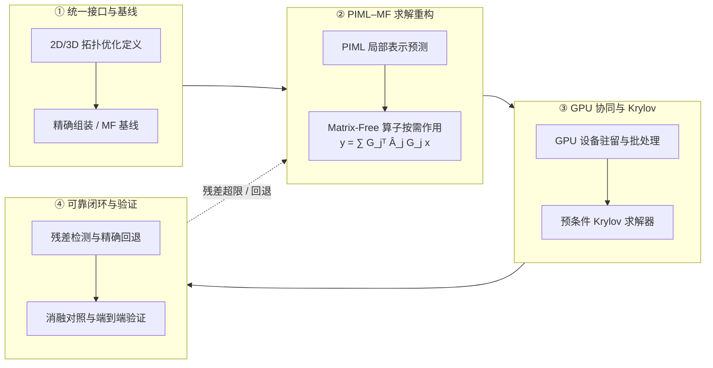

# 中国博士后科学基金第 80 批面上资助申请书正文

> 本页是第 80 批面上资助项目基本科研信息和六部分申请正文的批次表达事实源，栏目顺序与字数限制严格对应《2026 年度中国博士后科学基金资助指南》附录一。项目名称、总体目标、WP1–WP3、两年阶段和科研边界先由 [[../../../piml-matrix-free-gpu/project-plan|博士后核心研究项目计划]] 维护，再按本批评审要求压缩和重组；网站字段状态与上传记录由 [[80th-2026-application-workbook|填报工作底稿]] 维护，资格、时间和流程由 [[80th-2026|申报执行页]] 维护。本页当前只迁移写作骨架与研究要点，不代表完整申请书初稿。

## 一、项目基本信息

| 字段 | 内容 | 状态 |
|---|---|---|
| 项目中文名称 | 面向大规模拓扑优化的 PIML Matrix-Free 求解与 GPU 协同加速方法研究 | **与核心项目计划同步；待系统填写并保存** |
| 项目英文名称 | PIML-Enabled Matrix-Free Solvers and GPU-Coordinated Acceleration for Large-Scale Topology Optimization | **已确认本地写作口径；待系统填写并保存** |
| 项目来源 | 自选 | 建议稿；待系统填写并保存 |
| 关键词 | 大规模拓扑优化，问题无关机器学习，Matrix-Free，Krylov 求解，GPU 加速 | **已确认本地写作口径；待系统填写并保存** |
| 项目所属一级学科 | 力学 | 建议稿；待合作导师或院系确认 |
| 项目所属二级学科 | 固体力学 | 建议稿；待合作导师或院系确认 |
| 学科门类 | 工学 | 预计由系统根据主学科生成；待核对 |
| 交叉一级学科 | 数学 | 建议稿；待合作导师或院系确认 |
| 交叉二级学科 | 计算数学 | 建议稿；待合作导师或院系确认 |

正文首次使用时，将 PIML 写为“问题无关机器学习（Problem-Independent Machine Learning，PIML）”。Matrix-Free 保留英文术语，并在首次出现时说明其指不显式形成全局矩阵的算子作用与 Krylov 求解路径。

## 二、项目信息

> **第 1–5 部分匿名评审警示：** 不得出现申请人姓名、设站单位名称、合作导师姓名或其他可识别申请人身份的信息；违反系统规则可能被评审专家视为故意泄露个人信息并计 0 分。系统完整原文和上传核验由 [[80th-2026-application-workbook#七、匿名与合规检查|填报工作底稿]] 维护。

### 1. 选题依据（国内外研究现状及选题价值，限 1000 字）

**状态：第五稿；已补充复杂设计域等参 PIML 与 Bézier 边界位移参数化的正式期刊证据，正文与参考文献去除空白后约 971 个字符，待导师审阅。**

随着三维拓扑优化设计分辨率和规模提高，反复有限元分析与灵敏度计算带来的全局刚度矩阵装配、存储和线性求解开销，已成为制约优化效率的关键瓶颈。

针对上述瓶颈，Matrix-Free 方法以局部算子作用避免显式形成全局矩阵，国际上已建立并行框架[1]；GPU 加速的 Matrix-Free/Krylov 求解已用于三维拓扑优化[2]；国内学者发展了全矩阵无关的多重网格预条件共轭梯度方法[3]。现有方法主要采用精确局部算子，拓扑演化时的预条件更新及完整流程的精度—时间—内存权衡仍需研究。

国内相关研究提出问题无关机器学习（Problem-Independent Machine Learning，PIML），通过学习可复用局部力学表示降低反复分析成本[4]，并扩展至复杂设计域等参表示[5]、Bézier 参数化边界位移到内部响应映射[6]和 CPU/MPI 按需预测[7]。这些研究拓展了局部建模对象及适用范围；但现有并行实现仍组装全局粗尺度矩阵，尚未与全局 Matrix-Free 求解及 GPU 异构计算形成统一框架。

综上，现有 PIML 仍缺少由局部学习表示直接形成全局 Matrix-Free 算子作用的方法，也缺少预测与求解的 GPU 协同机制及端到端证据。本项目拟重构 PIML 的全局 Matrix-Free 求解路径，协同设计 GPU 上的预测与迭代计算，以误差检查、预条件更新和精确回退保证可靠性；通过响应精度、迭代收敛、时间和峰值内存评价完整求解与优化流程，为大规模拓扑优化提供可靠、可扩展的方法。

参考文献：

[1] Kronbichler, Kormann, Comput Fluids, 2012, 63:135–147。
[2] Träff et al., Comput Methods Appl Mech Eng, 2023, 410:116043。
[3] Zhou et al., J Comput Math, 2025, 43(5):1063–1091。
[4] Huang et al., Extreme Mech Lett, 2022, 56:101887。
[5] Zhang et al., Extreme Mech Lett, 2024, 72:102237。
[6] Guo et al., Comput Methods Appl Mech Eng, 2026, 456:118955。
[7] Ma et al., Acta Mech Sin, 2026, 42:425942。

### 2. 研究内容（研究对象，拟解决的关键科学问题，研究目标，限 2000 字）

**状态：第七稿；已基于仓库 PIML、Matrix-Free、Krylov、GPU/HPC 与拓扑优化证据综合重写，正文去除空白后约 1749 个字符，待导师审阅。**

**研究对象：**本项目面向二维、三维线弹性拓扑优化中的反复结构分析，研究由 PIML 局部预测、Matrix-Free 全局算子作用、预条件 Krylov 求解、GPU 执行和设计更新组成的局部—全局计算链。局部层面研究可复用局部力学表示的构造、降维与误差控制，不预设具体学习输出的主次；全局层面研究基于局部表示的算子按需作用，通过自由度映射、局部作用与全局累加避免显式组装全局系统矩阵。二维算例用于机理分析和受控对照，三维算例用于规模扩展与端到端验证。

**拟解决的关键科学问题：**

1. **PIML 局部近似误差在 Matrix-Free 全局作用中的传播及其与预条件 Krylov 收敛的关系。**PIML 产生的局部力学表示含有近似误差，该误差经自由度限制与回填、局部算子作用和全局累加形成整体算子扰动。如何根据具体局部表示刻画误差对全局算子对称性、半正定或约束后正定性及谱性质的影响，建立局部误差、预条件器质量、Krylov 真残差、迭代收敛与结构响应误差之间的关系，是实现可靠全局求解需要解决的首要科学问题。
2. **PIML–Matrix-Free–Krylov 异构计算链的性能耦合与端到端收益形成条件。**GPU 上的局部预测和算子计算还与不规则访存、全局累加、向量归约、预条件、数据搬移和同步共同作用；拓扑演化又会改变局部表示复用、精确回退、预条件器质量和迭代次数。如何揭示问题规模、数据组织、表示复用、预测误差、回退比例和迭代收敛对完整时间与显存开销的耦合影响，确定协同加速取得端到端收益的条件，是实现规模扩展需要解决的另一关键科学问题。

**主要研究内容：**

1. **PIML 局部表示驱动的 Matrix-Free 全局作用与预条件 Krylov 求解。**建立精确组装、精确局部算子 Matrix-Free 和 PIML 近似 Matrix-Free 的统一接口与参考基线，研究不同局部力学表示向全局算子按需作用的转化方法。分析局部近似误差经自由度映射、局部作用和全局累加后的算子扰动，根据具体表示研究对称性、半正定或约束后正定性等结构保持或检查方法，揭示其与代理预条件器质量、Krylov 真残差和迭代行为的关系；比较矩阵形成、存储、算子作用和预条件更新的计算与空间复杂度，确定 Matrix-Free 重构降低峰值内存和完整求解成本的条件。
2. **PIML–Matrix-Free–Krylov 计算链的 GPU 协同执行与性能建模。**围绕“局部特征构造—批量预测—局部作用—全局累加—预条件迭代”构建数据驻留与执行流程，研究批处理、缓存—重算、gather/scatter、局部作用融合、Krylov 向量运算、归约和预条件的协同组织。分析计算量、显存访问、数据搬移、同步、表示复用和迭代次数的耦合关系，建立完整求解与优化流程的时间—显存模型；分别统计离线训练、在线预测、单次求解和完整优化成本，识别主要瓶颈及端到端收益形成条件。
3. **拓扑演化下的可靠性机制与规模扩展验证。**研究局部材料分布演化对 PIML 预测有效性、全局算子性质和预条件器质量的影响，建立与局部表示相适配的结构检查、分布外识别、误差指示、局部精确回退和预条件更新机制；分析局部误差向位移、柔顺度、灵敏度及优化结果的传播。采用逐层消融对照，在二维机理算例和三维规模算例中比较精确组装、精确 Matrix-Free、PIML 组装式求解、PIML Matrix-Free 及其 GPU 实现的精度、收敛性、完整时间和峰值内存，界定融合方法可靠且具有端到端收益的适用范围。

**研究目标：**

1. 建立由 PIML 可复用局部力学表示驱动的 Matrix-Free 全局分析方法，阐明局部近似误差、全局算子性质、预条件器质量与 Krylov 收敛之间的关系，实现不显式组装全局系统矩阵的可靠求解。
2. 建立覆盖 PIML 批量预测、局部作用、gather/scatter、Krylov 向量运算、归约和预条件的 GPU 协同执行方法与性能模型，阐明计算、访存、同步、表示复用和迭代收敛共同决定端到端收益的作用规律与条件。
3. 建立面向拓扑演化的误差识别、局部精确回退和预条件更新机制，通过二维、三维结构分析与拓扑优化验证精度、收敛性、完整时间、峰值内存和规模扩展能力，界定方法可靠且具有端到端收益的适用范围。

### 3. 研究方案（限 2000 字）

**状态：第一稿；已按“统一基线与接口—Matrix-Free/Krylov—GPU 协同—可靠性与验证”组织，正文去除空白后约 1769 个字符，待导师审阅。**

**总体思路：**采用“精确基线—局部表示—全局作用—迭代求解—异构执行—优化验证”的递进路线。先在统一问题与接口下分别闭合精确 Matrix-Free 和 PIML 局部预测，再研究二者融合及 GPU 协同，避免把局部预测、单次算子作用或单个 GPU kernel 的结果直接外推为完整优化收益。

<b>图 1 PIML–Matrix-Free 求解与 GPU 协同加速总体技术路线图</b>

> **图 1 说明：** 本项目技术路线采用“统一基线 $\rightarrow$ PIML–Matrix-Free 重构 $\rightarrow$ GPU 协同求解 $\rightarrow$ 拓扑演化可靠闭环”的递进路线。通过局部表示按需形成全局算子作用（避免显式组装系统矩阵），配合 GPU 批量执行与精确回退机制，实现大规模拓扑优化的高效可靠求解。

1. **建立统一基线与局部表示接口。**选取二维、三维线弹性结构分析与密度型拓扑优化算例，统一有限元离散、材料插值、载荷、边界条件、优化参数和停止准则。在可承受规模构造全尺度或精确组装参考解，在规模算例中采用已通过一致性验证的精确 Matrix-Free 基线；建立精确组装、精确局部算子 Matrix-Free、PIML 组装式和 PIML Matrix-Free 四类基本路径。以相同的局部材料分布、精确真值和全局任务评价多尺度形函数、缩聚刚度等候选局部表示，不预设优先级。统一局部特征、预测结果、结构检查、误差指示、精确回退和算子作用接口，并根据具体表示分别规定对称性、半正定或约束后正定性、刚体模态、完备性和能量一致性等必要条件。候选表示共享训练、验证和测试数据划分以及下游算例，分别记录精确真值生成、离线训练和在线部署成本。

2. **构造 Matrix-Free 全局作用与预条件 Krylov 求解。**设 $\mathbf G_j$ 为第 $j$ 个局部区域的自由度限制算子，$\widehat{\mathbf A}_j$ 为由候选 PIML 表示得到的局部算子，则全局作用写为

$$
\mathbf y=\widehat{\mathbf A}\mathbf x
=\sum_j\mathbf G_j^{\mathsf T}\widehat{\mathbf A}_j\mathbf G_j\mathbf x,
$$

计算时依次执行自由度限制、局部作用和回填累加，不显式组装全局系统矩阵。首先以精确局部算子验证 Matrix-Free 作用与精确组装在算子、真残差和结构响应上的一致性，再替换为 PIML 近似算子，分析局部误差对全局算子结构、谱性质和响应的影响。迭代中分别记录 Krylov 递推残差，并用精确局部算子的 Matrix-Free 作用复核平衡残差，避免近似算子上的收敛判定掩盖物理方程误差。依据算子性质选择相适配的 Krylov 方法，研究主算子 Matrix-Free、组装代理预条件器低频更新的混合方式，比较预条件器复用、局部更新与重建对迭代数、更新时间、峰值内存和完整求解成本的影响。

3. **设计 PIML–Matrix-Free–Krylov 的 GPU 协同执行。**围绕“局部特征构造—批量预测—局部作用—gather/scatter—预条件迭代”设计数据布局、设备驻留和执行顺序，按局部类型与边界类型组织批处理和尾批次。比较预测并缓存局部表示、每次算子作用按需预测以及预测—局部作用融合三种策略，研究缓存—重算、工作区复用和中间数据消除；协同组织 Krylov 向量运算、全局归约和预条件，减少不必要的 CPU–GPU 搬移与同步。分别统计离线训练、在线预测、算子作用、预条件设置与更新、完整求解及完整优化时间和峰值显存，建立包含计算、访存、搬移、同步和迭代增长的时间—显存模型，识别端到端收益的形成条件。CPU/GPU 对照统一数值精度、停止准则、硬件说明、预热与同步方式，算法与硬件同时变化时报告联合收益而不作单一归因。

4. **建立拓扑演化下的可靠性机制并开展验证。**在优化迭代中监测局部材料分布变化、训练分布覆盖、结构性质、真残差和预条件器质量；对分布外或结构检查失败的局部区域执行精确计算，对迭代增长或响应误差超限的阶段更新或重建预条件器。采用逐层消融方式比较精确组装、精确 Matrix-Free、PIML 组装式、PIML Matrix-Free、GPU 协同及局部精确回退路径。各路径保持离散、材料、载荷、边界条件、优化参数、停止准则、数值精度、硬件和计时边界一致。二维算例用于受控扰动、局部—全局误差传播和 Krylov 收敛机理分析，三维算例用于完整结构分析、拓扑优化及规模扩展验证；统一报告局部误差、算子性质、真残差、迭代数、位移、柔顺度、灵敏度、优化结果、完整时间和峰值内存。若预测误差、迭代增长或 GPU 调度开销抵消收益，则分别采用提高精确回退比例、调整预条件更新和改用缓存或分批执行，据此界定方法的适用范围。

### 4. 特色与创新之处（限 1000 字）

**状态：第一稿；已按“PIML–Matrix-Free—PIML–GPU—三线融合与可靠扩展”组织；正文去除空白后约 888 个字符，满足 1000 字限制，待导师审阅。**

本项目的特色不在于将 PIML、Matrix-Free 与 GPU 简单组合，而在于围绕大规模拓扑优化中的反复结构分析，形成由全局求解重构、局部异构执行到三线融合闭环的递进方法，旨在降低全局矩阵形成与存储开销、减少完整求解时间和峰值内存，并扩大可靠求解的适用规模。拟形成以下创新：

1. **PIML–Matrix-Free 全局求解重构。**针对现有代表性 PIML 路线仍需形成并组装全局粗尺度矩阵的问题，拟将 PIML 预测的可复用局部力学表示直接转化为全局算子按需作用，通过自由度限制、局部作用和回填累加避免显式组装全局系统矩阵。不同于仅比较多尺度形函数、缩聚刚度等学习输出，本项目不预设局部表示主次，重点研究局部近似误差向全局算子结构与谱性质的传播，以及其与代理预条件器质量、Krylov 真残差和迭代收敛的耦合关系，使 PIML 的创新由局部表示预测延伸到全局求解机制。

2. **PIML–GPU 批量预测与局部执行。**针对大规模问题中局部区域数量多、类型及更新状态不一致的特点，拟研究局部特征构造、混合类型批处理、PIML 批量预测、数据驻留、缓存—重算和预测—局部作用融合，比较预测吞吐、数据搬移、显存占用与拓扑更新成本。区别于普通神经网络推理迁移或单个 GPU kernel 加速，本项目面向反复结构分析组织可复用局部力学表示的生成、更新与局部计算，形成适应不同问题规模和局部状态的 PIML–GPU 执行方法。

3. **PIML–Matrix-Free–GPU 全链融合与可靠扩展。**拟将 PIML 预测输出直接接入 GPU 上的 Matrix-Free 局部作用，并与 gather/scatter、Krylov 向量运算、归约、预条件和设计更新形成统一数据流，研究表示复用、数据移动、同步、算子误差和迭代增长共同决定端到端收益的条件。针对拓扑演化引起的预测失效、算子性质变化和预条件退化，建立结构检查、分布外识别、误差指示、局部精确回退及预条件器复用、更新与重建的“检测—处置—复核”闭环。通过二维机理分析和三维完整拓扑优化评价精度、收敛性、完整时间与峰值内存，界定三线融合方法可靠且具有规模扩展潜力的适用范围。

### 5. 研究计划及预期成果（限 500 字）

**状态：定稿；正文精确统计为 445 纯字符（全文本含标点与数字 472 字），严格匿名，满足 500 字限制，待导师审阅。**

**研究计划：**
0—6个月：构建精确组装与精确 Matrix-Free/GPU 基线，确立基准算例，完成 PIML 局部表示接口与数据集准备。
6—12个月：完成 PIML 局部力学表示预测、物理结构检查与分布外识别，构建 GPU 批量推理与局部执行原型。
12—18个月：基于前两阶段基线与局部原型，完成 PIML–Matrix-Free 全局算子作用与 GPU 异构数据流，凝练阶段成果并撰写学术论文。
18—24个月：开展二维、三维结构分析与拓扑优化的全流程消融对比，综合评价性能与并行扩展性并界定适用范围，完成论文发表与成果总结。

**预期成果：**
1. **理论与方法成果**：建立 PIML 驱动的 Matrix-Free 全局求解与 GPU/并行协同加速框架，揭示局部误差传播与 Krylov 收敛机制，在计算力学/科学计算权威期刊发表或投稿高水平学术论文 2–3 篇；
2. **软件与算法原型**：依托开源科学计算平台，开发包含 Matrix-Free 算子作用、PIML 局部预测与 GPU/并行协同求解的可复用算法原型与软件模块；
3. **测试集与性能证据**：建立二维/三维拓扑优化标准测试集，形成覆盖精度、迭代收敛、完整时间、显存峰值与并行扩展性的可复核测试证据及适用边界说明。

### 6. 研究基础（限 1000 字）

**状态：第五稿（定稿）；按三大技术储备、硬核实测插图及国家/省级与博士后平台重新组织，正文精确统计为 894 纯字符（全文本含标点 935 字），完全满足 1000 字上限，可直接呈现导师审阅。**

**一、 申请人前期研究积累与核心技术储备**

1. **Matrix-Free 算子设计、Krylov 求解与 GPU/并行加速基础：**
申请人在工程计算软件研发中承担线弹性 Matrix-Free 算子、并行 Krylov 求解及 GPU 加速研发工作。完成了局部算子构造、全局按需作用、分布式自由度归约与 Krylov 求解器集成，具备从有限元离散到 GPU 并行实现的系统经验，可直接支撑全局 Matrix-Free 重构与 GPU 协同求解研究。

2. **PIML 局部力学表示与精确缩聚验证基础：**
申请人构建了基于子结构静力缩聚（Schur 补）与多尺度形函数的 2D/3D 线性力学求解器，验证了缩聚位移恢复与有限元直解在 `1e-14` 机器精度级的严格数学等价。在此基础上，实现了覆盖粗单元与子结构两种经典载体，并同时支持预测多尺度形函数（兼顾物理硬保持与细尺度恢复）与直接预测缩聚刚度（侧重快速推理）的 PIML 端到端计算链。完成了材料密度快照向局部算子的在线预测与误差评估，为本项目 PIML 模型的训练数据生成、物理结构检查（刚体模态/能量一致性）、分布外识别及局部精确回退机制提供了真值接口基础。

3. **基于 FEALPy 的拓扑优化软件平台与多后端计算基础：**
上述算法均依托申请人基于 FEALPy 开源库自主研发的拓扑优化软件平台开发实现。博士阶段依托湘潭大学数学与计算科学学院、湖南国家应用数学中心及湖南韶峰应用数学研究院，研发了拓扑优化模块，实现了张量化有限元与多后端计算（NumPy, PyTorch, JAX 等）；相关成果已沉淀为学术论文与软件著作权，为本项目的数据布局、算子接口与可复用模块开发提供了坚实载体。

<b>图 2 PIML 局部响应恢复与 Matrix-Free/GPU 算法实测计算结果</b>

> **图 2 说明：** (a) 基于 PIML **预测多尺度形函数（$\mathbf{N}$）** 恢复的**子结构（Substructure）** 细尺度响应场与精确静力缩聚参考解的云图及点对点误差分布对比；(b) 前期开展的 Matrix-Free 算子与 GPU 加速实测残差收敛曲线及显存/时间对比。

**二、 科研平台、研究团队与工程应用条件**

博士后阶段，项目依托**郭旭院士团队**以及**大连工业软件创新研究院**。团队在计算力学、拓扑优化、PIML 局部算子代理及大规模并行计算领域拥有顶尖学术积累，工业软件研究院具备丰富工程场景、自主软件基础及高性能算力集群，为本项目的求解重构、算子机制及规模扩展提供了工业级平台与算力条件。

博士阶段依托**湘潭大学、湖南国家应用数学中心及湖南韶峰应用数学研究院**在计算数学与 FEALPy 软件上的积累，与博士后平台形成了良好的“计算数学 × 计算力学 × 工业软件”交叉互补优势。

综上，申请人具备涵盖 Matrix-Free 求解、PIML 局部力学表示预测、GPU 加速与科学计算软件开发的复合研究基础。博士阶段的高性能计算数学能力与博士后平台的顶尖计算力学及工业软件条件深度融合，能够切实保障本项目目标的顺利实现。

## 三、正文版本与核验边界

- 本页可以适配第 80 批的栏目、字数和评审口径，但不得反向修改核心项目的长期目标、工作包或项目状态；科研范围变化先更新核心项目计划。
- 第 1–5 部分对应系统中的“项目信息（1–5 部分）”DOCX，必须完全匿名，并遵守本页“二、项目信息”开头的匿名评审警示。
- 第 6 部分对应独立的“项目信息（6、研究基础部分）”DOCX，属于系统匿名限制的例外栏目，但只写支撑本项目所必需且可核验的研究基础信息，不扩大披露范围。
- 字数按中文字符口径在正式填报前重新统计；本页的标题、状态、写作提示和列表编号不计入拟提交正文。
- 正式 DOCX 的生成、编辑、上传和版本状态只在 [[80th-2026-application-workbook|填报工作底稿]] 中记录。
