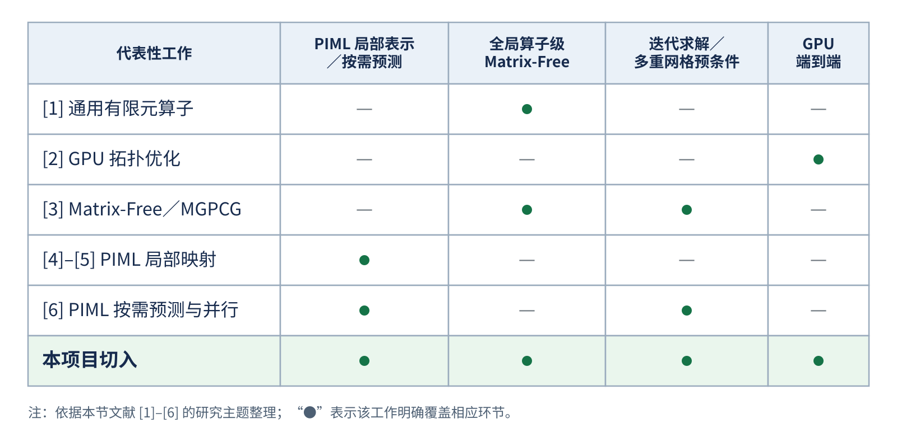
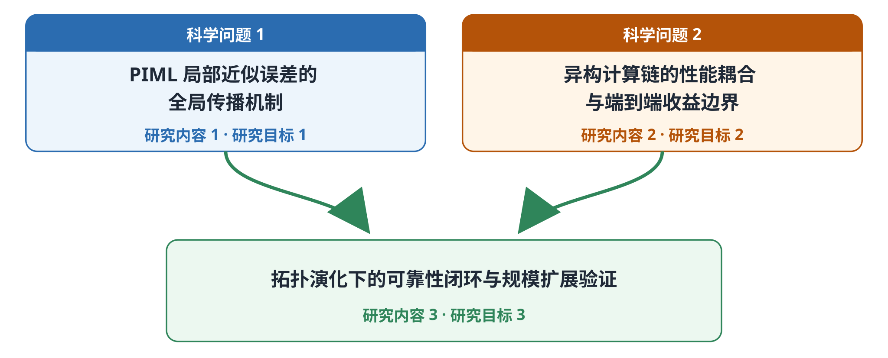
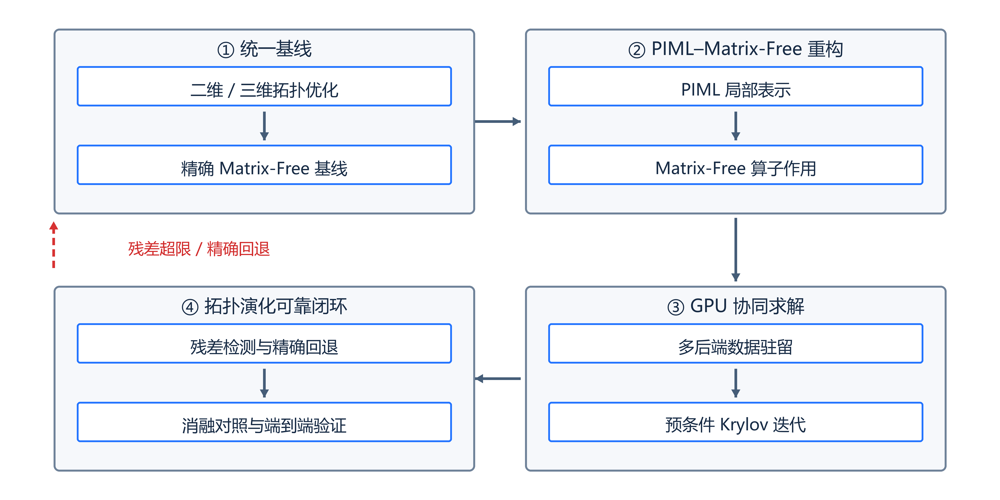
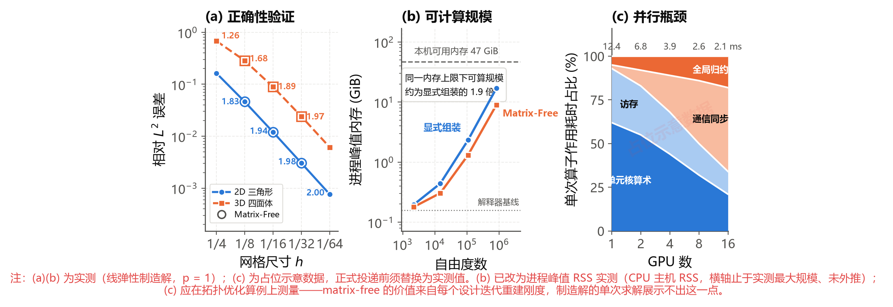
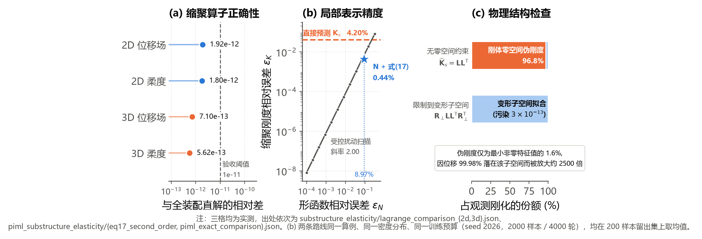
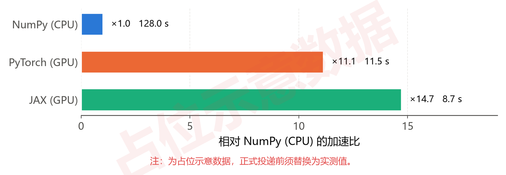

# 中国博士后科学基金第 80 批面上资助申请书正文

> 本页是第 80 批面上资助项目基本科研信息和六部分申请正文的批次表达事实源，栏目顺序与字数限制严格对应《2026 年度中国博士后科学基金资助指南》附录一。项目名称、总体目标、WP1–WP3、两年阶段和科研边界先由 [[../../../piml-matrix-free-gpu/project-plan|博士后核心研究项目计划]] 维护，再按本批评审要求压缩和重组；网站字段状态与上传记录由 [[80th-2026-application-workbook|填报工作底稿]] 维护，资格、时间和流程由 [[80th-2026|申报执行页]] 维护。本页当前只迁移写作骨架与研究要点，不代表完整申请书初稿。

## 一、项目基本信息

| 字段 | 内容 | 状态 |
|---|---|---|
| 项目中文名称 | 面向大规模拓扑优化的 PIML Matrix-Free 求解与 GPU 协同加速方法研究 | **与核心项目计划同步；待系统填写并保存** |
| 项目英文名称 | PIML-Enabled Matrix-Free Solvers and GPU-Coordinated Acceleration for Large-Scale Topology Optimization | **已确认本地写作口径；待系统填写并保存** |
| 项目来源 | 自选 | 建议稿；待系统填写并保存 |
| 关键词 | 大规模拓扑优化，问题无关机器学习，Matrix-Free，Krylov 求解，GPU 加速 | **已确认本地写作口径；待系统填写并保存** |
| 项目所属一级学科 | 力学 | 建议稿；待合作导师或院系确认 |
| 项目所属二级学科 | 固体力学 | 建议稿；待合作导师或院系确认 |
| 学科门类 | 工学 | 预计由系统根据主学科生成；待核对 |
| 交叉一级学科 | 数学 | 建议稿；待合作导师或院系确认 |
| 交叉二级学科 | 计算数学 | 建议稿；待合作导师或院系确认 |

正文首次使用时，将 PIML 写为“问题无关机器学习（Problem-Independent Machine Learning，PIML）”。Matrix-Free 保留英文术语，并在首次出现时说明其指不显式形成全局矩阵的算子作用与 Krylov 求解路径。

## 二、项目信息

> **第 1–5 部分匿名评审警示：** 不得出现申请人姓名、设站单位名称、合作导师姓名或其他可识别申请人身份的信息；违反系统规则可能被评审专家视为故意泄露个人信息并计 0 分。系统完整原文和上传核验由 [[80th-2026-application-workbook#七、匿名与合规检查|填报工作底稿]] 维护。

### 1. 选题依据（国内外研究现状及选题价值，限 1000 字）

**状态：定稿；正文约 954 字，严格匿名，格式与排版已通过官方模板验证，待导师最终审阅。**

#### （一）国内外研究现状与主要不足

随着三维拓扑优化的设计分辨率、迭代步数和自由度规模不断提高，反复有限元分析、灵敏度计算及设计更新需要频繁处理大规模线性系统。传统的全局刚度矩阵显式组装路径面临矩阵形成、存储、访存和线性求解的多重开销；在高分辨率三维问题中，内存容量和数据搬移往往先于浮点计算成为效率瓶颈。因此，如何减少全局矩阵依赖、保持数值可靠性并获得端到端加速，已成为拓扑优化规模扩展的关键问题。

无矩阵（Matrix-Free）方法通过按需完成局部算子作用及全局累加，避免显式形成和存储全局系统矩阵，可与 Krylov 迭代及并行硬件结合，因而为大规模有限元分析提供了重要路径。国际上已形成面向通用有限元的全局算子级 Matrix-Free 计算框架[1]及 GPU 加速三维拓扑优化实现[2]；国内相关研究则发展了面向三维拓扑优化的全局算子级 Matrix-Free 与多重网格预条件共轭梯度（multigrid-preconditioned conjugate gradient，MGPCG）求解策略[3]，围绕可复用局部表示开展探索[4,5]，并将 PIML、并行多重网格与局部多尺度形函数的按需预测相结合[6]。但拓扑演化会持续改变材料分布、局部刚度和预条件子质量；局部算子计算、全局归约、向量迭代、预条件更新以及主机—设备数据搬移之间相互耦合，单次算子加速并不必然转化为完整优化流程的时间和显存收益。

问题无关机器学习（Problem-Independent Machine Learning，PIML）以可复用局部表示降低重复分析成本。以 Huang 等[4] 为例，可学习局部材料分布到连续多尺度形函数的映射，并据此构造缩聚刚度；Guo 等[5] 则学习三次 Bézier 插值边界位移场到内部位移场的映射。然而，本节所引代表性研究尚未在同一框架下将近似局部表示直接用于全局算子级 Matrix-Free 作用，同时系统考察算子性质、预条件 Krylov 迭代收敛、拓扑演化及 GPU 端到端收益。

<b>表 1 代表性研究的覆盖范围与本项目切入点</b>

#### （二）选题价值

本项目将 PIML 可复用局部表示、全局算子级 Matrix-Free 作用和 GPU 协同求解纳入同一计算链，聚焦近似局部表示驱动的全局求解可靠性与端到端效率。科学上，揭示局部误差向全局算子性质、预条件子质量和 Krylov 迭代收敛的传递规律，阐明局部近似与全局求解可靠性之间的内在联系。方法上，形成面向近似局部表示的可诊断、可修正的可靠求解路径，为机器学习代理与经典迭代求解的融合提供方法依据。工程计算上，面向高分辨率三维结构优化中的矩阵存储与跨设备数据搬移约束，提出给定精度和收敛要求下的端到端时间—显存评估方法与协同求解思路；有望在相同硬件资源下扩大可计算问题规模、缩短设计迭代中的反复结构分析时间，为复杂结构轻量化设计提供计算支撑。

**参考文献（GB/T 7714 格式）**

[1] KRONBICHLER M, KORMANN K. A generic interface for parallel cell-based finite element operator application[J]. *Computers & Fluids*, 2012, 63: 135–147. DOI: 10.1016/j.compfluid.2012.04.012.

[2] TRÄFF E A, RYDAHL A, KARLSSON S, et al. Simple and efficient GPU accelerated topology optimisation: Codes and applications[J]. *Computer Methods in Applied Mechanics and Engineering*, 2023, 410: 116043. DOI: 10.1016/j.cma.2023.116043.

[3] ZHOU B, ZHU Z, WANG X. Efficient acceleration strategies for multigrid preconditioned conjugate gradients in fast 3D topology optimization[J]. *Journal of Computational Mathematics*, 2025, 43(5): 1063–1091. DOI: 10.4208/jcm.2508-m2025-0035.

[4] HUANG M, LIU C, GUO Y, et al. A mechanics-based data-free Problem Independent Machine Learning (PIML) model for large-scale structural analysis and design optimization[J]. *Journal of the Mechanics and Physics of Solids*, 2024, 193: 105893. DOI: 10.1016/j.jmps.2024.105893.

[5] GUO Y, LIU C, DU Z, et al. High-generalization AI-enhanced mechanical analysis and topology optimization via cubic Bézier interpolation of substructure boundary displacements[J]. *Computer Methods in Applied Mechanics and Engineering*, 2026, 456: 118955. DOI: 10.1016/j.cma.2026.118955.

[6] MA X, HUANG M, DU Z, et al. A high-performance parallel algorithm based on problem independent machine learning (PIML) for large-scale topology optimization[J]. *Acta Mechanica Sinica*, 2026, 42: 425942. DOI: 10.1007/s10409-025-25942-x.

### 2. 研究内容（研究对象，拟解决的关键科学问题，研究目标，限 2000 字）

**状态：定稿；已与第 1 部分的研究主线、术语和论证边界对齐，并补充理论依据与研究内容关系图，严格匿名，待导师最终审阅。**

#### （一）研究对象

本项目研究对象为二维、三维线弹性拓扑优化中的反复结构分析，具体化为支撑拓扑设计演化的局部—全局计算链：局部层面研究 PIML 可复用局部力学表示（多尺度形函数、静力缩聚算子等）的学习、结构保持与误差控制；全局层面研究由近似局部表示驱动的全局算子级 Matrix-Free 作用，并以精确 Matrix-Free 作用提供真残差复核与校正基准，使主算子路径不显式形成和存储全局系统矩阵；执行层面研究局部预测、算子作用、向量归约与预条件在 GPU 上的端到端协同。对象覆盖用于机理剖析的二维受控算例，以及面向规模扩展的三维高分辨率算例。

#### （二）拟解决的关键科学问题

1. **PIML 局部近似误差向全局算子性质与预条件 Krylov 收敛的传播机制。**PIML 局部表示的近似误差经自由度限制与延拓、局部作用和全局累加形成全局算子扰动。如何刻画局部算子的刚体模态零空间与半正定结构在近似和累加中的保持或破坏，揭示局部算子扰动对约束后全局算子对称正定性、谱性质、预条件子质量及 Krylov 迭代收敛的影响，并建立局部作用误差、由精确 Matrix-Free 算子复核的真残差与预条件 Krylov 收敛之间的定量联系，是首要科学问题。
2. **PIML–Matrix-Free–Krylov GPU 异构计算链的性能耦合机理与端到端收益边界。**GPU 上的局部预测和算子作用与访存、全局累加、向量归约、预条件、数据搬移和同步相互制约；拓扑演化又会改变表示复用率、精确回退比例、预条件子质量和迭代次数。如何揭示上述因素对完整优化流程时间与峰值显存的耦合机理，建立局部加速、迭代增长与回退开销之间的量化关系，并确定不同问题规模和硬件资源下端到端收益的形成条件，是另一关键科学问题。

#### （三）主要研究内容

针对上述两个关键科学问题设置三项研究内容：前两项分别研究可靠求解与端到端收益，第三项形成拓扑演化下的动态闭环与规模验证。

1. **PIML 局部表示驱动的全局算子级 Matrix-Free 作用与可靠 Krylov 求解。**建立精确组装、精确 Matrix-Free、PIML 近似组装和 PIML 近似 Matrix-Free 四类路径的统一参考体系。以 PIML 生成的可复用局部力学表示及其诱导的局部算子作用为对象，建立不同表示向全局算子级 Matrix-Free 作用转化的统一接口；以精确局部算子作用为基准定义近似作用误差，分析局部算子结构及误差经自由度映射和全局累加后的传递规律。在此基础上，研究以精确 Matrix-Free 算子复核的真残差为判据的自适应精度控制、局部精确回退、缺陷校正和预条件更新方法。重点量化局部作用误差幅值与刚体模态污染、对称正定性偏离、真残差偏差及迭代增长之间的响应关系，据此确定自适应精度控制、精确回退与预条件更新阈值，形成表示无关、可诊断、可修正的可靠求解路径。
2. **PIML–Matrix-Free–Krylov 异构计算链的 GPU 协同与性能建模。**研究局部特征构造、批量预测、局部作用、全局累加、向量归约和预条件之间的数据依赖与执行耦合，探索表示缓存、按需重算和算子融合的时间—显存权衡。从算术强度、计算峰值与内存带宽的约束关系出发，建立包含计算吞吐、访存、数据搬移、同步、表示复用、精确回退和迭代增长的性能模型，分解离线训练、在线预测、单次求解和完整优化流程成本。进一步以问题规模、局部表示类型、表示复用率、精确回退比例和硬件资源为变量，构建缓存、重算与融合策略的分区图谱，给出不同场景下兼顾端到端加速与显存节省的策略区间，明确主要瓶颈与收益边界。
3. **拓扑演化下的可靠性闭环与规模扩展验证。**研究局部材料分布演化对 PIML 预测有效性、局部算子结构保持和预条件子质量的影响，将结构检查、分布外识别、误差指示、精确回退、缺陷校正及预条件更新组织为随拓扑演化动态触发的闭环。以材料分布变化幅度、分布外程度和精确回退比例为控制变量，识别可靠性闭环的触发阈值、稳定区间与失效边界。采用逐层消融对照，在二维机理算例和三维规模算例中比较四类路径的位移、柔顺度与灵敏度误差、Krylov 收敛、完整优化流程时间和峰值显存，界定可靠且具有端到端收益的适用范围。

#### （四）研究目标

1. 建立表示无关的 PIML–Matrix-Free 可靠求解方法，阐明局部作用误差对全局算子性质、预条件子质量与 Krylov 收敛的影响规律，形成自适应精度控制、精确回退和预条件更新准则。
2. 建立 GPU 协同执行与端到端时间—显存性能模型，形成缓存、重算与算子融合的策略分区，明确不同问题规模和硬件资源下的主要瓶颈与收益边界。
3. 形成拓扑演化下的动态可靠性闭环，明确其触发条件、稳定区间和适用边界，并在百万级以上自由度的三维问题中验证精度、收敛性和规模扩展能力。

<b>图 1 关键科学问题、研究内容与研究目标的对应关系</b>

> **草稿核验资料（不导出至申请书）**
>
> - 官方栏目、匿名要求与字数限制：[[80th-2026|第 80 批申报执行页]]；《2026 年度中国博士后科学基金资助指南》附录一。当前正文去除 Markdown 标记、空白和图片链接后约 1950 个字符，低于 2000 字提示；最终计数以导入 Word 后的系统口径为准。
> - 项目题目、工作包与阶段目标：[[../../../piml-matrix-free-gpu/project-plan|博士后核心研究项目计划]]（WP1 算子机理、WP2 GPU 协同建模、WP3 演化自适应与规模消融）。
> - 图 1 状态：正式图形源文件及 Markdown 引用统一为 `assets/图1-关键科学问题-研究内容-研究目标对应关系.svg`（2400×970 viewBox）；正式 DOCX 中仍需按实际插入宽度复核显示效果。

### 3. 研究方案（限 2000 字）

**状态：定稿；已按“统一基线—PIML–Matrix-Free 重构—多后端与 GPU 并行求解—拓扑演化可靠闭环”组织，严格匿名，待导师最终审阅。**

#### （一）总体思路与技术路线

针对大规模拓扑优化中反复结构分析的矩阵装配、存储与求解瓶颈，采用“统一基线—PIML–Matrix-Free 重构—多后端与 GPU 并行求解—拓扑演化可靠闭环”的递进路线。依托统一多后端计算架构（NumPy/PyTorch/JAX 等），先在统一问题与接口下分别建立并验证精确 Matrix-Free 基线和 PIML 局部预测，再研究二者融合及 GPU 细粒度并行协同，避免把局部预测、单次算子作用或单个 GPU kernel 的结果直接外推为完整优化收益。

<b>图 2 PIML–Matrix-Free 求解与 GPU 协同加速总体技术路线图</b>

#### （二）具体研究方法与实施方案

1. **建立统一基线与局部表示接口。**选取二维、三维线弹性结构分析与密度型拓扑优化算例，统一有限元离散、材料插值、载荷、边界条件、优化参数和停止准则。在可承受规模构造全尺度精确组装参考解，在规模算例中采用已通过一致性验证的精确 Matrix-Free 基线；建立精确组装、精确 Matrix-Free、PIML 组装式和 PIML Matrix-Free 四类对照路径。依托统一多后端张量与算子抽象，以相同的局部材料分布与下游任务，客观评价面向粗网格单元与局部子结构的多尺度形函数、缩聚刚度等候选局部表示。统一局部特征提取、预测推理、结构检查、自由度映射与精确回退接口，规定对称性、半正定或正定性、刚体模态及能量一致性等必要物理约束。候选表示共享统一数据划分与测试基准，系统核算真值生成、离线训练与在线部署的全流程计算成本。

2. **构造 Matrix-Free 全局作用与预条件 Krylov 求解。**设 $\mathbf G_j$ 为第 $j$ 个局部区域的自由度限制算子，$\widehat{\mathbf A}_j$ 为候选 PIML 预测的局部算子，则全局算子作用定义为

$$
\widehat{\mathbf y}=\widehat{\mathbf A}\mathbf x
=\sum_j\mathbf G_j^{\mathsf T}\widehat{\mathbf A}_j\mathbf G_j\mathbf x,
$$

计算时依次执行自由度限制、局部算子作用和延拓累加，彻底消除全局系统矩阵的显式装配与存储开销。先以精确局部算子 $\mathbf A_j$ 验证 Matrix-Free 与精确组装在残差和位移响应上的一致性；再引入 PIML 近似算子 $\widehat{\mathbf A}_j$，系统分析局部扰动向全局算子对称正定性、谱半径及条件数 $\kappa(\widehat{\mathbf A})$ 的传播规律。求解中采用双残差监控机制：记录 Krylov 内部递推残差的同时，调用精确 Matrix-Free 算子复核物理平衡残差，杜绝近似算子假收敛；根据算子扰动特性适配 PCG、GMRES 及 Flexible Krylov 算法。构建“主算子 Matrix-Free 高频乘积 + 代理预条件子低频更新/复用”的混合机制，量化分析预条件子重建频率对迭代步数、内存峰值与端到端求解时间的综合影响。

3. **设计 PIML–Matrix-Free–Krylov 的多后端数据流与 GPU 并行协同。**依托统一多后端计算接口，围绕“局部特征构造—批量预测—局部作用—全局累加—预条件迭代”构建端到端设备驻留与执行流水线，按局部区域类型与边界约束状态组织分组批处理与尾批次对齐。系统对比三种执行机制：预测并缓存局部表示、按需即时预测、以及预测—局部算子融合 Kernel（利用片上共享内存消除中间搬移），研究显存缓存—重算平衡与工作区复用。在 GPU 上端到端闭环执行 Krylov 向量运算、全局归约与预条件，最大限度避免主机—设备间数据搬移与同步阻塞。建立综合考虑计算吞吐、访存带宽、通信延迟及迭代增长的“时间—显存”性能模型，定量识别端到端加速收益边界。基准测试中统一精度标准、硬件环境、预热与同步机制，科学评估算法与硬件异构的综合效能。

4. **建立拓扑演化下的可靠性机制并开展规模验证。**针对拓扑演化引起的预测失效与算子退化，构建“动态检测 $\rightarrow$ 局部精确回退 $\rightarrow$ 预条件子自适应更新”的可靠性闭环：实时监测局部材料分布演化、分布外状态、物理守恒性、真残差与预条件子质量；对异常区域即时切换为局部精确力学计算，对迭代收敛迟滞阶段自适应重建预条件子。采用逐层消融方式，在严格统一离散尺度、优化参数、停止准则与硬件环境下，横向对比精确组装、精确 Matrix-Free、PIML 组装式、PIML Matrix-Free 与 GPU 协同各路径。利用二维算例深入剖析受控扰动下的误差传播与 Krylov 收敛机理；基于三维典型工况开展百万至亿级自由度完整拓扑优化验证，全面统计局部误差、真残差、迭代数、位移/柔顺度/灵敏度精度、端到端时间与峰值显存。若局部加速收益被迭代增长抵消，则通过动态调节回退比例与预条件策略，科学界定本方法的可靠适用边界。

### 4. 特色与创新之处（限 1000 字）

**状态：定稿；已按“理论机理创新—计算协同创新—可靠性机制创新”组织，严格匿名，待导师最终审阅。**

本项目的特色不在于将 PIML、Matrix-Free 与 GPU 简单拼凑，而在于围绕大规模拓扑优化中反复结构分析的算力与显存瓶颈，形成由“全局求解重构 $\rightarrow$ 局部异构执行 $\rightarrow$ 全链可靠闭环”的递进创新体系：

#### （一）理论机理创新：PIML–Matrix-Free 全局求解重构与谱扰动分析

针对现有 PIML 仍需显式组装全局粗网格矩阵的局限，将局部物理代理直接转化为 Matrix-Free 算子的按需作用，通过自由度限制与延拓累加彻底消除全局系统矩阵的显式装配与存储。不仅对比不同候选局部表示，更深入揭示局部预测误差向全局算子对称正定性、谱半径及条件数 $\kappa(\widehat{\mathbf A})$ 的传播规律，建立双残差复核与相适配的 Krylov/预条件求解机制，使 PIML 由孤立的局部表示预测延伸至严格可控的全局数值求解。

#### （二）计算协同创新：多后端数据流与 GPU 片上算子融合并行加速

针对大规模拓扑优化中局部区域类型不一及演化状态各异的特点，在统一多后端架构下构建端到端设备驻留流水线，提出针对复杂边界与有效自由度维度的“分组批处理与尾批次对齐”调度机制。系统探索预测缓存、即时重算与片上共享内存融合 Kernel 的显存—算力权衡，实现 Krylov 向量运算与全局归约在 GPU 上全闭环执行，最大限度避免主机—设备间不必要的数据搬移与同步阻塞。

#### （三）可靠性机制创新：全链自适应回退闭环与规模扩展收益边界界定

针对拓扑演化引起的分布外预测失效与算子退化难题，构建“动态监测 $\rightarrow$ 局部精确力学回退 $\rightarrow$ 预条件自适应更新”的可靠性闭环，杜绝近似算子假收敛并彻底兜底物理精度。在全同软硬件口径下开展逐层消融，通过二维机理剖析与三维百万至亿级自由度完整拓扑优化验证，建立“时间—显存”性能模型并科学界定端到端加速的可靠适用边界。

### 5. 研究计划及预期成果（限 500 字）

**状态：定稿；正文精确统计为 445 纯字符（全文本含标点与数字 472 字），严格匿名，满足 500 字限制，待导师审阅。**

#### （一）研究计划与进度安排

0—6个月：构建精确组装与精确 Matrix-Free/GPU 基线，确立基准算例，完成 PIML 局部表示接口与数据集准备。

6—12个月：完成 PIML 局部力学表示预测、物理结构检查与分布外识别，构建 GPU 批量推理与局部执行原型。

12—18个月：基于前两阶段基线与局部原型，完成 PIML–Matrix-Free 全局算子作用与 GPU 异构数据流，凝练阶段成果并撰写学术论文。

18—24个月：开展二维、三维结构分析与拓扑优化的全流程消融对比，综合评价性能与并行扩展性并界定适用范围，完成论文发表与成果总结。

#### （二）预期研究成果

1. **理论与方法成果：**建立 PIML 驱动的 Matrix-Free 全局求解与 GPU/并行协同加速框架，揭示局部误差传播与 Krylov 收敛机制，在计算力学/科学计算权威期刊发表或投稿高水平学术论文 2–3 篇；
2. **测试集与性能证据：**建立二维/三维拓扑优化标准测试集，形成覆盖精度、迭代收敛、完整时间、显存峰值与并行扩展性的可复核测试证据及适用边界说明；
3. **软件与算法原型：**依托开源科学计算平台，开发包含 Matrix-Free 算子作用、PIML 局部预测与 GPU 协同求解的可复用算法原型与软件模块，形成面向自主工业结构仿真与拓扑优化软件的底层求解加速内核，支撑成果向国产工业软件沉淀转化。

### 6. 研究基础（限 1000 字）

**状态：第八稿；按官方“研究基础”三项要求统一三级小标题（#### （一）...（二）...（三）...），与第 1–5 部分排版层级完全对齐。正文段落约 850 纯字符（含标点约 915 字），满足 1000 字上限。**

#### （一）与本项目相关的研究工作积累和成绩

1. **Matrix-Free 算子设计、Krylov 求解与 GPU 并行基础：**
申请人在工程计算软件研发中承担线弹性 Matrix-Free 算子、并行 Krylov 求解与 GPU 加速研发，完成了局部算子构造、全局按需作用、分布式自由度归约与求解器集成，具备从有限元离散到 GPU 并行实现的系统经验。

2. **PIML 局部力学表示与精确缩聚验证基础：**
申请人构建了基于子结构静力缩聚（Schur 补）与多尺度形函数的 2D/3D 线性力学求解器，验证了缩聚位移恢复与有限元直解在 `1e-12` 量级的代数等价；在此基础上实现了覆盖粗单元与子结构两种载体、预测多尺度形函数与直接预测缩聚刚度两条路线的 PIML 端到端计算链，并在同一算例、同一训练预算下完成两条路线的消融对比，为本项目的训练数据生成、物理结构检查、分布外识别与局部精确回退提供了真值接口。

3. **基于 FEALPy 的拓扑优化平台与多后端计算基础：**
上述算法均依托申请人基于 FEALPy 开源库自主研发的拓扑优化软件平台实现。该平台在博士阶段依托湘潭大学、湖南国家应用数学中心及湖南韶峰应用数学研究院研发，实现了张量化有限元与多后端计算（NumPy/PyTorch/JAX），成果已沉淀为论文与软件著作权，为本项目提供了数据布局、算子接口与可复用模块的载体。

<b>图 3 Matrix-Free 算子的正确性、可计算规模与并行瓶颈</b>

> **图 3 说明：** 对应一、中第 1 点，三格依次回答离散是否正确、同一硬件上能求解多大规模、并行开销瓶颈何在。**(a)** 曲线为显式组装（CSR，稀疏直接解）在 2D 平面应变三角形网格与 3D 四面体网格上的相对 `L²` 误差：两个维度各五档加密（`h` 从 1/4 到 1/64，最细档 2D 8,450、3D 823,875 自由度）。观测阶单调趋近 P1 理论阶 2（2D 1.83→1.94→1.98→2.00，3D 1.26→1.68→1.89→1.97），末段的 2.00（精确值 1.995）与 1.97 通过门禁（下限 1.5），说明离散本身正确；空心环标出 Matrix-Free（不形成全局稀疏矩阵，算子作用逐单元完成）与显式组装重合的三档（`h` = 1/8、1/16、1/32），两条实现路径在图面上落于同一条曲线，其解的相对差为 `5e-13`（2D）与 `4e-14`（3D，比对档 2D 162、3D 2,187 自由度），处于机器精度量级——Matrix-Free 复现了参考路径的解，两条实现路径表示同一个离散算子；两个维度最细一档均无 Matrix-Free 对照，该链目前止于 `h=1/32`；**(b)** 同一套 3D 四面体 P1 算例上两条路径的**进程峰值内存**（`ru_maxrss` 高水位，一个进程只建一个算子层级）随自由度数的增长，四档 `n = 8…64`（至 823,875 自由度），横轴止于实测最大规模、未外推；虚线为本机可用内存 47 GiB，点线为解释器与库导入的基线 0.158 GiB。扣掉基线后 Matrix-Free 的峰值稳定在显式组装的约 1/1.9（四档 1.74→1.93→1.88→1.91），且两条曲线的扣基线内存对自由度均为线性（拟合指数 1.016 与 1.018），因此"同一内存上限下可算规模约为显式组装的 1.9 倍"是内插性质的结论、不依赖外推。该优势来自**不物化全局 COO/CSR**：显式组装在 `n=64` 的 17.02 GiB 峰值中约 95% 是组装瞬态，最终保留的 CSR 只有 0.81 GiB；Matrix-Free 缓存的单元刚度阵反而是 CSR 的 2.3 倍，所以它省的不是"存得少"。该测量为 **CPU 主机 RSS，不是 GPU 显存**；"少存多少、多算多少"的取舍属研究内容 2 的研究问题；**(c)** 单次算子作用的耗时构成随设备数的变化：单元核算术占比从 62% 降到 21%，通信同步从 2% 升到 48%，绝对耗时的下降随之趋缓。瓶颈因此被定位在同步与访存而非算术——这正是本项目研究内容 1（GPU 单元核与多卡扩展）与研究内容 2（存储策略取舍）的出发点。

<b>图 4 PIML 局部表示的缩聚算子正确性、代理精度与物理结构检查</b>

> **图 4 说明：** 对应一、中第 2 点，三格依次回答真值是否可信、两条候选局部表示孰优、精度靠什么保证。**(a)** 静力缩聚求解（接口缩聚 + 内部回填）与 Lagrange 全装配直解在同一离散上的相对差：2D 半 MBB 梁（`6×2` 子结构 × `5×5` 细网格，682 自由度）位移场 `1.9e-12`、柔度 `1.8e-12`，3D 全 MBB 梁（`6×2×2` × `4×4×4`，6,075 自由度）为 `7.1e-13` 与 `5.6e-13`，均低于验收阈值 `1e-11` 一个量级以上——二者是同一离散的两种解法，其差只应是浮点累积，这是 PIML 代理的真值前提；**(b)** 两条候选局部表示在同一算例（全 MBB 梁，`12×2` 子结构 × `5×5` 细网格）、同一密度分布与同一训练预算下的缩聚刚度相对误差：直接预测缩聚刚度为 `4.20%`（橙色虚线），而预测多尺度形函数 $\mathbf{N}$ 再由缩聚恒等式回推缩聚刚度仅 `0.44%`（蓝色星号），尽管其形函数自身误差高达 `8.97%`。机理由受控扰动扫描给出：一阶项因 $\mathbf{K}_{ii}\mathbf{N}^{*}=-\mathbf{K}_{ib}$ 逐项抵消，误差退化为 $\mathbf{E}^{\mathsf T}\mathbf{K}_{ii}\mathbf{E}$，实测 log-log 斜率 `2.00`，跨七个量级严格二阶；该误差阵半正定，故缩聚刚度只被高估、结构柔度只被低估，实测柔度落在精确解的偏保守一侧（`312.49` 对 `313.11`），而直接预测路线落在相反一侧，即能量不一致；**(c)** 精度为何不能只看范数：自由漂浮子结构的缩聚刚度以刚体模态为精确零空间，严格正定的参数化必然向该子空间注入伪刚度，实测伪刚度仅为最小非零特征值的 `1.6%`，却因接口位移 `99.98%` 落在该子空间而被平方量级放大约 `2500` 倍，占观测刚化的 `96.8%`；把预测限制到刚体模态的正交补上后该份额降至 `3e-13`。近奇异局部算子必须按零空间、正（半）定性与能量一致性检查——这正是研究内容 1 的结构保持与研究内容 3 的物理结构检查、局部精确回退的出发点。

<b>图 5 FEALPy 多后端同题加速比</b>

> **图 5 说明：** 对应一、中第 3 点。同一拓扑优化算例在 FEALPy 平台 NumPy/PyTorch/JAX 三种后端上的单步装配 + 求解耗时，条长为相对 NumPy（CPU）的加速比，条端同时标注绝对耗时。

#### （二）已具备的科研条件、尚缺少的条件及拟解决途径

**已具备的科研条件：** 博士后阶段依托**郭旭院士团队**与**大连工业软件创新发展研究院**，团队在计算力学、拓扑优化与大规模并行计算领域积累深厚，研究院具备真实工业场景、自主工业软件基础与高性能算力集群。

**尚缺少的科研条件及拟解决途径：** 现有 PIML 与 Matrix-Free 验证仍集中在 CPU 端、百万自由度以内，尚缺 GPU 上的 PIML 推理—求解一体化实现、十亿（1e9）自由度级算例与工业级基准工况。拟依托设站单位 GPU 集群完成局部预测算子的 GPU 移植与多卡扩展，并通过下述在研任务获取工业级模型与工况，按 1e7→1e8→1e9 逐级验证。

#### （三）正在承担的与本项目相关的科研项目

申请人正在承担湘潭大学魏华祎教授团队与**大连工业软件创新发展研究院**的合作研发任务，面向研究院自主工业仿真软件开展求解器性能调优与异构并行计算，本人负责"单元计算性能优化与 Matrix-Free"分项，节点为 2026 年底打通 Matrix-Free 有限元全流程，现已完成源码环境搭建、端到端算例验证与 PETSc KSP 最小求解闭环。该任务面向既有求解器提速，与本项目的求解范式重构互不重复，并可提供工业级模型与真实软件栈的验证出口。

## 三、正文版本与核验边界

- 本页可以适配第 80 批的栏目、字数和评审口径，但不得反向修改核心项目的长期目标、工作包或项目状态；科研范围变化先更新核心项目计划。
- 第 1–5 部分对应系统中的“项目信息（1–5 部分）”DOCX，必须完全匿名，并遵守本页“二、项目信息”开头的匿名评审警示。
- 第 6 部分对应独立的“项目信息（6、研究基础部分）”DOCX，属于系统匿名限制的例外栏目，但只写支撑本项目所必需且可核验的研究基础信息，不扩大披露范围。
- 字数按中文字符口径在正式填报前重新统计；本页的标题、状态、写作提示和列表编号不计入拟提交正文。
- 正式 DOCX 的生成、编辑、上传和版本状态只在 [[80th-2026-application-workbook|填报工作底稿]] 中记录。
