# 中国博士后科学基金第 80 批面上资助申请书正文

> 本页是第 80 批面上资助项目基本科研信息和六部分申请正文的批次表达事实源，栏目顺序与字数限制严格对应《2026 年度中国博士后科学基金资助指南》附录一。项目名称、总体目标、三条推进线、科研边界与两年阶段口径先由 [[../../../piml-matrix-free-gpu/project-plan|博士后核心研究项目计划]] 维护，再按本批评审要求压缩和重组；代表性成果的著录与作者位次由 [[../../publications-ledger|代表性成果台账]] 维护，系统字段、文件上传与匿名口径由 [[../../china-postdoctoral-science-foundation-2026-guide-notes#系统填报口径|指南要点页]] 维护，资格、时间和流程由 [[80th-2026|申报执行页]] 维护。本页当前只迁移写作骨架与研究要点，不代表完整申请书初稿。

## 一、项目基本信息

| 字段       | 内容                                                                                                                             |
| -------- | ------------------------------------------------------------------------------------------------------------------------------ |
| 项目中文名称   | 基于问题无关机器学习的大规模拓扑优化无矩阵求解与 GPU 加速研究                                                                                              |
| 项目英文名称   | Problem-Independent Machine Learning-Based Matrix-Free Solvers with GPU Acceleration for Large-Scale Topology Optimization  |
| 项目来源     | 合作导师项目                                                                                                                         |
| 关键词      | 大规模拓扑优化，问题无关机器学习，无矩阵方法，Krylov 迭代，GPU 协同加速                                                                                      |
| 项目所属一级学科 | 力学                                                                                                                             |
| 项目所属二级学科 | 固体力学                                                                                                                           |
| 学科门类     | 工学                                                                                                                             |
| 交叉一级学科   | 数学                                                                                                                             |
| 交叉二级学科   | 计算数学                                                                                                                           |

## 二、项目信息

> **第 1–5 部分匿名评审警示：** 不得出现申请人姓名、设站单位名称、合作导师姓名或其他可识别申请人身份的信息；违反系统规则可能被评审专家视为故意泄露个人信息并计 0 分。系统完整原文见 [[../../china-postdoctoral-science-foundation-2026-guide-notes#匿名规则（系统原文）|指南要点页「匿名规则」]]。

### 1. 选题依据（国内外研究现状及选题价值，限 1000 字）

**状态：已与 DOCX 逐字符同步（含陈春雨批注定稿修改、长难句拆分与六处零损失压缩）。待办：正文去空白 1657 字符（汉字 1339），超「限 1000 字」需压缩，官方计数口径待确认；文末参考文献另占 1936 字符。严格匿名，待导师最终审阅。**

#### （一）国内外研究现状与主要不足

拓扑优化能够在给定载荷与约束条件下自动寻找材料的最优布局，是航空航天、运载装备等领域结构轻量化与创新构型设计的先进设计范式[1,2]，已在重大装备研制中获得广泛应用[3,4]（图 1）。然而，随着工程结构向大规模、高分辨率方向发展，拓扑优化的计算量急剧增长：每一轮设计迭代都需完成一次结构分析，对应一次大规模线性方程组求解，而完整优化通常需要数百轮迭代。传统方法需显式组装并存储全局刚度矩阵，其计算与存储开销随问题规模迅速增长，往往先于浮点运算能力制约可求解规模与求解效率，成为长期制约拓扑优化走向大规模工程应用的核心瓶颈。因此，如何在避免全局矩阵组装与存储的前提下保持数值可靠性并获得实质加速，是突破上述瓶颈、支撑大规模拓扑优化工程应用的关键。

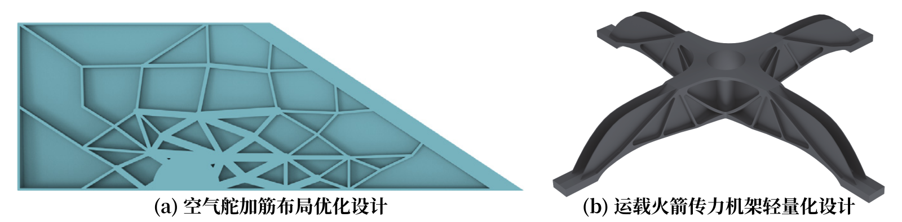

<b>图 1 拓扑优化在航空航天结构轻量化设计中的典型应用</b>

问题无关机器学习（Problem-Independent Machine Learning，PIML）为降低上述反复结构分析的成本提供了新思路：其离线学习局部材料分布到局部力学表示的映射，训练一次即可跨问题复用，无需针对特定问题在线采样与重训练。沿此思路，已有研究从早期探索局部多尺度形函数映射出发，相继发展了基于物理力学的无数据（Data-Free）PIML 模型以构造连续缩聚刚度[5]、学习边界位移场到内部位移场的 Bézier 恢复映射[6]，并将 PIML 与并行多重网格相结合，在 CPU 集群上完成了数十亿单元规模的拓扑优化设计[7]（图 2）。然而，PIML 在支撑更大规模、更高效率的求解上仍有三方面问题尚未解决：其一，现有方法中 PIML 预测的缩聚刚度等局部表示仍以显式组装方式形成全局矩阵参与求解，矩阵组装与存储的瓶颈仅被缓解而未被消除；其二，预测的局部表示带有近似误差，该误差经全局累加后对全局算子对称正定性、谱性质及预条件 Krylov 迭代收敛性的影响缺乏系统研究，数值可靠性尚无保障机制；其三，现有实现主要面向 CPU 并行环境，PIML 批量预测的高吞吐特性与 GPU 算力尚未结合，端到端加速收益未知。

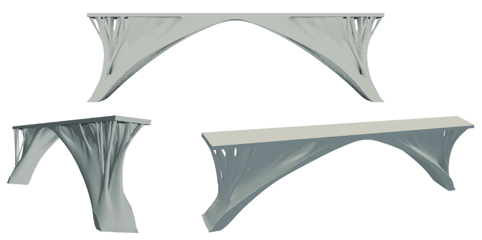

<b>图 2 大规模拓扑优化设计结果示例：类桥梁结构优化设计（约 33.2 亿单元）</b>

与此同时，GPU 软硬件生态已发展成熟，算力易于获取，已成为大规模科学计算的主流算力平台，尤其擅长大批量同构计算；无矩阵（Matrix-Free）方法按需完成局部算子作用与全局累加，避免显式形成和存储全局系统矩阵：国际上已提出面向通用有限元的并行 Matrix-Free 算子应用接口[8]并实现了 GPU 加速的三维拓扑优化[9]，国内也发展了除最粗网格外采用 Matrix-Free 的多重网格预条件共轭梯度（MGPCG）求解策略[10]。这为补齐 PIML 的短板提供了直接路径：Matrix-Free 与 PIML“按需预测局部表示”天然契合，预测的局部表示可直接参与全局算子作用而无需组装缩聚全局矩阵，组装与存储瓶颈由“缓解”变为“消除”；而 PIML 的批量预测与内部位移批量回带正是 GPU 擅长的高吞吐运算，二者优势在 GPU 上结合，有望使计算效率获得量级提升。但拓扑演化持续改变材料分布与预条件子有效性，算子作用、Krylov 迭代、预条件子更新与主机—设备数据搬移相互耦合，单环节加速并不必然带来完整优化流程总时间与峰值显存的改善，结合的可行性与收益条件均缺乏系统研究（表 1）。为此，本项目拟将 PIML 预测的局部表示引入 Matrix-Free 求解流程，研究拓扑演化下的可靠求解算法与面向 GPU 的协同加速方法。

<b>表 1 代表性研究的覆盖范围与本项目切入点</b>

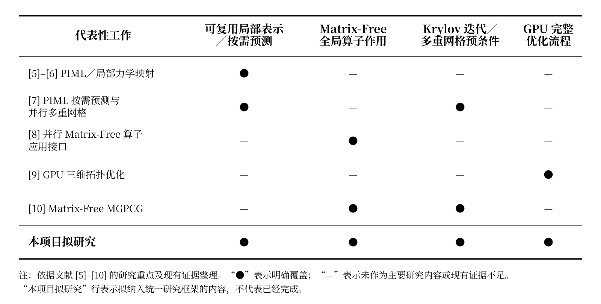

#### （二）选题价值

本项目面向大规模拓扑优化中计算量急剧增长、全局矩阵组装与存储瓶颈长期未获解决的关键问题，发展将 PIML 可复用局部预测与 Matrix-Free 求解相融合、并在 GPU 上协同加速的高效可靠求解方法，重点回答两个问题：PIML 预测误差如何影响求解的可靠性，以及预测、算子作用与迭代求解在 GPU 上如何协同才能获得端到端加速。

预期达到两方面目标：一是形成数值可靠、无需组装和存储全局矩阵的求解方法，在易于获取的 GPU 硬件上实现完整优化流程的实质加速与显存占用的显著降低；二是破解三维拓扑优化的大规模计算难题，在相同硬件资源下显著扩大可求解问题规模，为新一代载人飞船、大推力火箭发动机等重大装备整机整件的轻量化设计提供高效计算支撑。

**参考文献（GB/T 7714 格式）**

[1] BENDSØE M P, KIKUCHI N. Generating optimal topologies in structural design using a homogenization method[J]. *Computer Methods in Applied Mechanics and Engineering*, 1988, 71(2): 197–224. DOI: 10.1016/0045-7825(88)90086-2.

[2] SIGMUND O, MAUTE K. Topology optimization approaches: A comparative review[J]. *Structural and Multidisciplinary Optimization*, 2013, 48(6): 1031–1055. DOI: 10.1007/s00158-013-0978-6.

[3] JIA Y, MENG W, DU Z, et al. Explicit design optimization of air rudders for maximizing stiffness and fundamental frequency[J]. *Thin-Walled Structures*, 2024, 203: 112152. DOI: 10.1016/j.tws.2024.112152.

[4] 李佳霖, 赵剑, 孙直, 等. 基于移动可变形组件法（MMC）的运载火箭传力机架结构的轻量化设计[J]. 力学学报, 2022, 54(1): 244–251. DOI: 10.6052/0459-1879-21-309.

[5] HUANG M, LIU C, GUO Y, et al. A mechanics-based data-free Problem Independent Machine Learning (PIML) model for large-scale structural analysis and design optimization[J]. *Journal of the Mechanics and Physics of Solids*, 2024, 193: 105893. DOI: 10.1016/j.jmps.2024.105893.

[6] GUO Y, LIU C, DU Z, et al. High-generalization AI-enhanced mechanical analysis and topology optimization via cubic Bézier interpolation of substructure boundary displacements[J]. *Computer Methods in Applied Mechanics and Engineering*, 2026, 456: 118955. DOI: 10.1016/j.cma.2026.118955.

[7] MA X, HUANG M, DU Z, et al. A high-performance parallel algorithm based on problem independent machine learning (PIML) for large-scale topology optimization[J]. *Acta Mechanica Sinica*, 2026, 42: 425942. DOI: 10.1007/s10409-025-25942-x.

[8] KRONBICHLER M, KORMANN K. A generic interface for parallel cell-based finite element operator application[J]. *Computers & Fluids*, 2012, 63: 135–147. DOI: 10.1016/j.compfluid.2012.04.012.

[9] TRÄFF E A, RYDAHL A, KARLSSON S, et al. Simple and efficient GPU accelerated topology optimisation: Codes and applications[J]. *Computer Methods in Applied Mechanics and Engineering*, 2023, 410: 116043. DOI: 10.1016/j.cma.2023.116043.

[10] ZHOU B, ZHU Z, WANG X. Efficient acceleration strategies for multigrid preconditioned conjugate gradients in fast 3D topology optimization[J]. *Journal of Computational Mathematics*, 2025, 43(5): 1063–1091. DOI: 10.4208/jcm.2508-m2025-0035.

### 2. 研究内容（研究对象，拟解决的关键科学问题，研究目标，限 2000 字）

**状态：已与 DOCX 逐字符同步。按刘畅意见「文字做减法、图做加法」重构（二）（三）（四）：图文节点互锁，解耦科学问题／研究内容／研究目标，四路径数学展开下沉至第 3 部分。约 1450 字符，远低于 2000 字限。严格匿名，待导师最终审阅。**

#### （一）研究对象

本项目以大规模拓扑优化中的反复结构分析为研究对象，具体包括三类对象：一是 PIML 预测的可复用局部力学表示（多尺度形函数、静力缩聚算子等）及其诱导的局部算子；二是由近似局部表示驱动的 Matrix-Free 全局算子及相应的预条件 Krylov 求解过程；三是 PIML 批量预测、Matrix-Free 算子作用与迭代求解在 GPU 上构成的异构计算链（图 3）。研究对象覆盖从用于机理剖析的受控算例到面向工程应用的大规模高分辨率算例。

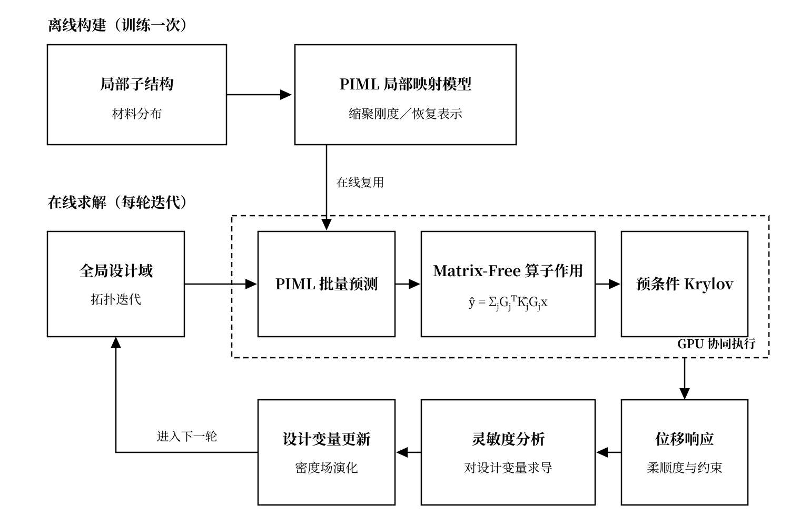

<b>图 3 基于 PIML 的可复用局部表示与 Matrix-Free/GPU 协同求解示意</b>

#### （二）拟解决的关键科学问题

1. **PIML 局部近似误差向全局算子性质与预条件 Krylov 收敛的传播机制。** PIML 局部表示所诱导的局部算子误差，经自由度限制、局部作用、延拓与全局累加传递为全局算子扰动。本问题的核心在于：如何刻画局部算子的刚体模态零空间与半正定结构在近似构造与累加过程中的保持或破坏，揭示局部算子扰动对全局算子对称正定性、谱性质、预条件子质量及预条件 Krylov 迭代收敛行为的影响规律，并建立局部作用误差、基于精确 Matrix-Free 算子复核的真残差与迭代收敛之间的定量联系。
2. **面向 GPU 的异构计算链性能耦合机理与端到端收益边界。** GPU 上的 PIML 批量预测、Matrix-Free 算子作用、Krylov 向量运算与归约及预条件作用，受到算术强度、访存带宽、设备数据搬移和同步开销的多重制约；拓扑演化又动态改变局部表示复用率、精确回退比例和迭代次数。本问题的核心在于：如何揭示上述计算与数据流特征对完整优化流程总时间与峰值显存的耦合机理，量化局部加速、迭代增长与回退开销的制约关系，明确不同问题规模与硬件配置下端到端收益的形成条件。

#### （三）主要研究内容

1. **PIML 局部表示驱动的全局算子级 Matrix-Free 作用与可靠 Krylov 求解。** 以 PIML 生成的可复用局部力学表示及其诱导的局部算子为对象，建立不同局部表示向全局算子级 Matrix-Free 作用转化的统一接口；以精确局部算子为基准，分析局部算子结构保持性及误差经自由度映射与全局累加后的传递规律。研究基于精确 Matrix-Free 真残差复核的自适应精度控制、局部精确回退、缺陷校正与预条件子更新方法，量化局部误差对刚体模态污染、对称正定性偏离及迭代增长的响应关系，形成表示无关、可诊断、可修正的可靠求解路径。
2. **面向 GPU 的异构计算链协同执行与性能建模。** 在统一多后端架构下，研究局部特征构造、批量预测、Matrix-Free 算子作用、全局归约与预条件 Krylov 求解的数据依赖与协同执行机制，探索局部表示缓存、按需重算和算子融合的时间—显存权衡。建立综合考虑计算吞吐、访存带宽、主机—设备数据搬移、表示复用、精确回退和迭代增长的性能模型，构建缓存、重算与融合策略的分区图谱，明确不同问题规模和硬件资源下的主要性能瓶颈与端到端收益区间。
3. **拓扑演化下的可靠性闭环与规模扩展验证。** 针对拓扑演化对局部预测有效性、局部算子结构和预条件子质量的动态影响，将结构检查、分布外识别、误差指示、精确回退、缺陷校正及预条件子更新组织为随拓扑演化动态触发的可靠性闭环。在统一基线与消融体系下，由机理剖析算例逐步扩展至百万级及以上自由度的大规模典型工况，对比各路径的设计响应误差、Krylov 收敛性、全流程时间与峰值显存，界定兼具数值可靠性与端到端收益的适用边界。

#### （四）研究目标

1. 建立面向不同局部表示的 PIML–Matrix-Free 可靠求解方法，阐明局部算子误差对全局性质与 Krylov 收敛的影响规律，形成基于精确 Matrix-Free 真残差复核的自适应精度控制与局部精确回退准则。
2. 建立面向异构计算链的 GPU 协同执行机制与端到端时间—显存性能模型，形成缓存、重算与算子融合的策略分区图谱，明确不同问题规模与硬件配置下的端到端收益边界。
3. 建立随拓扑演化动态触发的可靠性闭环体系，并在百万级及以上自由度的大规模拓扑优化问题中完成全流程验证，实现数值精度、收敛可靠性与端到端时间—显存性能的显著提升。

上述关键科学问题、主要研究内容与研究目标的对应关系如图 4 所示。

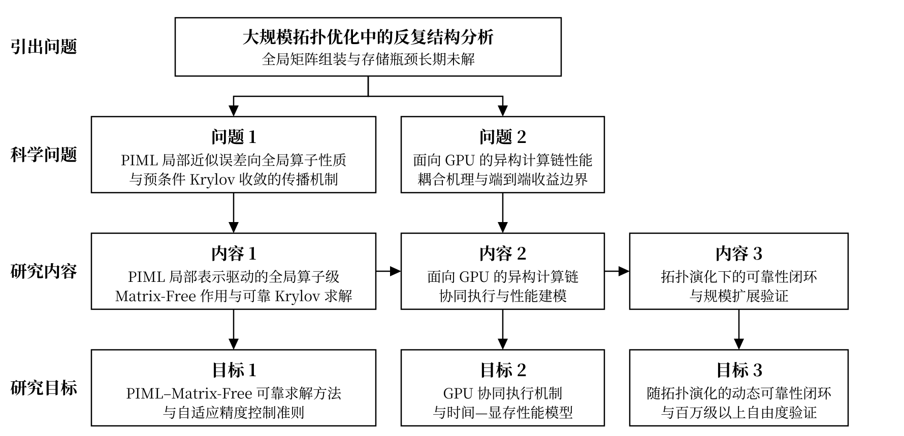

<b>图 4 关键科学问题、研究内容与研究目标的对应关系</b>

> **草稿核验资料（不导出至申请书）**
>
> - 官方栏目、匿名要求与字数限制：[[80th-2026|第 80 批申报执行页]]；《2026 年度中国博士后科学基金资助指南》附录一。当前正文去除 Markdown 标记、空白和图片链接后约 1450 个字符，低于 2000 字限制；最终计数以导入 Word 后的系统口径为准。
> - 项目题目、推进线与阶段目标：[[../../../piml-matrix-free-gpu/project-plan|博士后核心研究项目计划]]（精确 Matrix-Free/GPU 基线的算子机理、PIML 局部表示的 GPU 协同建模、三线融合的演化自适应与规模消融）。
> - 图 4（原图 2）状态：2026-08-27 按刘畅意见重构为「引出问题—科学问题—研究内容—研究目标」四层黑白版（补齐引出层与目标层，问题/内容/目标纵向对齐，研究内容按内容 1 → 内容 2 → 内容 3 极简水平递进），源文件仍为 `assets/fig04_science_content_objective_map.svg`（1780×860 viewBox，黑白宋体，与图 3、表 1 同风格）；正式 DOCX 中仍需按实际插入宽度复核显示效果。全文图号 2026-08-27 顺移：第 2 部分图 1/2 → 图 3/4，第 3 部分图 3 → 图 5；资产文件名保留原编号不动。

### 3. 研究方案（限 2000 字）

**状态：已与 DOCX 逐字符同步；公式在 DOCX 中以 OMML 对象承载，求和号、转置上标与 `K̂`／`Â`／`ŷ` 的帽子（`m:limUpp`）已逐项核对，渲染无误。按刘畅意见新增图 6（四类对照路径）、图 7（可靠性闭环）并借图精简文字。字数远低于 2000 字限。严格匿名，待导师最终审阅。**

#### （一）总体思路与技术路线

针对大规模拓扑优化中反复结构分析的矩阵装配、存储与求解瓶颈，本项目以四类对照路径为统一基线，按照“可靠全局求解—GPU 协同与性能建模—拓扑演化可靠闭环”的路线展开研究。首先研究 PIML 局部表示用于 Matrix-Free 全局求解时的误差传播与可靠性控制；其次研究 PIML–Matrix-Free–Krylov 计算链在 GPU 上的协同执行与时间—显存权衡；最后结合拓扑演化开展动态监测、异常修正与规模扩展验证。

在统一有限元离散、材料插值、优化参数、求解精度和测试基准下，对精确组装、精确 Matrix-Free、PIML 近似组装和 PIML 近似 Matrix-Free 四类路径进行对照，综合评价计算精度、迭代收敛、端到端时间、峰值显存与规模扩展能力；当监测指标异常时，通过局部精确回退、缺陷校正或预条件子更新反馈修正，形成完整技术路线，如图 5 所示。

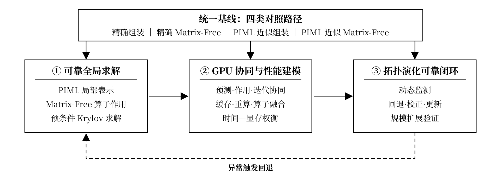

<b>图 5 统一基线与三项研究内容的总体技术路线图</b>

#### （二）具体研究方法与实施方案

1. **统一对照与可靠全局求解。** 在统一有限元离散、局部表示接口、求解精度标准和测试基准下，按局部算子来源与全局算子形成方式建立四类对照路径（图 6），区分局部近似与算子实现方式对误差、收敛和性能的影响。比较多尺度形函数、缩聚刚度等候选局部表示，检验其对刚体模态、对称半正定结构和能量一致性的保持能力。

设 $\mathbf G_j$ 为第 $j$ 个局部区域的自由度限制算子，$\mathbf K_j$ 和 $\widehat{\mathbf K}_j$ 分别为精确局部刚度算子和候选 PIML 局部表示诱导的近似局部刚度算子。在已施加边界约束的自由度空间中，近似 Matrix-Free 全局算子作用定义为

$$
\widehat{\mathbf y}=\widehat{\mathbf A}\mathbf x
:=\sum_j\mathbf G_j^{\mathsf T}\widehat{\mathbf K}_j\mathbf G_j\mathbf x.
$$

将 $\widehat{\mathbf K}_j$ 替换为精确局部刚度算子 $\mathbf K_j$，即可得到精确 Matrix-Free 全局算子 $\mathbf A$。计算时依次执行自由度限制、局部算子作用、延拓与全局累加，不显式形成和存储全局刚度矩阵。首先验证精确 Matrix-Free 与精确组装在算子作用、残差和位移响应上的一致性，再通过四类路径逐级识别局部近似与算子实现方式对全局算子性质、预条件子质量和 Krylov 迭代收敛的影响。求解过程中利用精确 Matrix-Free 算子复核真残差，并依据局部误差、结构检查结果和真残差信号，触发局部精确回退、缺陷校正或预条件子更新。近似全局算子保持对称正定且预条件子固定时采用 PCG；对称性或正定性不能保证时采用 GMRES；算子或预条件子动态变化时采用 FGMRES 等 Flexible Krylov 方法。

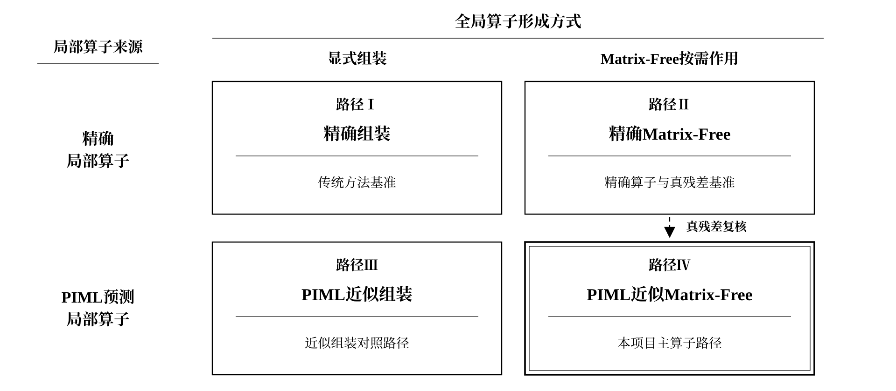

<b>图 6 四类对照路径示意图</b>

2. **构建 GPU 协同执行机制与时间—显存性能模型。** 在统一多后端框架下，将局部特征构造、批量预测、局部算子作用、全局累加和预条件 Krylov 迭代组织为设备驻留流程。面向不同局部区域及边界约束状态，比较批处理、局部表示缓存、按需重算和算子融合策略，并在 GPU 上完成向量运算、全局归约与预条件子作用，减少主机—设备间的数据搬移与同步。建立综合考虑计算吞吐、访存带宽、数据搬移与同步、局部表示缓存及迭代增长的时间—显存性能模型，量化不同策略对单次求解时间、完整优化流程总时间和峰值显存的影响。在统一求解精度、硬件配置、预热方式和计时口径下比较四类路径，确定端到端收益的形成条件。

3. **建立拓扑演化下的动态可靠性闭环并开展规模验证。** 针对拓扑演化引起的 PIML 预测失效、局部算子结构破坏和预条件子质量下降，监测分布外程度、结构保持、真残差与预条件子质量，并在指标异常时触发局部精确回退、缺陷校正或预条件子更新，形成动态可靠性闭环（图 7）。采用逐层消融，先以受控机理算例分析误差传播与 Krylov 收敛机理，再在百万级以上自由度的典型工况中对比四类路径并逐步加入 GPU 协同策略，报告精度、收敛、端到端时间和峰值显存。若局部加速收益被迭代增长抵消，则动态调节精确回退比例与预条件策略，界定方法可靠且具有端到端收益的适用范围。

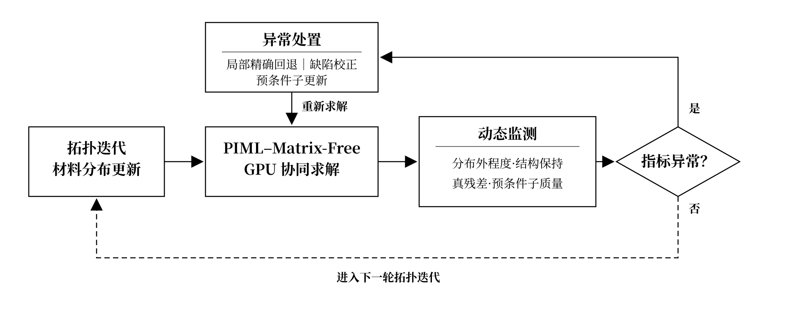

<b>图 7 拓扑演化下的可靠性闭环流程图</b>

### 4. 特色与创新之处（限 1000 字）

**状态：已与 DOCX 逐字符同步。按“方法融合创新—计算架构创新—工程规模特色”组织；汉字 883／去空白 1126，仅按标点计口径略超「限 1000 字」。严格匿名，待导师最终审阅。**

面向拓扑优化中的反复结构分析，本项目将 PIML 可复用局部力学表示、Matrix-Free 全局算子作用、预条件 Krylov 求解与 GPU 设备驻留执行贯通为统一计算链，在统一精度要求下协同研究全局求解可靠性、端到端时间—显存收益与可求解规模。

#### （一）方法融合创新：PIML 可复用局部表示驱动的 Matrix-Free 全局求解

针对现有 PIML 及其局部代理方法主要面向显式子结构装配、全局组装与存储瓶颈仍存且缺乏结构保持与误差传播分析的局限，本项目将 PIML 预测的多尺度形函数、缩聚刚度等可复用局部力学表示直接作为局部算子来源，通过自由度限制、局部作用、延拓与全局累加实现 Matrix-Free 全局算子作用，从根本上避免显式形成和存储全局刚度矩阵。系统揭示局部近似误差经全局累加对全局算子对称正定性、谱性质、预条件子质量及 Krylov 收敛的影响规律；以精确 Matrix-Free 算子复核真残差为闭环判据，实施局部精确回退、缺陷校正与预条件子更新。创新在于将 PIML 从局部力学量预测工具拓展为全局无矩阵求解的局部算子引擎，并建立数值可靠性保障机制，使其真正突破反复结构分析的存储与算力瓶颈。

#### （二）计算架构创新：PIML–Matrix-Free–Krylov 计算链的 GPU 端到端协同

在统一多后端接口下，将局部特征构造、PIML 批量预测、局部算子作用、全局累加、向量归约、预条件子作用和 Krylov 迭代组织为 GPU 设备驻留流程。比较分组批处理、局部表示缓存、按需重算和算子融合策略，建立综合计算吞吐、访存带宽、数据搬移与同步开销、表示缓存占用及迭代增长的时间—显存性能模型，量化单次算子加速对完整拓扑优化流程总时间和峰值显存的实际贡献。创新不在于单一神经网络或 GPU 内核提速，而在于协同组织预测、算子作用与迭代求解的数据流：减少重复局部计算、避免全局矩阵存储、降低跨设备数据搬移，并使这些局部收益转化为完整优化流程的端到端收益；据此明确不同问题规模和硬件资源下端到端收益与可求解规模扩展的形成条件。

#### （三）工程规模特色：面向大规模复杂拓扑优化的全流程规模扩展

本项目不止评价 PIML 局部预测精度、单次 Matrix-Free 算子作用或 GPU 内核加速，而是将 PIML–Matrix-Free–Krylov/GPU 协同计算链嵌入大规模拓扑优化的完整设计迭代。面向复杂几何、典型载荷与边界条件，逐步扩展至百万级以上自由度的复杂算例，统一评估位移、柔顺度和灵敏度误差、真残差、Krylov 迭代数、完整流程时间与峰值显存，考察在相同硬件资源和求解精度要求下扩大可求解规模、缩短反复结构分析时间的能力。其特色在于将方法验证从局部代理和单次线性求解推进到面向大规模复杂算例的完整拓扑优化流程。

### 5. 研究计划及预期成果（限 500 字）

**状态：已与 DOCX 逐字符同步。按刘畅意见收口式压缩重写，口径统一为「百万级及以上」，并补齐千万级至亿级自由度的超大规模落点。待办：正文去空白 743 字符（汉字 561），超「限 500 字」，官方计数口径待确认。严格匿名，待导师最终审阅。**

#### （一）研究计划与进度安排

0—6个月：统一有限元离散、求解精度与测试接口，建立精确组装、精确 Matrix-Free、MPI 并行及单 GPU 执行基线，完成 PIML 局部表示接口与数据集准备。

6—12个月：完成多尺度形函数、缩聚刚度等候选局部表示的 PIML 建模与批量预测，开展局部算子结构检查与分布外检测，构建单 GPU 局部预测、算子作用与全局累加原型。

12—18个月：构建 PIML–Matrix-Free–Krylov MPI–GPU 异构计算链，完成单节点多 GPU 的区域划分、贡献交换、全局归约与并行预条件；实现真残差复核、局部精确回退、缺陷校正与预条件子更新，建立初步时间—显存—通信性能模型，整理阶段性成果。

18—24个月：在机理剖析算例和百万级及以上自由度的复杂算例中开展完整拓扑优化流程验证，由单 GPU 逐步扩展至多节点 MPI–GPU，逐级推进千万级至亿级自由度超大规模算例的求解与加速，评价数值精度、收敛性与端到端时间—显存—扩展收益，完成成果凝练与项目总结。

#### （二）预期研究成果

1. **理论与方法成果：** 形成 PIML 可复用局部表示驱动的 Matrix-Free 全局求解方法与 MPI–GPU 异构协同计算框架，揭示局部近似误差对全局算子性质、预条件子质量和 Krylov 收敛的影响机制，发表或录用高水平学术论文 2—3 篇。
2. **测试集与性能证据：** 建立大规模拓扑优化可复核基准测试集，形成覆盖精度、真残差、迭代数、端到端时间、峰值显存与强弱扩展效率的测试证据，验证在相同硬件资源下显著扩大可求解规模、实质加速完整优化流程的能力，并界定方法适用范围。
3. **软件与工程应用成果：** 开发覆盖上述计算链全环节的可复用求解加速模块，并集成应用于自主工业结构仿真与拓扑优化软件，支撑重大装备轻量化设计场景的工程验证与应用示范。

### 6. 研究基础（限 1000 字）

**状态：除（三）2026-08-29 刚改写、DOCX 尚未同步外，其余已与 `项目信息(6. 研究基础部分).docx` 逐字符同步，仅余三个分点标题的排版差异（md 用独立加粗标题行，DOCX 合并入同段）；按魏华祎意见成「出发点—工具—落脚点」框架，按刘畅意见补研究积累总领段并做术语规避清理。待办：（1）正文去空白 1891 字符（汉字 1369），超「限 1000 字」约 750 字，是本节最大待办；（2）（三）已按刘畅 2026-08-29 微信提供的信息改写：以郭旭院士团队国家重点研发计划“揭榜挂帅”项目“CAE 通用求解器”（2023YFB3309100，2023-12 至 2026-11，经费 17500 万元）与辽宁省科技重大专项“重大装备结构创新设计及工业 CAE 软件”（2024-09 至 2027-08，经费 25000 万元）为主，措辞为「团队承担、本项目依托」（刘畅口径：列出即表明团队归属，不虚构个人参与），魏华祎合作任务经用户确认整段删除（避免稀释团队归属信号，且（二）2 已体现魏团队支撑）；DOCX 侧需在 WPS 中手工同步后重新导出 PDF（勿重跑 build 脚本，会覆盖手工排版）；（3）图 10 面板 (d) 标题「优化后构型（191.5 万自由度，90 步收敛）」与图题同类重复，需重绘方可改；（4）图 8/9 面板标题仍左对齐（图 10 已改居中），如需全文统一可再改。答辩口径备忘（无其他留档，勿说岔）：（a）正文已删「区域分解未改变代数」半句，「迭代数恒为 `493`」随之失去解释，被追问须口头补回；（b）已删「在工程计算软件研发中完成」，本项工作不再挂靠企业软件研发背景，与（三）在研项目的呼应减弱；（c）已删「与算子热插拔」且不得重新写入——soptx 全仓无热插拔实现，算子是构造时依赖注入（策略模式）；（d）「自动微分灵敏度分析」属实（`compliance.py:63` 为 `bm.vmap(bm.grad(...))`），但图 10 那次运行走的是 `topopt_3d_simp_real.py` 的解析灵敏度，句子写的是「平台支持」而非「本算例使用」；（e）术语规避只针对申请人自我口径，（三）「真实三维 CAD/CAE 模型库」的「三维」为有意保留（描述在研项目交付的工程数据，且「三维 CAD」是行业标准表述），§1 三处「三维」同属既定例外。已结案：刘畅所提「平台截图」项——申请人自有软件均为库层代码、无 UI 可拍，能拍界面的韶峰天工属产品侧通用小算例，与本节主张不符，以「软著 2 项」与图 10 构型渲染代偿；（二）3 依托机构全称与「郭旭院士任院长」已经用户确认。图 10 已修正的实质缺陷：Hex8 单元刚度曾漏等参映射（B 矩阵用局部坐标导数而 detJ 取物理体积），致柔度绝对值系统性偏差 4h 倍、跨网格对比失效；修复后统一到博士论文算例 3.3 加密版（300×100×20 网格、191.5 万自由度、90 步收敛），三级网格柔度单调收敛至 86.66，与论文二阶单元 86.92 差 0.30%，构成独立交叉验证；CPU/GPU 两侧统一 float64 后单步 24.6 倍（旧图 36.1 倍系 GPU 侧 fp32 的不对等口径），位移解相对差 6.8e-11。图 8/9/10 的历次版式与角注调整过程见根 `log.md`，图 10 数值、量纲与运行记录留档于 soptx `experiments/topopt_capability/results_analysis.md`。严格匿名，待导师最终审阅。**

#### （一）与本项目相关的研究工作积累和成绩

申请人长期从事计算力学与计算数学交叉方向的研究，围绕大规模结构分析与拓扑优化的高性能求解，开展了从数值方法到工程软件的系统研发，已发表学术论文 3 篇、获软件著作权 2 项。同时具备高性能求解算法、机器学习局部建模与异构并行软件研发能力，所用平台底层算子自主可控、可深度改造，使本项目的融合研究能够直接在已有代码基础上开展。与本项目直接相关的积累覆盖 Matrix-Free 算子与并行 Krylov 求解、PIML 局部力学表示、多后端 CPU–GPU 异构并行拓扑优化平台三个方面，相关方法均已完成正确性验证与性能实测，主要工作与结果如下：

1. **Matrix-Free 算子与并行 Krylov 求解**
实现了结构分析 Matrix-Free 算子与并行 Krylov 求解器，实测表明（图 8）：该算子与显式组装同解至机器精度（相对差 `<1e-12`），算例实测规模达约 `159` 万自由度，同一内存上限下可算规模约为显式组装的 `3.1` 倍。在约 `82` 万自由度的同一问题上，`16` 个 MPI 进程（每进程单线程）相对单进程加速 `3.69` 倍，迭代数恒为 `493`，加速偏离理想线性主要受单节点访存带宽限制而非通信开销。单卡 GPU 相对同后端 `16` 线程 CPU 加速约 `16` 倍。

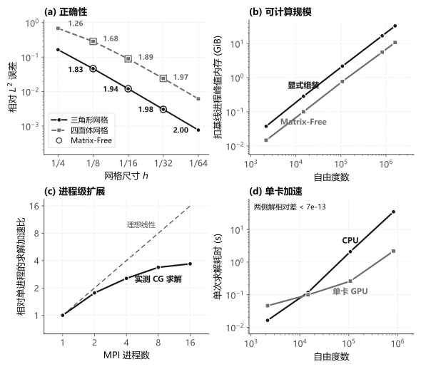

<b>图 8 Matrix-Free 算子的正确性、可计算规模、进程级扩展与单卡加速</b>

2. **PIML 局部力学表示与 GPU 批量缩聚**
构建了基于子结构静力缩聚（Schur 补）与多尺度形函数的力学求解器，缩聚解与全装配直解的位移和柔度相对差均 `<2e-12`，并打通了预测形函数与直接预测缩聚刚度两条 PIML 路线。实测表明（图 9）：形函数变分构造的误差压缩严格二阶（log-log 斜率 `2.00`），形函数自身 `8.97%` 的误差被压缩至缩聚刚度误差 `0.44%`。在 `24` 个子结构装配的全局系统上，该路线的全场位移与结构柔度误差为 `0.15%`／`0.20%`，较直接预测刚度路线的 `2.01%`／`3.64%` 低一个数量级。局部缩聚重构为批量张量推断与变分投影矩阵乘法（Batched GEMM）后，单块 GPU 上 `24~384` 个子结构在 `0.23~3.32 ms` 内完成，相对同实现 CPU 加速约 `22~26` 倍。

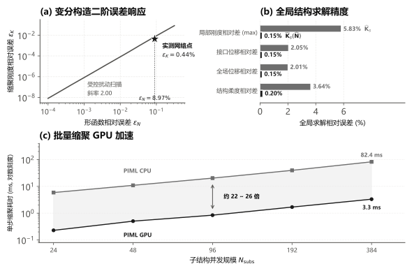

<b>图 9 PIML 局部表示的二阶误差压缩、全局求解精度与 GPU 批量加速</b>

3. **多后端异构并行拓扑优化平台**
前期基于 FEALPy 自主研发了张量化有限元拓扑优化平台，实现 NumPy（CPU）与 PyTorch（GPU）等后端的统一调度与无缝切换。在 191.5 万自由度拓扑优化基准上，完整优化 90 步收敛，柔度自 `1161.1` 降至 `86.7`、体积分数 0.30；单步迭代耗时由 CPU 的 `255.94 s` 降至 GPU 的 `10.41 s`，端到端加速 `24.6` 倍，四个计算阶段加速 `1.6~317.8` 倍，其中平衡方程求解加速 `26.5` 倍（图 10）；GPU 峰值显存仅 `5.89 GB`。CPU 与 GPU 双精度同算，共轭梯度迭代步数完全一致，位移解相对差仅 `6.8e-11`，且张量化算子与显式装配代数恒等（`~1e-15`），加速未牺牲精度。该平台支持自动微分灵敏度分析。

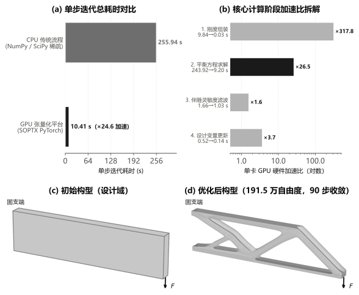

<b>图 10 张量化拓扑优化平台的多后端性能实测与大规模优化设计结果</b>

#### （二）已具备的科研条件、尚缺少的条件及拟解决途径

**已具备的科研条件：**

1. 计算力学：依托大连理工大学郭旭院士团队，具备拓扑优化与多尺度设计的理论指导及重大装备的真实轻量化场景，是本项目选题的出发点；

2. 计算数学：依托湖南国家应用数学中心与湘潭大学魏华祎教授团队，拥有自主可控的 FEALPy 平台与底层算子定制能力，为本项目提供算法与软件工具支撑；

3. 工程应用：依托郭旭院士任院长的大连工业软件创新发展研究院与设站单位超算平台，具备自主工业仿真软件生态与多节点异构 GPU 集群，是研究成果的落脚点。

尚缺少的条件及拟解决途径：算法底座、软件栈与单机异构算力已具备；尚缺多节点大规模并行机时与重大装备真实构件工况数据，拟分别依托设站单位超算平台申请专项机时、依托郭旭院士团队合作场景补齐，逐级推进千万至亿级自由度真实工况验证。

#### （三）正在承担的与本项目相关的科研项目

合作导师郭旭院士团队正在牵头承担国家重点研发计划“揭榜挂帅”项目“CAE 通用求解器”（2023YFB3309100，2023 年 12 月至 2026 年 11 月，经费 17500 万元）与辽宁省科技重大专项“重大装备结构创新设计及工业 CAE 软件”（2024 年 9 月至 2027 年 8 月，经费 25000 万元），本项目将依托上述项目开展：

1. 提供落地与验证出口：两项目聚焦自主 CAE 求解器与重大装备工业软件研发，为本项目的 Matrix-Free 求解与 GPU 加速方法提供求解器工程化落地渠道，并提供重大装备的真实三维 CAD/CAE 模型库与多工况载荷，使新方法能在真实工业场景中完成验证；

2. 研究定位互补不重复：上述项目侧重自主 CAE 求解器与工业软件的工程研发，本项目聚焦问题无关机器学习近似算子与 Matrix-Free 求解的前瞻性方法研究，成果可为其求解器底座提供方法补充，研究内容互不重复。

