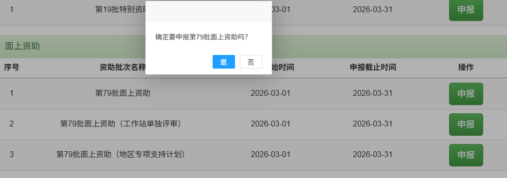

# 中国博士后科学基金第 80 批面上资助申请准备

## 结论先行

| 事项 | 当前结论 |
|---|---|
| 当前任务 | **立即准备并申报第 80 批面上资助** |
| 核心项目关系 | 本次为 [[../../../piml-matrix-free-gpu/project-plan\|博士后核心研究项目]]的第一次条件性面上资助申请；申请结果不决定项目是否继续 |
| 个人申报基础 | 何亮于 2026-07-22 进站，处于男性博士后进站 18 个月内的申报期，且已确认属于非在职博士后；系统账号、基金业务权限和第 80 批申请入口均已核验可用，进站登记学科为“力学—计算力学” |
| 资助标准 | 自然科学 8 万元 |
| 资助使用窗口 | 2026 年指南未规定“获批后固定执行 2 年”；面上资助是在站期间使用的科研启动或补充经费，获资助人员出站时须清理账目并提交资助总结报告。按当前合同，本人的使用窗口上限预计至 2028-07-21，实际起点取决于结果公布和拨款时间 |
| 网上申报 | 2026-08-01 开始 |
| 大连理工大学截止 | **2026-08-29** |
| 官方博士后截止 | 2026-08-31 |
| 当前最重要动作 | 确认“力学—固体力学、数学—计算数学”的评审学科建议，填写并保存基金申请信息，随后分别准备项目信息第 1–5 部分和第 6 部分两个 DOCX |

正式申报以中国博士后科学基金管理信息系统、[大连理工大学申报通知](https://scidep.dlut.edu.cn/info/1108/70923.htm)及院系要求为准。

## 资格确认

| 条件 | 个人情况 | 状态 / 动作 |
|---|---|---|
| 已完成博士后进站 | 2026-07-22 进入大连理工大学博士后科研流动站 | **符合** |
| 进站时间 | 男性博士后须在进站 18 个月内申报 | **符合** |
| 系统申报身份 | 已确认可以登录并访问“基金申报”“我的申报”，且已进入第 80 批面上资助申请表 | **账号权限和第 80 批入口均已确认** |
| 非在职博士后 | 在职身份博士后不得申报，现役军人除外 | **符合，已确认** |
| 申请学科 | 进站系统登记为“力学—计算力学”；基金申请建议“力学—固体力学”，交叉“数学—计算数学” | **进站登记已确认；基金评审学科待确认并保存** |
| 累计在站时间 | 累计在站不超过 6 年 | 如无其他博士后经历则符合；有其他经历时累计核验 |
| 获资助次数 | 每人每站只能获得一次面上资助 | 确认本站尚未获得面上资助 |
| 国（境）外派出项目 | 入选国家博士后国（境）外派出项目人员不可申请 | 确认未入选相关项目 |
| 在站状态 | 资助结果公布前出（退）站者不予资助 | 两年制合同能够覆盖预计公示时间 |
| 地区专项 | 大连理工大学通知明确申报人员不得选择“地区专项支持计划” | **不得选择** |

资格与系统入口的当前核验已完成；后续重点转为申请内容、评审学科和系统字段填报。基金申请页当前未自动带入项目名称、来源、关键词或学科，不能把进站登记学科误记为申请页已保存值。

## 申报流程

1. 从中国博士后科学基金会官网进入“中国博士后科学基金管理信息系统”。
2. 核对个人信息、进站信息和申请学科，在线填写申请信息。
3. 在系统中生成《中国博士后科学基金面上资助申请书》，检查后在线提交至院系。
4. 院系博士后工作管理人员审核申请材料，并提交至学校。
5. 关注系统退回状态；如被退回，按意见修改后重新提交。
6. 最迟在 2026-08-29 前完成大连理工大学申报，不以 8 月 31 日作为个人提交时间。

系统入口：[中国博士后科学基金管理信息系统](https://jj.chinapostdoctor.org.cn/auth/login.html?usertype=bsh)。

### 往批次系统操作参考

> 该截图来自 2026 年第 79 批申报页面，只用于说明系统中的资助类型选择和确认逻辑。第 80 批名称、按钮和页面布局以 2026-08-01 实际开放的系统为准。

- 第 80 批开放后，应选择普通的“第 80 批面上资助”。
- 不选择“工作站单独评审”：何亮依托大连理工大学博士后科研流动站自主招收，不属于该入口。
- 不选择“地区专项支持计划”：大连理工大学校内通知已明确本校申请人不得选择。
- 点击“申报”后，先核对确认窗口中的批次名称确为“第 80 批面上资助”，再点击“是”进入申请表。

## 需要准备的资料

正式申报的核心材料是系统在线生成的《中国博士后科学基金面上资助申请书》。提前下载的模板只能用于准备文字，不作为正式申请书上传。

| 资料 | 内容 | 当前动作 |
|---|---|---|
| [[../../../piml-matrix-free-gpu/project-plan\|核心项目计划]] | 项目名称、总体目标、WP1–WP3、两年阶段和资助映射 | 作为科研事实源；本次申请按官方栏目和字数限制形成批次表达 |
| [[80th-2026-application-workbook\|填报工作底稿]] | 网站字段、个人信息状态、代表性成果、文件上传、系统同步和提交检查 | 维护填报过程与状态；不复制申请书科研正文，不保存敏感个人信息 |
| [[80th-2026-application-draft\|申请书正文]] | 第 80 批项目名称、关键词和官方六部分科研正文 | 作为本批申请表达的唯一事实源；从核心项目计划提取并适配，六部分已全部定稿，待导师最终审阅 |
| 个人与进站信息 | 身份信息、博士学位信息、进站日期、设站单位等 | 与系统记录逐项核对 |
| 申请学科 | 进站登记为“力学—计算力学”；申请页建议“力学—固体力学”，交叉“数学—计算数学” | 当前申请页为空；首次保存前请合作导师或院系确认评审分组口径 |
| 项目基本信息 | 项目名称、项目来源和关键词 | 题目与关键词已在申请书正文中确定，待填入系统并保存 |
| 项目信息正文 | 官方第 1–5 部分和第 6 部分研究基础 | 在申请书正文中扩写；分别准备两个 DOCX |
| 研究基础与条件 | 已有研究工作、方法与平台条件 | 只写能够支撑本项目的事实 |
| 代表性成果 | 论文、专著、专利或奖励等，不超过 5 项 | 整理准确的题名、作者、状态和本人贡献 |
| 资格备查材料 | 博士双证、进站材料、两年制合同及学校可能要求的证明 | 归档为可随时提交的 PDF |
| 提交检查表 | 匿名信息、成果数量、地区专项、文档加密和系统状态 | 提交前逐项勾选 |

### 匿名要求

“项目信息”中除“研究基础”外，不得出现申请人姓名、设站单位名称、合作导师姓名或其他可识别申请人身份的信息；否则评审专家可视为申请人故意泄露个人信息，计 0 分。系统完整原文由 [[80th-2026-application-workbook#七、匿名与合规检查|填报工作底稿]] 维护。

系统当前要求分别上传两个 DOCX：“项目信息（1–5 部分）”最大 5120 KB，“项目信息（6、研究基础部分）”最大 2048 KB。页面提示使用 WPS 编辑并标注“不兼容 Office”；修改基金申请信息后须重新生成第 1–5 部分文件。

## 当前倒排计划

| 时间 | 任务 | 完成标志 |
|---|---|---|
| 2026-07-28 至 2026-07-31 | 完成申请书文字底稿和代表性成果整理 | 形成可直接填入系统的申请材料 |
| 2026-08-01 至 2026-08-07 | 登录系统并完成申请书初稿 | 系统字段填写完成，可生成申请书 |
| 2026-08-08 至 2026-08-17 | 合作导师 / 同行修改 | 形成第二稿，关键问题和创新点表述稳定 |
| 2026-08-18 至 2026-08-24 | 定稿与合规检查 | 完成匿名、成果和系统字段检查 |
| 2026-08-25 至 2026-08-26 | 首次提交院系审核 | 系统显示已提交，预留退回修改时间 |
| 2026-08-27 至 2026-08-28 | 处理退回意见 | 修改后重新提交 |
| 2026-08-29 | 大连理工大学申报截止 | 学校流程内完成提交 |

## 提交前检查

- [x] 已确认系统账号生效，可以访问“基金申报”和“我的申报”。
- [x] 已确认“基金申报—面上资助”中出现“第 80 批面上资助”，且可以进入申请表。
- [x] 已确认本人属于可申报的非在职博士后。
- [x] 已确认进站系统登记为一级学科“力学”、二级学科“计算力学”。
- [ ] 已确认基金申请使用的主学科和交叉学科，并在系统保存后核对回显。
- [ ] 未选择“地区专项支持计划”。
- [ ] 代表性成果不超过 5 项，信息准确且与申请内容相关。
- [ ] “项目信息”除“研究基础”外没有姓名、单位和合作导师等身份信息。
- [ ] 项目信息第 1–5 部分和第 6 部分两个 DOCX 均已上传并核对。
- [ ] 正式申请书由系统在线生成，没有上传提前下载的参考模板。
- [ ] 上传文件未开启加密保护。
- [ ] 已在 2026-08-29 前提交至院系，并持续关注退回状态。

正常情况下直接在系统中提交至院系；只有出现院系额外通知、系统异常、长期未审核或退回原因不明时，再联系院系博士后管理人员。

## 官方依据

| 资料 | 链接 | 用途 |
|---|---|---|
| 《中国博士后科学基金资助指南（2026 年度）》 | [官方 PDF](https://www.chinapostdoctor.org.cn/prod-api/profile/info/fujian/20260104/824e4553-1677-42f4-b39a-54c965adb668.pdf) / [[../../sources\|iCloud 归档记录]] | 申请条件、材料要求、评审规则和官方时间 |
| 大连理工大学《关于开展 2026 年中国博士后基金项目申报的通知》 | [学校通知](https://scidep.dlut.edu.cn/info/1108/70923.htm) | 校内截止、申报流程和地区专项限制 |
| 2026 年基金指南解读 | [政策速查](../../china-postdoctoral-science-foundation-2026-guide-notes.md) | 资助类型、时间线、硬条件、兼容关系与经费管理 |
| 博士后项目申请总台账 | [总台账](../../postdoc-funding-applications.md) | 当前优先级及后续年度路线 |
