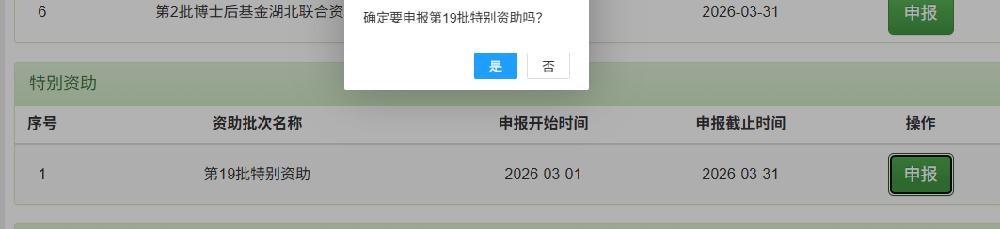

# 2027 年度中国博士后科学基金特别资助申请准备

> 2027 年正式通知尚未发布。本页以 2026 年中国博士后科学基金资助指南和大连理工大学通知建立准备基线，不把 2026 年日期、名额或材料格式直接写成 2027 年规则。

## 结论先行

| 事项 | 当前结论 |
|---|---|
| 2026 年申报 | 已于 **2026-03-31** 截止，大工校内截止为 2026-03-29，现不能补报 |
| 2027 年定位 | **进阶申报项目；以第 80 批申请和进站后新增成果为基础准备** |
| 个人匹配度 | 到 2027 年参考窗口时，预计满足进站满 4 个月、非在职和累计在站年限等基础条件 |
| 竞争门槛 | 2026 年学校推荐名额按在站非在职博士后人数的 1/20 核定，须经过校内遴选 |
| 当前优先级 | 不影响第 80 批准备；2026 年下半年开始积累新增成果和证明材料 |

## 申报入口

- 申报系统：[中国博士后科学基金管理信息系统](https://jj.chinapostdoctor.org.cn/auth/login.html?usertype=bsh)
- 当前状态：2027 年特别资助入口尚未开放。
- 账号状态：同一系统账号已经确认可以登录并访问基金业务；2027 年专属入口待开放后核验。
- 正式操作：先按大连理工大学当年限额遴选要求准备材料，再在系统中填写并提交至院系 / 设站单位审核。

### 2026 年度系统操作参考

> 该截图来自 2026 年第 19 批特别资助申报页面，只用于识别普通“特别资助”入口和点击“申报”后的确认逻辑。2027 年批次名称、按钮、申报日期和页面布局以当年系统为准。

- 2027 年入口开放后，在“特别资助”分区选择当年度普通特别资助项目。
- 点击“申报”后，先核对确认窗口中的项目名称和年度批次，再点击“是”进入申请表。
- 不因截图显示“第 19 批”而沿用 2026 年批次或 2026-03-01 至 2026-03-31 的日期。
- 联合资助或其他专项入口只有在当年通知明确适用时才选择，不与普通特别资助混用。

## 个人资格预判

| 条件 | 2026 年官方口径 | 何亮现状 | 当前判断 |
|---|---|---|---|
| 进站时间 | 首次提交时进站满 4 个月 | 2026-07-22 进站 | 若 2027 年仍在 3 月前后申报，**预计符合** |
| 在站总年限 | 累计在站时间不超过 6 年 | 2026 年首次进站 | **符合参考规则** |
| 身份 | 在职身份博士后不得申报，现役军人除外 | 已确认非在职博士后 | **符合参考规则** |
| 本站获资助记录 | 每站只能获得 1 次特别资助 | 本站尚未获得 | **符合参考规则** |
| 科研能力 | 须有突出的科研能力、创新成果或成果转化前景 | 已有研究基础，进站后新增成果尚待形成 | **基础匹配，竞争力待积累** |
| 单位推荐 | 设站单位择优推荐，名额受限 | 依托大连理工大学申报 | **须通过学校限额遴选** |

## 与其他项目的关系

- 特别资助可以延续或深化面上资助工作，但申请书必须体现新的创新点或新增科研成果，不能只复制第 80 批申请。
- 2026 年规则下，国资计划 A 档等项目与特别资助存在“可同时申报但不得同时获选”或“已获资助者不得再申报”的限制；2027 年应按当年通知统一核验。
- 因此，2027 年可以并行维护特别资助与国资计划底稿，但在正式申报和结果阶段须服从当年兼容规则，不预设可以同时获资助。

## 需要准备的材料

| 材料 | 当前动作 |
|---|---|
| 2027 年特别资助申请书 | 当年系统开放后填写，不使用 2026 旧表定稿 |
| 个人简历和科研经历 | 与第 80 批材料保持事实一致，突出进站后的新增进展 |
| 不超过 5 项代表性成果 | 整理论文、专利、软件、奖励或项目等，并标明本人贡献 |
| 成果证明 | 准备论文全文、收录或录用证明、专利证书、奖励证书等可核验附件 |
| 第 80 批工作深化说明 | 说明新科学问题、新创新点及新增成果，避免简单重复 |
| 学校推荐材料 | 按大工当年限额遴选通知补充，提前关注学院内部安排 |
| 系统与进站信息 | 核验中国博士后科学基金管理信息系统中的进站日期、身份和单位信息 |

## 监测与行动节点

| 时间 / 触发点 | 动作 |
|---|---|
| 2026 年 8 月 | 优先完成第 80 批面上资助申请 |
| 2026 年 9—12 月 | 持续记录进站后新增论文、算法、软件、专利和阶段性结果 |
| 自 2027 年 1 月起 | 关注中国博士后科学基金会、大工科研院和学院通知 |
| 2027 年指南发布后 | 核验进站月数、推荐名额、申报窗口、材料格式和兼容关系 |
| 校内通知发布后 | 依据学校截止倒排，先完成学院 / 学校限额遴选材料 |
| 正式提交前 | 核对不超过 5 项代表性成果及全部证明附件，确保系统提交至院系 |

2026 年全国申报窗口为 3 月 1 日至 3 月 31 日。该时间只用于判断 2027 年可能的准备节奏，**2027 年正式日期待当年通知**。

## 2027 年提交前检查

- [ ] 2027 年资助指南及大工校内通知已发布。
- [ ] 首次提交时进站已满当年要求的月数。
- [ ] 非在职身份、累计在站年限及本站获资助记录符合。
- [ ] 已形成足以参加校内遴选的进站后新增成果。
- [ ] 不超过 5 项代表性成果及证明材料完整。
- [ ] 与国资计划及其他博士后资助的兼容关系已核验。
- [ ] 申请书相对第 80 批体现新的创新点或新增成果。
- [ ] 已按学校限额遴选和系统审核流程完成提交。

## 参考依据

| 资料 | 用途 |
|---|---|
| [2026 年中国博士后科学基金资助指南](https://www.chinapostdoctor.org.cn/prod-api/profile/info/fujian/20260104/824e4553-1677-42f4-b39a-54c965adb668.pdf) | 上一年度资格、资助标准、成果附件和兼容规则参考 |
| [大连理工大学 2026 年特别资助申报通知](https://scidep.dlut.edu.cn/info/1022/70903.htm) | 校内截止、限额遴选和提交流程参考 |
| [[../../sources]] | 官方文件归档记录 |
