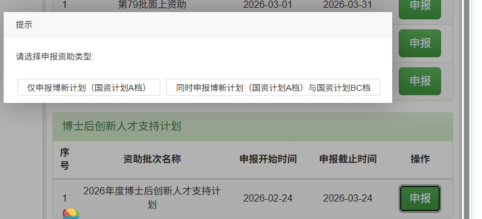

# 2027 年度国家资助博士后研究人员计划 A/B/C 档申请准备

> 2027 年正式通知尚未发布。本页中的资格、资助标准和流程均以 2026 年规则作前期参考，不把 2026 日期直接沿用为 2027 申报安排。

## 结论先行

| 事项 | 当前结论 |
|---|---|
| 申请策略 | **A 档（博新计划）为主申项目，同时准备 B/C 档作为备选** |
| 个人匹配度 | 按 2026 年规则为高匹配；最终资格待 2027 年通知 |
| 当前优先级 | 第 80 批面上资助提交后启动完整准备 |
| 监测时间 | 自 2026-11-01 起关注大工校内培育和2027年度通知 |
| 最大风险 | 现有两年合同可能无法覆盖获选后的两年资助期及科研业绩评估时间 |

国资计划是独立资助渠道，不计入核心项目的三次条件性面上申报机会。若以 [[../../../piml-matrix-free-gpu/project-plan|博士后核心研究项目]] 为科研基础，正式申请须根据国资计划的人才培养、研究计划和新增进展要求单独适配，不直接复制第 80 批申请。

## 申报入口

- 申报系统：[中国博士后科学基金管理信息系统](https://jj.chinapostdoctor.org.cn/auth/login.html?usertype=bsh)
- 当前状态：2027 年 A/B/C 档项目入口尚未开放。
- 账号状态：同一系统账号已经确认可以登录并访问基金业务；2027 年专属入口待开放后核验。
- 正式操作：按当年通知在线填写、生成并上传申请材料，提交至院系 / 设站单位审核；不使用线下模板代替系统申报。

### 2026 年度系统操作参考

> 该截图来自 2026 年度申报系统，只用于说明操作逻辑。2027 年度按钮文字、入口和流程以当年系统为准。

- 左侧选项“仅申报博新计划（国资计划 A 档）”：只申请 A 档。
- 右侧选项“同时申报博新计划（国资计划 A 档）与国资计划 B/C 档”：先完成 A 档，再按系统提示进入 B/C 档补充和提交。
- 按当前“A 档主申、B/C 档备选”策略，2027 年若系统延续该操作方式，应选择右侧选项。
- 如果届时完全不申报 A 档、只申报 B/C 档，则直接进入当年度国资计划 B/C 档申报系统。

## 个人资格预判

| 条件 | 何亮情况 | 当前判断 |
|---|---|---|
| 年龄 | 1998 年出生；2026 年参考线为 1994-01-01（含）以后出生 | **符合参考规则** |
| 博士毕业年限 | 2026 年取得博士学位；参考要求为取得博士学位 3 年以内 | **符合参考规则** |
| 进站时间 | 2026-07-22 进站；若2027规则按年度顺延，预计属于新近进站人员 | **高概率符合，待通知** |
| 身份 | 已确认非在职博士后 | **符合参考规则** |
| 博士经历 | 湘潭大学国内博士，不属于留学回国博士或外籍博士 | **符合参考规则** |
| 研究领域 | 力学、计算力学、结构优化，属于自然科学及相关前沿 / 工程技术领域 | **匹配** |
| 合作导师与平台 | 郭旭院士，大连理工大学力学与航空航天学院 | **较强匹配** |
| 本站国资计划记录 | 2026 年窗口结束后进站，本站尚未申报 A/B/C 档 | **符合参考规则** |
| 人事关系 | 非在职身份已确认；档案、工资关系和社会保险是否全部转入大工仍需核验 | **待确认** |
| 聘期覆盖 | 两年制合同若自 2026-07 起算，约于 2028-07 届满 | **存在资助期与考核时间风险** |

## 两年合同风险

参考 2026 年规则，国资计划资助期为 2 年；获选人员通常须在获资助 18 个月至资助期满时申报博士后科研业绩评估考核资助，未申报前不得办理出站。

如果 2027 年获选，现有合同可能早于完整资助期及考核节点届满。正式申报前须向大连理工大学确认：

1. 获选后是否允许延长在站时间或续签合同。
2. 延期期间工资、社会保险和日常经费的承担方式。
3. 学校是否要求申报时提供完整资助期覆盖证明。

在上述问题闭合前，本项目状态为“高匹配、待聘期确认”，不宣称已经完全符合。

## A/B/C 档申报策略

- 参考 2026 年规则，每站只能申报一次国资计划，应把 2027 年作为统一申请机会准备。
- 符合条件时同时申报 A 档和 B/C 档：先完成 A 档，再按系统提示进入 B/C 档补充材料。
- A 档以高水平科研潜力、合作导师和平台条件为主要竞争点；B/C 档作为同一材料体系下的备选。
- 2026 年参考资助标准为：A 档每年 28 万元并一次性配套科研经费 8 万元，B 档每年 18 万元，C 档每年 12 万元，资助期均为 2 年。
- A 档与特别资助、李政道研究所特别资助、联合资助在上一年度可同时申报但不得同时获选；2027 年须重新核验。

## 需要准备的材料

| 材料 | 2026 年参考要求 | 当前动作 |
|---|---|---|
| A 档申报书 | 系统在线填写并生成，线下模板无效 | 第 80 批提交后建立底稿 |
| 博士导师推荐意见 | 导师签字后上传原件扫描件 | 提前确认推荐安排 |
| 博士后合作导师推荐意见 | 合作导师签字后上传原件扫描件 | 提前确认推荐安排 |
| 博士学位与毕业证明 | 已获学位者提供学位证和毕业证原件扫描件 | 归档 PDF |
| 代表性成果 | 论文、专著、专利、项目或奖励等不超过 5 项，并提供对应证明 | 整理成果及本人贡献 |
| 研究计划匿名文本 | 不得出现姓名、单位和合作导师等身份信息 | 准备匿名版 |
| 人事关系证明 | 档案、工资关系、社会保险转入设站单位 | 向学校核验并留存证明 |
| 聘期与延期说明 | 2027 年具体要求待通知 | 申报前闭合两年资助期覆盖问题 |
| 合作导师与科研平台材料 | 用于说明导师水平、重大项目和科研条件支撑 | 整理可核验事实 |

## 监测与准备节点

| 时间 | 动作 |
|---|---|
| 2026 年 8 月 | 优先完成第 80 批面上资助，不并行展开博新计划完整申请 |
| 2026 年 9—10 月 | 整理 5 项代表性成果、博士双证和可复用研究计划底稿 |
| 自 2026-11-01 起 | 监测大连理工大学教师发展中心、人力资源处及学院的博新计划培育通知 |
| 2027 年正式通知发布后 | 核验年龄、进站时间、人事关系、聘期覆盖、申报窗口和兼容关系 |
| 申报系统开放后 | 按当年流程同步完成 A 档及 B/C 档申请 |

## 2027 年待确认清单

- [ ] 2027 年正式申报通知和指南已经发布。
- [ ] 新近进站人员的时间界限覆盖 2026-07-22。
- [ ] 档案、工资关系和社会保险已按要求转入大连理工大学。
- [ ] 学校确认现有聘期或延期安排能够覆盖资助和考核要求。
- [ ] 本站仍具有一次国资计划申报机会。
- [ ] A/B/C 档能否同时申报及系统操作流程与上一年度一致。
- [ ] 博士导师和博士后合作导师推荐材料可按期取得。
- [ ] 代表性成果和研究计划满足2027年度格式要求。

## 参考依据

| 资料 | 用途 |
|---|---|
| [2026 年度博新计划（A 档）官方指南](https://www.chinapostdoctor.org.cn/prod-api/profile/info/fujian/20260203/c3982a22-6513-40f5-94ee-0727d912c0fe.pdf) | 资格、材料、流程和资助标准的上一年度参考 |
| [2026 年度国资计划 B、C 档官方指南](https://www.chinapostdoctor.org.cn/prod-api/profile/info/fujian/20260203/bd1819d7-e875-48e5-9667-9c6b5ebf169b.pdf) | B/C 档规则的上一年度参考 |
| [大连理工大学 2026 年申报通知](https://sche.dlut.edu.cn/info/1234/45211.htm) | 校内流程、同时申报和每站一次规则参考 |
| [大连理工大学博新计划培育通知](https://ctfd.dlut.edu.cn/info/1111/23891.htm) | 上一年度校内培育启动时间参考 |
| [[../../sources]] | 官方文件归档记录 |
