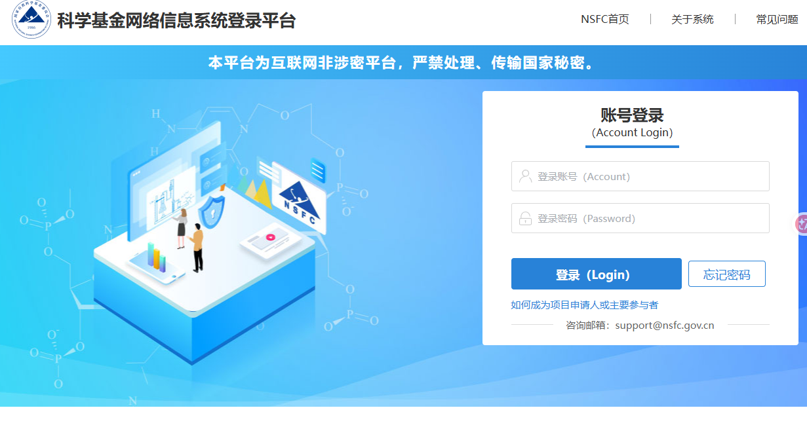

# 2027 年度国家自然科学基金青年科学基金项目（C 类）申请准备

> 2027 年正式通知尚未发布。本页以 2026 年规则建立准备基线；资格、项目期限、系统模板、申请代码、申报窗口和大连理工大学校内截止均须以 2027 年通知为准。

## 结论先行

| 事项 | 当前结论 |
|---|---|
| 2026 年申报 | 已于 **2026-03-20 16:00** 截止，现不能补报 |
| 2027 年定位 | **国家级独立科研申请主线，提前准备** |
| 个人匹配度 | 年龄、博士学位和在站博士后身份按 2026 年规则均匹配 |
| 当前优先级 | 先完成第 80 批面上资助，再建立青基申请底稿 |
| 系统账号 | **已确认没有账号；待力航学院或学校管理员创建“项目申请人”账号** |
| 最大风险 | 青基参考执行期为 3 年，现有两年制博士后合同不能覆盖完整项目期；须提前确认出站后的依托单位和项目变更规则 |

国家自然科学基金青年项目是独立资助渠道，不计入核心项目的三次条件性面上申报机会。若从 [[../../../piml-matrix-free-gpu/project-plan|博士后核心研究项目]] 派生申请，须重新论证三年执行期、独立科学问题和相对核心项目的新增内容，不直接复制第 80 批申请。

## 申报入口

- 申报系统：[科学基金网络信息系统](https://grants.nsfc.gov.cn)
- 当前状态：2027 年项目入口尚未开放。
- 账号状态：已确认没有账号；待依托单位管理员创建“项目申请人”账号，并核对大连理工大学依托关系和申请权限。
- 正式操作：当年系统及校内申请开放后，使用最新版申请书在线填写并提交至大连理工大学审核。

### 系统识别参考

> 截图记录的是 NSFC 科学基金网络信息系统登录页，不是中国博士后科学基金管理信息系统。登录页不提供申请人自行注册入口；新申请人账号由依托单位管理员创建。

## 账号开通

### 当前结论

- 何亮已确认此前没有科学基金网络信息系统账号，不再执行“忘记密码”找回。
- 首次申请人不能自行注册，应向依托单位管理员或获授权的二级单位管理员提供姓名、职称和邮箱，由管理员创建账号。
- 必须开通“项目申请人”身份；由其他申请人添加的“参与人”账号不能作为项目负责人填写申请书。

### 办理步骤

1. 联系力航学院科研学科办公室，申请创建“科学基金网络信息系统项目申请人账号”。
2. 提供姓名、所属学院、在站博士后身份和长期有效邮箱；“职称”字段由学院按大工人事口径确认，不自行猜测。
3. 收到系统激活邮件后设置密码，验证邮箱和手机号，并完善个人资料。
4. 登录后核对依托单位为“大连理工大学”、二级单位为“力学与航空航天学院”，且当前角色可以作为项目申请人。
5. 2027 年入口开放后，检查是否可以进入“申请与受理—项目申请—在线申请”。

### 联系方式

| 层级 | 联系人 / 部门 | 联系方式 | 用途 |
|---|---|---|---|
| 首选 | 力航学院科研学科办公室贾亚玲，A 字楼 104 | `0411-84708390`；`jiayl@dlut.edu.cn` | 查询并创建学院申请人账号，确认职称和二级单位口径 |
| 备选 | 大连理工大学科学技术研究院基金业务 | `0411-84708600`；`funddut@dlut.edu.cn` | 学院无法办理或需要学校管理员处理时咨询 |

邮件主题建议使用“申请开通 NSFC 项目申请人账号—何亮（力航学院博士后）”。邮件中只发送开户所需信息，不附身份证、合同等敏感材料；如管理员要求补充，再通过学校认可的渠道提交。

### 开通检查

- [x] 已确认没有既有账号。
- [ ] 已联系力航学院科研学科办公室。
- [ ] 已由管理员创建“项目申请人”账号。
- [ ] 已收到激活邮件并完成密码、邮箱和手机号设置。
- [ ] 已核对大连理工大学依托关系、力航学院二级单位和项目申请人角色。

## 2027 年申报流程

1. 等待 2027 年国家自然科学基金项目指南和大连理工大学校内通知发布，核验青基 C 类资格、限项和正式时间。
2. 登录科学基金网络信息系统，选择当年度“青年科学基金项目（C 类）”，使用系统提供的最新版申请书。
3. 填写个人信息、申请代码、研究属性、研究方案、代表性成果及系统要求的附件；不得用旧年度申请书直接定稿。
4. 在线提交至大连理工大学，按当年校内安排接受学院规范性审查和学校审核；如系统退回，修改后重新提交。
5. 学校审核通过后统一提交国家自然科学基金委员会；个人不能绕过依托单位直接报送。

## 个人资格预判

| 条件 | 2026 年官方口径 | 何亮现状 | 当前判断 |
|---|---|---|---|
| 年龄 | 男性申请当年 1 月 1 日未满 35 周岁 | 1998 年出生 | **符合参考规则** |
| 学位 / 职称 | 具有高级职称、博士学位，或由 2 名同领域高级职称人员推荐 | 2026 年取得博士学位 | **符合参考规则** |
| 博士后身份 | 在站博士后研究人员可以申请 | 2026-07-22 进入大连理工大学博士后科研流动站 | **符合参考规则** |
| 研究基础 | 具有从事基础研究的经历 | 已形成计算力学、结构优化、PIML 与 Matrix-Free 研究基础 | **匹配，需用成果证明** |
| 重复资助 | 作为负责人只能获得 1 次青年科学基金项目（C 类）资助 | 既往资助记录待系统最终核验 | **当前未发现冲突** |
| 系统与依托单位 | 通过依托单位在科学基金网络信息系统提交 | 依托单位拟为大连理工大学 | **账号、申请代码和校内流程待 2027 年确认** |

## 三年执行期与两年合同

2026 年管理规则明确，青年科学基金项目（C 类）资助期限为 3 年；在站博士后申请获批后，项目期限按项目类型生成，不能为了匹配博士后聘期自行缩短。

何亮现有合同预计于 2028-07-22 左右届满。若 2027 年申报项目仍按上一年度规则在下一年度开始执行，项目可能跨越出站时间。该情况**不等于当前不能申报**，但正式提交前必须闭合以下事项：

1. 大连理工大学是否接受剩余聘期不足 3 年的在站博士后申报。
2. 出站后留校、转入新单位或变更依托单位时，项目能否继续执行及需要什么手续。
3. 申请书中的研究条件、人员安排和经费执行如何覆盖完整项目期。
4. 若后续单位尚未确定，学校是否建议延后申报或提供其他合规安排。

在这些问题确认前，状态统一写为“**资格高匹配，项目执行与依托衔接待确认**”，不写成已经完全符合。

## 需要准备的材料

| 材料 | 当前动作 |
|---|---|
| 2027 年最新版申请书 | 正式模板发布后在系统填写；不沿用 2026 旧模板定稿 |
| 个人简历和研究基础 | 整理教育经历、研究经历、本人贡献及代表性成果 |
| 科学问题与研究方案底稿 | 形成目标、内容、路线、创新点、年度计划和预期成果的可复用文本 |
| 申请代码与学科归属 | 结合“力学—计算力学”和具体科学问题选择，提交前请学院核验 |
| 三年执行与依托衔接说明 | 记录现合同截止日期、出站安排及可能的依托单位变更方案 |
| 科研诚信、伦理和科技安全材料 | 仅在项目实际涉及且当年系统要求时准备 |
| 系统账号和单位信息 | 已确认没有账号；现在联系力航学院管理员创建申请人账号，激活后核对大工依托关系 |

## 监测与行动节点

| 时间 / 触发点 | 动作 |
|---|---|
| 2026-07-28 起 | 联系力航学院科研学科办公室申请创建项目申请人账号，并完成激活与依托关系核对 |
| 2026 年 8 月 | 优先完成第 80 批面上资助 |
| 2026 年 9—11 月 | 整理代表性成果，形成青基科学问题和三年任务底稿 |
| 自 2026 年 12 月起 | 关注国家自然科学基金委 2027 年项目指南和大工校内通知 |
| 2027 年指南发布后 | 当日核验年龄、博士后申请规则、执行期、限项和申请书结构 |
| 校内通知发布后 | 确认内部截止、申请代码、学院审核及合同—项目期衔接 |
| 系统开放后 | 使用当年模板填写并预留学院、学校退回修改时间 |

上一年度集中接收窗口为 2026-03-01 至 2026-03-20；该节奏只能用于提前排期，**不能写成 2027 年正式申报日期**。

## 2027 年提交前检查

- [ ] 2027 年项目指南和校内通知已发布。
- [ ] 年龄、在站博士后身份和限项规则仍符合。
- [ ] 科学基金网络信息系统账号及大工依托关系有效。
- [ ] 申请代码和学科归属已经学院核验。
- [ ] 三年执行期与出站后依托衔接已有明确方案。
- [ ] 使用 2027 年最新版申请书，研究属性及全部字段填写完整。
- [ ] 与第 80 批面上资助、国资计划和省级项目不存在内容重复或当年限项冲突。

## 参考依据

| 资料 | 用途 |
|---|---|
| [国家自然科学基金 2026 年项目申请与结题等工作通知](https://www.nsfc.gov.cn/p1/3381/2824/99667.html) | 上一年度申报窗口、系统和申请书要求参考 |
| [青年科学基金项目（C 类）申请条件](https://www.nsfc.gov.cn/p1/2961/2962/3643/tj.html) | 年龄、学位、博士后身份和重复资助规则参考 |
| [青年科学基金项目管理办法](https://www.nsfc.gov.cn/p1/2871/2874/2882/136725.html) | 3 年资助期限及项目管理规则参考 |
| [NSFC 信息系统常见问答](https://www.nsfc.gov.cn/p1/2961/2962/3645/xt.html) | 首次申请人开户、参与人账号、密码找回和单位变更规则 |
| [申请人和参与人添加流程图解](https://grants.nsfc.gov.cn/egrantres/template/person/%E7%94%B3%E8%AF%B7%E4%BA%BA%E5%92%8C%E5%8F%82%E4%B8%8E%E4%BA%BA%E6%B7%BB%E5%8A%A0%E6%B5%81%E7%A8%8B%E5%9B%BE%E8%A7%A3.pdf) | 依托单位管理员创建申请人账号的官方图解 |
| [大连理工大学科研管理联络网](https://scidep.dlut.edu.cn/jgsz/kyglllw.htm) | 力航学院科研秘书工作联系方式 |
| [大连理工大学 2026 年 NSFC 申报通知](https://scidep.dlut.edu.cn/info/1108/71103.htm) | 学校基金业务联系方式及上一年度校内审核流程参考 |
