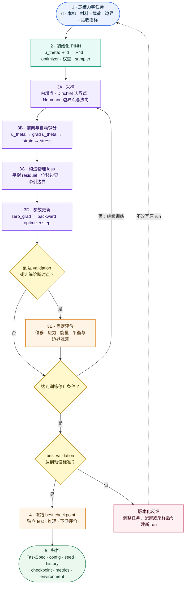

# PINN 机器学习全过程：小变形静力线弹性问题

> **定位**：本页将 [[machine-learning-workflow]] 的通用完整生命周期实例化为小变形、静力、各向同性线弹性 PINN。二维平面应力、二维平面应变和三维不是三套工作流，而是同一流程的物理配置；一次具体训练只能冻结其中一种配置。
>
> **状态**：本页是方法与实施契约。SOPTX 已建立并实际运行二维平面应变、全 Dirichlet 的阶段原型；其分类、实现边界与证据入口见“附录 A”。该原型只证明当前训练链可以执行，不等于本页规定的混合边界、独立 test 和精度门禁均已完成。
>
> **边界**：本页学习的是给定边值问题的位移解场，不是 Problem-Independent PIML；PIML 学习对象与计算角色见 [[../../concepts/piml/ml-roles-and-boundaries]]。

## 一、线弹性 PINN 训练链及其在完整生命周期中的位置

本页实例化通用流程中的任务定义、训练信号、输入输出契约、模型、objective、训练控制、评价与归档。下图描述其中的力学训练链；独立 validation/test、checkpoint、环境冻结和产物归档仍以 [[machine-learning-workflow]] 为规范。



二维与三维共享这条链。维数影响输入输出、张量分量、边界几何和计算成本，但不改变“采样 → 自动微分 → residual → loss → 更新 → 评价”的角色分工。

## 二、统一的力学任务定义

设弹性体区域为 $\Omega\subset\mathbb R^d$，其中 $d\in\{2,3\}$；边界分解为互不相交的 $\Gamma_D$ 与 $\Gamma_N$。在体力 $\boldsymbol b$、给定位移 $\bar{\boldsymbol u}$ 和给定牵引 $\bar{\boldsymbol t}$ 下，强形式为

$$
-\nabla\cdot\boldsymbol\sigma(\boldsymbol u)
=
\boldsymbol b
\quad\text{in }\Omega,
$$

$$
\boldsymbol u=\bar{\boldsymbol u}
\quad\text{on }\Gamma_D,
\qquad
\boldsymbol\sigma\boldsymbol n=\bar{\boldsymbol t}
\quad\text{on }\Gamma_N.
$$

本页固定小应变与各向同性线弹性：

$$
\boldsymbol\varepsilon(\boldsymbol u)
=
\frac12\left(
\nabla\boldsymbol u+
\nabla\boldsymbol u^{\mathsf T}
\right),
\qquad
\boldsymbol\sigma
=
2\mu\boldsymbol\varepsilon
+
\lambda\operatorname{tr}(\boldsymbol\varepsilon)\mathbf I.
$$

其中 Lamé 参数由 Young 模量 $E$ 和 Poisson 比 $\nu$ 决定。连续模型、边界分解和有限元对照的详细理论见 [[../../concepts/linear-elasticity]]。

上式直接对应三维本构；二维 `plane_strain` 以 $\varepsilon_{zz}=0$ 采用其受限形式，二维 `plane_stress` 则必须采用满足 $\sigma_{zz}=0$ 的约化本构矩阵，不能简单把三维公式中的坐标删去。

### 2.1 每个 run 必须冻结的配置

| 配置 | 必须明确的内容 |
|---|---|
| 空间与分析类型 | $d=2$ 或 $d=3$；二维时选定 `plane_stress` 或 `plane_strain` |
| 材料 | $E$、$\nu$、均匀性及单位系统 |
| 几何与载荷 | $\Omega$、$\boldsymbol b$、$\Gamma_D$、$\Gamma_N$、$\bar{\boldsymbol u}$、$\bar{\boldsymbol t}$ |
| 网络 | 输入/输出维数、隐藏层、激活函数、初始化与 dtype |
| 采样 | 内部点与两类边界点的数量、模式、随机 seed 和法向来源 |
| loss | 各 residual 的归一化方式和权重 |
| 验收 | validation/test 协议、参考解、位移/应力/能量/平衡指标与阈值 |

`plane_stress` 与 `plane_strain` 可以共存于本工作流文档，但不能混在同一个 run：两者采用不同的二维本构矩阵，参考解、牵引和评价也必须一致。

## 三、PINN 的输入、输出与自动微分链

网络以空间坐标为输入并输出同维位移：

$$
\boldsymbol x\in\mathbb R^d
\longmapsto
\boldsymbol u_\theta(\boldsymbol x)\in\mathbb R^d.
$$

自动微分依次产生

$$
\boldsymbol u_\theta
\longrightarrow
\nabla\boldsymbol u_\theta
\longrightarrow
\boldsymbol\varepsilon_\theta
\longrightarrow
\boldsymbol\sigma_\theta
\longrightarrow
\nabla\cdot\boldsymbol\sigma_\theta.
$$

与一维 Poisson PINN 一样，参数梯度和空间导数都依赖自动微分；不同之处是这里需要对多个位移分量求一阶、二阶空间导数，再按本构关系组合。自动微分图必须保留到平衡 residual 对网络参数反向传播完成为止。

### 3.1 三类配点

| 点集 | 记号 | 训练用途 |
|---|---|---|
| 内部配点 | $X_\Omega\subset\Omega$ | 平衡 residual |
| 位移边界配点 | $X_D\subset\Gamma_D$ | Dirichlet residual |
| 牵引边界配点 | $X_N\subset\Gamma_N$，附法向 $\boldsymbol n$ | Neumann residual |

二维的 $\Gamma_D$、$\Gamma_N$ 是边界线段；三维中它们是边界曲面。牵引条件必须使用与边界点相同的外法向，不能把内部点或未定向的表面点直接当作牵引样本。

## 四、residual 与 loss

在内部配点上定义平衡 residual：

$$
\boldsymbol r_{\mathrm{eq}}
=
\nabla\cdot\boldsymbol\sigma_\theta
+
\boldsymbol b.
$$

在两类边界上分别定义：

$$
\boldsymbol r_D
=
\boldsymbol u_\theta-\bar{\boldsymbol u},
\qquad
\boldsymbol r_N
=
\boldsymbol\sigma_\theta\boldsymbol n-\bar{\boldsymbol t}.
$$

最小 physics-informed 目标为

$$
\mathcal L
=
w_{\mathrm{eq}}\operatorname{MSE}(\boldsymbol r_{\mathrm{eq}},\boldsymbol0)
+w_D\operatorname{MSE}(\boldsymbol r_D,\boldsymbol0)
+w_N\operatorname{MSE}(\boldsymbol r_N,\boldsymbol0).
$$

若 $\Gamma_N$ 为空，可以省略第三项；若没有足够的位移约束，连续问题存在刚体模态，PINN 也不会有唯一目标解。不能仅依靠 loss 权重“消除”刚体模态，必须在边界条件或额外约束中明确处理。

不同 loss 的量纲和数值尺度通常不同。首个基线应先固定坐标、位移、材料和载荷的无量纲化或归一化策略，再记录损失权重；不要只因某一项数值较大而临时调整权重并继续沿用同一个 run 名称。

## 五、训练、评价与完整工程门禁

每个 train batch 的参数更新骨架仍是：

```text
采样 X_Ω、X_D、X_N
→ zero_grad
→ forward 与自动微分
→ r_eq、r_D、r_N 与 weighted loss
→ backward
→ optimizer.step
```

训练 loss 下降只说明当前配点和当前加权 objective 被降低。至少还应在冻结协议上评价：

| 层次 | 建议指标 |
|---|---|
| 位移 | 相对 $L^2$ error、关键点位移误差 |
| 应力/应变 | 应力或应变误差、关键分量峰值误差 |
| 物理一致性 | 内部平衡 residual、Dirichlet/Neumann 违约量、刚体模态检查 |
| 能量 | 应变能或总势能误差 |
| 工程流程 | validation 选择的 checkpoint、独立 test、推理时间、配置与环境归档 |

若使用制造解，解析位移只能用于边界条件、validation/test 和最终评价；它不能静默变成内部点监督标签。若使用 FEM 作为参考，必须冻结网格、单元、数值积分、材料、边界条件和误差定义。

## 六、二维与三维是配置，不是两套工作流

| 项目 | 二维配置 | 三维配置 |
|---|---|---|
| 空间与输出 | $(x,y)\mapsto(u,v)$ | $(x,y,z)\mapsto(u,v,w)$ |
| 本构选择 | `plane_stress` 或 `plane_strain` | 三维各向同性本构 |
| Voigt 分量 | 3 个应变/应力分量 | 6 个应变/应力分量 |
| 边界几何 | 线段与外法向 | 曲面与外法向 |
| 平衡方程 | 2 个分量 | 3 个分量 |
| 主要新增成本 | 边界分类与二维本构选择 | 更多二阶导数、显存、曲面采样和三维参考解 |

流程图、训练控制、checkpoint 选择、独立 test 和归档职责不随 $d$ 改变。具体 run 必须把上述表的一列固化为 `TaskSpec` 与配置文件，不能让模型在训练中隐式切换维数或本构假设。

## 七、推荐的首个实例与三维扩展

首个可运行基线建议取二维单位正方形、各向同性材料、`plane_stress`、解析制造解和混合 Dirichlet/Neumann 边界。该选择与现有二维结构拓扑优化和后续局部刚度/PIML 研究的平面应力语境一致，同时能验证位移边界、牵引边界与平衡 residual 三者。

三维扩展不需要新建另一套训练流程：将配置改为 $d=3$、三维本构、体内/曲面采样和三维参考解，并重新冻结计算预算、batch、validation/test 与验收阈值。由于二阶自动微分和曲面采样成本显著上升，三维结论不能从二维结果直接外推。

当前 SOPTX 阶段原型采用二维 `plane_strain` 与全 Dirichlet 边界，尚未实现本节推荐的 `plane_stress`、混合 Dirichlet/Neumann 基线。三维扩展也尚未建立。代码、环境、测试、checkpoint 和数值结论必须继续以实现仓库的事实及可重放产物为准。

## 八、与 Poisson PINN 和 PIML 的关系

| 一维 Poisson PINN | 小变形静力线弹性 PINN |
|---|---|
| 标量输入 $x$、标量输出 $u_\theta$ | $d$ 维坐标输入、$d$ 维位移输出 $\boldsymbol u_\theta$ |
| 二阶导数形成 Laplacian | 位移梯度形成应变、应力和应力散度 |
| PDE residual 与 Dirichlet residual | 平衡、Dirichlet 与 Neumann residual |
| 标量 $L^2$ error | 位移、应力、能量和边界一致性指标 |

两者都学习给定边值问题的解场，因此都属于 PINN。PIML 则学习可嵌入有限元分析的局部力学表示，不能因两者都使用神经网络、自动微分或线弹性方程而混为同一学习对象。

## 九、读者验收问题

读完本页应能回答：

1. 为什么 $d=2$ 与 $d=3$ 可以共用一条 PINN 训练工作流；
2. 为什么 `plane_stress` 与 `plane_strain` 可以共存于文档、却不能混在同一个 run；
3. 如何从 $\boldsymbol u_\theta$ 经自动微分得到 $\boldsymbol r_{\mathrm{eq}}$；
4. 为什么 Neumann 配点必须携带外法向；
5. 为什么刚体模态必须通过边界条件或额外约束处理；
6. 训练 loss、validation/test 与下游评价各自回答什么问题；
7. 为什么二维结果不能直接作为三维性能结论；
8. 为什么该工作流仍是 PINN，而不是 PIML。

## 附录 A：当前 SOPTX 实例映射

当前实现入口为
`soptx:examples/pinn_linear_elasticity_2d/README.md`，核心模型位于
`soptx:examples/pinn_linear_elasticity_2d/model.py`。它对本页方法契约的实例化为：

| 分类维度 | 当前 SOPTX 实例 |
|---|---|
| 神经网络架构 | 默认采用 `Tanh` MLP：$2\to32\to32\to16\to2$ |
| 学习对象 | 函数学习：$(x,y)\mapsto(u_x,u_y)$，针对一个固定边值问题 |
| 训练范式 | PINN：平衡 residual 与全 Dirichlet residual 的加权 MSE |
| 物理配置 | 二维、小变形、静力、各向同性、`plane_strain`、全 Dirichlet |
| 任务目标 | 近似求解制造解问题的位移场 |
| 评价方式 | 固定配点 residual validation；解析位移分量和合成 $L^2$ error 诊断 |

当前实例默认 loss 权重为 $(w_{\mathrm{eq}},w_D)=(1,30)$。解析解用于生成
Dirichlet 边界值及误差诊断，不作为内部配点的监督标签。训练入口已经运行至预设更新次数，
训练 loss 与固定 validation loss 均下降且未再触发自动微分异常；这只构成训练链冒烟证据，
不构成精度、独立 test、混合边界、平面应力或三维能力验收。

本附录只维护研究方法与当前实现之间的映射。可变的默认层数、采样数、优化器、checkpoint
行为和运行命令以 SOPTX README 与源码为权威事实源。

正确性验证驱动位于
`soptx:examples/pinn_linear_elasticity_2d/validate.py`；门禁、运行命令和结果摘要统一由
`soptx:examples/pinn_linear_elasticity_2d/README.md` 维护，不另建验证说明页或提交运行
产物。2026-07-29 用户已在 Python 3.12.13、PyTorch 2.13.0+cu130、CPU、`float64`
环境执行默认 2000 次参数更新；制造解一致性、程序契约、best validation loss 和相对位移
$L^2$ error 门禁均通过。随后在 SOPT-X Git revision
`40a2f83e8358b5b24c8be7d0bee2e1d3a5bab84e` 的干净 detached worktree 中复跑，得到
`dirty=False`、`validation status: passed`，数值结果与首次运行一致；该 revision 已形成
当前二维平面应变、全 Dirichlet 制造解基线的正式可重放证据。
