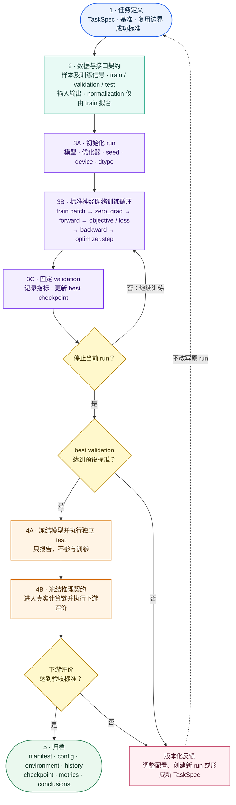

# 机器学习全过程：从任务定义到下游评价

> **定位**：本页描述一个机器学习任务从研究问题、训练信号、模型和优化到独立测试、推理、下游评价与结果归档的通用生命周期。它不绑定监督学习、PINN、PIML、某种网络或某个软件框架。
>
> **使用方式**：具体方法页应引用并实例化本页，而不是复制本页。一维 Poisson PINN 的训练流程见 [[pinn-machine-learning-workflow]]；当前软件实现映射仅作为该页附录证据。
>
> **分类边界**：本页回答机器学习项目如何形成可重放闭环；网络架构、函数／算子学习、PINN 等训练范式与任务目标的分类见 [[../../concepts/machine-learning]]。两者是正交视角。

## 一、完整生命周期

一个完整机器学习项目不是“定义网络并调用 `optimizer.step()`”，而是以下环节组成的可追溯闭环：



这张图同时表示三个层次：阶段 1–2 定义机器学习项目，紫色节点构成标准神经网络参数优化循环，阶段 4–5 负责泛化评价、实际使用和归档。监督学习、PINN 和 PIML 可以共享 `zero_grad → forward → loss → backward → optimizer.step` 骨架，主要区别在于样本、训练信号和 objective 的构造。

颜色用于区分任务定义、数据、训练、评价、决策门禁、冻结产物和反馈节点。图中的实线表示当前 run 的推进与训练循环，虚线表示形成新版本后的研究反馈。`validation` 可以选择 checkpoint，并在当前 run 结束后支持新 run 的配置调整；独立 `test` 只能报告冻结模型的泛化结果，不能反向参与调参。每个箭头都必须有明确的输入、输出和冻结条件。任何环节依赖未记录的人工操作，都会削弱结果的可重放性。

## 二、任务定义

训练前首先回答“要学习什么”，而不是先选择网络。

### 2.1 最小任务契约

| 项目 | 必须回答的问题 |
|---|---|
| 学习对象 | 模型预测的是类别、标量、场、矩阵、算子、概率分布还是控制量？ |
| 输入 | 推理时真实可获得的信息是什么？ |
| 输出 | 输出的 shape、dtype、单位、顺序和约束是什么？ |
| 训练信号 | 标签、物理 residual、能量、重构目标还是混合目标？ |
| 使用位置 | 模型替代、加速或辅助计算链中的哪一步？ |
| 复用边界 | 哪些几何、载荷、材料、参数范围或数据分布被固定？ |
| 基准 | 与什么真值、传统算法、简单模型或消融对比？ |
| 下游目标 | 局部误差最终会影响什么科学或工程量？ |
| 失败代价 | 错误预测可否检测、拒绝或回退？ |

任务定义应形成一个稳定的 `TaskSpec`。训练中发现目标定义错误时，应创建新实验配置，而不是静默改变当前 run 的语义。

### 2.2 先冻结成功标准

成功标准至少包含三层：

1. **训练层**：loss 数值稳定、无 NaN/Inf、优化过程可诊断；
2. **模型层**：validation/test 指标达到预先约定的基准；
3. **下游层**：模型进入真实计算链后，关键结果和成本满足要求。

Training loss 下降只证明优化器降低了当前 objective，不等于模型泛化，也不等于下游任务成功。

## 三、样本与训练信号

“数据”不应只理解为带标签表格。更通用的对象是：

$$
\text{sample}
+
\text{training signal}
+
\text{metadata}.
$$

| 训练范式 | sample | training signal |
|---|---|---|
| 监督学习 | 输入样本 | 真值标签 |
| 自监督学习 | 原始样本及其变换 | 由样本内部结构构造的目标 |
| PINN | 空间/时间/参数配点 | PDE、初边值条件 residual 或观测数据 |
| 能量训练 | 状态、边界或随机试探场 | 能量、势能或变分目标 |
| PIML 局部表示学习 | 局部材料或几何描述 | 精确局部表示标签或 mechanics-based objective |

### 3.1 样本生成契约

必须记录：

- 数据来源或生成算法；
- 采样分布和参数范围；
- sample id 与随机 seed；
- 真值算法、数值容差和失败样本处理；
- 单位、坐标、方向和离散约定；
- 数据版本或 generator revision；
- 数据增强及其物理含义。

不能静默丢弃难样本。失败、异常和越界样本应保留可追溯原因，否则最终训练分布会被无意改变。

### 3.2 覆盖范围

样本应覆盖推理阶段声明的适用域，包括：

- 常见区域；
- 边界和极端区域；
- 高梯度、高对比或稀有区域；
- 预期会触发回退的区域。

如果推理输入超出训练分布，模型输出即使数值有限也不自动可信。

## 四、数据划分与评价协议

### 4.1 Train、validation、test 的职责

| 集合 | 可以用于什么 | 不能用于什么 |
|---|---|---|
| train | 参数更新、训练期统计量拟合 | 最终泛化结论 |
| validation | 超参数、early stopping、best checkpoint 选择 | 反复调参后的无偏最终评价 |
| test | 模型和决策冻结后的一次独立评价 | 模型选择和超参数调整 |

划分必须在训练前写入 manifest。相关样本、同源切片、时间相邻段、同一仿真的派生量或增强副本应按 group 划分，不能跨 split 泄漏。

### 4.2 不依赖固定标签数据集的情况

对于动态采样或 physics-informed 训练，划分对象不一定是静态数据行。仍需冻结：

- train sampler 的分布与 seed 策略；
- 固定 validation 点集或问题集合；
- 独立 test 点集、参数域或边值问题集合；
- 各集合使用的真值或 residual 评价方法。

“每轮重新采样”不能代替 validation/test 分离。

### 4.3 评价协议先于结果

训练前定义：

- 主指标和辅助指标；
- reduction：mean、median、quantile、worst case；
- 绝对误差、相对误差及其分母；
- 数值容差与零值处理；
- checkpoint 选择的唯一主指标；
- test 的执行次数；
- 下游算例和对照路径。

看到结果后再选择最有利的指标，会引入选择偏差。

## 五、输入输出契约与预处理

### 5.1 输入输出契约

每个张量或结构至少明确：

| 属性 | 示例 |
|---|---|
| shape | `(batch, features)`、`(batch, nx, ny)` |
| dtype | `float32`、`float64` |
| device | CPU、CUDA device |
| 单位 | 无量纲、Pa、m |
| 顺序 | feature、节点、单元、DOF 或通道顺序 |
| 坐标与方向 | 全局/局部坐标，旋转和镜像约定 |
| 有效范围 | 物理上下界、合法类别 |
| 结构约束 | 对称、正定、守恒、边界值或概率归一 |

数据生成、训练、checkpoint 加载和推理必须共享同一契约。

### 5.2 预处理与归一化

- 只用 train 数据拟合统计量；
- validation/test 只应用冻结的变换；
- 推理必须使用 checkpoint 配套的同一变换；
- 物理量优先采用有明确意义的无量纲化或固定参考尺度；
- 不应对每个样本单独缩放会影响任务语义的绝对量；
- 必须提供逆变换并验证 round trip。

预处理参数属于模型产物，不是可由使用者猜测的外部知识。

## 六、模型与 objective

### 6.1 模型选择

模型由任务结构决定，而不是由流行程度决定。至少评估：

- 输入与输出维度；
- 局部、序列、图或算子结构；
- 必须硬保证的约束；
- 所需数据量与标签成本；
- 训练和推理复杂度；
- 部署 device、batch 和内存限制；
- 是否需要梯度、灵敏度或不确定度。

在复杂模型之前建立简单基线，例如常数/均值、线性模型、小型 MLP 或传统数值方法。

### 6.2 Objective、loss 与 metric

- **objective/loss**：用于反向传播和参数更新；
- **training metric**：描述训练过程，不一定参与梯度；
- **validation metric**：选择 checkpoint 和超参数；
- **test metric**：冻结模型后的泛化评价；
- **downstream metric**：模型进入真实计算链后的影响。

这五者可以不同，但必须明确关系。

混合 loss 写为

$$
\mathcal L
=
\sum_{k=1}^{m}w_k\mathcal L_k.
$$

每一项应记录量纲、归一化、权重、reduction 和数值尺度。权重不能只凭“总 loss 看起来下降”选择。

### 6.3 硬约束与软约束

- 能通过输出参数化严格满足的约束，优先考虑硬保证；
- 难以参数化的性质可作为 penalty 或评价门禁；
- 后处理修正必须计入推理时间并重新评价误差；
- 任何安全或物理约束失败都应有拒绝或回退路径。

## 七、训练控制

### 7.1 基本对象

训练开始前构造并记录：

- model 与初始化方法；
- optimizer；
- scheduler；
- batch/sampler；
- objective；
- metric accumulators；
- checkpoint manager；
- seed 和确定性设置；
- device 与 dtype。

### 7.2 Step、batch 与 epoch

- **batch**：一次参数更新使用的样本集合；
- **step/update**：一次 `optimizer.step()`；
- **epoch**：通常指训练集的一次完整遍历。

对于无限流或动态 sampler，epoch 可能只是人为规定的若干 steps。文档和日志必须记录实际更新次数，不能只写含义不清的 epoch。

### 7.3 通用训练循环

```text
load frozen config and manifests
set seed, device and dtype
build preprocessing, model, optimizer and scheduler

for each update:
    obtain train batch or collocation samples
    zero gradients
    run forward pass
    build objective
    run backward pass
    inspect/clip gradients if configured
    optimizer step
    scheduler step at the defined frequency
    record train metrics

    if validation is due:
        switch to evaluation semantics
        evaluate the complete fixed validation protocol
        save best checkpoint if the primary metric improves

save last checkpoint
freeze the selected checkpoint
run the independent test protocol once
run downstream evaluation
archive artifacts and conclusions
```

### 7.4 训练期诊断

至少记录：

- 总 loss 与各分项；
- validation 主指标；
- learning rate；
- 梯度范数；
- step/epoch；
- 数据或采样耗时；
- forward、backward 和 validation 耗时；
- NaN/Inf、OOM、异常 batch 和恢复动作。

只保存一张最终曲线不足以诊断训练失败。

## 八、validation、checkpoint 与 test

### 8.1 Best 与 last checkpoint

- `best`：validation 主指标最优的模型，用于最终 test；
- `last`：训练最后状态，用于诊断和恢复训练；
- 二者不能默认相同。

checkpoint 至少保存：

```text
model state
optimizer state
scheduler state
preprocessing / normalization state
step and epoch
best metric
resolved config or config hash
random state when exact resume is required
```

加载 checkpoint 后，应验证一次输入输出契约和最小推理样本。

### 8.2 Early stopping

Early stopping 需要冻结：

- 监控指标；
- 改善方向；
- `min_delta`；
- patience；
- validation 频率；
- 恢复 best 还是保留 last。

### 8.3 独立 test

Test 必须在模型、预处理、阈值和 checkpoint 选择全部冻结后执行。若根据 test 结果继续修改模型，该 test 已转化为开发集，必须准备新的独立 test。

## 九、推理与下游评价

### 9.1 推理契约

推理入口至少规定：

- 合法输入及 batch 约定；
- 预处理和逆变换；
- 输出结构检查；
- 分布外或低置信输入处理；
- 失败、拒绝和精确回退；
- latency、throughput 和 peak memory 的测量边界。

训练脚本能前向运行，不等于模型已经可部署。

### 9.2 下游评价

模型输出通常只是中间量。评价链应写成

$$
\text{model error}
\longrightarrow
\text{downstream state error}
\longrightarrow
\text{objective / decision error}
\longrightarrow
\text{cost and risk}.
$$

例如：

- 分类概率误差 → 决策错误与代价；
- 场预测误差 → 守恒量或响应误差；
- 局部算子误差 → 全局解、目标和灵敏度误差；
- 代理模型误差 → 优化轨迹和最终设计差异。

模型指标与下游指标不一致时，应以后者决定是否可用。

## 十、可重放产物

一次正式 run 建议至少生成：

```text
run/
├─ config.yaml
├─ environment.json
├─ data-manifest.json
├─ history.csv
├─ checkpoint-best.*
├─ checkpoint-last.*
├─ metrics-validation.json
├─ metrics-test.json
└─ run-summary.md
```

| 产物 | 最小内容 |
|---|---|
| `config.yaml` | 解析后的 Task/Data/Model/Objective/Train/Eval 配置 |
| `environment.json` | Python、依赖、revision、工作树、device、dtype |
| manifest | split、sample id、生成版本与校验信息 |
| history | step、loss 分项、validation、learning rate、时间 |
| checkpoint | 模型及恢复/推理所需状态 |
| metrics | 机器可读的 validation/test/downstream 结果 |
| summary | 结论、限制、异常与产物索引 |

终端输出和截图只能辅助阅读，不能取代机器可读产物。

## 十一、可复现性层级

应分别声明：

1. **同一进程可重复**：同一初始化和输入得到同一输出；
2. **同环境重复运行**：同配置和 seed 的独立 run 在约定容差内一致；
3. **干净环境重建**：从依赖和 revision 可以重新运行；
4. **跨硬件/软件复现**：在允许的数值容差内得到同一结论。

GPU、并行归约和部分算子可能不保证逐位确定性。此时应记录非确定来源和数值容差，而不是笼统声称“完全可复现”。

## 十二、常见失败及诊断顺序

| 现象 | 优先检查 |
|---|---|
| loss 不下降 | 数据/采样、目标符号、shape、梯度、学习率 |
| loss 下降但 validation 变差 | 泄漏、过拟合、分布差异、预处理状态 |
| validation 好但 test 差 | 反复调参、test 分布变化、group 泄漏 |
| 局部指标好但下游结果差 | 指标与任务错位、误差放大、结构性质破坏 |
| 重复运行差异大 | seed、初始化、动态采样、非确定算子、环境漂移 |
| checkpoint 加载结果不一致 | 预处理、model mode、dtype/device、配置不匹配 |
| 推理速度不达标 | 数据搬运、batch、后处理、同步和测量边界 |

诊断顺序应从数据和任务语义开始，再到数值实现和模型容量，避免首先增加网络复杂度。

## 十三、具体方法如何实例化本页

| 通用环节 | 监督学习 | PINN | Problem-Independent PIML |
|---|---|---|---|
| sample | 输入样本 | PDE/初边值配点 | 局部材料或几何描述 |
| training signal | 真值标签 | residual、边界/初值、可选观测 | 局部表示真值或力学 objective |
| model output | 任务标签/响应 | 特定问题的解场 | 可复用局部形函数、刚度或算子 |
| validation | 固定标注集 | 固定点集/问题集上的解与 residual | 固定局部样本的表示和结构指标 |
| downstream | 分类、回归或决策任务 | PDE 解的物理量 | 全局分析、灵敏度和优化 |

当前实例化关系为：

```text
machine-learning-workflow.md
├─ pinn-machine-learning-workflow.md
│  └─ 一维 Poisson PINN
└─ linear-elasticity-pinn-machine-learning-workflow.md
   └─ 小变形静力线弹性 PINN（二维/三维配置）
```

线弹性 PINN 已由 [[linear-elasticity-pinn-machine-learning-workflow]] 作为独立方法页实例化；PIML 或其他方法也应分别实例化本页，不在 Poisson 页面中混合多个学习对象。

## 十四、完成判据

一项机器学习工作只有同时满足以下条件，才能标记为完成：

1. 任务、输入输出和适用边界明确；
2. 样本、训练信号和划分可追溯；
3. 预处理、模型、objective 和更新次数可复述；
4. validation 选择规则和 best checkpoint 明确；
5. 独立 test 未参与调参；
6. 推理契约、结构检查和失败处理明确；
7. 下游评价通过预先定义的门禁；
8. 配置、环境、history、checkpoint 和 metrics 已归档；
9. 结论与证据边界一致，不把训练曲线等同于最终能力。

缺少其中任何关键环节时，应明确标记为原型、冒烟验证、局部证据或待复核，而不是完整机器学习闭环。

## 十五、关联页面

- [[pinn-machine-learning-workflow]] — 一维 Poisson PINN 对本流程的实例化；当前软件源码映射见其附录。
- [[linear-elasticity-pinn-machine-learning-workflow]] — 小变形静力线弹性 PINN 的维数参数化实例；二维与三维是配置，不是重复工作流。
- [[../../concepts/piml/ml-roles-and-boundaries]] — 按学习对象和计算角色区分 PINN、Problem-Independent PIML 等路线。
- [[../technical-lines/piml-research-guide]] — PIML 技术线的能力、阶段和门禁；其训练工具链阶段引用 PINN 实例，但不把 PINN 结果计作 PIML 能力。
