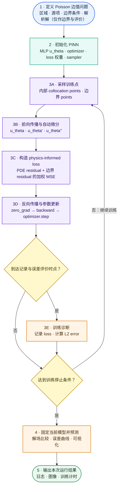

# PINN 机器学习全过程：一维 Poisson 问题

> **定位**：本页是 [[machine-learning-workflow]] 的一维 Poisson PINN 实例，说明 PINN 如何从数学问题、配点采样、网络前向、自动微分和物理约束 loss 出发，完成参数更新、误差评价和可视化。该训练逻辑不依赖特定软件包；当前实现的源码映射与运行证据集中在附录 A。
>
> **边界**：该程序用 PINN 学习一个给定 Poisson 边值问题的解场，不是 Problem-Independent PIML。解析解函数在边界点被 `dirichlet()` 复用以提供已知边界数据，并用于误差评价和绘图；它没有作为内部配点上的监督标签。二者的学习对象和计算角色区别见 [[../../concepts/piml/ml-roles-and-boundaries]]。

## 一、Poisson PINN 训练链及其在完整生命周期中的位置

本节将 [[machine-learning-workflow]] 中的任务定义、训练信号、模型、objective、训练控制和训练诊断实例化为一维 Poisson PINN。下图只描述当前实现已经覆盖的训练链，不等同于完整工程闭环；固定 seed、独立 validation、checkpoint、独立 test 与结果归档等门禁由第九节按通用生命周期对照说明。



这是一条 physics-informed 解场训练链。训练数据不是预先保存的 $(x,u_{\mathrm{true}})$ 标签对，而是计算域中的配点及这些点上应满足的控制方程和边界条件。图中的 3A–3E 是同一个训练循环内的连续步骤：每轮更新参数后，程序根据记录频率决定是否计算 $L^2$ error；未达到停止条件时重新采样并进入下一轮。

因此，这张图是通用完整生命周期的 Poisson PINN 训练层实例，而不是当前实现已经覆盖全部生命周期的声明。validation、checkpoint、独立 test 与归档仍以 [[machine-learning-workflow]] 为规范，并在第九节列出当前缺口；实现映射与运行证据见附录 A。

## 二、默认 Poisson 数学问题

当前实现以参数 `pde=1` 选择这一默认问题；具体类与函数映射见附录 A。问题定义为

$$
-u''(x)=f(x),
\qquad x\in(0,1),
$$

$$
u(0)=u(1)=0,
$$

其中

$$
f(x)=\pi^2\sin(\pi x).
$$

解析解为

$$
u_{\mathrm{exact}}(x)=\sin(\pi x).
$$

PINN 的目标不是在内部点直接拟合这条解析曲线，而是寻找一个神经网络 $u_\theta(x)$，使其在内部配点上满足微分方程、在边界配点上满足 Dirichlet 条件。当前实现从解析解函数取得已知边界值，并将其用于误差诊断和最终绘图；它不把内部解析解作为监督标签，具体 API 映射见附录 A。

## 三、默认配置与初始化

### 3.1 默认配置

| 配置 | 默认值 | 实际作用 |
|---|---:|---|
| `pde` | `1` | 选择一维 `Exp0001` |
| `mesh_size` | `30` | 构造 30 个节点、29 个单元的误差评价网格 |
| `sampling_mode` | `random` | 每次迭代重新生成配点 |
| `npde` | `400` | 每轮内部配点数 |
| `nbc` | `100` | 每个一维边界端点的重复样本数 |
| `weights` | `(1, 30)` | PDE loss 与边界 loss 权重 |
| `hidden_size` | `(32, 32, 16)` | 三个隐藏层宽度 |
| `optimizer` | `Adam` | 参数优化器 |
| `activation` | `Tanh` | 隐藏层激活函数 |
| `lr` | `0.001` | 初始学习率 |
| `step_size` | `0` | 不构造有效的学习率衰减调度 |
| `gamma` | `0.99` | `StepLR` 的候选衰减率 |
| `epochs` | `2000` | 循环上界；实际更新次数为 2001 |

示例在导入模型前调用 `bm.set_backend('pytorch')`。网络线性层和采样器默认使用 `float64`。

### 3.2 网络

对于默认一维问题，`gd=1`，网络尺寸由

```text
(gd,) + hidden_size + (1,)
```

生成，因此是

```text
1 → 32 → 32 → 16 → 1
```

前三个 `Linear` 后接 `Tanh`，最后一层直接输出标量。输入是一批坐标

$$
\mathbf x\in\mathbb R^{N\times1},
$$

输出为

$$
u_\theta(\mathbf x)\in\mathbb R^{N\times1}.
$$

当前实现使用一个网络封装对象连接 PyTorch 模型与 PINN 训练例程；这不改变这里的输入输出含义，具体名称见附录 A。

### 3.3 网格不参与训练配点生成

`mesh_size=30` 建立的是误差估计和最终可视化所用网格。`run()` 中的内部点与边界点来自 sampler，而不是该网格。因此需要区分：

- **collocation points**：进入 PINN loss；
- **evaluation mesh**：进入 $L^2$ error 和最终解曲线。

## 四、内部点与边界点采样

### 4.1 内部配点

方法上，内部采样器需要在区域内部生成可对坐标求导的配点。当前实现使用的采样器名称见附录 A；其语义等价于

```python
interior_sampler(domain, requires_grad=True, mode=sampling_mode)
```

默认域是 `[0, 1]`。在 `random` 模式下，每轮调用

```python
spde = sampler_pde.run(400)
```

得到

$$
\mathbf x_{\mathrm{pde}}\in\mathbb R^{400\times1}.
$$

`requires_grad=True` 是必要条件，因为后续必须对坐标求一阶和二阶导数。

### 4.2 边界配点

方法上，边界采样器需要在边界生成可对坐标求导的配点。当前实现的 API 名称见附录 A；其语义等价于

```python
boundary_sampler(domain, requires_grad=True, mode=sampling_mode)
```

一维区间有左右两个边界面，即点 $x=0$ 和 $x=1$。调用

```python
sbc = sampler_bc.run(100)
```

会在每个端点生成 100 个重复样本并拼接，因此默认

$$
\mathbf x_{\mathrm{bc}}\in\mathbb R^{200\times1},
$$

而不是总计 100 个点。这里的 `nbc` 实际语义是“每个边界的样本数”。

一维边界只有两个几何点，重复采样不会增加边界位置的多样性。由于两端重复次数相同且 `MSELoss` 使用 `mean` reduction，把每端从 1 次重复到 100 次不会改变当前边界 MSE 的数值，只会增加张量规模和计算量；边界项相对 PDE 项的显式权重由系数 30 控制。

### 4.3 `random` 与 `linspace`

- `random`：每个 epoch 都重新调用两个 sampler；内部点会变化，一维边界样本仍是重复的 $x=0$ 与 $x=1$；
- `linspace`：只在 `epoch == 0` 时生成 `spde` 与 `sbc`，后续 2000 轮复用同一批点；
- 两种模式都没有预先形成 train/validation/test 数据集。

## 五、前向传播与自动微分

### 5.1 PDE residual

在内部点上首先计算网络预测与源项。以框架无关的伪代码表示为

```python
u = network(x_pde)
f = source(x_pde)
```

默认 shape 为：

| 变量 | shape | 含义 |
|---|---|---|
| `spde` | `(400, 1)` | 内部坐标 |
| `u` | `(400, 1)` | 网络预测 |
| `f` | `(400,)` | 解析源项 |

第一次自动微分可抽象为

```python
grad_u = autodiff(u, x_pde, create_graph=True)
```

计算

$$
\nabla u_\theta=
\frac{\partial u_\theta}{\partial x},
$$

默认 shape 为 `(400, 1)`。`create_graph=True` 保留导数的计算图，使程序还能继续对 $\partial u_\theta/\partial x$ 求导。

第二次自动微分可抽象为

```python
u_xx = autodiff(
    grad_u[..., 0],
    x_pde,
    create_graph=True,
    split=True,
)[0]
```

得到 $u_\theta''$。一般维数下，代码遍历坐标方向并累加各方向二阶导数，形成 Laplacian：

$$
\Delta u_\theta
=
\sum_{i=1}^{d}
\frac{\partial^2u_\theta}{\partial x_i^2}.
$$

由于原方程为 $-\Delta u=f$，程序使用

$$
r_{\mathrm{pde}}
=
\Delta u_\theta+f.
$$

默认一维 residual shape 为 `(400,)`。

### 5.2 Boundary residual

在边界配点上，框架无关的计算为

```python
u = network(x_bc).flatten()
g = dirichlet_value(x_bc)
r_bc = u - g
```

默认 shape 均为 `(200,)`。对于当前算例，两个端点上的

$$
g(x)=u_{\mathrm{exact}}(x)=0,
$$

因此

$$
r_{\mathrm{bc}}=u_\theta(x)-g(x).
$$

这里调用 `dirichlet()` 是为了获得边界条件，不是把整个内部解析解作为监督标签。

## 六、loss、反向传播与参数更新

### 6.1 加权 physics-informed loss

程序分别计算

$$
\mathcal L_{\mathrm{pde}}
=
\operatorname{MSE}
\left(
r_{\mathrm{pde}},0
\right),
$$

$$
\mathcal L_{\mathrm{bc}}
=
\operatorname{MSE}
\left(
r_{\mathrm{bc}},0
\right).
$$

默认总 loss 为

$$
\mathcal L(\theta)
=
\mathcal L_{\mathrm{pde}}
+30\mathcal L_{\mathrm{bc}}.
$$

两项都采用 `nn.MSELoss(reduction='mean')`。这意味着 PDE 和边界 residual 先分别取均值，再由 `(1, 30)` 加权；不是把 400 个内部 residual 与 200 个边界 residual 直接拼接后统一求均值。

### 6.2 单轮训练顺序

每轮严格执行：

```text
optimizer.zero_grad()
→ sample
→ pde_residual
→ bc_residual
→ weighted loss
→ loss.backward()
→ optimizer.step()
→ optional L2 error and logging
```

`backward()` 沿着网络前向和两次坐标自动微分建立的计算图，求出

$$
\nabla_\theta\mathcal L.
$$

Adam 随后更新所有网络参数。

### 6.3 2000 epochs 为什么是 2001 次更新

循环写成

```python
for epoch in range(self.epochs + 1):
```

所以默认 epoch 编号是 `0, 1, ..., 2000`，共执行 2001 次 `optimizer.step()`。每 100 轮记录一次，得到 epoch

```text
0, 100, 200, ..., 2000
```

共 21 个 loss 日志点和至多 21 个 $L^2$ error 点。

### 6.4 同一 epoch 的 loss 与 error 对应不同参数状态

当前顺序是：

1. 用更新前的 $\theta_k$ 计算 `loss`；
2. `optimizer.step()` 得到 $\theta_{k+1}$；
3. 用更新后的网络计算 $L^2$ error；
4. 记录先前保存的 `loss.item()`。

因此日志中同一 epoch 的 loss 和 error 并不严格对应同一个网络参数状态。`epoch=0` 的 loss 是第一次更新前的 loss，而同一位置的 error 已是第一次更新后的误差。

### 6.5 `StepLR` 当前没有进入训练循环

当前实现当 `step_size > 0` 时会构造 `StepLR`，但训练循环没有调用学习率调度器的

```python
scheduler.step()
```

因此即使用户设置了非零 `step_size`，当前训练循环也不会实际更新学习率。这是当前实现的事实，不应在文档中表述为已经启用学习率衰减；相关代码位置见附录 A。

## 七、误差评价与可视化

### 7.1 Training loss

当前实现的内存 loss history 每 100 轮保存一次总 loss，并绘制

$$
\log_{10}\mathcal L.
$$

横轴实际是 21 个记录点的索引，并以 `training epochs*100` 标注。

Training loss 衡量配点上的加权物理 residual，不是解函数相对解析解的误差。

### 7.2 网格积分 $L^2$ error

如果问题对象提供解析解，当前实现每 100 轮在评价网格上调用等价于下列过程的误差估计：

```python
estimate_error(
    network,
    exact_solution,
    mesh,
    coordtype='c',
)
```

在 30 个节点、29 个单元组成的评价网格上，使用默认三阶数值积分估计

$$
\left\|
u_\theta-u_{\mathrm{exact}}
\right\|_{L^2(\Omega)}.
$$

该量：

- 不进入 loss；
- 不参与反向传播；
- 不是独立 validation 或 test；
- 会在训练过程中反复查看，因此只能称为诊断指标。

当前实现绘制其 $\log_{10}$ 曲线；具体 API 映射见附录 A。

### 7.3 解曲线

一维情况下，`show()` 在评价网格节点上计算：

$$
u_{\mathrm{pred}},
\qquad
u_{\mathrm{exact}},
\qquad
u_{\mathrm{pred}}-u_{\mathrm{exact}},
$$

并绘制三条曲线。若问题没有解析解，当前实现可以生成 FEM 对照；默认问题使用解析解。具体 API 映射见附录 A。

## 八、2026-07-29 本次运行观察

用户已运行默认算例，终端和图像给出的非敏感派生观察为：

| 观察项 | 结果 | 证据边界 |
|---|---:|---|
| epoch 0 loss | `49.431482` | 当前单次终端日志 |
| epoch 2000 loss | `0.000562` | 当前单次终端日志 |
| 日志最低 loss | `0.000225`（epoch 1300） | 21 个日志点中的最低值，不代表连续全部 epoch 的最小值 |
| `PINN training time` | `7.580 s` | 程序 timer 输出，不等于完整端到端 wall time |
| 图中最低 $L^2$ error | 约 $8\times10^{-5}$ | 从对数曲线估读，不是落盘的精确数值 |

解曲线中 PINN prediction 与解析解基本重合，差值曲线接近零。这证明当前环境中该算例曾成功运行并得到合理结果，但不能单独证明跨环境可重放。

本页不保存原始终端日志或截图；若以后建立正式 runner，应把精确 history 和 metrics 以机器可读格式保存在实现仓库中。

## 九、当前实现与完整工程流程的差距

下表按 [[machine-learning-workflow]] 定义的通用生命周期，核对当前实现已经覆盖和仍未覆盖的环节。

| 能力 | 当前程序实际状态 | 完整可重放流程需要补充 |
|---|---|---|
| 问题与超参数 | `argparse` 默认值或命令行参数 | 保存解析后的完整配置 |
| 随机性 | `random` 每轮重采样，未在模型中固定 seed | 固定并记录 Python、NumPy、PyTorch、backend seed |
| 数据划分 | 无传统数据集；训练配点动态采样 | 冻结独立 evaluation/test 点集及生成规则 |
| validation | 训练中反复计算同一评价网格误差 | 建立独立 validation，并只用它选择模型 |
| test | 无 | 冻结模型后执行一次独立 test |
| checkpoint | 无 | 保存 best/last 模型、optimizer 和 epoch |
| scheduler | 可构造但不调用 `step()` | 明确启用或删除，记录实际学习率 history |
| history | 仅保存在内存，终端每 100 轮打印 | 落盘 loss 分项、error、learning rate 和时间 |
| 环境 | 当前运行环境未随结果冻结 | 保存 Python、PyTorch、实现仓库 revision、device、dtype 和工作树状态 |
| 确定性 | 当前只有一次观察 | 同一冻结配置至少重复运行并比较 history/metrics |
| 完成判据 | 曲线合理、解图重合 | 预先定义 loss、误差、重复性和产物门禁 |

因此当前状态应表述为：

> 默认 Poisson PINN 已实测运行，源码级训练过程已经可以解释；可重放训练实验尚未闭环。

## 十、切换到线弹性问题前需要重新定义什么

本轮不实现或推导线弹性 PINN。下一阶段不能只把 `source()` 换成另一个函数，而要逐项重新定义：

1. 标量输出 $u_\theta$ 如何改为二维或三维位移向量 $\mathbf u_\theta$；
2. Poisson Laplacian residual 如何改为应变、应力和动量平衡 residual；
3. 材料本构、平面应力/平面应变和材料参数如何进入模型；
4. Dirichlet、Neumann 和混合边界如何分类采样与施加；
5. 不同 residual 分量的量纲和 loss 权重如何平衡；
6. 自动微分需要哪些位移梯度、应变和应力散度；
7. 评价指标如何从标量 $L^2$ error 扩展到位移、应力、能量和平衡残差；
8. 继续学习特定边值问题的线弹性 PINN，还是转向学习可复用局部表示的 PIML。

第 8 项决定学习对象和研究路线，必须在下一阶段单独讨论，本页不预设结论。

## 十一、读者验收问题

读完本页应能回答：

1. 默认 Poisson 方程、源项、边界条件和解析解分别是什么；
2. 网络为何是 `1 → 32 → 32 → 16 → 1`；
3. 400 个内部点和 200 个边界样本如何产生；
4. 为什么需要对坐标执行两次 `gradient(..., create_graph=True)`；
5. PDE residual、boundary residual 和加权 loss 如何构造；
6. 为什么 `epochs=2000` 实际有 2001 次更新；
7. training loss、网格积分 $L^2$ error 和解曲线分别说明什么；
8. 当前程序缺少哪些复现、checkpoint、validation 和 test 能力；
9. 哪些训练骨架可以继续使用，哪些组件在切换线弹性时必须重写。

能够准确回答以上问题，才算真正“跑通并理解”该 Poisson PINN 机器学习过程。

## 附录 A：当前实现映射与运行证据

本附录只记录当前 FEALPy 实现如何对应正文中的通用 Poisson PINN 步骤。`PoissonPINNModel`、`Exp0001`、`ISampler`、`BoxBoundarySampler`、`Solution`、`gradient()` 与 `estimate_error()` 都是当前实现的 API 名称，不是 PINN 方法本身的必要组成。

### A.1 运行入口

```python
from fealpy.backend import bm
bm.set_backend('pytorch')
from fealpy.ml import PoissonPINNModel

options = PoissonPINNModel.get_options()
model = PoissonPINNModel(options=options)
model.run()
model.show()
```

### A.2 源码映射

| 通用环节 | 当前源码入口 |
|---|---|
| backend、参数、训练与绘图入口 | `fealpy:example/ml/poisson_pinn_example.py`；`fealpy:fealpy/ml/poisson_pinn_model.py` |
| Poisson 问题、解析解、源项与边界条件 | `fealpy:fealpy/model/poisson/exp0001.py` |
| 内部与边界配点采样 | `fealpy:fealpy/ml/sampler/sampler.py` |
| 一阶与二阶自动微分 | `fealpy:fealpy/ml/grad.py` |
| 网格积分误差估计 | `fealpy:fealpy/ml/modules/module.py#estimate_error` |

### A.3 证据边界

- 第八节记录的是 2026-07-29 在当前实现上的一次运行观察，不是跨环境可重放验收。
- 附录中的路径用于核对当前实现细节；方法主体仍以 Poisson PINN 的数学对象、训练信号与参数更新流程为准。
